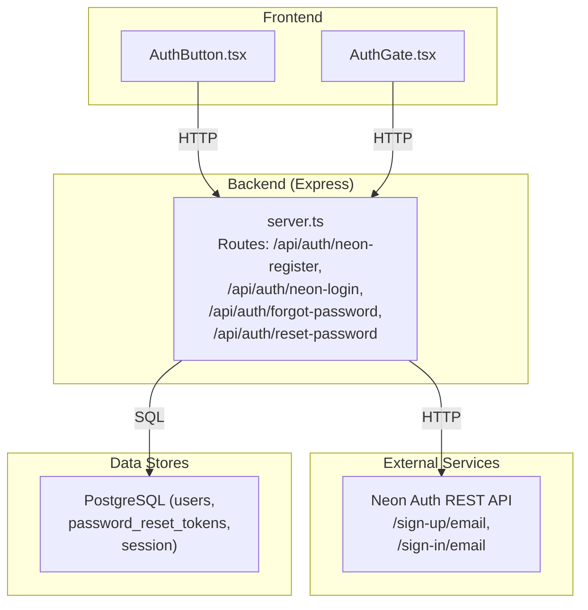
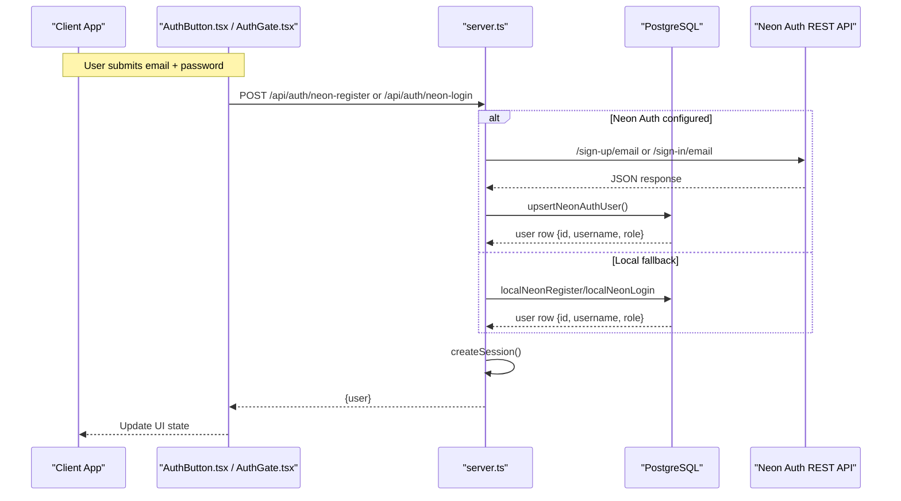
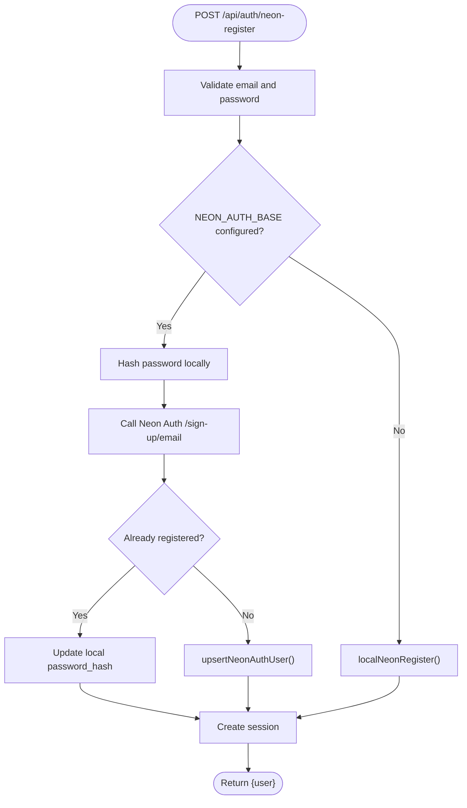
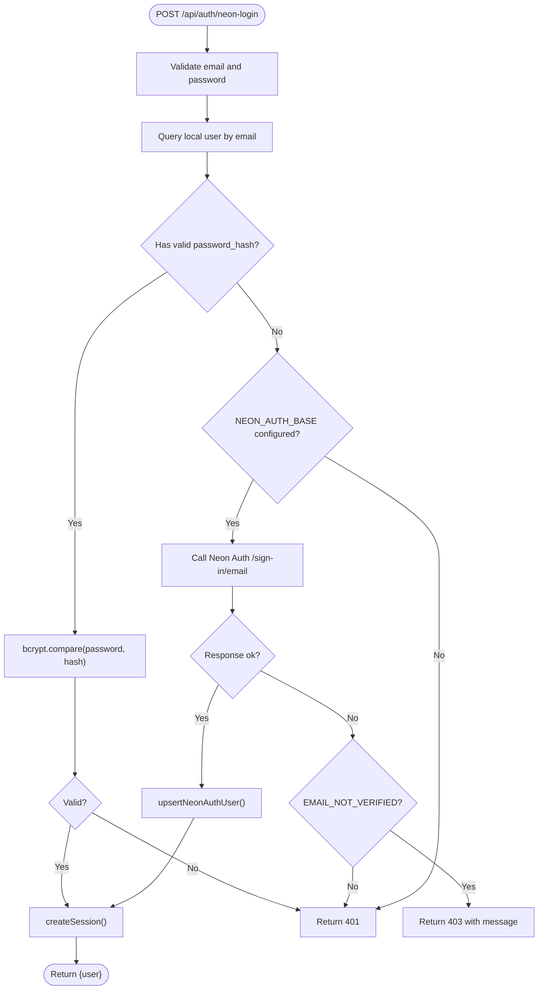
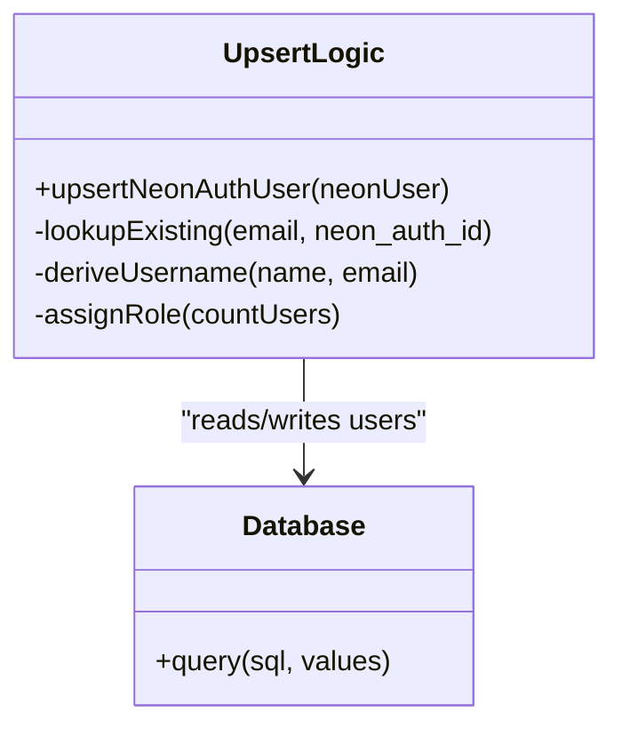
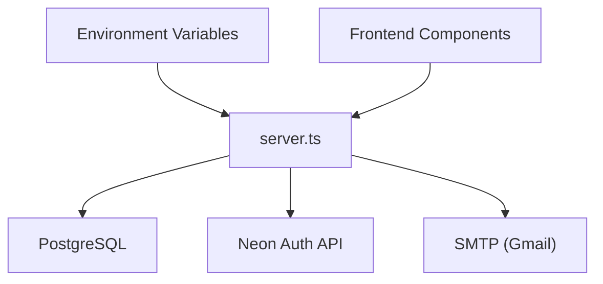

# Neon Auth Integration

<cite>
**Referenced Files in This Document**
- [server.ts](file://server.ts)
- [AuthButton.tsx](file://src/components/AuthButton.tsx)
- [AuthGate.tsx](file://src/components/AuthGate.tsx)
- [generate-env.mjs](file://scripts/generate-env.mjs)
- [sync-secrets.mjs](file://scripts/sync-secrets.mjs)
- [SettingsTab.tsx](file://src/components/SettingsTab.tsx)
</cite>

## Table of Contents
1. [Introduction](#introduction)
2. [Project Structure](#project-structure)
3. [Core Components](#core-components)
4. [Architecture Overview](#architecture-overview)
5. [Detailed Component Analysis](#detailed-component-analysis)
6. [Dependency Analysis](#dependency-analysis)
7. [Performance Considerations](#performance-considerations)
8. [Troubleshooting Guide](#troubleshooting-guide)
9. [Conclusion](#conclusion)
10. [Appendices](#appendices)

## Introduction
This document explains the Neon Auth integration that provides email-based authentication as an alternative to traditional username/password flows. The system implements a dual-path architecture:
- Path A (Neon Auth): Requests are proxied server-side to the Neon Auth REST API for sign-up and sign-in, then synchronized into the local PostgreSQL users table so CRM role management remains consistent.
- Path B (Local fallback): When Neon Auth is not configured, the endpoints fall back to local bcrypt-based authentication against the same users table.

The login flow uses a local-first optimization: if a local password hash exists, authentication completes without calling Neon Auth, avoiding external latency. Registration always stores a local bcrypt hash to support offline verification and email-not-verified fallback scenarios. Upsert logic ensures neon_auth_id mapping and role consistency across systems.

## Project Structure
The Neon Auth integration is implemented primarily on the server side with Express routes and database operations, while the frontend components provide UI for login/register/forgot-password flows and route between Supabase, legacy username/password endpoints, and the new Neon Auth endpoints when available.

**Diagram sources**
- [server.ts:394-748](file://server.ts#L394-L748)
- [AuthButton.tsx:62-145](file://src/components/AuthButton.tsx#L62-L145)
- [AuthGate.tsx:46-115](file://src/components/AuthGate.tsx#L46-L115)

**Section sources**
- [server.ts:1-125](file://server.ts#L1-L125)
- [AuthButton.tsx:1-145](file://src/components/AuthButton.tsx#L1-L145)
- [AuthGate.tsx:1-115](file://src/components/AuthGate.tsx#L1-L115)

## Core Components
- Server routes for Neon Auth registration and login with dual-path behavior.
- Local-only fallback functions for register/login when Neon Auth is not configured.
- Session creation helper with timeout guard for robustness.
- Password reset flow using secure tokens and email delivery.
- Frontend components that choose between Supabase, legacy endpoints, or Neon Auth based on availability and input type.

Key responsibilities:
- Validate inputs (email format, password length).
- Hash passwords locally with bcrypt for fast local verification and fallback.
- Call Neon Auth REST endpoints only when necessary.
- Upsert user records to maintain neon_auth_id mapping and roles.
- Create sessions persisted in PostgreSQL via connect-pg-simple.

**Section sources**
- [server.ts:394-748](file://server.ts#L394-L748)
- [server.ts:547-591](file://server.ts#L547-L591)
- [server.ts:750-791](file://server.ts#L750-L791)

## Architecture Overview
The system supports two authentication paths controlled by environment variables:
- If NEON_AUTH_BASE_URL or VITE_NEON_AUTH_URL is set, Neon Auth is used for identity provisioning; otherwise, local bcrypt auth is used.
- Login prefers local bcrypt comparison when a hash exists, skipping external calls for speed.
- Registration always hashes locally and either calls Neon Auth or falls back to local storage.

**Diagram sources**
- [server.ts:594-680](file://server.ts#L594-L680)
- [server.ts:683-748](file://server.ts#L683-L748)
- [server.ts:408-470](file://server.ts#L408-L470)
- [AuthButton.tsx:62-145](file://src/components/AuthButton.tsx#L62-L145)
- [AuthGate.tsx:46-115](file://src/components/AuthGate.tsx#L46-L115)

## Detailed Component Analysis

### Dual-Path Registration Flow (/api/auth/neon-register)
- Validates email presence and basic format, enforces minimum password length.
- If Neon Auth base URL is configured:
  - Hashes password locally for fallback capability.
  - Calls Neon Auth /sign-up/email endpoint.
  - Handles already-registered responses by updating local password_hash and creating session.
  - On success, upserts user into local users table and creates session.
- If Neon Auth is not configured:
  - Uses localNeonRegister to create user with hashed password and appropriate role.

**Diagram sources**
- [server.ts:594-680](file://server.ts#L594-L680)
- [server.ts:408-470](file://server.ts#L408-L470)

**Section sources**
- [server.ts:594-680](file://server.ts#L594-L680)

### Dual-Path Login Flow (/api/auth/neon-login)
- Validates email and password presence.
- Local-first optimization:
  - Queries local users table for password_hash.
  - If present and valid, compares password with bcrypt and returns session immediately.
- If no local hash or verification fails:
  - Calls Neon Auth /sign-in/email when configured.
  - Handles EMAIL_NOT_VERIFIED by instructing user to register first.
  - On success, upserts user and creates session.
- If Neon Auth is not configured and local hash missing/invalid, returns unauthorized.

**Diagram sources**
- [server.ts:683-748](file://server.ts#L683-L748)

**Section sources**
- [server.ts:683-748](file://server.ts#L683-L748)

### Upsert Logic and Role Management (upsertNeonAuthUser)
- Looks up existing record by neon_auth_id or email.
- Updates neon_auth_id, email, and optionally password_hash to keep them in sync.
- For new users, determines role: first user becomes admin, others become user.
- Derives a unique username from name or email prefix, ensuring uniqueness.
- Inserts user with fields: username, password_hash, role, email, neon_auth_id.

**Diagram sources**
- [server.ts:408-470](file://server.ts#L408-L470)

**Section sources**
- [server.ts:408-470](file://server.ts#L408-L470)

### Local Fallback Functions
- localNeonRegister:
  - Checks for duplicate email.
  - Generates unique username.
  - Hashes password and inserts user with role assignment.
  - Uses transaction and table lock to prevent race conditions.
- localNeonLogin:
  - Retrieves user by email.
  - Compares password against stored hash.
  - Returns user or throws unauthorized error.

**Section sources**
- [server.ts:472-545](file://server.ts#L472-L545)

### Session Creation Helper (createSession)
- Regenerates session securely.
- Persists userId, username, role in session store (PostgreSQL-backed).
- Includes a 5-second timeout to ensure response even if session persistence fails.
- Logs errors but still returns user data to avoid blocking successful auth flows.

**Section sources**
- [server.ts:547-591](file://server.ts#L547-L591)

### Password Reset Flow
- /api/auth/forgot-password:
  - Validates email format.
  - Finds user by email (case-insensitive).
  - Invalidates previous unused tokens.
  - Generates random token, hashes it, stores with expiration.
  - Sends email via SMTP (Gmail) with reset link.
- /api/auth/reset-password:
  - Validates token and new password.
  - Verifies token hash and expiration.
  - Updates user password hash.
  - Marks token as used.

**Section sources**
- [server.ts:750-791](file://server.ts#L750-L791)

### Frontend Integration
- AuthButton.tsx:
  - Detects email vs username input.
  - Uses Supabase for email-based auth when available.
  - Falls back to server endpoints for non-email or when Supabase is unavailable.
  - Dispatches auth-changed events to update UI state.
- AuthGate.tsx:
  - Provides login/register/forgot/reset UI.
  - Calls server endpoints for forgot-password and reset-password flows.
  - Handles reset_token URL parameter for password reset flow.

**Section sources**
- [AuthButton.tsx:62-145](file://src/components/AuthButton.tsx#L62-L145)
- [AuthGate.tsx:46-115](file://src/components/AuthGate.tsx#L46-L115)

## Dependency Analysis
The Neon Auth integration depends on several key dependencies and configuration points:

**Diagram sources**
- [server.ts:1-125](file://server.ts#L1-L125)
- [generate-env.mjs:10-25](file://scripts/generate-env.mjs#L10-L25)
- [sync-secrets.mjs:26-45](file://scripts/sync-secrets.mjs#L26-L45)

**Section sources**
- [server.ts:1-125](file://server.ts#L1-L125)
- [generate-env.mjs:10-25](file://scripts/generate-env.mjs#L10-L25)
- [sync-secrets.mjs:26-45](file://scripts/sync-secrets.mjs#L26-L45)

## Performance Considerations
- Local-first login optimization avoids ~4s external round-trip to Neon Auth when local hash exists.
- bcrypt hashing is performed locally during registration to enable offline verification.
- Session persistence includes timeout guard to prevent hanging requests.
- Database queries use efficient lookups by email and neon_auth_id.
- Transaction locks prevent race conditions during user creation.

[No sources needed since this section provides general guidance]

## Troubleshooting Guide
Common issues and resolutions:

- **Neon Auth not configured**: System falls back to local bcrypt auth automatically. Ensure NEON_AUTH_BASE_URL or VITE_NEON_AUTH_URL is set to enable Neon Auth path.
- **Email validation errors**: Verify email format includes "@" symbol. Minimum password length is 8 characters.
- **Session persistence failures**: Check DATABASE_URL and SESSION_SECRET configuration. Session store uses PostgreSQL via connect-pg-simple.
- **SMTP configuration**: Ensure SMTP_USER and SMTP_PASS are set for password reset emails. Gmail SMTP requires proper credentials.
- **CORS issues**: Neon Auth calls are made server-side to avoid CORS problems. Verify APP_URL is correctly set for Origin headers.
- **Database connection**: Confirm DATABASE_URL is properly configured with SSL settings for production environments.

**Section sources**
- [server.ts:24-35](file://server.ts#L24-L35)
- [server.ts:133-143](file://server.ts#L133-L143)
- [server.ts:107-125](file://server.ts#L107-L125)

## Conclusion
The Neon Auth integration provides a robust, dual-path authentication system that seamlessly switches between external identity provisioning and local fallback. The local-first optimization ensures fast logins while maintaining security through bcrypt hashing. The upsert logic maintains consistency between Neon Auth and local databases, preserving user roles and mappings. Comprehensive error handling and configuration flexibility make this system suitable for both development and production environments.

[No sources needed since this section summarizes without analyzing specific files]

## Appendices

### Configuration Requirements
Required environment variables:
- DATABASE_URL: PostgreSQL connection string
- SESSION_SECRET: Random string for session cookie signing
- NEON_AUTH_BASE_URL or VITE_NEON_AUTH_URL: Neon Auth endpoint (optional)
- SMTP_USER and SMTP_PASS: Gmail SMTP credentials for password reset
- APP_URL: Application base URL for redirect links

Optional environment variables:
- NODE_ENV: Set to "production" for SSL configuration
- PORT: Server port (default 3000)

**Section sources**
- [generate-env.mjs:10-25](file://scripts/generate-env.mjs#L10-L25)
- [sync-secrets.mjs:26-45](file://scripts/sync-secrets.mjs#L26-L45)
- [SettingsTab.tsx:138-165](file://src/components/SettingsTab.tsx#L138-L165)

### API Endpoints Summary
- POST /api/auth/neon-register: Email-based registration with dual-path support
- POST /api/auth/neon-login: Email-based login with local-first optimization
- POST /api/auth/forgot-password: Password reset request
- POST /api/auth/reset-password: Password reset completion

**Section sources**
- [server.ts:594-680](file://server.ts#L594-L680)
- [server.ts:683-748](file://server.ts#L683-L748)
- [server.ts:750-791](file://server.ts#L750-L791)