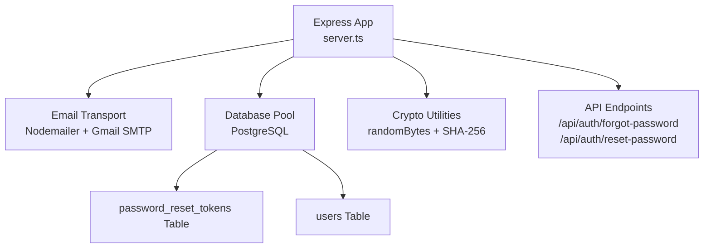
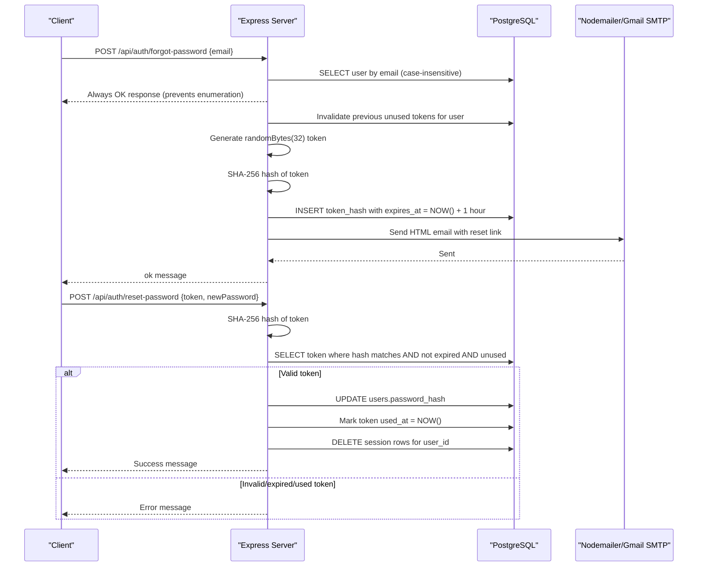
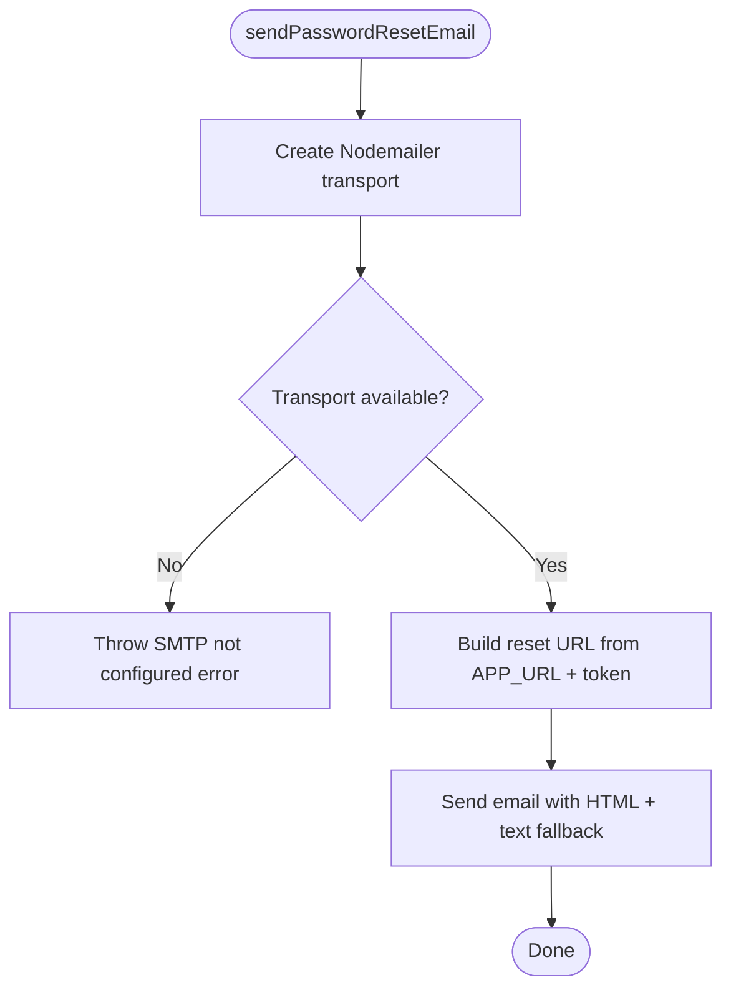
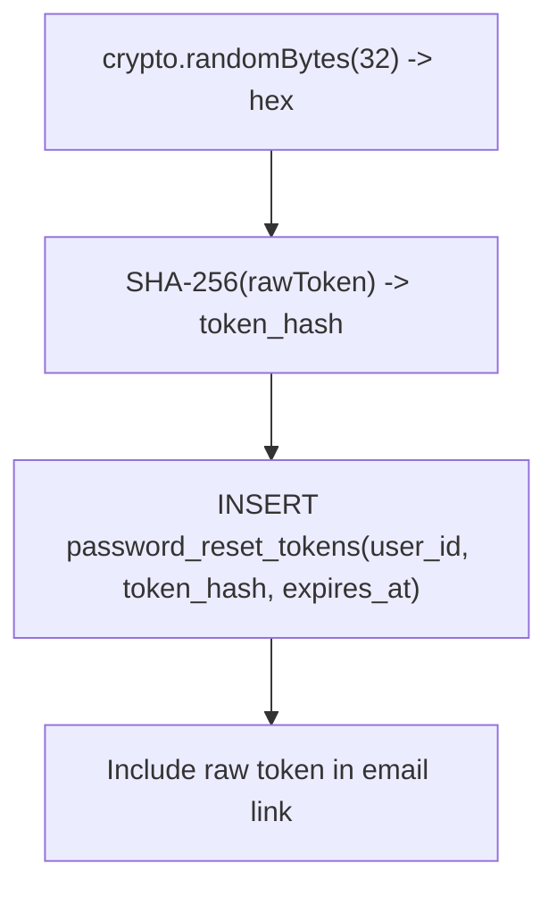
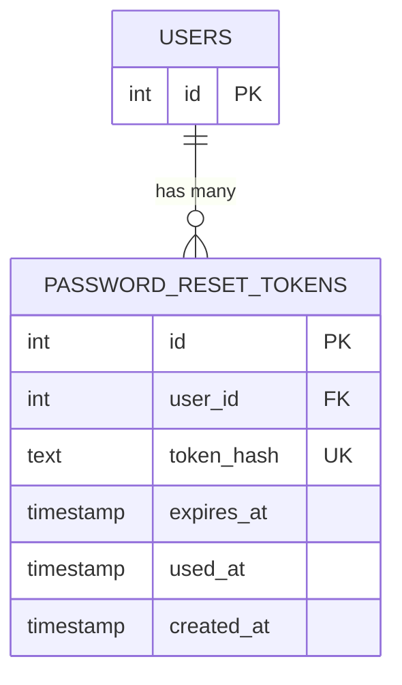
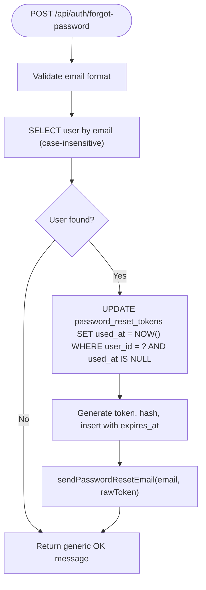
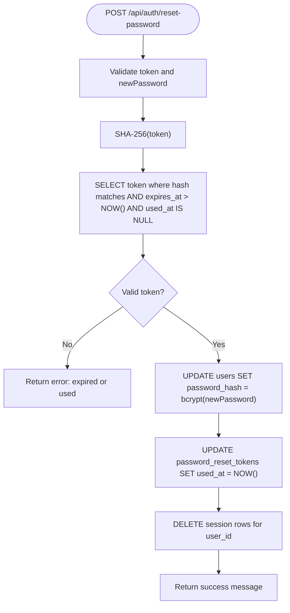
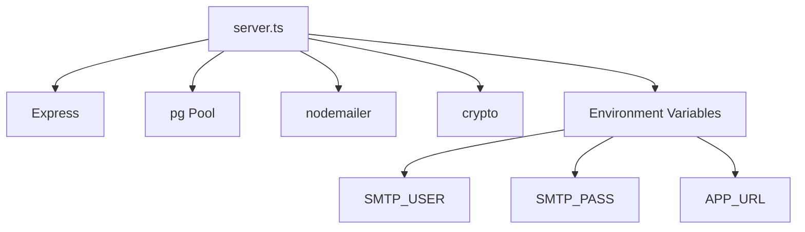

# Password Reset System

<cite>
**Referenced Files in This Document**
- [server.ts](file://server.ts)
- [setup-check.mjs](file://scripts/setup-check.mjs)
</cite>

## Table of Contents
1. [Introduction](#introduction)
2. [Project Structure](#project-structure)
3. [Core Components](#core-components)
4. [Architecture Overview](#architecture-overview)
5. [Detailed Component Analysis](#detailed-component-analysis)
6. [Dependency Analysis](#dependency-analysis)
7. [Performance Considerations](#performance-considerations)
8. [Troubleshooting Guide](#troubleshooting-guide)
9. [Conclusion](#conclusion)
10. [Appendices](#appendices)

## Introduction
This document explains the secure password reset system implemented in the application. It covers token generation with cryptographically secure randomness, hashing for storage, one-hour expiration, email delivery via Nodemailer and Gmail SMTP, HTML template rendering with fallback text content, and the end-to-end flow from request initiation through token validation to password update. Security measures such as preventing email enumeration and invalidating previous unused tokens are detailed. The database schema for password_reset_tokens, query optimization strategies, error handling approaches, and required environment variables (SMTP settings and APP_URL) are also documented.

## Project Structure
The password reset functionality is implemented server-side within a single Express application file. Key responsibilities include:
- Email transport configuration and sending
- Token generation and hashing
- Database operations for token lifecycle management
- API endpoints for initiating and completing password resets
- Environment-driven configuration for SMTP and application URL

**Diagram sources**
- [server.ts:130-207](file://server.ts#L130-L207)
- [server.ts:750-830](file://server.ts#L750-L830)
- [server.ts:3446-3460](file://server.ts#L3446-L3460)

**Section sources**
- [server.ts:1-120](file://server.ts#L1-L120)
- [server.ts:130-207](file://server.ts#L130-L207)
- [server.ts:750-830](file://server.ts#L750-L830)
- [server.ts:3446-3460](file://server.ts#L3446-L3460)

## Core Components
- Email transport and sending: Configured via Nodemailer using Gmail SMTP; constructs an HTML email with a reset link and includes plain-text fallback.
- Token generation and hashing: Uses crypto.randomBytes(32) to generate a secure raw token; stores only its SHA-256 hash in the database.
- Database schema and indexes: Maintains password_reset_tokens with fields for user association, hashed token, expiration, usage tracking, and creation time; includes indexes for performance.
- API endpoints:
  - /api/auth/forgot-password: Validates input, prevents enumeration, invalidates prior unused tokens, generates and stores a new token, and sends the email.
  - /api/auth/reset-password: Validates token and new password, verifies token validity and expiry, updates the user’s password, marks the token used, and invalidates active sessions.

**Section sources**
- [server.ts:130-207](file://server.ts#L130-L207)
- [server.ts:750-830](file://server.ts#L750-L830)
- [server.ts:3446-3460](file://server.ts#L3446-L3460)

## Architecture Overview
The password reset flow is a two-step process:
1. Request initiation: Client calls /api/auth/forgot-password with an email. The server validates input, ensures no enumeration occurs, invalidates any existing unused tokens for that user, generates a secure token, hashes it, stores it with a one-hour expiry, and emails the reset link.
2. Token validation and password update: Client calls /api/auth/reset-password with the token and a new password. The server hashes the token, looks up a valid, non-expired, unused token, updates the user’s password, marks the token as used, and clears active sessions for security.

**Diagram sources**
- [server.ts:750-830](file://server.ts#L750-L830)
- [server.ts:130-207](file://server.ts#L130-L207)
- [server.ts:3446-3460](file://server.ts#L3446-L3460)

## Detailed Component Analysis

### Email Delivery System (Nodemailer + Gmail SMTP)
- Transport configuration:
  - Host: smtp.gmail.com
  - Port: 587
  - Secure: false (STARTTLS)
  - Auth: user and pass from environment variables
- Email content:
  - HTML template with branding, instructions, and a reset button linking to APP_URL?reset_token=...
  - Plain-text fallback included for clients that do not render HTML
- Behavior:
  - If SMTP_USER or SMTP_PASS are missing, the function throws an error indicating SMTP is not configured
  - Base URL is derived from APP_URL with trailing slash removed; defaults to a safe fallback if not set

**Diagram sources**
- [server.ts:130-207](file://server.ts#L130-L207)

**Section sources**
- [server.ts:130-207](file://server.ts#L130-L207)

### Token Generation and Storage
- Raw token generation:
  - Uses crypto.randomBytes(32) to produce a cryptographically secure token
  - Converted to hex string for transmission in URLs
- Hashing and storage:
  - SHA-256 hash of the raw token is stored in password_reset_tokens.token_hash
  - Expiration set to one hour from current time
- Security considerations:
  - Only the hash is persisted; raw token never touches the database
  - One-hour expiry limits the window of misuse

**Diagram sources**
- [server.ts:750-791](file://server.ts#L750-L791)
- [server.ts:3446-3460](file://server.ts#L3446-L3460)

**Section sources**
- [server.ts:750-791](file://server.ts#L750-L791)
- [server.ts:3446-3460](file://server.ts#L3446-L3460)

### Database Schema for password_reset_tokens
- Fields:
  - id: SERIAL PRIMARY KEY
  - user_id: INTEGER NOT NULL REFERENCES users(id) ON DELETE CASCADE
  - token_hash: TEXT NOT NULL UNIQUE
  - expires_at: TIMESTAMP NOT NULL
  - used_at: TIMESTAMP (nullable)
  - created_at: TIMESTAMP NOT NULL DEFAULT NOW()
- Indexes:
  - idx_prt_token_hash on token_hash
  - idx_prt_user_id on user_id
- Purpose:
  - Stores hashed tokens with expiration and usage tracking
  - Enables efficient lookups by token hash and user_id

**Diagram sources**
- [server.ts:3446-3460](file://server.ts#L3446-L3460)

**Section sources**
- [server.ts:3446-3460](file://server.ts#L3446-L3460)

### Forgot Password Endpoint (/api/auth/forgot-password)
- Input validation:
  - Ensures email is a string and contains "@"
- Enumeration prevention:
  - Always returns a success-like JSON even if the email does not exist
- Token lifecycle:
  - Invalidates any previous unused tokens for the user by setting used_at
  - Generates a new secure token and stores its hash with a one-hour expiry
- Email dispatch:
  - Sends HTML email with reset link and plain-text fallback

**Diagram sources**
- [server.ts:750-791](file://server.ts#L750-L791)

**Section sources**
- [server.ts:750-791](file://server.ts#L750-L791)

### Reset Password Endpoint (/api/auth/reset-password)
- Input validation:
  - Ensures token is a string with sufficient length
  - Ensures newPassword is a string with minimum length
- Token verification:
  - Hashes incoming token and queries for a matching, non-expired, unused token
- Password update:
  - Hashes newPassword and updates users.password_hash
  - Marks the token as used by setting used_at
  - Invalidates all active sessions for the user by deleting session rows containing the user_id
- Responses:
  - Returns success or appropriate error messages

**Diagram sources**
- [server.ts:793-830](file://server.ts#L793-L830)

**Section sources**
- [server.ts:793-830](file://server.ts#L793-L830)

### Security Measures
- Cryptographic token generation:
  - Uses crypto.randomBytes(32) for high entropy
- Secure storage:
  - Only SHA-256 hash stored; raw token never persisted
- Expiration policy:
  - Tokens expire after one hour
- Enumeration prevention:
  - Generic responses regardless of whether the email exists
- Token invalidation:
  - Previous unused tokens invalidated when a new request is made
  - Used tokens marked and cannot be reused
- Session invalidation:
  - Active sessions destroyed upon successful password change

**Section sources**
- [server.ts:750-830](file://server.ts#L750-L830)

## Dependency Analysis
The password reset system depends on several core modules and configurations:
- Express for routing and middleware
- PostgreSQL via pg pool for data persistence
- Nodemailer for email delivery
- Crypto utilities for secure token generation and hashing
- Environment variables for SMTP credentials and application URL

**Diagram sources**
- [server.ts:1-20](file://server.ts#L1-L20)
- [server.ts:130-207](file://server.ts#L130-L207)
- [server.ts:750-830](file://server.ts#L750-L830)

**Section sources**
- [server.ts:1-20](file://server.ts#L1-L20)
- [server.ts:130-207](file://server.ts#L130-L207)
- [server.ts:750-830](file://server.ts#L750-L830)

## Performance Considerations
- Database indexes:
  - token_hash and user_id indexes optimize lookup and invalidation queries
- Query efficiency:
  - Case-insensitive email lookup uses LOWER() for consistent matching
- Token lifecycle:
  - One-hour expiry reduces long-lived token risks
- Session cleanup:
  - Deleting session rows ensures immediate logout after password change

[No sources needed since this section provides general guidance]

## Troubleshooting Guide
Common issues and resolutions:
- SMTP not configured:
  - Ensure SMTP_USER and SMTP_PASS are set; otherwise, sendPasswordResetEmail will throw an error
- APP_URL misconfiguration:
  - Reset links may point to incorrect domains; verify APP_URL is set correctly
- Token invalid or expired:
  - Ensure the client passes the correct token and that the request occurs within one hour
- Enumeration protection:
  - Generic responses prevent revealing whether an email exists; adjust client logic accordingly
- Session invalidation:
  - After password reset, users must log in again; ensure frontend handles re-authentication

**Section sources**
- [server.ts:130-207](file://server.ts#L130-L207)
- [server.ts:750-830](file://server.ts#L750-L830)

## Conclusion
The password reset system implements robust security practices including cryptographic token generation, hashed storage, strict expiration policies, and careful handling of email delivery. It prevents information leakage through enumeration protections and ensures token reuse is blocked. The database schema and indexes support efficient operations, while environment configuration enables flexible deployment across different SMTP providers and application URLs.

[No sources needed since this section summarizes without analyzing specific files]

## Appendices

### Configuration Requirements
- SMTP settings:
  - SMTP_USER: Email address or API key for Gmail SMTP authentication
  - SMTP_PASS: Password or app-specific password for Gmail SMTP
- Application URL:
  - APP_URL: Public base URL used to construct reset links in emails

These variables are validated and documented in the setup script.

**Section sources**
- [setup-check.mjs:94-116](file://scripts/setup-check.mjs#L94-L116)
- [server.ts:130-207](file://server.ts#L130-L207)