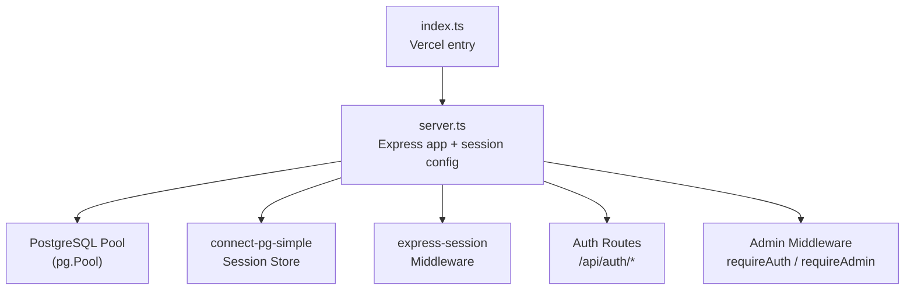
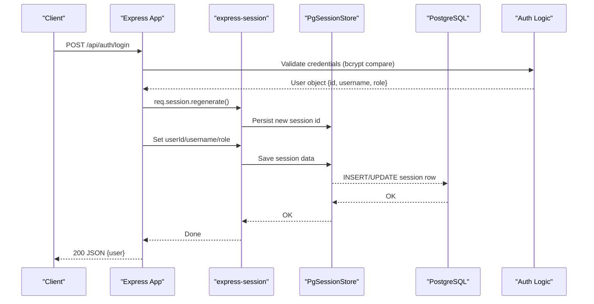
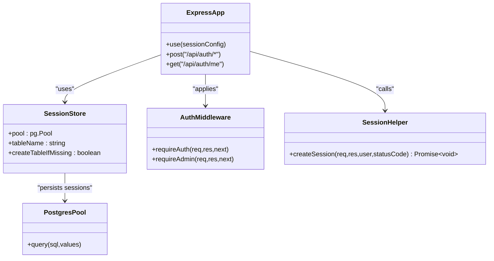
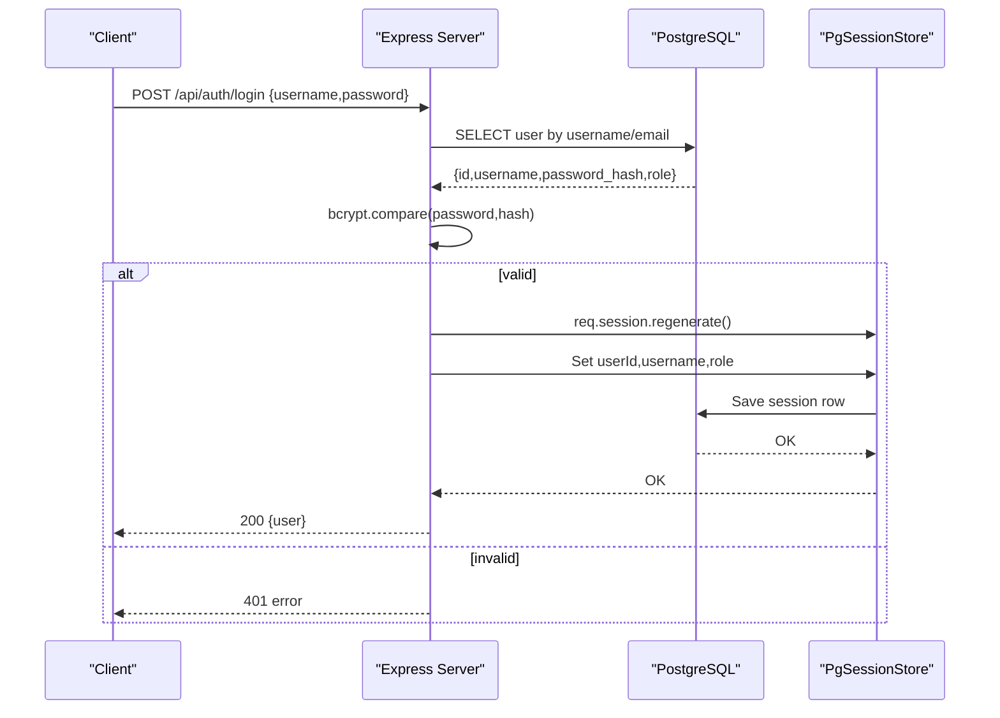
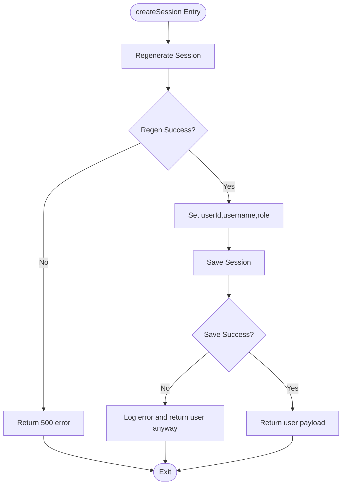

# Session Management & Security

<cite>
**Referenced Files in This Document**
- [server.ts](file://server.ts)
- [index.ts](file://index.ts)
- [package.json](file://package.json)
- [generate-env.mjs](file://scripts/generate-env.mjs)
</cite>

## Table of Contents
1. [Introduction](#introduction)
2. [Project Structure](#project-structure)
3. [Core Components](#core-components)
4. [Architecture Overview](#architecture-overview)
5. [Detailed Component Analysis](#detailed-component-analysis)
6. [Dependency Analysis](#dependency-analysis)
7. [Performance Considerations](#performance-considerations)
8. [Troubleshooting Guide](#troubleshooting-guide)
9. [Conclusion](#conclusion)
10. [Appendices](#appendices)

## Introduction
This document explains the session management system built on express-session with PostgreSQL persistence via connect-pg-simple. It covers configuration, cookie security, session store setup, authentication middleware, session regeneration, timeout handling, and error recovery. It also provides security best practices, performance considerations, and debugging techniques for session-related issues.

## Project Structure
The session system is implemented primarily in the Express server entrypoint and initialized during application startup. The server configures the database pool, the session store, and registers authentication routes and middleware. A Vercel-compatible entry point initializes required tables before exporting the app.

**Diagram sources**
- [index.ts:1-20](file://index.ts#L1-L20)
- [server.ts:18-35](file://server.ts#L18-L35)
- [server.ts:112-125](file://server.ts#L112-L125)

**Section sources**
- [index.ts:1-20](file://index.ts#L1-L20)
- [server.ts:18-35](file://server.ts#L18-L35)

## Core Components
- Session configuration: secret, cookie options (httpOnly, secure, sameSite), duration, resave/saveUninitialized behavior.
- Session store: connect-pg-simple backed by a pg.Pool with automatic table creation.
- Authentication middleware: requireAuth checks session identity; requireAdmin enforces role by querying the database on each request.
- Session lifecycle helpers: createSession Promise-based helper with timeout guard; session regeneration after login/register; logout destroys session and clears cookie.
- Environment and secrets: SESSION_SECRET sourced from environment with development fallback warning; DATABASE_URL used to configure pg.Pool and session store.

**Section sources**
- [server.ts:107-125](file://server.ts#L107-L125)
- [server.ts:24-35](file://server.ts#L24-L35)
- [server.ts:209-235](file://server.ts#L209-L235)
- [server.ts:547-591](file://server.ts#L547-L591)
- [server.ts:383-392](file://server.ts#L383-L392)
- [generate-env.mjs:10-25](file://scripts/generate-env.mjs#L10-L25)

## Architecture Overview
The server initializes a PostgreSQL connection pool and a connect-pg-simple session store when DATABASE_URL is present. express-session middleware is configured with a strong secret and secure cookie settings. Authentication endpoints use bcrypt for password hashing, regenerate sessions to prevent fixation, and persist user identity into the session. Admin access is enforced by re-checking roles against the database on every request.

**Diagram sources**
- [server.ts:340-381](file://server.ts#L340-L381)
- [server.ts:547-591](file://server.ts#L547-L591)
- [server.ts:24-35](file://server.ts#L24-L35)

## Detailed Component Analysis

### Session Configuration and Cookie Security
- Secret management: SESSION_SECRET is read from environment variables; a development fallback logs a warning if not set.
- Cookie settings: httpOnly enabled; secure set based on NODE_ENV; sameSite set to lax; maxAge set to 7 days.
- Session behavior: resave=false and saveUninitialized=false to avoid unnecessary writes and empty sessions.

Security implications:
- Always provide a strong SESSION_SECRET in production.
- Ensure HTTPS is enabled so secure cookies are sent only over TLS.
- sameSite=lax mitigates CSRF while allowing top-level navigation.

**Section sources**
- [server.ts:107-125](file://server.ts#L107-L125)
- [generate-env.mjs:10-25](file://scripts/generate-env.mjs#L10-L25)

### Session Store Setup with PostgreSQL
- Database pool: pg.Pool configured with connectionString and SSL toggled in production.
- connect-pg-simple: PgSessionStore created with pool, tableName="session", and createTableIfMissing=true.
- Fallback mode: If DATABASE_URL is missing, a mock pgPool is used and sessionStore is undefined (in-memory behavior).

Operational notes:
- Automatic table creation ensures schema readiness without manual migrations.
- Connection pooling improves concurrency and reduces latency under load.

**Section sources**
- [server.ts:24-35](file://server.ts#L24-L35)

### Authentication Middleware: requireAuth and requireAdmin
- requireAuth: Returns 401 if userId is absent from session; otherwise proceeds.
- requireAdmin: Validates userId presence, queries the users table for current role, returns 403 if not admin, updates session.role, and continues. Errors return 500.

Real-time role verification:
- Role is fetched from the database per request, ensuring immediate effect of role changes without requiring re-login.

**Section sources**
- [server.ts:209-235](file://server.ts#L209-L235)

### Session Lifecycle: Regeneration, Timeout Handling, and Logout
- Session regeneration: Used after login and registration to prevent session fixation attacks.
- createSession helper: Wraps regeneration and save in a Promise with a 5-second timeout to ensure responses even if the store callback stalls. On timeout or save errors, it still returns user data to avoid hanging requests.
- Logout: Destroys the session and clears the connect.sid cookie.

Error recovery:
- Timeouts and save errors are handled gracefully to maintain responsiveness.
- Logging captures failures for diagnostics.

**Section sources**
- [server.ts:340-381](file://server.ts#L340-L381)
- [server.ts:547-591](file://server.ts#L547-L591)
- [server.ts:383-392](file://server.ts#L383-L392)

### Password Reset Flow and Session Invalidation
- Forgot password: Generates a secure token hash, stores expiration, and sends email.
- Reset password: Validates token, hashes new password, marks token used, and deletes active sessions for the user by removing matching rows from the session table.

Security benefits:
- Token hashing prevents leakage of raw tokens.
- Session invalidation forces re-authentication after password change.

**Section sources**
- [server.ts:753-830](file://server.ts#L753-L830)

### Class Diagram: Session and Auth Components

**Diagram sources**
- [server.ts:112-125](file://server.ts#L112-L125)
- [server.ts:24-35](file://server.ts#L24-L35)
- [server.ts:209-235](file://server.ts#L209-L235)
- [server.ts:547-591](file://server.ts#L547-L591)

### Sequence Diagram: Login Flow with Session Regeneration

**Diagram sources**
- [server.ts:340-381](file://server.ts#L340-L381)
- [server.ts:547-591](file://server.ts#L547-L591)

### Flowchart: Session Creation Helper with Timeout Guard

**Diagram sources**
- [server.ts:547-591](file://server.ts#L547-L591)

## Dependency Analysis
Key dependencies involved in session management:
- express-session: Provides session middleware and cookie handling.
- connect-pg-simple: Adapter to persist sessions in PostgreSQL.
- pg: PostgreSQL client library used for connection pooling and queries.
- dotenv: Loads environment variables including SESSION_SECRET and DATABASE_URL.

Runtime initialization:
- index.ts runs database initialization functions before exporting the Express app for serverless environments.

**Section sources**
- [package.json:15-46](file://package.json#L15-L46)
- [index.ts:14-19](file://index.ts#L14-L19)

## Performance Considerations
- Connection pooling: Reuse connections via pg.Pool to reduce overhead.
- Avoid unnecessary saves: resave=false and saveUninitialized=false minimize writes.
- Short-lived sessions: Adjust maxAge according to security needs; shorter durations reduce risk but increase re-auth frequency.
- Role checks: Real-time DB lookups add latency; consider caching strategies with short TTLs if appropriate, while balancing consistency.
- Store timeouts: The 5-second timeout in createSession prevents hangs; monitor DB connectivity and adjust as needed.

[No sources needed since this section provides general guidance]

## Troubleshooting Guide
Common issues and remedies:
- Missing SESSION_SECRET: Development fallback warns; ensure a strong secret in production.
- No DATABASE_URL: Mock pool is used; sessions may not persist; configure DATABASE_URL for production.
- Session not persisting: Verify connect-pg-simple table creation and DB connectivity; check logs for save errors.
- Admin access denied: Confirm user role in the database; requireAdmin queries the DB on each request.
- Logout not clearing cookie: Ensure clearCookie("connect.sid") is called after destroy.
- Slow login/register: Check bcrypt cost and DB latency; review network calls to external auth providers if used.

Debugging tips:
- Enable debug logging for express-session and pg.
- Inspect session rows in the session table to verify persistence.
- Monitor console logs for session regeneration and save errors.

**Section sources**
- [server.ts:107-125](file://server.ts#L107-L125)
- [server.ts:24-35](file://server.ts#L24-L35)
- [server.ts:383-392](file://server.ts#L383-L392)
- [server.ts:547-591](file://server.ts#L547-L591)

## Conclusion
The session management system leverages express-session with PostgreSQL persistence for robust, scalable authentication. Secure cookie settings, strict secret management, and real-time role verification enhance security. The createSession helper and explicit session regeneration mitigate common vulnerabilities like fixation and improve resilience. Proper configuration and monitoring ensure reliable operation across environments.

[No sources needed since this section summarizes without analyzing specific files]

## Appendices
- Environment variables:
  - SESSION_SECRET: Strong random secret for signing sessions.
  - DATABASE_URL: PostgreSQL connection string for session persistence and user data.
  - NODE_ENV: Controls cookie secure flag and SSL settings.
  - APP_URL: Base URL used in password reset links.
  - SMTP_USER/SMTP_PASS: Email transport configuration for password resets.

- Initialization scripts:
  - generate-env.mjs auto-populates .env with defaults and generates SESSION_SECRET.

**Section sources**
- [generate-env.mjs:10-25](file://scripts/generate-env.mjs#L10-L25)
- [server.ts:107-125](file://server.ts#L107-L125)
- [server.ts:24-35](file://server.ts#L24-L35)