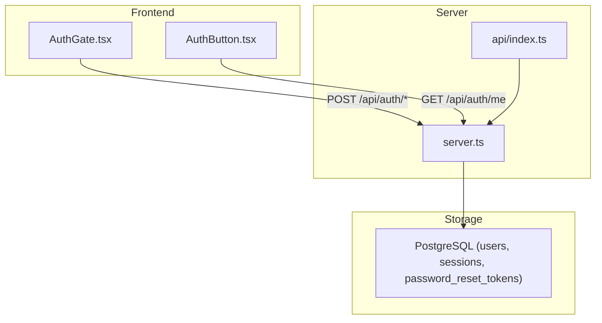
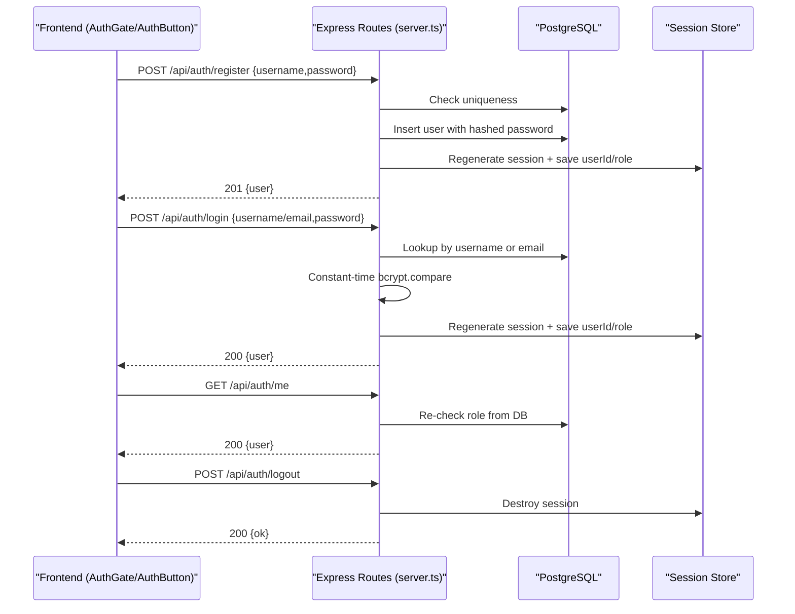
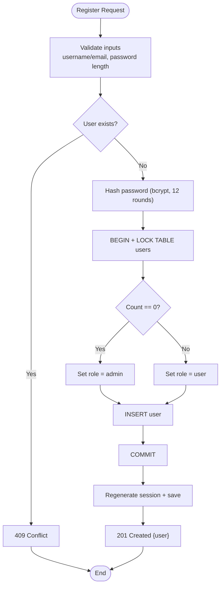
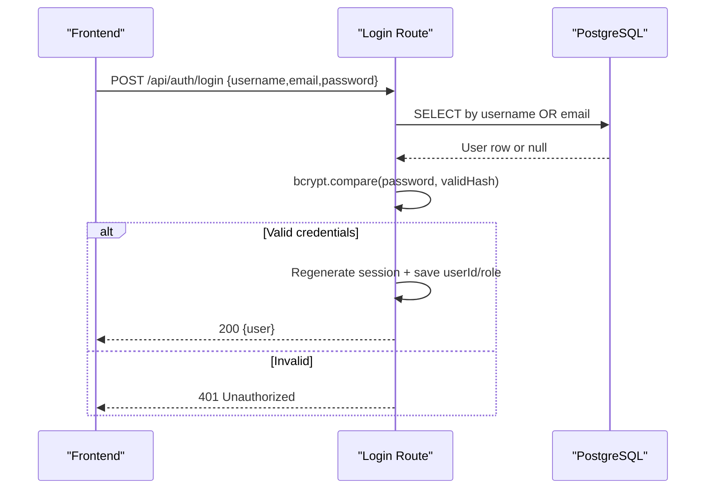
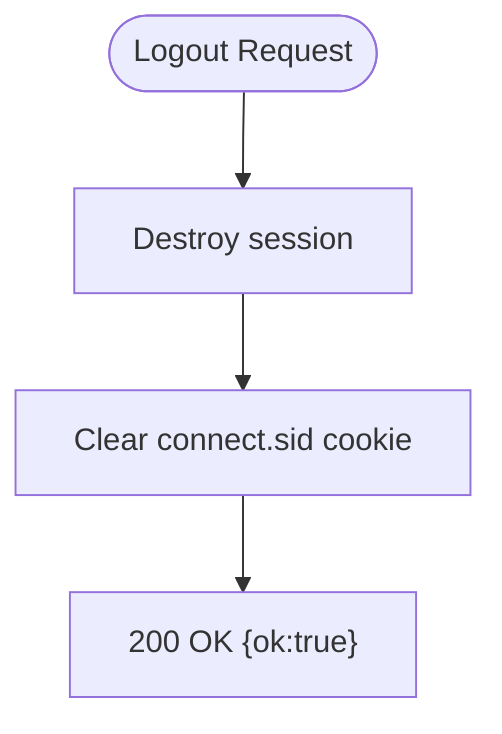
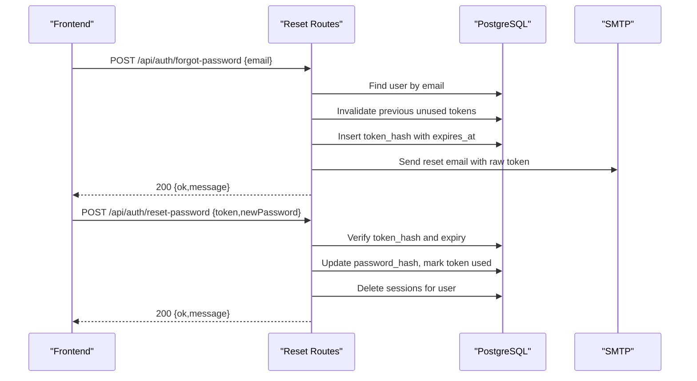
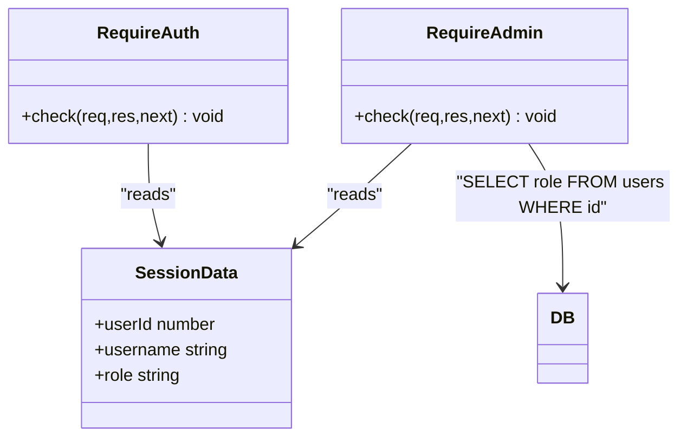
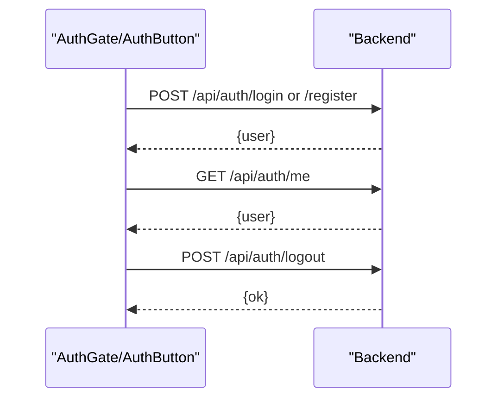
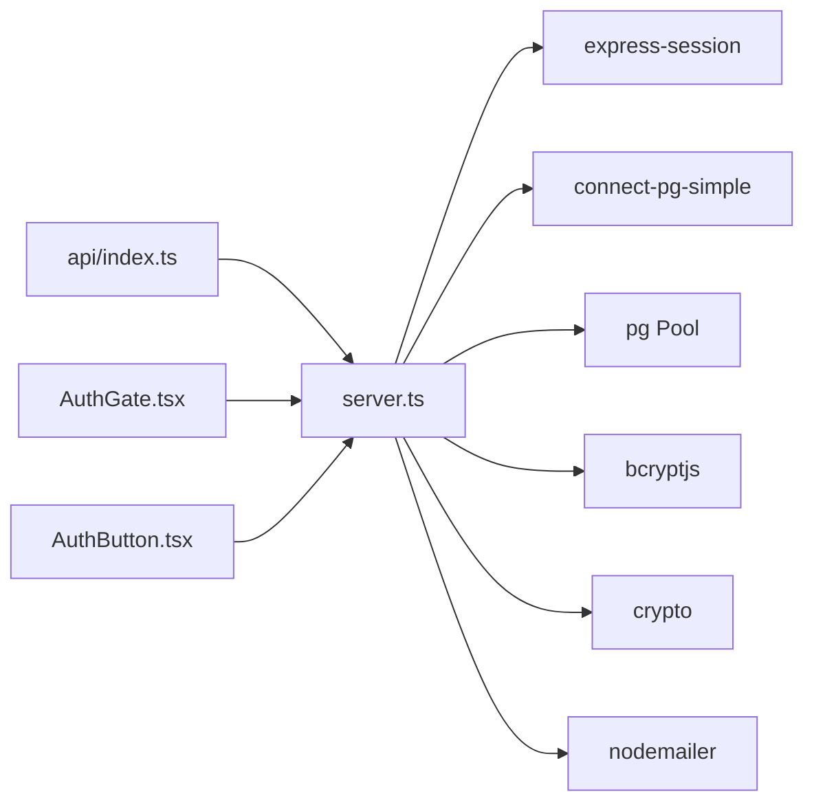

# Traditional Username/Password Authentication

<cite>
**Referenced Files in This Document**
- [server.ts](file://server.ts)
- [api/index.ts](file://api/index.ts)
- [src/components/AuthGate.tsx](file://src/components/AuthGate.tsx)
- [src/components/AuthButton.tsx](file://src/components/AuthButton.tsx)
</cite>

## Table of Contents
1. [Introduction](#introduction)
2. [Project Structure](#project-structure)
3. [Core Components](#core-components)
4. [Architecture Overview](#architecture-overview)
5. [Detailed Component Analysis](#detailed-component-analysis)
6. [Dependency Analysis](#dependency-analysis)
7. [Performance Considerations](#performance-considerations)
8. [Troubleshooting Guide](#troubleshooting-guide)
9. [Conclusion](#conclusion)

## Introduction
This document explains the traditional username/password authentication system implemented in the project. It covers registration with bcrypt hashing, username validation via regex, role-based access control where the first user becomes admin, login supporting both username and email, timing attack prevention through constant-time comparison, session regeneration on successful auth, logout with session destruction and cookie cleanup, and password reset flows. It also outlines security considerations such as CSRF protection, rate limiting strategies, and input validation patterns, and provides request/response examples and error handling approaches.

## Project Structure
The authentication system spans a Node/Express server that exposes REST endpoints and a React frontend that interacts with those endpoints. The server manages sessions (in-memory or PostgreSQL-backed), database operations for users and password reset tokens, and bcrypt-based password hashing. The frontend provides login/register UIs and optional Supabase integration when available.

**Diagram sources**
- [server.ts:1-5169](file://server.ts#L1-L5169)
- [api/index.ts:1-5](file://api/index.ts#L1-L5)
- [src/components/AuthGate.tsx:1-440](file://src/components/AuthGate.tsx#L1-L440)
- [src/components/AuthButton.tsx:1-384](file://src/components/AuthButton.tsx#L1-L384)

**Section sources**
- [server.ts:1-5169](file://server.ts#L1-L5169)
- [api/index.ts:1-5](file://api/index.ts#L1-L5)
- [src/components/AuthGate.tsx:1-440](file://src/components/AuthGate.tsx#L1-L440)
- [src/components/AuthButton.tsx:1-384](file://src/components/AuthButton.tsx#L1-L384)

## Core Components
- Server-side Express app with session middleware and PostgreSQL-backed session store.
- Registration endpoint with bcrypt hashing at 12 rounds and role assignment logic.
- Login endpoint supporting username or email with constant-time password comparison.
- Logout endpoint destroying sessions and clearing cookies.
- Password reset flow using secure tokens and email delivery.
- Frontend components AuthGate and AuthButton for user interactions.

Key responsibilities:
- Input validation and sanitization.
- Secure password storage and verification.
- Session lifecycle management.
- Role checks and admin-only enforcement.
- Error responses and safe messaging.

**Section sources**
- [server.ts:108-125](file://server.ts#L108-L125)
- [server.ts:266-338](file://server.ts#L266-L338)
- [server.ts:340-381](file://server.ts#L340-L381)
- [server.ts:383-392](file://server.ts#L383-L392)
- [server.ts:750-830](file://server.ts#L750-L830)
- [src/components/AuthGate.tsx:46-115](file://src/components/AuthGate.tsx#L46-L115)
- [src/components/AuthButton.tsx:28-47](file://src/components/AuthButton.tsx#L28-L47)

## Architecture Overview
The authentication architecture uses Express routes to handle credential-based authentication, bcrypt for password hashing, and express-session with PostgreSQL storage for sessions. The frontend calls these endpoints and maintains state based on responses.

**Diagram sources**
- [server.ts:266-338](file://server.ts#L266-L338)
- [server.ts:340-381](file://server.ts#L340-L381)
- [server.ts:832-851](file://server.ts#L832-L851)
- [server.ts:383-392](file://server.ts#L383-L392)

## Detailed Component Analysis

### Registration Flow
- Accepts username or email; validates format with regex and minimum length.
- Checks for existing account by username or email.
- Hashes password with bcrypt at 12 rounds.
- Assigns role: first user becomes admin; subsequent users get user role. Uses transaction and table lock to avoid race conditions.
- On success, regenerates session and sets userId, username, role; returns user object.

**Diagram sources**
- [server.ts:266-338](file://server.ts#L266-L338)

**Section sources**
- [server.ts:266-338](file://server.ts#L266-L338)

### Login Flow
- Accepts username or email in the username field.
- Looks up user by username or email.
- Performs constant-time password comparison using bcrypt.compare against either the stored hash or an invalid fallback hash to prevent timing attacks.
- On success, regenerates session and sets userId, username, role; returns user object.

**Diagram sources**
- [server.ts:340-381](file://server.ts#L340-L381)

**Section sources**
- [server.ts:340-381](file://server.ts#L340-L381)

### Logout Flow
- Destroys the current session.
- Clears the session cookie.
- Returns success response.

**Diagram sources**
- [server.ts:383-392](file://server.ts#L383-L392)

**Section sources**
- [server.ts:383-392](file://server.ts#L383-L392)

### Password Reset Flow
- Forgot password: Validates email, generates a secure random token, stores its SHA-256 hash with expiration, sends email with reset link.
- Reset password: Validates token and new password, hashes new password, updates user, marks token used, destroys active sessions for the user.

**Diagram sources**
- [server.ts:750-830](file://server.ts#L750-L830)

**Section sources**
- [server.ts:750-830](file://server.ts#L750-L830)

### Role-Based Access Control
- Admin-only middleware re-checks role from the database on each request to reflect immediate changes without requiring re-login.
- Protected endpoints can use this middleware to enforce admin privileges.

**Diagram sources**
- [server.ts:209-235](file://server.ts#L209-L235)

**Section sources**
- [server.ts:209-235](file://server.ts#L209-L235)

### Frontend Integration
- AuthGate handles login/register/forgot/reset modes, performs client-side validation, and calls backend endpoints.
- AuthButton supports Supabase-based email auth when available; otherwise falls back to server endpoints.

**Diagram sources**
- [src/components/AuthGate.tsx:46-115](file://src/components/AuthGate.tsx#L46-L115)
- [src/components/AuthButton.tsx:28-47](file://src/components/AuthButton.tsx#L28-L47)

**Section sources**
- [src/components/AuthGate.tsx:46-115](file://src/components/AuthGate.tsx#L46-L115)
- [src/components/AuthButton.tsx:28-47](file://src/components/AuthButton.tsx#L28-L47)

## Dependency Analysis
- Express app and middleware:
  - express-session configured with secret, httpOnly, secure, sameSite, maxAge.
  - connect-pg-simple for persistent sessions.
- Database:
  - PostgreSQL pool for users, sessions, and password reset tokens.
- Security utilities:
  - bcryptjs for password hashing and comparison.
  - crypto for generating and hashing reset tokens.
  - nodemailer for sending password reset emails.

**Diagram sources**
- [server.ts:1-125](file://server.ts#L1-L125)
- [api/index.ts:1-5](file://api/index.ts#L1-L5)
- [src/components/AuthGate.tsx:1-440](file://src/components/AuthGate.tsx#L1-L440)
- [src/components/AuthButton.tsx:1-384](file://src/components/AuthButton.tsx#L1-L384)

**Section sources**
- [server.ts:1-125](file://server.ts#L1-L125)
- [api/index.ts:1-5](file://api/index.ts#L1-L5)

## Performance Considerations
- bcrypt cost factor is set to 12, balancing security and latency.
- Session regeneration occurs on login and registration to mitigate fixation attacks.
- Role checks are performed against the database on sensitive endpoints to avoid stale session data.
- Password reset token generation uses cryptographic randomness and short expiration.

[No sources needed since this section provides general guidance]

## Troubleshooting Guide
Common issues and resolutions:
- Missing DATABASE_URL:
  - Server logs a warning and falls back to mock pgPool and memory sessions. Ensure DATABASE_URL is configured for production behavior.
- SESSION_SECRET not set:
  - Development fallback is used; configure SESSION_SECRET in production.
- SMTP configuration missing:
  - Password reset email will fail if SMTP_USER/SMTP_PASS are not set.
- TypeScript errors related to Express types:
  - The code includes type aliases to work around global Response conflicts; ensure proper typing setup.

Operational tips:
- Use /api/auth/me to verify session state and role freshness.
- After password reset, active sessions are destroyed; require re-login.

**Section sources**
- [server.ts:24-77](file://server.ts#L24-L77)
- [server.ts:107-110](file://server.ts#L107-L110)
- [server.ts:133-143](file://server.ts#L133-L143)
- [server.ts:832-851](file://server.ts#L832-L851)
- [server.ts:815-829](file://server.ts#L815-L829)

## Conclusion
The authentication system implements robust username/password flows with secure password hashing, session management, and role-based access control. It supports both username and email logins, mitigates timing attacks, and provides a secure password reset mechanism. The frontend integrates seamlessly with backend endpoints and optionally leverages Supabase for email-based auth. For enhanced security, consider adding CSRF protection, rate limiting, and strict input validation patterns as recommended below.

Security recommendations:
- CSRF protection:
  - Implement double-submit cookies or SameSite=strict/lax with additional CSRF tokens for state-changing requests.
- Rate limiting:
  - Add per-IP and per-account rate limiting on login, register, forgot-password, and reset-password endpoints.
- Input validation:
  - Enforce server-side schema validation for all endpoints; sanitize and normalize usernames/emails.
- Session security:
  - Rotate session secrets regularly; monitor session store for anomalies; enforce secure cookie settings in production.
- Audit logging:
  - Log authentication events (success/failure) with minimal sensitive data for monitoring and incident response.

[No sources needed since this section summarizes without analyzing specific files]