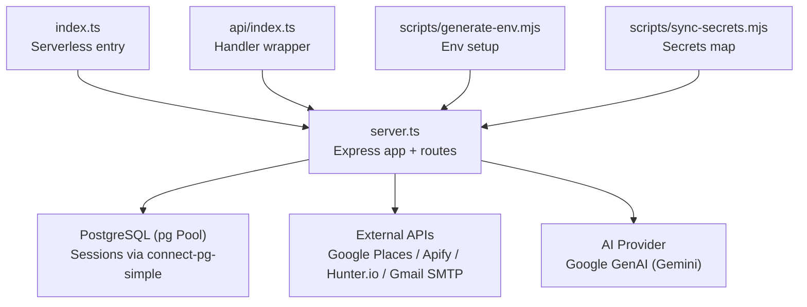
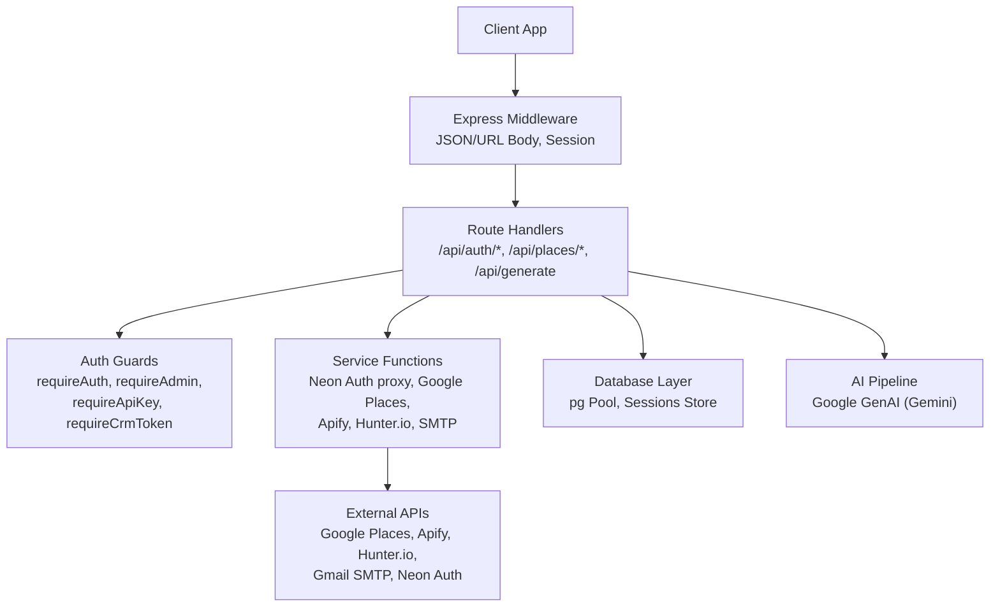
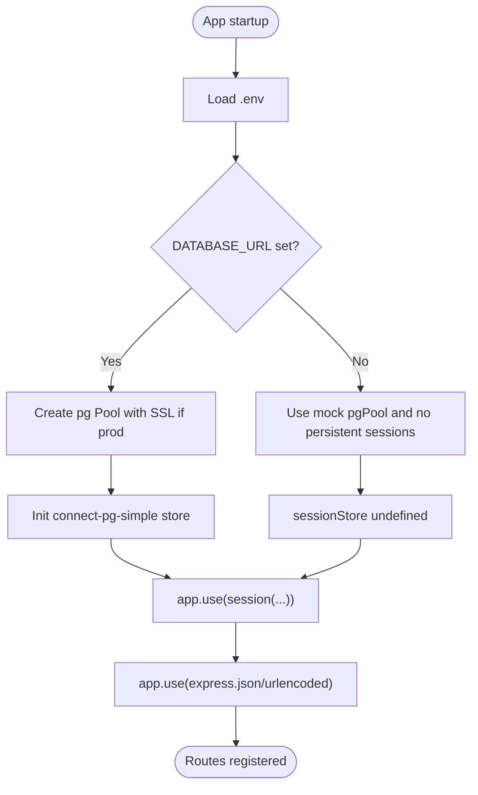
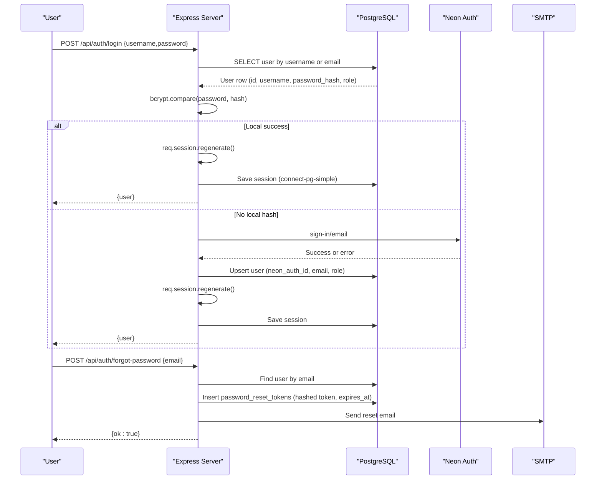
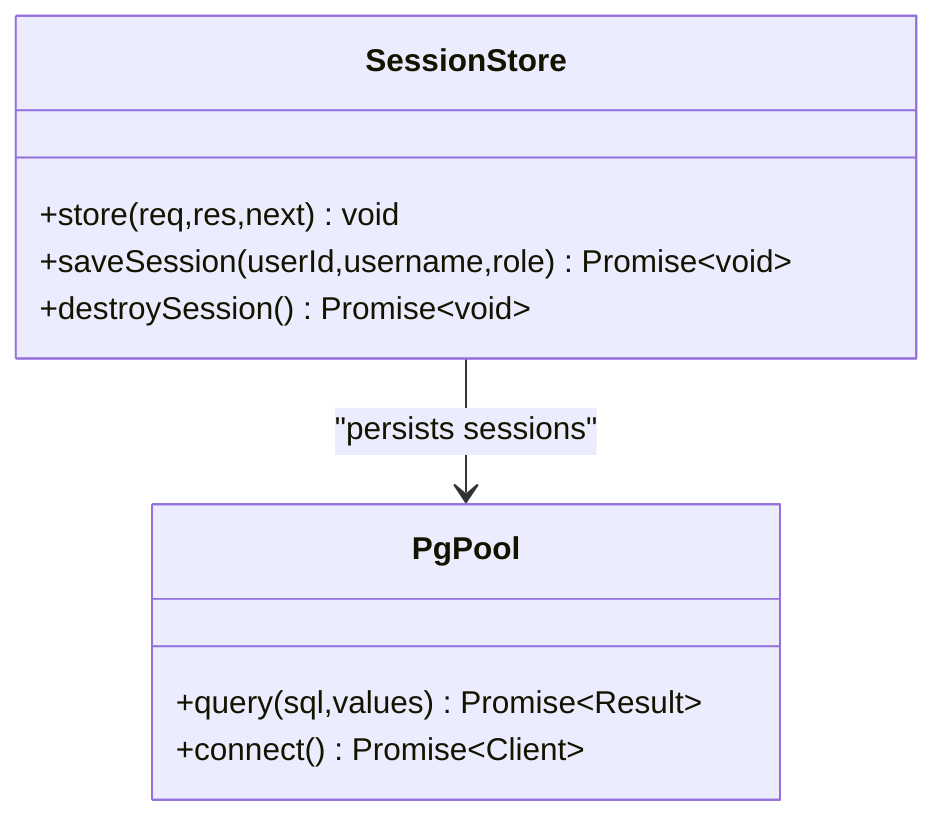
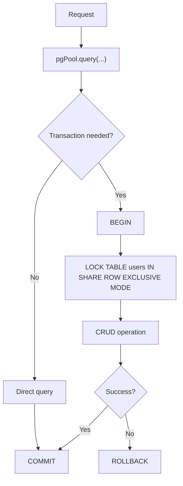
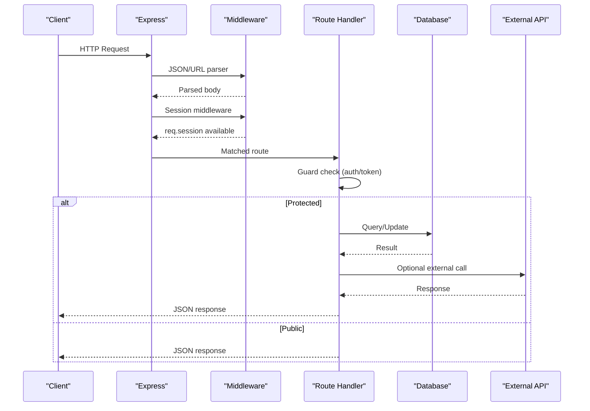
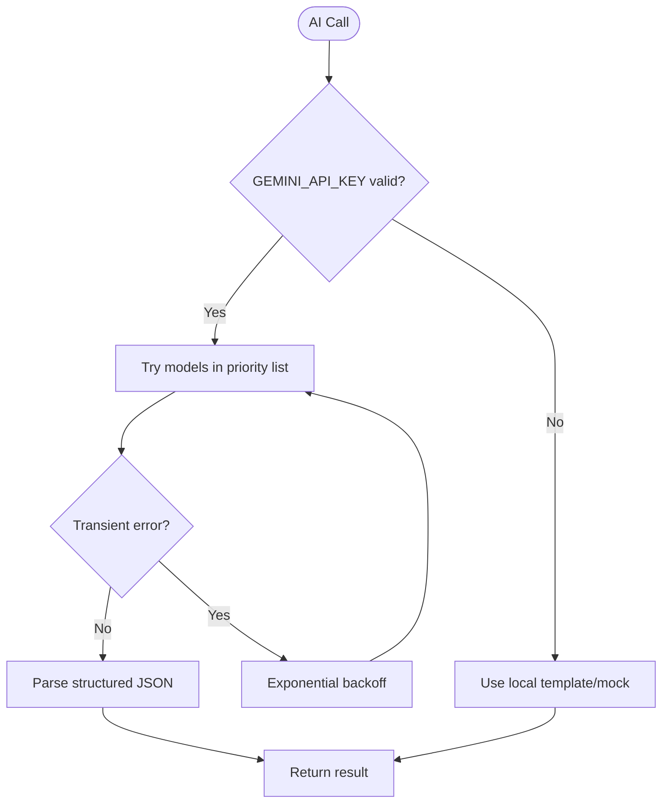
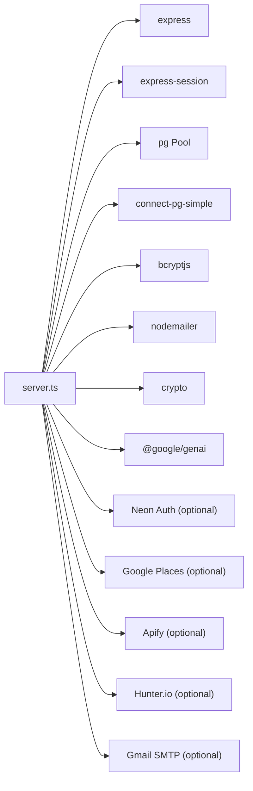

# Backend Architecture

<cite>
**Referenced Files in This Document**
- [server.ts](file://server.ts)
- [index.ts](file://index.ts)
- [api/index.ts](file://api/index.ts)
- [scripts/generate-env.mjs](file://scripts/generate-env.mjs)
- [scripts/sync-secrets.mjs](file://scripts/sync-secrets.mjs)
</cite>

## Table of Contents
1. [Introduction](#introduction)
2. [Project Structure](#project-structure)
3. [Core Components](#core-components)
4. [Architecture Overview](#architecture-overview)
5. [Detailed Component Analysis](#detailed-component-analysis)
6. [Dependency Analysis](#dependency-analysis)
7. [Performance Considerations](#performance-considerations)
8. [Troubleshooting Guide](#troubleshooting-guide)
9. [Conclusion](#conclusion)

## Introduction
This document describes the backend architecture of the Express.js server implementation used by the application. It covers server initialization, middleware configuration, route organization, API endpoint structure, authentication with multi-provider support, session management backed by PostgreSQL, security measures, database layer abstraction and connection pooling, error handling strategies, request/response flows, middleware chain, and API versioning approaches.

## Project Structure
The backend is implemented as a single-file Express application with additional entry points for serverless deployment:
- server.ts: Core Express app, middleware, routes, and business logic
- index.ts: Serverless entry point that initializes DB tables and exports the Express app
- api/index.ts: Alternative handler wrapper for the Express app
- scripts/generate-env.mjs: Environment variable scaffolding and defaults
- scripts/sync-secrets.mjs: Secret mapping for deployment platforms

**Diagram sources**
- [index.ts:1-20](file://index.ts#L1-L20)
- [server.ts:1-125](file://server.ts#L1-L125)
- [api/index.ts:1-5](file://api/index.ts#L1-L5)
- [scripts/generate-env.mjs:1-73](file://scripts/generate-env.mjs#L1-L73)
- [scripts/sync-secrets.mjs:23-51](file://scripts/sync-secrets.mjs#L23-L51)

**Section sources**
- [index.ts:1-20](file://index.ts#L1-L20)
- [api/index.ts:1-5](file://api/index.ts#L1-L5)
- [scripts/generate-env.mjs:1-73](file://scripts/generate-env.mjs#L1-L73)
- [scripts/sync-secrets.mjs:23-51](file://scripts/sync-secrets.mjs#L23-L51)

## Core Components
- Express application and middleware stack: JSON/body parsing, sessions, typed fetch wrapper, and custom auth middleware
- Database layer: pg Pool with optional SSL and connect-pg-simple session store; fallback mock pool when DATABASE_URL is missing
- Authentication system:
  - Username/password endpoints (/api/auth/register, /login, /logout)
  - Email-based Neon Auth integration (/api/auth/neon-register, /neon-login) with local bcrypt fallback
  - Password reset flow (/forgot-password, /reset-password)
  - Role checks: requireAuth and requireAdmin
  - Server-to-server tokens: requireApiKey and requireCrmToken
- AI generation pipeline: Google GenAI client with model fallbacks and structured responses
- External integrations: Google Places, Apify scrapers, Hunter.io enrichment, Gmail SMTP

Key responsibilities:
- Request validation and sanitization at route boundaries
- Secure password hashing and comparison
- Session regeneration on login/register to prevent fixation
- Persistent sessions in PostgreSQL
- Consistent error responses and logging

**Section sources**
- [server.ts:1-125](file://server.ts#L1-L125)
- [server.ts:209-264](file://server.ts#L209-L264)
- [server.ts:266-381](file://server.ts#L266-L381)
- [server.ts:394-748](file://server.ts#L394-L748)
- [server.ts:750-830](file://server.ts#L750-L830)
- [server.ts:832-851](file://server.ts#L832-L851)
- [server.ts:854-978](file://server.ts#L854-L978)

## Architecture Overview
The server follows a layered approach:
- Middleware layer: body parsers, session store, auth guards
- Route handlers: REST endpoints grouped by domain (auth, places, generate)
- Service functions: external API clients and business helpers
- Data access: pg Pool queries and transactional operations
- Storage: PostgreSQL for users, sessions, and logs

**Diagram sources**
- [server.ts:1-125](file://server.ts#L1-L125)
- [server.ts:209-264](file://server.ts#L209-L264)
- [server.ts:266-381](file://server.ts#L266-L381)
- [server.ts:394-748](file://server.ts#L394-L748)
- [server.ts:854-978](file://server.ts#L854-L978)
- [server.ts:1636-1728](file://server.ts#L1636-L1728)
- [server.ts:1731-1909](file://server.ts#L1731-L1909)
- [server.ts:1913-1959](file://server.ts#L1913-L1959)

## Detailed Component Analysis

### Server Initialization and Middleware
- Loads environment variables and creates an Express app
- Configures JSON and URL-encoded body parsers
- Initializes pg Pool with optional SSL in production
- Sets up connect-pg-simple session store using the same pool
- Defines a typed fetch wrapper to avoid type conflicts
- Declares express-session types for user role fields
- Configures session cookie options (httpOnly, secure, sameSite, maxAge)

**Diagram sources**
- [server.ts:1-125](file://server.ts#L1-L125)

**Section sources**
- [server.ts:1-125](file://server.ts#L1-L125)

### Authentication System
- Username/password registration and login with bcrypt hashing and session creation
- Email-based Neon Auth integration with local bcrypt fallback for unverified emails
- Password reset token generation, storage, and email delivery
- Role enforcement: requireAuth checks session.userId; requireAdmin re-checks role from DB per request
- Server-to-server authentication via API keys and CRM internal tokens

**Diagram sources**
- [server.ts:266-381](file://server.ts#L266-L381)
- [server.ts:394-748](file://server.ts#L394-L748)
- [server.ts:750-830](file://server.ts#L750-L830)

**Section sources**
- [server.ts:209-264](file://server.ts#L209-L264)
- [server.ts:266-381](file://server.ts#L266-L381)
- [server.ts:394-748](file://server.ts#L394-L748)
- [server.ts:750-830](file://server.ts#L750-L830)
- [server.ts:832-851](file://server.ts#L832-L851)

### Session Management with PostgreSQL
- Sessions are persisted in a dedicated table managed by connect-pg-simple
- Session regeneration on login/register prevents fixation
- Cookie settings enforce httpOnly, secure flag in production, and SameSite lax
- Timeout guard ensures response even if session save callback stalls

**Diagram sources**
- [server.ts:1-125](file://server.ts#L1-L125)
- [server.ts:548-591](file://server.ts#L548-L591)

**Section sources**
- [server.ts:1-125](file://server.ts#L1-L125)
- [server.ts:548-591](file://server.ts#L548-L591)

### Security Implementations
- Password hashing with bcrypt and constant-time comparison
- Session fixation prevention via regeneration
- Admin role re-checked against DB on each protected admin route
- Server-to-server endpoints secured via header tokens (X-API-Key, X-CRM-Token)
- CSRF protection not explicitly configured; consider adding helmet and CSRF middleware for state-changing requests
- Input validation patterns for usernames and emails

**Section sources**
- [server.ts:209-264](file://server.ts#L209-L264)
- [server.ts:266-381](file://server.ts#L266-L381)
- [server.ts:394-748](file://server.ts#L394-L748)

### Database Layer Abstraction and Connection Pooling
- Centralized pg Pool with optional SSL in production
- connect-pg-simple integrates sessions into the same pool
- Transactional registration with table-level locks to ensure first-user becomes admin safely
- Mock pool fallback when DATABASE_URL is absent

**Diagram sources**
- [server.ts:266-338](file://server.ts#L266-L338)
- [server.ts:473-524](file://server.ts#L473-L524)

**Section sources**
- [server.ts:1-125](file://server.ts#L1-L125)
- [server.ts:266-338](file://server.ts#L266-L338)
- [server.ts:473-524](file://server.ts#L473-L524)

### API Endpoint Structure and Organization
- Authentication endpoints:
  - POST /api/auth/register
  - POST /api/auth/login
  - POST /api/auth/logout
  - POST /api/auth/neon-register
  - POST /api/auth/neon-login
  - POST /api/auth/forgot-password
  - POST /api/auth/reset-password
  - GET /api/auth/me
- Places and prospecting:
  - POST /api/enrich-contact (requires auth)
  - POST /api/scrape-places (requires auth)
  - POST /api/places/search
  - GET /api/places/history
  - POST /api/places/:id/score
  - POST /api/places/bulk-import
- AI generation hub:
  - POST /api/generate (action-based routing with public/admin/public+auth gating)

Versioning approach:
- All endpoints use flat paths under /api without explicit version segments
- Versioning can be introduced by prefixing routes with /v1, /v2 as needed

**Section sources**
- [server.ts:266-381](file://server.ts#L266-L381)
- [server.ts:394-748](file://server.ts#L394-L748)
- [server.ts:750-830](file://server.ts#L750-L830)
- [server.ts:832-851](file://server.ts#L832-L851)
- [server.ts:1964-2000](file://server.ts#L1964-L2000)
- [server.ts:2008-2150](file://server.ts#L2008-L2150)
- [server.ts:2153-2177](file://server.ts#L2153-L2177)
- [server.ts:2180-2245](file://server.ts#L2180-L2245)
- [server.ts:2262-2271](file://server.ts#L2262-L2271)

### Request/Response Flows and Middleware Chain
- Global middleware order: body parsers → session → routes
- Route-level guards: requireAuth, requireAdmin, requireApiKey, requireCrmToken
- Error handling: try/catch blocks around async operations with consistent JSON error responses
- Logging: console logs for critical steps and errors

**Diagram sources**
- [server.ts:1-125](file://server.ts#L1-L125)
- [server.ts:209-264](file://server.ts#L209-L264)
- [server.ts:266-381](file://server.ts#L266-L381)
- [server.ts:1636-1728](file://server.ts#L1636-L1728)

**Section sources**
- [server.ts:1-125](file://server.ts#L1-L125)
- [server.ts:209-264](file://server.ts#L209-L264)
- [server.ts:266-381](file://server.ts#L266-L381)

### AI Generation Pipeline
- Centralized getAI() initializes GoogleGenAI with GEMINI_API_KEY and sets headers
- generateContentWithFallback tries multiple models and retries transient errors
- Structured responses enforced via Type schema definitions
- Fallbacks include free AI attempts and local templates when quotas are exhausted

**Diagram sources**
- [server.ts:854-978](file://server.ts#L854-L978)

**Section sources**
- [server.ts:854-978](file://server.ts#L854-L978)

## Dependency Analysis
- Internal dependencies:
  - Express, express-session, connect-pg-simple, pg, bcryptjs, nodemailer, crypto
  - @google/genai for Gemini integration
- External services:
  - Neon Auth REST API (optional)
  - Google Places API (optional)
  - Apify scrapers (optional)
  - Hunter.io (optional)
  - Gmail SMTP (optional)

**Diagram sources**
- [server.ts:1-125](file://server.ts#L1-L125)
- [server.ts:854-978](file://server.ts#L854-L978)
- [server.ts:1636-1728](file://server.ts#L1636-L1728)
- [server.ts:1731-1909](file://server.ts#L1731-L1909)
- [server.ts:1913-1959](file://server.ts#L1913-L1959)

**Section sources**
- [server.ts:1-125](file://server.ts#L1-L125)
- [server.ts:854-978](file://server.ts#L854-L978)
- [server.ts:1636-1728](file://server.ts#L1636-L1728)
- [server.ts:1731-1909](file://server.ts#L1731-L1909)
- [server.ts:1913-1959](file://server.ts#L1913-L1959)

## Performance Considerations
- Connection pooling:
  - Use pg Pool to reuse connections across requests
  - Avoid named prepared statements in pooled environments; prefer unnamed statements
- Session persistence:
  - connect-pg-simple stores sessions in DB; ensure proper indexing on session table
- AI calls:
  - Model fallback and retry reduce latency spikes and quota failures
- External API calls:
  - Graceful fallbacks to local templates when APIs are unavailable
- Transactions:
  - Use minimal lock scopes and short transactions to reduce contention

[No sources needed since this section provides general guidance]

## Troubleshooting Guide
Common issues and resolutions:
- Missing DATABASE_URL:
  - Server falls back to mock pool and non-persistent sessions; configure DATABASE_URL for production
- SESSION_SECRET not set:
  - Development fallback secret is used; set SESSION_SECRET in production
- SMTP not configured:
  - Password reset emails will fail; configure SMTP_USER and SMTP_PASS
- Neon Auth base URL not set:
  - Email-based auth falls back to local bcrypt; set NEON_AUTH_BASE_URL or VITE_NEON_AUTH_URL
- Google Places/Apify/Hunter.io keys missing:
  - Endpoints return simulated data or errors; configure respective env vars
- TypeScript type errors:
  - Ensure correct typing for ExpressRequest/Response; aliases are used to avoid conflicts

**Section sources**
- [server.ts:1-125](file://server.ts#L1-L125)
- [server.ts:750-830](file://server.ts#L750-L830)
- [server.ts:1636-1728](file://server.ts#L1636-L1728)
- [server.ts:1731-1909](file://server.ts#L1731-L1909)
- [server.ts:1913-1959](file://server.ts#L1913-L1959)

## Conclusion
The Express backend provides a robust foundation with secure authentication, persistent sessions, modular route organization, and resilient external integrations. The design supports both local development and production deployments with clear fallbacks and error handling. Future enhancements can include explicit API versioning, enhanced CSRF protection, and improved telemetry for performance monitoring.