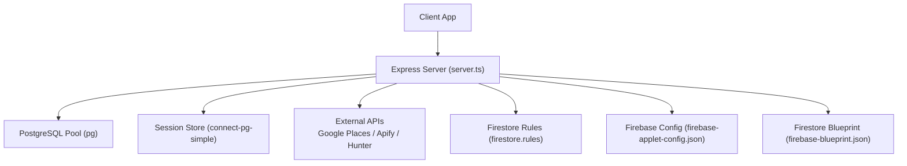
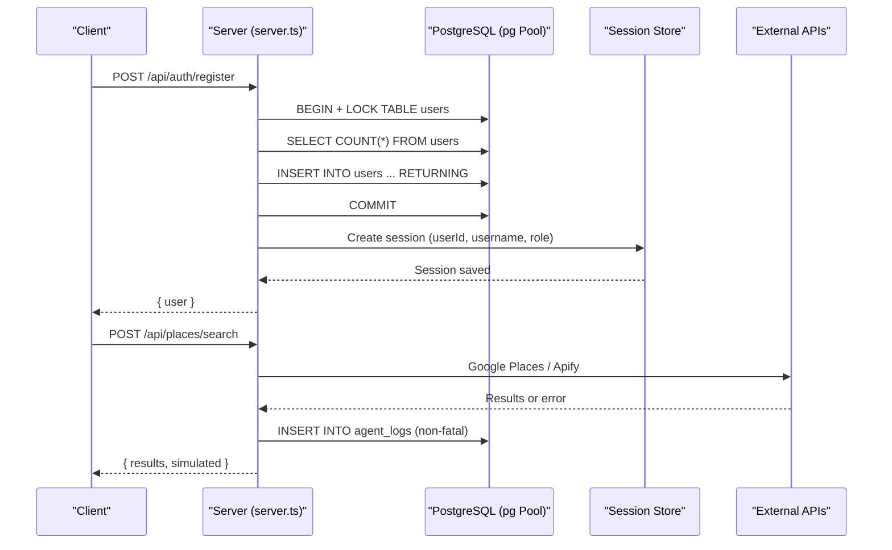
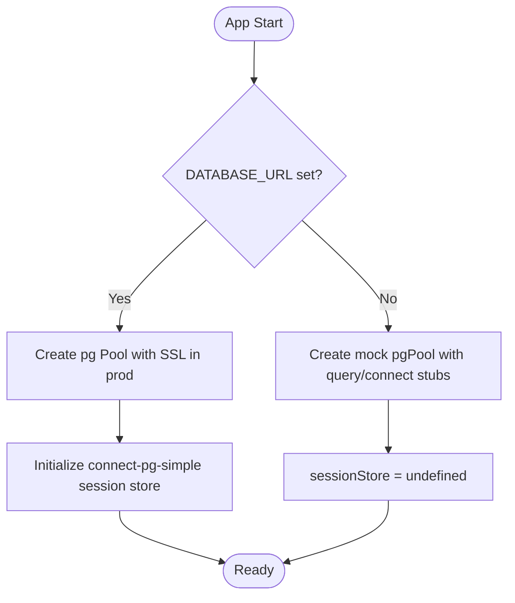
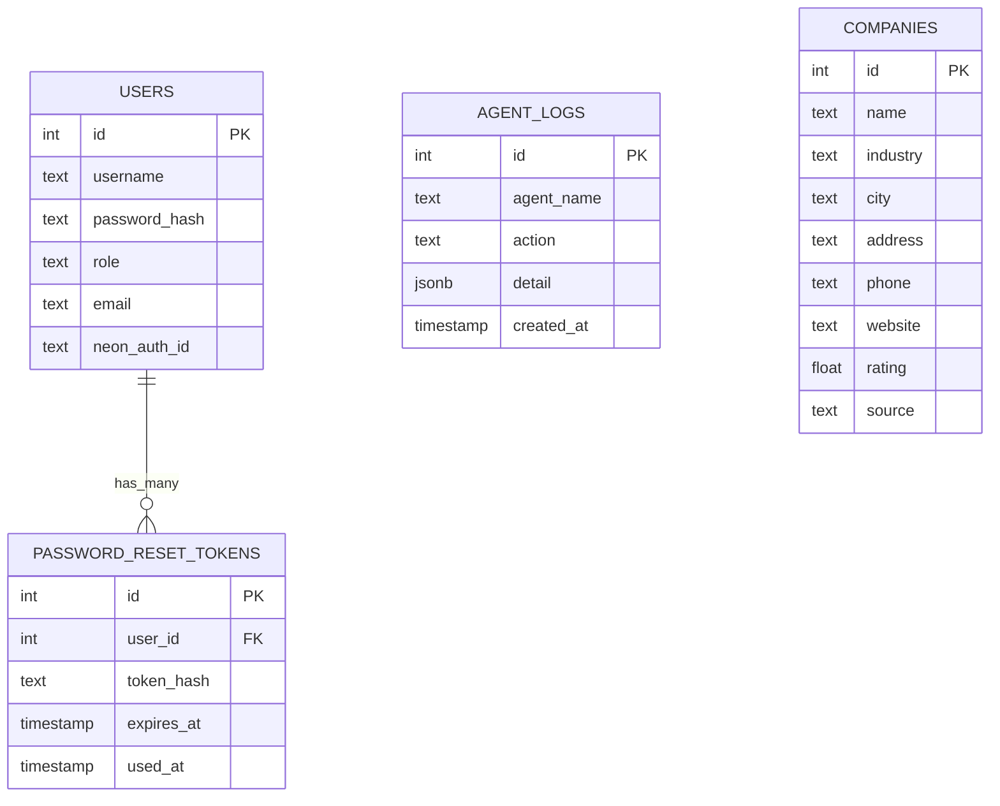
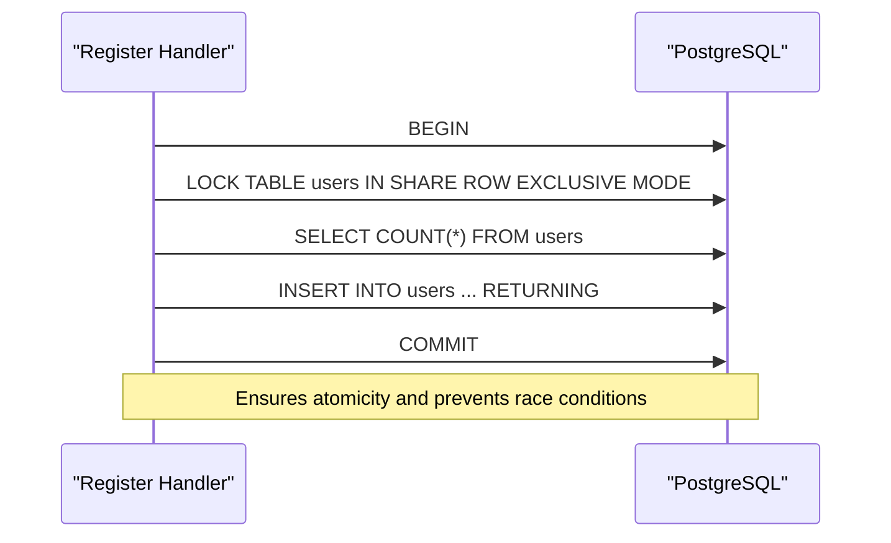
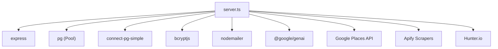

# Database Layer

<cite>
**Referenced Files in This Document**
- [server.ts](file://server.ts)
- [firestore.rules](file://firestore.rules)
- [firebase-applet-config.json](file://firebase-applet-config.json)
- [firebase-blueprint.json](file://firebase-blueprint.json)
- [index.ts](file://index.ts)
- [replit.md](file://replit.md)
</cite>

## Table of Contents
1. [Introduction](#introduction)
2. [Project Structure](#project-structure)
3. [Core Components](#core-components)
4. [Architecture Overview](#architecture-overview)
5. [Detailed Component Analysis](#detailed-component-analysis)
6. [Dependency Analysis](#dependency-analysis)
7. [Performance Considerations](#performance-considerations)
8. [Troubleshooting Guide](#troubleshooting-guide)
9. [Conclusion](#conclusion)
10. [Appendices](#appendices)

## Introduction
This document describes the database layer for the application, focusing on PostgreSQL integration, connection pooling, data access patterns, and a mock database implementation used in development when no database URL is configured. It also covers Firestore configuration for Google Cloud integration, including rules and schema blueprint. The goal is to provide clear guidance for developers on how the system connects to databases, manages sessions, persists data, and simulates behavior locally without a live database.

## Project Structure
The database-related logic is primarily implemented in the server entrypoint, which initializes a PostgreSQL connection pool, configures session storage, and exposes API endpoints that interact with tables such as users, password_reset_tokens, agent_logs, and companies. A separate Firestore configuration defines security rules and a schema blueprint for a collection storing geolocated prospects.

**Diagram sources**
- [server.ts:24-35](file://server.ts#L24-L35)
- [firestore.rules:1-9](file://firestore.rules#L1-L9)
- [firebase-applet-config.json:1-12](file://firebase-applet-config.json#L1-L12)
- [firebase-blueprint.json:1-41](file://firebase-blueprint.json#L1-L41)

**Section sources**
- [server.ts:24-35](file://server.ts#L24-L35)
- [firestore.rules:1-9](file://firestore.rules#L1-L9)
- [firebase-applet-config.json:1-12](file://firebase-applet-config.json#L1-L12)
- [firebase-blueprint.json:1-41](file://firebase-blueprint.json#L1-L41)

## Core Components
- PostgreSQL Connection Pooling: The server creates a pg Pool using DATABASE_URL and conditionally enables SSL in production. When DATABASE_URL is absent, it falls back to an in-memory mock pool that simulates query responses for common operations like user registration and login.
- Session Management: Sessions are persisted via connect-pg-simple using the same pg Pool and a session table. If no database is available, session store is undefined and sessions rely on memory defaults.
- Data Access Patterns: Direct SQL queries are executed against tables users, password_reset_tokens, agent_logs, and companies. Queries use parameterized values to prevent injection. Upsert-like behavior is achieved through ON CONFLICT DO NOTHING for idempotent imports.
- Mock Database Implementation: A mock pgPool implements query() and connect() methods returning deterministic rows for specific SQL patterns, enabling local development without a real database.
- Firestore Configuration: Security rules allow read/write globally (development-friendly), while firebase-applet-config.json provides project identifiers and firestoreDatabaseId. firebase-blueprint.json defines a schema for a GeolocatedProspect entity and maps it to a Firestore collection path.

**Section sources**
- [server.ts:24-77](file://server.ts#L24-L77)
- [server.ts:266-338](file://server.ts#L266-L338)
- [server.ts:340-381](file://server.ts#L340-L381)
- [server.ts:753-830](file://server.ts#L753-L830)
- [server.ts:2137-2150](file://server.ts#L2137-L2150)
- [server.ts:2220-2245](file://server.ts#L2220-L2245)
- [firestore.rules:1-9](file://firestore.rules#L1-L9)
- [firebase-applet-config.json:1-12](file://firebase-applet-config.json#L1-L12)
- [firebase-blueprint.json:1-41](file://firebase-blueprint.json#L1-L41)

## Architecture Overview
The server orchestrates authentication, session management, and data persistence through PostgreSQL. It also integrates external services for prospect enrichment and search. Firestore is configured separately for potential client-side or admin integrations.

**Diagram sources**
- [server.ts:266-338](file://server.ts#L266-L338)
- [server.ts:2137-2150](file://server.ts#L2137-L2150)
- [server.ts:2008-2150](file://server.ts#L2008-L2150)

## Detailed Component Analysis

### PostgreSQL Integration and Connection Pooling
- Pool initialization uses DATABASE_URL and toggles SSL based on environment.
- In development without DATABASE_URL, a mock pool returns predefined rows for typical queries, enabling end-to-end flows without a live database.
- Session store is initialized with connect-pg-simple using the same pool; if unavailable, session persistence is disabled.

**Diagram sources**
- [server.ts:24-35](file://server.ts#L24-L35)
- [server.ts:36-77](file://server.ts#L36-L77)

**Section sources**
- [server.ts:24-35](file://server.ts#L24-L35)
- [server.ts:36-77](file://server.ts#L36-L77)

### Data Access Patterns and Tables
- Users: Registration and login flow manipulate the users table, including optional email field and neon_auth_id synchronization.
- Password Reset Tokens: Generated, hashed, stored with expiration, and marked used upon reset.
- Agent Logs: Non-critical logging of places search actions.
- Companies: Bulk import from UI with idempotent inserts using ON CONFLICT DO NOTHING.

**Diagram sources**
- [server.ts:266-338](file://server.ts#L266-L338)
- [server.ts:753-830](file://server.ts#L753-L830)
- [server.ts:2137-2150](file://server.ts#L2137-L2150)
- [server.ts:2220-2245](file://server.ts#L2220-L2245)

**Section sources**
- [server.ts:266-338](file://server.ts#L266-L338)
- [server.ts:753-830](file://server.ts#L753-L830)
- [server.ts:2137-2150](file://server.ts#L2137-L2150)
- [server.ts:2220-2245](file://server.ts#L2220-L2245)

### Transaction Management
- Registration uses explicit transactions with table-level locks to ensure only the first user becomes admin and concurrent registrations are safe.
- Password reset updates tokens and invalidates sessions within single statements; session cleanup uses pattern matching on serialized session content.

**Diagram sources**
- [server.ts:296-316](file://server.ts#L296-L316)

**Section sources**
- [server.ts:296-316](file://server.ts#L296-L316)

### Error Handling for Database Operations
- Authentication endpoints return consistent error messages and status codes for validation failures, incorrect credentials, and internal errors.
- Non-critical operations (e.g., agent logs) catch and ignore errors to avoid disrupting primary flows.
- External API calls include retries and fallbacks; database errors are logged and surfaced appropriately.

**Section sources**
- [server.ts:266-338](file://server.ts#L266-L338)
- [server.ts:340-381](file://server.ts#L340-L381)
- [server.ts:2137-2150](file://server.ts#L2137-L2150)

### Connection Lifecycle Management
- Pool creation occurs at startup with environment-driven SSL settings.
- Session store depends on the pool; if unavailable, session persistence is disabled.
- Client connections are acquired per transactional operation and released in finally blocks.

**Section sources**
- [server.ts:24-35](file://server.ts#L24-L35)
- [server.ts:296-316](file://server.ts#L296-L316)

### Mock Database Implementation for Development
- When DATABASE_URL is not set, a mock pgPool simulates query responses for common SQL patterns (user insert, count, select by username/email).
- This allows full authentication flows and basic UI interactions without a live database.

**Section sources**
- [server.ts:36-77](file://server.ts#L36-L77)

### Firestore Rules Configuration for Google Cloud Integration
- Global read/write rule allows all operations (suitable for development).
- Firebase applet config includes projectId, appId, apiKey, authDomain, firestoreDatabaseId, storageBucket, messagingSenderId, oAuthClientId, and recaptchaSiteKey.
- Firestore blueprint defines a GeolocatedProspect entity and maps it to a collection path.

**Section sources**
- [firestore.rules:1-9](file://firestore.rules#L1-L9)
- [firebase-applet-config.json:1-12](file://firebase-applet-config.json#L1-L12)
- [firebase-blueprint.json:1-41](file://firebase-blueprint.json#L1-L41)

## Dependency Analysis
The server depends on:
- Express for HTTP routing and middleware.
- pg for PostgreSQL connectivity and pooling.
- connect-pg-simple for session persistence backed by PostgreSQL.
- bcryptjs for password hashing.
- nodemailer for email delivery.
- @google/genai for AI model interactions.
- External APIs: Google Places, Apify scrapers, Hunter.io for contact enrichment.

**Diagram sources**
- [server.ts:1-15](file://server.ts#L1-L15)
- [server.ts:24-35](file://server.ts#L24-L35)
- [server.ts:2008-2150](file://server.ts#L2008-L2150)

**Section sources**
- [server.ts:1-15](file://server.ts#L1-L15)
- [server.ts:24-35](file://server.ts#L24-L35)
- [server.ts:2008-2150](file://server.ts#L2008-L2150)

## Performance Considerations
- Use short transactions to minimize lock contention and deadlocks.
- Prefer UPSERT patterns (ON CONFLICT DO NOTHING) for idempotent inserts.
- Avoid named prepared statements in transaction-mode pooling; use unnamed statements or session mode where necessary.
- Configure connection timeouts and idle connection reclamation to reduce resource usage.
- Monitor slow queries and analyze execution plans to optimize indexes and queries.

[No sources needed since this section provides general guidance]

## Troubleshooting Guide
- Missing DATABASE_URL: The server warns and switches to a mock pool; verify environment variables before deployment.
- Session persistence issues: Ensure connect-pg-simple can create the session table; check permissions and pool availability.
- External API failures: Google Places and Apify calls include fallbacks; inspect logs for missing keys or quota limits.
- Email sending: SMTP configuration must be present; otherwise, password reset emails will fail.

**Section sources**
- [server.ts:36-77](file://server.ts#L36-L77)
- [server.ts:145-207](file://server.ts#L145-L207)
- [server.ts:2008-2150](file://server.ts#L2008-L2150)

## Conclusion
The database layer combines robust PostgreSQL integration with a pragmatic mock implementation for development. It emphasizes secure authentication, idempotent data operations, and resilient external integrations. Firestore configuration supports flexible development workflows while maintaining a clear schema blueprint for future expansion. Following best practices for transactions, indexing, and connection management ensures scalability and reliability.

[No sources needed since this section summarizes without analyzing specific files]

## Appendices

### Database Migration Approaches
- Tables are created automatically on cold start using CREATE TABLE IF NOT EXISTS patterns.
- For structured migrations, consider declarative schema definitions and migration tools aligned with PostgreSQL best practices.

**Section sources**
- [index.ts:6](file://index.ts#L6)
- [replit.md:105](file://replit.md#L105)

### Backup Strategies
- Use pg_dump/pg_restore for logical backups and point-in-time recovery strategies appropriate for your deployment environment.
- Schedule regular backups and test restoration procedures to ensure data integrity.

[No sources needed since this section provides general guidance]

### Performance Optimization Techniques
- Add composite and covering indexes for frequently queried columns.
- Use partial indexes for selective datasets.
- Analyze query plans with EXPLAIN ANALYZE and monitor pg_stat_statements for hotspots.
- Partition large tables when necessary and maintain statistics with VACUUM ANALYZE.

[No sources needed since this section provides general guidance]