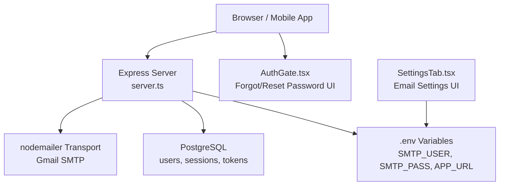
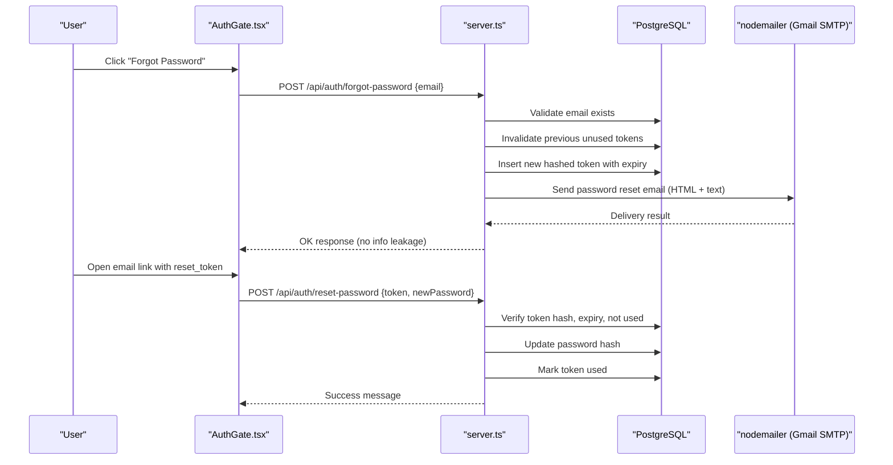
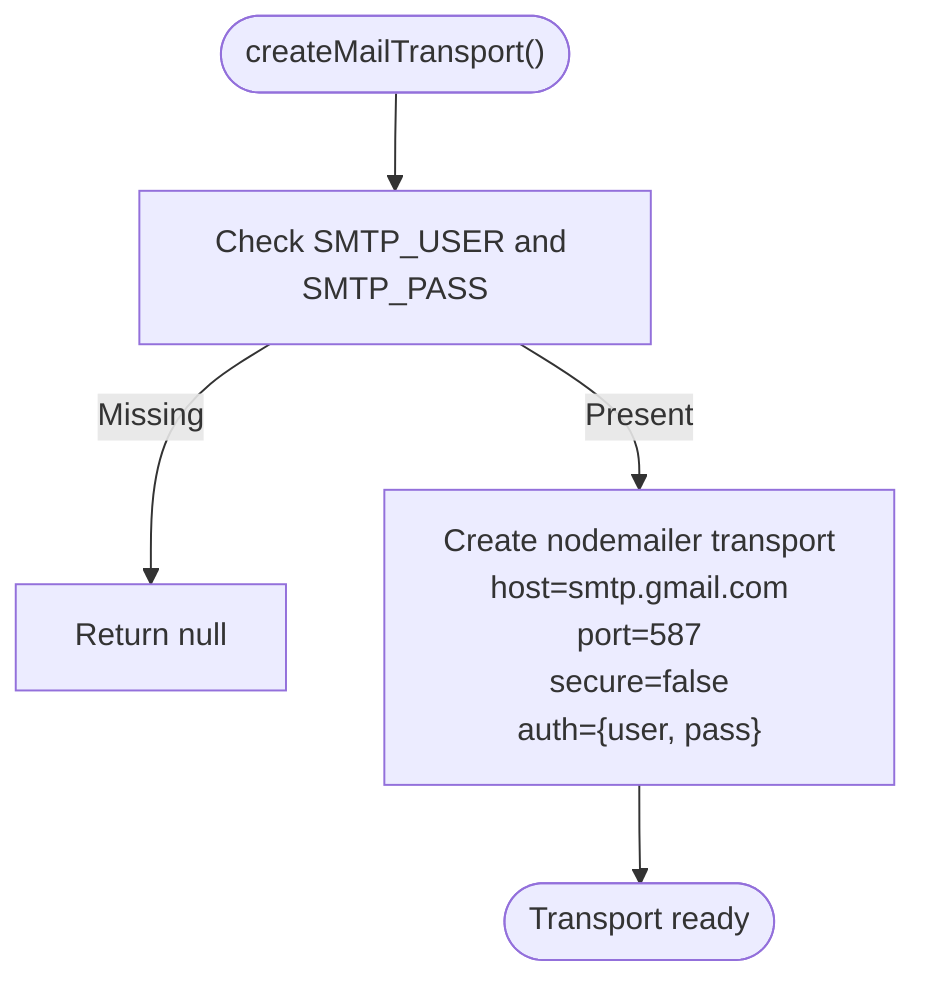
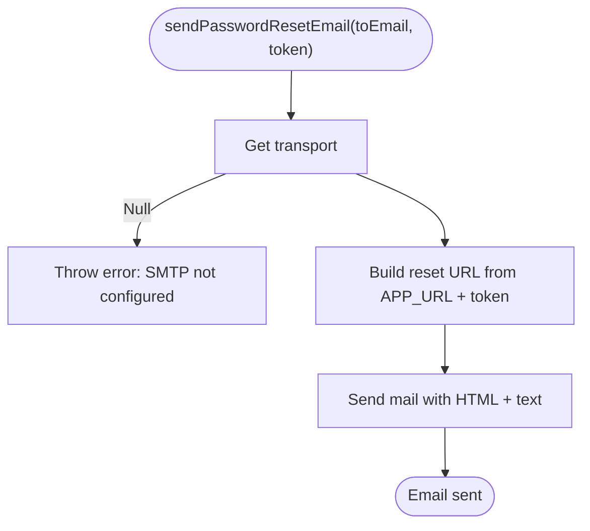
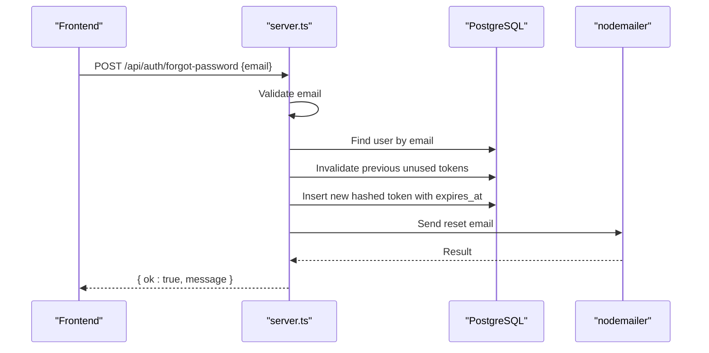
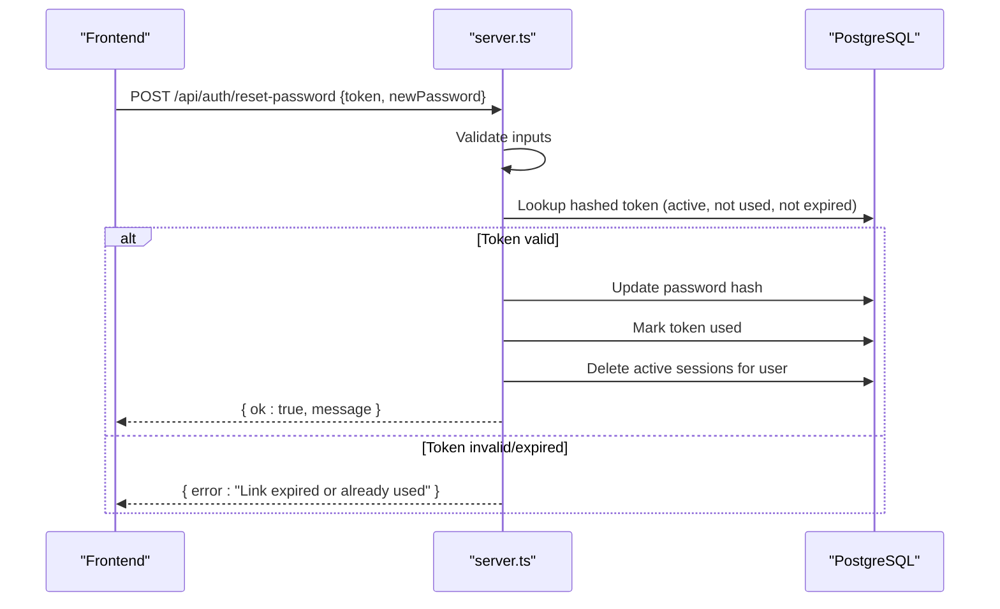
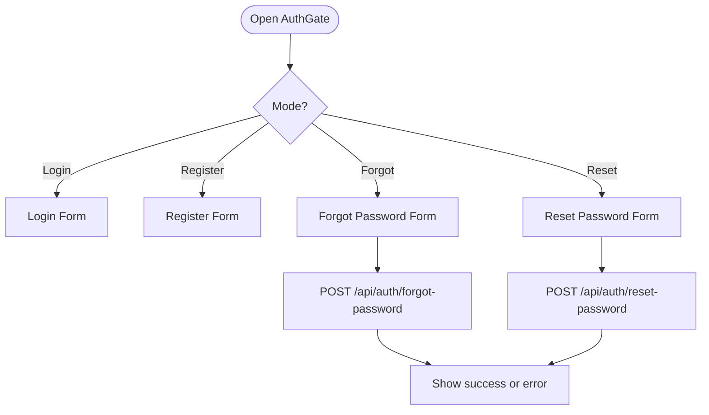
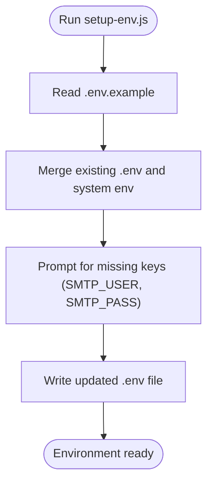
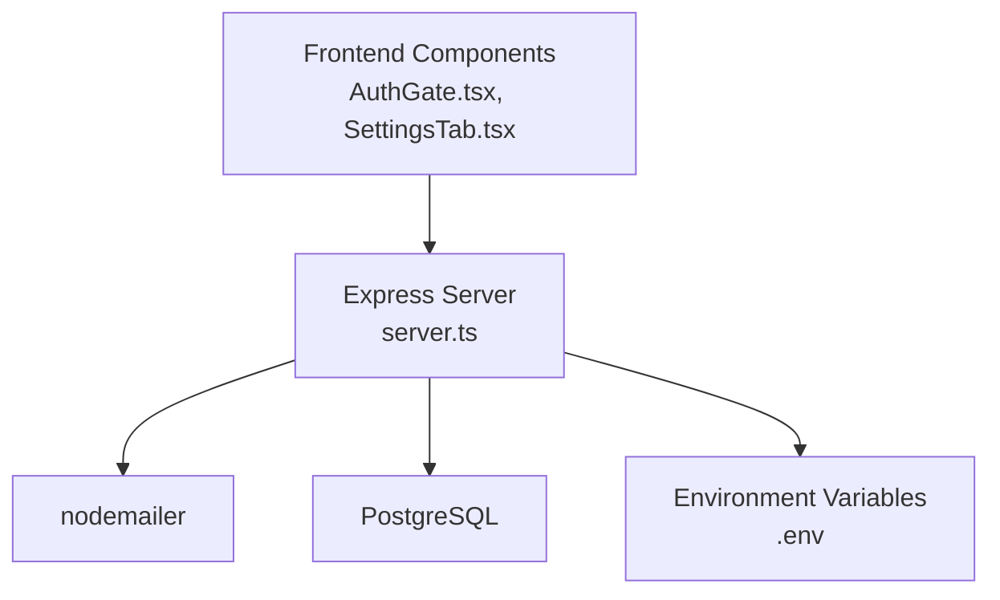

# Email Service Integration

<cite>
**Referenced Files in This Document**
- [server.ts](file://server.ts)
- [api/index.ts](file://api/index.ts)
- [package.json](file://package.json)
- [scripts/setup-env.js](file://scripts/setup-env.js)
- [scripts/doctor.mjs](file://scripts/doctor.mjs)
- [src/components/AuthGate.tsx](file://src/components/AuthGate.tsx)
- [src/components/SettingsTab.tsx](file://src/components/SettingsTab.tsx)
</cite>

## Table of Contents
1. [Introduction](#introduction)
2. [Project Structure](#project-structure)
3. [Core Components](#core-components)
4. [Architecture Overview](#architecture-overview)
5. [Detailed Component Analysis](#detailed-component-analysis)
6. [Dependency Analysis](#dependency-analysis)
7. [Performance Considerations](#performance-considerations)
8. [Troubleshooting Guide](#troubleshooting-guide)
9. [Conclusion](#conclusion)
10. [Appendices](#appendices)

## Introduction
This document explains the email service integration used by the application, focusing on SMTP configuration with Gmail via nodemailer, password reset email functionality (secure token generation and HTML template), transport configuration, error handling, logging, deliverability best practices, compliance considerations, testing approaches, and debugging strategies. It is intended for both technical and non-technical readers to understand how emails are sent and how to operate and troubleshoot the system effectively.

## Project Structure
The email functionality is implemented server-side using Express and nodemailer, with environment-driven configuration and a simple API entry point. The frontend triggers password reset flows through API endpoints exposed by the server.

**Diagram sources**
- [server.ts:131-207](file://server.ts#L131-L207)
- [api/index.ts:1-5](file://api/index.ts#L1-L5)
- [src/components/AuthGate.tsx:72-115](file://src/components/AuthGate.tsx#L72-L115)
- [src/components/SettingsTab.tsx:76-101](file://src/components/SettingsTab.tsx#L76-L101)

**Section sources**
- [server.ts:131-207](file://server.ts#L131-L207)
- [api/index.ts:1-5](file://api/index.ts#L1-L5)
- [src/components/AuthGate.tsx:72-115](file://src/components/AuthGate.tsx#L72-L115)
- [src/components/SettingsTab.tsx:76-101](file://src/components/SettingsTab.tsx#L76-L101)

## Core Components
- SMTP Transport Configuration: A function creates a nodemailer transport using Gmail SMTP settings from environment variables.
- Password Reset Email Sender: Generates a secure reset URL and sends an HTML email with a text fallback.
- Forgot Password Endpoint: Validates input, generates and stores a hashed token, invalidates prior unused tokens, and sends the email.
- Reset Password Endpoint: Validates the token, updates the user’s password, marks the token as used, and invalidates active sessions.
- Frontend Auth Flow: Triggers forgot-password and reset-password endpoints; handles success/error states and redirects.
- Environment Setup: Scripts guide creation and validation of .env variables including SMTP credentials.
- Health Check Script: Verifies presence of SMTP credentials for quick diagnostics.

**Section sources**
- [server.ts:131-207](file://server.ts#L131-L207)
- [server.ts:750-830](file://server.ts#L750-L830)
- [src/components/AuthGate.tsx:72-115](file://src/components/AuthGate.tsx#L72-L115)
- [scripts/setup-env.js:75-84](file://scripts/setup-env.js#L75-L84)
- [scripts/doctor.mjs:158-163](file://scripts/doctor.mjs#L158-L163)

## Architecture Overview
The email architecture centers around a single Express server that exposes authentication endpoints and uses nodemailer to send transactional emails via Gmail SMTP. Tokens are stored securely in PostgreSQL and validated server-side before password changes.

**Diagram sources**
- [server.ts:750-830](file://server.ts#L750-L830)
- [server.ts:131-207](file://server.ts#L131-L207)
- [src/components/AuthGate.tsx:72-115](file://src/components/AuthGate.tsx#L72-L115)

## Detailed Component Analysis

### SMTP Transport Configuration
- Uses nodemailer to create a Gmail SMTP transport configured via environment variables.
- Host is set to Gmail SMTP, port 587 with STARTTLS enabled.
- Authentication uses SMTP_USER and SMTP_PASS.
- If credentials are missing, transport creation returns null and subsequent email sending throws an error.

**Diagram sources**
- [server.ts:131-143](file://server.ts#L131-L143)

**Section sources**
- [server.ts:131-143](file://server.ts#L131-L143)

### Password Reset Email Functionality
- Generates a cryptographically secure random token (32 bytes hex).
- Hashes the token with SHA-256 before storing it in the database.
- Stores the hashed token with an expiration time (1 hour).
- Builds a reset URL using APP_URL and includes the raw token as a query parameter.
- Sends an HTML email with a mobile-responsive layout and a plain-text fallback.

**Diagram sources**
- [server.ts:145-207](file://server.ts#L145-L207)

**Section sources**
- [server.ts:145-207](file://server.ts#L145-L207)

### Forgot Password Endpoint (/api/auth/forgot-password)
- Validates email format.
- Checks if the email exists without revealing existence or non-existence.
- Invalidates any previous unused tokens for the user.
- Generates and stores a new hashed token with expiry.
- Sends the password reset email.
- Logs delivery attempt and returns a generic success message.

**Diagram sources**
- [server.ts:750-791](file://server.ts#L750-L791)

**Section sources**
- [server.ts:750-791](file://server.ts#L750-L791)

### Reset Password Endpoint (/api/auth/reset-password)
- Validates token length and new password strength.
- Hashes the provided token and looks up an active, unused, non-expired token.
- Updates the user’s password hash.
- Marks the token as used.
- Invalidates all active sessions for the user to force re-login.
- Returns success or appropriate error messages.

**Diagram sources**
- [server.ts:793-830](file://server.ts#L793-L830)

**Section sources**
- [server.ts:793-830](file://server.ts#L793-L830)

### Frontend Auth Flow (AuthGate.tsx)
- Provides UI for login, register, forgot password, and reset password modes.
- Captures reset_token from URL parameters and removes it after use.
- Calls /api/auth/forgot-password and /api/auth/reset-password endpoints.
- Displays success/error messages and redirects to login after successful reset.

**Diagram sources**
- [src/components/AuthGate.tsx:72-115](file://src/components/AuthGate.tsx#L72-L115)

**Section sources**
- [src/components/AuthGate.tsx:72-115](file://src/components/AuthGate.tsx#L72-L115)

### Environment Setup and Validation
- setup-env.js provides interactive guidance for setting SMTP_USER and SMTP_PASS, including links to Google App Passwords.
- doctor.mjs checks for presence of SMTP credentials and reports status.

**Diagram sources**
- [scripts/setup-env.js:75-84](file://scripts/setup-env.js#L75-L84)
- [scripts/doctor.mjs:158-163](file://scripts/doctor.mjs#L158-L163)

**Section sources**
- [scripts/setup-env.js:75-84](file://scripts/setup-env.js#L75-L84)
- [scripts/doctor.mjs:158-163](file://scripts/doctor.mjs#L158-L163)

### Email Settings UI (SettingsTab.tsx)
- Exposes fields for SMTP_USER, SMTP_PASS, and SendGrid API key in the UI.
- Includes documentation links and placeholders for values.
- Supports managing sender domains to improve deliverability.

**Section sources**
- [src/components/SettingsTab.tsx:76-101](file://src/components/SettingsTab.tsx#L76-L101)
- [src/components/SettingsTab.tsx:550-562](file://src/components/SettingsTab.tsx#L550-L562)

## Dependency Analysis
- Express server acts as the central orchestrator for authentication and email operations.
- nodemailer is the transport layer for sending emails via Gmail SMTP.
- PostgreSQL stores users, sessions, and password reset tokens.
- Environment variables drive configuration for SMTP and application URLs.
- Frontend components trigger API calls and handle responses.

**Diagram sources**
- [server.ts:131-207](file://server.ts#L131-L207)
- [package.json:38](file://package.json#L38)

**Section sources**
- [package.json:38](file://package.json#L38)
- [server.ts:131-207](file://server.ts#L131-L207)

## Performance Considerations
- Token generation uses crypto.randomBytes for security and speed.
- Database queries are minimal and targeted to reduce latency.
- Email sending is synchronous within the request lifecycle; consider offloading to a queue for high volume.
- Session invalidation upon password reset ensures security but may impact UX; communicate clearly to users.

[No sources needed since this section provides general guidance]

## Troubleshooting Guide
Common issues and resolutions:
- SMTP not configured: Ensure SMTP_USER and SMTP_PASS are set in .env. Use setup-env.js to generate or update .env.
- Gmail authentication failures: Use Google App Passwords for SMTP access. Verify account security settings.
- Token expired or already used: Encourage users to request a new reset link.
- Emails not delivered: Check Gmail SMTP logs, spam folders, and domain authentication (SPF/DKIM/DMARC).
- Logging and diagnostics: Review server logs for errors during forgot-password and reset-password flows. Use doctor.mjs to verify SMTP configuration presence.

**Section sources**
- [scripts/setup-env.js:75-84](file://scripts/setup-env.js#L75-L84)
- [scripts/doctor.mjs:158-163](file://scripts/doctor.mjs#L158-L163)
- [server.ts:750-830](file://server.ts#L750-L830)

## Conclusion
The email service integrates Gmail SMTP via nodemailer to support secure password reset flows. Tokens are generated securely and stored as hashes, with strict validation and session invalidation. The system provides clear error handling and logging, while the UI guides users through the process. For production scalability and deliverability, consider adopting a dedicated email provider and implementing robust monitoring and analytics.

[No sources needed since this section summarizes without analyzing specific files]

## Appendices

### Best Practices for Email Deliverability and Spam Prevention
- Authenticate your domain with SPF, DKIM, and DMARC records.
- Use a consistent “From” address and ensure it matches your authenticated domain.
- Keep email content clean and avoid spam-triggering phrases.
- Monitor bounce rates and unsubscribe requests.
- Provide easy opt-out mechanisms for marketing emails.

[No sources needed since this section provides general guidance]

### Compliance with Email Standards
- Include required headers (e.g., Message-ID, Date).
- Provide a physical mailing address in marketing emails.
- Honor unsubscribe requests promptly.
- Follow GDPR/CAN-SPAM requirements for consent and data handling.

[No sources needed since this section provides general guidance]

### Testing Approaches for Email Functionality
- Unit tests: Validate token generation, hashing, and expiration logic.
- Integration tests: Mock SMTP transport to simulate sending without actual delivery.
- End-to-end tests: Trigger forgot-password flow and assert API responses.
- Deliverability tests: Send test emails to multiple providers and check inbox placement.

[No sources needed since this section provides general guidance]

### Debugging Common Delivery Issues
- Verify SMTP credentials and network connectivity.
- Inspect Gmail SMTP logs for authentication and delivery errors.
- Check DNS records for domain authentication.
- Use tools like Mail-Tester or GlockApps to analyze email content and headers.

[No sources needed since this section provides general guidance]