# Middleware & Security

<cite>
**Referenced Files in This Document**
- [server.ts](file://server.ts)
- [index.ts](file://index.ts)
- [api/index.ts](file://api/index.ts)
</cite>

## Table of Contents
1. [Introduction](#introduction)
2. [Project Structure](#project-structure)
3. [Core Components](#core-components)
4. [Architecture Overview](#architecture-overview)
5. [Detailed Component Analysis](#detailed-component-analysis)
6. [Dependency Analysis](#dependency-analysis)
7. [Performance Considerations](#performance-considerations)
8. [Troubleshooting Guide](#troubleshooting-guide)
9. [Conclusion](#conclusion)

## Introduction
This document provides comprehensive middleware and security documentation for the Express-based server. It covers authentication, authorization, API key validation, CRM token verification, input validation patterns, session configuration, error handling, and performance considerations. It also explains how middleware is composed across routes and where to extend protections such as CORS, rate limiting, and security headers.

## Project Structure
The application uses a single Express server file that defines all middleware and routes. Entry points expose the app for both local execution and serverless deployment:
- Local/Cloud runtime: server.ts initializes DB connections, sessions, middleware, and routes; optionally binds a port and serves static assets.
- Vercel/serverless entry: index.ts imports server.ts, runs idempotent DB initialization, and exports the Express app.
- API adapter: api/index.ts wraps the Express app for serverless handlers.

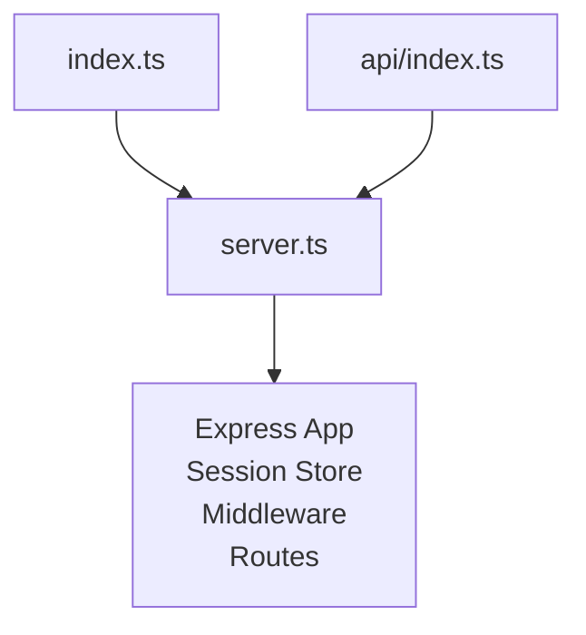

**Diagram sources**
- [index.ts:1-20](file://index.ts#L1-L20)
- [api/index.ts:1-5](file://api/index.ts#L1-L5)
- [server.ts:1-125](file://server.ts#L1-L125)

**Section sources**
- [index.ts:1-20](file://index.ts#L1-L20)
- [api/index.ts:1-5](file://api/index.ts#L1-L5)
- [server.ts:1-125](file://server.ts#L1-L125)

## Core Components
- Authentication middleware (requireAuth): Ensures a valid session exists by checking a session user identifier.
- Admin authorization (requireAdmin): Validates that the authenticated user has an admin role by re-checking the database on each request.
- API key validation (requireApiKey): Validates a shared secret header for server-to-server endpoints.
- CRM token verification (requireCrmToken): Validates a shared internal token header for webhook endpoints from external systems.

These middleware functions are applied per route to enforce access control consistently.

**Section sources**
- [server.ts:209-235](file://server.ts#L209-L235)
- [server.ts:240-264](file://server.ts#L240-L264)

## Architecture Overview
The request lifecycle flows through built-in Express parsers, session management, custom middleware, and finally the route handler. The diagram maps actual middleware and routes used in the codebase.

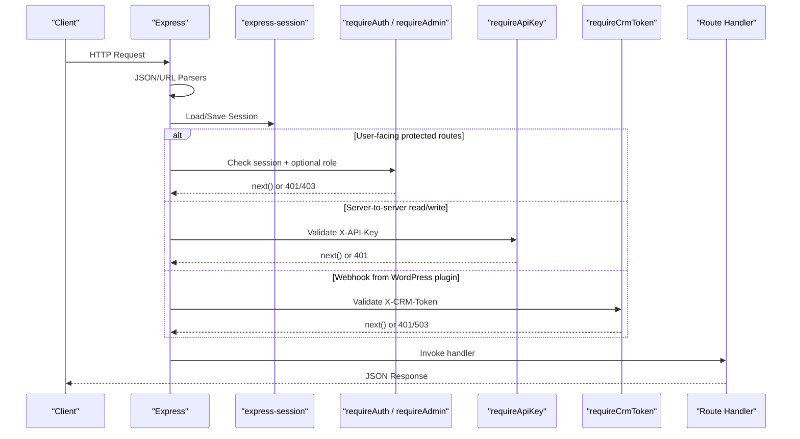

**Diagram sources**
- [server.ts:79-125](file://server.ts#L79-L125)
- [server.ts:209-264](file://server.ts#L209-L264)
- [server.ts:4895-4969](file://server.ts#L4895-L4969)
- [server.ts:3534-3540](file://server.ts#L3534-L3540)

## Detailed Component Analysis

### Authentication Middleware (requireAuth)
- Purpose: Enforce that requests carry a valid session with a user identifier.
- Behavior: If no session user ID is present, returns 401 Unauthorized; otherwise calls next().
- Usage: Applied to user-facing endpoints that require login.

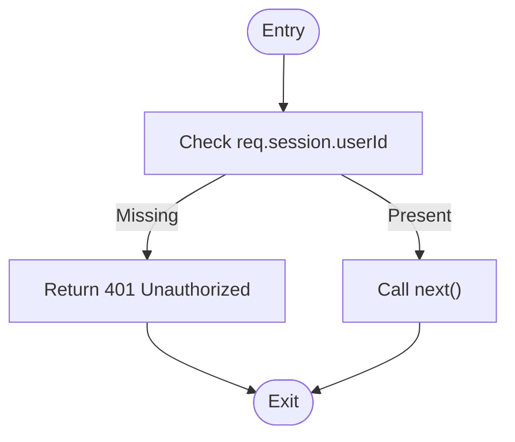

**Diagram sources**
- [server.ts:209-214](file://server.ts#L209-L214)

**Section sources**
- [server.ts:209-214](file://server.ts#L209-L214)

### Admin Authorization (requireAdmin)
- Purpose: Ensure the authenticated user has the admin role.
- Behavior: Re-validates the user’s role against the database on every request to reflect immediate role changes; returns 403 if not admin; updates session role cache; handles errors with 500.
- Usage: Applied to administrative endpoints.

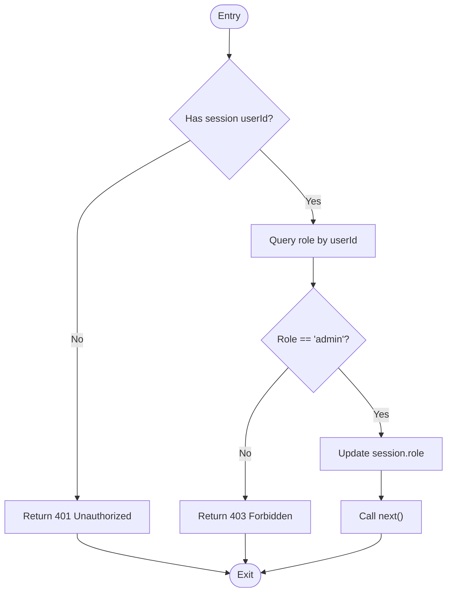

**Diagram sources**
- [server.ts:216-235](file://server.ts#L216-L235)

**Section sources**
- [server.ts:216-235](file://server.ts#L216-L235)

### API Key Validation (requireApiKey)
- Purpose: Secure server-to-server endpoints by validating a shared API key header.
- Behavior: Reads a specific header; compares it to an environment variable; returns 401 if missing or invalid; otherwise proceeds.
- Usage: Applied to read/write endpoints consumed by external services.

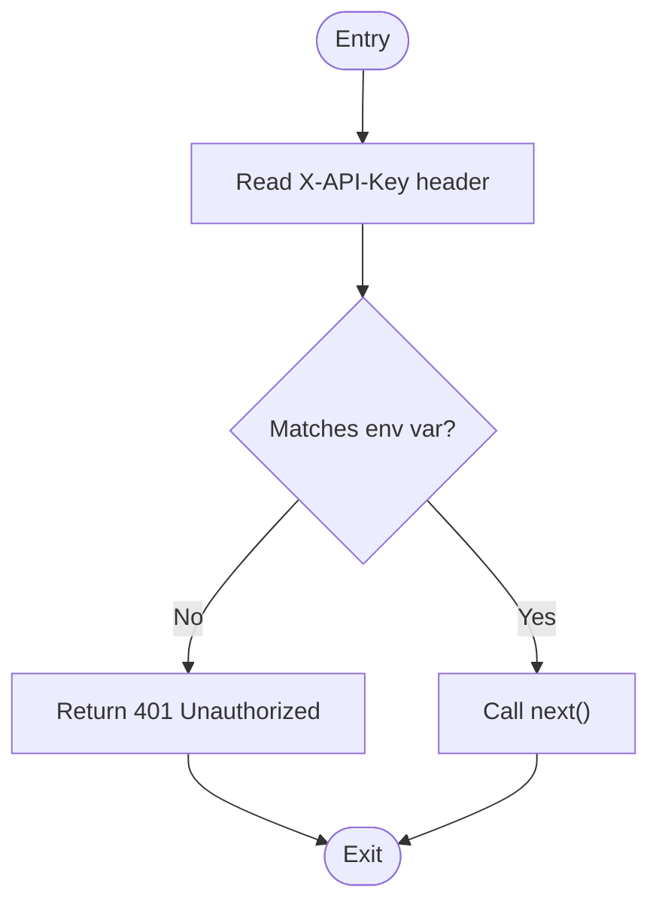

**Diagram sources**
- [server.ts:240-246](file://server.ts#L240-L246)

**Section sources**
- [server.ts:240-246](file://server.ts#L240-L246)

### CRM Token Verification (requireCrmToken)
- Purpose: Secure webhook endpoints from the WordPress plugin using a shared internal token.
- Behavior: Requires a specific header; fails closed with 503 if the expected token is not configured; returns 401 if token is missing or invalid; otherwise proceeds.
- Usage: Applied to webhook endpoints receiving data from external systems.

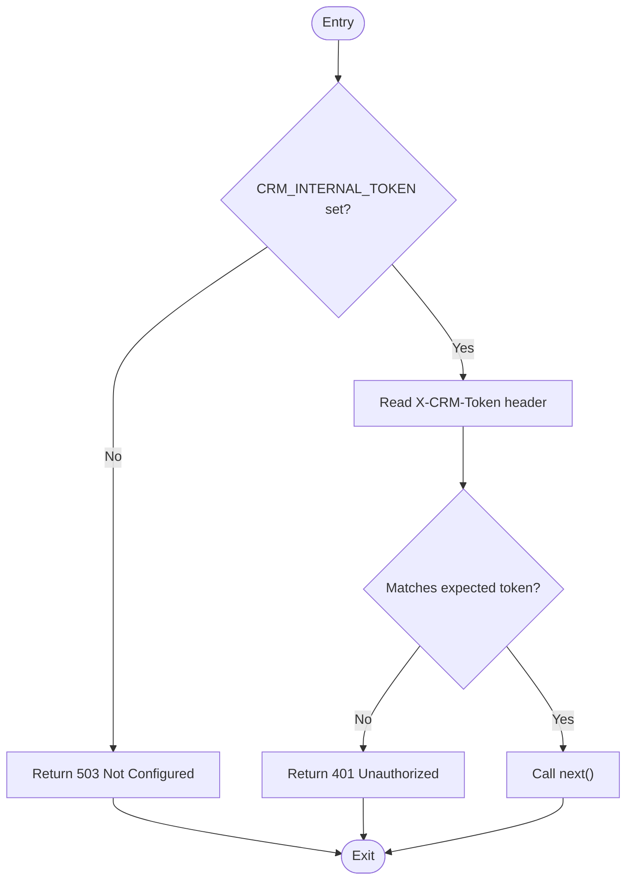

**Diagram sources**
- [server.ts:253-264](file://server.ts#L253-L264)

**Section sources**
- [server.ts:253-264](file://server.ts#L253-L264)

### Session Configuration and Security
- Session store: Uses PostgreSQL via connect-pg-simple when DATABASE_URL is provided; falls back to memory behavior when not configured.
- Cookie settings: httpOnly enabled; secure flag set in production; sameSite lax; reasonable maxAge.
- Secret management: SESSION_SECRET loaded from environment with a development fallback warning.

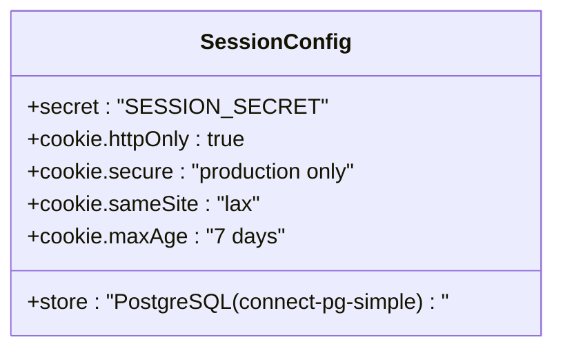

**Diagram sources**
- [server.ts:24-35](file://server.ts#L24-L35)
- [server.ts:107-125](file://server.ts#L107-L125)

**Section sources**
- [server.ts:24-35](file://server.ts#L24-L35)
- [server.ts:107-125](file://server.ts#L107-L125)

### Input Validation Patterns and Sanitization
- Username/email validation: Regex enforces allowed characters and length for usernames; email format checks for certain flows.
- Password policies: Minimum length enforced; hashing performed with bcrypt before storage.
- Body parsing: JSON and URL-encoded bodies parsed with express.json and express.urlencoded.
- Parameter constraints: Limits applied to query parameters (e.g., limit capped).

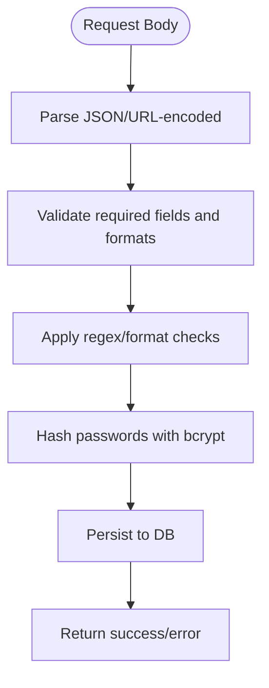

**Diagram sources**
- [server.ts:79-80](file://server.ts#L79-L80)
- [server.ts:127-128](file://server.ts#L127-L128)
- [server.ts:266-338](file://server.ts#L266-L338)
- [server.ts:340-381](file://server.ts#L340-L381)
- [server.ts:4895-4909](file://server.ts#L4895-L4909)

**Section sources**
- [server.ts:79-80](file://server.ts#L79-L80)
- [server.ts:127-128](file://server.ts#L127-L128)
- [server.ts:266-338](file://server.ts#L266-L338)
- [server.ts:340-381](file://server.ts#L340-L381)
- [server.ts:4895-4909](file://server.ts#L4895-L4909)

### Error Handling in Middleware Chains
- Consistent JSON error responses with appropriate status codes (401, 403, 500, 503).
- Database operation failures caught and logged; safe fallbacks to avoid leaking sensitive details.
- Session creation timeouts guarded to ensure responses are always sent even if persistence hangs.

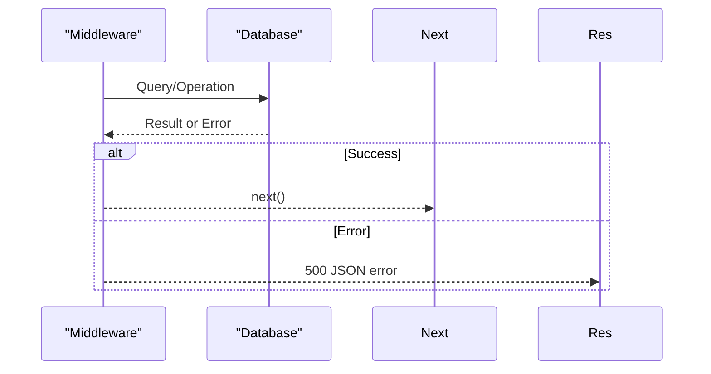

**Diagram sources**
- [server.ts:216-235](file://server.ts#L216-L235)
- [server.ts:551-591](file://server.ts#L551-L591)

**Section sources**
- [server.ts:216-235](file://server.ts#L216-L235)
- [server.ts:551-591](file://server.ts#L551-L591)

### Middleware Composition Patterns
- Per-route composition: Each route explicitly lists middleware before the handler, enabling fine-grained control.
- Common patterns:
  - requireAuth for user-only routes.
  - requireApiKey for server-to-server read/write endpoints.
  - requireCrmToken for webhooks from external systems.
  - requireAdmin for administrative operations.

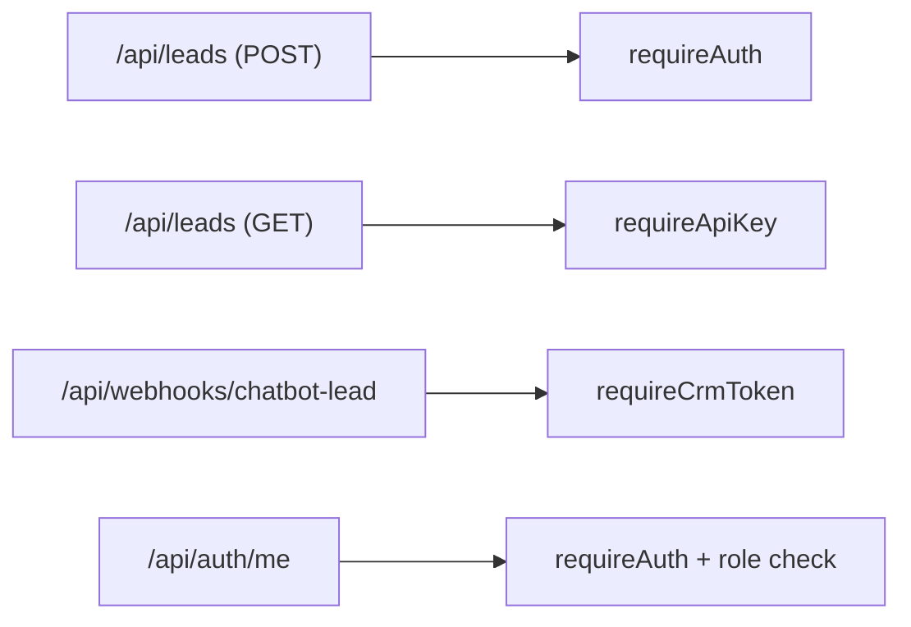

**Diagram sources**
- [server.ts:4836-4860](file://server.ts#L4836-L4860)
- [server.ts:4895-4909](file://server.ts#L4895-L4909)
- [server.ts:3534-3540](file://server.ts#L3534-L3540)
- [server.ts:832-851](file://server.ts#L832-L851)

**Section sources**
- [server.ts:4836-4860](file://server.ts#L4836-L4860)
- [server.ts:4895-4909](file://server.ts#L4895-L4909)
- [server.ts:3534-3540](file://server.ts#L3534-L3540)
- [server.ts:832-851](file://server.ts#L832-L851)

### CORS Policy Setup
- No explicit CORS middleware is configured in the server file.
- Recommendation: Add a CORS middleware early in the stack to restrict origins, methods, and headers according to your deployment needs.

[No sources needed since this section provides general guidance]

### Rate Limiting Strategies
- No rate limiting middleware is currently implemented.
- Recommendation: Introduce rate limiting at the API layer (per IP or per API key) to protect against abuse and brute-force attempts.

[No sources needed since this section provides general guidance]

### Protection Against Common Web Vulnerabilities
- SQL Injection: All queries use parameterized statements via pgPool.
- XSS: Responses are JSON; consider adding Content-Type headers and avoiding unsafe HTML rendering.
- CSRF: Sessions use cookies; for state-changing requests, consider CSRF tokens if browsers send cross-site requests.
- Secrets Exposure: Environment variables used for keys/tokens; ensure they are never logged or returned in responses.

**Section sources**
- [server.ts:24-35](file://server.ts#L24-L35)
- [server.ts:107-125](file://server.ts#L107-L125)

## Dependency Analysis
The middleware and routes depend on:
- Express core and parsers.
- express-session with connect-pg-simple for persistent sessions.
- PostgreSQL pool for data operations.
- Environment variables for secrets and configuration.

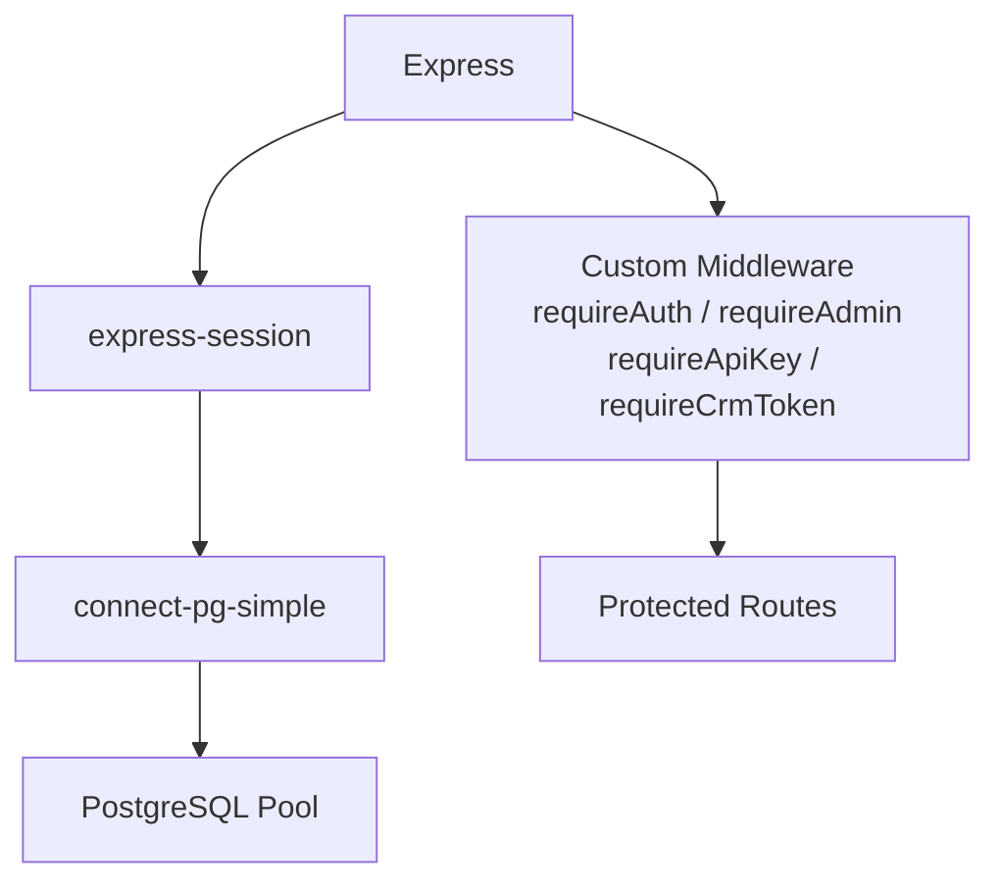

**Diagram sources**
- [server.ts:1-12](file://server.ts#L1-L12)
- [server.ts:24-35](file://server.ts#L24-L35)
- [server.ts:209-264](file://server.ts#L209-L264)

**Section sources**
- [server.ts:1-12](file://server.ts#L1-L12)
- [server.ts:24-35](file://server.ts#L24-L35)
- [server.ts:209-264](file://server.ts#L209-L264)

## Performance Considerations
- Session persistence: Using PostgreSQL avoids in-memory limits but adds DB overhead; ensure connection pooling is tuned.
- Role checks: requireAdmin performs a DB lookup per request; consider caching roles in short-lived caches if appropriate.
- API key/token checks: Lightweight header comparisons; negligible overhead.
- Input validation: Early validation reduces unnecessary DB calls.
- Avoid blocking operations: Keep middleware synchronous or fast async to maintain throughput.

[No sources needed since this section provides general guidance]

## Troubleshooting Guide
- 401 Unauthorized: Missing or invalid session/API key/CRM token; verify headers and session cookie.
- 403 Forbidden: Insufficient permissions (non-admin); confirm user role in DB.
- 500 Internal Server Error: Database or unexpected errors; check logs and DB connectivity.
- 503 Service Unavailable: CRM webhook misconfiguration; ensure CRM_INTERNAL_TOKEN is set.
- Session issues: Verify SESSION_SECRET and session store configuration; ensure cookies are correctly set in production.

**Section sources**
- [server.ts:209-264](file://server.ts#L209-L264)
- [server.ts:551-591](file://server.ts#L551-L591)

## Conclusion
The server implements robust middleware for authentication, authorization, API key validation, and CRM token verification. Input validation and parameterized queries mitigate common vulnerabilities. To further harden the system, add CORS, rate limiting, and security headers. Maintain consistent error handling and monitor performance-sensitive checks like role validation.

[No sources needed since this section summarizes without analyzing specific files]