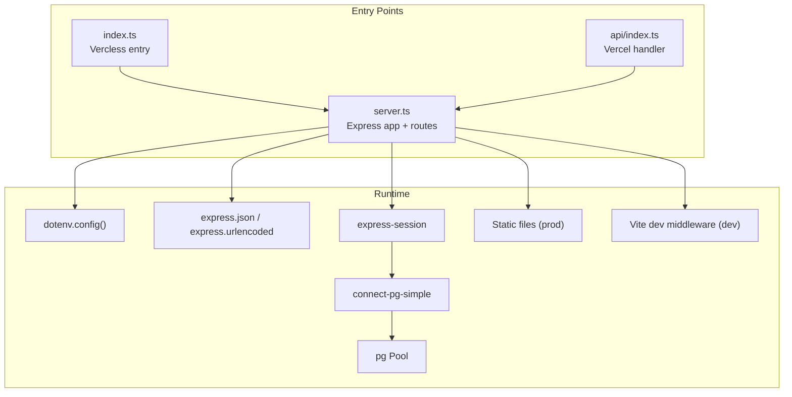
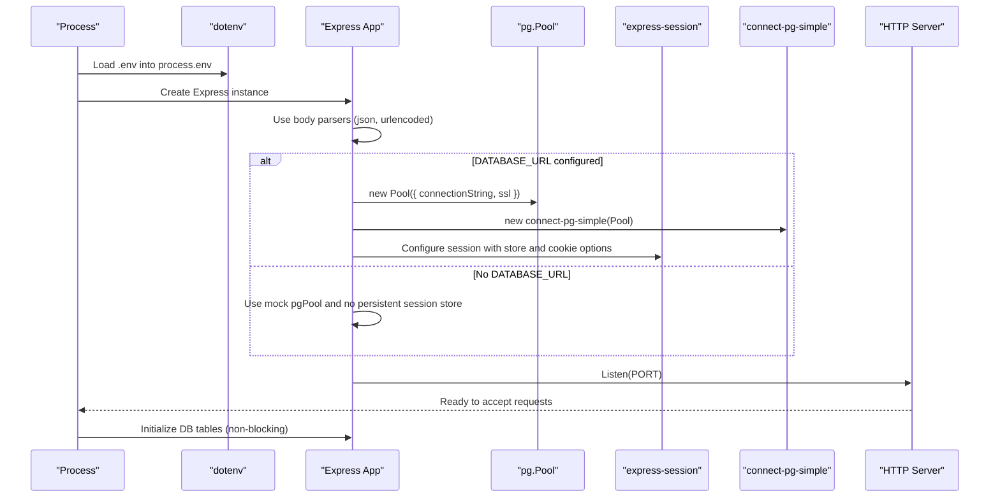
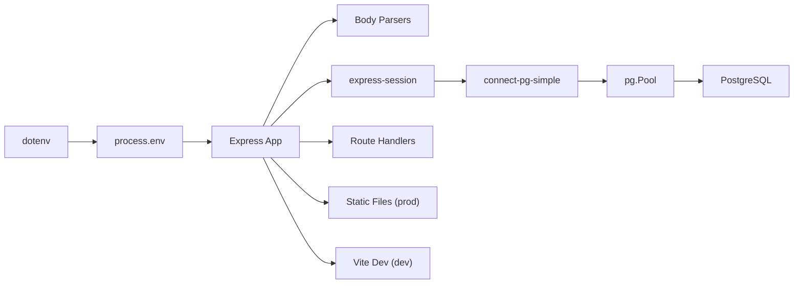

# Server Initialization & Configuration

<cite>
**Referenced Files in This Document**
- [server.ts](file://server.ts)
- [index.ts](file://index.ts)
- [api/index.ts](file://api/index.ts)
- [scripts/generate-env.mjs](file://scripts/generate-env.mjs)
</cite>

## Table of Contents
1. [Introduction](#introduction)
2. [Project Structure](#project-structure)
3. [Core Components](#core-components)
4. [Architecture Overview](#architecture-overview)
5. [Detailed Component Analysis](#detailed-component-analysis)
6. [Dependency Analysis](#dependency-analysis)
7. [Performance Considerations](#performance-considerations)
8. [Troubleshooting Guide](#troubleshooting-guide)
9. [Conclusion](#conclusion)

## Introduction
This document explains how the Express.js server initializes and configures itself at startup, including environment variable loading with dotenv, port configuration, application setup, database connection pooling with PostgreSQL (including SSL for production), session store configuration using connect-pg-simple, cookie security settings, fallback mechanisms when the database is not configured, middleware initialization order, error handling setup, and differences between development and production configurations. It also covers Vercel serverless entry points and static file serving behavior.

## Project Structure
The server is implemented primarily in a single Express module that registers all routes and middleware at module load time. Two entry points are provided:
- A direct Node process that binds a TCP port and serves both API and static assets.
- A Vercel serverless handler that exports the Express app without binding a port.

**Diagram sources**
- [index.ts:1-20](file://index.ts#L1-L20)
- [api/index.ts:1-5](file://api/index.ts#L1-L5)
- [server.ts:1-120](file://server.ts#L1-L120)
- [server.ts:5088-5169](file://server.ts#L5088-L5169)

**Section sources**
- [index.ts:1-20](file://index.ts#L1-L20)
- [api/index.ts:1-5](file://api/index.ts#L1-L5)
- [server.ts:1-120](file://server.ts#L1-L120)
- [server.ts:5088-5169](file://server.ts#L5088-L5169)

## Core Components
- Environment loading: dotenv is invoked early to populate process.env.
- Express app creation and global middleware: JSON and URL-encoded parsers are registered first.
- Database pool: pg.Pool is created conditionally based on DATABASE_URL; SSL is enabled in production.
- Session store: connect-pg-simple is used when DATABASE_URL is present; otherwise, sessions fall back to memory-based storage.
- Cookie security: httpOnly, secure (production only), sameSite lax, and maxAge are set.
- Static serving and dev middleware: In production, static files are served before binding the port; in development, Vite middleware is attached after DB init.
- Port binding and error handling: The server listens on PORT or defaults to 3000, handles EADDRINUSE, and performs non-blocking DB table initialization.

**Section sources**
- [server.ts:1-120](file://server.ts#L1-L120)
- [server.ts:5088-5169](file://server.ts#L5088-L5169)

## Architecture Overview
The startup sequence ensures that the HTTP server is ready quickly while initializing resources asynchronously. Middleware order is critical: body parsing, then session management, then route handlers.

**Diagram sources**
- [server.ts:1-120](file://server.ts#L1-L120)
- [server.ts:5088-5169](file://server.ts#L5088-L5169)

## Detailed Component Analysis

### Environment Variables and Port Configuration
- dotenv.config() is called at module load to load variables from .env.
- PORT is read from process.env.PORT with a default of 3000.
- NODE_ENV determines production vs development behavior for SSL and static serving.
- SESSION_SECRET is required for signing cookies; a development fallback is logged if missing.

Key environment variables:
- PORT: HTTP server port
- NODE_ENV: runtime environment
- DATABASE_URL: PostgreSQL connection string
- SESSION_SECRET: secret for session cookie signing
- SMTP_USER/SMTP_PASS: email transport credentials
- APP_URL: base URL used for password reset links
- NEON_AUTH_BASE_URL/VITE_NEON_AUTH_URL: optional external auth provider base URL
- GEMINI_API_KEY: AI model key (used elsewhere in the app)

**Section sources**
- [server.ts:1-120](file://server.ts#L1-L120)
- [scripts/generate-env.mjs:1-73](file://scripts/generate-env.mjs#L1-L73)

### Database Connection Pooling and SSL
- If DATABASE_URL is set, a pg.Pool is created with:
  - connectionString from DATABASE_URL
  - ssl: { rejectUnauthorized: false } in production; disabled in development
- If DATABASE_URL is not set, a mock pgPool is used to allow local development without a real database.

Behavior:
- Production enables SSL for secure connections.
- Development disables SSL for convenience.
- Mock pool returns deterministic responses for common queries during development.

**Section sources**
- [server.ts:24-77](file://server.ts#L24-L77)

### Session Store and Cookie Security
- When DATABASE_URL is configured:
  - connect-pg-simple creates a persistent session store backed by the PostgreSQL pool.
  - Session options include:
    - resave: false
    - saveUninitialized: false
    - cookie:
      - httpOnly: true
      - secure: true in production, false in development
      - sameSite: "lax"
      - maxAge: 7 days
- When DATABASE_URL is not configured:
  - sessionStore is undefined, so sessions use the default memory store.

Security considerations:
- httpOnly prevents client-side script access to session cookies.
- secure ensures cookies are sent over HTTPS only in production.
- sameSite lax mitigates CSRF risks for top-level navigations.

**Section sources**
- [server.ts:24-77](file://server.ts#L24-L77)
- [server.ts:107-125](file://server.ts#L107-L125)

### Middleware Initialization Order
Order matters for request processing:
1. Body parsers: express.json(), express.urlencoded()
2. Session middleware: express-session with optional connect-pg-simple store
3. Route handlers: authentication, CRM webhooks, AI endpoints, etc.

This order ensures that req.body is available before route logic and that session data is attached to requests before authorization checks.

**Section sources**
- [server.ts:79-125](file://server.ts#L79-L125)

### Error Handling Setup
- Global listen errors are handled to avoid crash loops:
  - EADDRINUSE logs and exits gracefully
  - Other errors log and exit
- Route handlers wrap operations in try/catch and return consistent JSON error responses.
- Session creation includes a timeout guard to ensure responses are always sent even if session persistence hangs.

**Section sources**
- [server.ts:5088-5169](file://server.ts#L5088-L5169)
- [server.ts:547-591](file://server.ts#L547-L591)

### Development vs Production Configuration Differences
- Production:
  - SSL enabled for PostgreSQL connections
  - Static files served from dist directory
  - SPA catch-all route serves index.html
  - Session cookie secure flag enabled
  - Vite dev middleware is not loaded
- Development:
  - SSL disabled for PostgreSQL connections
  - Vite middleware attached for hot reloading
  - Static files not served by Express
  - Session cookie secure flag disabled

**Section sources**
- [server.ts:5088-5169](file://server.ts#L5088-L5169)

### Vercel Serverless Entry Points
- index.ts loads dotenv, imports the Express app, runs DB table initialization functions sequentially, and exports the app for Vercel.
- api/index.ts re-exports a handler that invokes the Express app directly.

These entry points do not bind a TCP port; they rely on the platform’s serverless runtime to call the exported app.

**Section sources**
- [index.ts:1-20](file://index.ts#L1-L20)
- [api/index.ts:1-5](file://api/index.ts#L1-L5)

## Dependency Analysis
The server depends on several core packages:
- express: HTTP framework
- dotenv: environment variable loading
- express-session: session management
- connect-pg-simple: persistent session store backed by PostgreSQL
- pg: PostgreSQL client and connection pooling
- bcryptjs: password hashing
- nodemailer: email transport
- @google/genai: AI integration (used elsewhere in the app)

Relationships:
- dotenv loads env before any other module uses process.env.
- pg.Pool is used by connect-pg-simple for session persistence.
- express-session attaches session data to requests for route handlers.
- Static middleware and Vite middleware are conditionally applied based on NODE_ENV.

**Diagram sources**
- [server.ts:1-120](file://server.ts#L1-L120)
- [server.ts:5088-5169](file://server.ts#L5088-L5169)

**Section sources**
- [server.ts:1-120](file://server.ts#L1-L120)
- [server.ts:5088-5169](file://server.ts#L5088-L5169)

## Performance Considerations
- Connection pooling: Using pg.Pool avoids creating a new connection per request, reducing memory usage and improving scalability.
- Idle timeouts: Ensure database idle timeouts are configured appropriately to reclaim unused connections.
- Prepared statements: Avoid named prepared statements in transaction-mode pooling; use unnamed statements or session mode where necessary.
- Static serving: Serving static files directly in production reduces overhead compared to dynamic rendering.
- Session persistence: Persistent sessions via connect-pg-simple reduce memory pressure but add DB load; consider cache layers if needed.

[No sources needed since this section provides general guidance]

## Troubleshooting Guide
Common issues and resolutions:
- Port already in use:
  - The server logs EADDRINUSE and exits; check for existing processes on the port.
- Missing DATABASE_URL:
  - The server falls back to a mock pgPool and memory sessions; configure DATABASE_URL for persistent sessions and real DB operations.
- Missing SESSION_SECRET:
  - A development fallback is used; set SESSION_SECRET in production for secure cookie signing.
- SSL errors in production:
  - Ensure ssl.rejectUnauthorized is appropriate for your environment; verify certificate chains if using custom CA.
- Vite dev middleware not working:
  - Confirm NODE_ENV is not set to production during development; ensure HMR clientPort matches proxy settings.

**Section sources**
- [server.ts:5088-5169](file://server.ts#L5088-L5169)
- [server.ts:24-77](file://server.ts#L24-L77)
- [server.ts:107-125](file://server.ts#L107-L125)

## Conclusion
The Express server initializes efficiently by loading environment variables early, setting up body parsers and session middleware in the correct order, and conditionally configuring PostgreSQL pooling and SSL based on the environment. Persistent sessions are supported via connect-pg-simple when a database is available, with a robust fallback to memory sessions in development. Static file serving and Vite dev middleware are toggled based on NODE_ENV, ensuring optimal performance in production and developer experience in development. Proper error handling and graceful shutdown behaviors prevent crash loops and improve reliability.