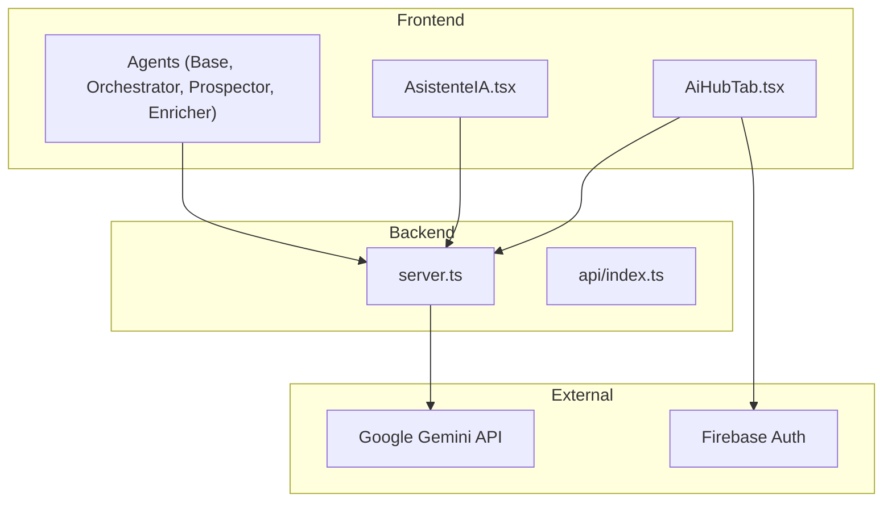
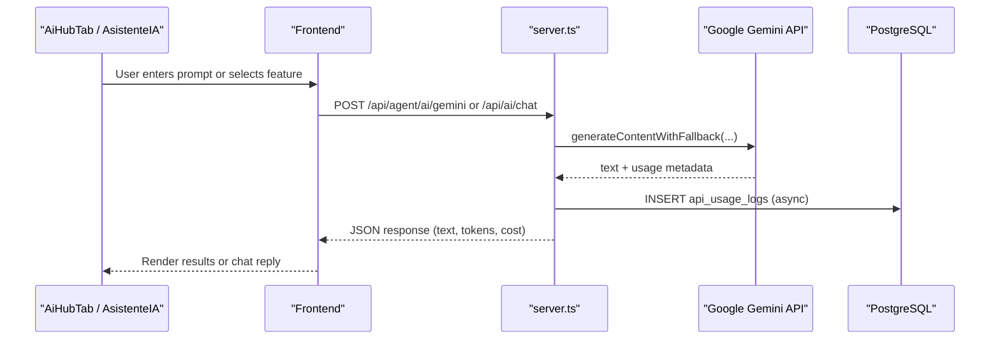
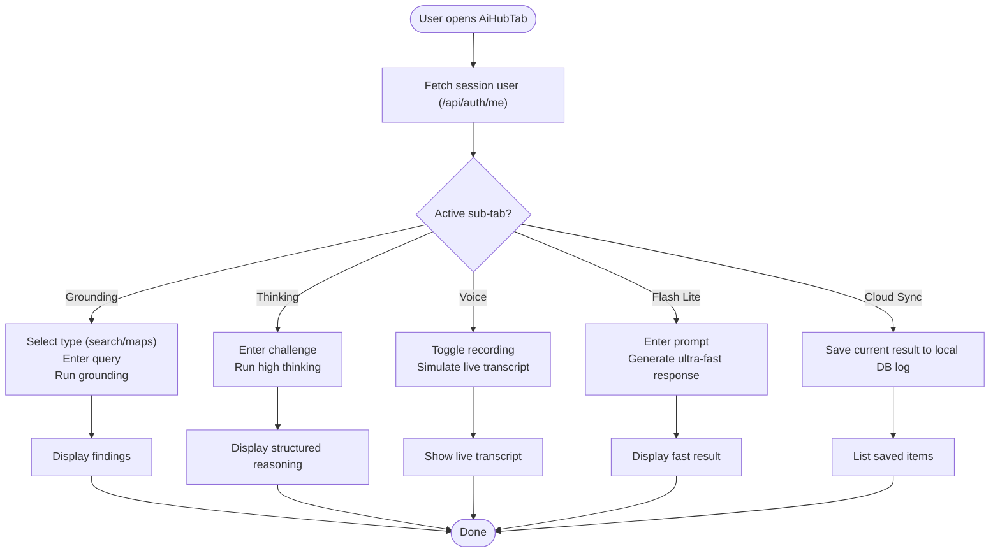
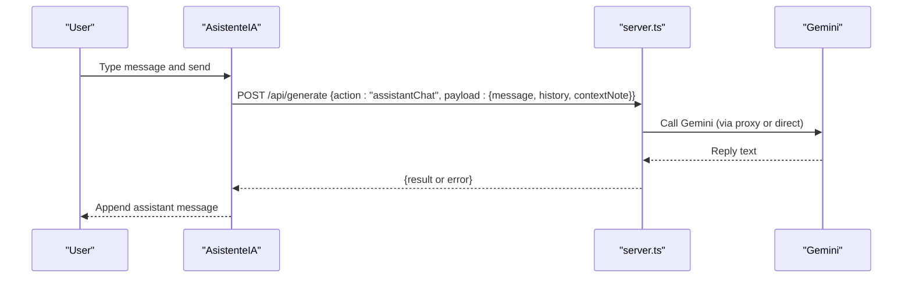
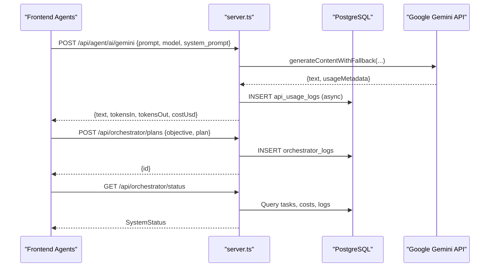
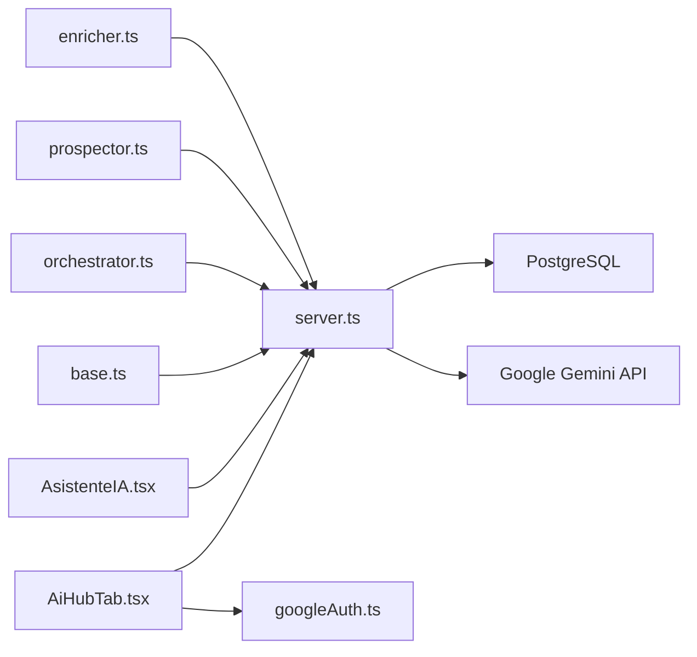

# AI Hub

<cite>
**Referenced Files in This Document**
- [AiHubTab.tsx](file://src/components/AiHubTab.tsx)
- [AsistenteIA.tsx](file://src/components/AsistenteIA.tsx)
- [base.ts](file://src/agents/base.ts)
- [orchestrator.ts](file://src/agents/orchestrator.ts)
- [types.ts](file://src/agents/types.ts)
- [prospector.ts](file://src/agents/prospector.ts)
- [enricher.ts](file://src/agents/enricher.ts)
- [index.ts](file://src/agents/index.ts)
- [googleAuth.ts](file://src/lib/googleAuth.ts)
- [server.ts](file://server.ts)
- [api/index.ts](file://api/index.ts)
</cite>

## Table of Contents
1. Introduction
2. Project Structure
3. Core Components
4. Architecture Overview
5. Detailed Component Analysis
6. Dependency Analysis
7. Performance Considerations
8. Troubleshooting Guide
9. Conclusion

## Introduction
AI Hub is the central interface for AI-powered marketing automation within the application. It provides a unified experience to interact with Google Gemini models, run strategy generation and content creation tasks, analyze leads, and orchestrate multi-agent workflows. Users can:
- Generate grounded insights using Search and Maps grounding via Gemini models
- Run high-thinking reasoning for complex strategic analysis
- Use low-latency responses for fast interactions
- Initiate voice conversations through the Live API
- Synchronize results to a local database log per user
- Orchestrate agent tasks that execute plans built by an orchestrator agent

The system integrates with server-side endpoints for authentication, Gemini proxying, task queuing, and observability, while exposing a clean UI for prompt input, result visualization, and progress tracking.

## Project Structure
AI Hub spans UI components, an agent framework, and server-side APIs:
- UI layer: AiHubTab (main hub), AsistenteIA (chat assistant), and related tabs
- Agent framework: BaseAgent, OrchestratorAgent, ProspectorAgent, EnricherAgent, and shared types
- Server: Express app with Gemini proxy, chat endpoint, orchestrator persistence, and status/metrics endpoints
- Auth: Firebase-based Google sign-in utilities



**Diagram sources**
- [AiHubTab.tsx](file://src/components/AiHubTab.tsx)
- [AsistenteIA.tsx](file://src/components/AsistenteIA.tsx)
- [base.ts](file://src/agents/base.ts)
- [orchestrator.ts](file://src/agents/orchestrator.ts)
- [server.ts](file://server.ts)
- [api/index.ts](file://api/index.ts)
- [googleAuth.ts](file://src/lib/googleAuth.ts)

**Section sources**
- [AiHubTab.tsx](file://src/components/AiHubTab.tsx)
- [AsistenteIA.tsx](file://src/components/AsistenteIA.tsx)
- [base.ts](file://src/agents/base.ts)
- [orchestrator.ts](file://src/agents/orchestrator.ts)
- [types.ts](file://src/agents/types.ts)
- [server.ts](file://server.ts)
- [api/index.ts](file://api/index.ts)
- [googleAuth.ts](file://src/lib/googleAuth.ts)

## Core Components
- AiHubTab: Unified tabbed interface for grounding, thinking, voice, flash-lite, and cloud sync features. Manages state for prompts, results, loading indicators, and user session checks.
- AsistenteIA: Chat panel that sends messages to /api/generate and renders conversation history with suggested prompts.
- BaseAgent: Abstract base class handling task lifecycle, retries, logging, cost tracking, and Gemini calls via /api/agent/ai/gemini.
- OrchestratorAgent: Parses objectives into execution plans using Gemini, persists plans, and dispatches steps to agents respecting dependencies.
- ProspectorAgent and EnricherAgent: Specialized agents delegating to server-side runners for external data sources and enrichment.
- Types: Shared interfaces for tasks, logs, results, companies, leads, proposals, campaigns, and conversations.
- Server: Express routes for Gemini proxy, chat, orchestrator plan storage, status/metrics, and more.
- Google Auth: Firebase integration for Google sign-in and access token management.

**Section sources**
- [AiHubTab.tsx](file://src/components/AiHubTab.tsx)
- [AsistenteIA.tsx](file://src/components/AsistenteIA.tsx)
- [base.ts](file://src/agents/base.ts)
- [orchestrator.ts](file://src/agents/orchestrator.ts)
- [prospector.ts](file://src/agents/prospector.ts)
- [enricher.ts](file://src/agents/enricher.ts)
- [types.ts](file://src/agents/types.ts)
- [server.ts](file://server.ts)
- [googleAuth.ts](file://src/lib/googleAuth.ts)

## Architecture Overview
The AI Hub architecture combines a React frontend with a Node/Express backend. The frontend exposes interactive tabs and a chat assistant. The backend proxies requests to Google Gemini, manages sessions, stores orchestration plans, and tracks usage metrics. Agents encapsulate business logic and communicate with the server for task lifecycle and logging.



**Diagram sources**
- [AiHubTab.tsx](file://src/components/AiHubTab.tsx)
- [AsistenteIA.tsx](file://src/components/AsistenteIA.tsx)
- [server.ts](file://server.ts)

## Detailed Component Analysis

### AiHubTab: Strategy Generation, Content Creation, Lead Analysis, Voice, Flash Lite, Cloud Sync
- Sub-tabs:
  - Grounding: Simulates search/maps grounding queries and displays findings; supports saving to local DB logs per user.
  - High Thinking Mode: Runs deep reasoning prompts and shows structured outputs.
  - Voice & Live Conversations: UI for real-time voice interaction with live model preview.
  - Low-Latency Flash Lite: Fast responses for quick prompts.
  - Database Cloud Sync: Persists logs locally keyed by user ID and lists saved items.
- State management: Tracks active sub-tab, current user, prompts, results, loading states, and sync status.
- Integration points:
  - Fetches session user from /api/auth/me
  - Saves logs to localStorage under a user-specific key
  - Displays results and allows saving to “database” (local storage)



**Diagram sources**
- [AiHubTab.tsx](file://src/components/AiHubTab.tsx)

**Section sources**
- [AiHubTab.tsx](file://src/components/AiHubTab.tsx)

### AsistenteIA: Chat Assistant
- Sends messages to /api/generate with action “assistantChat”, including message history and optional context note based on active section.
- Renders conversation bubbles, loading indicator, and suggested prompts.
- Supports auto-scroll and focus behavior when opened.



**Diagram sources**
- [AsistenteIA.tsx](file://src/components/AsistenteIA.tsx)
- [server.ts](file://server.ts)

**Section sources**
- [AsistenteIA.tsx](file://src/components/AsistenteIA.tsx)

### Agent Framework: BaseAgent, OrchestratorAgent, ProspectorAgent, EnricherAgent
- BaseAgent:
  - Provides run() lifecycle: create task, update status, execute, complete/fail, retry with backoff
  - Logs actions and tracks API usage
  - callGemini() proxies to /api/agent/ai/gemini with model selection and system prompt support
- OrchestratorAgent:
  - buildPlan() uses Gemini to produce a structured plan with steps, agents, inputs, and dependencies
  - saveOrchestration() persists plan to /api/orchestrator/plans
  - dispatchAgent() creates tasks via /api/agent/tasks and handles errors
- ProspectorAgent and EnricherAgent:
  - Delegate to server-side runners at /api/agent/run/prospect and /api/agent/run/enrich
  - Track usage and return standardized results

```mermaid
classDiagram
class BaseAgent {
+run(input, options) AgentResult
-createTask(input, opts)
-updateTaskStatus(status)
-completeTask(result, durationMs)
-failTask(error, durationMs)
-log(action, detail, meta)
-trackApiUsage(opts)
#callGemini(prompt, opts)
}
class OrchestratorAgent {
+execute(input, log) AgentResult
-buildPlan(objective, log) OrchestratorPlan
-saveOrchestration(objective, plan) string
-dispatchAgent(opts) {taskId}
}
class ProspectorAgent {
+execute(input, log) AgentResult
}
class EnricherAgent {
+execute(input, log) AgentResult
}
BaseAgent <|-- OrchestratorAgent
BaseAgent <|-- ProspectorAgent
BaseAgent <|-- EnricherAgent
```

**Diagram sources**
- [base.ts](file://src/agents/base.ts)
- [orchestrator.ts](file://src/agents/orchestrator.ts)
- [prospector.ts](file://src/agents/prospector.ts)
- [enricher.ts](file://src/agents/enricher.ts)

**Section sources**
- [base.ts](file://src/agents/base.ts)
- [orchestrator.ts](file://src/agents/orchestrator.ts)
- [prospector.ts](file://src/agents/prospector.ts)
- [enricher.ts](file://src/agents/enricher.ts)
- [types.ts](file://src/agents/types.ts)
- [index.ts](file://src/agents/index.ts)

### Server-Side Integrations: Gemini Proxy, Chat, Orchestrator Persistence, Status/Metrics
- Gemini proxy (/api/agent/ai/gemini): Accepts prompt, model, and optional system_prompt; constructs contents, calls generateContentWithFallback, returns text and usage metadata; logs usage asynchronously.
- Chat endpoint (/api/ai/chat): Multi-turn chat with role personas and custom model speeds; falls back to free AI if Gemini unavailable.
- Orchestrator endpoints:
  - POST /api/orchestrator/plans: Persist objective and plan
  - GET /api/orchestrator/status: Live snapshot of tasks, costs, API usage, recent logs
  - GET /api/orchestrator/metrics: Historical metrics over configurable periods
- Authentication: Session management, password reset emails, Neon Auth fallback, and admin/user roles.



**Diagram sources**
- [server.ts](file://server.ts)

**Section sources**
- [server.ts](file://server.ts)

### Google Auth Integration
- Firebase initialization and provider setup with Drive scope
- Sign-in flow returning user and access token
- Access token caching and logout functionality

**Section sources**
- [googleAuth.ts](file://src/lib/googleAuth.ts)

## Dependency Analysis
- Frontend components depend on server endpoints for AI generation, chat, and orchestrator operations.
- Agents depend on BaseAgent for lifecycle and Gemini proxying; specialized agents delegate to server runners.
- Server depends on PostgreSQL for persistence and Google Gemini SDK for AI capabilities.
- Auth flows integrate Firebase for Google sign-in and session management.



**Diagram sources**
- [AiHubTab.tsx](file://src/components/AiHubTab.tsx)
- [AsistenteIA.tsx](file://src/components/AsistenteIA.tsx)
- [base.ts](file://src/agents/base.ts)
- [orchestrator.ts](file://src/agents/orchestrator.ts)
- [prospector.ts](file://src/agents/prospector.ts)
- [enricher.ts](file://src/agents/enricher.ts)
- [server.ts](file://server.ts)
- [googleAuth.ts](file://src/lib/googleAuth.ts)

**Section sources**
- [server.ts](file://server.ts)
- [base.ts](file://src/agents/base.ts)
- [orchestrator.ts](file://src/agents/orchestrator.ts)
- [prospector.ts](file://src/agents/prospector.ts)
- [enricher.ts](file://src/agents/enricher.ts)
- [googleAuth.ts](file://src/lib/googleAuth.ts)

## Performance Considerations
- Model selection:
  - Use gemini-3.1-flash-lite for ultra-low latency responses in chat and quick prompts
  - Use gemini-3.6-flash for balanced performance and grounding
  - Use gemini-3.1-pro-preview for high-thinking reasoning tasks
- Retry and backoff: BaseAgent implements exponential backoff for resilient execution
- Async logging: Usage logs are inserted asynchronously to avoid blocking responses
- Fallback strategies: Chat endpoint falls back to free AI when Gemini is unavailable
- Local caching: AiHubTab caches logs per user in localStorage to reduce network overhead

[No sources needed since this section provides general guidance]

## Troubleshooting Guide
- Gemini API key missing:
  - Ensure GEMINI_API_KEY or GEMINI_API_KEY_V2 is configured; server will return 503 if not available
- Authentication failures:
  - Verify session configuration and Neon Auth settings; check email/password validation and role checks
- Task failures:
  - Inspect agent logs via /api/orchestrator/status and recent logs; review error messages returned by runners
- Rate limits and timeouts:
  - Increase maxRetries in BaseAgent.run options; adjust timeoutMs where applicable
- Data persistence issues:
  - Confirm PostgreSQL connection and table existence; verify async insertions do not block responses

**Section sources**
- [server.ts](file://server.ts)
- [base.ts](file://src/agents/base.ts)
- [orchestrator.ts](file://src/agents/orchestrator.ts)

## Conclusion
AI Hub consolidates AI-powered marketing automation into a cohesive interface, enabling users to generate strategies, create content, analyze leads, and orchestrate multi-agent workflows. Through robust server-side integrations with Google Gemini, secure authentication, and comprehensive observability, it delivers a scalable foundation for advanced marketing automation. Optimizing model selection, leveraging retries and fallbacks, and monitoring usage ensure reliable and cost-effective operations.

[No sources needed since this section summarizes without analyzing specific files]