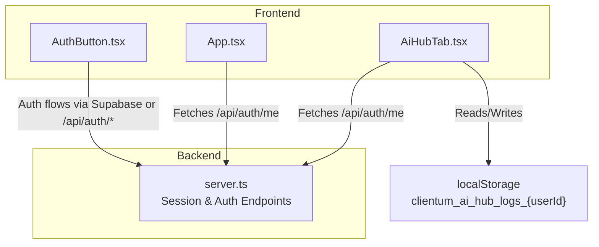
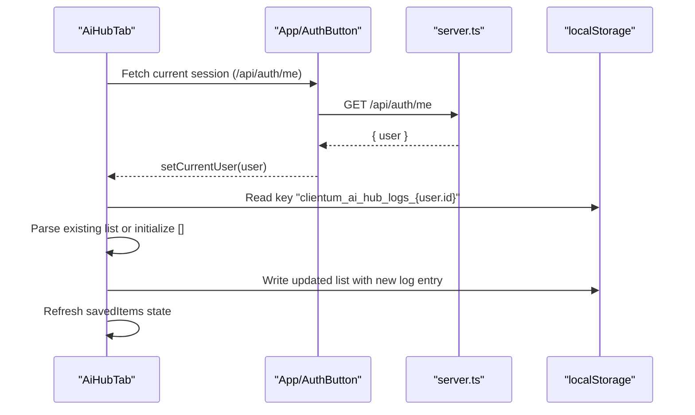
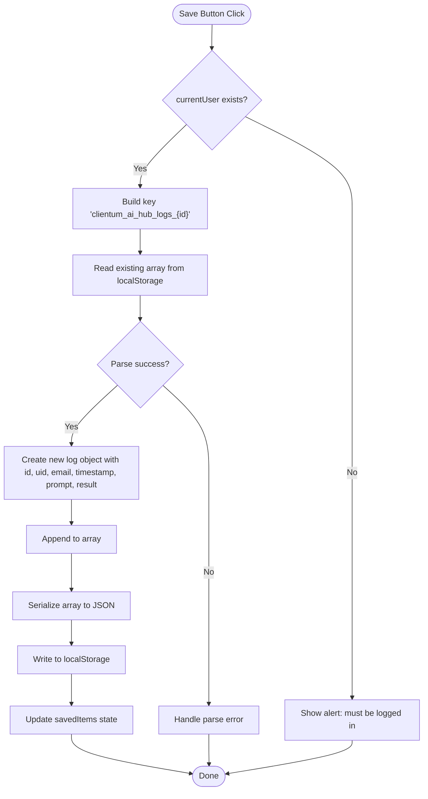
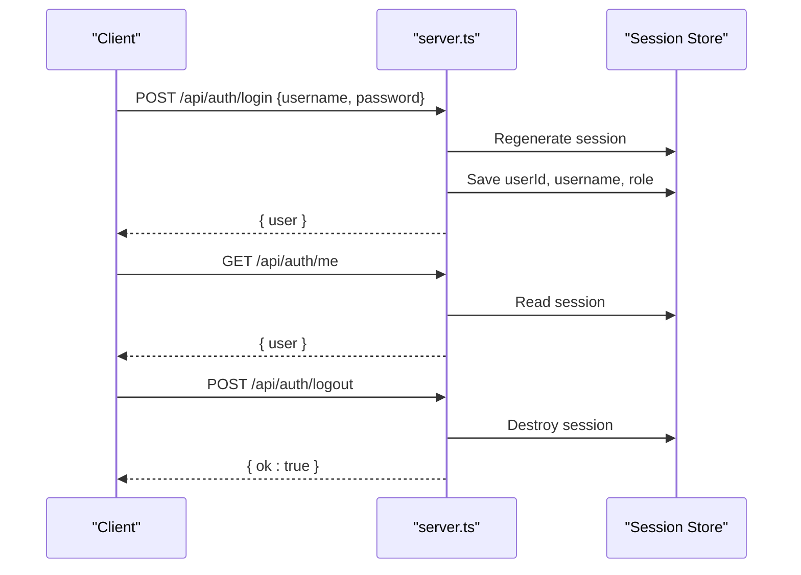
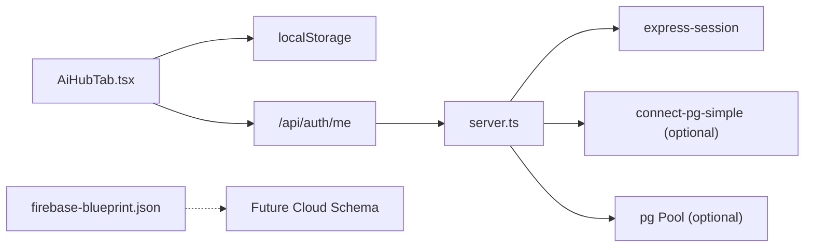

# Database Cloud Sync

<cite>
**Referenced Files in This Document**
- [AiHubTab.tsx](file://src/components/AiHubTab.tsx)
- [server.ts](file://server.ts)
- [App.tsx](file://src/App.tsx)
- [AuthButton.tsx](file://src/components/AuthButton.tsx)
- [base.ts](file://src/agents/base.ts)
- [package.json](file://package.json)
- [firebase-blueprint.json](file://firebase-blueprint.json)
</cite>

## Table of Contents
1. [Introduction](#introduction)
2. [Project Structure](#project-structure)
3. [Core Components](#core-components)
4. [Architecture Overview](#architecture-overview)
5. [Detailed Component Analysis](#detailed-component-analysis)
6. [Dependency Analysis](#dependency-analysis)
7. [Performance Considerations](#performance-considerations)
8. [Troubleshooting Guide](#troubleshooting-guide)
9. [Conclusion](#conclusion)
10. [Appendices](#appendices)

## Introduction
This document explains the Database Cloud Sync feature that persists AI Hub interactions to local storage and provides user-specific data synchronization. It covers authentication-based data isolation, localStorage schema design, user session management, and data persistence patterns. It also documents the sync workflow including user identification, data structure for AI logs, timestamp management, retrieval operations, security considerations for client-side storage, privacy compliance, and data export capabilities. Finally, it outlines integration patterns with backend services for future cloud migration and provides troubleshooting guidance for localStorage limitations, cross-browser compatibility, and backup strategies.

## Project Structure
The Database Cloud Sync is implemented primarily in the AI Hub tab component and relies on the application’s authentication flow to isolate data per user. The server provides session endpoints used by the frontend to establish a user context. Agent logging utilities are present for backend telemetry but are separate from the AI Hub local sync.

**Diagram sources**
- [AiHubTab.tsx:126-170](file://src/components/AiHubTab.tsx#L126-L170)
- [server.ts:266-392](file://server.ts#L266-L392)
- [App.tsx:50-88](file://src/App.tsx#L50-L88)
- [AuthButton.tsx:28-60](file://src/components/AuthButton.tsx#L28-L60)

**Section sources**
- [AiHubTab.tsx:126-170](file://src/components/AiHubTab.tsx#L126-L170)
- [server.ts:266-392](file://server.ts#L266-L392)
- [App.tsx:50-88](file://src/App.tsx#L50-L88)
- [AuthButton.tsx:28-60](file://src/components/AuthButton.tsx#L28-L60)

## Core Components
- AiHubTab: Implements the UI and logic for saving AI Hub interactions to localStorage under a user-scoped key. It reads/writes JSON arrays and displays saved items.
- Server (Express): Provides session endpoints (/api/auth/me, /api/auth/login, /api/auth/register, /api/auth/logout) and middleware to enforce authenticated sessions.
- App: Initializes global session checks and dispatches auth-changed events to keep components synchronized.
- AuthButton: Handles login/register/forgot-password flows using Supabase when available or falls back to server endpoints.

Key responsibilities:
- User identification: Each component fetches the current user via /api/auth/me and uses the user id to scope localStorage keys.
- Data persistence: AiHubTab writes an array of log entries per user into localStorage.
- Session lifecycle: Login/register create sessions; logout destroys them and clears cookies.

**Section sources**
- [AiHubTab.tsx:126-170](file://src/components/AiHubTab.tsx#L126-L170)
- [server.ts:266-392](file://server.ts#L266-L392)
- [App.tsx:50-88](file://src/App.tsx#L50-L88)
- [AuthButton.tsx:28-60](file://src/components/AuthButton.tsx#L28-L60)

## Architecture Overview
The sync architecture combines client-side persistence with server-managed sessions. Authentication ensures that each user’s localStorage data is isolated by their unique id. The AI Hub tab performs read/write operations against localStorage keyed by user id.

**Diagram sources**
- [AiHubTab.tsx:126-170](file://src/components/AiHubTab.tsx#L126-L170)
- [server.ts:266-392](file://server.ts#L266-L392)
- [App.tsx:50-88](file://src/App.tsx#L50-L88)

## Detailed Component Analysis

### AiHubTab: Local Storage Schema and Sync Workflow
- User identification: The component calls /api/auth/me to obtain the current user object containing id and username.
- Key scoping: Uses a deterministic key pattern "clientum_ai_hub_logs_{currentUser.id}" to isolate data per user.
- Data structure: Stores an array of log objects. Each log includes:
  - id: Unique identifier generated at write time
  - uid: User id
  - email: Username used as an email-like identifier
  - timestamp: ISO string of creation time
  - prompt: Input text from either thinking or grounding mode
  - result: Output content, either a string or serialized JSON
- Persistence pattern: Reads existing array, appends new log, serializes and writes back to localStorage.
- Retrieval: On mount or when currentUser changes, loads the array and updates state for display.

**Diagram sources**
- [AiHubTab.tsx:126-170](file://src/components/AiHubTab.tsx#L126-L170)

**Section sources**
- [AiHubTab.tsx:126-170](file://src/components/AiHubTab.tsx#L126-L170)

### Server: Session Management and Authentication Endpoints
- Session configuration: Express-session configured with secure cookie settings and optional PostgreSQL-backed store if DATABASE_URL is set.
- Auth endpoints:
  - POST /api/auth/register: Validates input, hashes password, creates user, initializes session.
  - POST /api/auth/login: Validates credentials, regenerates session, sets userId/username/role.
  - POST /api/auth/logout: Destroys session and clears cookie.
  - GET /api/auth/me: Returns current user based on session.
- Middleware: requireAuth enforces session presence; requireAdmin re-checks role from DB.

**Diagram sources**
- [server.ts:266-392](file://server.ts#L266-L392)

**Section sources**
- [server.ts:266-392](file://server.ts#L266-L392)

### App and AuthButton: Global Session Handling
- App: On mount, fetches /api/auth/me and maintains currentUser state across the app. Dispatches auth-changed events on logout to refresh components.
- AuthButton: Supports Supabase-based auth when available; otherwise falls back to server endpoints for login/register/forgot-password. Updates global session state and triggers auth-changed events.

**Section sources**
- [App.tsx:50-88](file://src/App.tsx#L50-L88)
- [AuthButton.tsx:28-60](file://src/components/AuthButton.tsx#L28-L60)

### Agents Base Logging (Separate Backend Telemetry)
- The agents base module posts structured logs to /api/agent/logs and usage metrics to /api/agent/api-usage. These are independent from the AI Hub localStorage sync and serve backend telemetry purposes.

**Section sources**
- [base.ts:128-171](file://src/agents/base.ts#L128-L171)

## Dependency Analysis
- Frontend dependencies:
  - React components rely on fetch API for session checks and localStorage for persistence.
- Backend dependencies:
  - Express, express-session, connect-pg-simple (optional), pg pool for database-backed sessions when DATABASE_URL is provided.
- Optional cloud schema:
  - firebase-blueprint.json defines Firestore entity schemas for other features; not directly used by AI Hub localStorage sync but indicates potential future cloud migration paths.

**Diagram sources**
- [AiHubTab.tsx:126-170](file://src/components/AiHubTab.tsx#L126-L170)
- [server.ts:266-392](file://server.ts#L266-L392)
- [firebase-blueprint.json:1-41](file://firebase-blueprint.json#L1-L41)

**Section sources**
- [package.json:16-45](file://package.json#L16-L45)
- [firebase-blueprint.json:1-41](file://firebase-blueprint.json#L1-L41)

## Performance Considerations
- localStorage operations are synchronous and can block the main thread; batch writes and avoid frequent large payloads.
- Keep log arrays bounded; consider trimming older entries or implementing pagination in the UI.
- Avoid excessive parsing; cache parsed arrays in memory during a session.
- For future cloud migration, prefer server-side persistence with proper indexing and pagination.

[No sources needed since this section provides general guidance]

## Troubleshooting Guide
Common issues and resolutions:
- localStorage quota exceeded:
  - Symptoms: Write failures, inability to save new logs.
  - Resolution: Implement size limits, prune old entries, or migrate to server-side storage.
- Cross-browser compatibility:
  - Some browsers restrict localStorage in private/incognito modes or third-party contexts.
  - Resolution: Detect availability and provide fallback messaging or cloud sync option.
- Data corruption:
  - Malformed JSON in localStorage leads to parse errors.
  - Resolution: Wrap parse operations in try/catch; reset corrupted keys gracefully.
- Session misalignment:
  - If session expires, currentUser becomes null and sync is blocked.
  - Resolution: Re-fetch /api/auth/me on auth-changed events; guide users to re-login.
- Backup strategy:
  - Export saved logs periodically to CSV/JSON for recovery.
  - Provide UI actions to download/export stored logs.

**Section sources**
- [AiHubTab.tsx:126-170](file://src/components/AiHubTab.tsx#L126-L170)
- [server.ts:266-392](file://server.ts#L266-L392)

## Conclusion
The Database Cloud Sync feature leverages localStorage for immediate, user-scoped persistence of AI Hub interactions while relying on server-managed sessions for identity and isolation. It offers a simple, robust mechanism for offline-first logging and quick retrieval. Future enhancements should include server-side persistence, robust export tools, and safeguards against localStorage limitations.

[No sources needed since this section summarizes without analyzing specific files]

## Appendices

### Security Considerations for Client-Side Storage
- Do not store sensitive secrets or tokens in localStorage.
- Treat stored prompts/results as potentially sensitive; ensure privacy policies and consent are clear.
- Use HTTPS and secure cookies for sessions to prevent interception.

**Section sources**
- [server.ts:112-125](file://server.ts#L112-L125)

### Data Export Capabilities
- Implement CSV/JSON export functions similar to those used elsewhere in the app to allow users to download their AI Hub logs.

**Section sources**
- [CrmFullCMDB.tsx:223-321](file://src/components/crm-full/CrmFullCMDB.tsx#L223-L321)

### Integration Patterns for Future Cloud Migration
- Replace localStorage writes with server-side endpoints that persist logs to a database or cloud service.
- Maintain backward compatibility by reading from both localStorage and cloud APIs until migration completes.
- Use consistent schema definitions (e.g., Firebase blueprint patterns) to align future cloud storage structures.

**Section sources**
- [firebase-blueprint.json:1-41](file://firebase-blueprint.json#L1-L41)