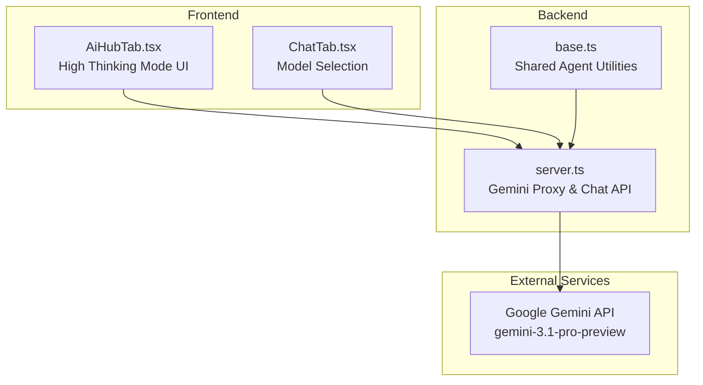
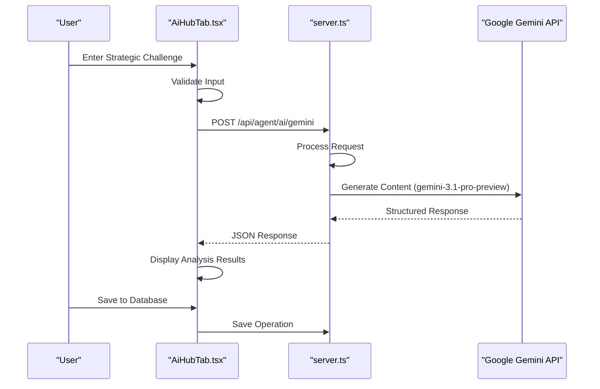
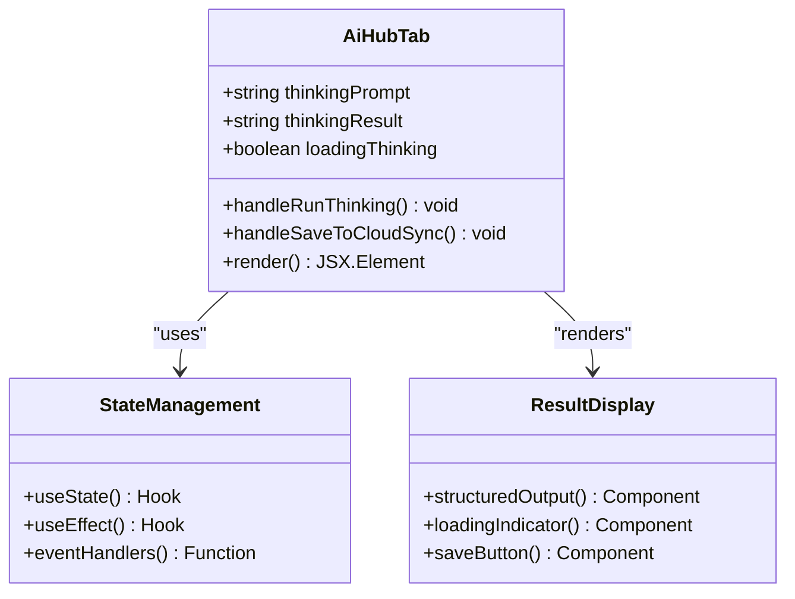
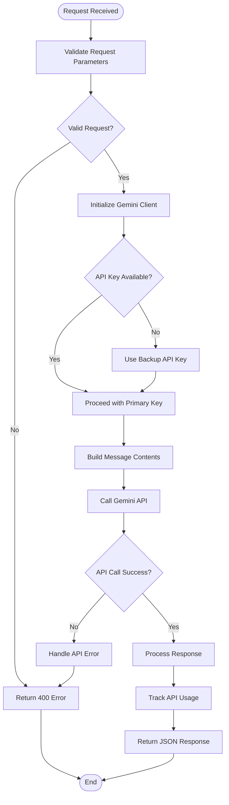
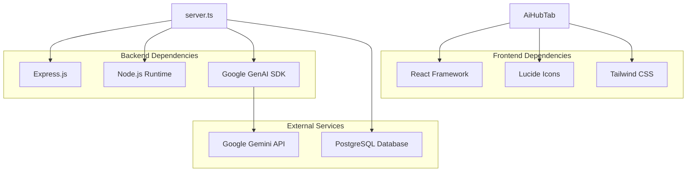

# High Thinking Mode

<cite>
**Referenced Files in This Document**
- [AiHubTab.tsx](file://src/components/AiHubTab.tsx)
- [server.ts](file://server.ts)
- [base.ts](file://src/agents/base.ts)
- [types.ts](file://src/agents/types.ts)
- [ChatTab.tsx](file://src/components/ChatTab.tsx)
- [README.md](file://README.md)
</cite>

## Table of Contents
1. [Introduction](#introduction)
2. [Project Structure](#project-structure)
3. [Core Components](#core-components)
4. [Architecture Overview](#architecture-overview)
5. [Detailed Component Analysis](#detailed-component-analysis)
6. [Dependency Analysis](#dependency-analysis)
7. [Performance Considerations](#performance-considerations)
8. [Troubleshooting Guide](#troubleshooting-guide)
9. [Conclusion](#conclusion)
10. [Appendices](#appendices)

## Introduction
High Thinking Mode is a specialized reasoning capability within the AI Hub that leverages advanced strategic analysis using the gemini-3.1-pro-preview model. It enables multi-step problem solving and structured reasoning output tailored for marketing strategy development, particularly suited to complex challenges such as market expansion, competitive analysis, and business model optimization for Latin American markets. The mode emphasizes structured outputs including market diagnosis, architecture recommendations, cost analysis, and actionable conclusions.

## Project Structure
The High Thinking Mode feature is primarily implemented in the AI Hub tab component, with backend support provided by server endpoints and shared agent utilities. Key files include:
- AiHubTab.tsx: UI and logic for High Thinking Mode interactions
- server.ts: Backend proxy for Gemini API calls and chat endpoints
- base.ts: Shared agent utilities including Gemini helper functions
- types.ts: Agent-related type definitions
- ChatTab.tsx: Model selection interface including gemini-3.1-pro-preview
- README.md: Setup instructions for running the application

**Diagram sources**
- [AiHubTab.tsx:1-565](file://src/components/AiHubTab.tsx#L1-L565)
- [server.ts:4054-4127](file://server.ts#L4054-L4127)
- [base.ts:173-198](file://src/agents/base.ts#L173-L198)

**Section sources**
- [AiHubTab.tsx:1-565](file://src/components/AiHubTab.tsx#L1-L565)
- [server.ts:4054-4127](file://server.ts#L4054-L4127)
- [base.ts:173-198](file://src/agents/base.ts#L173-L198)

## Core Components
High Thinking Mode consists of several key components working together to provide advanced strategic analysis capabilities:

### High Thinking Mode Interface
The main interface provides users with a dedicated space for complex strategic analysis through a textarea input and result display area.

### Model Configuration
The system supports multiple Gemini models with High Thinking Mode specifically utilizing gemini-3.1-pro-preview for deep reasoning tasks.

### Backend Integration
Server-side endpoints handle the actual API calls to Google's Gemini service while maintaining security and error handling.

**Section sources**
- [AiHubTab.tsx:351-411](file://src/components/AiHubTab.tsx#L351-L411)
- [ChatTab.tsx:70-74](file://src/components/ChatTab.tsx#L70-L74)
- [server.ts:4054-4099](file://server.ts#L4054-L4099)

## Architecture Overview
The High Thinking Mode follows a client-server architecture pattern where the frontend handles user interaction and the backend manages API communication with Google's Gemini service.

**Diagram sources**
- [AiHubTab.tsx:91-108](file://src/components/AiHubTab.tsx#L91-L108)
- [server.ts:4054-4099](file://server.ts#L4054-L4099)

## Detailed Component Analysis

### High Thinking Mode UI Component
The AiHubTab component implements the complete user interface for High Thinking Mode, including state management, input validation, and result rendering.

#### State Management
The component maintains several state variables for managing the thinking process:
- thinkingPrompt: Stores the user's strategic challenge input
- thinkingResult: Holds the generated analysis output
- loadingThinking: Controls the loading state during processing

#### Input Handling
Users can enter complex strategic challenges through a textarea component designed for detailed problem descriptions.

#### Output Rendering
Results are displayed in a monospace-formatted container that preserves the structured nature of the analysis output.

**Diagram sources**
- [AiHubTab.tsx:43-56](file://src/components/AiHubTab.tsx#L43-L56)
- [AiHubTab.tsx:351-411](file://src/components/AiHubTab.tsx#L351-L411)

**Section sources**
- [AiHubTab.tsx:43-56](file://src/components/AiHubTab.tsx#L43-L56)
- [AiHubTab.tsx:351-411](file://src/components/AiHubTab.tsx#L351-L411)

### Backend Gemini Integration
The server.ts file provides the backend infrastructure for processing High Thinking Mode requests through Google's Gemini API.

#### API Endpoint Implementation
The /api/agent/ai/gemini endpoint handles all Gemini API calls with proper error handling and response formatting.

#### Model Configuration
The system supports different Gemini models with gemini-3.1-pro-preview being the primary choice for High Thinking Mode due to its advanced reasoning capabilities.

#### Error Handling and Logging
Comprehensive error handling ensures robust operation with detailed logging for debugging and monitoring purposes.

**Diagram sources**
- [server.ts:4054-4099](file://server.ts#L4054-L4099)

**Section sources**
- [server.ts:4054-4099](file://server.ts#L4054-L4099)

### Agent Base Class and Utilities
The base.ts file provides shared functionality used across all agents, including Gemini integration utilities.

#### Gemini Helper Function
The callGemini method provides a standardized way for agents to interact with the Gemini API while maintaining consistent error handling and response processing.

#### Configuration Management
The function supports flexible configuration options including model selection and system prompts.

#### Error Handling Patterns
Consistent error handling patterns ensure reliable operation across different agent implementations.

**Section sources**
- [base.ts:173-198](file://src/agents/base.ts#L173-L198)

## Dependency Analysis
High Thinking Mode has well-defined dependencies between frontend components, backend services, and external APIs.

**Diagram sources**
- [AiHubTab.tsx:1-10](file://src/components/AiHubTab.tsx#L1-L10)
- [server.ts:4054-4099](file://server.ts#L4054-L4099)

**Section sources**
- [AiHubTab.tsx:1-10](file://src/components/AiHubTab.tsx#L1-L10)
- [server.ts:4054-4099](file://server.ts#L4054-L4099)

## Performance Considerations
High Thinking Mode is designed for complex strategic analysis which inherently requires more computational resources than simple text generation. Key performance considerations include:

### Processing Time
Complex strategic analysis typically takes longer to process compared to simple queries, with the current implementation showing approximately 1.2 seconds processing time.

### Memory Usage
Advanced reasoning capabilities require more memory allocation for context management and analysis processing.

### API Rate Limits
Careful consideration of Google Gemini API rate limits when implementing high-frequency usage patterns.

### Caching Strategies
Potential for caching common strategic patterns to reduce repeated processing overhead.

## Troubleshooting Guide
Common issues and their solutions when working with High Thinking Mode:

### API Connection Issues
- Verify GEMINI_API_KEY environment variable is properly configured
- Check network connectivity to Google Gemini API endpoints
- Ensure backup API key (GEMINI_API_KEY_V2) is available if primary key fails

### Model Availability
- Confirm gemini-3.1-pro-preview model is accessible in your region
- Check for any service outages or maintenance windows
- Verify API quota limits haven't been exceeded

### Input Validation
- Ensure strategic challenge descriptions are sufficiently detailed
- Check for any special characters or encoding issues in input text
- Validate textarea content length limitations

### Response Processing
- Monitor console logs for any JavaScript errors during response parsing
- Verify JSON response structure matches expected format
- Check for any character encoding issues in long responses

**Section sources**
- [server.ts:4095-4099](file://server.ts#L4095-L4099)
- [base.ts:187-192](file://src/agents/base.ts#L187-L192)

## Conclusion
High Thinking Mode represents a sophisticated approach to strategic analysis within the AI marketing dashboard. By leveraging the advanced reasoning capabilities of gemini-3.1-pro-preview, it enables comprehensive market analysis, competitive intelligence, and strategic planning for Latin American markets. The modular architecture ensures maintainability while providing a user-friendly interface for complex analytical tasks.

## Appendices

### Example Strategic Challenges for High Thinking Mode

#### Market Expansion Strategy
Develop a comprehensive market expansion strategy for a B2B SaaS company targeting industrial SMEs in Patagonia, Argentina. Include market segmentation, competitive positioning, pricing strategies, and go-to-market tactics specific to the regional characteristics.

#### Competitive Analysis Framework
Create a detailed competitive analysis framework for digital marketing agencies operating in Neuquén and Bariloche regions. Analyze competitor strengths, weaknesses, market gaps, and differentiation opportunities.

#### Business Model Optimization
Design a business model optimization strategy for a WhatsApp automation platform serving Latin American businesses. Focus on monetization strategies, customer acquisition costs, lifetime value optimization, and churn reduction techniques.

### Prompt Engineering Best Practices

#### Structured Problem Definition
Clearly define the strategic challenge with specific context, constraints, and desired outcomes. Include relevant market data, target audience characteristics, and business objectives.

#### Contextual Information
Provide sufficient background information about the market, industry trends, and competitive landscape to enable informed analysis.

#### Output Format Specification
Specify the desired output structure including sections for market diagnosis, architectural recommendations, cost analysis, and actionable conclusions.

#### Regional Considerations
Include specific references to Latin American market characteristics, cultural factors, regulatory environments, and economic conditions.

**Section sources**
- [AiHubTab.tsx:95-101](file://src/components/AiHubTab.tsx#L95-L101)
- [README.md:1-21](file://README.md#L1-L21)