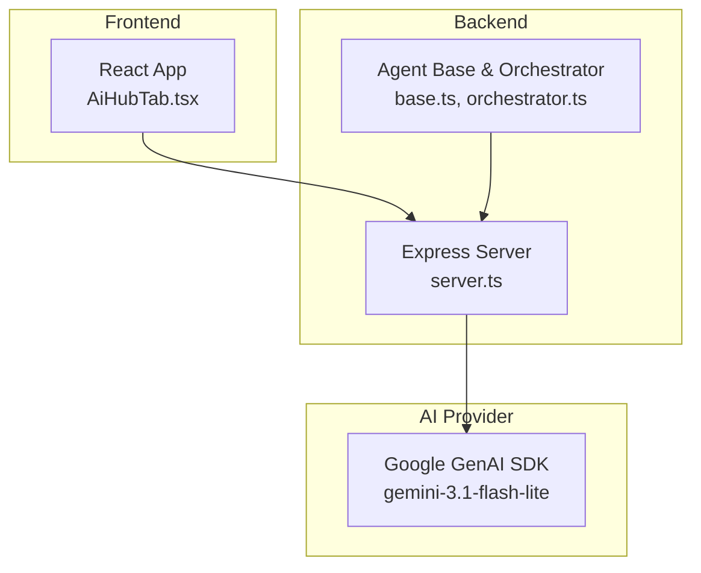
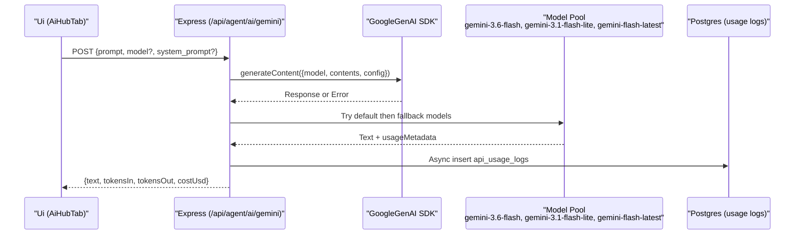
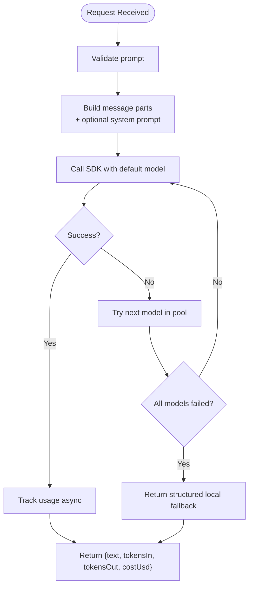
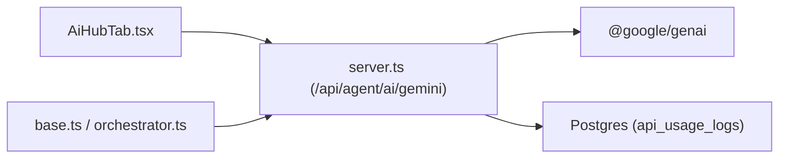

# Low-Latency Flash Lite

<cite>
**Referenced Files in This Document**
- [server.ts](file://server.ts)
- [base.ts](file://src/agents/base.ts)
- [orchestrator.ts](file://src/agents/orchestrator.ts)
- [types.ts](file://src/agents/types.ts)
- [AiHubTab.tsx](file://src/components/AiHubTab.tsx)
- [package.json](file://package.json)
- [README.md](file://README.md)
</cite>

## Table of Contents
1. [Introduction](#introduction)
2. [Project Structure](#project-structure)
3. [Core Components](#core-components)
4. [Architecture Overview](#architecture-overview)
5. [Detailed Component Analysis](#detailed-component-analysis)
6. [Dependency Analysis](#dependency-analysis)
7. [Performance Considerations](#performance-considerations)
8. [Troubleshooting Guide](#troubleshooting-guide)
9. [Conclusion](#conclusion)
10. [Appendices](#appendices)

## Introduction
This document explains the Low-Latency Flash Lite feature that leverages the gemini-3.1-flash-lite model to deliver ultra-fast AI responses for real-time user experiences. It covers ideal use cases (autocomplete suggestions, real-time chat validation, quick content generation, and interactive form assistance), performance characteristics, optimal prompt patterns, integration patterns for real-time UIs, example applications tailored for Latin American audiences, and technical implementation details including request optimization, response caching strategies, and fallback mechanisms.

## Project Structure
The project is a React + Vite frontend with an Express server that proxies calls to Google’s Gemini API via @google/genai. The low-latency path is exposed through a dedicated endpoint and integrated into the UI via a dedicated tab.



**Diagram sources**
- [server.ts:4057-4099](file://server.ts#L4057-L4099)
- [base.ts:174-192](file://src/agents/base.ts#L174-L192)
- [orchestrator.ts:79-144](file://src/agents/orchestrator.ts#L79-L144)
- [AiHubTab.tsx:460-512](file://src/components/AiHubTab.tsx#L460-L512)

**Section sources**
- [README.md:1-21](file://README.md#L1-L21)
- [package.json:1-64](file://package.json#L1-L64)

## Core Components
- Low-latency proxy endpoint: POST /api/agent/ai/gemini accepts a prompt and optional system_prompt, returns text plus token usage and cost.
- Fallback engine: generateContentWithFallback tries multiple models including gemini-3.1-flash-lite and falls back to structured local responses when needed.
- Agent base helper: BaseAgent.callGemini provides a shared client-side/server-side method to call the proxy endpoint.
- UI entry point: AiHubTab exposes a “Low-Latency Responses” panel labeled gemini-3.1-flash-lite for instant prompts.

Key responsibilities:
- Request normalization and routing to Gemini via the SDK.
- Model selection and retry/fallback across models.
- Usage tracking and cost estimation.
- Consistent error handling and safe fallbacks.

**Section sources**
- [server.ts:4057-4099](file://server.ts#L4057-L4099)
- [server.ts:881-971](file://server.ts#L881-L971)
- [base.ts:174-192](file://src/agents/base.ts#L174-L192)
- [AiHubTab.tsx:460-512](file://src/components/AiHubTab.tsx#L460-L512)

## Architecture Overview
The low-latency flow starts at the UI, goes through the Express proxy, uses the Google GenAI SDK, and applies a robust fallback strategy. Agents can also call the same endpoint for backend tasks.



**Diagram sources**
- [server.ts:4057-4099](file://server.ts#L4057-L4099)
- [server.ts:881-971](file://server.ts#L881-L971)

## Detailed Component Analysis

### Low-Latency Proxy Endpoint (/api/agent/ai/gemini)
- Accepts prompt, optional model override, and optional system_prompt.
- Builds messages with role parts; supports system instruction by injecting a preamble.
- Uses generateContentWithFallback to try multiple models and handle transient errors and quotas.
- Returns normalized JSON with text, token counts, and estimated cost.
- Tracks usage asynchronously to avoid blocking the response.



**Diagram sources**
- [server.ts:4057-4099](file://server.ts#L4057-L4099)
- [server.ts:881-971](file://server.ts#L881-L971)

**Section sources**
- [server.ts:4057-4099](file://server.ts#L4057-L4099)
- [server.ts:881-971](file://server.ts#L881-L971)

### Agent Base Helper (BaseAgent.callGemini)
- Provides a consistent way for agents to call the Gemini proxy.
- Defaults to gemini-3.6-flash unless overridden.
- Throws on non-ok responses and surfaces error messages from the server.

```mermaid
classDiagram
class BaseAgent {
+run(input, options) AgentResult
-createTask(...)
-updateTaskStatus(status)
-completeTask(result, durationMs)
-failTask(error, durationMs)
-log(action, detail, meta)
-trackApiUsage(opts)
+callGemini(prompt, opts) Promise~{text,tokensIn,tokensOut,costUsd}~
}
```

**Diagram sources**
- [base.ts:174-192](file://src/agents/base.ts#L174-L192)

**Section sources**
- [base.ts:174-192](file://src/agents/base.ts#L174-L192)

### Orchestrator Integration
- OrchestratorAgent builds plans using Gemini and dispatches tasks.
- Uses the same callGemini helper, enabling consistent model selection and fallback behavior across agent workflows.

**Section sources**
- [orchestrator.ts:79-144](file://src/agents/orchestrator.ts#L79-L144)
- [base.ts:174-192](file://src/agents/base.ts#L174-L192)

### UI Entry Point (AiHubTab Low-Latency Panel)
- Exposes a dedicated “Low-Latency Responses” panel labeled gemini-3.1-flash-lite.
- Designed for instant feedback scenarios such as autocomplete and live validation.

**Section sources**
- [AiHubTab.tsx:460-512](file://src/components/AiHubTab.tsx#L460-L512)

## Dependency Analysis
- Frontend depends on the Express server endpoints for AI calls.
- Server depends on @google/genai SDK and Postgres for usage logging.
- Agents depend on the BaseAgent helper which in turn calls the server endpoint.



**Diagram sources**
- [server.ts:4057-4099](file://server.ts#L4057-L4099)
- [base.ts:174-192](file://src/agents/base.ts#L174-L192)
- [orchestrator.ts:79-144](file://src/agents/orchestrator.ts#L79-L144)

**Section sources**
- [package.json:1-64](file://package.json#L1-L64)

## Performance Considerations
- Target model for ultra-low latency: gemini-3.1-flash-lite is included in the model pool and is optimized for speed.
- Response time characteristics:
  - The UI labels the feature as “instantaneous” and suitable for millisecond-level interactions.
  - The codebase includes a documented target of approximately 140ms for low-latency responses.
- Request optimization:
  - Keep prompts concise and focused for faster inference.
  - Use system_prompt sparingly to reduce overhead.
  - Avoid unnecessary large payloads; prefer structured, minimal inputs.
- Caching strategies:
  - Implement client-side memoization for identical prompts within short intervals.
  - Add server-side cache headers or in-memory cache for repeated prompts where appropriate.
  - For dynamic personalization, cache per-user segments (e.g., region, language).
- Fallback mechanisms:
  - Automatic model rotation across gemini-3.6-flash, gemini-3.1-flash-lite, and gemini-flash-latest.
  - Structured local fallback ensures continuity when APIs are unavailable or rate-limited.
- Real-time UI integration:
  - Debounce rapid input events to limit requests.
  - Show optimistic UI updates while awaiting responses.
  - Stream partial results if supported by your UI layer.

[No sources needed since this section provides general guidance]

## Troubleshooting Guide
Common issues and resolutions:
- Missing or invalid API key:
  - Ensure GEMINI_API_KEY is set; otherwise, the server warns and may use fallback logic.
  - Secondary key support via GEMINI_API_KEY_V2 is available in the proxy.
- Rate limits and quota exhaustion:
  - The fallback engine detects 429/RESOURCE_EXHAUSTED and switches models automatically.
- Transient errors (503/UNAVAILABLE):
  - The engine retries with exponential backoff before trying another model.
- No response or static fallback:
  - If all models fail, a structured local fallback is returned to keep the UX functional.
- Usage tracking not recorded:
  - Logging is asynchronous; failures are ignored to avoid blocking responses. Check DB connectivity.

**Section sources**
- [server.ts:853-878](file://server.ts#L853-L878)
- [server.ts:881-971](file://server.ts#L881-L971)
- [server.ts:4057-4099](file://server.ts#L4057-L4099)

## Conclusion
The Low-Latency Flash Lite feature integrates gemini-3.1-flash-lite into a resilient, fast pathway designed for real-time user experiences. With automatic model selection, robust fallbacks, and lightweight request patterns, it enables responsive autocomplete, live validation, quick content generation, and interactive assistance. By following the recommended prompt patterns, caching strategies, and UI integration techniques outlined here, teams can deliver near-instant AI interactions tailored for Latin American audiences and beyond.

[No sources needed since this section summarizes without analyzing specific files]

## Appendices

### Use Cases and Examples
- Autocomplete suggestions: Short, deterministic prompts for field completion.
- Real-time chat validation: Instant feedback on form fields and conversational cues.
- Quick content generation: Concise outputs like subject lines, CTAs, and micro-copy.
- Interactive form assistance: Context-aware hints and validations during data entry.

Example applications:
- WhatsApp message generation: Generate short, culturally relevant messages for Argentina/Latin America.
- Lead qualification prompts: Fast scoring and next-action suggestions based on lead profiles.
- SEO keyword suggestions: Rapid keyword ideas aligned with regional search intent.
- Dynamic content personalization: Tailor copy and recommendations for Latin American markets.

[No sources needed since this section provides general guidance]

### Technical Implementation Checklist
- Configure GEMINI_API_KEY (and optionally GEMINI_API_KEY_V2).
- Use POST /api/agent/ai/gemini with minimal payload.
- Prefer gemini-3.1-flash-lite for lowest latency; allow fallback to other models.
- Implement client-side debouncing and caching for repeated prompts.
- Log and monitor usage via api_usage_logs for cost and performance insights.

**Section sources**
- [server.ts:853-878](file://server.ts#L853-L878)
- [server.ts:4057-4099](file://server.ts#L4057-L4099)