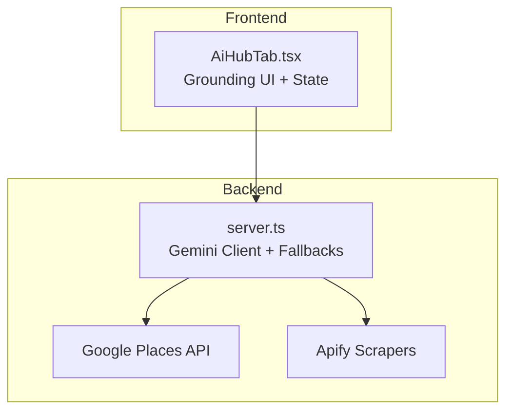
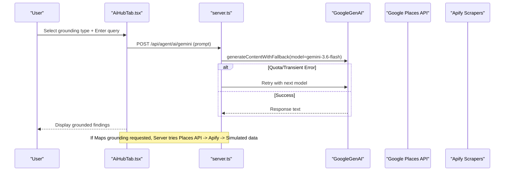
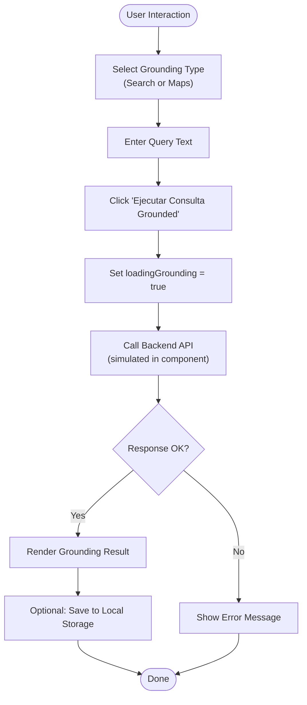
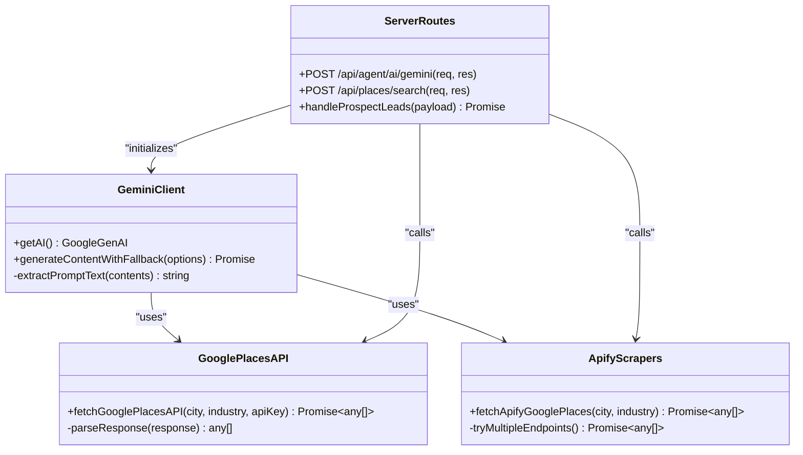
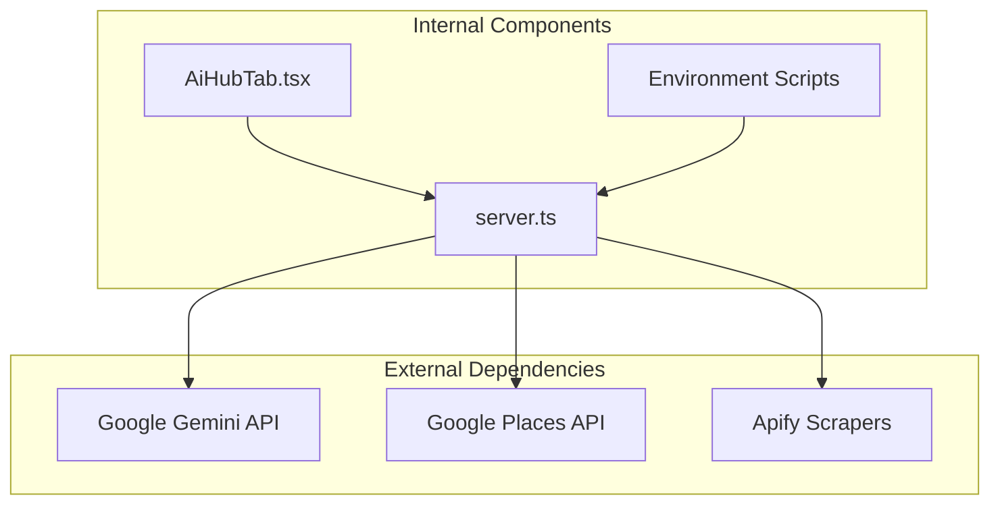

# Search & Maps Grounding

<cite>
**Referenced Files in This Document**
- [AiHubTab.tsx](file://src/components/AiHubTab.tsx)
- [server.ts](file://server.ts)
- [generate-env.mjs](file://scripts/generate-env.mjs)
- [setup-env.js](file://scripts/setup-env.js)
- [sync-secrets.mjs](file://scripts/sync-secrets.mjs)
- [README.md](file://README.md)
</cite>

## Table of Contents
1. [Introduction](#introduction)
2. [Project Structure](#project-structure)
3. [Core Components](#core-components)
4. [Architecture Overview](#architecture-overview)
5. [Detailed Component Analysis](#detailed-component-analysis)
6. [Dependency Analysis](#dependency-analysis)
7. [Performance Considerations](#performance-considerations)
8. [Troubleshooting Guide](#troubleshooting-guide)
9. [Conclusion](#conclusion)
10. [Appendices](#appendices)

## Introduction
This document explains the Search & Maps Grounding feature within the AI Hub. It enables users to perform real-time web and location-based queries using Google Gemini’s grounding capabilities with the gemini-3.6-flash model. The feature provides a dual-mode interface that switches between Google Search and Google Maps grounding, handles query input, visualizes results, and supports saving outputs for CRM lead generation workflows.

The implementation includes:
- A React component that manages state and UI for grounding queries and result display
- A server-side layer that integrates with Google Places API and Apify scrapers as fallbacks, and uses Gemini models via a robust retry/fallback mechanism
- Environment configuration for API keys and secrets
- Data presentation patterns suitable for market research and geographic targeting

## Project Structure
The Search & Maps Grounding feature spans the frontend component and backend services:
- Frontend: AiHubTab.tsx implements the dual-mode UI (Search vs Maps), query input, loading states, and result visualization
- Backend: server.ts orchestrates API calls to Google Places and Apify, and provides a resilient Gemini client wrapper with model fallbacks
- Configuration: scripts manage environment variables and secrets for Gemini and Google Maps APIs

**Diagram sources**
- [AiHubTab.tsx:254-349](file://src/components/AiHubTab.tsx#L254-L349)
- [server.ts:853-971](file://server.ts#L853-L971)
- [server.ts:1635-1659](file://server.ts#L1635-L1659)
- [server.ts:1803-1839](file://server.ts#L1803-L1839)

**Section sources**
- [AiHubTab.tsx:1-565](file://src/components/AiHubTab.tsx#L1-L565)
- [server.ts:853-971](file://server.ts#L853-L971)

## Core Components
- Dual-mode Grounding Interface: Users select “Google Search” or “Google Maps” grounding type and enter a query. The UI shows loading states and renders verified findings.
- Query Input Handling: Controlled input field captures user queries; default examples are provided for Latin American market research and Patagonia targeting.
- Result Visualization: Findings are displayed as structured items with source metadata and timestamp. Results can be saved to local storage for later use.
- Server Integration: The backend uses a lazy-initialized Gemini client with automatic retries and model fallbacks. For Maps grounding, it attempts Google Places API first, then Apify scrapers, and finally simulated data if needed.

Key responsibilities:
- AiHubTab.tsx: state management, UI rendering, and local persistence
- server.ts: Gemini client initialization, retry/fallback logic, Google Places API integration, Apify scraping, and error handling

**Section sources**
- [AiHubTab.tsx:38-89](file://src/components/AiHubTab.tsx#L38-L89)
- [AiHubTab.tsx:254-349](file://src/components/AiHubTab.tsx#L254-L349)
- [server.ts:853-971](file://server.ts#L853-L971)
- [server.ts:1635-1659](file://server.ts#L1635-L1659)
- [server.ts:1803-1839](file://server.ts#L1803-L1839)

## Architecture Overview
The architecture follows a clear separation of concerns:
- Frontend component manages user interactions and displays grounded results
- Backend service encapsulates external integrations and provides resilience through retries and fallbacks
- External APIs include Google Places API for real-time business data and Apify scrapers as alternative sources
- Gemini models are used for content generation and reasoning, with automatic model switching when quotas or transient errors occur

**Diagram sources**
- [AiHubTab.tsx:62-89](file://src/components/AiHubTab.tsx#L62-L89)
- [server.ts:4054-4099](file://server.ts#L4054-L4099)
- [server.ts:880-971](file://server.ts#L880-L971)
- [server.ts:1635-1659](file://server.ts#L1635-L1659)
- [server.ts:1803-1839](file://server.ts#L1803-L1839)

## Detailed Component Analysis

### Frontend: AiHubTab.tsx
- State Management:
  - activeSubTab controls which feature is visible (grounding, thinking, voice, flash_lite, cloud_sync)
  - groundingType toggles between search and maps modes
  - queryText holds the current query input
  - groundingResult stores the latest grounded findings
  - loadingGrounding indicates ongoing requests
- UI Flow:
  - Users select grounding type and enter a query
  - Clicking “Ejecutar Consulta Grounded” triggers handleRunGrounding
  - Results are rendered with source metadata, timestamp, and findings list
  - “Guardar en Base de Datos” persists results locally for later retrieval
- Error Handling:
  - try/catch around async operations ensures graceful degradation
  - Loading states prevent repeated submissions during processing

**Diagram sources**
- [AiHubTab.tsx:62-89](file://src/components/AiHubTab.tsx#L62-L89)
- [AiHubTab.tsx:254-349](file://src/components/AiHubTab.tsx#L254-L349)

**Section sources**
- [AiHubTab.tsx:38-89](file://src/components/AiHubTab.tsx#L38-L89)
- [AiHubTab.tsx:254-349](file://src/components/AiHubTab.tsx#L254-L349)

### Backend: server.ts
- Gemini Client Initialization:
  - Lazy initialization prevents unnecessary resource usage
  - Validates GEMINI_API_KEY and removes conflicting GOOGLE_API_KEY if present
  - Configures HTTP headers for proper identification
- Resilient Content Generation:
  - generateContentWithFallback tries multiple models with exponential backoff
  - Handles quota exhaustion (429) and transient errors (503)
  - Falls back to intelligent local responses when all models fail
- Google Places API Integration:
  - Attempts direct Places API call with validated key
  - Parses response into structured prospect objects
  - Logs detailed request/response information for debugging
- Apify Scraper Fallbacks:
  - Multiple scraper endpoints tried sequentially
  - Graceful degradation to simulated data when all external sources fail
- Error Handling:
  - Comprehensive logging at each failure point
  - Structured error responses for clients
  - Safe defaults ensure application stability

**Diagram sources**
- [server.ts:853-971](file://server.ts#L853-L971)
- [server.ts:1635-1659](file://server.ts#L1635-L1659)
- [server.ts:1803-1839](file://server.ts#L1803-L1839)
- [server.ts:4054-4099](file://server.ts#L4054-L4099)

**Section sources**
- [server.ts:853-971](file://server.ts#L853-L971)
- [server.ts:1635-1659](file://server.ts#L1635-L1659)
- [server.ts:1803-1839](file://server.ts#L1803-L1839)
- [server.ts:4054-4099](file://server.ts#L4054-L4099)

## Dependency Analysis
The Search & Maps Grounding feature depends on several external services and internal components:

**Diagram sources**
- [AiHubTab.tsx:1-565](file://src/components/AiHubTab.tsx#L1-L565)
- [server.ts:853-971](file://server.ts#L853-L971)
- [generate-env.mjs:10-25](file://scripts/generate-env.mjs#L10-L25)

**Section sources**
- [server.ts:853-971](file://server.ts#L853-L971)
- [generate-env.mjs:10-25](file://scripts/generate-env.mjs#L10-L25)

## Performance Considerations
- Model Fallback Strategy: Automatic switching between gemini-3.6-flash, gemini-3.1-flash-lite, and other models ensures availability under load
- Exponential Backoff: Retry logic with increasing delays prevents overwhelming external APIs during transient failures
- Lazy Initialization: Gemini client is initialized only when needed, reducing startup overhead
- Caching Strategy: Local storage persistence allows quick access to previously retrieved results without repeated API calls
- Response Optimization: Structured JSON responses minimize parsing overhead on the client side

## Troubleshooting Guide
Common issues and their resolutions:

### Missing API Keys
- Symptom: Gemini API calls fail with authentication errors
- Resolution: Ensure GEMINI_API_KEY is properly configured in environment variables
- Check: Verify key format and permissions in Google AI Studio

### Google Places API Failures
- Symptom: Maps grounding returns no results or errors
- Resolution: Validate GOOGLE_MAPS_PLATFORM_KEY and ensure Places API is enabled
- Debug: Check server logs for detailed request/response information

### Rate Limiting
- Symptom: 429 errors from Gemini API
- Resolution: Implement retry logic with exponential backoff (already implemented)
- Monitor: Track token usage and adjust quotas accordingly

### Network Connectivity
- Symptom: Timeout errors when calling external APIs
- Resolution: Verify network connectivity and firewall settings
- Fallback: Application gracefully falls back to simulated data when external services are unavailable

**Section sources**
- [server.ts:853-971](file://server.ts#L853-L971)
- [server.ts:1635-1659](file://server.ts#L1635-L1659)
- [server.ts:1803-1839](file://server.ts#L1803-L1839)

## Conclusion
The Search & Maps Grounding feature provides a robust, user-friendly interface for conducting real-time web and location-based research using Google Gemini’s capabilities. The dual-mode approach (Search vs Maps) caters to different research needs, while the resilient backend architecture ensures reliability even when external services experience issues. The implementation demonstrates best practices in error handling, performance optimization, and user experience design.

For Latin American market research and Patagonia-specific targeting, the system provides structured data presentation patterns that integrate seamlessly with CRM workflows. The modular design allows for easy extension to additional data sources and grounding capabilities.

## Appendices

### Effective Search Queries Examples

#### Latin American Market Research
- “Tendencias de marketing B2B en Patagonia Argentina 2026”
- “Empresas de software en Bariloche Neuquén”
- “Distribuidoras industriales en Río Negro y Chubut”
- “Startups tecnológicas en Mendoza y San Juan”

#### Geographic Targeting for Patagonia Region Businesses
- “Hoteles boutique en San Carlos de Bariloche”
- “Restaurantes gourmet en El Calafate”
- “Agencias de turismo en Ushuaia Tierra del Fuego”
- “Empresas petroleras en Vaca Muerta Neuquén”

#### CRM Lead Generation Workflows
- “Prospección de clientes potenciales para CRM en empresas manufactureras”
- “Generación de leads B2B para servicios de automatización”
- “Identificación de oportunidades comerciales en el sector agropecuario”
- “Enriquecimiento de datos de contactos empresariales con información geolocalizada”

### Technical Implementation Details

#### State Management Patterns
- Controlled components for form inputs
- Local storage for persistent data
- Event-driven updates for real-time feedback

#### API Call Patterns
- Sequential retry with exponential backoff
- Graceful degradation to fallback services
- Comprehensive error logging and monitoring

#### Response Formatting
- Structured JSON for consistent data presentation
- Metadata inclusion for audit trails
- Localization support for Spanish-language markets

**Section sources**
- [AiHubTab.tsx:38-89](file://src/components/AiHubTab.tsx#L38-L89)
- [server.ts:853-971](file://server.ts#L853-L971)
- [README.md:1-21](file://README.md#L1-L21)