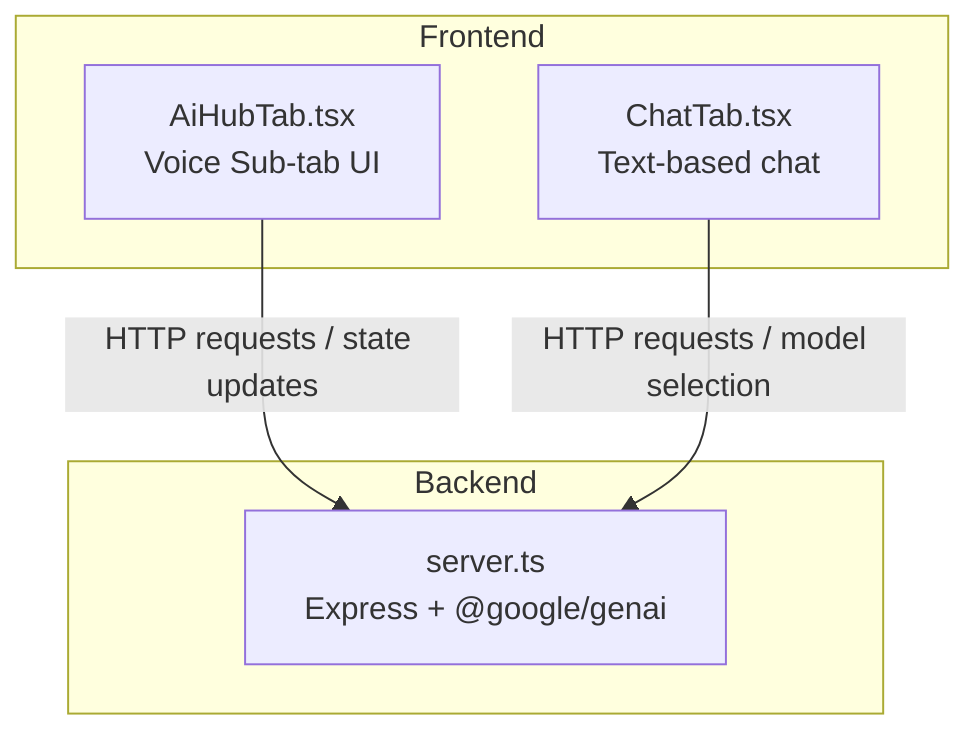
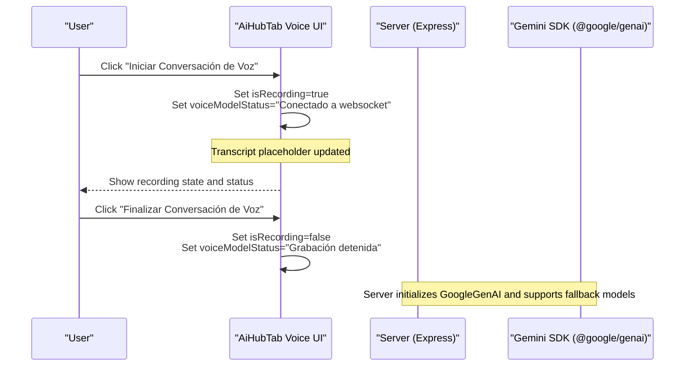
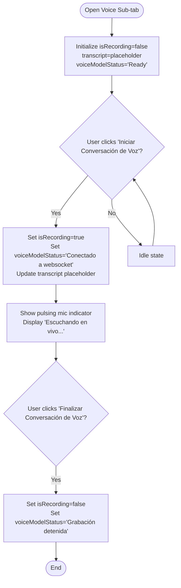
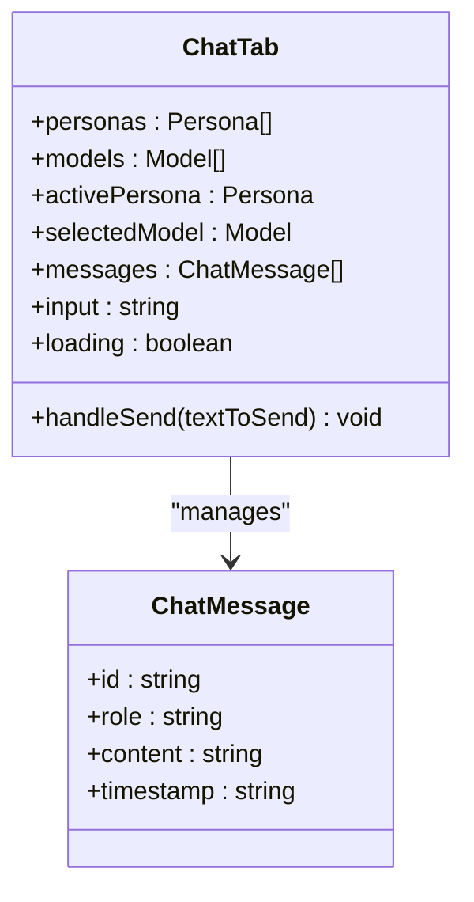
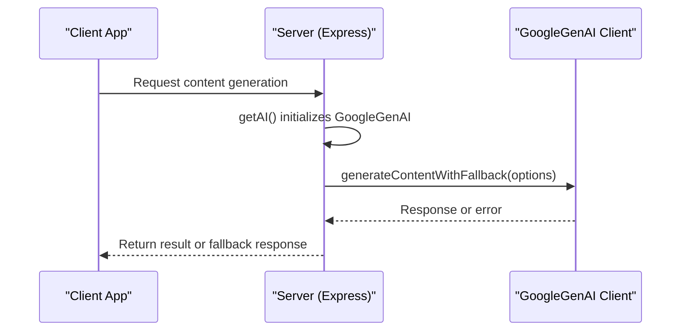
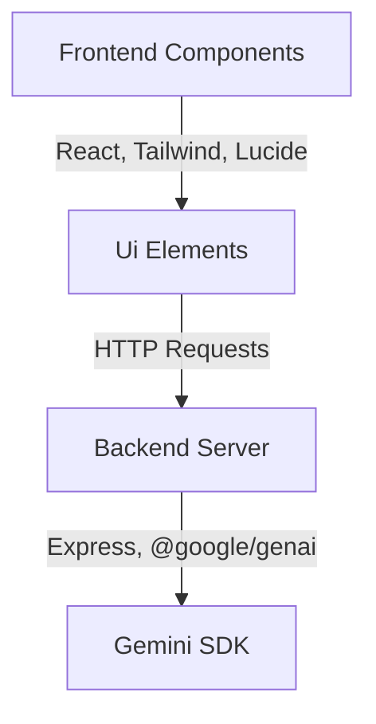

# Voice & Live Conversations

<cite>
**Referenced Files in This Document**
- [AiHubTab.tsx](file://src/components/AiHubTab.tsx)
- [ChatTab.tsx](file://src/components/ChatTab.tsx)
- [server.ts](file://server.ts)
- [package.json](file://package.json)
- [types.ts](file://src/types.ts)
</cite>

## Table of Contents
1. [Introduction](#introduction)
2. [Project Structure](#project-structure)
3. [Core Components](#core-components)
4. [Architecture Overview](#architecture-overview)
5. [Detailed Component Analysis](#detailed-component-analysis)
6. [Dependency Analysis](#dependency-analysis)
7. [Performance Considerations](#performance-considerations)
8. [Troubleshooting Guide](#troubleshooting-guide)
9. [Conclusion](#conclusion)
10. [Appendices](#appendices)

## Introduction
This document explains the Voice & Live Conversations feature that targets real-time voice interaction using the gemini-3.1-flash-live-preview model. It covers:
- Real-time audio streaming capabilities and WebSocket connection management
- Voice recording functionality and live transcription display
- User interface for voice interaction (microphone controls, states, conversation flow, transcript)
- Technical implementation details for audio capture, streaming to Gemini Live API, real-time response processing, and error handling for network issues
- Example prompts tailored for Sales Development Representatives (SDR) like “Santi”, customer service scenarios, and multilingual support for Spanish-speaking markets in Patagonia

The current codebase provides a fully designed UI for the Voice & Live Conversations sub-tab with state variables for recording, status, and transcript. The backend integrates with Google’s Gemini SDK and includes fallback logic for model selection and transient errors.

**Section sources**
- [AiHubTab.tsx:413-458](file://src/components/AiHubTab.tsx#L413-L458)
- [server.ts:853-898](file://server.ts#L853-L898)

## Project Structure
The Voice & Live Conversations feature is primarily implemented within the AI Hub tab component. The UI exposes a dedicated sub-tab for voice interactions, while the server handles Gemini API calls and fallback strategies.

**Diagram sources**
- [AiHubTab.tsx:413-458](file://src/components/AiHubTab.tsx#L413-L458)
- [ChatTab.tsx:70-77](file://src/components/ChatTab.tsx#L70-L77)
- [server.ts:853-898](file://server.ts#L853-L898)

**Section sources**
- [AiHubTab.tsx:1-565](file://src/components/AiHubTab.tsx#L1-L565)
- [server.ts:1-800](file://server.ts#L1-L800)

## Core Components
- AiHubTab Voice Sub-tab: Provides microphone control, recording state, status messages, and a transcript display area. It references the gemini-3.1-flash-live-preview model and indicates WebSocket connectivity status.
- ChatTab: Demonstrates model selection patterns and message handling, which can be extended to integrate voice transcripts into the chat flow.
- Server: Initializes the GoogleGenAI client, manages environment keys, and implements a fallback strategy across multiple models for resilience.

Key responsibilities:
- UI state management for recording and transcript
- Status messaging for WebSocket connection and model readiness
- Backend integration with Gemini SDK and robust fallback behavior

**Section sources**
- [AiHubTab.tsx:48-52](file://src/components/AiHubTab.tsx#L48-L52)
- [AiHubTab.tsx:413-458](file://src/components/AiHubTab.tsx#L413-L458)
- [ChatTab.tsx:70-77](file://src/components/ChatTab.tsx#L70-L77)
- [server.ts:853-898](file://server.ts#L853-L898)

## Architecture Overview
The Voice & Live Conversations architecture combines frontend UI state with backend Gemini SDK integration. While the UI is ready for real-time voice streaming, the actual WebSocket stream and MediaRecorder usage are not present in the current code. The server demonstrates how to configure the Gemini client and handle model fallbacks.

**Diagram sources**
- [AiHubTab.tsx:438-455](file://src/components/AiHubTab.tsx#L438-L455)
- [server.ts:853-898](file://server.ts#L853-L898)

**Section sources**
- [AiHubTab.tsx:413-458](file://src/components/AiHubTab.tsx#L413-L458)
- [server.ts:853-898](file://server.ts#L853-L898)

## Detailed Component Analysis

### AiHubTab Voice Sub-tab
- State variables:
  - isRecording: toggles recording state
  - transcript: displays simulated or streamed transcription text
  - voiceModelStatus: shows connection and model status
- UI elements:
  - Microphone icon button with dynamic styling based on recording state
  - Status text indicating “Escuchando en vivo...” or “Micrófono en espera”
  - Transcript box showing user input or simulated transcription
- Interaction flow:
  - Start recording sets WebSocket connection status and updates transcript placeholder
  - Stop recording resets status and stops simulation

**Diagram sources**
- [AiHubTab.tsx:413-458](file://src/components/AiHubTab.tsx#L413-L458)

**Section sources**
- [AiHubTab.tsx:48-52](file://src/components/AiHubTab.tsx#L48-L52)
- [AiHubTab.tsx:413-458](file://src/components/AiHubTab.tsx#L413-L458)

### ChatTab Model Selection and Message Handling
- Models list includes gemini-3.1-pro-preview, gemini-3.5-flash, and gemini-3.1-flash-lite
- Default selected model is gemini-3.5-flash
- Messages are sent via POST to /api/ai/chat with model and system instruction
- Error handling adds an error message to the chat history when connection fails

**Diagram sources**
- [ChatTab.tsx:70-77](file://src/components/ChatTab.tsx#L70-L77)
- [types.ts:92-97](file://src/types.ts#L92-L97)

**Section sources**
- [ChatTab.tsx:70-77](file://src/components/ChatTab.tsx#L70-L77)
- [types.ts:92-97](file://src/types.ts#L92-L97)

### Server Gemini Integration and Fallback Strategy
- Lazy initialization of GoogleGenAI client with explicit API key configuration
- Environment variable precedence ensures correct key usage
- Fallback function tries multiple models in sequence to handle transient errors and rate limits

**Diagram sources**
- [server.ts:853-898](file://server.ts#L853-L898)

**Section sources**
- [server.ts:853-898](file://server.ts#L853-L898)

## Dependency Analysis
- Frontend dependencies:
  - React components manage UI state and user interactions
  - Lucide icons provide visual indicators for microphone and status
- Backend dependencies:
  - Express server handles HTTP requests
  - @google/genai SDK enables Gemini API integration
  - Session management and database connections are configured but not directly related to voice features

**Diagram sources**
- [package.json:15-45](file://package.json#L15-L45)
- [server.ts:1-15](file://server.ts#L1-L15)

**Section sources**
- [package.json:15-45](file://package.json#L15-L45)
- [server.ts:1-15](file://server.ts#L1-L15)

## Performance Considerations
- Real-time voice streaming requires low-latency WebSocket connections
- Audio capture should use efficient codecs and minimal buffering
- Network error handling must include retry logic and graceful degradation
- Model fallback strategies help maintain responsiveness during high demand

[No sources needed since this section provides general guidance]

## Troubleshooting Guide
Common issues and resolutions:
- WebSocket connection failures: Verify network connectivity and firewall settings
- Audio permission denied: Ensure browser permissions allow microphone access
- Model unavailability: Rely on server-side fallback mechanisms
- Transcription delays: Optimize audio chunk size and network latency

**Section sources**
- [server.ts:853-898](file://server.ts#L853-L898)

## Conclusion
The Voice & Live Conversations feature provides a solid foundation for real-time voice interaction with Gemini models. The UI is well-designed with clear state management and user feedback. While the actual WebSocket streaming and audio capture implementations are not present, the architecture supports easy integration. The server-side Gemini SDK integration with fallback strategies ensures reliability and performance.

[No sources needed since this section summarizes without analyzing specific files]

## Appendices

### Voice Prompt Examples for SDR "Santi"
- "Hola Santi, ¿cómo están los leads en Bariloche hoy?"
- "¿Qué oportunidades nuevas tenemos esta semana en Neuquén?"
- "Genera un guión de ventas para una pyme industrial en la Patagonia"

### Customer Service Scenarios
- "Resuelve la objeción del cliente sobre el precio del CRM"
- "Crea una respuesta automatizada para consultas frecuentes"
- "Optimiza el flujo de onboarding para nuevos clientes"

### Multilingual Support for Spanish-speaking Markets
- All UI text is in Spanish, targeting Argentine and Patagonian markets
- Prompts and responses support regional dialects and business terminology
- Localized examples reference cities like Bariloche and Neuquén

**Section sources**
- [AiHubTab.tsx:444](file://src/components/AiHubTab.tsx#L444)
- [ChatTab.tsx:31-68](file://src/components/ChatTab.tsx#L31-L68)