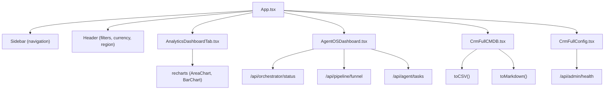
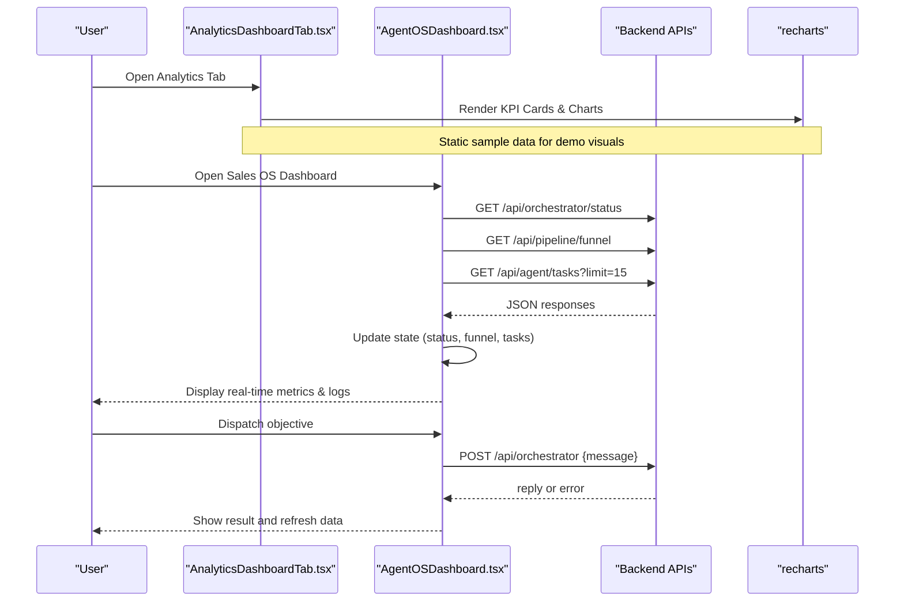
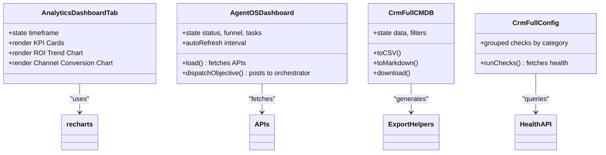

# Analytics Dashboard

<cite>
**Referenced Files in This Document**
- [AnalyticsDashboardTab.tsx](file://src/components/AnalyticsDashboardTab.tsx)
- [AgentOSDashboard.tsx](file://src/components/crm-full/AgentOSDashboard.tsx)
- [CrmFullCMDB.tsx](file://src/components/crm-full/CrmFullCMDB.tsx)
- [CrmFullConfig.tsx](file://src/components/crm-full/CrmFullConfig.tsx)
- [App.tsx](file://src/App.tsx)
- [package.json](file://package.json)
- [README.md](file://README.md)
</cite>

## Table of Contents
1. [Introduction](#introduction)
2. [Project Structure](#project-structure)
3. [Core Components](#core-components)
4. [Architecture Overview](#architecture-overview)
5. [Detailed Component Analysis](#detailed-component-analysis)
6. [Dependency Analysis](#dependency-analysis)
7. [Performance Considerations](#performance-considerations)
8. [Troubleshooting Guide](#troubleshooting-guide)
9. [Conclusion](#conclusion)
10. [Appendices](#appendices)

## Introduction
This document provides comprehensive documentation for the analytics dashboard that delivers real-time metrics, performance reporting, and business intelligence across marketing channels. It covers key performance indicators (KPIs), campaign ROI tracking, lead conversion metrics, revenue attribution, data visualization components, custom report generation, export capabilities, account analytics for user engagement and system performance monitoring, examples of custom dashboards, metric calculations, and integration points with external analytics platforms.

The analytics experience is composed of:
- A multi-channel analytics dashboard with KPI cards and charts for ROI trends and channel conversion.
- An AgentOS control center providing real-time system status, pipeline funnel, task queue, costs, and logs.
- Export utilities for reports and infrastructure inventories to CSV and Markdown.
- Health checks and configuration views to monitor integrations and environment variables.

**Section sources**
- [AnalyticsDashboardTab.tsx:1-148](file://src/components/AnalyticsDashboardTab.tsx#L1-L148)
- [AgentOSDashboard.tsx:1-493](file://src/components/crm-full/AgentOSDashboard.tsx#L1-L493)
- [CrmFullCMDB.tsx:223-249](file://src/components/crm-full/CrmFullCMDB.tsx#L223-L249)
- [CrmFullConfig.tsx:37-234](file://src/components/crm-full/CrmFullConfig.tsx#L37-L234)

## Project Structure
The analytics features are implemented as React components within the application shell. The main app routes to the analytics tab, which renders the analytics dashboard component. Additional CRM-related dashboards provide operational insights and export capabilities.

**Diagram sources**
- [App.tsx:109-164](file://src/App.tsx#L109-L164)
- [AnalyticsDashboardTab.tsx:1-148](file://src/components/AnalyticsDashboardTab.tsx#L1-L148)
- [AgentOSDashboard.tsx:155-174](file://src/components/crm-full/AgentOSDashboard.tsx#L155-L174)
- [CrmFullCMDB.tsx:223-249](file://src/components/crm-full/CrmFullCMDB.tsx#L223-L249)
- [CrmFullConfig.tsx:45-62](file://src/components/crm-full/CrmFullConfig.tsx#L45-L62)

**Section sources**
- [App.tsx:109-164](file://src/App.tsx#L109-L164)
- [package.json:15-45](file://package.json#L15-L45)
- [README.md:1-21](file://README.md#L1-L21)

## Core Components
- AnalyticsDashboardTab: Displays KPI cards (ROI, attributable revenue, leads captured, cost per lead) and visualizations (ROI trend area chart, channel conversion bar chart). Includes timeframe selection for 1M, 3M, 6M, 1Y.
- AgentOSDashboard: Real-time system status, pipeline funnel, task queue, AI costs, recent logs, and orchestration dispatching.
- CrmFullCMDB: Infrastructure inventory with search, filters, and export to CSV and Markdown.
- CrmFullConfig: Health checks for services and environment variables visibility.

Key capabilities:
- Real-time metrics aggregation across Email, Social Ads, SEO, and Google Maps prospecting.
- ROI trend analysis over time and channel-wise conversion rates.
- Pipeline funnel visualization from companies to replies.
- Task queue monitoring with status labels and timestamps.
- Cost tracking by API usage and tokens consumed.
- Exportable reports and infrastructure inventories.

**Section sources**
- [AnalyticsDashboardTab.tsx:21-148](file://src/components/AnalyticsDashboardTab.tsx#L21-L148)
- [AgentOSDashboard.tsx:143-493](file://src/components/crm-full/AgentOSDashboard.tsx#L143-L493)
- [CrmFullCMDB.tsx:260-502](file://src/components/crm-full/CrmFullCMDB.tsx#L260-L502)
- [CrmFullConfig.tsx:37-234](file://src/components/crm-full/CrmFullConfig.tsx#L37-L234)

## Architecture Overview
The analytics dashboard integrates with backend APIs to fetch live data and renders visualizations using recharts. Operational dashboards expose system health, pipeline metrics, and agent tasks. Export utilities generate downloadable files directly in the browser.

**Diagram sources**
- [AgentOSDashboard.tsx:155-205](file://src/components/crm-full/AgentOSDashboard.tsx#L155-L205)
- [AnalyticsDashboardTab.tsx:104-144](file://src/components/AnalyticsDashboardTab.tsx#L104-L144)

## Detailed Component Analysis

### AnalyticsDashboardTab
- KPI Cards: Global average ROI, attributable revenue, total leads captured, average cost per lead. Each card shows trend indicators and contextual descriptions.
- Timeframe Selector: Buttons for 1M, 3M, 6M, 1Y update the selected timeframe state.
- ROI Trend Area Chart: Shows monthly ROI percentages for SEO and Email channels with gradient fills.
- Channel Conversion Bar Chart: Compares conversion rates across Email Marketing, Social Ads/LinkedIn, SEO & Organic, and Google Maps Prospecting.

Data model:
- roiTrendData: Array of objects with month, emailRoi, socialRoi, seoRoi, totalRevenue.
- channelComparison: Array of objects with channel, conversion, roi, costPerLead.

Visualization libraries:
- recharts ResponsiveContainer, AreaChart, BarChart, XAxis, YAxis, Tooltip, CartesianGrid.

Customization:
- Gradient fills for area charts.
- Responsive grid layout for cards and charts.

Export capabilities:
- Not implemented in this component; exports are available in other modules.

Metric calculation examples:
- ROI % per channel derived from channel-specific ROI fields.
- Conversion rate per channel represented as percentage values.
- Average cost per lead aggregated across channels.

Integration points:
- Currently uses static sample data; can be extended to fetch live metrics via API endpoints.

**Section sources**
- [AnalyticsDashboardTab.tsx:5-19](file://src/components/AnalyticsDashboardTab.tsx#L5-L19)
- [AnalyticsDashboardTab.tsx:21-148](file://src/components/AnalyticsDashboardTab.tsx#L21-L148)

### AgentOSDashboard
- System Status: Active tasks, pending tasks, completed tasks (24h), failed tasks (24h), agents running list.
- Pipeline Funnel: Companies → Leads enriched → Proposals sent → Campaigns active → Emails sent → Replies.
- Task Queue: Last 15 tasks with status badges, timestamps, and error messages.
- AI Costs: Total USD cost and token usage over last 24h, breakdown by API calls.
- Recent Logs: Decision history with agent names, actions, and details.
- Orchestration: Input field to send objectives to orchestrator; displays results and refreshes data.

Data fetching:
- Fetches three endpoints concurrently: /api/orchestrator/status, /api/pipeline/funnel, /api/agent/tasks?limit=15.
- Auto-refresh interval when enabled.

Error handling:
- Displays error banners with retry option on failures.

Formatting helpers:
- timeAgo for relative timestamps.
- fmtCost for cost formatting.
- fmtTokens for token count formatting.

State types:
- SystemStatus, Funnel, AgentTask interfaces define expected shapes.

**Section sources**
- [AgentOSDashboard.tsx:16-50](file://src/components/crm-full/AgentOSDashboard.tsx#L16-L50)
- [AgentOSDashboard.tsx:155-174](file://src/components/crm-full/AgentOSDashboard.tsx#L155-L174)
- [AgentOSDashboard.tsx:186-205](file://src/components/crm-full/AgentOSDashboard.tsx#L186-L205)
- [AgentOSDashboard.tsx:78-97](file://src/components/crm-full/AgentOSDashboard.tsx#L78-L97)

### CrmFullCMDB
- Infrastructure Inventory: Lists services across Production, Development, and External environments with URLs, technologies, functions, statuses, owners, dependencies, and observations.
- Search and Filters: Full-text search across service name, URL, technology, function, owner; dropdown filters for environment and status.
- Edit Mode: Inline editing for each row with save and cancel actions.
- Export Utilities:
  - toCSV: Generates CSV content with headers and escaped values.
  - toMarkdown: Generates Markdown table with headers and rows.
  - download: Creates Blob and triggers file download.

Export formats:
- CSV dump for infrastructure data.
- Markdown export for documentation.

**Section sources**
- [CrmFullCMDB.tsx:25-200](file://src/components/crm-full/CrmFullCMDB.tsx#L25-L200)
- [CrmFullCMDB.tsx:223-249](file://src/components/crm-full/CrmFullCMDB.tsx#L223-L249)
- [CrmFullCMDB.tsx:260-502](file://src/components/crm-full/CrmFullCMDB.tsx#L260-L502)

### CrmFullConfig
- Health Checks: Calls /api/admin/health to retrieve check results grouped by categories (Core, Database, IA/LLMs, Prospecting, Email, Infrastructure).
- Summary Counts: OK, warnings, and errors counts displayed as cards.
- Environment Variables: Lists detected environment variables with required/optional indicators.
- CLI Doctor: Instructions to run health checks from terminal using scripts/doctor.mjs.

Error handling:
- Displays error banners with guidance (e.g., admin role requirement).

**Section sources**
- [CrmFullConfig.tsx:45-62](file://src/components/crm-full/CrmFullConfig.tsx#L45-L62)
- [CrmFullConfig.tsx:64-74](file://src/components/crm-full/CrmFullConfig.tsx#L64-L74)
- [CrmFullConfig.tsx:186-218](file://src/components/crm-full/CrmFullConfig.tsx#L186-L218)

## Dependency Analysis
The analytics dashboard relies on:
- React for component structure and state management.
- recharts for data visualization (AreaChart, BarChart, axes, tooltips).
- lucide-react for icons used throughout the UI.
- Express server entry point for API routing.
- External APIs for orchestrator status, pipeline funnel, agent tasks, and health checks.

**Diagram sources**
- [AnalyticsDashboardTab.tsx:1-148](file://src/components/AnalyticsDashboardTab.tsx#L1-L148)
- [AgentOSDashboard.tsx:155-205](file://src/components/crm-full/AgentOSDashboard.tsx#L155-L205)
- [CrmFullCMDB.tsx:223-249](file://src/components/crm-full/CrmFullCMDB.tsx#L223-L249)
- [CrmFullConfig.tsx:45-62](file://src/components/crm-full/CrmFullConfig.tsx#L45-L62)

**Section sources**
- [package.json:15-45](file://package.json#L15-L45)
- [api/index.ts:1-5](file://api/index.ts#L1-L5)

## Performance Considerations
- Data fetching concurrency: AgentOSDashboard uses Promise.all to fetch multiple endpoints simultaneously, reducing load time.
- Auto-refresh interval: Configurable polling at 15-second intervals; disable when not needed to reduce network overhead.
- Visualization rendering: recharts ResponsiveContainer ensures efficient rendering across screen sizes.
- Export operations: Client-side CSV and Markdown generation avoids server load and enables instant downloads.
- Error handling: Graceful error banners and retry mechanisms improve resilience.

[No sources needed since this section provides general guidance]

## Troubleshooting Guide
- API connectivity issues: Ensure backend endpoints (/api/orchestrator/status, /api/pipeline/funnel, /api/agent/tasks, /api/admin/health) are reachable and return valid JSON.
- Authentication and roles: Some health checks may require admin roles; verify permissions.
- Environment variables: Confirm required variables (e.g., GEMINI_API_KEY, NEON_DATABASE_URL, SESSION_SECRET) are set correctly.
- Refresh behavior: Disable auto-refresh if experiencing excessive requests; manually trigger updates.
- Export functionality: Verify browser allows file downloads and Blob creation.

**Section sources**
- [AgentOSDashboard.tsx:169-174](file://src/components/crm-full/AgentOSDashboard.tsx#L169-L174)
- [CrmFullConfig.tsx:104-110](file://src/components/crm-full/CrmFullConfig.tsx#L104-L110)
- [CrmFullConfig.tsx:186-218](file://src/components/crm-full/CrmFullConfig.tsx#L186-L218)

## Conclusion
The analytics dashboard provides a robust foundation for real-time metrics, performance reporting, and business intelligence across marketing channels. With KPI tracking, ROI visualization, pipeline monitoring, task queue insights, and export capabilities, it supports data-driven decision-making. Extending the dashboard with live data sources and additional export formats will further enhance its utility for campaign optimization and revenue attribution.

[No sources needed since this section summarizes without analyzing specific files]

## Appendices

### Custom Dashboards Examples
- Multi-channel ROI trend analysis with timeframe selectors.
- Channel conversion comparison with bar charts.
- Pipeline funnel visualization with conversion percentages.
- Task queue monitoring with status badges and timestamps.
- Infrastructure inventory with search, filters, and export options.

### Metric Calculations
- ROI % per channel: Derived from channel-specific ROI fields in sample data.
- Conversion rate per channel: Represented as percentage values in channel comparison data.
- Average cost per lead: Aggregated across channels and displayed in KPI cards.
- Attributable revenue: Summed from CRM closures and direct sales.

### Integration Points
- Backend APIs for orchestrator status, pipeline funnel, agent tasks, and health checks.
- recharts library for interactive visualizations.
- Client-side export utilities for CSV and Markdown generation.

**Section sources**
- [AnalyticsDashboardTab.tsx:5-19](file://src/components/AnalyticsDashboardTab.tsx#L5-L19)
- [AgentOSDashboard.tsx:155-174](file://src/components/crm-full/AgentOSDashboard.tsx#L155-L174)
- [CrmFullCMDB.tsx:223-249](file://src/components/crm-full/CrmFullCMDB.tsx#L223-L249)
- [CrmFullConfig.tsx:45-62](file://src/components/crm-full/CrmFullConfig.tsx#L45-L62)