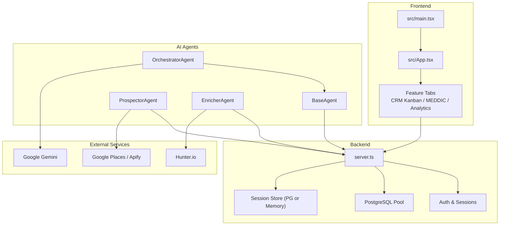
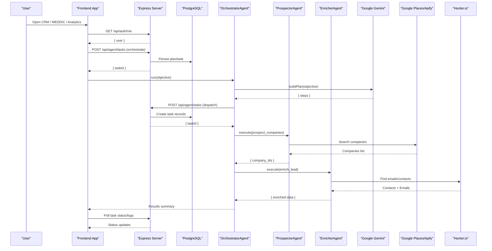
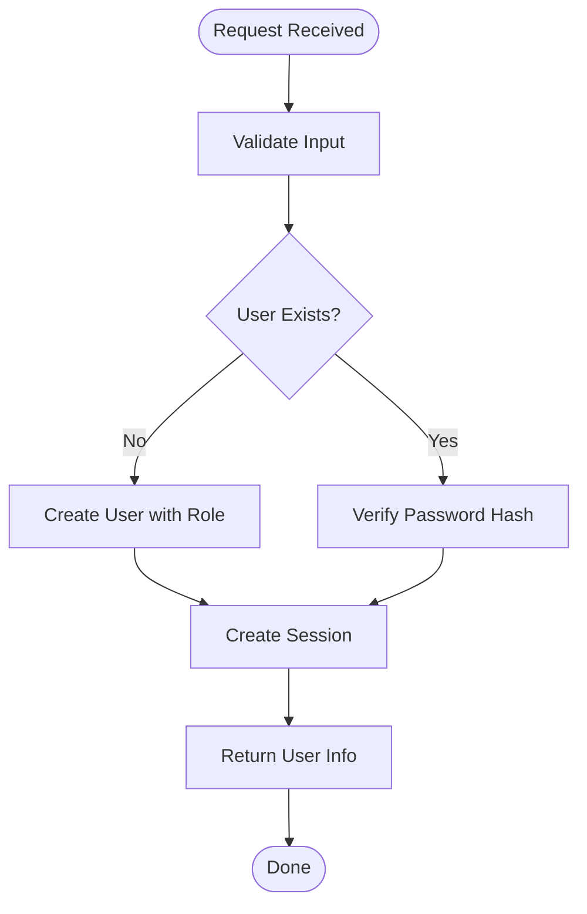
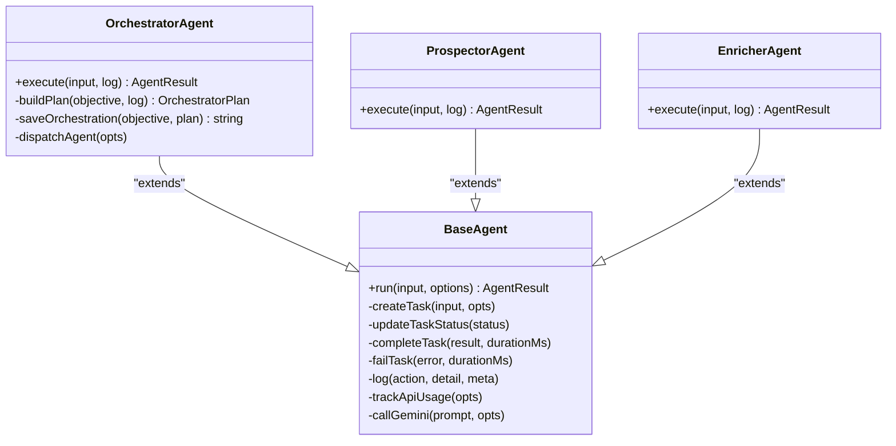
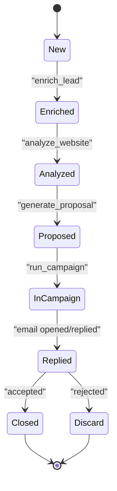
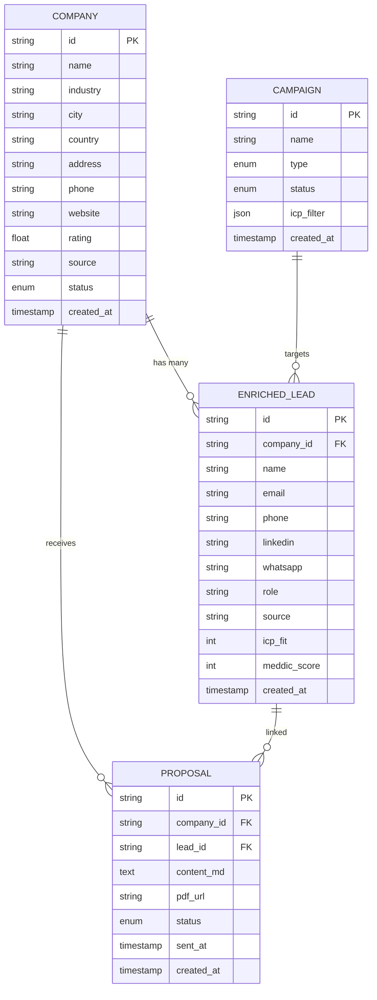
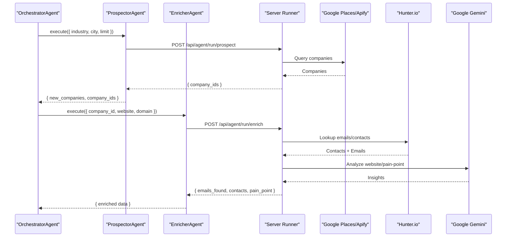
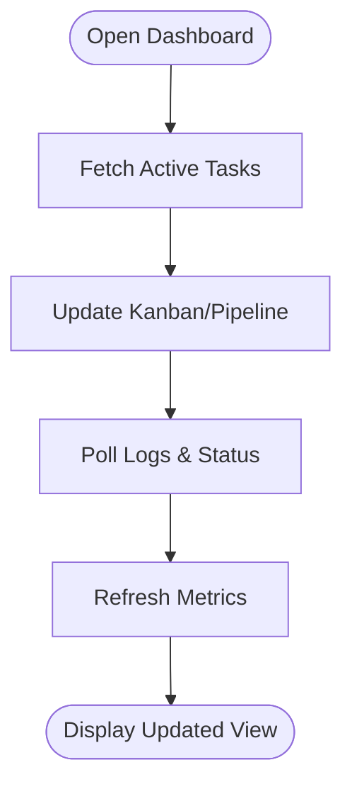
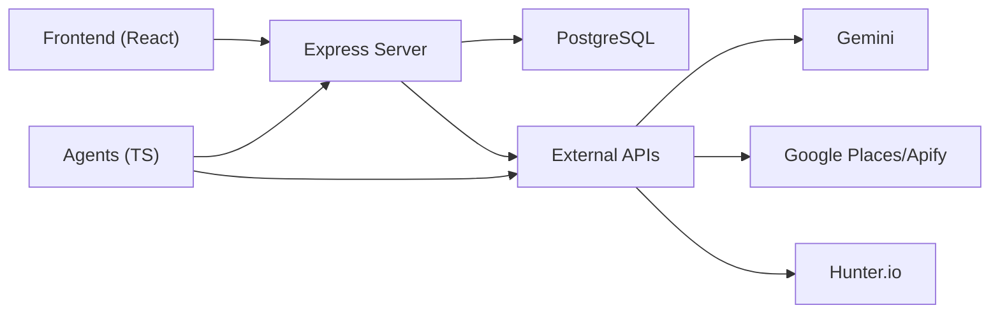

# CRM System

<cite>
**Referenced Files in This Document**
- [README.md](file://README.md)
- [package.json](file://package.json)
- [server.ts](file://server.ts)
- [src/App.tsx](file://src/App.tsx)
- [src/main.tsx](file://src/main.tsx)
- [src/agents/base.ts](file://src/agents/base.ts)
- [src/agents/types.ts](file://src/agents/types.ts)
- [src/agents/orchestrator.ts](file://src/agents/orchestrator.ts)
- [src/agents/prospector.ts](file://src/agents/prospector.ts)
- [src/agents/enricher.ts](file://src/agents/enricher.ts)
</cite>

## Table of Contents
1. [Introduction](#introduction)
2. [Project Structure](#project-structure)
3. [Core Components](#core-components)
4. [Architecture Overview](#architecture-overview)
5. [Detailed Component Analysis](#detailed-component-analysis)
6. [Dependency Analysis](#dependency-analysis)
7. [Performance Considerations](#performance-considerations)
8. [Troubleshooting Guide](#troubleshooting-guide)
9. [Conclusion](#conclusion)
10. [Appendices](#appendices)

## Introduction
This document explains the CRM system that integrates AI agents for lead enrichment, MEDDIC-based lead scoring, pipeline visualization, and contact management. It covers the end-to-end lead lifecycle from prospecting to conversion, automated scoring algorithms, deal tracking, sales forecasting, and real-time dashboards for collaboration. It also details the customer relationship database structure, contact organization, company hierarchy, and integrations with external services (Gemini, Google Maps/Apify, Hunter.io). Examples are provided for custom scoring criteria, pipeline stages, and reporting configurations.

## Project Structure
The application is a React + Vite frontend with an Express server. The frontend renders multiple feature tabs including CRM Kanban, MEDDIC, and analytics dashboards. The backend provides authentication, session management, and agent orchestration endpoints.

**Diagram sources**
- [src/main.tsx:1-11](file://src/main.tsx#L1-L11)
- [src/App.tsx:1-177](file://src/App.tsx#L1-L177)
- [server.ts:1-126](file://server.ts#L1-L126)
- [src/agents/base.ts:1-199](file://src/agents/base.ts#L1-L199)
- [src/agents/orchestrator.ts:1-181](file://src/agents/orchestrator.ts#L1-L181)
- [src/agents/prospector.ts:1-71](file://src/agents/prospector.ts#L1-L71)
- [src/agents/enricher.ts:1-75](file://src/agents/enricher.ts#L1-L75)

**Section sources**
- [README.md:1-21](file://README.md#L1-L21)
- [package.json:1-64](file://package.json#L1-L64)
- [src/main.tsx:1-11](file://src/main.tsx#L1-L11)
- [src/App.tsx:1-177](file://src/App.tsx#L1-L177)

## Core Components
- Authentication and Session Management: Secure login/register, role checks, password reset flows, and session persistence via PostgreSQL or memory store.
- Agent Orchestration: Orchestrator parses objectives into plans and dispatches tasks to specialized agents.
- Prospecting: Finds companies using Google Places or Apify and persists them.
- Enrichment: Retrieves contacts and emails via Hunter.io, extracts website content, and generates pain-point insights.
- Scoring and Pipeline: MEDDIC scoring fields and pipeline stages are modeled in types; UI tabs visualize progress and metrics.
- Real-time Dashboards: Analytics and CRM Kanban components display live status and KPIs.

**Section sources**
- [server.ts:209-235](file://server.ts#L209-L235)
- [server.ts:266-338](file://server.ts#L266-L338)
- [server.ts:340-381](file://server.ts#L340-L381)
- [server.ts:594-680](file://server.ts#L594-L680)
- [server.ts:683-748](file://server.ts#L683-L748)
- [server.ts:750-791](file://server.ts#L750-L791)
- [src/agents/orchestrator.ts:10-76](file://src/agents/orchestrator.ts#L10-L76)
- [src/agents/prospector.ts:26-67](file://src/agents/prospector.ts#L26-L67)
- [src/agents/enricher.ts:32-71](file://src/agents/enricher.ts#L32-L71)
- [src/agents/types.ts:108-136](file://src/agents/types.ts#L108-L136)

## Architecture Overview
The CRM uses a layered architecture:
- Frontend: React app with tabbed features (CRM Kanban, MEDDIC, Analytics).
- Backend: Express server handling auth, sessions, and agent task APIs.
- Agents: TypeScript classes implementing BaseAgent with retry, logging, and cost tracking.
- Data: PostgreSQL for users, sessions, tasks, logs, and CRM entities.
- External Integrations: Gemini for planning and analysis; Google Places/Apify for prospecting; Hunter.io for enrichment.

**Diagram sources**
- [src/App.tsx:131-138](file://src/App.tsx#L131-L138)
- [server.ts:266-338](file://server.ts#L266-L338)
- [src/agents/orchestrator.ts:78-144](file://src/agents/orchestrator.ts#L78-L144)
- [src/agents/prospector.ts:30-67](file://src/agents/prospector.ts#L30-L67)
- [src/agents/enricher.ts:36-71](file://src/agents/enricher.ts#L36-L71)

## Detailed Component Analysis

### Authentication and Session Management
- Registration/Login: Supports username/email, bcrypt hashing, role assignment, and Neon Auth fallback.
- Password Reset: Generates secure tokens, stores hashed tokens, and sends email via SMTP.
- Session Store: Uses PostgreSQL-backed sessions or memory store when DB URL is missing.

**Diagram sources**
- [server.ts:266-338](file://server.ts#L266-L338)
- [server.ts:340-381](file://server.ts#L340-L381)
- [server.ts:594-680](file://server.ts#L594-L680)
- [server.ts:683-748](file://server.ts#L683-L748)
- [server.ts:750-791](file://server.ts#L750-L791)

**Section sources**
- [server.ts:209-235](file://server.ts#L209-L235)
- [server.ts:266-338](file://server.ts#L266-L338)
- [server.ts:340-381](file://server.ts#L340-L381)
- [server.ts:594-680](file://server.ts#L594-L680)
- [server.ts:683-748](file://server.ts#L683-L748)
- [server.ts:750-791](file://server.ts#L750-L791)

### Agent Orchestration
- OrchestratorAgent builds execution plans using Gemini, persists plans, and dispatches tasks respecting dependencies.
- BaseAgent manages task lifecycle, retries, logging, and API usage tracking.

**Diagram sources**
- [src/agents/base.ts:18-193](file://src/agents/base.ts#L18-L193)
- [src/agents/orchestrator.ts:10-177](file://src/agents/orchestrator.ts#L10-L177)
- [src/agents/prospector.ts:26-67](file://src/agents/prospector.ts#L26-L67)
- [src/agents/enricher.ts:32-71](file://src/agents/enricher.ts#L32-L71)

**Section sources**
- [src/agents/base.ts:18-193](file://src/agents/base.ts#L18-L193)
- [src/agents/orchestrator.ts:10-177](file://src/agents/orchestrator.ts#L10-L177)
- [src/agents/prospector.ts:26-67](file://src/agents/prospector.ts#L26-L67)
- [src/agents/enricher.ts:32-71](file://src/agents/enricher.ts#L32-L71)

### Lead Lifecycle and MEDDIC Scoring
- Lifecycle: New → Enriched → Analyzed → Proposed → In Campaign → Replied → Closed/Discard.
- MEDDIC Fields: ICP fit and MEDDIC score stored per lead; scoring can be extended by adding criteria in the enricher or scoring agent.
- Pipeline Visualization: CRM Kanban tab displays stages and drag-and-drop progression.

**Diagram sources**
- [src/agents/types.ts:108-121](file://src/agents/types.ts#L108-L121)
- [src/agents/types.ts:123-136](file://src/agents/types.ts#L123-L136)

**Section sources**
- [src/agents/types.ts:108-136](file://src/agents/types.ts#L108-L136)

### Contact Management and Company Hierarchy
- Company Model: Stores name, industry, location, website, rating, source, and status.
- Contact Model: Stores name, email, phone, LinkedIn, WhatsApp, role, source, ICP fit, MEDDIC score.
- Relationships: Leads belong to companies; proposals and campaigns link to leads/companies.

**Diagram sources**
- [src/agents/types.ts:108-136](file://src/agents/types.ts#L108-L136)
- [src/agents/types.ts:138-156](file://src/agents/types.ts#L138-L156)

**Section sources**
- [src/agents/types.ts:108-156](file://src/agents/types.ts#L108-L156)

### AI Integration for Lead Enrichment
- ProspectorAgent calls server-side runner to search companies via Google Places or Apify.
- EnricherAgent calls server-side runner to fetch emails/contacts via Hunter.io and analyze website content.
- OrchestratorAgent uses Gemini to generate execution plans and personalized pain points.

**Diagram sources**
- [src/agents/prospector.ts:30-67](file://src/agents/prospector.ts#L30-L67)
- [src/agents/enricher.ts:36-71](file://src/agents/enricher.ts#L36-L71)
- [src/agents/orchestrator.ts:78-144](file://src/agents/orchestrator.ts#L78-L144)

**Section sources**
- [src/agents/prospector.ts:26-67](file://src/agents/prospector.ts#L26-L67)
- [src/agents/enricher.ts:32-71](file://src/agents/enricher.ts#L32-L71)
- [src/agents/orchestrator.ts:10-177](file://src/agents/orchestrator.ts#L10-L177)

### Real-time Dashboard and Sales Forecasting
- AnalyticsDashboardTab and CrmKanbanTab provide visualizations of pipeline stages, KPIs, and task statuses.
- Task logs and status updates are polled from server endpoints to reflect real-time progress.

[No sources needed since this diagram shows conceptual workflow, not actual code structure]

**Section sources**
- [src/App.tsx:131-138](file://src/App.tsx#L131-L138)

## Dependency Analysis
The system has clear separation between frontend, backend, and agents. Dependencies include:
- Frontend depends on server APIs for auth, tasks, and logs.
- Agents depend on BaseAgent for lifecycle and server APIs for persistence.
- Server depends on PostgreSQL for sessions and data, and external services for enrichment and planning.

**Diagram sources**
- [src/App.tsx:131-138](file://src/App.tsx#L131-L138)
- [server.ts:1-126](file://server.ts#L1-L126)
- [src/agents/base.ts:18-193](file://src/agents/base.ts#L18-L193)

**Section sources**
- [src/App.tsx:131-138](file://src/App.tsx#L131-L138)
- [server.ts:1-126](file://server.ts#L1-L126)
- [src/agents/base.ts:18-193](file://src/agents/base.ts#L18-L193)

## Performance Considerations
- Use connection pooling for PostgreSQL to handle concurrent requests efficiently.
- Implement caching for frequent queries (e.g., company lookups, lead enrichment results).
- Optimize agent retries with exponential backoff and rate limiting for external APIs.
- Monitor token usage and costs through agent logging and API usage tracking.

[No sources needed since this section provides general guidance]

## Troubleshooting Guide
- Authentication Errors: Check session configuration, bcrypt hashing, and Neon Auth fallback settings.
- Database Connectivity: Ensure DATABASE_URL is set; otherwise, mock pool is used.
- Agent Failures: Inspect task logs and status updates; verify external API keys and quotas.
- Email Delivery: Verify SMTP configuration and token expiration for password resets.

**Section sources**
- [server.ts:24-77](file://server.ts#L24-L77)
- [server.ts:209-235](file://server.ts#L209-L235)
- [server.ts:750-791](file://server.ts#L750-L791)

## Conclusion
The CRM system combines AI-driven automation with robust data modeling and real-time dashboards to streamline lead management and sales processes. MEDDIC scoring, pipeline visualization, and contact/company hierarchy support effective sales operations. Integrations with Gemini, Google Places/Apify, and Hunter.io enable scalable enrichment and planning. Proper configuration and monitoring ensure reliable performance and cost control.

[No sources needed since this section summarizes without analyzing specific files]

## Appendices

### Custom Scoring Criteria Examples
- MEDDIC Dimensions: Metrics, Economic Buyer, Decision Process, Decision Criteria, Identify Pain, Champion.
- ICP Fit: Industry match, company size, geographic alignment, technology stack.
- Implementation: Extend EnricherAgent or add a dedicated ScoringAgent to compute scores based on these dimensions.

[No sources needed since this section provides general guidance]

### Pipeline Stages Configuration
- Stages: New, Enriched, Analyzed, Proposed, In Campaign, Replied, Closed, Discard.
- UI: Configure CRM Kanban columns to reflect stages and allow drag-and-drop transitions.

**Section sources**
- [src/agents/types.ts:108-121](file://src/agents/types.ts#L108-L121)

### Reporting Configurations
- KPIs: Companies found, leads enriched, proposals sent, campaigns active, emails sent/opened/replied, meetings booked.
- Dashboards: Use AnalyticsDashboardTab to visualize trends and agent performance.

**Section sources**
- [src/agents/types.ts:95-104](file://src/agents/types.ts#L95-L104)
- [src/App.tsx:131-138](file://src/App.tsx#L131-L138)