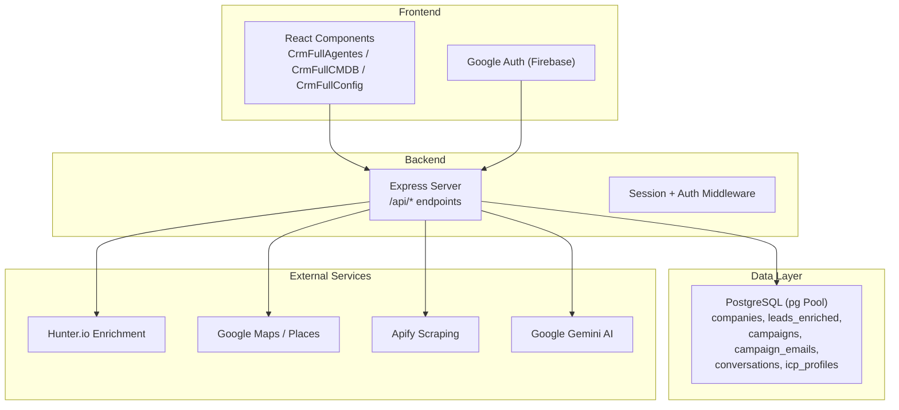
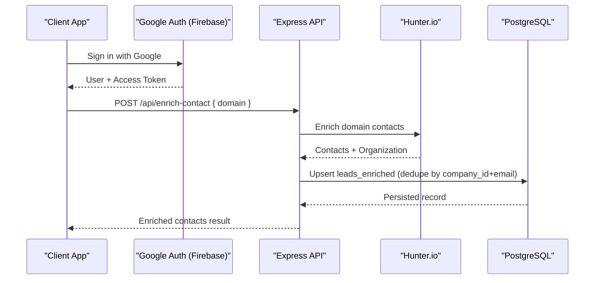
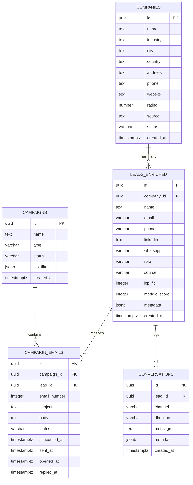
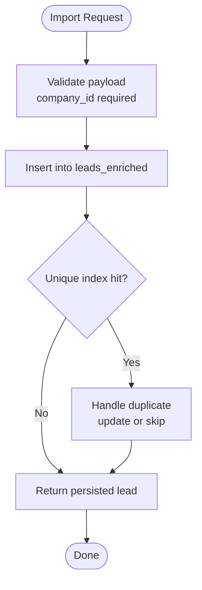
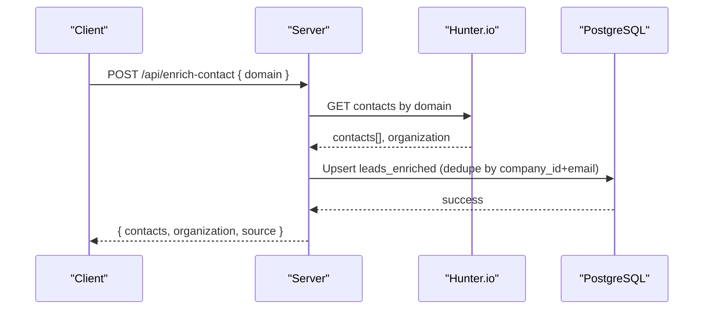
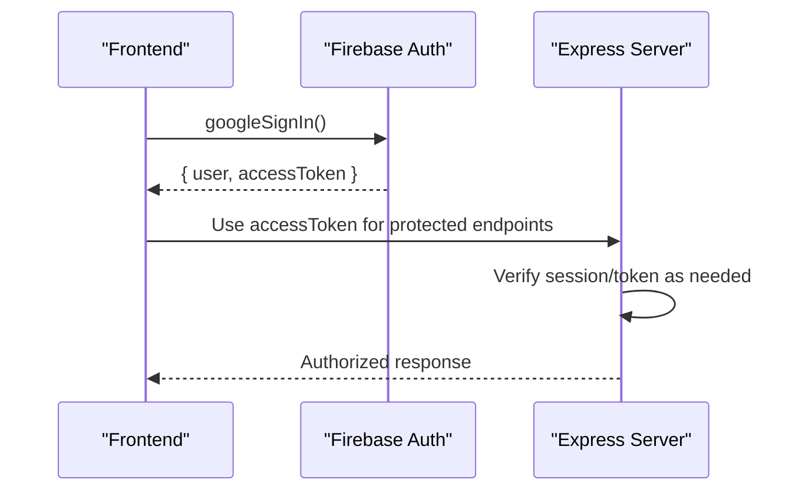
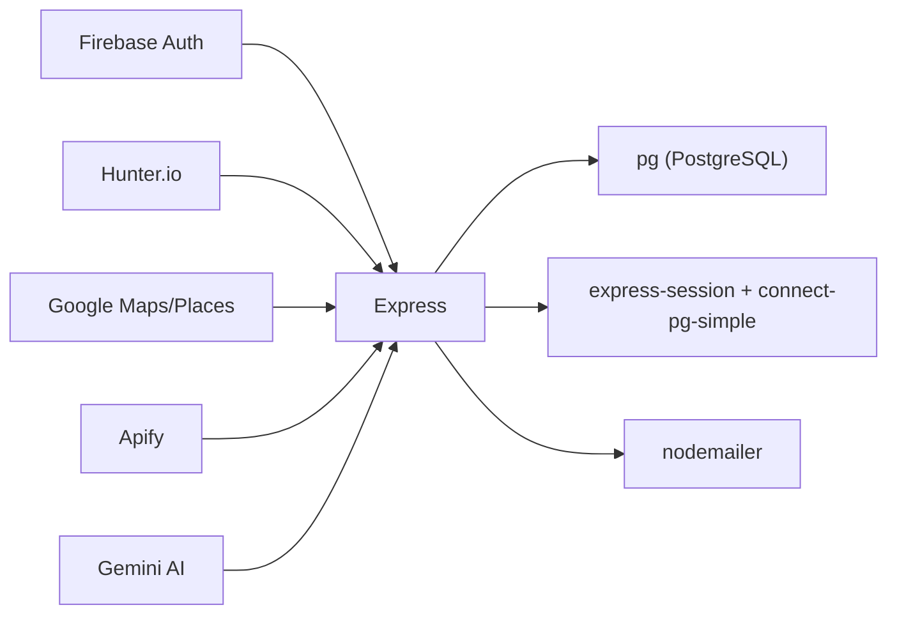

# Contact Database

<cite>
**Referenced Files in This Document**
- [server.ts](file://server.ts)
- [types.ts](file://src/types.ts)
- [googleAuth.ts](file://src/lib/googleAuth.ts)
- [replit.md](file://replit.md)
- [CrmFullAgentes.tsx](file://src/components/crm-full/CrmFullAgentes.tsx)
- [CrmFullCMDB.tsx](file://src/components/crm-full/CrmFullCMDB.tsx)
- [CrmFullConfig.tsx](file://src/components/crm-full/CrmFullConfig.tsx)
- [PublicWebsite.tsx](file://src/components/PublicWebsite.tsx)
</cite>

## Table of Contents
1. Introduction
2. Project Structure
3. Core Components
4. Architecture Overview
5. Detailed Component Analysis
6. Dependency Analysis
7. Performance Considerations
8. Troubleshooting Guide
9. Conclusion
10. Appendices

## Introduction
This document provides comprehensive documentation for the contact database management system within the CRM application. It covers the contact data model, company hierarchy relationships, and contact organization structures. It also documents import/export capabilities, duplicate detection, data enrichment processes, Google authentication integration for synchronization, search and filtering, bulk operations, custom fields, relationship mapping, automated validation rules, privacy controls, access permissions, and data retention policies.

## Project Structure
The system is built with a Node/Express server, PostgreSQL via pg pool, React frontend components, and Firebase-based Google authentication. Key areas:
- Server-side API endpoints for contacts, leads, campaigns, proposals, and enrichment
- Database schema initialization for companies, enriched leads, conversations, campaigns, campaign emails, and ICP profiles
- Frontend components for agent orchestration, CMDB inventory, and configuration health checks
- Google Auth module for sign-in and token handling

**Diagram sources**
- [server.ts](file://server.ts)
- [googleAuth.ts](file://src/lib/googleAuth.ts)
- [CrmFullAgentes.tsx](file://src/components/crm-full/CrmFullAgentes.tsx)
- [CrmFullCMDB.tsx](file://src/components/crm-full/CrmFullCMDB.tsx)
- [CrmFullConfig.tsx](file://src/components/crm-full/CrmFullConfig.tsx)

**Section sources**
- [server.ts](file://server.ts)
- [replit.md](file://replit.md)

## Core Components
- Contact and Lead Model: The enriched lead table stores person-level contact records linked to companies, including name, email, phone, LinkedIn, WhatsApp, role, source, scoring fields (ICP fit, MEDDIC), and metadata.
- Company Hierarchy: Companies are referenced by leads; unique index on company_id + email ensures deduplication per company.
- Campaigns and Emails: Campaigns group outreach efforts; individual emails track status and timestamps.
- Conversations: Multi-channel conversation logs tied to leads.
- ICP Profiles: Target profile definitions used for segmentation and scoring.

Key responsibilities:
- Server endpoints manage CRUD for leads, campaigns, proposals, and enrichment flows.
- Frontend components provide operational views and configuration health checks.
- Google Auth enables user sign-in and token caching for integrations.

**Section sources**
- [server.ts](file://server.ts)
- [types.ts](file://src/types.ts)

## Architecture Overview
The contact database system integrates external services for enrichment and prospecting, while maintaining relational integrity between companies and enriched leads. Authentication and sessions are managed server-side, with optional Firebase Google sign-in for user identity.

**Diagram sources**
- [googleAuth.ts](file://src/lib/googleAuth.ts)
- [server.ts](file://server.ts)

## Detailed Component Analysis

### Data Model and Relationships
- Company-to-Leads: One-to-many relationship; leads_enriched.company_id references companies.id with cascade delete.
- Unique Constraint: Index on (company_id, email) prevents duplicate contacts per company when email is present.
- Scoring Fields: icp_fit and meddic_score support prioritization and qualification workflows.
- Metadata: JSONB field allows flexible custom attributes.

**Diagram sources**
- [server.ts](file://server.ts)

**Section sources**
- [server.ts](file://server.ts)

### Import/Export Capabilities
- Import: Bulk creation of enriched leads via POST /api/leads-enriched; supports company_id, name, email, phone, linkedin, whatsapp, role, source, icp_fit, meddic_score, metadata.
- Export: Frontend CSV/Markdown export utilities demonstrated in CMDB component; similar patterns can be applied to contacts/leads.

**Diagram sources**
- [server.ts](file://server.ts)
- [CrmFullCMDB.tsx](file://src/components/crm-full/CrmFullCMDB.tsx)

**Section sources**
- [server.ts](file://server.ts)
- [CrmFullCMDB.tsx](file://src/components/crm-full/CrmFullCMDB.tsx)

### Duplicate Detection
- Unique index on leads_enriched(company_id, email) enforces deduplication at the database level.
- Application logic should handle constraint violations gracefully (e.g., update existing record or return conflict).

**Section sources**
- [server.ts](file://server.ts)

### Data Enrichment Processes
- POST /api/enrich-contact accepts a domain, calls Hunter.io to retrieve contacts and organization info, and returns structured results.
- Optional scraping via Apify and Google Places APIs for prospecting; Gemini AI used for content generation and fallbacks.

**Diagram sources**
- [server.ts](file://server.ts)

**Section sources**
- [server.ts](file://server.ts)

### Google Authentication Integration
- Firebase Auth initialized with Google provider; scopes include Drive for potential file sync.
- Sign-in flow returns user and access token; token cached for subsequent API calls.
- Session management handled server-side with express-session and PostgreSQL store.

**Diagram sources**
- [googleAuth.ts](file://src/lib/googleAuth.ts)
- [server.ts](file://server.ts)

**Section sources**
- [googleAuth.ts](file://src/lib/googleAuth.ts)
- [server.ts](file://server.ts)

### Search and Filtering
- Frontend components demonstrate search and filter patterns (e.g., CMDB table filters by environment and status).
- Backend queries support filtering by status, limit, and other parameters where applicable.

**Section sources**
- [CrmFullCMDB.tsx](file://src/components/crm-full/CrmFullCMDB.tsx)
- [server.ts](file://server.ts)

### Bulk Operations
- Bulk insert supported via /api/leads-enriched endpoint; loop over items and upsert into leads_enriched.
- Campaign creation and updates allow batch association of leads through campaign_emails.

**Section sources**
- [server.ts](file://server.ts)

### Custom Contact Fields
- JSONB metadata field in leads_enriched allows storing arbitrary key-value pairs for custom attributes.
- Example usage: store additional identifiers, tags, or third-party IDs.

**Section sources**
- [server.ts](file://server.ts)

### Relationship Mapping
- Leads link to companies via company_id foreign key.
- Campaign emails link to both campaigns and leads.
- Conversations link to leads for multi-channel history.

**Section sources**
- [server.ts](file://server.ts)

### Automated Data Validation Rules
- Required fields validated server-side (e.g., company_id for leads, domain for enrichment).
- Status enums enforced in endpoints (e.g., campaign status, lead status transitions).
- Unique constraints enforced at DB level (company_id + email).

**Section sources**
- [server.ts](file://server.ts)

### Privacy Controls, Access Permissions, and Data Retention
- Privacy policy section outlines data collection, rights, and deletion requests.
- Sessions stored in PostgreSQL; configurable cookie settings for security.
- No explicit retention policies defined in code; recommend implementing lifecycle jobs for archival/deletion.

**Section sources**
- [PublicWebsite.tsx](file://src/components/PublicWebsite.tsx)
- [server.ts](file://server.ts)

## Dependency Analysis
Core dependencies and their roles:
- Express: HTTP server and middleware stack
- pg: PostgreSQL client for queries and migrations
- express-session + connect-pg-simple: Session persistence
- nodemailer: Email sending capability
- Firebase: Google authentication
- External APIs: Hunter.io, Google Maps/Places, Apify, Gemini AI

**Diagram sources**
- [server.ts](file://server.ts)
- [googleAuth.ts](file://src/lib/googleAuth.ts)

**Section sources**
- [server.ts](file://server.ts)
- [googleAuth.ts](file://src/lib/googleAuth.ts)

## Performance Considerations
- Use parameterized queries to prevent SQL injection and improve plan reuse.
- Leverage indexes (e.g., company_id + email) for fast deduplication and lookups.
- Batch inserts/updates where possible to reduce round trips.
- Cache frequently accessed data (e.g., ICP profiles) if appropriate.
- Monitor query performance with EXPLAIN ANALYZE and pg-stat-statements.

[No sources needed since this section provides general guidance]

## Troubleshooting Guide
Common issues and resolutions:
- Missing DATABASE_URL: Server falls back to mock pool; ensure environment variables are set.
- SMTP not configured: Password reset emails fail; configure SMTP_USER and SMTP_PASS.
- Google Auth errors: Check Firebase config and scopes; verify access token retrieval.
- Enrichment failures: Validate domain format and Hunter.io API key; log error responses.
- Health checks: Use /api/admin/health to verify service statuses and latency.

**Section sources**
- [server.ts](file://server.ts)
- [CrmFullConfig.tsx](file://src/components/crm-full/CrmFullConfig.tsx)

## Conclusion
The contact database management system provides a robust foundation for managing companies, enriched contacts, campaigns, and conversations. With strong deduplication, flexible metadata, and integrations for enrichment and authentication, it supports scalable B2B outreach workflows. Implementing explicit retention policies and advanced privacy controls will further strengthen compliance and data governance.

[No sources needed since this section summarizes without analyzing specific files]

## Appendices

### Environment Variables Reference
- SESSION_SECRET: Session signing
- GEMINI_API_KEY: AI capabilities
- CRM_INTERNAL_TOKEN: Webhook auth
- NEON_API_KEY + NEON_PROJECT_ID: Dynamic DB URL resolution
- DATABASE_URL: PostgreSQL connection string
- APIFY_API_TOKEN: Scraping
- GOOGLE_MAPS_PLATFORM_KEY: Places API
- HUNTER_API_KEY: Enrichment
- SANTI_API_KEY: SDR auth
- APP_URL: Public app URL

**Section sources**
- [replit.md](file://replit.md)

### Agent Orchestration Overview
- Agents coordinate tasks such as prospecting, enrichment, proposal generation, and campaign execution.
- Orchestrator routes tasks based on labels and executes with Gemini AI.

**Section sources**
- [CrmFullAgentes.tsx](file://src/components/crm-full/CrmFullAgentes.tsx)