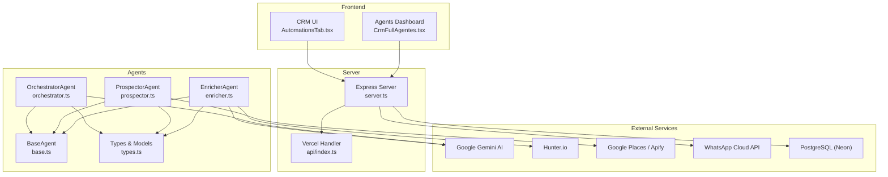
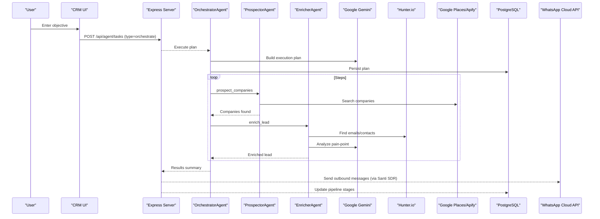
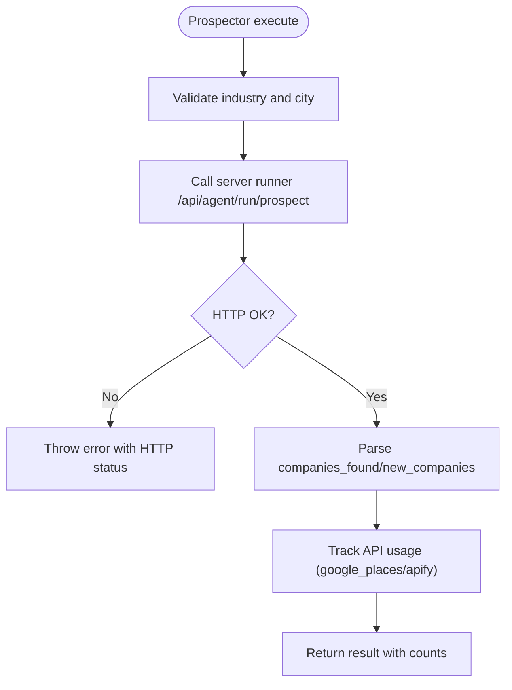
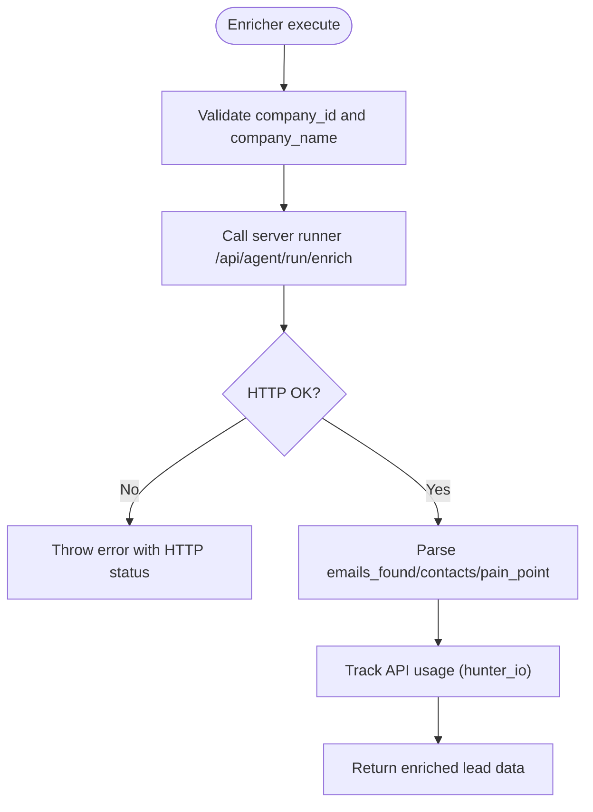
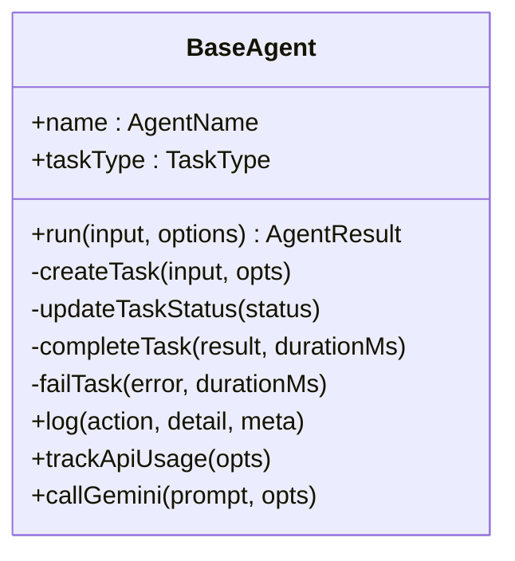
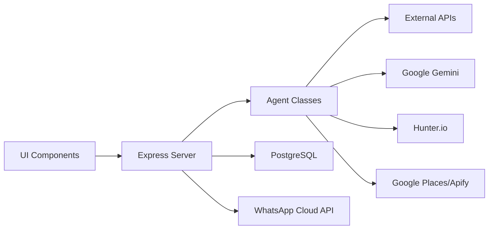

# Lead Management

<cite>
**Referenced Files in This Document**
- [src/agents/index.ts](file://src/agents/index.ts)
- [src/agents/base.ts](file://src/agents/base.ts)
- [src/agents/orchestrator.ts](file://src/agents/orchestrator.ts)
- [src/agents/prospector.ts](file://src/agents/prospector.ts)
- [src/agents/enricher.ts](file://src/agents/enricher.ts)
- [src/agents/types.ts](file://src/agents/types.ts)
- [src/components/crm-full/CrmFullAgentes.tsx](file://src/components/crm-full/CrmFullAgentes.tsx)
- [src/components/AutomationsTab.tsx](file://src/components/AutomationsTab.tsx)
- [src/components/PublicWebsite.tsx](file://src/components/PublicWebsite.tsx)
- [server.ts](file://server.ts)
- [api/index.ts](file://api/index.ts)
</cite>

## Table of Contents
1. Introduction
2. Project Structure
3. Core Components
4. Architecture Overview
5. Detailed Component Analysis
6. Dependency Analysis
7. Performance Considerations
8. Troubleshooting Guide
9. Conclusion

## Introduction
This document explains the lead management system within the CRM, covering the full lifecycle from prospecting to conversion. It details automated lead scoring using MEDDIC methodology, enrichment processes, qualification workflows, and integrations with AI agents “Explorador Patagónico” (lead generation) and “Santi SDR” (outbound WhatsApp outreach). It also documents data models, scoring algorithms, status transitions, and connections to WhatsApp automation, including examples of custom scoring criteria, lead source tracking, and automated follow-up sequences.

## Project Structure
The lead management system is implemented as a set of TypeScript agents that orchestrate tasks, enrich leads, and integrate with external APIs. The server exposes endpoints for authentication, agent task execution, and integrations. UI components visualize workflows and agent roles.



**Diagram sources**
- [src/agents/base.ts](file://src/agents/base.ts)
- [src/agents/orchestrator.ts](file://src/agents/orchestrator.ts)
- [src/agents/prospector.ts](file://src/agents/prospector.ts)
- [src/agents/enricher.ts](file://src/agents/enricher.ts)
- [src/agents/types.ts](file://src/agents/types.ts)
- [server.ts](file://server.ts)
- [api/index.ts](file://api/index.ts)
- [src/components/AutomationsTab.tsx](file://src/components/AutomationsTab.tsx)
- [src/components/crm-full/CrmFullAgentes.tsx](file://src/components/crm-full/CrmFullAgentes.tsx)

**Section sources**
- [src/agents/index.ts](file://src/agents/index.ts)
- [src/agents/base.ts](file://src/agents/base.ts)
- [src/agents/orchestrator.ts](file://src/agents/orchestrator.ts)
- [src/agents/prospector.ts](file://src/agents/prospector.ts)
- [src/agents/enricher.ts](file://src/agents/enricher.ts)
- [src/agents/types.ts](file://src/agents/types.ts)
- [server.ts](file://server.ts)
- [api/index.ts](file://api/index.ts)
- [src/components/AutomationsTab.tsx](file://src/components/AutomationsTab.tsx)
- [src/components/crm-full/CrmFullAgentes.tsx](file://src/components/crm-full/CrmFullAgentes.tsx)

## Core Components
- BaseAgent: Provides task lifecycle management, retries, logging, cost tracking, and shared utilities like Gemini calls.
- OrchestratorAgent: Parses natural-language objectives into execution plans, persists plans, dispatches steps to agents, and tracks results.
- ProspectorAgent: Finds companies via Google Places or Apify, persists company records, and tracks usage costs.
- EnricherAgent: Enriches companies with emails/contacts via Hunter.io, extracts website content via Firecrawl, and analyzes pain points using Gemini.
- Types: Defines core data models (Company, EnrichedLead, Proposal, Campaign, CampaignEmail, Conversation), task types, statuses, and orchestrator plans.

Key responsibilities:
- Task orchestration and dependency resolution
- External API integration with error handling and retries
- Cost and token tracking per task
- Standardized logging and observability

**Section sources**
- [src/agents/base.ts](file://src/agents/base.ts)
- [src/agents/orchestrator.ts](file://src/agents/orchestrator.ts)
- [src/agents/prospector.ts](file://src/agents/prospector.ts)
- [src/agents/enricher.ts](file://src/agents/enricher.ts)
- [src/agents/types.ts](file://src/agents/types.ts)

## Architecture Overview
The system uses an agent-based architecture where the OrchestratorAgent acts as the entry point for user objectives. It generates a plan using Gemini, persists it, and dispatches tasks to specialized agents. Data flows through the server’s Express endpoints to PostgreSQL and external services (Gemini, Hunter.io, Google Places/Apify, WhatsApp).



**Diagram sources**
- [src/agents/orchestrator.ts](file://src/agents/orchestrator.ts)
- [src/agents/prospector.ts](file://src/agents/prospector.ts)
- [src/agents/enricher.ts](file://src/agents/enricher.ts)
- [server.ts](file://server.ts)

## Detailed Component Analysis

### OrchestratorAgent
Responsibilities:
- Parse natural language objectives into structured plans
- Persist orchestration plans
- Dispatch dependent steps sequentially
- Track success/failure per step and aggregate results

Key behaviors:
- Uses Gemini to generate JSON plans with ordered steps, dependencies, and inputs
- Falls back to default plan if Gemini response is invalid
- Creates tasks via server endpoints and logs each dispatch

```mermaid
classDiagram
class OrchestratorAgent {
+name : AgentName
+taskType : TaskType
+execute(input, log) AgentResult
-buildPlan(objective, log) OrchestratorPlan
-saveOrchestration(objective, plan) string
-dispatchAgent(opts) Promise~{taskId}~
}
class BaseAgent {
+run(input, options) AgentResult
-createTask(input, opts)
-updateTaskStatus(status)
-completeTask(result, durationMs)
-failTask(error, durationMs)
+log(action, detail, meta)
+trackApiUsage(opts)
+callGemini(prompt, opts)
}
OrchestratorAgent --|> BaseAgent : "extends"
```

**Diagram sources**
- [src/agents/orchestrator.ts](file://src/agents/orchestrator.ts)
- [src/agents/base.ts](file://src/agents/base.ts)

**Section sources**
- [src/agents/orchestrator.ts](file://src/agents/orchestrator.ts)

### ProspectorAgent
Responsibilities:
- Discover companies based on industry, city, country, and limit
- Delegate to server-side runner for Google Places or Apify
- Track API usage and cost estimation

Input fields:
- industry, city, country, limit, source

Output fields:
- companies_found, new_companies, company_ids, errors



**Diagram sources**
- [src/agents/prospector.ts](file://src/agents/prospector.ts)

**Section sources**
- [src/agents/prospector.ts](file://src/agents/prospector.ts)

### EnricherAgent
Responsibilities:
- Enrich company records with emails/contacts via Hunter.io
- Extract website text via Firecrawl
- Analyze pain points using Gemini
- Track API usage and cost

Input fields:
- company_id, company_name, website, domain, city, industry

Output fields:
- company_id, emails_found, contacts[], web_summary, pain_point, lead_id



**Diagram sources**
- [src/agents/enricher.ts](file://src/agents/enricher.ts)

**Section sources**
- [src/agents/enricher.ts](file://src/agents/enricher.ts)

### BaseAgent
Responsibilities:
- Manage task lifecycle (create, update status, complete, fail)
- Implement retry logic with exponential backoff
- Provide logging and API usage tracking
- Shared Gemini call helper

Key methods:
- run(input, options): Entry point with retries and timing
- createTask/updateTaskStatus/completeTask/failTask: Server interactions
- log: Persistent logging per task
- trackApiUsage: Cost and endpoint tracking
- callGemini: Centralized LLM access



**Diagram sources**
- [src/agents/base.ts](file://src/agents/base.ts)

**Section sources**
- [src/agents/base.ts](file://src/agents/base.ts)

### Data Models and Status Transitions
Core entities:
- Company: Represents discovered businesses with status transitions across pipeline stages
- EnrichedLead: Captures contact details, ICP fit score, and MEDDIC score
- Proposal: Tracks proposal lifecycle and delivery status
- Campaign: Manages multi-channel campaigns (email, whatsapp, linkedin)
- CampaignEmail: Tracks email sequence states and engagement metrics
- Conversation: Records inbound/outbound messages across channels

Status transitions:
- Company: new → enriched → analyzed → proposed → in_campaign → replied → closed | discard
- CampaignEmail: draft → scheduled → sent → opened/replied/bounced

Scoring fields:
- icp_fit: 0–100
- meddic_score: 0–30

**Section sources**
- [src/agents/types.ts](file://src/agents/types.ts)

### AI Agents Integration
- Explorador Patagónico: Lead generation focused on Patagonia using Google Maps and Apify; calculates fit scores with Gemini and performs Hunter.io enrichment.
- Santi SDR: Outbound WhatsApp outreach agent that qualifies responses (hot/warm/cold), enforces opt-out guardrails, and updates CRM pipeline automatically.

These agents are visualized and described in the Agents Dashboard component.

**Section sources**
- [src/components/crm-full/CrmFullAgentes.tsx](file://src/components/crm-full/CrmFullAgentes.tsx)

### Automated Workflows and Follow-ups
The AutomationsTab defines workflow blocks for triggers and actions:
- Trigger: New lead captured via chat
- Actions: ICP qualification with Gemini, send WhatsApp welcome message, create CRM opportunity with initial MEDDIC score

Follow-up sequences:
- Automated reminders when deals lack activity
- WhatsApp follow-ups after 48 hours without response
- Email nurturing sequences triggered by stage changes

**Section sources**
- [src/components/AutomationsTab.tsx](file://src/components/AutomationsTab.tsx)

### WhatsApp Automation Connection
PublicWebsite highlights WhatsApp Business API features:
- Approved templates with dynamic variables (name, company, amount)
- Staggered sending to protect number reputation
- Automated follow-ups and synchronization with CRM

**Section sources**
- [src/components/PublicWebsite.tsx](file://src/components/PublicWebsite.tsx)

## Dependency Analysis
The system exhibits clear separation between frontend UI, server endpoints, and agent implementations. Dependencies flow from UI to server, then to agents and external services.



**Diagram sources**
- [src/components/AutomationsTab.tsx](file://src/components/AutomationsTab.tsx)
- [src/components/crm-full/CrmFullAgentes.tsx](file://src/components/crm-full/CrmFullAgentes.tsx)
- [server.ts](file://server.ts)
- [src/agents/base.ts](file://src/agents/base.ts)
- [src/agents/orchestrator.ts](file://src/agents/orchestrator.ts)
- [src/agents/prospector.ts](file://src/agents/prospector.ts)
- [src/agents/enricher.ts](file://src/agents/enricher.ts)

**Section sources**
- [server.ts](file://server.ts)
- [api/index.ts](file://api/index.ts)
- [src/agents/base.ts](file://src/agents/base.ts)
- [src/agents/orchestrator.ts](file://src/agents/orchestrator.ts)
- [src/agents/prospector.ts](file://src/agents/prospector.ts)
- [src/agents/enricher.ts](file://src/agents/enricher.ts)

## Performance Considerations
- Retry strategy: Exponential backoff prevents overwhelming external APIs during transient failures.
- Logging and cost tracking: Each agent logs actions and tracks API usage to monitor performance and costs.
- Sequential dispatch: Orchestrator respects dependencies to avoid unnecessary work and ensure data consistency.
- Caching and rate limiting: Staggered WhatsApp sends protect sender reputation and reduce risk of throttling.

[No sources needed since this section provides general guidance]

## Troubleshooting Guide
Common issues and resolutions:
- Missing environment variables: Ensure DATABASE_URL, SMTP_USER, SMTP_PASS, SANTI_API_KEY, and CRM_INTERNAL_TOKEN are configured.
- Authentication failures: Verify session configuration and Neon Auth settings; check local fallback behavior.
- Agent task failures: Inspect logs via /api/agent/logs and review error messages returned by external APIs.
- WhatsApp delivery problems: Confirm template approval and staggered sending configuration.

**Section sources**
- [server.ts](file://server.ts)
- [src/agents/base.ts](file://src/agents/base.ts)

## Conclusion
The lead management system combines AI-driven orchestration, robust enrichment, and automated outreach to streamline the sales pipeline. With MEDDIC scoring, customizable workflows, and seamless WhatsApp integration, it enables efficient prospecting through conversion while maintaining observability and performance.

[No sources needed since this section summarizes without analyzing specific files]