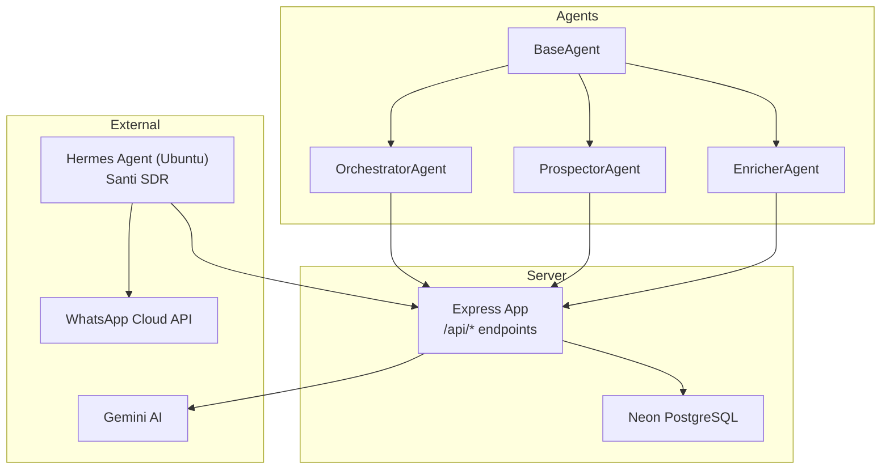
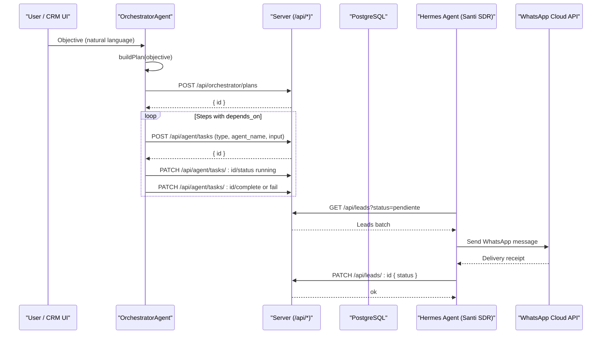
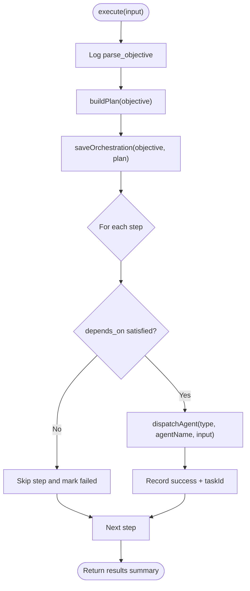
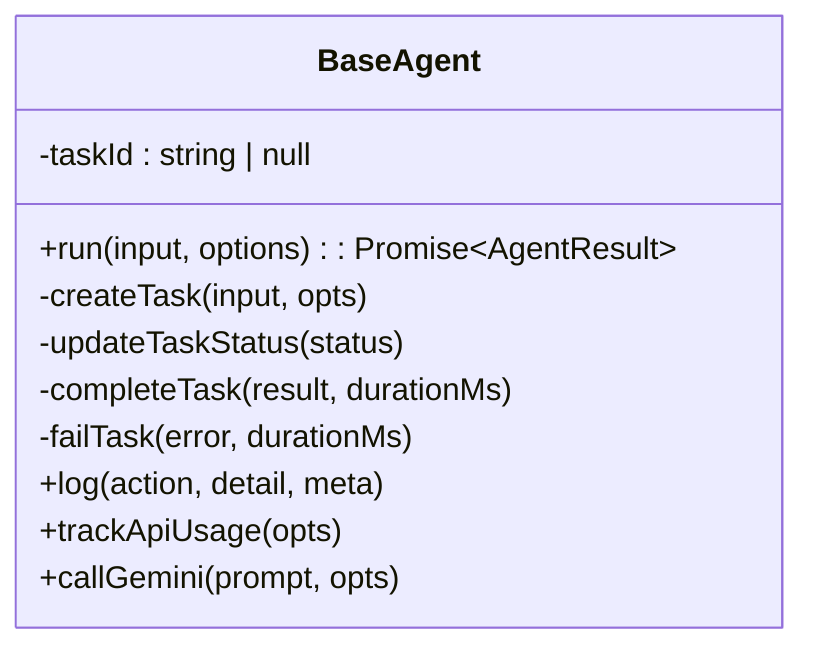
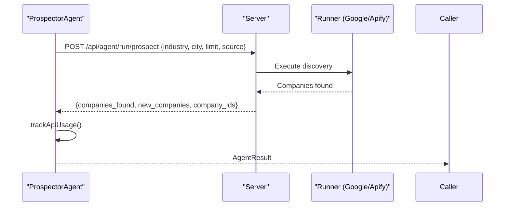
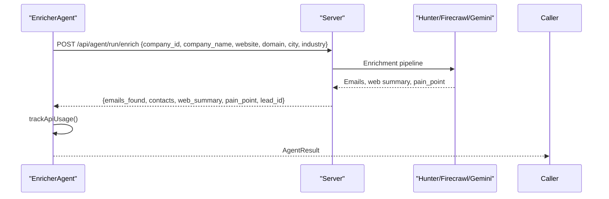
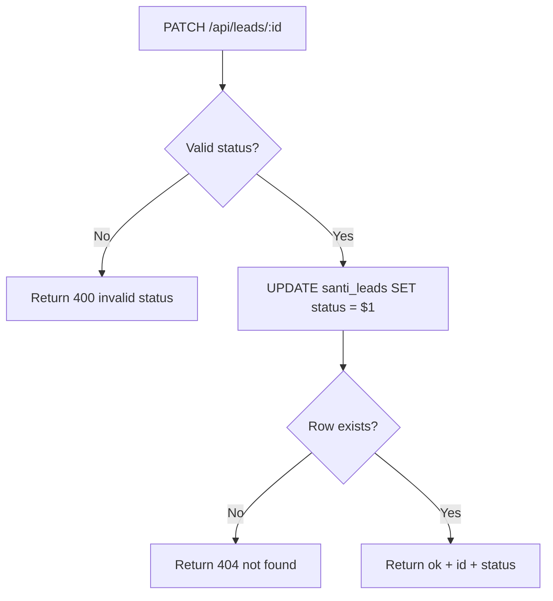
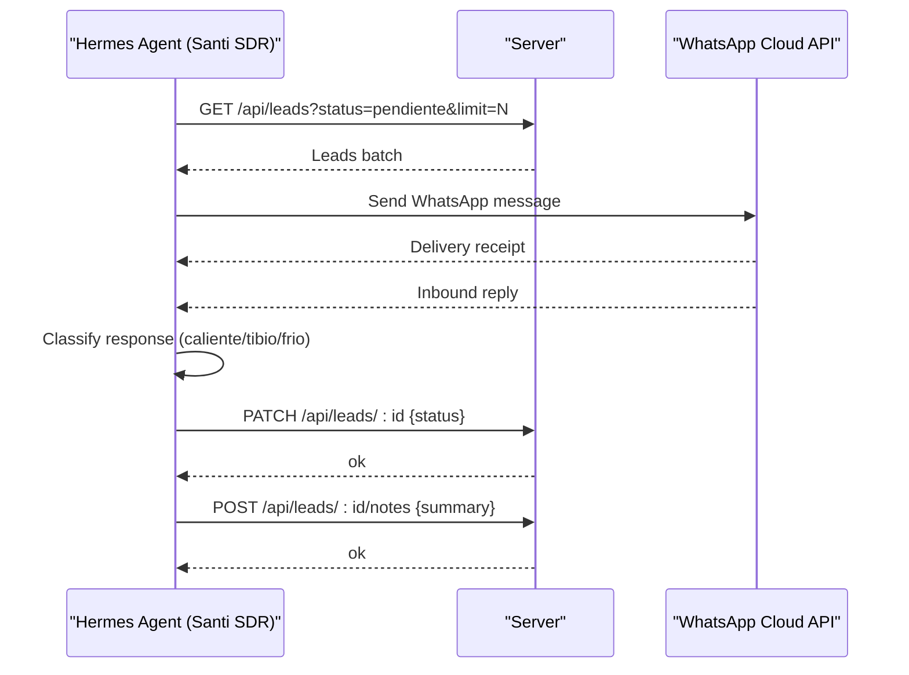
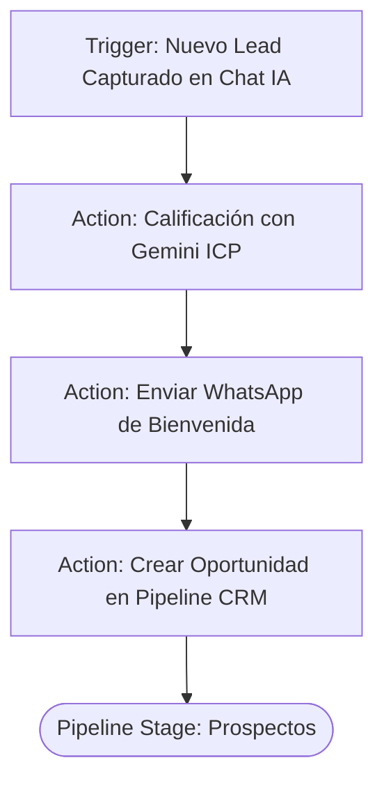
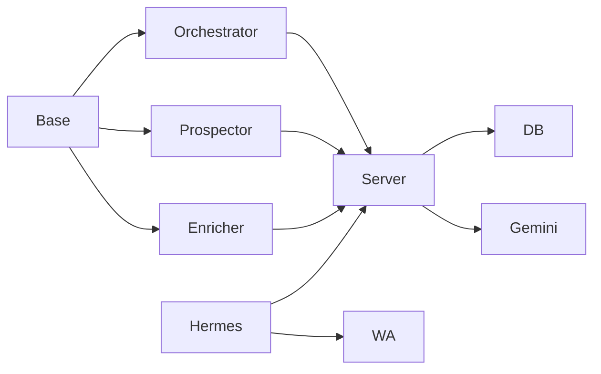

# Lead Qualification Workflows

<cite>
**Referenced Files in This Document**
- [orchestrator.ts](file://src/agents/orchestrator.ts)
- [base.ts](file://src/agents/base.ts)
- [types.ts](file://src/agents/types.ts)
- [prospector.ts](file://src/agents/prospector.ts)
- [enricher.ts](file://src/agents/enricher.ts)
- [CrmFullAgentes.tsx](file://src/components/crm-full/CrmFullAgentes.tsx)
- [AutomationsTab.tsx](file://src/components/AutomationsTab.tsx)
- [server.ts](file://server.ts)
- [index.ts](file://api/index.ts)
</cite>

## Table of Contents
1. [Introduction](#introduction)
2. [Project Structure](#project-structure)
3. [Core Components](#core-components)
4. [Architecture Overview](#architecture-overview)
5. [Detailed Component Analysis](#detailed-component-analysis)
6. [Dependency Analysis](#dependency-analysis)
7. [Performance Considerations](#performance-considerations)
8. [Troubleshooting Guide](#troubleshooting-guide)
9. [Conclusion](#conclusion)
10. [Appendices](#appendices)

## Introduction
This document explains the automated lead qualification workflows implemented in the project, focusing on:
- Status transitions from cold leads through qualified prospects to sales-ready opportunities
- Integration with “Santi SDR” WhatsApp automation for outbound outreach and response classification (hot/warm/cold)
- Automated follow-up sequences, qualification criteria validation, and handoff processes between AI agents and human sales teams
- Workflow customization options and exception handling procedures

The system combines an agent orchestration layer, enrichment and prospecting agents, a server-side API for CRM operations, and a UI that visualizes agents and automations.

## Project Structure
At a high level:
- Agent framework defines base behavior, task lifecycle, retries, logging, and Gemini integration
- Orchestrator builds execution plans and dispatches tasks to specialized agents
- Prospector and Enricher agents call server-side runners to fetch data and enrich leads
- Server exposes endpoints for lead management, status updates, notes, brochures, and orchestrator chat
- UI components visualize agents and workflow builders

**Diagram sources**
- [base.ts](file://src/agents/base.ts)
- [orchestrator.ts](file://src/agents/orchestrator.ts)
- [prospector.ts](file://src/agents/prospector.ts)
- [enricher.ts](file://src/agents/enricher.ts)
- [server.ts](file://server.ts)

**Section sources**
- [base.ts](file://src/agents/base.ts)
- [orchestrator.ts](file://src/agents/orchestrator.ts)
- [prospector.ts](file://src/agents/prospector.ts)
- [enricher.ts](file://src/agents/enricher.ts)
- [server.ts](file://server.ts)

## Core Components
- BaseAgent: Provides task lifecycle (create/update/complete/fail), retry/backoff, logging, cost tracking, and shared Gemini calls
- OrchestratorAgent: Parses objectives into structured plans, persists plans, and dispatches steps to agents with dependency resolution
- ProspectorAgent: Calls server runner to discover companies via Google Places or Apify; tracks usage and returns counts
- EnricherAgent: Calls server runner to enrich leads using Hunter.io, web scraping, and Gemini pain-point analysis
- Types: Defines agent names, task types, statuses, and core data models (Company, EnrichedLead, Proposal, Campaign, Conversation)
- Server: Implements authentication, lead CRUD, status transitions, notes, brochures, and orchestrator chat endpoint
- UI: CrmFullAgentes displays agent architecture and roles; AutomationsTab provides a visual workflow builder

Key responsibilities:
- Orchestration and planning
- Data acquisition and enrichment
- Status-driven pipeline progression
- Secure server-to-server communication for Santi SDR
- Observability via logs and usage tracking

**Section sources**
- [base.ts](file://src/agents/base.ts)
- [orchestrator.ts](file://src/agents/orchestrator.ts)
- [prospector.ts](file://src/agents/prospector.ts)
- [enricher.ts](file://src/agents/enricher.ts)
- [types.ts](file://src/agents/types.ts)
- [server.ts](file://server.ts)
- [CrmFullAgentes.tsx](file://src/components/crm-full/CrmFullAgentes.tsx)
- [AutomationsTab.tsx](file://src/components/AutomationsTab.tsx)

## Architecture Overview
The system follows a layered architecture:
- Frontend/UI: Displays agents and automations
- Agent Layer: Orchestrator and specialized agents encapsulate business logic
- Server Layer: Express app manages auth, persistence, integrations, and external APIs
- External Integrations: Gemini AI, WhatsApp Cloud API, Google Maps/Apify, Hunter.io

**Diagram sources**
- [orchestrator.ts](file://src/agents/orchestrator.ts)
- [base.ts](file://src/agents/base.ts)
- [server.ts](file://server.ts)

## Detailed Component Analysis

### OrchestratorAgent
Responsibilities:
- Parse objective into a plan with ordered steps and dependencies
- Persist orchestration plan and track results per step
- Dispatch tasks to agents with typed inputs and parent-task linkage
- Handle errors and log outcomes

Key behaviors:
- Uses Gemini to generate structured JSON plans
- Falls back to default plan if parsing fails
- Tracks completed vs failed steps and returns summary

**Diagram sources**
- [orchestrator.ts](file://src/agents/orchestrator.ts)

**Section sources**
- [orchestrator.ts](file://src/agents/orchestrator.ts)

### BaseAgent
Responsibilities:
- Manage task lifecycle: create, update status, complete, fail
- Retry with exponential backoff
- Logging and API usage tracking
- Shared Gemini helper

Key behaviors:
- Ensures consistent task state transitions
- Centralizes error handling and duration tracking
- Provides reusable methods for agents

**Diagram sources**
- [base.ts](file://src/agents/base.ts)

**Section sources**
- [base.ts](file://src/agents/base.ts)

### ProspectorAgent
Responsibilities:
- Discover companies by industry and city
- Delegate to server runner for external APIs (Google Places/Apify)
- Track API usage and return company counts

Key validations:
- Requires industry and city
- Returns structured output with counts and IDs

**Diagram sources**
- [prospector.ts](file://src/agents/prospector.ts)
- [server.ts](file://server.ts)

**Section sources**
- [prospector.ts](file://src/agents/prospector.ts)

### EnricherAgent
Responsibilities:
- Enrich leads with emails, contacts, web summaries, and pain points
- Use Hunter.io, Firecrawl, and Gemini for insights
- Track usage and return enriched data

Key validations:
- Requires company_id and company_name
- Produces structured contact list and optional pain point

**Diagram sources**
- [enricher.ts](file://src/agents/enricher.ts)
- [server.ts](file://server.ts)

**Section sources**
- [enricher.ts](file://src/agents/enricher.ts)

### Server API — Lead Management and Status Transitions
Responsibilities:
- Provide secure endpoints for Santi SDR (server-to-server)
- Manage lead creation, brochure generation, notes, and status updates
- Expose orchestrator chat endpoint with real-time DB context

Status transition system:
- Valid statuses: pendiente, contactado, caliente, tibio, frio, agendado
- PATCH endpoint enforces allowed values and timestamps updates

**Diagram sources**
- [server.ts](file://server.ts)

**Section sources**
- [server.ts](file://server.ts)

### Santi SDR — WhatsApp Automation and Response Classification
Responsibilities:
- Outbound WhatsApp messaging via WhatsApp Cloud API
- Classify responses as hot/warm/cold and update lead status accordingly
- Follow up sequences based on response classification

Integration points:
- Reads leads with status “pendiente”
- Sends messages and records delivery
- Updates lead status via PATCH endpoint
- Adds notes summarizing conversation outcomes

**Diagram sources**
- [server.ts](file://server.ts)
- [CrmFullAgentes.tsx](file://src/components/crm-full/CrmFullAgentes.tsx)

**Section sources**
- [server.ts](file://server.ts)
- [CrmFullAgentes.tsx](file://src/components/crm-full/CrmFullAgentes.tsx)

### Workflow Customization — Visual Builder
Responsibilities:
- Provide a visual interface to define triggers, actions, and conditions
- Support testing and simulation of workflows
- Allow adding/removing blocks dynamically

Customization options:
- Trigger-based entry points (e.g., new lead captured)
- Actions (e.g., ICP scoring, WhatsApp welcome, opportunity creation)
- Conditions (future extension)

**Diagram sources**
- [AutomationsTab.tsx](file://src/components/AutomationsTab.tsx)

**Section sources**
- [AutomationsTab.tsx](file://src/components/AutomationsTab.tsx)

### Data Models and Scoring
Key models:
- Company: Basic firmographic data and status
- EnrichedLead: Contact details, channels, ICP fit, MEDDIC score
- Proposal: Content and status tracking
- Campaign: Channel-specific campaigns
- Conversation: Multi-channel interactions

Scoring:
- ICP fit score (0–100)
- MEDDIC score (0–30)
- Fit score and reasoning generated via Gemini prompts

**Section sources**
- [types.ts](file://src/agents/types.ts)
- [server.ts](file://server.ts)

## Dependency Analysis
Coupling and cohesion:
- Agents depend on BaseAgent for lifecycle and shared utilities
- Orchestrator depends on server endpoints for persistence and task dispatch
- Prospector and Enricher depend on server runners for external integrations
- Server depends on PostgreSQL and external APIs (Gemini, WhatsApp)

Potential circular dependencies:
- None detected; clear separation between client-side agents and server endpoints

External dependencies:
- Gemini AI for planning and enrichment
- WhatsApp Cloud API for outbound messaging
- Google Places/Apify for prospecting
- Hunter.io for email/contact enrichment

**Diagram sources**
- [base.ts](file://src/agents/base.ts)
- [orchestrator.ts](file://src/agents/orchestrator.ts)
- [prospector.ts](file://src/agents/prospector.ts)
- [enricher.ts](file://src/agents/enricher.ts)
- [server.ts](file://server.ts)

**Section sources**
- [base.ts](file://src/agents/base.ts)
- [orchestrator.ts](file://src/agents/orchestrator.ts)
- [prospector.ts](file://src/agents/prospector.ts)
- [enricher.ts](file://src/agents/enricher.ts)
- [server.ts](file://server.ts)

## Performance Considerations
- Retries with exponential backoff reduce transient failures
- Batch queries for leads minimize database load
- Parallel queries in orchestrator context improve responsiveness
- Usage tracking helps monitor costs and token consumption
- Stateless server endpoints facilitate horizontal scaling

[No sources needed since this section provides general guidance]

## Troubleshooting Guide
Common issues:
- Unauthorized access to Santi SDR endpoints due to missing or incorrect API key
- Invalid status transitions blocked by server validation
- Missing required fields in lead creation or enrichment requests
- Gemini unavailability causing fallback behavior

Debugging steps:
- Verify SANTI_API_KEY configuration and headers
- Validate status values against allowed set
- Check request payloads for required fields
- Inspect orchestrator logs and agent task logs for errors

**Section sources**
- [server.ts](file://server.ts)
- [base.ts](file://src/agents/base.ts)

## Conclusion
The system implements a robust lead qualification workflow combining AI-driven orchestration, enrichment, and WhatsApp automation. The status transition model ensures clear progression from cold leads to sales-ready opportunities, while customizable workflows allow tailoring to specific use cases. Exception handling and observability mechanisms support reliable operation at scale.

[No sources needed since this section summarizes without analyzing specific files]

## Appendices

### Status Transition Reference
- pendiente → contactado → caliente/tibio/frio → agendado
- PATCH endpoint enforces valid transitions and timestamps

**Section sources**
- [server.ts](file://server.ts)

### Handoff Processes
- AI agents classify and enrich leads, then update status
- Human sales team reviews “caliente” leads and proceeds to proposals
- Notes capture conversation summaries and next steps

**Section sources**
- [server.ts](file://server.ts)
- [CrmFullAgentes.tsx](file://src/components/crm-full/CrmFullAgentes.tsx)