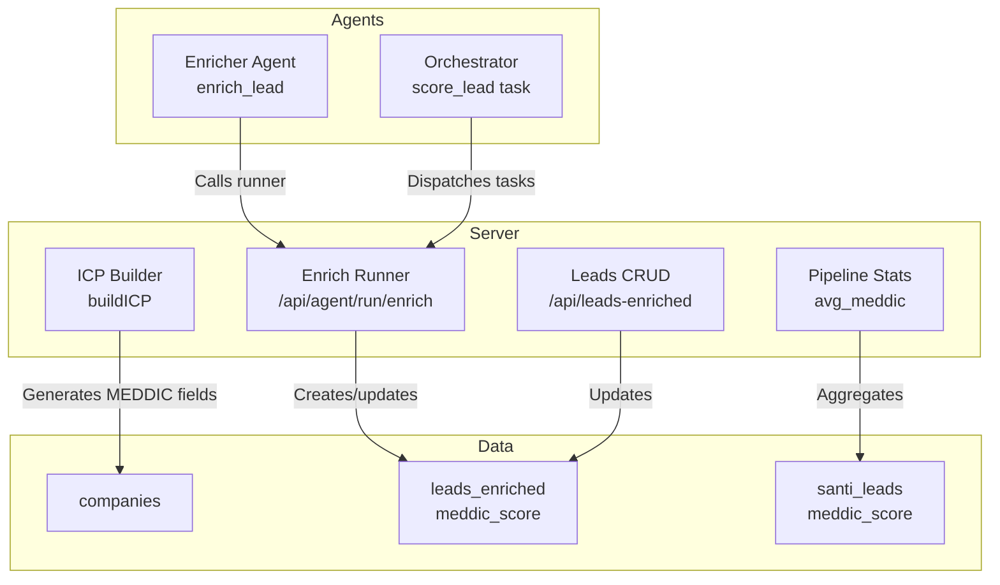
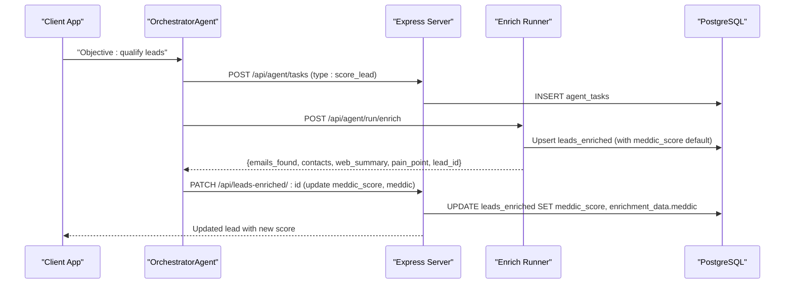
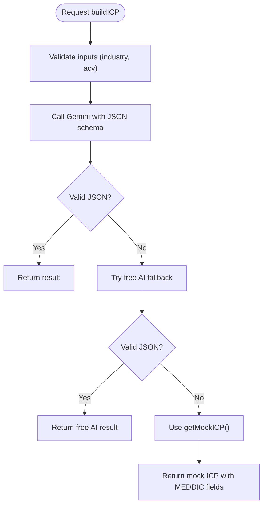
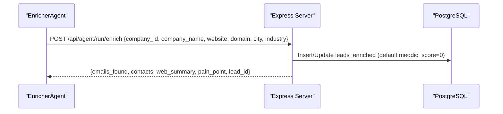
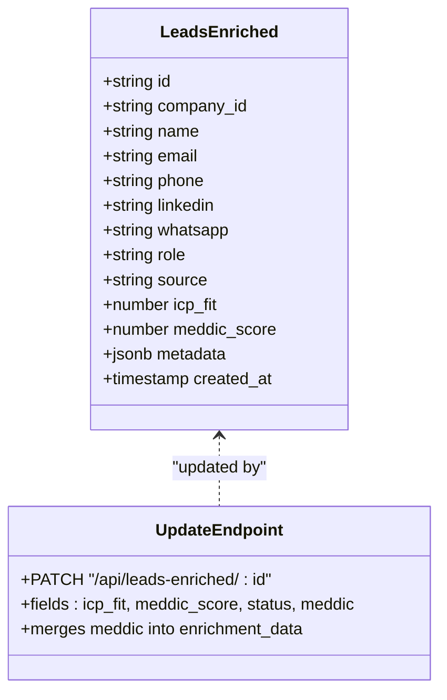
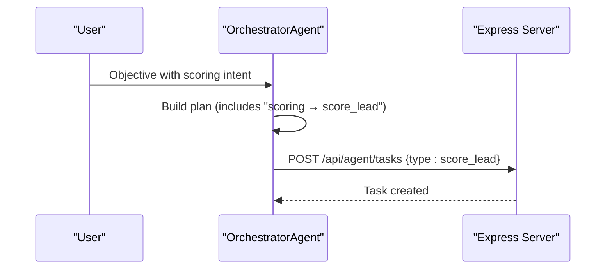
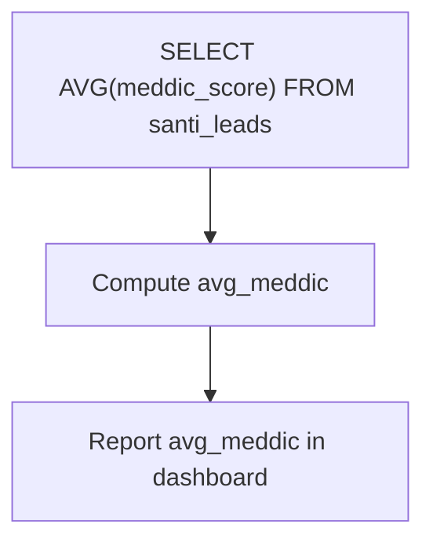
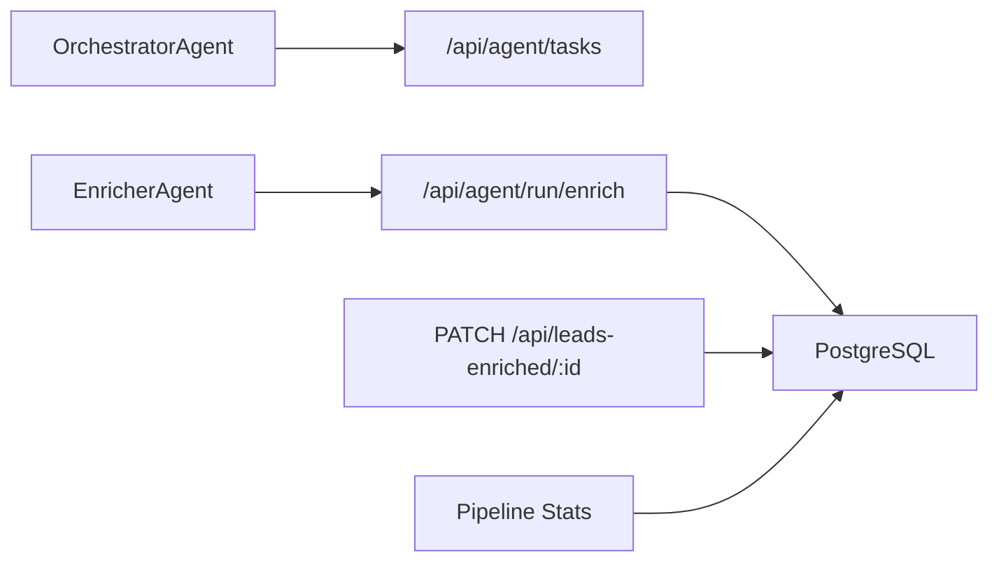

# MEDDIC Lead Scoring System

<cite>
**Referenced Files in This Document**
- [server.ts](file://server.ts)
- [enricher.ts](file://src/agents/enricher.ts)
- [orchestrator.ts](file://src/agents/orchestrator.ts)
- [types.ts](file://src/agents/types.ts)
- [types.ts](file://src/types.ts)
</cite>

## Table of Contents
1. [Introduction](#introduction)
2. [Project Structure](#project-structure)
3. [Core Components](#core-components)
4. [Architecture Overview](#architecture-overview)
5. [Detailed Component Analysis](#detailed-component-analysis)
6. [Dependency Analysis](#dependency-analysis)
7. [Performance Considerations](#performance-considerations)
8. [Troubleshooting Guide](#troubleshooting-guide)
9. [Conclusion](#conclusion)
10. [Appendices](#appendices)

## Introduction
This document explains the MEDDIC lead scoring methodology as implemented in the project. It covers how each MEDDIC criterion (Metrics, Economic Buyer, Decision Criteria, Decision Process, Identify Pain, Champion) is evaluated and scored, how AI-powered enrichment feeds the scoring process, where thresholds are configured, and how scores influence pipeline progression. It also provides guidance for customizing scoring rules, applying manual overrides, and interpreting scores.

## Project Structure
The MEDDIC scoring system spans server-side APIs, agent orchestration, enrichment flows, and data models:
- Server endpoints manage ICP generation with MEDDIC fields, enrich leads, store enriched leads with a meddic_score field, and expose update endpoints for manual overrides.
- The Orchestrator defines a “score_lead” task type to integrate scoring into multi-step workflows.
- Enrichment pulls contact data and web summaries to inform pain-point analysis.
- Data models include a meddic_score field on enriched leads and CRM deal records that can carry MEDDIC details.

**Diagram sources**
- [server.ts:2686-2765](file://server.ts#L2686-L2765)
- [server.ts:4500-4525](file://server.ts#L4500-L4525)
- [server.ts:4644-4691](file://server.ts#L4644-L4691)
- [server.ts:4984-5016](file://server.ts#L4984-L5016)
- [orchestrator.ts:78-144](file://src/agents/orchestrator.ts#L78-L144)
- [enricher.ts:32-75](file://src/agents/enricher.ts#L32-L75)

**Section sources**
- [server.ts:2686-2765](file://server.ts#L2686-L2765)
- [server.ts:4500-4525](file://server.ts#L4500-L4525)
- [server.ts:4644-4691](file://server.ts#L4644-L4691)
- [server.ts:4984-5016](file://server.ts#L4984-L5016)
- [orchestrator.ts:78-144](file://src/agents/orchestrator.ts#L78-L144)
- [enricher.ts:32-75](file://src/agents/enricher.ts#L32-L75)

## Core Components
- ICP Builder with MEDDIC schema: Generates industry-specific Ideal Customer Profile including MEDDIC dimensions as text fields. These serve as reference context for scoring decisions.
- Enrichment Runner: For each company, discovers contacts, extracts website content summary, and identifies a pain point. Returns a lead_id for downstream updates.
- Leads Enriched Storage: Stores enriched leads with an integer meddic_score field and supports PATCH updates to override both numeric score and structured MEDDIC details.
- Orchestrator Task Type: Defines a “score_lead” task type enabling automated or guided scoring within multi-agent plans.
- Pipeline Analytics: Aggregates average meddic_score across leads to report overall pipeline health.

Key implementation anchors:
- MEDDIC fields in ICP builder response schema and fallback mock.
- Enrichment endpoint returning emails, contacts, web summary, and pain_point.
- Database tables and columns for meddic_score.
- PATCH endpoint allowing manual override of meddic_score and merging of structured meddic object.
- Orchestrator plan step referencing “scoring → score_lead”.

**Section sources**
- [server.ts:2686-2765](file://server.ts#L2686-L2765)
- [server.ts:4500-4525](file://server.ts#L4500-L4525)
- [server.ts:4644-4691](file://server.ts#L4644-L4691)
- [server.ts:4984-5016](file://server.ts#L4984-L5016)
- [orchestrator.ts:78-144](file://src/agents/orchestrator.ts#L78-L144)
- [enricher.ts:32-75](file://src/agents/enricher.ts#L32-L75)
- [types.ts:123-136](file://src/agents/types.ts#L123-L136)
- [types.ts:139-162](file://src/types.ts#L139-L162)

## Architecture Overview
The MEDDIC scoring architecture integrates AI-driven enrichment with explicit storage and manual override capabilities:

**Diagram sources**
- [orchestrator.ts:158-177](file://src/agents/orchestrator.ts#L158-L177)
- [enricher.ts:46-71](file://src/agents/enricher.ts#L46-L71)
- [server.ts:4500-4525](file://server.ts#L4500-L4525)
- [server.ts:4644-4691](file://server.ts#L4644-L4691)

## Detailed Component Analysis

### ICP Builder and MEDDIC Context Generation
- Purpose: Generate a comprehensive ICP per industry and ACV, including MEDDIC fields (metrics, economic buyer, decision criteria, decision process, identify pain, champion).
- Behavior: Uses Gemini with a strict JSON schema; falls back to free AI and then to a mock ICP if needed.
- Relevance to scoring: Provides contextual MEDDIC definitions used by analysts or future automated scorers to align scoring logic with target customer profile.

**Diagram sources**
- [server.ts:2686-2765](file://server.ts#L2686-L2765)

**Section sources**
- [server.ts:2686-2765](file://server.ts#L2686-L2765)

### Enrichment Flow and Pain Point Discovery
- Purpose: Enrich companies with contact info, website summary, and a pain point description.
- Behavior: Calls the runner endpoint, logs usage, and returns enriched data including a lead_id for subsequent updates.
- Relevance to scoring: Pain point and web summary provide signals to assess “Identify Pain” and other MEDDIC dimensions.

**Diagram sources**
- [enricher.ts:32-75](file://src/agents/enricher.ts#L32-L75)
- [server.ts:4500-4525](file://server.ts#L4500-L4525)

**Section sources**
- [enricher.ts:32-75](file://src/agents/enricher.ts#L32-L75)
- [server.ts:4500-4525](file://server.ts#L4500-L4525)

### MEDDIC Score Storage and Manual Overrides
- Storage: The leads_enriched table includes an integer meddic_score column.
- Updates: PATCH allows updating meddic_score and merging a structured meddic object into enrichment metadata.
- Manual Override: Users can directly set meddic_score and meddic fields via the PATCH endpoint.

**Diagram sources**
- [server.ts:4644-4691](file://server.ts#L4644-L4691)

**Section sources**
- [server.ts:4644-4691](file://server.ts#L4644-L4691)

### Orchestrator Integration for Automated Scoring
- Task Type: “score_lead” is defined in types and referenced in orchestrator planning.
- Dispatch: Orchestrator creates tasks and dispatches them through the server’s task API.
- Use Case: Enables automated scoring steps within multi-agent workflows.

**Diagram sources**
- [orchestrator.ts:78-144](file://src/agents/orchestrator.ts#L78-L144)
- [orchestrator.ts:158-177](file://src/agents/orchestrator.ts#L158-L177)
- [types.ts:20-31](file://src/agents/types.ts#L20-L31)

**Section sources**
- [orchestrator.ts:78-144](file://src/agents/orchestrator.ts#L78-L144)
- [orchestrator.ts:158-177](file://src/agents/orchestrator.ts#L158-L177)
- [types.ts:20-31](file://src/agents/types.ts#L20-L31)

### Pipeline Analytics and Average MEDDIC Score
- Aggregation: The orchestrator endpoint computes average meddic_score across leads to report pipeline health.
- Usage: Helps stakeholders understand overall qualification quality and adjust strategies accordingly.

**Diagram sources**
- [server.ts:4984-5016](file://server.ts#L4984-L5016)

**Section sources**
- [server.ts:4984-5016](file://server.ts#L4984-L5016)

## Dependency Analysis
- Orchestrator depends on task creation and execution via server endpoints.
- Enricher Agent calls the enrichment runner which persists enriched leads and returns identifiers.
- PATCH endpoints depend on database schema supporting meddic_score and JSONB enrichment_data.
- Pipeline analytics depend on aggregated queries over leads tables.

**Diagram sources**
- [orchestrator.ts:158-177](file://src/agents/orchestrator.ts#L158-L177)
- [enricher.ts:46-71](file://src/agents/enricher.ts#L46-L71)
- [server.ts:4500-4525](file://server.ts#L4500-L4525)
- [server.ts:4644-4691](file://server.ts#L4644-L4691)
- [server.ts:4984-5016](file://server.ts#L4984-L5016)

**Section sources**
- [orchestrator.ts:158-177](file://src/agents/orchestrator.ts#L158-L177)
- [enricher.ts:46-71](file://src/agents/enricher.ts#L46-L71)
- [server.ts:4500-4525](file://server.ts#L4500-L4525)
- [server.ts:4644-4691](file://server.ts#L4644-L4691)
- [server.ts:4984-5016](file://server.ts#L4984-L5016)

## Performance Considerations
- AI calls: ICP builder and enrichment rely on external AI services; fallback mechanisms prevent failures but may reduce accuracy.
- Database operations: Bulk inserts and updates should be optimized with indexes already present for common queries.
- Concurrency: PATCH endpoints perform single-row updates; ensure proper locking if concurrent modifications occur.
- Monitoring: Agent logs and API usage logs help track token consumption and costs.

[No sources needed since this section provides general guidance]

## Troubleshooting Guide
- Enrichment failures: Check HTTP status from the enrichment runner and error messages returned. Ensure required fields (company_id, company_name) are provided.
- Missing meddic_score: Verify that PATCH requests include meddic_score or that enrichment flow sets defaults. Confirm database schema has the column.
- Orchestrator plan errors: If “score_lead” step fails, inspect task logs and retry policies. Ensure dependencies between steps are satisfied.
- Pipeline stats anomalies: Validate that leads have valid meddic_score values; check for nulls or unexpected zeros.

**Section sources**
- [enricher.ts:42-55](file://src/agents/enricher.ts#L42-L55)
- [server.ts:4500-4525](file://server.ts#L4500-L4525)
- [server.ts:4644-4691](file://server.ts#L4644-L4691)
- [orchestrator.ts:33-63](file://src/agents/orchestrator.ts#L33-L63)

## Conclusion
The MEDDIC scoring system integrates AI-driven enrichment with explicit storage and manual override capabilities. While automatic scoring logic is not fully implemented in the codebase, the infrastructure supports storing and updating meddic_score and structured MEDDIC details. The ICP builder generates MEDDIC context per industry, and the orchestrator enables automated scoring tasks. Pipeline analytics provide visibility into average scores, guiding strategy adjustments.

[No sources needed since this section summarizes without analyzing specific files]

## Appendices

### MEDDIC Criterion Evaluation and Scoring Guidelines
- Metrics: Quantifiable business outcomes tied to product value; use ICP metrics as baseline.
- Economic Buyer: Identify budget authority and approval levels; align with ICP seniority.
- Decision Criteria: Technical and commercial factors influencing selection; map to feature relevance.
- Decision Process: Stages from demo to contract; track progress against expected cycle.
- Identify Pain: Pain points discovered during enrichment; prioritize high-impact issues.
- Champion: Internal advocate driving adoption; assess engagement and influence.

Scoring approach:
- Initialize meddic_score to 0 upon enrichment.
- Assign points per criterion based on evidence (e.g., presence of pain point, identified economic buyer).
- Normalize to a consistent scale (e.g., 0–100) using weighted sums.
- Allow manual overrides via PATCH endpoint to reflect sales insights.

Threshold configurations:
- Low: 0–30 — Requires further qualification.
- Medium: 31–70 — Promising; proceed with targeted outreach.
- High: 71–100 — Strong fit; accelerate to proposal stage.

Score interpretation guidelines:
- Combine meddic_score with icp_fit for holistic view.
- Track changes over time to measure qualification progress.
- Use average meddic_score to monitor pipeline health.

Custom scoring rules examples:
- Weight “Identify Pain” higher if pain matches top ICP pain points.
- Boost score when economic buyer is confirmed and engaged.
- Penalize missing critical decision criteria.

Manual override workflow:
- Use PATCH /api/leads-enriched/:id to set meddic_score and merge meddic object.
- Document rationale in notes or metadata for auditability.

**Section sources**
- [server.ts:2686-2765](file://server.ts#L2686-L2765)
- [server.ts:4644-4691](file://server.ts#L4644-L4691)
- [types.ts:123-136](file://src/agents/types.ts#L123-L136)
- [types.ts:139-162](file://src/types.ts#L139-L162)