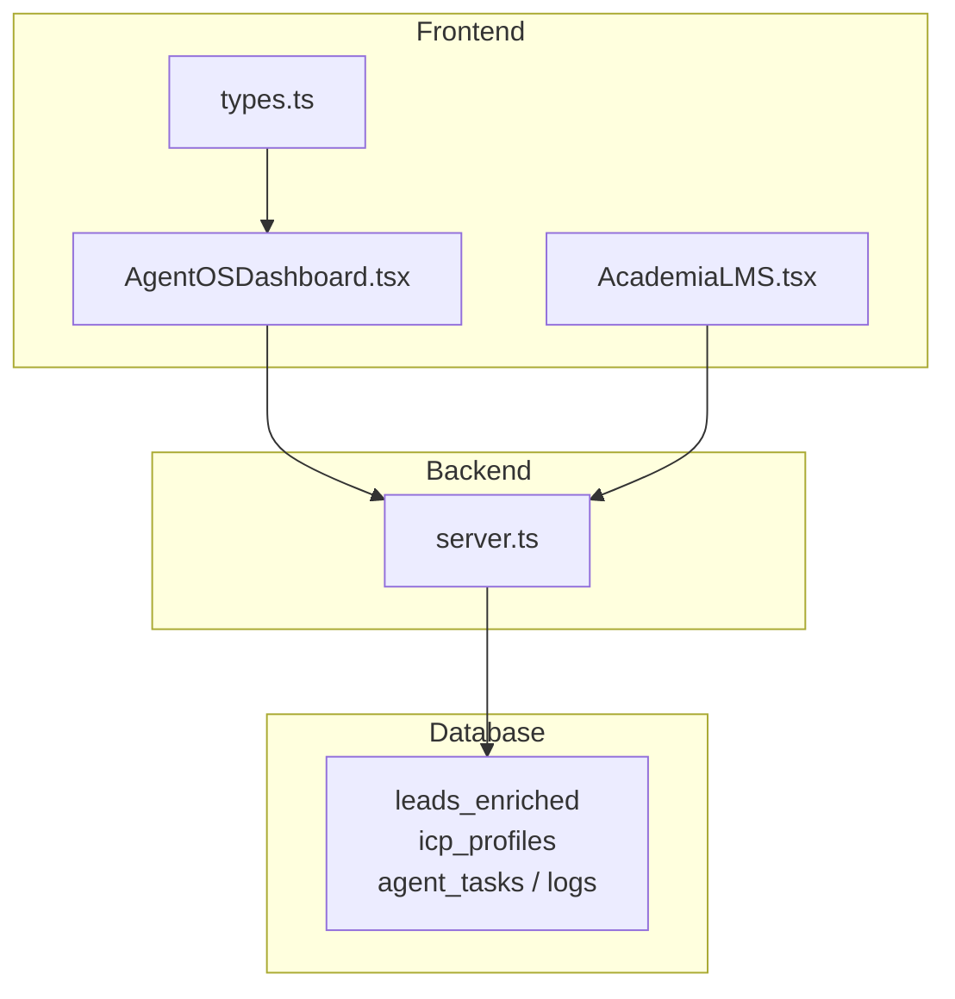
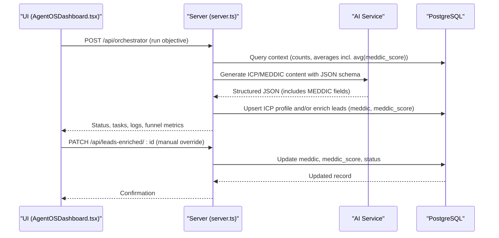
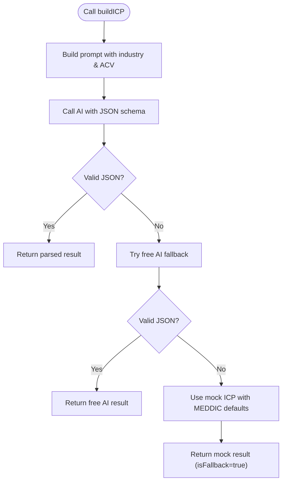
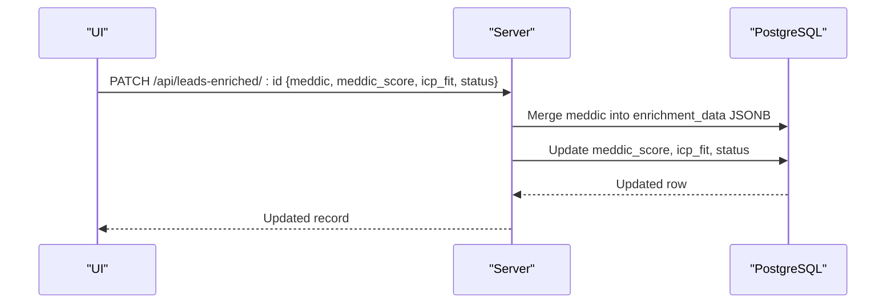
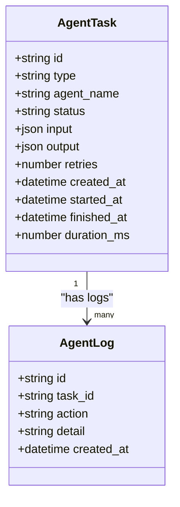
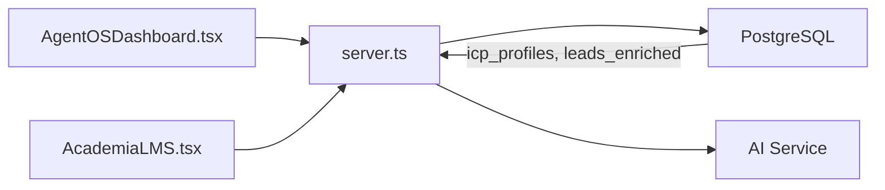

# MEDDIC Scoring System

<cite>
**Referenced Files in This Document**
- [server.ts](file://server.ts)
- [types.ts](file://src/types.ts)
- [AgentOSDashboard.tsx](file://src/components/crm-full/AgentOSDashboard.tsx)
- [AcademiaLMS.tsx](file://src/components/Academia/AcademiaLMS.tsx)
</cite>

## Table of Contents
1. [Introduction](#introduction)
2. [Project Structure](#project-structure)
3. [Core Components](#core-components)
4. [Architecture Overview](#architecture-overview)
5. [Detailed Component Analysis](#detailed-component-analysis)
6. [Dependency Analysis](#dependency-analysis)
7. [Performance Considerations](#performance-considerations)
8. [Troubleshooting Guide](#troubleshooting-guide)
9. [Conclusion](#conclusion)
10. [Appendices](#appendices)

## Introduction
This document explains the MEDDIC lead scoring methodology as implemented in the system and how it is automated through AI agents, persisted in the database, and surfaced in dashboards. It covers each MEDDIC dimension (Metrics, Economic Buyer, Decision Criteria, Decision Process, Identify Pain, Champion), the data model used to store scores and enrichment, the API endpoints for manual overrides, and the orchestration flow that powers automatic collection and scoring. It also provides guidance on customizing criteria, interpreting results, and using scores for pipeline prioritization.

## Project Structure
The MEDDIC implementation spans server-side logic, type definitions, and UI components:
- Server orchestrates ICP generation with AI, persists ICP profiles and lead enrichment including MEDDIC fields, and exposes APIs for reading/updating leads and viewing agent tasks/logs.
- Frontend types define CRM deal structures including a nested MEDDIC object.
- Dashboards display agent task queues, status, and funnel metrics, enabling operators to monitor and trigger scoring workflows.

**Diagram sources**
- [server.ts:3800-3867](file://server.ts#L3800-L3867)
- [types.ts:139-162](file://src/types.ts#L139-L162)
- [AgentOSDashboard.tsx:143-225](file://src/components/crm-full/AgentOSDashboard.tsx#L143-L225)
- [AcademiaLMS.tsx:1100-1165](file://src/components/Academia/AcademiaLMS.tsx#L1100-L1165)

**Section sources**
- [server.ts:3800-3867](file://server.ts#L3800-L3867)
- [types.ts:139-162](file://src/types.ts#L139-L162)
- [AgentOSDashboard.tsx:143-225](file://src/components/crm-full/AgentOSDashboard.tsx#L143-L225)
- [AcademiaLMS.tsx:1100-1165](file://src/components/Academia/AcademiaLMS.tsx#L1100-L1165)

## Core Components
- ICP Builder with AI: Generates Ideal Customer Profile including MEDDIC fields via an AI call with structured JSON schema; falls back to free AI or mock data when needed.
- Lead Enrichment and MEDDIC Storage: Stores per-lead MEDDIC details and numeric score fields (meddic_score, icp_fit) in a dedicated table; supports partial updates.
- Agent Orchestration and Observability: Exposes endpoints to create, query, and update agent tasks and logs; dashboard displays running agents and recent decisions.
- Types and UI: CRM deal type includes a meddic object; Kanban UI shows AI scoring status and actions to qualify leads and move them to proposal stage.

Key responsibilities:
- AI-driven ICP/MEDDIC content generation
- Persisting MEDDIC attributes and scores
- Providing APIs for manual override and history tracking
- Displaying operational visibility and user actions

**Section sources**
- [server.ts:2686-2765](file://server.ts#L2686-L2765)
- [server.ts:3836-3850](file://server.ts#L3836-L3850)
- [server.ts:4644-4674](file://server.ts#L4644-L4674)
- [server.ts:3889-3996](file://server.ts#L3889-L3996)
- [types.ts:139-162](file://src/types.ts#L139-L162)
- [AgentOSDashboard.tsx:54-76](file://src/components/crm-full/AgentOSDashboard.tsx#L54-L76)
- [AcademiaLMS.tsx:1100-1165](file://src/components/Academia/AcademiaLMS.tsx#L1100-L1165)

## Architecture Overview
The system uses an AI-first approach to generate MEDDIC-aligned ICPs and enrich leads. Scores and MEDDIC attributes are stored in Postgres and exposed via REST endpoints. Operators can manually adjust scores and MEDDIC fields, while the dashboard monitors agent tasks and logs.

**Diagram sources**
- [server.ts:4977-5004](file://server.ts#L4977-L5004)
- [server.ts:2686-2765](file://server.ts#L2686-L2765)
- [server.ts:4644-4674](file://server.ts#L4644-L4674)
- [AgentOSDashboard.tsx:186-205](file://src/components/crm-full/AgentOSDashboard.tsx#L186-L205)

## Detailed Component Analysis

### MEDDIC Dimensions and Data Model
- Metrics: Business outcomes tied to value realization; stored as text in the meddic.metrics field and may influence scoring indirectly via ICP fit and domain rules.
- Economic Buyer: The decision-maker with budget authority; captured in meddic.economicBuyer.
- Decision Criteria: Evaluation factors such as cost, integration, support; captured in meddic.decisionCriteria.
- Decision Process: Steps from demo to contract; captured in meddic.decisionProcess.
- Identify Pain: Key pains and discovery questions; captured in meddic.identifyPain.
- Champion: Internal advocate; captured in meddic.champion.

Storage:
- Per-lead MEDDIC attributes are merged into a JSONB enrichment_data.meddic object.
- Numeric meddic_score and icp_fit are stored as integer columns for quick filtering and aggregation.
- ICP profiles include a score_weights JSONB field to support future weighted scoring customization.

Type definition:
- CRMDeal includes a meddic object with the six MEDDIC fields.

**Section sources**
- [server.ts:3836-3850](file://server.ts#L3836-L3850)
- [server.ts:4644-4674](file://server.ts#L4644-L4674)
- [types.ts:139-162](file://src/types.ts#L139-L162)

### AI-Driven ICP and MEDDIC Generation
- Endpoint triggers an AI call with a strict JSON schema that includes all MEDDIC fields.
- Fallback chain: primary AI → free AI → mock ICP with predefined MEDDIC values.
- Output is parsed and returned to the caller; downstream processes can persist ICP and use it to enrich leads.

**Diagram sources**
- [server.ts:2686-2765](file://server.ts#L2686-L2765)

**Section sources**
- [server.ts:2686-2765](file://server.ts#L2686-L2765)

### Lead Enrichment and Manual Override
- GET /api/leads-enriched returns enriched leads with company context.
- PATCH /api/leads-enriched/:id allows updating:
  - meddic (merged into enrichment_data JSONB)
  - meddic_score (numeric score)
  - icp_fit (numeric fit score)
  - status (pipeline stage)
- This endpoint enables manual overrides and audit-friendly updates.

**Diagram sources**
- [server.ts:4644-4674](file://server.ts#L4644-L4674)

**Section sources**
- [server.ts:4625-4674](file://server.ts#L4625-L4674)

### Orchestrator Context and Pipeline Aggregates
- The orchestrator endpoint gathers real-time context including counts by status and aggregate averages of meddic_score and fit_score across leads.
- These aggregates inform AI prompts and dashboards for prioritization and insights.

**Section sources**
- [server.ts:4977-5004](file://server.ts#L4977-L5004)

### Agent Tasks and History Tracking
- Endpoints to create, list, and update agent tasks and logs provide full observability.
- Dashboard lists recent tasks, statuses, errors, durations, and costs, enabling operators to track scoring runs and interventions.

**Diagram sources**
- [server.ts:3889-3996](file://server.ts#L3889-L3996)
- [AgentOSDashboard.tsx:37-50](file://src/components/crm-full/AgentOSDashboard.tsx#L37-L50)

**Section sources**
- [server.ts:3889-3996](file://server.ts#L3889-L3996)
- [AgentOSDashboard.tsx:37-50](file://src/components/crm-full/AgentOSDashboard.tsx#L37-L50)

### UI Actions for MEDDIC Scoring Workflow
- Kanban view shows leads with AI scoring status and buttons to “Qualify with AI” and “Send Proposal.”
- This reflects the manual-to-automated workflow where users can trigger qualification and progression based on MEDDIC-informed scoring.

**Section sources**
- [AcademiaLMS.tsx:1100-1165](file://src/components/Academia/AcademiaLMS.tsx#L1100-L1165)

## Dependency Analysis
- Frontend depends on server APIs for live data and updates.
- Server depends on PostgreSQL for persistence and on AI services for content generation.
- ICP profiles and lead enrichment are tightly coupled: ICP informs scoring weights and MEDDIC expectations; leads carry meddic_score and enrichment_data.meddic.

**Diagram sources**
- [server.ts:3800-3867](file://server.ts#L3800-L3867)
- [AgentOSDashboard.tsx:143-225](file://src/components/crm-full/AgentOSDashboard.tsx#L143-L225)
- [AcademiaLMS.tsx:1100-1165](file://src/components/Academia/AcademiaLMS.tsx#L1100-L1165)

**Section sources**
- [server.ts:3800-3867](file://server.ts#L3800-L3867)
- [AgentOSDashboard.tsx:143-225](file://src/components/crm-full/AgentOSDashboard.tsx#L143-L225)
- [AcademiaLMS.tsx:1100-1165](file://src/components/Academia/AcademiaLMS.tsx#L1100-L1165)

## Performance Considerations
- AI calls can be slow and rate-limited; the system implements fallbacks to free AI and mock responses to maintain responsiveness.
- Database queries are indexed for common filters (status, agent_name, created_at); ensure similar indexing for leads_enriched fields if querying by meddic_score or icp_fit frequently.
- Batch operations should be considered for bulk enrichment to reduce round-trips.

[No sources needed since this section provides general guidance]

## Troubleshooting Guide
- AI unavailability: If GEMINI_API_KEY is not configured, orchestrator returns an error indicating AI is unavailable. Ensure environment variables are set correctly.
- Invalid AI response: When AI fails to return valid JSON, the system tries free AI fallback and then mock ICP. Check logs for parsing errors and validate prompts/schema.
- Missing MEDDIC fields: If meddic fields are absent in enrichment_data, verify the PATCH payload and merging logic. Confirm that meddic_score and icp_fit are updated as expected.
- Task failures: Inspect agent_tasks and agent_logs for error messages and retry counts. Use the dashboard to filter failed tasks and review details.

**Section sources**
- [server.ts:4977-5004](file://server.ts#L4977-L5004)
- [server.ts:2686-2765](file://server.ts#L2686-L2765)
- [server.ts:3889-3996](file://server.ts#L3889-L3996)

## Conclusion
The MEDDIC scoring system integrates AI-generated ICPs and MEDDIC attributes with robust persistence and observability. While explicit weighted scoring formulas are not hard-coded, the architecture supports customization via score_weights in ICP profiles and numeric meddic_score/icp_fit fields. Operators can manually override scores and MEDDIC details, and the dashboard provides visibility into agent activity and pipeline health. This design enables scalable, auditable, and customizable MEDDIC-based lead prioritization.

[No sources needed since this section summarizes without analyzing specific files]

## Appendices

### Customizing Scoring Criteria
- Define or update score_weights in icp_profiles to reflect business priorities (e.g., weight economicBuyer strength higher than champion presence).
- Adjust meddic_score and icp_fit via PATCH /api/leads-enriched/:id to reflect manual assessments or post-call findings.
- Use medric dimensions in enrichment_data.meddic to capture qualitative signals that inform future weighting adjustments.

**Section sources**
- [server.ts:3836-3850](file://server.ts#L3836-L3850)
- [server.ts:4644-4674](file://server.ts#L4644-L4674)

### Interpreting Score Results
- meddic_score: Numeric indicator of MEDDIC readiness; higher values suggest stronger alignment with MEDDIC criteria.
- icp_fit: Numeric indicator of Ideal Customer Profile fit; higher values indicate better match to target segments.
- enrichment_data.meddic: Qualitative details for each MEDDIC dimension; useful for diagnosing gaps and coaching sales teams.

**Section sources**
- [server.ts:4644-4674](file://server.ts#L4644-L4674)

### Using Scores for Pipeline Prioritization
- Filter leads by meddic_score and icp_fit to prioritize high-potential opportunities.
- Combine with status to focus on leads in early stages with strong MEDDIC signals.
- Use orchestrator aggregates (avg(meddic_score), avg(fit_score)) to monitor overall pipeline health and trends.

**Section sources**
- [server.ts:4977-5004](file://server.ts#L4977-L5004)