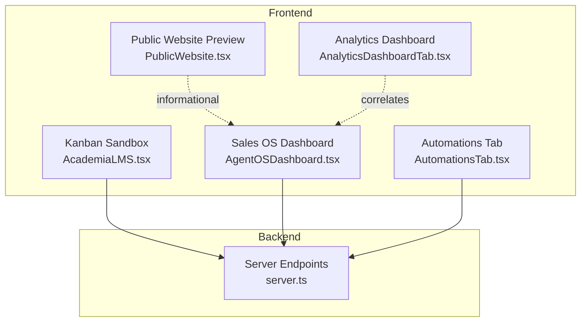
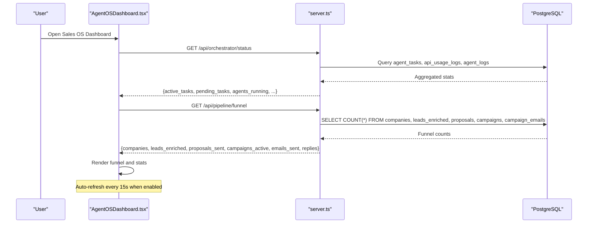
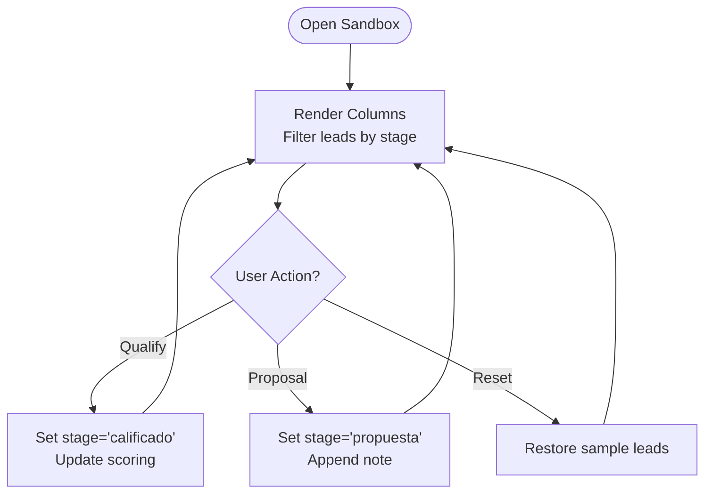
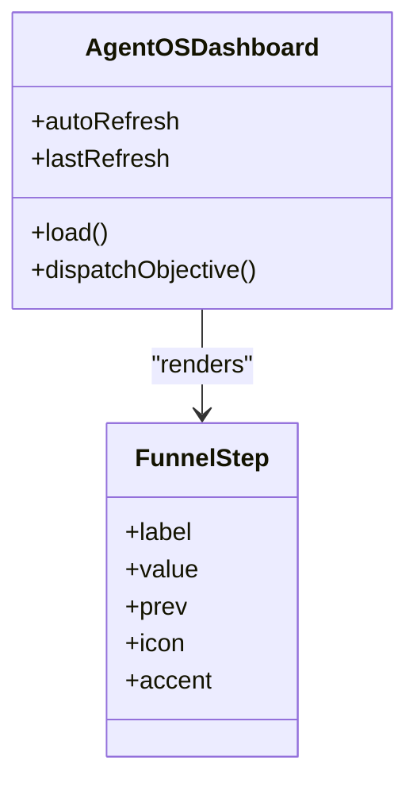
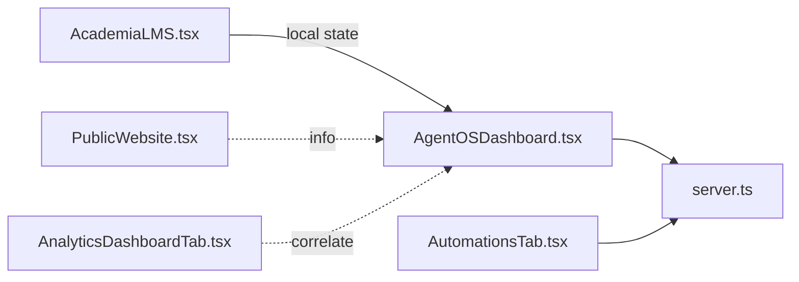

# Pipeline Visualization

<cite>
**Referenced Files in This Document**
- [AgentOSDashboard.tsx](file://src/components/crm-full/AgentOSDashboard.tsx)
- [AcademiaLMS.tsx](file://src/components/Academia/AcademiaLMS.tsx)
- [PublicWebsite.tsx](file://src/components/PublicWebsite.tsx)
- [AnalyticsDashboardTab.tsx](file://src/components/AnalyticsDashboardTab.tsx)
- [AutomationsTab.tsx](file://src/components/AutomationsTab.tsx)
- [server.ts](file://server.ts)
</cite>

## Table of Contents
1. Introduction
2. Project Structure
3. Core Components
4. Architecture Overview
5. Detailed Component Analysis
6. Dependency Analysis
7. Performance Considerations
8. Troubleshooting Guide
9. Conclusion
10. Appendices

## Introduction
This document explains the sales pipeline visualization system implemented in the application. It covers:
- Kanban-style interface for managing deal stages and moving leads through the sales process
- Real-time updates across team members via live polling
- Pipeline configuration options, custom stage definitions, deal value tracking, and probability calculations
- Examples of creating custom pipelines, setting up automated stage transitions, and generating pipeline reports
- Integration with analytics dashboards and forecasting tools

The system combines a visual Kanban sandbox for training and demos, a production funnel dashboard driven by server-side data, and automation workflows to move deals automatically.

## Project Structure
The pipeline visualization spans multiple components and server endpoints:
- Frontend Kanban sandbox (educational/demo): renders columns and cards, simulates moves and scoring
- Production funnel dashboard: fetches counts from server endpoints and displays conversion steps
- Public website preview: shows a static pipeline illustration and copy describing drag-and-drop behavior
- Analytics dashboard: charts ROI and channel performance that can be correlated with pipeline outcomes
- Automation tab: defines triggers and actions that can transition deals between stages
- Server endpoints: provide funnel metrics and orchestration status used by dashboards

**Diagram sources**
- [AcademiaLMS.tsx](file://src/components/Academia/AcademiaLMS.tsx)
- [AgentOSDashboard.tsx](file://src/components/crm-full/AgentOSDashboard.tsx)
- [PublicWebsite.tsx](file://src/components/PublicWebsite.tsx)
- [AnalyticsDashboardTab.tsx](file://src/components/AnalyticsDashboardTab.tsx)
- [AutomationsTab.tsx](file://src/components/AutomationsTab.tsx)
- [server.ts](file://server.ts)

**Section sources**
- [AcademiaLMS.tsx](file://src/components/Academia/AcademiaLMS.tsx)
- [AgentOSDashboard.tsx](file://src/components/crm-full/AgentOSDashboard.tsx)
- [PublicWebsite.tsx](file://src/components/PublicWebsite.tsx)
- [AnalyticsDashboardTab.tsx](file://src/components/AnalyticsDashboardTab.tsx)
- [AutomationsTab.tsx](file://src/components/AutomationsTab.tsx)
- [server.ts](file://server.ts)

## Core Components
- Kanban Sandbox (AcademiaLMS.tsx)
  - Renders three columns: New Leads, Qualified by AI, Proposal Sent
  - Cards show lead name, details, and AI scoring
  - Buttons simulate qualification and proposal generation, moving cards between stages
  - Reset button restores initial sample data
- Sales OS Dashboard (AgentOSDashboard.tsx)
  - Displays a conversion funnel: Companies → Enriched Leads → Proposals → Campaigns → Emails Sent → Replies
  - Auto-refreshes every 15 seconds when enabled
  - Shows active tasks, costs, tokens, and recent logs
- Public Website Preview (PublicWebsite.tsx)
  - Visualizes a five-stage pipeline and mentions drag-and-drop between stages
- Analytics Dashboard (AnalyticsDashboardTab.tsx)
  - Charts ROI trends and channel conversion rates; useful for correlating pipeline outcomes
- Automations Tab (AutomationsTab.tsx)
  - Defines workflows with triggers and actions that can create opportunities and move leads into pipeline stages

**Section sources**
- [AcademiaLMS.tsx](file://src/components/Academia/AcademiaLMS.tsx)
- [AgentOSDashboard.tsx](file://src/components/crm-full/AgentOSDashboard.tsx)
- [PublicWebsite.tsx](file://src/components/PublicWebsite.tsx)
- [AnalyticsDashboardTab.tsx](file://src/components/AnalyticsDashboardTab.tsx)
- [AutomationsTab.tsx](file://src/components/AutomationsTab.tsx)

## Architecture Overview
The pipeline visualization is powered by a combination of local UI state (for demo/sandbox) and server-driven metrics (for production dashboards). The backend exposes endpoints that aggregate counts from database tables and return them to the frontend.

**Diagram sources**
- [AgentOSDashboard.tsx](file://src/components/crm-full/AgentOSDashboard.tsx)
- [server.ts](file://server.ts)

## Detailed Component Analysis

### Kanban Sandbox: AcademiaLMS.tsx
- Columns and stages
  - Stages are defined inline: "nuevo", "calificado", "propuesta"
  - Each column filters and renders cards belonging to its stage
- Card interactions
  - “Qualify with AI” sets stage to "calificado" and updates scoring text
  - “Move to Proposal” sets stage to "propuesta" and appends a note about automated proposal
  - Reset restores a predefined set of sample leads
- Data model
  - Lead objects include id, name, stage, details, and scoring
- Real-time behavior
  - Updates are immediate within the component’s local state; no server calls are made in this sandbox

**Diagram sources**
- [AcademiaLMS.tsx](file://src/components/Academia/AcademiaLMS.tsx)

**Section sources**
- [AcademiaLMS.tsx](file://src/components/Academia/AcademiaLMS.tsx)

### Sales OS Dashboard: AgentOSDashboard.tsx
- Funnel rendering
  - Uses a reusable FunnelStep component to display each stage count and conversion percentage
  - Fetches funnel data from /api/pipeline/funnel
- Live updates
  - Polls /api/orchestrator/status and /api/pipeline/funnel on mount
  - Auto-refresh interval of 15 seconds when enabled
- Task queue and logs
  - Displays recent tasks and logs fetched from /api/agent/tasks and orchestrator status

**Diagram sources**
- [AgentOSDashboard.tsx](file://src/components/crm-full/AgentOSDashboard.tsx)

**Section sources**
- [AgentOSDashboard.tsx](file://src/components/crm-full/AgentOSDashboard.tsx)

### Public Website Preview: PublicWebsite.tsx
- Static pipeline visualization
  - Five stages: Prospect, Contacted, Proposal, Negotiation, Won
  - Caption indicates drag-and-drop between stages
- Purpose
  - Demonstrates expected UX and messaging for pipeline management

**Section sources**
- [PublicWebsite.tsx](file://src/components/PublicWebsite.tsx)

### Analytics Dashboard: AnalyticsDashboardTab.tsx
- Charts
  - ROI trend area chart by channel
  - Channel conversion bar chart
- Use cases
  - Correlate pipeline outcomes with marketing channels
  - Forecast revenue based on historical ROI trends

**Section sources**
- [AnalyticsDashboardTab.tsx](file://src/components/AnalyticsDashboardTab.tsx)

### Automations Tab: AutomationsTab.tsx
- Workflow blocks
  - Triggers (e.g., new lead captured), Actions (e.g., send WhatsApp, create opportunity), Conditions (future)
- Example workflow
  - Captures lead, qualifies with AI, sends welcome message, creates CRM opportunity and moves lead to prospect stage
- Testing
  - Simulate execution and report success

**Section sources**
- [AutomationsTab.tsx](file://src/components/AutomationsTab.tsx)

## Dependency Analysis
- Frontend dependencies
  - AgentOSDashboard depends on server endpoints for live metrics
  - AcademiaLMS uses local state for demo interactions
  - PublicWebsite provides static visuals and descriptive text
  - AnalyticsDashboard provides complementary metrics
  - AutomationsTab defines workflows that conceptually drive stage transitions
- Backend dependencies
  - server.ts aggregates counts from PostgreSQL tables for funnel metrics
  - Orchestrator status endpoint aggregates task and usage metrics

**Diagram sources**
- [AgentOSDashboard.tsx](file://src/components/crm-full/AgentOSDashboard.tsx)
- [AcademiaLMS.tsx](file://src/components/Academia/AcademiaLMS.tsx)
- [PublicWebsite.tsx](file://src/components/PublicWebsite.tsx)
- [AnalyticsDashboardTab.tsx](file://src/components/AnalyticsDashboardTab.tsx)
- [AutomationsTab.tsx](file://src/components/AutomationsTab.tsx)
- [server.ts](file://server.ts)

**Section sources**
- [AgentOSDashboard.tsx](file://src/components/crm-full/AgentOSDashboard.tsx)
- [server.ts](file://server.ts)

## Performance Considerations
- Real-time polling
  - Auto-refresh interval is 15 seconds; consider adjusting based on user needs and server load
- Batch queries
  - Funnel endpoint performs parallel queries for efficiency; ensure indexes exist on frequently filtered fields
- Local vs server state
  - Sandbox uses local state to avoid network overhead; production dashboards rely on server metrics for accuracy

[No sources needed since this section provides general guidance]

## Troubleshooting Guide
- Dashboard not updating
  - Verify auto-refresh toggle is enabled
  - Check network requests to /api/orchestrator/status and /api/pipeline/funnel
- Empty funnel counts
  - Ensure database tables have data (companies, leads_enriched, proposals, campaigns, campaign_emails)
- Errors fetching data
  - Inspect error messages returned by server endpoints
  - Confirm environment variables and database connectivity

**Section sources**
- [AgentOSDashboard.tsx](file://src/components/crm-full/AgentOSDashboard.tsx)
- [server.ts](file://server.ts)

## Conclusion
The pipeline visualization system combines an interactive Kanban sandbox for training and a production-grade funnel dashboard backed by server endpoints. Automation workflows enable automatic stage transitions, while analytics dashboards provide insights into ROI and channel performance. Together, these components offer a comprehensive view of the sales pipeline with real-time updates and actionable intelligence.

[No sources needed since this section summarizes without analyzing specific files]

## Appendices

### Creating Custom Pipelines
- Define stages
  - For sandbox: update the stage array in the Kanban renderer
  - For production: extend funnel steps in the dashboard and add corresponding server queries
- Configure columns and cards
  - Adjust card fields (name, details, scoring) to match your data model
- Persist changes
  - Integrate with server endpoints to save stage transitions and metadata

**Section sources**
- [AcademiaLMS.tsx](file://src/components/Academia/AcademiaLMS.tsx)
- [AgentOSDashboard.tsx](file://src/components/crm-full/AgentOSDashboard.tsx)
- [server.ts](file://server.ts)

### Setting Up Automated Stage Transitions
- Create a workflow
  - Add a trigger (e.g., new lead captured)
  - Add actions (e.g., qualify with AI, send outreach, create opportunity)
  - Link actions to stage updates in the CRM
- Test the workflow
  - Use the test feature to simulate execution and verify outcomes

**Section sources**
- [AutomationsTab.tsx](file://src/components/AutomationsTab.tsx)

### Generating Pipeline Reports
- Export funnel metrics
  - Use the funnel endpoint to retrieve counts per stage
- Correlate with analytics
  - Combine funnel data with ROI and channel conversion charts
- Schedule periodic exports
  - Implement cron jobs or scheduled tasks to generate reports

**Section sources**
- [server.ts](file://server.ts)
- [AnalyticsDashboardTab.tsx](file://src/components/AnalyticsDashboardTab.tsx)

### Deal Value Tracking and Probability Calculations
- Track deal values
  - Store deal amount and currency in lead/opportunity records
- Calculate weighted pipeline value
  - Multiply deal value by stage probability (e.g., 10% for New, 30% for Qualified, 60% for Proposal, 90% for Negotiation, 100% for Won)
- Display probabilities
  - Show stage-based probabilities in Kanban cards and funnel tooltips

[No sources needed since this section provides general guidance]

### Real-Time Updates Across Team Members
- Enable auto-refresh
  - Keep polling active to reflect changes made by other users
- Broadcast updates (optional enhancement)
  - Implement WebSocket or server-sent events for instant synchronization

[No sources needed since this section provides general guidance]