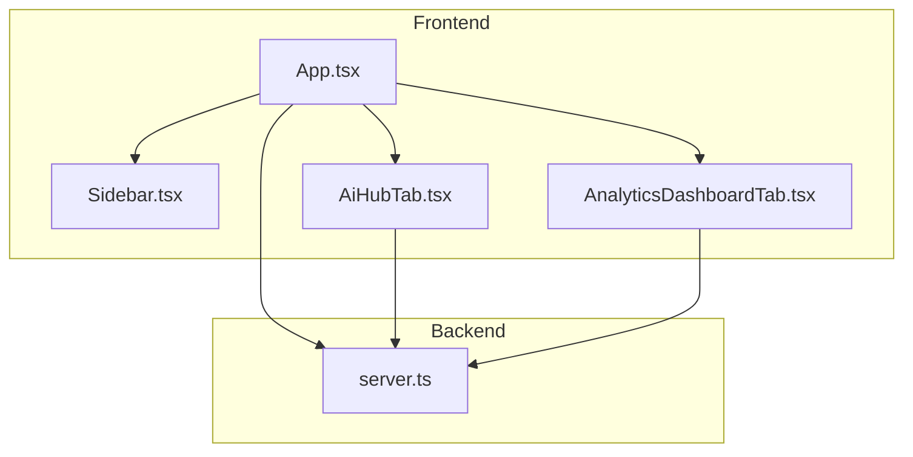
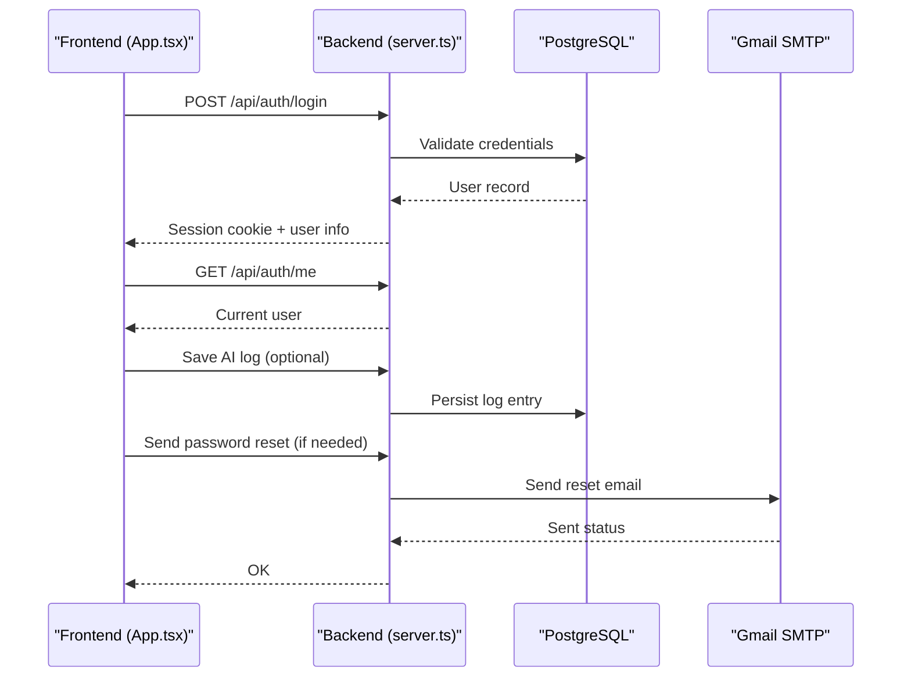
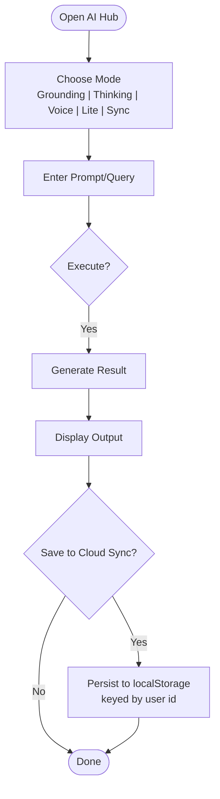
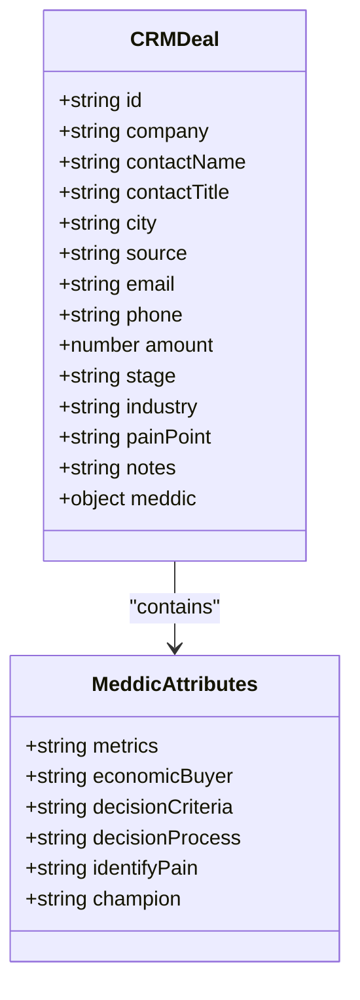
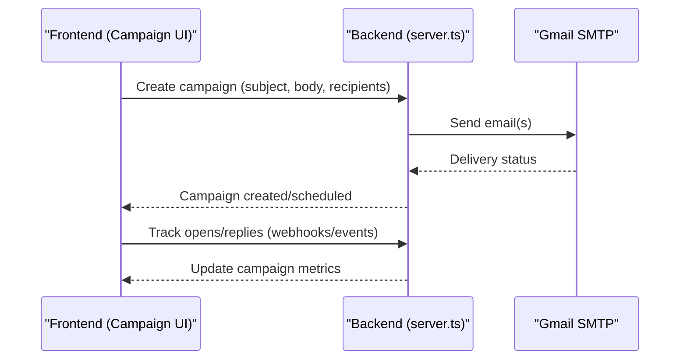
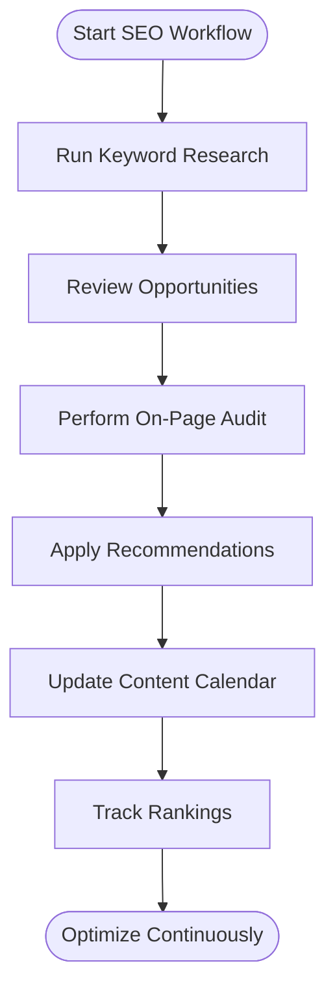
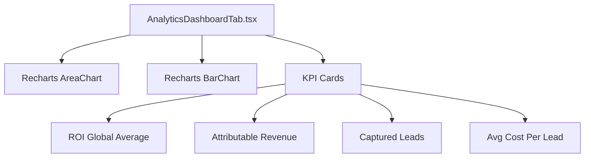
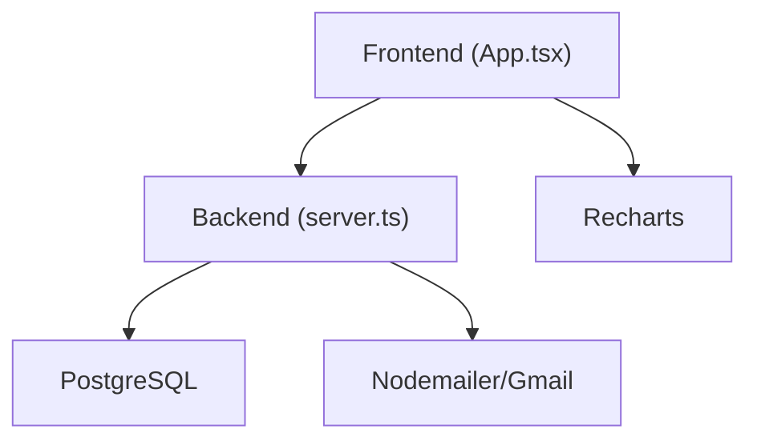

# Core Features

<cite>
**Referenced Files in This Document**
- [README.md](file://README.md)
- [package.json](file://package.json)
- [server.ts](file://server.ts)
- [src/main.tsx](file://src/main.tsx)
- [src/App.tsx](file://src/App.tsx)
- [src/types.ts](file://src/types.ts)
- [src/components/AiHubTab.tsx](file://src/components/AiHubTab.tsx)
- [src/components/AnalyticsDashboardTab.tsx](file://src/components/AnalyticsDashboardTab.tsx)
- [src/components/Sidebar.tsx](file://src/components/Sidebar.tsx)
</cite>

## Table of Contents
1. [Introduction](#introduction)
2. [Project Structure](#project-structure)
3. [Core Components](#core-components)
4. [Architecture Overview](#architecture-overview)
5. [Detailed Component Analysis](#detailed-component-analysis)
6. [Dependency Analysis](#dependency-analysis)
7. [Performance Considerations](#performance-considerations)
8. [Troubleshooting Guide](#troubleshooting-guide)
9. [Conclusion](#conclusion)
10. [Appendices](#appendices)

## Introduction
This document explains the core business features of the ClientumLatam platform, focusing on:
- AI Hub interface for strategy generation and content creation
- CRM system with MEDDIC lead scoring and pipeline visualization
- Marketing automation with email campaigns and multi-channel outreach
- SEO tools for keyword research and on-page audits
- Analytics dashboard with real-time metrics and performance reporting

It also outlines user workflows, data models, and integration points between features to help both technical and non-technical users understand how the platform operates end-to-end.

## Project Structure
ClientumLatam is a React-based application with an Express server providing authentication, session management, and integrations (e.g., SMTP). The frontend organizes features as tabs rendered by App.tsx, while the backend exposes REST endpoints for auth and other services.

**Diagram sources**
- [src/App.tsx:1-177](file://src/App.tsx#L1-L177)
- [src/components/Sidebar.tsx:1-317](file://src/components/Sidebar.tsx#L1-L317)
- [src/components/AiHubTab.tsx:1-565](file://src/components/AiHubTab.tsx#L1-L565)
- [src/components/AnalyticsDashboardTab.tsx:1-149](file://src/components/AnalyticsDashboardTab.tsx#L1-L149)
- [server.ts:1-800](file://server.ts#L1-L800)

**Section sources**
- [README.md:1-21](file://README.md#L1-L21)
- [package.json:1-64](file://package.json#L1-L64)
- [src/main.tsx:1-11](file://src/main.tsx#L1-L11)
- [src/App.tsx:1-177](file://src/App.tsx#L1-L177)

## Core Components
- AI Hub Tab: Provides Gemini-powered grounding (search/maps), high-thinking reasoning, low-latency responses, voice conversations, and local cloud sync of logs.
- Analytics Dashboard Tab: Displays ROI trends, channel conversion, and key performance indicators across channels.
- Sidebar: Central navigation grouping features into configuration, audience, prospecting, AI/content, campaigns, SEO, and analytics.
- App Router: Renders feature tabs based on active state and manages authentication flow.

Key responsibilities:
- AI Hub orchestrates prompts and displays results; persists logs locally per user.
- Analytics Dashboard renders charts and KPIs using Recharts.
- Sidebar defines feature taxonomy and quick access actions.
- App coordinates tab switching and session checks.

**Section sources**
- [src/components/AiHubTab.tsx:1-565](file://src/components/AiHubTab.tsx#L1-L565)
- [src/components/AnalyticsDashboardTab.tsx:1-149](file://src/components/AnalyticsDashboardTab.tsx#L1-L149)
- [src/components/Sidebar.tsx:1-317](file://src/components/Sidebar.tsx#L1-L317)
- [src/App.tsx:1-177](file://src/App.tsx#L1-L177)

## Architecture Overview
The platform follows a client-server architecture:
- Frontend (React + Vite) renders UI components and calls backend APIs.
- Backend (Express) handles authentication, sessions, and external integrations (SMTP, optional Neon Auth).
- Data persistence uses PostgreSQL via pg pool; sessions can be stored in Postgres or memory fallback.

**Diagram sources**
- [src/App.tsx:1-177](file://src/App.tsx#L1-L177)
- [server.ts:266-392](file://server.ts#L266-L392)
- [server.ts:750-791](file://server.ts#L750-L791)

## Detailed Component Analysis

### AI Hub Interface
The AI Hub provides multiple modes:
- Search & Maps Grounding: Simulated grounded queries returning verified insights.
- High Thinking Mode: Structured strategic analysis output.
- Voice & Live Conversations: Real-time voice interaction UI.
- Low-Latency Flash Lite: Fast response generation for chat-like interactions.
- Database Cloud Sync: Local storage keyed by user ID to persist logs.

User workflow:
- Select mode and input prompt/query.
- Execute action to generate results.
- Optionally save results to local storage under user-specific key.
- View saved history in the sync tab.

**Diagram sources**
- [src/components/AiHubTab.tsx:1-565](file://src/components/AiHubTab.tsx#L1-L565)

**Section sources**
- [src/components/AiHubTab.tsx:1-565](file://src/components/AiHubTab.tsx#L1-L565)

### CRM System with MEDDIC Lead Scoring and Pipeline Visualization
Data model highlights:
- CRMDeal includes fields for company, contact details, amount, stage, industry, pain point, notes, and MEDDIC attributes.
- Types define stages such as leads, contacted, meeting, proposal, closed.

Pipeline visualization:
- Kanban-style board groups deals by stage.
- MEDDIC scoring supports prioritization and qualification.

Integration points:
- Prospecting modules feed leads into CRM.
- Campaigns and automations update deal stages and metadata.

**Diagram sources**
- [src/types.ts:139-162](file://src/types.ts#L139-L162)

**Section sources**
- [src/types.ts:139-162](file://src/types.ts#L139-L162)

### Marketing Automation with Email Campaigns and Multi-Channel Outreach
Data model highlights:
- EmailContact tracks subscriber status, list membership, tags, and dates.
- EmailCampaignItem captures campaign metadata, recipients, open/click rates, and sent date.
- AutomationWorkflow defines triggers, statuses, and conversion metrics.

Backend integration:
- SMTP transport configured via environment variables for sending emails.
- Authentication endpoints support login/register flows that may trigger automated sequences.

User workflow:
- Create or select templates.
- Build campaigns targeting lists or segments.
- Automate follow-ups based on triggers (opens, replies, bounces).
- Monitor performance through analytics dashboards.

**Diagram sources**
- [server.ts:133-143](file://server.ts#L133-L143)
- [src/types.ts:99-136](file://src/types.ts#L99-L136)

**Section sources**
- [src/types.ts:99-136](file://src/types.ts#L99-L136)
- [server.ts:133-143](file://server.ts#L133-L143)

### SEO Tools for Keyword Research and On-Page Audits
Feature scope:
- Keyword research module identifies opportunities with search volume, difficulty, and intent.
- On-page audit generates recommendations and content ideas.
- Topic mapping and rank tracking support authority building and performance monitoring.

Data model highlights:
- SeoAuditResult includes score, keyword opportunities, on-page recommendations, and content ideas.

User workflow:
- Run keyword research to discover targets.
- Perform on-page audits to get actionable improvements.
- Plan content calendar based on findings.
- Track rankings over time.

**Diagram sources**
- [src/types.ts:69-79](file://src/types.ts#L69-L79)

**Section sources**
- [src/types.ts:69-79](file://src/types.ts#L69-L79)

### Analytics Dashboard with Real-Time Metrics and Performance Reporting
Capabilities:
- ROI trend charts across channels (email, social, SEO).
- Channel comparison showing conversion rates and cost per lead.
- KPI cards for global ROI, attributable revenue, captured leads, and average cost per lead.

User workflow:
- Select timeframe (1M, 3M, 6M, 1Y).
- Review aggregated metrics and charts.
- Drill down into channel performance for optimization decisions.

**Diagram sources**
- [src/components/AnalyticsDashboardTab.tsx:1-149](file://src/components/AnalyticsDashboardTab.tsx#L1-L149)

**Section sources**
- [src/components/AnalyticsDashboardTab.tsx:1-149](file://src/components/AnalyticsDashboardTab.tsx#L1-L149)

## Dependency Analysis
Key dependencies:
- React and DOM rendering via main.tsx.
- Express server handling routes and middleware.
- PostgreSQL for persistent data and session storage.
- Nodemailer for SMTP email delivery.
- Recharts for charting in analytics.

**Diagram sources**
- [src/main.tsx:1-11](file://src/main.tsx#L1-L11)
- [src/App.tsx:1-177](file://src/App.tsx#L1-L177)
- [server.ts:1-800](file://server.ts#L1-L800)
- [src/components/AnalyticsDashboardTab.tsx:1-149](file://src/components/AnalyticsDashboardTab.tsx#L1-L149)

**Section sources**
- [package.json:1-64](file://package.json#L1-L64)
- [server.ts:1-800](file://server.ts#L1-L800)

## Performance Considerations
- Use low-latency AI responses for interactive features to improve UX.
- Cache frequently accessed data where possible (e.g., static charts data).
- Optimize database queries and use connection pooling for scalability.
- Avoid heavy synchronous operations in the UI thread; offload to background tasks when feasible.

[No sources needed since this section provides general guidance]

## Troubleshooting Guide
Common issues and resolutions:
- Authentication failures: Ensure SESSION_SECRET and DATABASE_URL are configured; verify bcrypt hashing and session store behavior.
- Email delivery problems: Check SMTP_USER and SMTP_PASS; confirm Gmail SMTP settings and network connectivity.
- Session persistence: If Postgres session store fails, fallback to memory store; monitor logs for errors.
- AI Hub sync: Verify user session exists before saving logs; check localStorage availability and permissions.

**Section sources**
- [server.ts:107-125](file://server.ts#L107-L125)
- [server.ts:266-392](file://server.ts#L266-L392)
- [server.ts:750-791](file://server.ts#L750-L791)
- [src/components/AiHubTab.tsx:126-170](file://src/components/AiHubTab.tsx#L126-L170)

## Conclusion
ClientumLatam integrates AI-driven content generation, CRM with MEDDIC scoring, marketing automation, SEO tools, and analytics into a cohesive platform. The modular architecture enables clear separation of concerns, robust authentication, and extensible integrations. Users can streamline strategy creation, lead qualification, campaign execution, and performance measurement within a single interface.

[No sources needed since this section summarizes without analyzing specific files]

## Appendices
- Environment setup: Configure GEMINI_API_KEY, DATABASE_URL, SESSION_SECRET, SMTP_USER, SMTP_PASS, and optional NEON_AUTH_BASE_URL.
- Development commands: Install dependencies, set up environment, run dev server.

**Section sources**
- [README.md:1-21](file://README.md#L1-L21)
- [package.json:1-64](file://package.json#L1-L64)