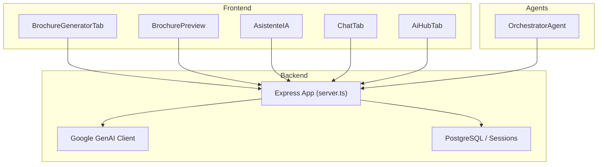
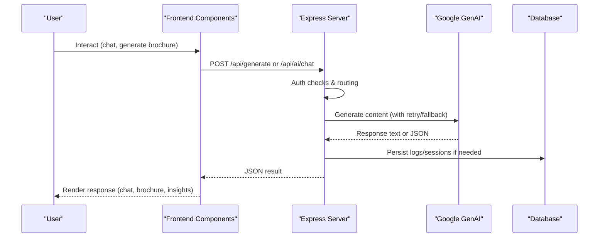
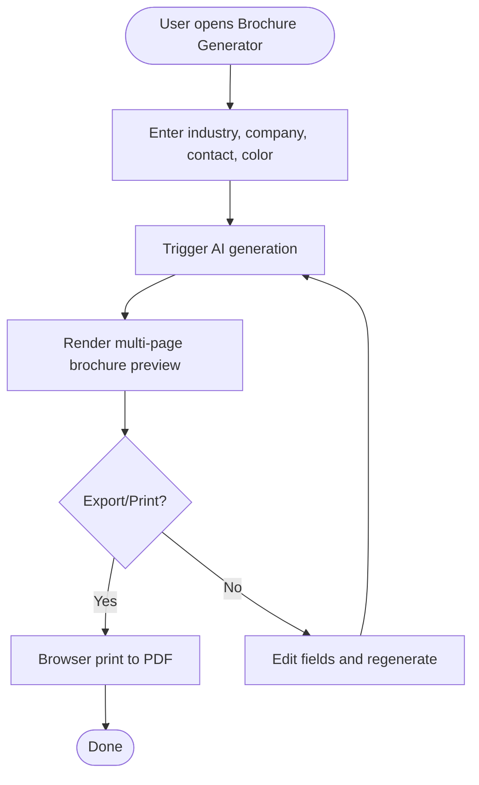
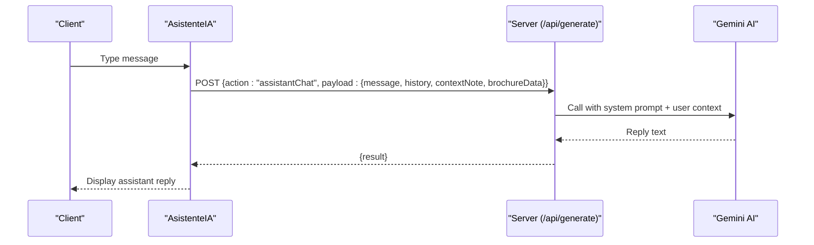
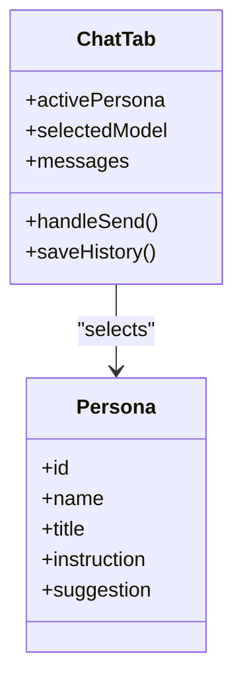
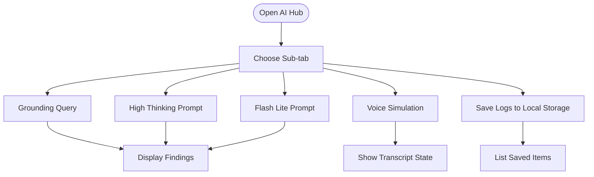
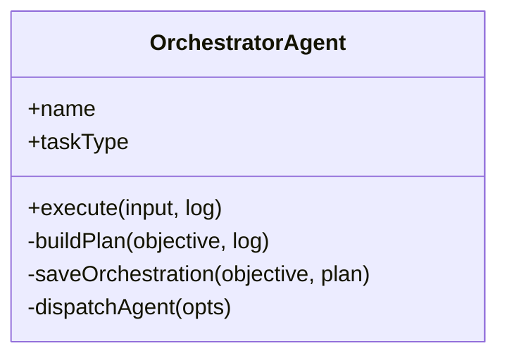
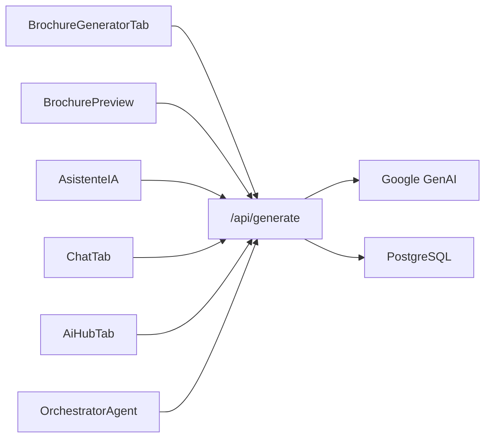

# Content Generation & Personalization

<cite>
**Referenced Files in This Document**
- [server.ts](file://server.ts)
- [api/index.ts](file://api/index.ts)
- [src/components/BrochureGeneratorTab.tsx](file://src/components/BrochureGeneratorTab.tsx)
- [src/components/BrochurePreview.tsx](file://src/components/BrochurePreview.tsx)
- [src/components/AsistenteIA.tsx](file://src/components/AsistenteIA.tsx)
- [src/components/ChatTab.tsx](file://src/components/ChatTab.tsx)
- [src/components/AiHubTab.tsx](file://src/components/AiHubTab.tsx)
- [src/agents/orchestrator.ts](file://src/agents/orchestrator.ts)
- [src/agents/index.ts](file://src/agents/index.ts)
- [src/types.ts](file://src/types.ts)
</cite>

## Table of Contents
1. [Introduction](#introduction)
2. [Project Structure](#project-structure)
3. [Core Components](#core-components)
4. [Architecture Overview](#architecture-overview)
5. [Detailed Component Analysis](#detailed-component-analysis)
6. [Dependency Analysis](#dependency-analysis)
7. [Performance Considerations](#performance-considerations)
8. [Troubleshooting Guide](#troubleshooting-guide)
9. [Conclusion](#conclusion)
10. [Appendices](#appendices)

## Introduction
This document explains the AI-powered content generation system that powers brochure creation, chatbot responses, and personalized marketing materials. It covers prompt engineering techniques, content templates, brand voice customization, multi-format output generation, chatbot integration for lead capture and qualification, conversation flow design, and CRM data synchronization. It also includes examples of automated content repurposing from blog posts to social media content and personalized email sequences.

## Project Structure
The application is a React-based dashboard with an Express server providing AI endpoints. Key areas:
- Frontend components for brochure generation, preview, chat interfaces, and AI hub features
- Server-side API routes handling authentication, Gemini AI calls, and content generation
- Agent orchestration layer for planning and dispatching specialized tasks
- Shared types defining data models used across UI and backend flows

**Diagram sources**
- [server.ts](file://server.ts)
- [src/components/BrochureGeneratorTab.tsx](file://src/components/BrochureGeneratorTab.tsx)
- [src/components/BrochurePreview.tsx](file://src/components/BrochurePreview.tsx)
- [src/components/AsistenteIA.tsx](file://src/components/AsistenteIA.tsx)
- [src/components/ChatTab.tsx](file://src/components/ChatTab.tsx)
- [src/components/AiHubTab.tsx](file://src/components/AiHubTab.tsx)
- [src/agents/orchestrator.ts](file://src/agents/orchestrator.ts)

**Section sources**
- [server.ts](file://server.ts)
- [api/index.ts](file://api/index.ts)
- [src/components/BrochureGeneratorTab.tsx](file://src/components/BrochureGeneratorTab.tsx)
- [src/components/BrochurePreview.tsx](file://src/components/BrochurePreview.tsx)
- [src/components/AsistenteIA.tsx](file://src/components/AsistenteIA.tsx)
- [src/components/ChatTab.tsx](file://src/components/ChatTab.tsx)
- [src/components/AiHubTab.tsx](file://src/components/AiHubTab.tsx)
- [src/agents/orchestrator.ts](file://src/agents/orchestrator.ts)
- [src/agents/index.ts](file://src/agents/index.ts)
- [src/types.ts](file://src/types.ts)

## Core Components
- Brochure Generator Tab: User inputs industry, company, contact, and accent color; triggers AI-assisted brochure generation and export/print.
- Brochure Preview: Renders a multi-page brochure with interactive elements (CRM Kanban, AI chat simulator), pricing calculator, and theme customization.
- Asistente IA: A contextual chat panel that sends messages to the backend assistant endpoint, injecting current section context and optional brochure data.
- Chat Tab: Multi-agent chat interface with persona selection and model selection; persists history per persona in local storage.
- AI Hub Tab: Demonstrates grounding, high-thinking mode, low-latency responses, voice simulation, and cloud sync logging.
- Orchestrator Agent: Parses natural-language objectives into structured plans and dispatches specialized agent tasks.

**Section sources**
- [src/components/BrochureGeneratorTab.tsx](file://src/components/BrochureGeneratorTab.tsx)
- [src/components/BrochurePreview.tsx](file://src/components/BrochurePreview.tsx)
- [src/components/AsistenteIA.tsx](file://src/components/AsistenteIA.tsx)
- [src/components/ChatTab.tsx](file://src/components/ChatTab.tsx)
- [src/components/AiHubTab.tsx](file://src/components/AiHubTab.tsx)
- [src/agents/orchestrator.ts](file://src/agents/orchestrator.ts)

## Architecture Overview
The system uses a client-server architecture where frontend components call Express endpoints. The server integrates Google Gemini via the GenAI SDK, with robust fallbacks and retries. Authentication and session management are handled server-side. Agents can be orchestrated to plan and execute multi-step workflows.

**Diagram sources**
- [server.ts](file://server.ts)
- [src/components/AsistenteIA.tsx](file://src/components/AsistenteIA.tsx)
- [src/components/ChatTab.tsx](file://src/components/ChatTab.tsx)
- [src/components/BrochureGeneratorTab.tsx](file://src/components/BrochureGeneratorTab.tsx)

## Detailed Component Analysis

### Brochure Creation System
- Inputs: Industry, company name, contact person, accent color.
- Output: Structured brochure data rendered across multiple pages with interactive modules (CRM board, AI chat simulator).
- Brand Voice Customization: Accent colors, themes, and copy tailored by industry prompts.
- Multi-format Output: Print/export PDF via browser print; HTML rendering for preview.

**Diagram sources**
- [src/components/BrochureGeneratorTab.tsx](file://src/components/BrochureGeneratorTab.tsx)
- [src/components/BrochurePreview.tsx](file://src/components/BrochurePreview.tsx)

**Section sources**
- [src/components/BrochureGeneratorTab.tsx](file://src/components/BrochureGeneratorTab.tsx)
- [src/components/BrochurePreview.tsx](file://src/components/BrochurePreview.tsx)

### Chatbot Integration and Lead Capture
- Contextual Assistant: Sends user message, history, and optional brochure data to backend assistant endpoint.
- Conversation Flow: Maintains role-based messages, timestamps, and suggested prompts; supports reset and auto-scroll.
- Lead Qualification: Uses persona instructions and structured prompts to guide conversations toward MEDDIC-style qualification and outreach.

**Diagram sources**
- [src/components/AsistenteIA.tsx](file://src/components/AsistenteIA.tsx)
- [server.ts](file://server.ts)

**Section sources**
- [src/components/AsistenteIA.tsx](file://src/components/AsistenteIA.tsx)
- [server.ts](file://server.ts)

### Chat Tab (Multi-Agent Conversations)
- Personas: CMO, Sales Specialist (SDR), SEO & Copywriter, Automation Architect.
- Models: Selection among different Gemini models for speed vs reasoning depth.
- Persistence: LocalStorage keyed by persona ID; clear history option.

**Diagram sources**
- [src/components/ChatTab.tsx](file://src/components/ChatTab.tsx)

**Section sources**
- [src/components/ChatTab.tsx](file://src/components/ChatTab.tsx)

### AI Hub Features
- Grounding: Search and Maps grounding queries with simulated results.
- High Thinking Mode: Complex reasoning outputs.
- Low-Latency Flash Lite: Fast responses for quick interactions.
- Voice Simulation: Live audio conversation UI state.
- Cloud Sync: Local storage logs keyed by user ID.

**Diagram sources**
- [src/components/AiHubTab.tsx](file://src/components/AiHubTab.tsx)

**Section sources**
- [src/components/AiHubTab.tsx](file://src/components/AiHubTab.tsx)

### Orchestrator Agent
- Purpose: Convert natural-language objectives into structured execution plans and dispatch specialized agents.
- Plan Building: Uses Gemini to produce JSON steps with dependencies and inputs.
- Dispatch: Creates tasks via backend endpoints and tracks success/failure.

**Diagram sources**
- [src/agents/orchestrator.ts](file://src/agents/orchestrator.ts)

**Section sources**
- [src/agents/orchestrator.ts](file://src/agents/orchestrator.ts)
- [src/agents/index.ts](file://src/agents/index.ts)

## Dependency Analysis
- Frontend components depend on server endpoints for AI generation and chat responses.
- Server depends on Google GenAI SDK and PostgreSQL for sessions/auth.
- Orchestrator agent interacts with server endpoints to persist plans and dispatch tasks.
- Types define shared structures for chat messages, brochures, and campaigns.

**Diagram sources**
- [server.ts](file://server.ts)
- [src/components/BrochureGeneratorTab.tsx](file://src/components/BrochureGeneratorTab.tsx)
- [src/components/BrochurePreview.tsx](file://src/components/BrochurePreview.tsx)
- [src/components/AsistenteIA.tsx](file://src/components/AsistenteIA.tsx)
- [src/components/ChatTab.tsx](file://src/components/ChatTab.tsx)
- [src/components/AiHubTab.tsx](file://src/components/AiHubTab.tsx)
- [src/agents/orchestrator.ts](file://src/agents/orchestrator.ts)

**Section sources**
- [server.ts](file://server.ts)
- [src/types.ts](file://src/types.ts)

## Performance Considerations
- Model Fallback and Retry: The server implements retry logic and model switching to handle quota limits and transient errors.
- Local Fallbacks: When Gemini is unavailable, structured local responses ensure continuity.
- Local Storage: Chat histories and AI Hub logs are stored locally to reduce server load and improve responsiveness.
- Print Optimization: Browser print-to-PDF leverages native capabilities for efficient brochure export.

[No sources needed since this section provides general guidance]

## Troubleshooting Guide
- Authentication Issues: Ensure session configuration and database connectivity; check roles and tokens.
- Gemini API Errors: Verify API key configuration; monitor fallback behavior and error logs.
- Chat History Not Persisting: Confirm localStorage availability and correct keys per persona.
- Brochure Export Problems: Use browser print dialog; verify CSS styles for print media.

**Section sources**
- [server.ts](file://server.ts)
- [src/components/ChatTab.tsx](file://src/components/ChatTab.tsx)
- [src/components/BrochureGeneratorTab.tsx](file://src/components/BrochureGeneratorTab.tsx)

## Conclusion
The system combines a rich frontend experience with a resilient backend AI pipeline. It supports dynamic brochure generation, contextual chat assistants, multi-agent conversations, and advanced AI features like grounding and high-thinking modes. Robust fallbacks and local persistence ensure reliability and performance.

[No sources needed since this section summarizes without analyzing specific files]

## Appendices

### Prompt Engineering Techniques
- Structured Prompts: Use system prompts to define persona, tone, and output format.
- Context Injection: Include active section labels and brochure data to tailor responses.
- Schema Enforcement: Request JSON responses with defined schemas for consistent parsing.

**Section sources**
- [server.ts](file://server.ts)
- [src/components/AsistenteIA.tsx](file://src/components/AsistenteIA.tsx)

### Content Templates and Brand Voice Customization
- Industry-Specific Templates: Tailor brochure sections, chatbot features, and services based on selected industry.
- Theme and Colors: Customize accent colors and visual themes for brand alignment.
- Tone and Language: Use regional language preferences (e.g., Argentine Spanish voseo) in prompts.

**Section sources**
- [src/components/BrochureGeneratorTab.tsx](file://src/components/BrochureGeneratorTab.tsx)
- [src/components/BrochurePreview.tsx](file://src/components/BrochurePreview.tsx)
- [server.ts](file://server.ts)

### Multi-Format Output Generation
- PDF Export: Browser print-to-PDF for brochures.
- HTML Rendering: Interactive previews with embedded modules.
- JSON Responses: Structured data for downstream processing.

**Section sources**
- [src/components/BrochureGeneratorTab.tsx](file://src/components/BrochureGeneratorTab.tsx)
- [server.ts](file://server.ts)

### Automated Content Repurposing Examples
- Blog to Social Media: Generate hooks and short-form content using low-latency models.
- Email Sequences: Create personalized outreach emails based on prospect data and industry context.
- WhatsApp Messages: Draft follow-up messages aligned with sales methodologies.

**Section sources**
- [src/components/AiHubTab.tsx](file://src/components/AiHubTab.tsx)
- [server.ts](file://server.ts)

### CRM Data Synchronization
- Local Logs: Save AI interactions keyed by user ID for traceability.
- Session Management: Secure sessions with database-backed storage.
- Role-Based Access: Admin-only actions for sensitive operations.

**Section sources**
- [src/components/AiHubTab.tsx](file://src/components/AiHubTab.tsx)
- [server.ts](file://server.ts)