# Email Campaigns

<cite>
**Referenced Files in This Document**
- [server.ts](file://server.ts)
- [App.tsx](file://src/App.tsx)
- [SettingsTab.tsx](file://src/components/SettingsTab.tsx)
- [AutomationsTab.tsx](file://src/components/AutomationsTab.tsx)
- [AcademiaLMS.tsx](file://src/components/Academia/AcademiaLMS.tsx)
- [types.ts](file://src/types.ts)
- [package.json](file://package.json)
- [README.md](file://README.md)
</cite>

## Table of Contents
1. [Introduction](#introduction)
2. [Project Structure](#project-structure)
3. [Core Components](#core-components)
4. [Architecture Overview](#architecture-overview)
5. [Detailed Component Analysis](#detailed-component-analysis)
6. [Dependency Analysis](#dependency-analysis)
7. [Performance Considerations](#performance-considerations)
8. [Troubleshooting Guide](#troubleshooting-guide)
9. [Conclusion](#conclusion)
10. [Appendices](#appendices)

## Introduction
This document explains the email campaign management system implemented in the project. It covers how campaigns are created and tracked, how templates are managed, how audiences are segmented, and how delivery is handled via SMTP or third-party providers. It also details automated sequences, scheduling, A/B testing approaches, CRM lead scoring integration, and personalization using AI-generated content and dynamic fields.

## Project Structure
The email campaign features span UI tabs, server-side data models, and configuration interfaces:
- UI routing for email-related tabs (campaigns, templates, automations, SMTP).
- Server-side schema for campaigns, individual emails, conversations, and ICP profiles.
- Settings interface to configure SMTP credentials and sender domains.
- Automation builder for trigger-action workflows.
- Types that define email contacts, campaigns, and templates.

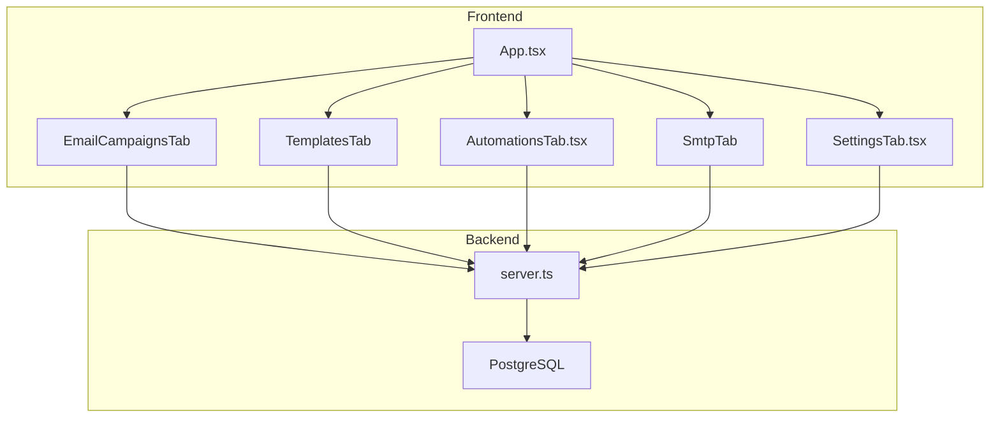

**Diagram sources**
- [App.tsx:1-177](file://src/App.tsx#L1-L177)
- [server.ts:3790-3866](file://server.ts#L3790-L3866)
- [SettingsTab.tsx:76-101](file://src/components/SettingsTab.tsx#L76-L101)

**Section sources**
- [App.tsx:1-177](file://src/App.tsx#L1-L177)
- [server.ts:3790-3866](file://server.ts#L3790-L3866)
- [SettingsTab.tsx:76-101](file://src/components/SettingsTab.tsx#L76-L101)

## Core Components
- Campaigns and Emails Data Model:
  - Campaigns table with type, status, template reference, counts, and ICP filter.
  - campaign_emails table tracking per-lead messages, scheduling, and lifecycle timestamps (sent, opened, replied).
- SMTP Configuration:
  - Environment variables for SMTP user/password and optional SendGrid API key.
  - Sender domain management for DKIM/SPF verification.
- Automation Builder:
  - Visual workflow editor with triggers, actions, and conditions; supports email-triggered flows.
- Types:
  - EmailContact, EmailCampaignItem, EmailTemplateItem, AutomationWorkflow define the shape of data used across UI and backend.

**Section sources**
- [server.ts:3796-3823](file://server.ts#L3796-L3823)
- [server.ts:3825-3849](file://server.ts#L3825-L3849)
- [SettingsTab.tsx:76-101](file://src/components/SettingsTab.tsx#L76-L101)
- [AutomationsTab.tsx:1-194](file://src/components/AutomationsTab.tsx#L1-L194)
- [types.ts:99-136](file://src/types.ts#L99-L136)

## Architecture Overview
The system uses a React frontend with Express/Nodemailer-based backend services. Campaign orchestration leverages PostgreSQL for persistence and can integrate with external email providers through SMTP or API keys. AI capabilities generate outreach content and personalize messages.

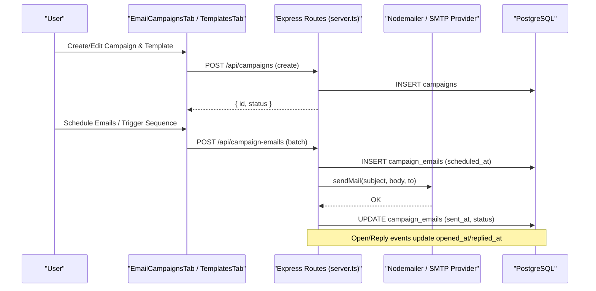

**Diagram sources**
- [server.ts:3796-3823](file://server.ts#L3796-L3823)
- [server.ts:152-174](file://server.ts#L152-L174)
- [package.json:38-39](file://package.json#L38-L39)

## Detailed Component Analysis

### Campaign Creation Workflow
- Create a campaign with name, type (email), status (draft/scheduled/sent), and optional ICP filter.
- Attach a template reference and track leads_count, sent_count, replies_count.
- Generate per-lead entries in campaign_emails with subject/body, scheduling, and lifecycle timestamps.

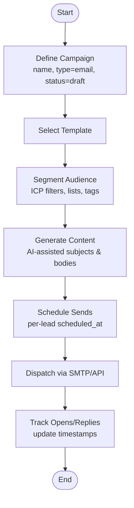

**Section sources**
- [server.ts:3796-3823](file://server.ts#L3796-L3823)

### Template Management
- Templates store name, category, subject, preview text, and HTML content.
- Templates are referenced by campaigns to standardize messaging and branding.
- The UI includes dedicated tabs for managing templates and an HTML builder.

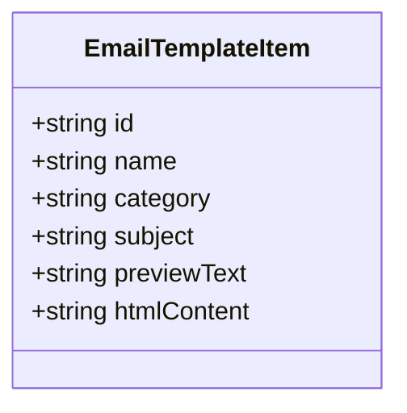

**Diagram sources**
- [types.ts:120-127](file://src/types.ts#L120-L127)

**Section sources**
- [types.ts:120-127](file://src/types.ts#L120-L127)

### Audience Segmentation
- Use ICP profiles and filters stored in JSONB to target specific industries, company sizes, and pain points.
- Contacts have lists and tags for granular segmentation.
- The automation builder can segment based on behavior and pipeline stage.

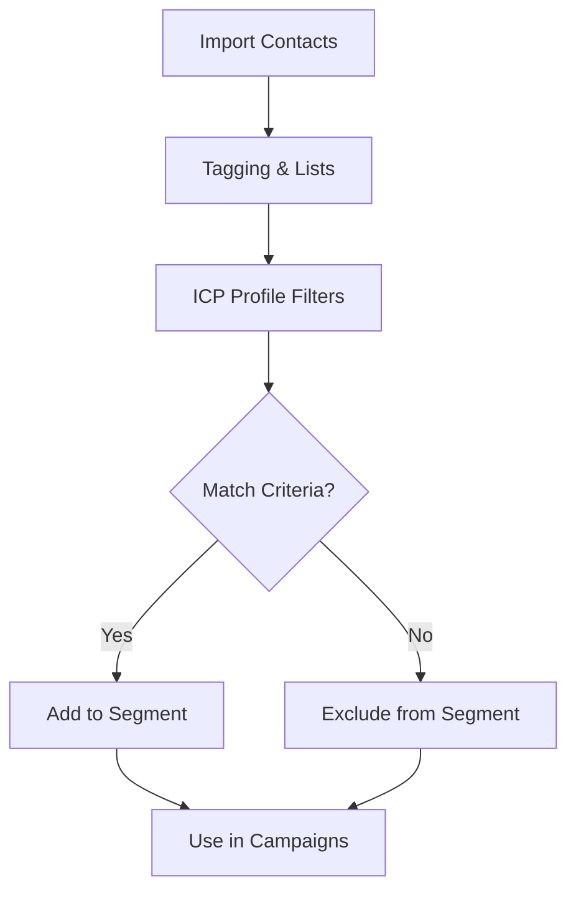

**Section sources**
- [server.ts:3836-3849](file://server.ts#L3836-L3849)
- [types.ts:99-107](file://src/types.ts#L99-L107)
- [AutomationsTab.tsx:1-194](file://src/components/AutomationsTab.tsx#L1-L194)

### Delivery Tracking
- Each campaign_email tracks status, scheduled_at, sent_at, opened_at, and replied_at.
- Conversations table records channel-specific interactions (e.g., email inbound/outbound).
- Metrics like open rate and reply rate can be derived from these timestamps.

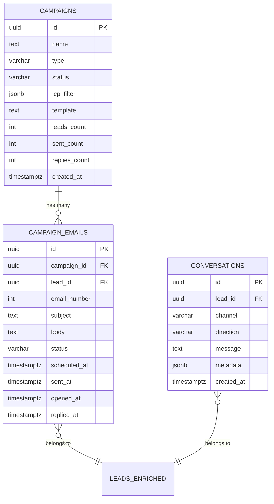

**Diagram sources**
- [server.ts:3796-3823](file://server.ts#L3796-L3823)
- [server.ts:3825-3834](file://server.ts#L3825-L3834)

**Section sources**
- [server.ts:3796-3823](file://server.ts#L3796-L3823)
- [server.ts:3825-3834](file://server.ts#L3825-L3834)

### SMTP Configuration
- Configure SMTP_USER and SMTP_PASS environment variables for outbound delivery.
- Optional SENDGRID_API_KEY for provider-specific analytics and bounce handling.
- Manage sender domains and verify DKIM/SPF for deliverability.

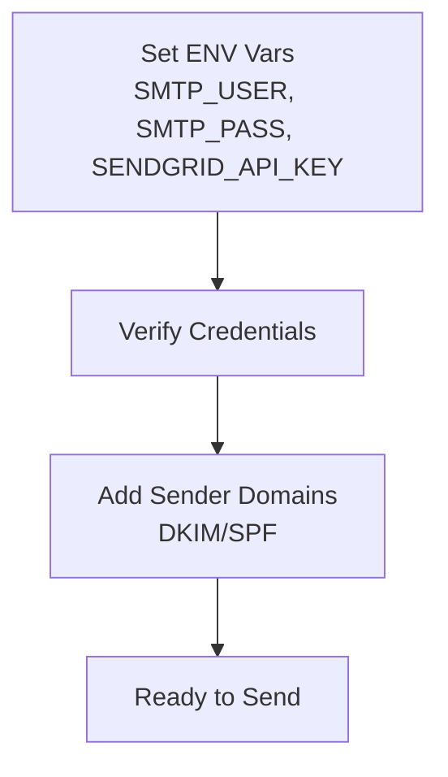

**Section sources**
- [SettingsTab.tsx:76-101](file://src/components/SettingsTab.tsx#L76-L101)
- [package.json:38-39](file://package.json#L38-L39)

### Automated Sequences
- Build workflows with triggers (e.g., new lead captured), actions (send email, create CRM opportunity), and conditions.
- Automations support visual editing and test execution.

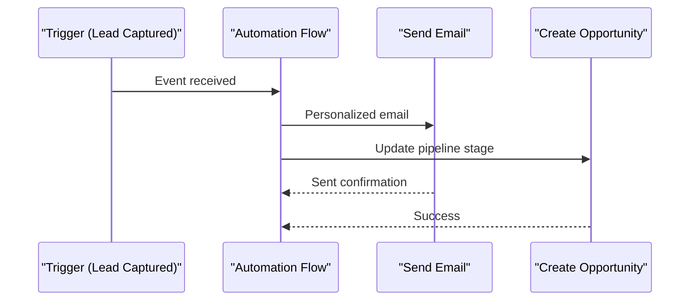

**Section sources**
- [AutomationsTab.tsx:1-194](file://src/components/AutomationsTab.tsx#L1-L194)

### Scheduling Campaigns
- campaign_emails include scheduled_at to queue sends at specific times.
- Batch creation allows per-lead scheduling aligned with time zones and engagement patterns.

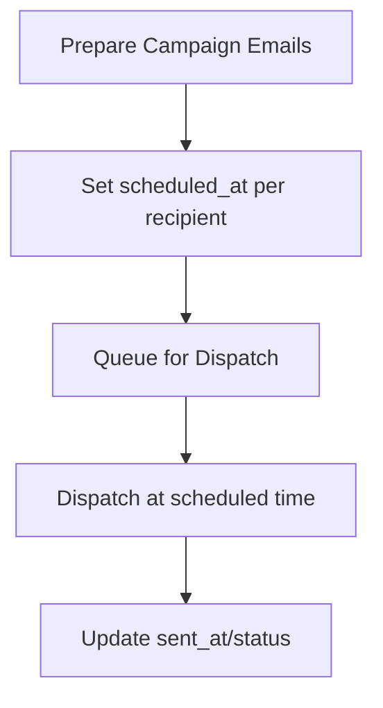

**Section sources**
- [server.ts:3810-3823](file://server.ts#L3810-L3823)

### A/B Testing Setup
- Use multiple templates or variants of subject/body within the same campaign.
- Split audience segments and compare open/click metrics to determine winners.
- Automate follow-up based on variant performance.

[No sources needed since this section provides general guidance]

### CRM Lead Scoring Integration
- ICP profiles store score_weights and raw_json for scoring logic.
- Automation flows can update CRM stages and assign scores based on engagement.

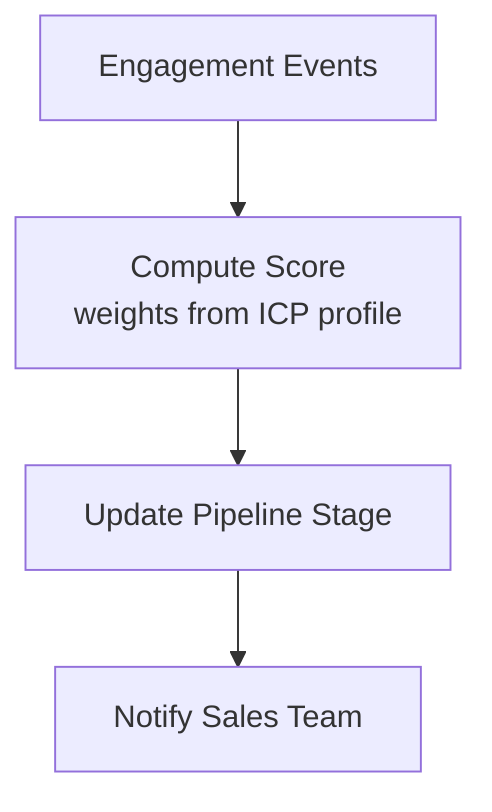

**Section sources**
- [server.ts:3836-3849](file://server.ts#L3836-L3849)

### Email Personalization with AI and Dynamic Fields
- AI generates persuasive outreach content tailored to industry, pain points, and prospect context.
- Dynamic fields ({{nombre}}, {{empresa}}) enable personalization from database values.
- The LMS sandbox demonstrates tone selection and variable substitution.

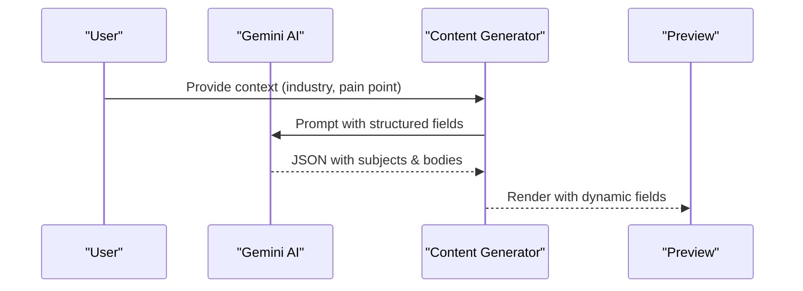

**Section sources**
- [server.ts:2849-2866](file://server.ts#L2849-L2866)
- [AcademiaLMS.tsx:537-547](file://src/components/Academia/AcademiaLMS.tsx#L537-L547)
- [AcademiaLMS.tsx:1178-1225](file://src/components/Academia/AcademiaLMS.tsx#L1178-L1225)

## Dependency Analysis
Key dependencies enabling email functionality:
- Nodemailer for SMTP transport.
- Express for API routes.
- PostgreSQL for persistent storage of campaigns, emails, and conversations.
- React components for UI and configuration.

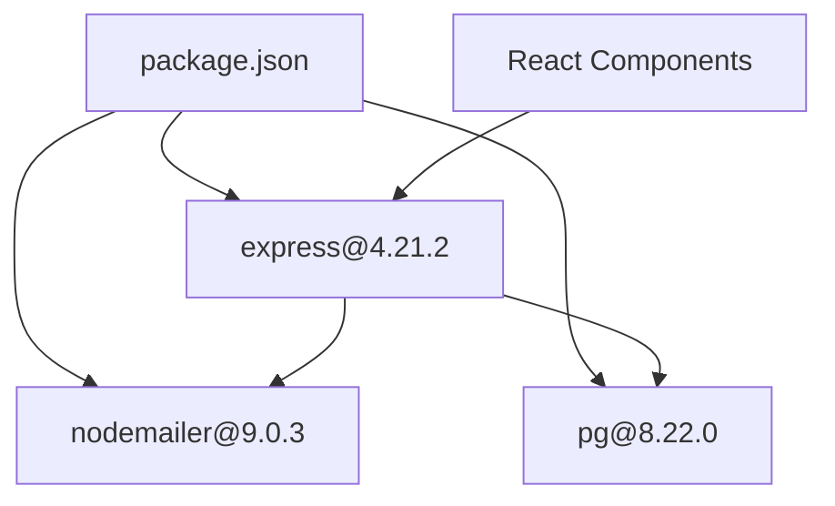

**Diagram sources**
- [package.json:38-39](file://package.json#L38-L39)
- [package.json:31-32](file://package.json#L31-L32)
- [package.json:39-39](file://package.json#L39-L39)

**Section sources**
- [package.json:38-39](file://package.json#L38-L39)
- [package.json:31-32](file://package.json#L31-L32)
- [package.json:39-39](file://package.json#L39-L39)

## Performance Considerations
- Use batch inserts for campaign_emails to reduce DB round-trips.
- Index frequently queried columns (status, created_at, lead_id) as already defined.
- Implement retry logic for failed SMTP sends and handle bounces asynchronously.
- Cache template rendering where possible to minimize repeated processing.

[No sources needed since this section provides general guidance]

## Troubleshooting Guide
- SMTP connectivity issues:
  - Ensure SMTP_USER and SMTP_PASS are set correctly.
  - Validate sender domains and DNS records (DKIM/SPF).
- Deliverability problems:
  - Warm up sending accounts gradually.
  - Avoid spammy language and excessive punctuation.
- AI generation failures:
  - Check Gemini API key availability and fallback behavior.
- Tracking gaps:
  - Confirm open/reply webhooks or pixel tracking are configured with your provider.

**Section sources**
- [SettingsTab.tsx:76-101](file://src/components/SettingsTab.tsx#L76-L101)
- [AcademiaLMS.tsx:108-133](file://src/components/Academia/AcademiaLMS.tsx#L108-L133)
- [server.ts:2849-2866](file://server.ts#L2849-L2866)

## Conclusion
The email campaign system integrates robust data modeling, flexible automation, and AI-driven personalization. With configurable SMTP settings, sender domain management, and detailed tracking, it supports scalable outreach campaigns. The modular architecture enables future enhancements such as advanced A/B testing, richer analytics, and deeper CRM integrations.

## Appendices
- Quick start references:
  - README setup instructions for local development.
  - Package scripts for dev/build/start.

**Section sources**
- [README.md:1-21](file://README.md#L1-L21)
- [package.json:6-14](file://package.json#L6-L14)