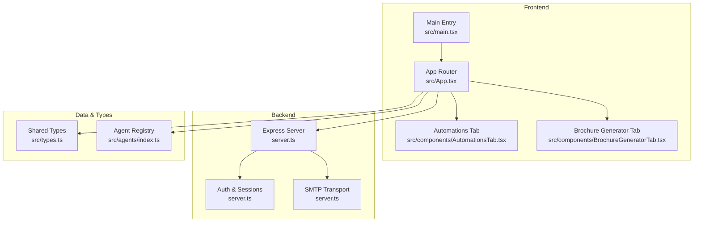
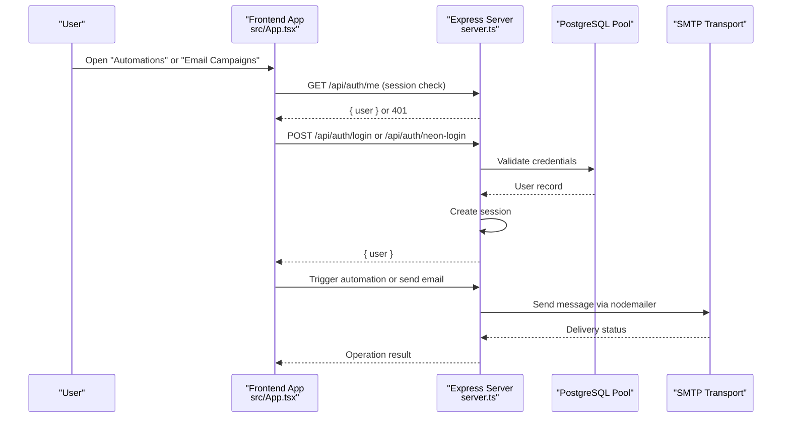
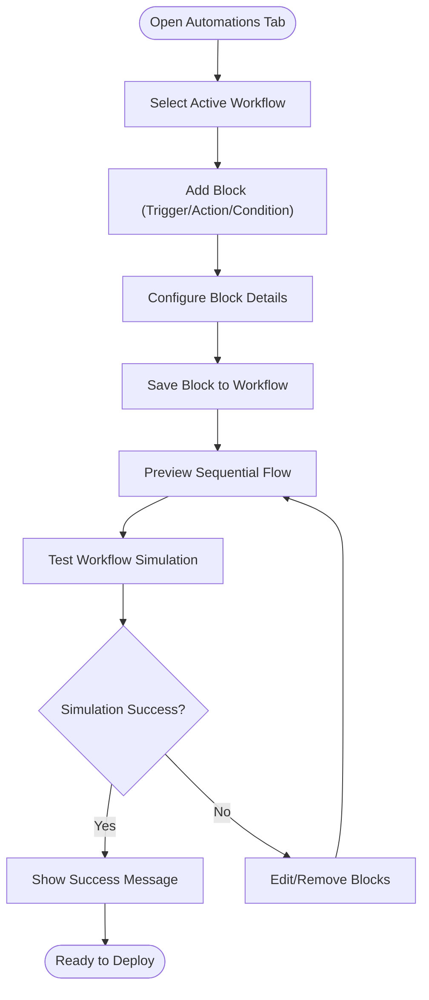
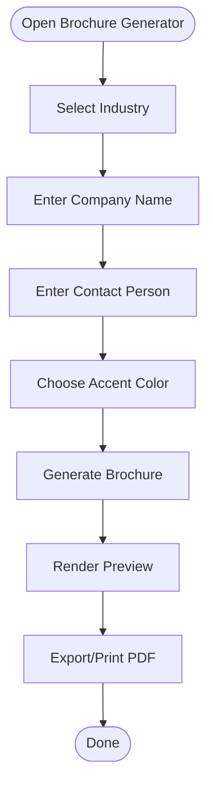
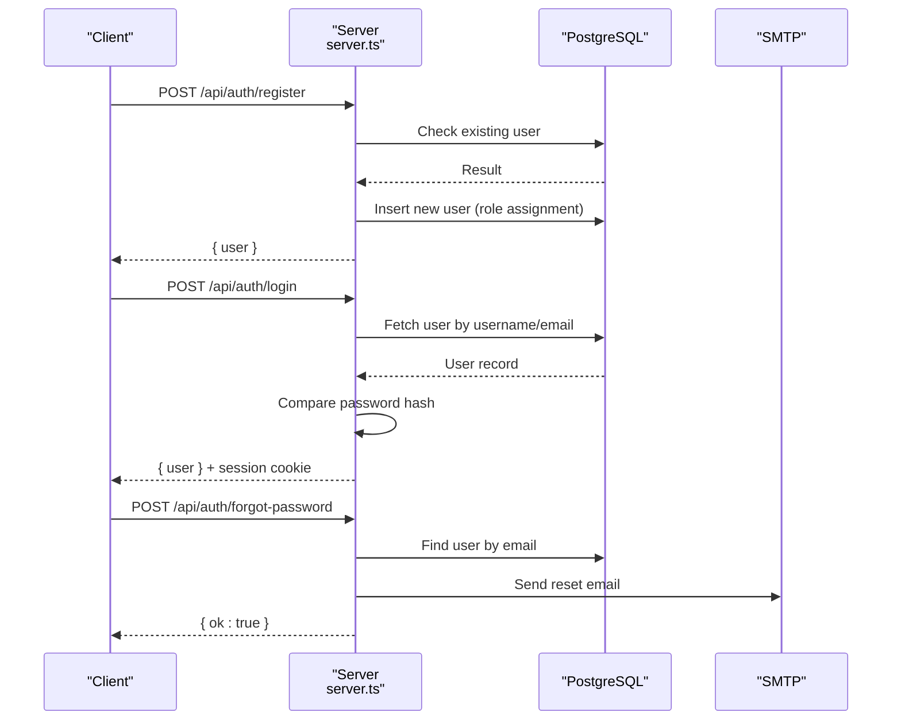
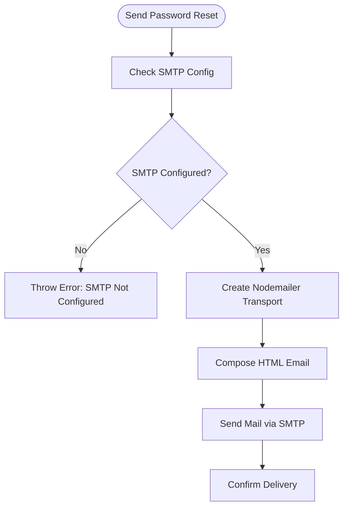
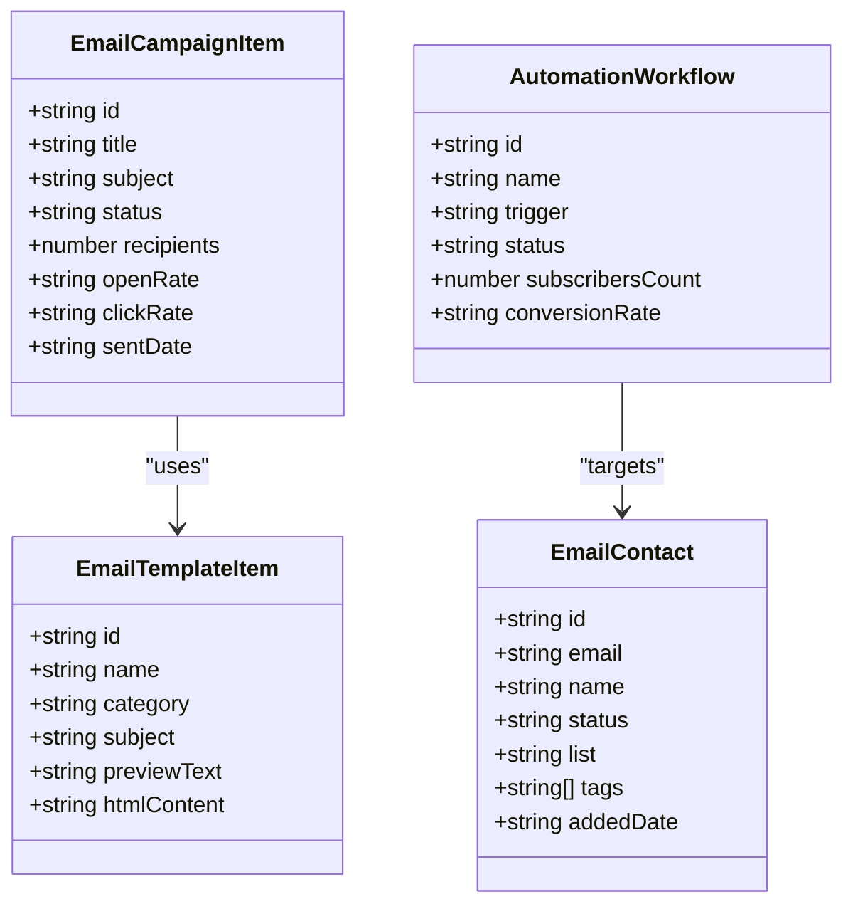
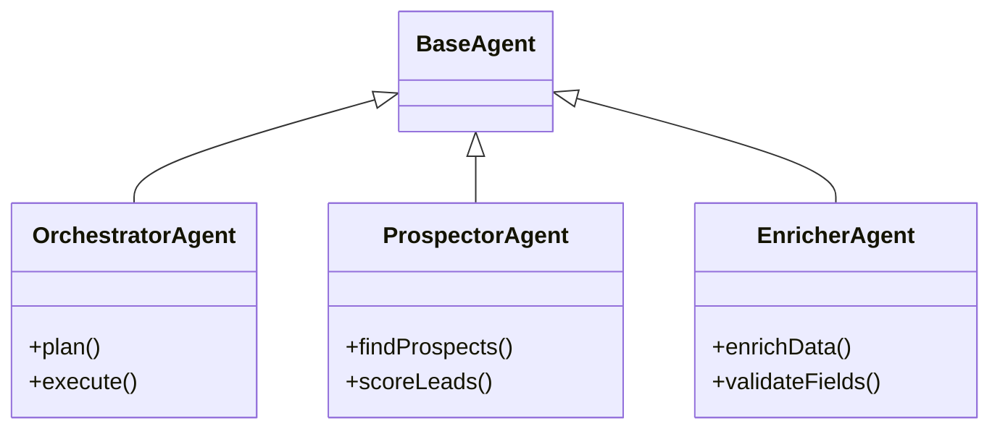
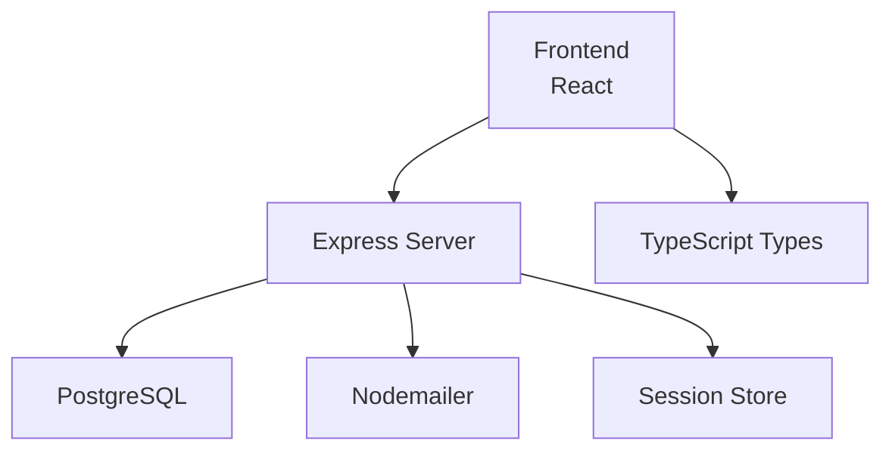

# Marketing Automation

<cite>
**Referenced Files in This Document**
- [README.md](file://README.md)
- [package.json](file://package.json)
- [server.ts](file://server.ts)
- [src/App.tsx](file://src/App.tsx)
- [src/main.tsx](file://src/main.tsx)
- [src/types.ts](file://src/types.ts)
- [src/agents/index.ts](file://src/agents/index.ts)
- [src/components/AutomationsTab.tsx](file://src/components/AutomationsTab.tsx)
- [src/components/BrochureGeneratorTab.tsx](file://src/components/BrochureGeneratorTab.tsx)
</cite>

## Table of Contents
1. [Introduction](#introduction)
2. [Project Structure](#project-structure)
3. [Core Components](#core-components)
4. [Architecture Overview](#architecture-overview)
5. [Detailed Component Analysis](#detailed-component-analysis)
6. [Dependency Analysis](#dependency-analysis)
7. [Performance Considerations](#performance-considerations)
8. [Troubleshooting Guide](#troubleshooting-guide)
9. [Conclusion](#conclusion)
10. [Appendices](#appendices)

## Introduction
This document provides comprehensive documentation for the marketing automation platform with a focus on email campaigns, multi-channel outreach (email, WhatsApp, LinkedIn), and workflow automation. It explains campaign creation workflows, template management, audience segmentation, delivery tracking, automation triggers based on user behavior and calendar events, brochure generation, chatbot integration, and content personalization. The guide includes examples of campaign sequences, automation rules, and performance analytics to help both technical and non-technical users understand and operate the system effectively.

## Project Structure
The application is a React-based frontend with an Express server providing authentication, session management, database connectivity, and email sending via SMTP. Key modules include:
- Frontend entry points and routing across tabs for different features
- Server-side authentication and email transport configuration
- UI components for automations and brochure generation
- Shared types defining data models for campaigns, templates, contacts, and workflows
- Agent registry exposing orchestrator, prospector, and enricher capabilities

**Diagram sources**
- [src/App.tsx:1-177](file://src/App.tsx#L1-L177)
- [src/main.tsx:1-11](file://src/main.tsx#L1-L11)
- [server.ts:1-120](file://server.ts#L1-L120)
- [src/types.ts:1-178](file://src/types.ts#L1-L178)
- [src/agents/index.ts:1-28](file://src/agents/index.ts#L1-L28)

**Section sources**
- [README.md:1-21](file://README.md#L1-L21)
- [package.json:1-64](file://package.json#L1-L64)
- [src/main.tsx:1-11](file://src/main.tsx#L1-L11)
- [src/App.tsx:1-177](file://src/App.tsx#L1-L177)

## Core Components
- Email Campaigns and Templates: Defined by shared types for contacts, campaigns, and templates; used by UI tabs for creating and managing campaigns and templates.
- Automations: Visual workflow builder enabling triggers, actions, and conditions to orchestrate multi-channel outreach.
- Brochure Generator: Personalized brochure creation with industry-specific content and branding options.
- Authentication and Session Management: Secure login/register flows with session storage and optional external identity provider fallback.
- SMTP Integration: Configurable email transport for sending password reset emails and campaign messages.

Key responsibilities:
- App router manages tab navigation and renders feature components.
- Server handles auth endpoints, sessions, and email transport setup.
- Types define consistent data structures across the app.
- Agents expose reusable AI-driven capabilities for prospecting and enrichment.

**Section sources**
- [src/types.ts:99-178](file://src/types.ts#L99-L178)
- [src/components/AutomationsTab.tsx:1-280](file://src/components/AutomationsTab.tsx#L1-L280)
- [src/components/BrochureGeneratorTab.tsx:1-170](file://src/components/BrochureGeneratorTab.tsx#L1-L170)
- [server.ts:131-207](file://server.ts#L131-L207)
- [src/agents/index.ts:1-28](file://src/agents/index.ts#L1-L28)

## Architecture Overview
The platform follows a modular architecture:
- Frontend React app routes to feature tabs and communicates with backend APIs.
- Backend Express server exposes REST endpoints for authentication, session handling, and email operations.
- Data layer uses PostgreSQL via a connection pool; sessions can be persisted to the database.
- Email delivery uses nodemailer configured with SMTP settings.
- AI agents are registered and exposed through a central index for use across features.

**Diagram sources**
- [src/App.tsx:50-88](file://src/App.tsx#L50-L88)
- [server.ts:340-381](file://server.ts#L340-L381)
- [server.ts:683-748](file://server.ts#L683-L748)
- [server.ts:131-143](file://server.ts#L131-L143)

## Detailed Component Analysis

### Automations Workflow Builder
The Automations tab provides a visual builder for creating workflows composed of triggers, actions, and conditions. Users can add blocks, test workflows, and view execution metrics.

Key behaviors:
- Workflow list with selection and status indicators
- Block addition modal supporting trigger/action/condition types
- Sequential block rendering with connectors
- Test simulation button to validate flow logic

**Diagram sources**
- [src/components/AutomationsTab.tsx:1-280](file://src/components/AutomationsTab.tsx#L1-L280)

**Section sources**
- [src/components/AutomationsTab.tsx:1-280](file://src/components/AutomationsTab.tsx#L1-L280)

### Brochure Generator
The Brochure Generator tab allows users to create personalized brochures tailored to specific industries and companies. It supports selecting accent colors, company names, and contact persons, then generates a preview ready for export or printing.

Key behaviors:
- Industry selector influencing content themes
- Company and contact inputs for personalization
- Accent color picker for branding
- Generate action simulating AI optimization
- Print/export functionality

**Diagram sources**
- [src/components/BrochureGeneratorTab.tsx:1-170](file://src/components/BrochureGeneratorTab.tsx#L1-L170)

**Section sources**
- [src/components/BrochureGeneratorTab.tsx:1-170](file://src/components/BrochureGeneratorTab.tsx#L1-L170)

### Authentication and Session Management
The server implements robust authentication flows including local bcrypt-based login/register and optional Neon Auth integration. Sessions are managed securely with configurable stores and timeouts.

Key endpoints:
- Local register/login/logout
- Neon register/login with fallback
- Forgot-password and reset-password flows

**Diagram sources**
- [server.ts:266-338](file://server.ts#L266-L338)
- [server.ts:340-381](file://server.ts#L340-L381)
- [server.ts:750-791](file://server.ts#L750-L791)

**Section sources**
- [server.ts:266-381](file://server.ts#L266-L381)
- [server.ts:750-791](file://server.ts#L750-L791)

### Email Delivery via SMTP
The server configures nodemailer for SMTP-based email delivery. It constructs secure password reset emails and can be extended for campaign messaging.

Key aspects:
- SMTP transport creation using environment variables
- HTML email template for password resets
- Error handling when SMTP is not configured

**Diagram sources**
- [server.ts:131-143](file://server.ts#L131-L143)
- [server.ts:145-207](file://server.ts#L145-L207)

**Section sources**
- [server.ts:131-207](file://server.ts#L131-L207)

### Data Models and Types
Shared types define core entities such as contacts, campaigns, templates, and workflows. These ensure consistency across UI components and server interactions.

Highlights:
- EmailContact for subscriber management
- EmailCampaignItem for campaign metadata
- EmailTemplateItem for template definitions
- AutomationWorkflow for workflow metadata

**Diagram sources**
- [src/types.ts:99-178](file://src/types.ts#L99-L178)

**Section sources**
- [src/types.ts:99-178](file://src/types.ts#L99-L178)

### Agent Registry
The agent registry exports core AI agents including orchestrator, prospector, and enricher. These provide reusable capabilities for lead processing and campaign automation.

Key exports:
- BaseAgent foundation
- OrchestratorAgent for task planning
- ProspectorAgent for prospect discovery
- EnricherAgent for data enrichment

**Diagram sources**
- [src/agents/index.ts:1-28](file://src/agents/index.ts#L1-L28)

**Section sources**
- [src/agents/index.ts:1-28](file://src/agents/index.ts#L1-L28)

## Dependency Analysis
The application relies on several key dependencies:
- React and DOM for frontend rendering
- Express for backend API and middleware
- PostgreSQL for data persistence
- Nodemailer for email delivery
- Type definitions for TypeScript safety

**Diagram sources**
- [package.json:15-45](file://package.json#L15-L45)
- [server.ts:1-20](file://server.ts#L1-L20)

**Section sources**
- [package.json:15-45](file://package.json#L15-L45)
- [server.ts:1-20](file://server.ts#L1-L20)

## Performance Considerations
- Database connections: Use connection pooling and optimize queries to reduce latency.
- Session storage: Persist sessions to PostgreSQL for scalability and reliability.
- Email delivery: Implement retry mechanisms and queueing for high-volume sends.
- Frontend rendering: Lazy-load heavy components like brochure generator and automations tab.
- Caching: Cache frequently accessed data such as templates and contact lists.

[No sources needed since this section provides general guidance]

## Troubleshooting Guide
Common issues and resolutions:
- SMTP configuration errors: Ensure SMTP_USER and SMTP_PASS are set correctly.
- Authentication failures: Verify bcrypt hashes and session secrets.
- Database connectivity: Check DATABASE_URL and SSL settings in production.
- Session timeouts: Adjust maxAge and resave settings based on usage patterns.

**Section sources**
- [server.ts:131-143](file://server.ts#L131-L143)
- [server.ts:107-125](file://server.ts#L107-L125)
- [server.ts:24-35](file://server.ts#L24-L35)

## Conclusion
This marketing automation platform provides a comprehensive suite of tools for email campaigns, multi-channel outreach, and workflow automation. With robust authentication, SMTP integration, and AI-powered agents, it enables efficient campaign management, personalized content generation, and automated lead nurturing. The modular architecture ensures scalability and maintainability while offering intuitive interfaces for complex workflows.

[No sources needed since this section summarizes without analyzing specific files]

## Appendices
- Environment setup: Follow README instructions for local development
- API endpoints: Refer to server.ts for available routes
- Type definitions: Consult src/types.ts for data models
- Agent capabilities: Explore src/agents/index.ts for AI integrations

**Section sources**
- [README.md:11-21](file://README.md#L11-L21)
- [server.ts:266-381](file://server.ts#L266-L381)
- [src/types.ts:99-178](file://src/types.ts#L99-L178)
- [src/agents/index.ts:1-28](file://src/agents/index.ts#L1-L28)