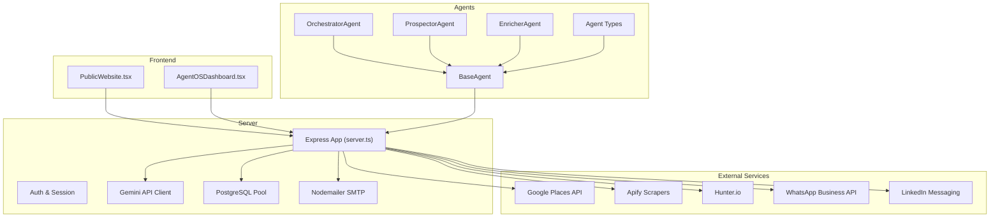
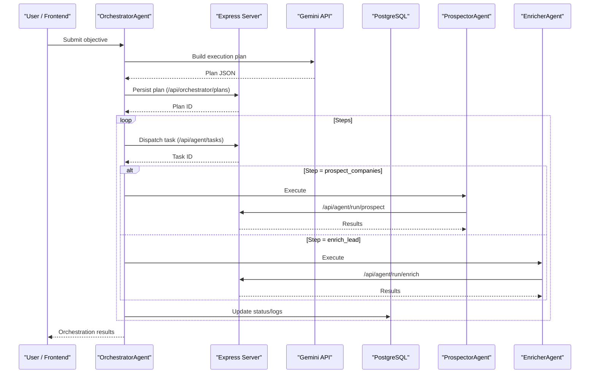
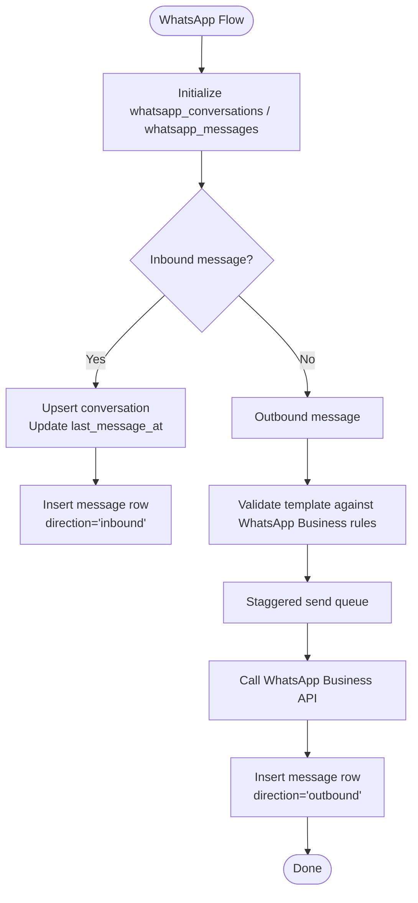
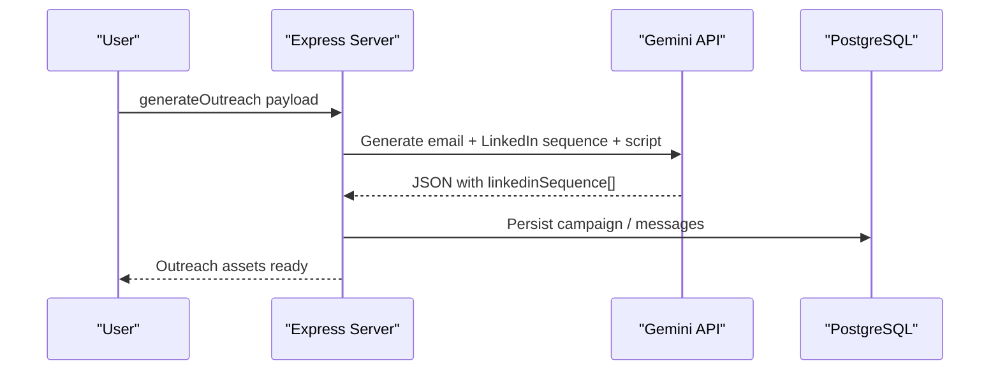
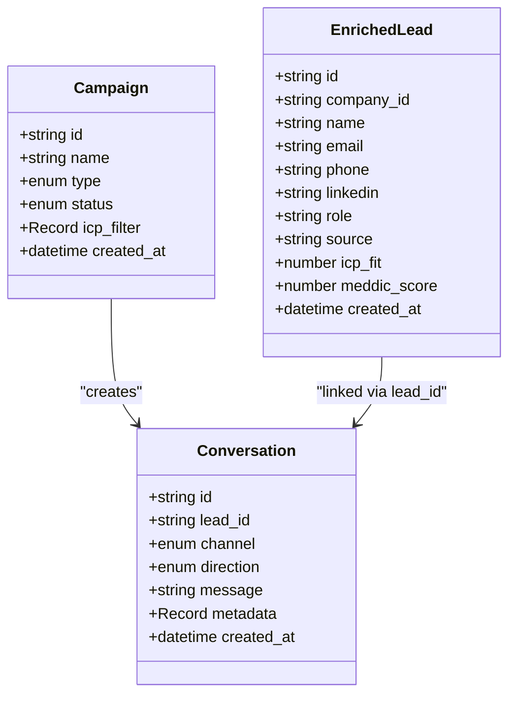
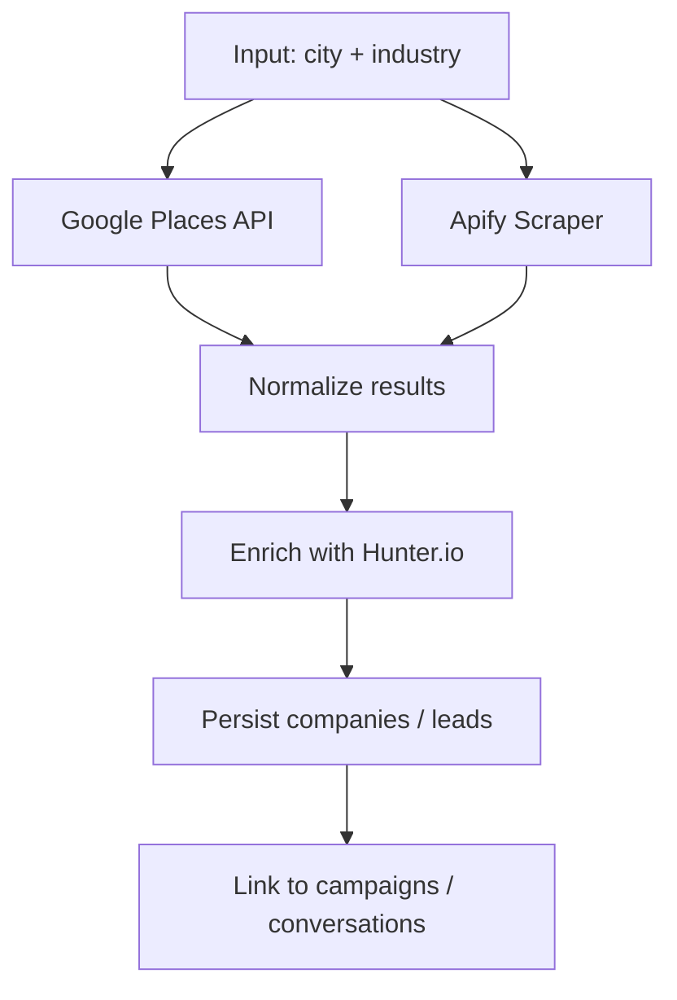
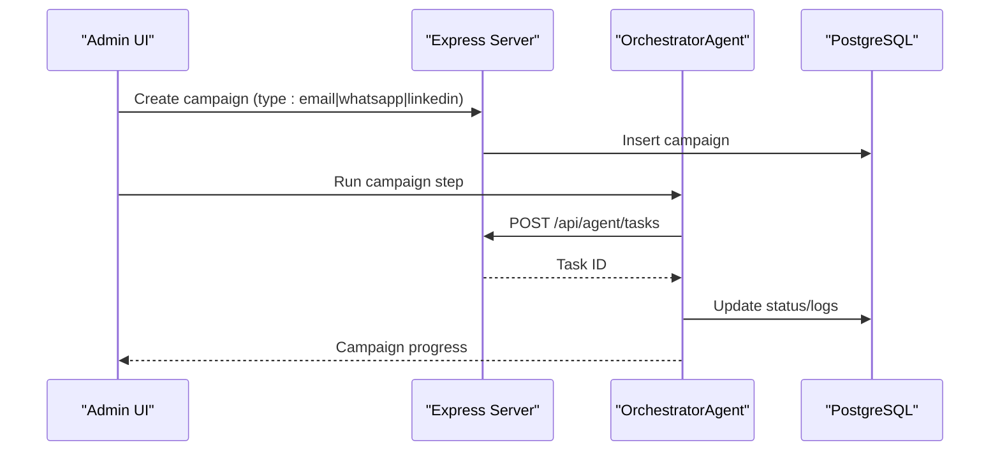
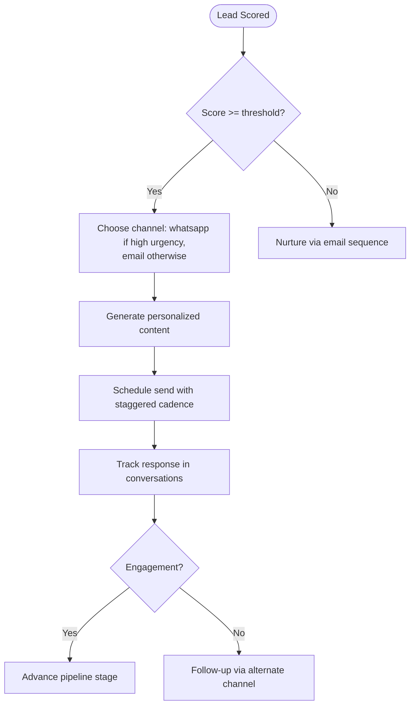
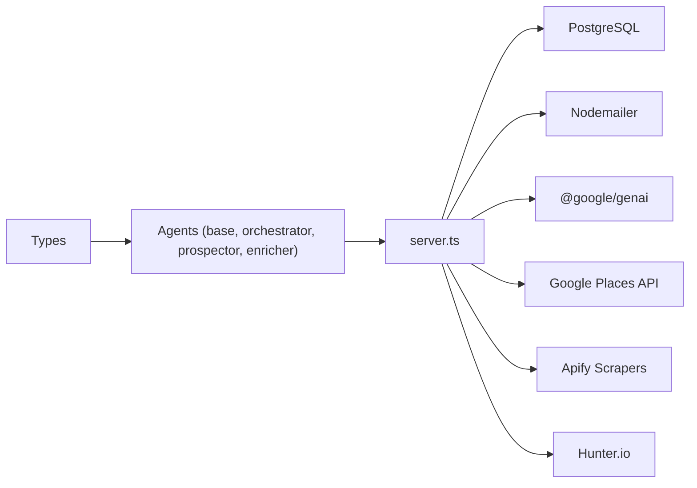

# Multi-Channel Outreach

<cite>
**Referenced Files in This Document**
- [README.md](file://README.md)
- [package.json](file://package.json)
- [server.ts](file://server.ts)
- [api/index.ts](file://api/index.ts)
- [src/agents/base.ts](file://src/agents/base.ts)
- [src/agents/orchestrator.ts](file://src/agents/orchestrator.ts)
- [src/agents/prospector.ts](file://src/agents/prospector.ts)
- [src/agents/enricher.ts](file://src/agents/enricher.ts)
- [src/agents/types.ts](file://src/agents/types.ts)
- [src/components/PublicWebsite.tsx](file://src/components/PublicWebsite.tsx)
</cite>

## Table of Contents
1. Introduction
2. Project Structure
3. Core Components
4. Architecture Overview
5. Detailed Component Analysis
6. Dependency Analysis
7. Performance Considerations
8. Troubleshooting Guide
9. Conclusion
10. Appendices

## Introduction
This document explains the multi-channel outreach capabilities for WhatsApp, LinkedIn, and cross-platform automation within the project. It covers channel configuration, message templating, contact synchronization across platforms, unified campaign management, and omnichannel sequences that coordinate messaging across email, WhatsApp, and LinkedIn based on engagement and lead scoring thresholds. It also provides examples of channel-specific personalization and delivery optimization strategies.

## Project Structure
The application is a Node/Express server with React frontend components and an agent-based orchestration layer. The server exposes APIs for authentication, AI generation, prospecting, enrichment, and WhatsApp data persistence. Agents define reusable workflows (prospecting, enrichment, orchestration) and communicate via typed task types and results.

**Diagram sources**
- [server.ts:1-120](file://server.ts#L1-L120)
- [src/agents/base.ts:18-199](file://src/agents/base.ts#L18-L199)
- [src/agents/orchestrator.ts:10-181](file://src/agents/orchestrator.ts#L10-L181)
- [src/agents/prospector.ts:26-71](file://src/agents/prospector.ts#L26-L71)
- [src/agents/enricher.ts:32-75](file://src/agents/enricher.ts#L32-L75)
- [src/agents/types.ts:5-181](file://src/agents/types.ts#L5-L181)

**Section sources**
- [README.md:1-21](file://README.md#L1-L21)
- [package.json:1-64](file://package.json#L1-L64)
- [server.ts:1-120](file://server.ts#L1-L120)

## Core Components
- Server (Express): Central API surface for auth, AI generation, prospecting, enrichment, WhatsApp tables, and integrations.
- Agents: Typed base class for lifecycle, retries, logging, cost tracking; orchestrator builds plans and dispatches tasks; prospector and enricher delegate to server-side runners.
- Data Models: Campaigns, leads, conversations, proposals, and company entities support multi-channel operations.
- External Integrations: Google Places, Apify scrapers, Hunter.io, Nodemailer (SMTP), PostgreSQL, and placeholders for WhatsApp Business API and LinkedIn messaging.

Key responsibilities:
- Channel configuration: Environment variables for SMTP, Google Maps Platform, Apify, Hunter, and placeholders for WhatsApp/LinkedIn.
- Message templating: AI-driven copy generation for emails and LinkedIn sequences; WhatsApp templates via Business API.
- Contact synchronization: Enrichment via Hunter.io; phone and LinkedIn fields stored in enriched lead model.
- Unified campaign management: Campaign type supports email, whatsapp, linkedin; conversation model tracks cross-channel interactions.

**Section sources**
- [server.ts:130-210](file://server.ts#L130-L210)
- [src/agents/types.ts:123-181](file://src/agents/types.ts#L123-L181)
- [src/agents/base.ts:18-199](file://src/agents/base.ts#L18-L199)
- [src/agents/orchestrator.ts:10-181](file://src/agents/orchestrator.ts#L10-L181)
- [src/agents/prospector.ts:26-71](file://src/agents/prospector.ts#L26-L71)
- [src/agents/enricher.ts:32-75](file://src/agents/enricher.ts#L32-L75)

## Architecture Overview
The system uses an agent orchestration pattern where a natural-language objective is converted into a structured plan and executed by specialized agents. The server coordinates external services and persists state in PostgreSQL.

**Diagram sources**
- [src/agents/orchestrator.ts:14-76](file://src/agents/orchestrator.ts#L14-L76)
- [src/agents/base.ts:76-126](file://src/agents/base.ts#L76-L126)
- [src/agents/prospector.ts:30-67](file://src/agents/prospector.ts#L30-L67)
- [src/agents/enricher.ts:36-71](file://src/agents/enricher.ts#L36-L71)

## Detailed Component Analysis

### WhatsApp Integration
- Data persistence: Tables for conversations and messages are created at startup, enabling inbound/outbound message tracking and bot activity flags.
- Broadcast features: Public website component describes segmented broadcasts, approved templates, and staggered sending to protect number reputation.
- Configuration: WhatsApp Business API integration is implied through environment variables and template usage; actual outbound calls are not present in the analyzed code but the schema supports it.

**Diagram sources**
- [server.ts:3640-3661](file://server.ts#L3640-L3661)
- [src/components/PublicWebsite.tsx:4664-4691](file://src/components/PublicWebsite.tsx#L4664-L4691)

**Section sources**
- [server.ts:3640-3661](file://server.ts#L3640-L3661)
- [src/components/PublicWebsite.tsx:4664-4691](file://src/components/PublicWebsite.tsx#L4664-L4691)

### LinkedIn Messaging
- Sequence generation: AI generates a LinkedIn sequence as part of multi-channel outreach content, including connection notes and follow-ups.
- Contact enrichment: Hunter.io returns LinkedIn profile links when available, enabling targeted outreach.
- Campaign type: Campaign model includes "linkedin" as a supported channel type.

**Diagram sources**
- [server.ts:2849-2898](file://server.ts#L2849-L2898)
- [src/agents/types.ts:149-156](file://src/agents/types.ts#L149-L156)

**Section sources**
- [server.ts:2849-2898](file://server.ts#L2849-L2898)
- [src/agents/types.ts:149-156](file://src/agents/types.ts#L149-L156)

### Cross-Platform Automation (Email, WhatsApp, LinkedIn)
- Unified campaign model: Supports email, whatsapp, linkedin channels with status transitions.
- Conversation model: Tracks cross-channel interactions with direction and metadata.
- Lead enrichment: Stores phone and linkedin fields alongside email, enabling multi-channel targeting.

**Diagram sources**
- [src/agents/types.ts:149-181](file://src/agents/types.ts#L149-L181)

**Section sources**
- [src/agents/types.ts:149-181](file://src/agents/types.ts#L149-L181)

### Contact Synchronization Across Platforms
- Prospecting: Google Places or Apify scrapers provide business data; fallback simulated data ensures availability.
- Enrichment: Hunter.io domain search yields contacts with names, emails, positions, confidence scores, and optional LinkedIn links.
- Storage: Companies and enriched leads persist in PostgreSQL; campaigns and conversations link leads to channels.

**Diagram sources**
- [server.ts:1635-1728](file://server.ts#L1635-L1728)
- [server.ts:1731-1909](file://server.ts#L1731-L1909)
- [server.ts:1911-1986](file://server.ts#L1911-L1986)

**Section sources**
- [server.ts:1635-1728](file://server.ts#L1635-L1728)
- [server.ts:1731-1909](file://server.ts#L1731-L1909)
- [server.ts:1911-1986](file://server.ts#L1911-L1986)

### Unified Campaign Management
- Campaign creation: Type indicates channel; status transitions manage lifecycle.
- Execution: Orchestrator dispatches steps like run_campaign; agents can integrate channel-specific runners.
- Tracking: Conversations and logs record actions, tokens, costs, and durations.

**Diagram sources**
- [src/agents/types.ts:149-156](file://src/agents/types.ts#L149-L156)
- [src/agents/orchestrator.ts:148-177](file://src/agents/orchestrator.ts#L148-L177)

**Section sources**
- [src/agents/types.ts:149-156](file://src/agents/types.ts#L149-L156)
- [src/agents/orchestrator.ts:148-177](file://src/agents/orchestrator.ts#L148-L177)

### Omnichannel Sequences Based on Engagement and Lead Scoring
- Scoring: AI scoring endpoint returns score, reason, and recommended action (e.g., whatsapp vs email).
- Personalization: AI-generated outreach includes tailored emails and LinkedIn sequences based on pain points and industry.
- Trigger logic: Use ICP fit and MEDDIC scores to decide channel priority and timing.

**Diagram sources**
- [server.ts:2179-2218](file://server.ts#L2179-L2218)
- [server.ts:2849-2898](file://server.ts#L2849-L2898)
- [src/agents/types.ts:123-136](file://src/agents/types.ts#L123-L136)

**Section sources**
- [server.ts:2179-2218](file://server.ts#L2179-L2218)
- [server.ts:2849-2898](file://server.ts#L2849-L2898)
- [src/agents/types.ts:123-136](file://src/agents/types.ts#L123-L136)

## Dependency Analysis
- Server dependencies: Express, PostgreSQL, Nodemailer, Google GenAI SDK, session store, bcrypt, crypto.
- Agent dependencies: BaseAgent abstracts lifecycle and API calls; orchestrator depends on Gemini for planning; prospector/enricher depend on server-side runners.
- External services: Google Places, Apify, Hunter.io; WhatsApp Business API and LinkedIn messaging are modeled but not implemented in the analyzed code.

**Diagram sources**
- [server.ts:1-120](file://server.ts#L1-L120)
- [src/agents/base.ts:18-199](file://src/agents/base.ts#L18-L199)
- [src/agents/orchestrator.ts:10-181](file://src/agents/orchestrator.ts#L10-L181)
- [src/agents/prospector.ts:26-71](file://src/agents/prospector.ts#L26-L71)
- [src/agents/enricher.ts:32-75](file://src/agents/enricher.ts#L32-L75)

**Section sources**
- [server.ts:1-120](file://server.ts#L1-L120)
- [src/agents/base.ts:18-199](file://src/agents/base.ts#L18-L199)
- [src/agents/orchestrator.ts:10-181](file://src/agents/orchestrator.ts#L10-L181)
- [src/agents/prospector.ts:26-71](file://src/agents/prospector.ts#L26-L71)
- [src/agents/enricher.ts:32-75](file://src/agents/enricher.ts#L32-L75)

## Performance Considerations
- AI fallback chain: Multiple Gemini models with retry and quota handling ensure resilience; local fallback avoids blocking when quotas are exhausted.
- Staggered sends: WhatsApp broadcasts distribute messages over time to protect number reputation and comply with platform limits.
- Database indexing: Ensure indexes on frequently queried fields (lead_id, channel, created_at) for fast conversation history and campaign metrics.
- Rate limiting: Implement rate limiting for external API calls (Google Places, Apify, Hunter) to avoid throttling.

[No sources needed since this section provides general guidance]

## Troubleshooting Guide
- Missing environment variables: Verify SMTP_USER/SMTP_PASS for email; GOOGLE_MAPS_PLATFORM_KEY or APIFY_API_TOKEN for prospecting; HUNTER_API_KEY for enrichment; GEMINI_API_KEY for AI generation.
- Authentication issues: Ensure SESSION_SECRET is set; check user roles and session persistence.
- AI failures: Inspect fallback logs and model selection; confirm quota availability.
- WhatsApp tables: Confirm initialization of whatsapp_conversations and whatsapp_messages; validate constraints and foreign keys.

**Section sources**
- [server.ts:130-210](file://server.ts#L130-L210)
- [server.ts:3640-3661](file://server.ts#L3640-L3661)
- [server.ts:854-971](file://server.ts#L854-L971)

## Conclusion
The project provides a robust foundation for multi-channel outreach with WhatsApp, LinkedIn, and email. While WhatsApp and LinkedIn integrations are modeled and partially implemented, the orchestration, enrichment, and campaign frameworks enable scalable omnichannel sequences. With proper configuration and additional implementation for WhatsApp Business API and LinkedIn messaging, the system can deliver personalized, automated outreach aligned with engagement signals and lead scoring.

[No sources needed since this section summarizes without analyzing specific files]

## Appendices
- Setup instructions: Install dependencies, set GEMINI_API_KEY, and run development server as per README.
- Key endpoints: Authentication, AI generation, places search, enrichment, WhatsApp tables initialization.

**Section sources**
- [README.md:12-21](file://README.md#L12-L21)
- [package.json:6-14](file://package.json#L6-L14)
- [api/index.ts:1-5](file://api/index.ts#L1-L5)