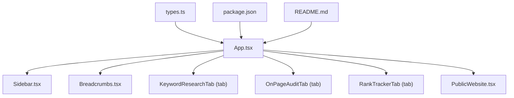
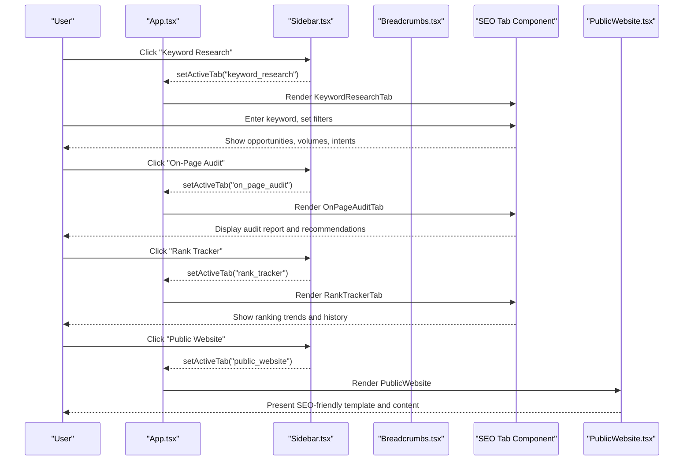
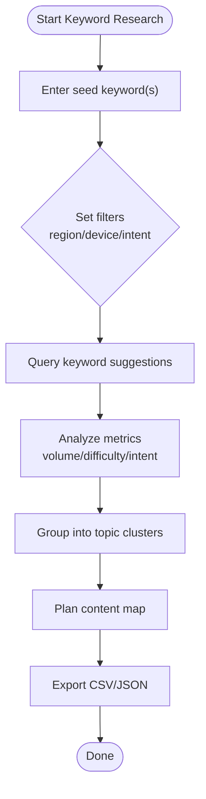
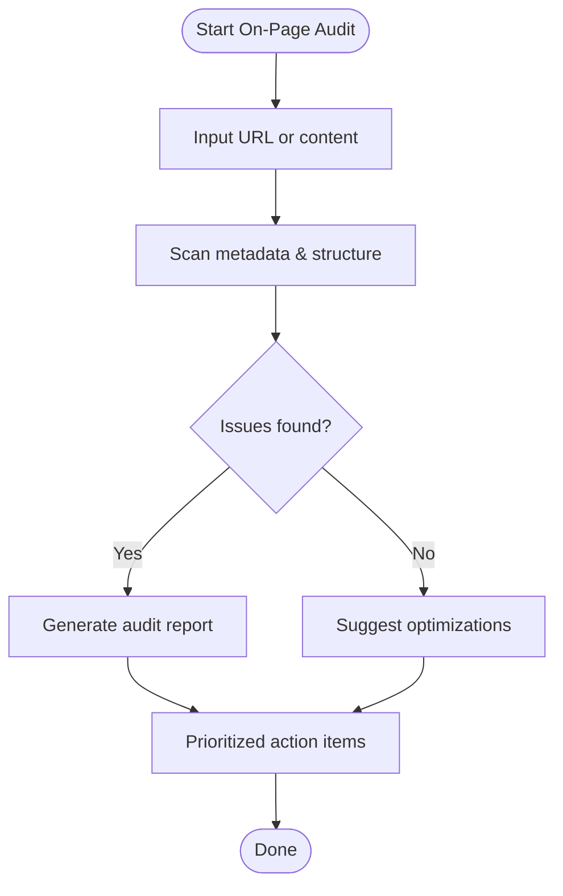
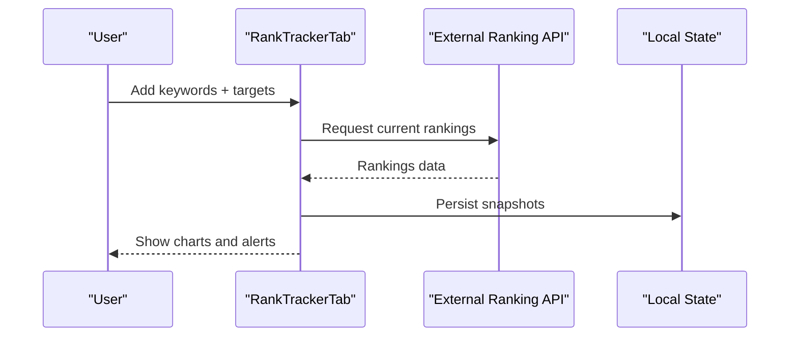
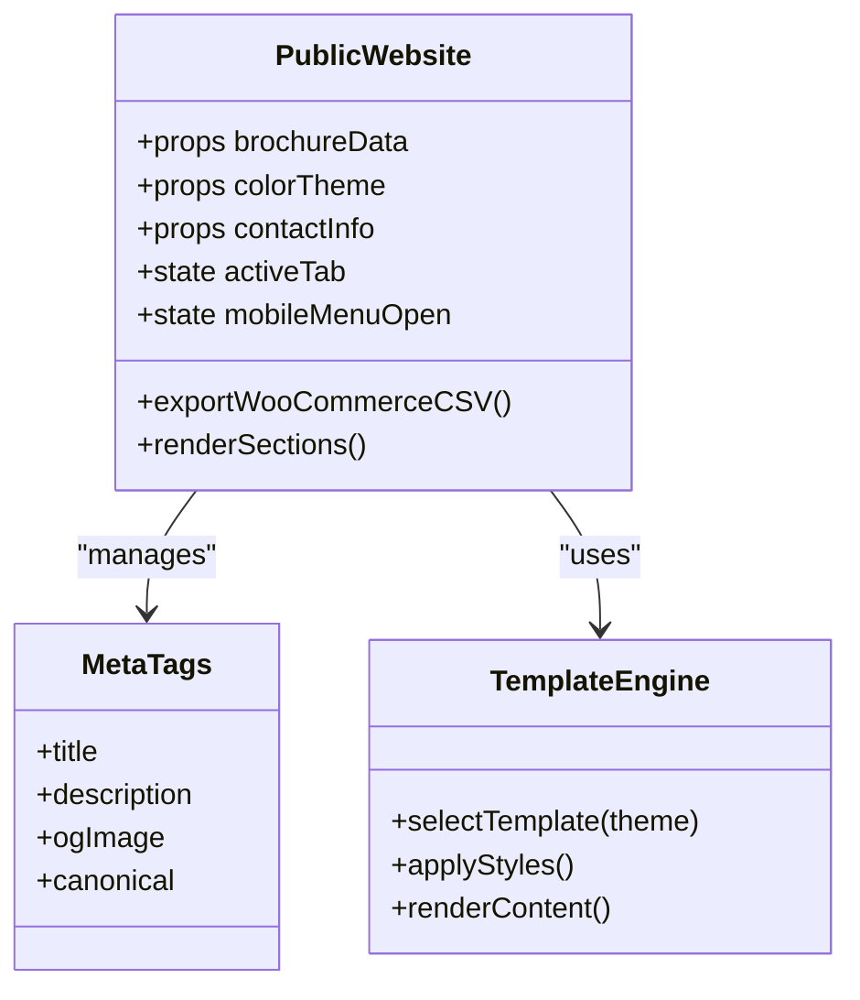
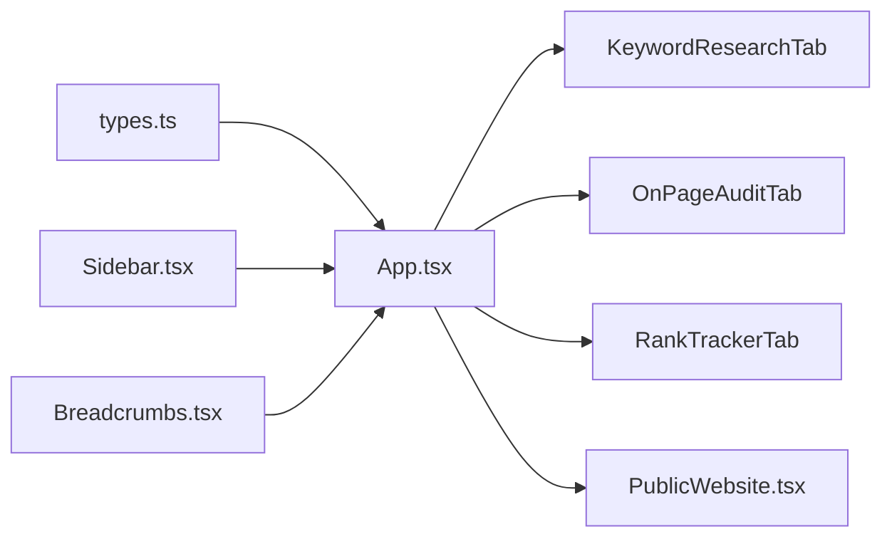

# SEO Tools

<cite>
**Referenced Files in This Document**
- [README.md](file://README.md)
- [package.json](file://package.json)
- [App.tsx](file://src/App.tsx)
- [types.ts](file://src/types.ts)
- [Sidebar.tsx](file://src/components/Sidebar.tsx)
- [Breadcrumbs.tsx](file://src/components/Breadcrumbs.tsx)
- [PublicWebsite.tsx](file://src/components/PublicWebsite.tsx)
</cite>

## Table of Contents
1. [Introduction](#introduction)
2. [Project Structure](#project-structure)
3. [Core Components](#core-components)
4. [Architecture Overview](#architecture-overview)
5. [Detailed Component Analysis](#detailed-component-analysis)
6. [Dependency Analysis](#dependency-analysis)
7. [Performance Considerations](#performance-considerations)
8. [Troubleshooting Guide](#troubleshooting-guide)
9. [Conclusion](#conclusion)
10. [Appendices](#appendices)

## Introduction
This document explains the SEO tools available in the application, focusing on keyword research, on-page audit capabilities, and rank tracking features. It also covers the public website builder with SEO-friendly templates, meta tag management, and content generation tools. The goal is to help users understand how to discover keywords, analyze search volume signals, gather competitive intelligence, run technical audits, optimize content, and track rankings over time.

The project is a React-based dashboard with a server entry point and Vite build pipeline. It integrates external services (e.g., Gemini API via environment variables) and provides multiple tabs for SEO workflows.

**Section sources**
- [README.md:1-21](file://README.md#L1-L21)
- [package.json:1-64](file://package.json#L1-L64)

## Project Structure
The application uses a modular structure centered around a main App component that routes to feature tabs. SEO-related tabs are defined as part of the active tab type and rendered conditionally. A sidebar and breadcrumbs organize navigation. The Public Website component serves as a full-featured site builder with templates and content sections.

**Diagram sources**
- [App.tsx:1-177](file://src/App.tsx#L1-L177)
- [types.ts:1-35](file://src/types.ts#L1-L35)
- [package.json:1-64](file://package.json#L1-L64)
- [README.md:1-21](file://README.md#L1-L21)

**Section sources**
- [App.tsx:1-177](file://src/App.tsx#L1-L177)
- [types.ts:1-35](file://src/types.ts#L1-L35)

## Core Components
- Keyword Research Tab: Entry point for discovering keywords, analyzing intent, and planning content clusters.
- On-Page Audit Tab: Scans pages for technical issues, meta tags, headings, performance signals, and content optimization recommendations.
- Rank Tracker Tab: Monitors keyword positions over time across regions and devices.
- Public Website Builder: Provides SEO-friendly templates, structured content sections, and export utilities to integrate with e-commerce platforms.

These components are wired into the app through tab routing and shared types.

**Section sources**
- [App.tsx:154-161](file://src/App.tsx#L154-L161)
- [types.ts:16-23](file://src/types.ts#L16-L23)

## Architecture Overview
The SEO tooling follows a tab-driven architecture where each feature is encapsulated in its own component and mounted by the root App. Navigation is provided by Sidebar and Breadcrumbs. Data flows from user interactions within tabs to local state or external APIs.

**Diagram sources**
- [App.tsx:90-107](file://src/App.tsx#L90-L107)
- [App.tsx:154-161](file://src/App.tsx#L154-L161)
- [Sidebar.tsx:139-148](file://src/components/Sidebar.tsx#L139-L148)
- [Breadcrumbs.tsx:41-46](file://src/components/Breadcrumbs.tsx#L41-L46)

## Detailed Component Analysis

### Keyword Research Workflow
Purpose: Discover high-value keywords, understand search intent, and plan content topics.

Key behaviors:
- Input keyword or phrase.
- Filter by region and device.
- Analyze search volume signals and difficulty indicators.
- Group keywords into topic clusters.
- Export results for planning.

[No sources needed since this diagram shows conceptual workflow, not actual code structure]

Practical examples:
- Use broad terms to generate long-tail variations.
- Prioritize low-difficulty, high-intent queries for quick wins.
- Map clusters to landing pages and blog posts.

### On-Page Audit Capabilities
Purpose: Identify technical SEO issues, evaluate meta tags, headings, content quality, and performance signals; provide actionable recommendations.

Key behaviors:
- Provide URL or paste page content.
- Scan meta title, description, canonical, Open Graph, schema.
- Check heading hierarchy (H1-H6), image alt attributes, internal linking.
- Evaluate page speed hints (image sizes, render-blocking resources).
- Generate prioritized recommendations.

[No sources needed since this diagram shows conceptual workflow, not actual code structure]

Practical examples:
- Fix missing H1 or duplicate meta titles.
- Add descriptive alt text to images.
- Improve internal linking to key pages.

### Rank Tracking Features
Purpose: Monitor keyword positions over time, compare against competitors, and visualize trends.

Key behaviors:
- Add tracked keywords and target URLs.
- Select region and device settings.
- Fetch periodic ranking updates.
- Visualize trends and anomalies.
- Export reports for stakeholders.

[No sources needed since this diagram shows conceptual workflow, not actual code structure]

### Public Website Builder with SEO-Friendly Templates
Purpose: Build and publish SEO-optimized websites using templates, manage meta tags, and generate content sections.

Key behaviors:
- Choose a theme/template.
- Configure contact info and branding.
- Manage meta tags and structured data.
- Publish and preview live site.
- Export product catalogs for e-commerce integration.

**Diagram sources**
- [PublicWebsite.tsx:140-149](file://src/components/PublicWebsite.tsx#L140-L149)
- [PublicWebsite.tsx:290-411](file://src/components/PublicWebsite.tsx#L290-L411)

**Section sources**
- [PublicWebsite.tsx:140-149](file://src/components/PublicWebsite.tsx#L140-L149)
- [PublicWebsite.tsx:290-411](file://src/components/PublicWebsite.tsx#L290-L411)

## Dependency Analysis
The SEO features depend on the root App for routing, shared types for tab identifiers, and UI helpers for navigation. The Public Website component relies on local state and props for rendering and exporting data.

**Diagram sources**
- [types.ts:16-23](file://src/types.ts#L16-L23)
- [App.tsx:154-161](file://src/App.tsx#L154-L161)
- [Sidebar.tsx:139-148](file://src/components/Sidebar.tsx#L139-L148)
- [Breadcrumbs.tsx:41-46](file://src/components/Breadcrumbs.tsx#L41-L46)

**Section sources**
- [types.ts:16-23](file://src/types.ts#L16-L23)
- [App.tsx:154-161](file://src/App.tsx#L154-L161)

## Performance Considerations
- Debounce search inputs in keyword research to reduce unnecessary computations.
- Paginate large datasets (e.g., service catalogs) to improve rendering performance.
- Cache ranking snapshots locally to avoid repeated API calls.
- Optimize images and assets in the public website builder for faster load times.
- Use memoization for expensive calculations (e.g., filtered lists).

[No sources needed since this section provides general guidance]

## Troubleshooting Guide
Common issues and resolutions:
- Session check failures: Ensure the auth endpoint is reachable and returns expected payloads.
- Missing SEO tabs: Verify that tab IDs match the ActiveTab union type and are imported correctly.
- Public website blank states: Confirm authentication guards redirect unauthenticated users appropriately.
- Export errors: Validate CSV escaping and encoding when generating WooCommerce exports.

**Section sources**
- [App.tsx:50-67](file://src/App.tsx#L50-L67)
- [PublicWebsite.tsx:160-165](file://src/components/PublicWebsite.tsx#L160-L165)
- [PublicWebsite.tsx:290-411](file://src/components/PublicWebsite.tsx#L290-L411)

## Conclusion
The SEO tools in this application provide a cohesive workflow for keyword discovery, on-page auditing, and rank tracking, complemented by a robust public website builder. By leveraging structured tabs, shared types, and clear navigation, users can efficiently execute SEO strategies, optimize content, and monitor performance over time.

[No sources needed since this section summarizes without analyzing specific files]

## Appendices

### Examples of Keyword Strategies
- Seed with core business terms, expand to long-tail variations.
- Target buyer intent stages: awareness, consideration, decision.
- Create pillar pages and supporting articles per cluster.
- Monitor competitor keywords and gaps.

[No sources needed since this section provides general guidance]

### Audit Reports Checklist
- Meta title and description uniqueness and length.
- Canonical tags and hreflang usage.
- Heading hierarchy correctness.
- Image alt attributes and file sizes.
- Internal linking structure and anchor text diversity.
- Page speed and Core Web Vitals hints.

[No sources needed since this section provides general guidance]

### Website Optimization Workflows
- Implement semantic HTML and structured data.
- Optimize images and enable caching.
- Minify CSS/JS and remove unused code.
- Ensure mobile responsiveness and accessibility.
- Regularly audit and update content based on performance data.

[No sources needed since this section provides general guidance]