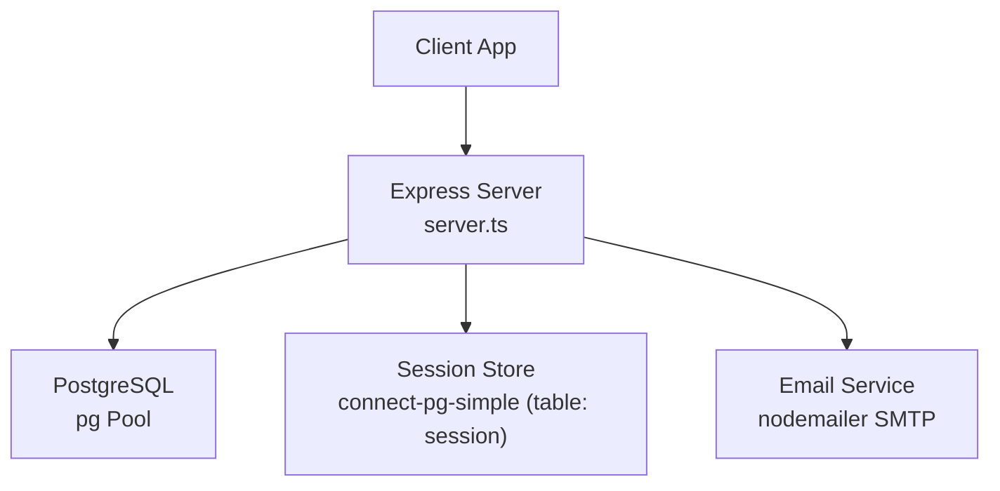
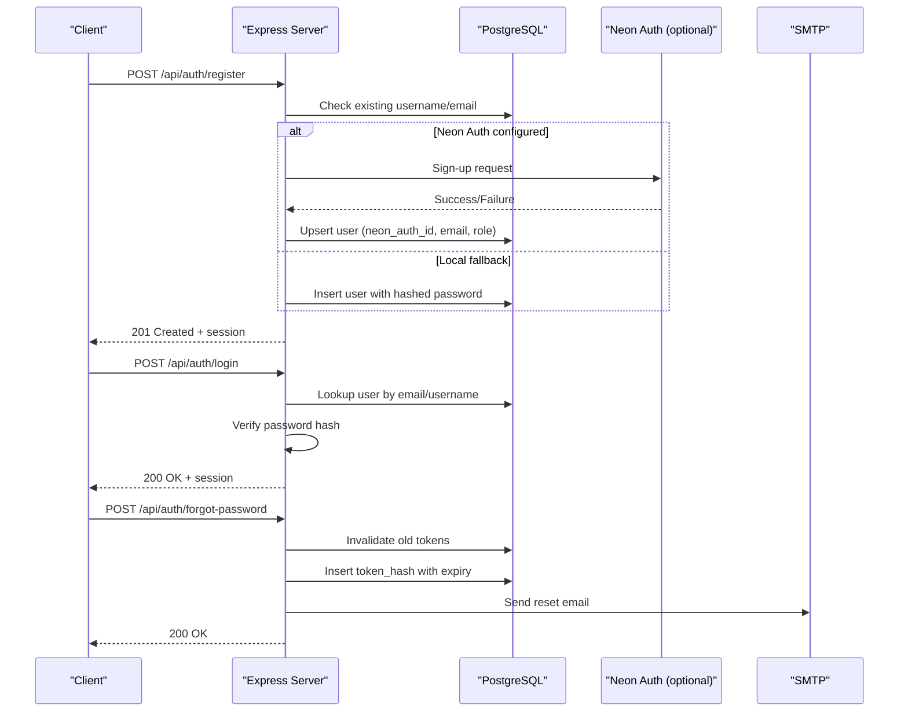
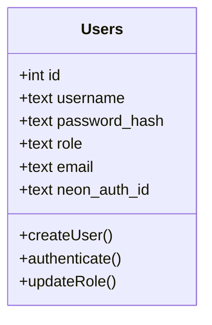
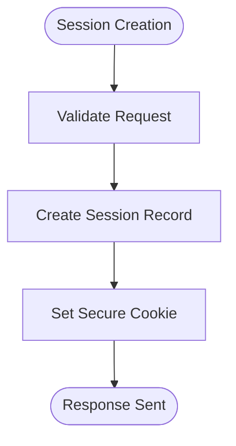
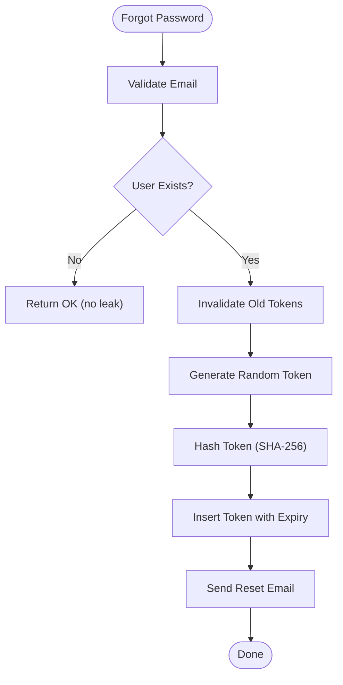
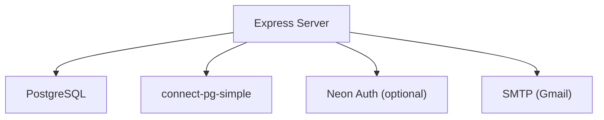
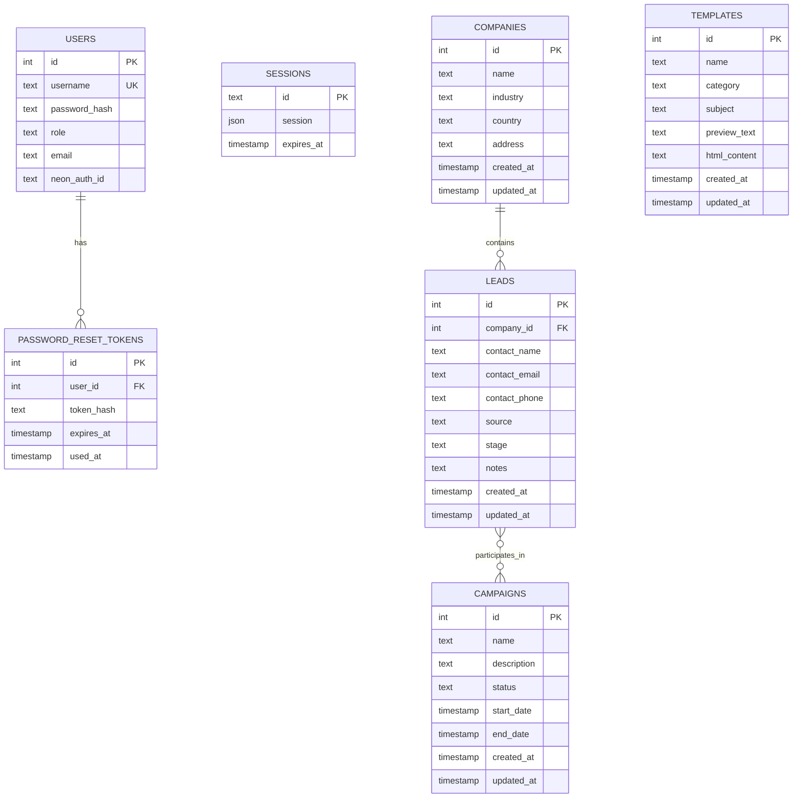

# Database Schema

<cite>
**Referenced Files in This Document**
- [server.ts](file://server.ts)
- [api/index.ts](file://api/index.ts)
- [package.json](file://package.json)
- [README.md](file://README.md)
- [src/types.ts](file://src/types.ts)
- [.agents/skills/supabase-postgres-best-practices/references/schema-constraints.md](file://.agents/skills/supabase-postgres-best-practices/references/schema-constraints.md)
- [.agents/skills/supabase-postgres-best-practices/references/schema-primary-keys.md](file://.agents/skills/supabase-postgres-best-practices/references/schema-primary-keys.md)
- [.agents/skills/supabase-postgres-best-practices/references/schema-foreign-key-indexes.md](file://.agents/skills/supabase-postgres-best-practices/references/schema-foreign-key-indexes.md)
- [.agents/skills/supabase-postgres-best-practices/references/query-missing-indexes.md](file://.agents/skills/supabase-postgres-best-practices/references/query-missing-indexes.md)
- [.agents/skills/supabase-postgres-best-practices/references/security-privileges.md](file://.agents/skills/supabase-postgres-best-practices/references/security-privileges.md)
</cite>

## Table of Contents
1. [Introduction](#introduction)
2. [Project Structure](#project-structure)
3. [Core Components](#core-components)
4. [Architecture Overview](#architecture-overview)
5. [Detailed Component Analysis](#detailed-component-analysis)
6. [Dependency Analysis](#dependency-analysis)
7. [Performance Considerations](#performance-considerations)
8. [Troubleshooting Guide](#troubleshooting-guide)
9. [Conclusion](#conclusion)
10. [Appendices](#appendices)

## Introduction
This document provides comprehensive data model documentation for the PostgreSQL database schema used by the application. It focuses on entities relevant to users, companies, leads, campaigns, and templates as inferred from server-side code and TypeScript types. The document details field definitions, data types, constraints, primary/foreign keys, indexes, validation rules, lifecycle policies, backup strategies, migration procedures, security, privacy, and access control mechanisms. Where the repository does not define explicit DDL, recommendations are provided based on best practices referenced in the project’s skill files.

## Project Structure
The application is a Node.js/Express server with PostgreSQL integration via the pg driver and session persistence using connect-pg-simple. The API entrypoint exports the Express app for hosting environments.

**Diagram sources**
- [server.ts:12-34](file://server.ts#L12-L34)
- [api/index.ts:1-5](file://api/index.ts#L1-L5)

**Section sources**
- [server.ts:12-34](file://server.ts#L12-L34)
- [api/index.ts:1-5](file://api/index.ts#L1-L5)
- [package.json:39-40](file://package.json#L39-L40)

## Core Components
Based on the server code and TypeScript types, the following core data entities are present or implied:

- Users
  - Purpose: Authentication, authorization, and user identity management.
  - Key fields inferred: id (PK), username, password_hash, role, email, neon_auth_id (optional external identity).
  - Constraints: Unique username/email; role restricted to admin/user; password hashing enforced.
  - Indexes: Primary key on id; unique index on username; optional unique index on email; index on neon_auth_id if used for lookups.

- Sessions
  - Purpose: Persistent HTTP sessions stored in PostgreSQL via connect-pg-simple.
  - Key fields inferred: id (PK), session data JSON, expires_at timestamp.
  - Constraints: Expiration-based cleanup; secure cookie settings enforced at the application layer.

- Password Reset Tokens
  - Purpose: Secure one-time password reset tokens.
  - Key fields inferred: id (PK), user_id (FK to users.id), token_hash, expires_at, used_at.
  - Constraints: Token hash stored; expiration enforced; single-use semantics via used_at.

- CRM Entities (implied by types)
  - Companies: Company profiles linked to deals/leads.
  - Leads: Prospects with contact info and source tracking.
  - Campaigns: Marketing campaign metadata and status.
  - Templates: Reusable content templates for emails or brochures.

Note: The exact DDL for CRM entities is not defined in the repository. Recommendations below follow best practices and align with common CRM schemas.

**Section sources**
- [server.ts:266-338](file://server.ts#L266-L338)
- [server.ts:340-381](file://server.ts#L340-L381)
- [server.ts:753-791](file://server.ts#L753-L791)
- [src/types.ts:139-162](file://src/types.ts#L139-L162)

## Architecture Overview
The system uses an Express server that authenticates users against PostgreSQL, persists sessions in a dedicated table, and supports password reset workflows. External authentication can be proxied through Neon Auth, which then syncs identities into the local users table.

**Diagram sources**
- [server.ts:266-338](file://server.ts#L266-L338)
- [server.ts:340-381](file://server.ts#L340-L381)
- [server.ts:594-680](file://server.ts#L594-L680)
- [server.ts:683-748](file://server.ts#L683-L748)
- [server.ts:753-791](file://server.ts#L753-L791)

## Detailed Component Analysis

### Users Entity
- Fields and Types
  - id: integer, primary key, auto-incremented.
  - username: text, unique, validated length and characters.
  - password_hash: text, bcrypt-hashed, never stored plaintext.
  - role: text, constrained to 'admin' or 'user'.
  - email: text, optional, normalized to lowercase for lookups.
  - neon_auth_id: text, optional, links to external identity provider.
- Constraints
  - Primary key on id.
  - Unique constraint on username.
  - Optional unique constraint on email.
  - Role check via application logic; consider CHECK constraint for enforcement.
- Indexes
  - PK on id.
  - Unique index on username.
  - Unique index on email (if uniqueness required).
  - Index on neon_auth_id for fast lookup when syncing external auth.
- Validation Rules
  - Username format enforced server-side; consider domain-specific normalization.
  - Password strength enforced server-side; ensure minimum complexity.
  - Email normalization to lowercase before storage and queries.

**Diagram sources**
- [server.ts:266-338](file://server.ts#L266-L338)
- [server.ts:340-381](file://server.ts#L340-L381)
- [server.ts:594-680](file://server.ts#L594-L680)

**Section sources**
- [server.ts:266-338](file://server.ts#L266-L338)
- [server.ts:340-381](file://server.ts#L340-L381)
- [server.ts:594-680](file://server.ts#L594-L680)

### Sessions Entity
- Fields and Types
  - id: text, primary key (session identifier).
  - session: json/jsonb, serialized session data.
  - expires_at: timestamp, session expiration time.
- Constraints
  - Expiration-based cleanup recommended via scheduled job.
  - Secure cookie configuration enforced at application layer.
- Indexes
  - PK on id.
  - Index on expires_at for efficient cleanup.

**Diagram sources**
- [server.ts:112-125](file://server.ts#L112-L125)
- [server.ts:29-34](file://server.ts#L29-L34)

**Section sources**
- [server.ts:29-34](file://server.ts#L29-L34)
- [server.ts:112-125](file://server.ts#L112-L125)

### Password Reset Tokens Entity
- Fields and Types
  - id: integer, primary key.
  - user_id: integer, foreign key to users(id).
  - token_hash: text, SHA-256 hash of raw token.
  - expires_at: timestamp, token validity window.
  - used_at: timestamp, null until consumed.
- Constraints
  - Foreign key to users(id).
  - Single-use enforced via used_at.
  - Expiry enforced at query time.
- Indexes
  - PK on id.
  - Index on user_id for per-user token management.
  - Index on expires_at for cleanup jobs.

**Diagram sources**
- [server.ts:753-791](file://server.ts#L753-L791)

**Section sources**
- [server.ts:753-791](file://server.ts#L753-L791)

### CRM Entities (Companies, Leads, Campaigns, Templates)
- Companies
  - Fields: id (PK), name, industry, country, address, created_at, updated_at.
  - Relationships: One-to-many with leads/deals.
- Leads
  - Fields: id (PK), company_id (FK), contact_name, contact_email, contact_phone, source, stage, notes, created_at, updated_at.
  - Relationships: Many-to-one with companies; many-to-many with campaigns via join tables.
- Campaigns
  - Fields: id (PK), name, description, status, start_date, end_date, created_at, updated_at.
  - Relationships: Many-to-many with leads via campaign_leads.
- Templates
  - Fields: id (PK), name, category, subject, preview_text, html_content, created_at, updated_at.
  - Relationships: Used by campaigns; versioning supported via additional fields.

Recommendations:
- Enforce referential integrity with foreign keys.
- Add indexes on frequently filtered columns (company_id, status, created_at).
- Use JSONB for flexible metadata where appropriate.

[No sources needed since this section provides conceptual guidance]

## Dependency Analysis
The server depends on PostgreSQL for persistent storage and optionally on Neon Auth for identity synchronization. Session persistence is handled via connect-pg-simple, which creates a session table automatically.

**Diagram sources**
- [server.ts:12-34](file://server.ts#L12-L34)
- [server.ts:133-143](file://server.ts#L133-L143)
- [server.ts:594-680](file://server.ts#L594-L680)

**Section sources**
- [server.ts:12-34](file://server.ts#L12-L34)
- [server.ts:133-143](file://server.ts#L133-L143)
- [server.ts:594-680](file://server.ts#L594-L680)

## Performance Considerations
- Indexing Strategy
  - Always index foreign keys and columns used in WHERE/JON clauses.
  - Use composite indexes for multi-column filters.
  - Avoid over-indexing; monitor query plans.
- Connection Management
  - Use connection pooling to handle concurrency efficiently.
  - Configure pool size based on CPU cores and available memory.
- Query Optimization
  - Prefer parameterized queries to prevent SQL injection and improve plan reuse.
  - Use EXPLAIN ANALYZE to identify slow queries.

**Section sources**
- [.agents/skills/supabase-postgres-best-practices/references/query-missing-indexes.md](file://.agents/skills/supabase-postgres-best-practices/references/query-missing-indexes.md)
- [.agents/skills/supabase-postgres-best-practices/references/conn-pooling.md](file://.agents/skills/supabase-postgres-best-practices/references/conn-pooling.md)

## Troubleshooting Guide
- Authentication Failures
  - Verify username/email format and password strength.
  - Check bcrypt hash comparison and session creation timeouts.
- Session Issues
  - Ensure session store table exists and is accessible.
  - Monitor session expiration and cleanup jobs.
- Password Reset Problems
  - Confirm token generation and hashing process.
  - Validate SMTP configuration and email delivery.

**Section sources**
- [server.ts:266-338](file://server.ts#L266-L338)
- [server.ts:340-381](file://server.ts#L340-L381)
- [server.ts:753-791](file://server.ts#L753-L791)

## Conclusion
The PostgreSQL schema supports core authentication, session management, and password reset functionality. CRM entities are implied by TypeScript types and should be modeled with strong referential integrity and performance-oriented indexing. Security and privacy are addressed through hashed passwords, secure sessions, and least-privilege access patterns. Migration and backup strategies should follow best practices outlined in the referenced skill files.

## Appendices

### Data Model Diagram

**Diagram sources**
- [server.ts:266-338](file://server.ts#L266-L338)
- [server.ts:753-791](file://server.ts#L753-L791)
- [src/types.ts:139-162](file://src/types.ts#L139-L162)

### Security and Access Control
- Apply principle of least privilege for database roles.
- Restrict public schema permissions.
- Use parameterized queries to prevent SQL injection.
- Enforce HTTPS and secure cookies in production.

**Section sources**
- [.agents/skills/supabase-postgres-best-practices/references/security-privileges.md](file://.agents/skills/supabase-postgres-best-practices/references/security-privileges.md)

### Backup and Migration Procedures
- Regular backups using pg_dump or managed service snapshots.
- Version-controlled migrations generated via Supabase CLI or similar tools.
- Test migrations in staging before applying to production.

**Section sources**
- [.agents/skills/supabase-postgres-best-practices/references/schema-constraints.md](file://.agents/skills/supabase-postgres-best-practices/references/schema-constraints.md)
- [.agents/skills/supabase-postgres-best-practices/references/schema-primary-keys.md](file://.agents/skills/supabase-postgres-best-practices/references/schema-primary-keys.md)
- [.agents/skills/supabase-postgres-best-practices/references/schema-foreign-key-indexes.md](file://.agents/skills/supabase-postgres-best-practices/references/schema-foreign-key-indexes.md)