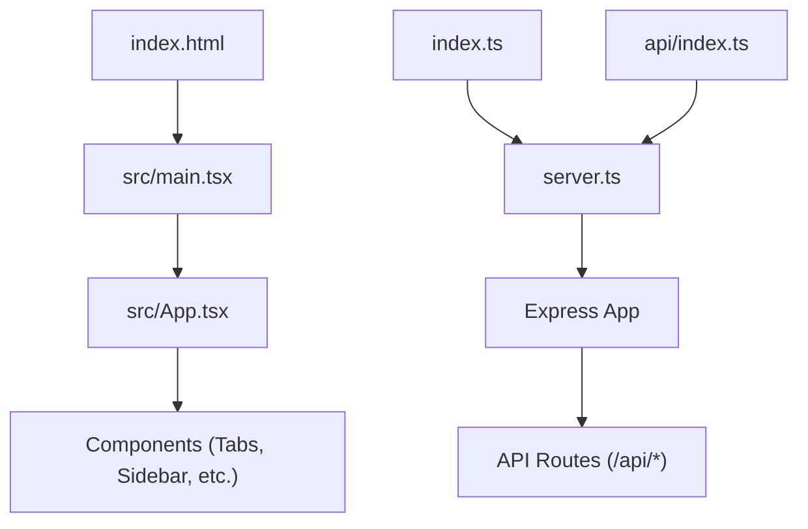
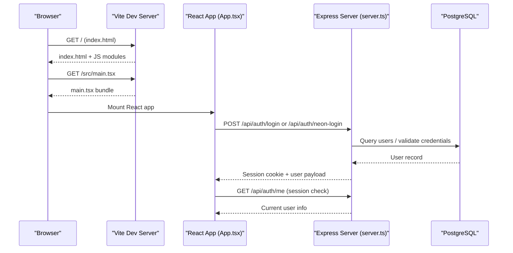
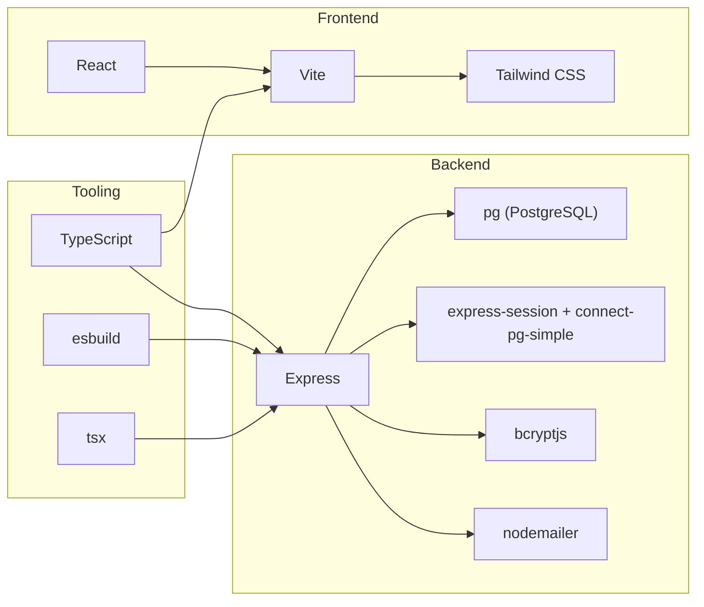

# Development Guide

<cite>
**Referenced Files in This Document**
- [package.json](file://package.json)
- [vite.config.ts](file://vite.config.ts)
- [tsconfig.json](file://tsconfig.json)
- [index.html](file://index.html)
- [README.md](file://README.md)
- [server.ts](file://server.ts)
- [index.ts](file://index.ts)
- [api/index.ts](file://api/index.ts)
- [src/main.tsx](file://src/main.tsx)
- [src/App.tsx](file://src/App.tsx)
- [src/types.ts](file://src/types.ts)
- [scripts/setup-env.js](file://scripts/setup-env.js)
- [scripts/doctor.mjs](file://scripts/doctor.mjs)
</cite>

## Table of Contents
1. [Introduction](#introduction)
2. [Project Structure](#project-structure)
3. [Core Components](#core-components)
4. [Architecture Overview](#architecture-overview)
5. [Detailed Component Analysis](#detailed-component-analysis)
6. [Dependency Analysis](#dependency-analysis)
7. [Performance Considerations](#performance-considerations)
8. [Troubleshooting Guide](#troubleshooting-guide)
9. [Conclusion](#conclusion)
10. [Appendices](#appendices)

## Introduction
This guide explains how to set up the development environment, follow coding standards, debug effectively, and test changes for the ClientumLatam codebase. It also covers the Vite-based build process, TypeScript configuration, deployment procedures, scripts for development tasks, environment variable management, and best practices for adding features and maintaining quality.

## Project Structure
The project is a React + Vite frontend with an Express server that serves API endpoints and static assets. The entry points are:
- Frontend: index.html loads src/main.tsx which mounts the React app.
- Backend: server.ts defines all API routes and middleware; index.ts initializes DB tables and exports the Express app for serverless deployments; api/index.ts provides a Vercel handler wrapper.

**Diagram sources**
- [index.html:1-14](file://index.html#L1-L14)
- [src/main.tsx:1-11](file://src/main.tsx#L1-L11)
- [src/App.tsx:1-177](file://src/App.tsx#L1-L177)
- [server.ts:1-800](file://server.ts#L1-L800)
- [index.ts:1-20](file://index.ts#L1-L20)
- [api/index.ts:1-5](file://api/index.ts#L1-L5)

**Section sources**
- [index.html:1-14](file://index.html#L1-L14)
- [src/main.tsx:1-11](file://src/main.tsx#L1-L11)
- [src/App.tsx:1-177](file://src/App.tsx#L1-L177)
- [server.ts:1-800](file://server.ts#L1-L800)
- [index.ts:1-20](file://index.ts#L1-L20)
- [api/index.ts:1-5](file://api/index.ts#L1-L5)

## Core Components
- Build and Dev Server:
  - Vite config enables React and Tailwind plugins, sets path aliases, and controls HMR behavior via environment variables.
  - TypeScript is configured with ESNext modules, JSX support, path aliases, and no emit (type checking only).
- Application Entry:
  - index.html bootstraps the DOM root and loads the module entry point.
  - src/main.tsx renders the React app with StrictMode.
  - src/App.tsx manages tabs, session state, and UI composition.
- Server and APIs:
  - server.ts implements authentication, sessions, database integration, email sending, and various feature endpoints.
  - index.ts initializes DB tables on cold start and exports the Express app.
  - api/index.ts exposes the Express app as a Vercel handler.

Key scripts:
- setup:env — interactive environment file generator.
- dev — runs the server using tsx.
- build — builds the client with Vite and bundles the server with esbuild.
- start — runs the production server bundle.
- lint — type-checks without emitting files.

**Section sources**
- [vite.config.ts:1-23](file://vite.config.ts#L1-L23)
- [tsconfig.json:1-27](file://tsconfig.json#L1-L27)
- [index.html:1-14](file://index.html#L1-L14)
- [src/main.tsx:1-11](file://src/main.tsx#L1-L11)
- [src/App.tsx:1-177](file://src/App.tsx#L1-L177)
- [server.ts:1-800](file://server.ts#L1-L800)
- [index.ts:1-20](file://index.ts#L1-L20)
- [api/index.ts:1-5](file://api/index.ts#L1-L5)
- [package.json:1-64](file://package.json#L1-L64)

## Architecture Overview
The system uses a single-page React application served by Vite during development and a Node/Express backend providing REST APIs. Authentication flows include local bcrypt-based auth and optional Neon Auth integration. Sessions are stored in PostgreSQL via connect-pg-simple when available, otherwise a mock is used.

**Diagram sources**
- [index.html:1-14](file://index.html#L1-L14)
- [src/main.tsx:1-11](file://src/main.tsx#L1-L11)
- [src/App.tsx:1-177](file://src/App.tsx#L1-L177)
- [server.ts:1-800](file://server.ts#L1-L800)

## Detailed Component Analysis

### Environment Setup and Scripts
- Use npm install to install dependencies.
- Run npm run setup:env to generate .env with guided prompts and defaults.
- For development, npm run dev starts the server with tsx and hot reloads based on Vite HMR settings.
- For production, npm run build compiles the client and bundles the server; npm run start executes the compiled server.

Environment variables:
- Critical keys include API keys, database URLs, SMTP credentials, and session secrets.
- The setup script reads from .env.example and system env, prompting for missing values and writing a well-commented .env file.

Health checks:
- npm run doctor validates external integrations (database, AI APIs, SMTP, etc.) and reports status and latency.

**Section sources**
- [package.json:1-64](file://package.json#L1-L64)
- [scripts/setup-env.js:1-260](file://scripts/setup-env.js#L1-L260)
- [scripts/doctor.mjs:1-271](file://scripts/doctor.mjs#L1-L271)
- [README.md:1-21](file://README.md#L1-L21)

### Vite Configuration and TypeScript
- Vite plugins: React and Tailwind CSS are enabled.
- Path alias @ maps to the repository root for cleaner imports.
- HMR can be disabled via DISABLE_HMR to reduce CPU usage during automated edits.
- TypeScript targets ES2022, uses ESNext modules, supports JSX, and performs type-only checks (noEmit).

**Section sources**
- [vite.config.ts:1-23](file://vite.config.ts#L1-L23)
- [tsconfig.json:1-27](file://tsconfig.json#L1-L27)

### Frontend Entry and App Shell
- index.html defines the HTML shell and loads the module entry.
- src/main.tsx creates the React root and renders the App component under StrictMode.
- src/App.tsx orchestrates tab navigation, session fetching, and composes feature components.

Best practices:
- Keep tab types centralized in src/types.ts to ensure consistent routing and UI state.
- Use fetch calls to /api endpoints for authenticated operations and handle errors gracefully.

**Section sources**
- [index.html:1-14](file://index.html#L1-L14)
- [src/main.tsx:1-11](file://src/main.tsx#L1-L11)
- [src/App.tsx:1-177](file://src/App.tsx#L1-L177)
- [src/types.ts:1-178](file://src/types.ts#L1-L178)

### Backend Server and API Endpoints
- Express middleware includes JSON parsing, URL-encoded bodies, and session handling.
- Authentication endpoints:
  - Local login/register/logout with bcrypt hashing and session creation.
  - Neon Auth integration for email-based register/login with fallback to local bcrypt.
- Password reset flow generates secure tokens, stores hashed tokens, and sends emails via SMTP.
- Database integration uses pg Pool with connect-pg-simple for persistent sessions; a mock pool is provided when DATABASE_URL is absent.
- Additional middleware protects server-to-server endpoints with API keys and internal tokens.

Error handling:
- Consistent error responses with descriptive messages.
- Graceful fallbacks when optional services (Neon Auth, SMTP) are not configured.

**Section sources**
- [server.ts:1-800](file://server.ts#L1-L800)

### Deployment Entrypoints
- index.ts initializes DB tables idempotently and exports the Express app for serverless platforms.
- api/index.ts wraps the Express app for Vercel handlers.

**Section sources**
- [index.ts:1-20](file://index.ts#L1-L20)
- [api/index.ts:1-5](file://api/index.ts#L1-L5)

## Dependency Analysis
The project relies on:
- Frontend: React, Vite, Tailwind CSS, and various UI libraries.
- Backend: Express, PostgreSQL driver, session storage, bcrypt, nodemailer, and third-party SDKs.
- Tooling: TypeScript, esbuild for server bundling, tsx for running TS servers.

**Diagram sources**
- [package.json:1-64](file://package.json#L1-L64)

**Section sources**
- [package.json:1-64](file://package.json#L1-L64)

## Performance Considerations
- HMR control: Disable file watching and HMR via DISABLE_HMR=true to reduce CPU usage during automated edits.
- Database connections: Ensure proper connection pooling and SSL settings in production.
- Session store: Use persistent session storage (PostgreSQL) in production to avoid memory leaks and improve reliability.
- Build optimizations: Vite handles efficient client bundling; esbuild produces a compact server bundle.

[No sources needed since this section provides general guidance]

## Troubleshooting Guide
Common issues and resolutions:
- Missing environment variables:
  - Run npm run setup:env to generate .env with prompts and defaults.
  - Verify critical keys like DATABASE_URL, SESSION_SECRET, SMTP_USER, SMTP_PASS, and API keys.
- Database connectivity:
  - Use npm run doctor to test database connectivity and latency.
  - Ensure SSL settings match your provider’s requirements.
- Authentication failures:
  - Check bcrypt hashing and password validation logic in server endpoints.
  - Validate session secret and cookie settings.
- Email delivery:
  - Confirm SMTP credentials and network access to SMTP servers.
- Health checks:
  - Run npm run doctor to diagnose external service availability and credentials.

**Section sources**
- [scripts/setup-env.js:1-260](file://scripts/setup-env.js#L1-L260)
- [scripts/doctor.mjs:1-271](file://scripts/doctor.mjs#L1-L271)
- [server.ts:1-800](file://server.ts#L1-L800)

## Conclusion
This guide provides a comprehensive overview of setting up, developing, building, and deploying the ClientumLatam application. By following the documented workflows, leveraging the provided scripts, and adhering to the coding standards, you can efficiently extend features, maintain code quality, and ensure reliable operation across environments.

[No sources needed since this section summarizes without analyzing specific files]

## Appendices

### Development Workflow Checklist
- Install dependencies: npm install
- Generate environment: npm run setup:env
- Start development server: npm run dev
- Type-check: npm run lint
- Build for production: npm run build
- Run production server: npm run start
- Health check: npm run doctor

### Adding a New Feature
- Define new types in src/types.ts if needed.
- Create or update components under src/components.
- Add API endpoints in server.ts with appropriate middleware and error handling.
- Update src/App.tsx to integrate new UI elements and routes.
- Test locally with npm run dev and verify with npm run doctor.
- Build and deploy using npm run build and npm run start.

### Coding Standards and Conventions
- Use TypeScript throughout; prefer strict typing and avoid any casts unless necessary.
- Organize components by feature directories and keep shared utilities in src/lib.
- Use path aliases (@/) for imports to simplify references.
- Follow consistent error handling patterns and return structured JSON responses.
- Maintain security by validating inputs, hashing passwords, and securing sessions.

[No sources needed since this section provides general guidance]