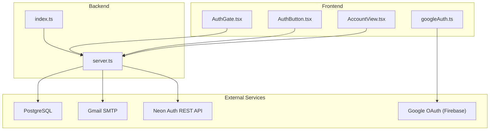
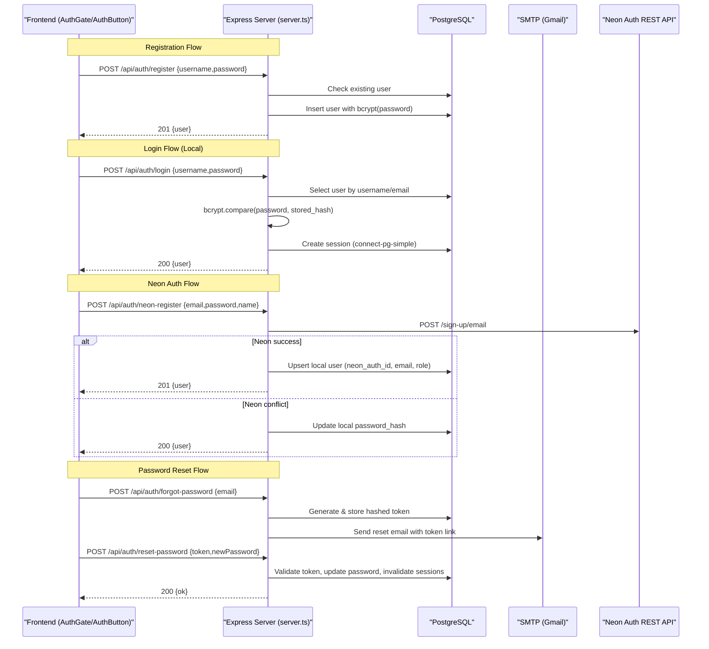
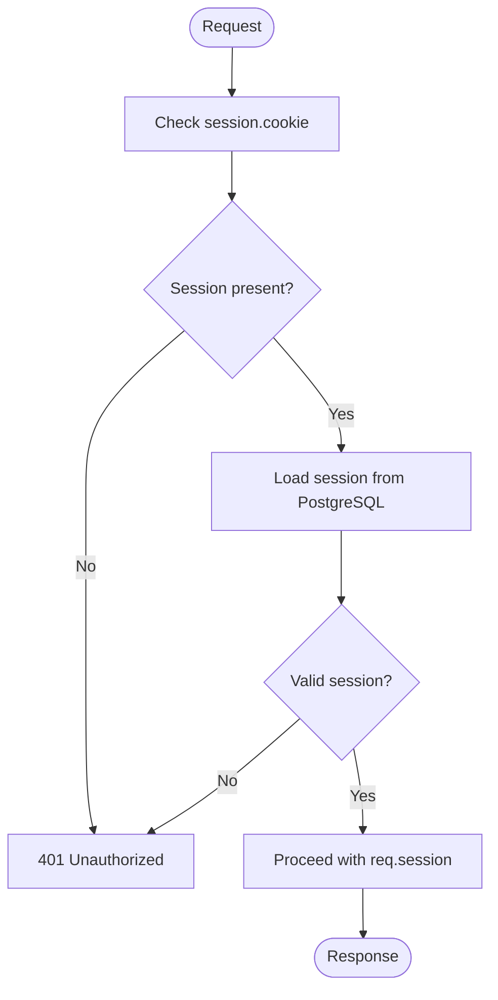
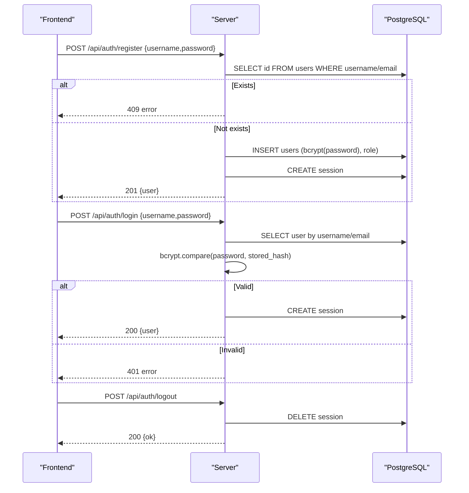
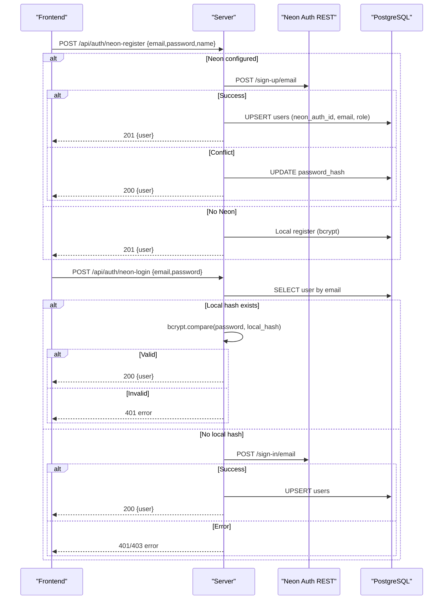
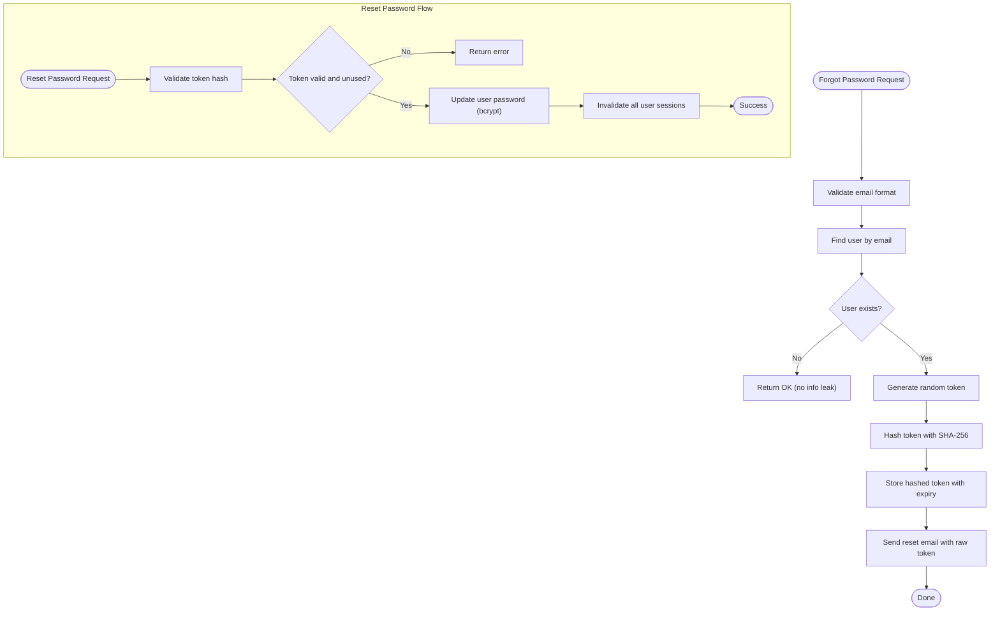
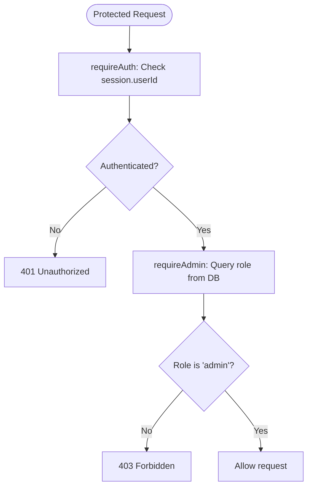
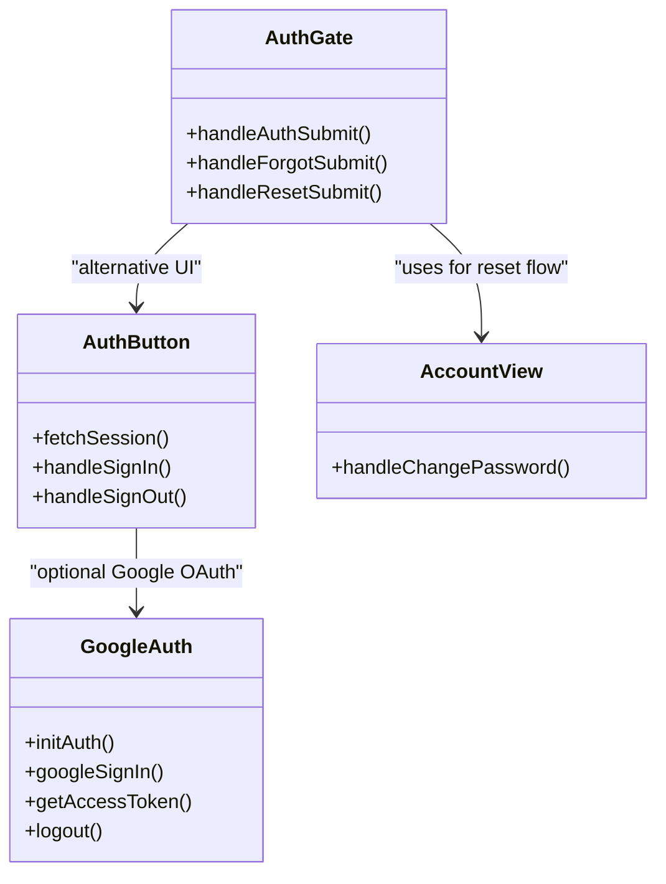
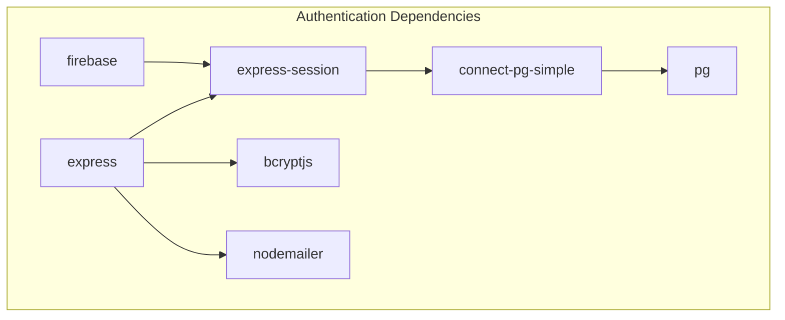

# Authentication Systems

<cite>
**Referenced Files in This Document**
- [server.ts](file://server.ts)
- [index.ts](file://index.ts)
- [package.json](file://package.json)
- [googleAuth.ts](file://src/lib/googleAuth.ts)
- [AuthGate.tsx](file://src/components/AuthGate.tsx)
- [AuthButton.tsx](file://src/components/AuthButton.tsx)
- [AccountView.tsx](file://src/components/AccountView.tsx)
</cite>

## Table of Contents
1. [Introduction](#introduction)
2. [Project Structure](#project-structure)
3. [Core Components](#core-components)
4. [Architecture Overview](#architecture-overview)
5. [Detailed Component Analysis](#detailed-component-analysis)
6. [Dependency Analysis](#dependency-analysis)
7. [Performance Considerations](#performance-considerations)
8. [Troubleshooting Guide](#troubleshooting-guide)
9. [Conclusion](#conclusion)
10. [Appendices](#appendices)

## Introduction
This document explains the multi-provider authentication system that supports:
- Local bcrypt-based authentication against a PostgreSQL users table
- Neon Auth integration via REST API for email-based sign-up and sign-in
- Session management with express-session backed by PostgreSQL using connect-pg-simple
- Role-based access control (RBAC) with admin/user roles
- Password reset workflows with secure tokens and email delivery
- Google OAuth setup on the client side using Firebase Auth
- Security best practices including secure cookies, CSRF considerations, password policies, and account lockout guidance

The server exposes REST endpoints for registration, login, logout, session introspection, forgot/reset password, and Neon Auth flows. The frontend provides UI components to drive these flows and integrate with Supabase or local endpoints as available.

## Project Structure
Key files involved in authentication and session management:
- server.ts: Express application, session configuration, auth routes, middleware, database initialization, and Neon Auth proxy logic
- index.ts: Vercel serverless entry point that initializes DB tables and exports the Express app
- package.json: Dependencies including express, express-session, connect-pg-simple, pg, bcryptjs, nodemailer
- src/lib/googleAuth.ts: Client-side Google OAuth via Firebase Auth
- src/components/AuthGate.tsx: Full-screen auth UI supporting login/register/forgot/reset flows
- src/components/AuthButton.tsx: Compact auth button/modal integrating Supabase when available, otherwise server endpoints
- src/components/AccountView.tsx: Account settings view including password change flow

**Diagram sources**
- [server.ts:1-125](file://server.ts#L1-L125)
- [index.ts:1-20](file://index.ts#L1-L20)
- [googleAuth.ts:1-60](file://src/lib/googleAuth.ts#L1-L60)
- [AuthGate.tsx:1-115](file://src/components/AuthGate.tsx#L1-L115)
- [AuthButton.tsx:1-123](file://src/components/AuthButton.tsx#L1-L123)
- [AccountView.tsx:1-42](file://src/components/AccountView.tsx#L1-L42)

**Section sources**
- [server.ts:1-125](file://server.ts#L1-L125)
- [index.ts:1-20](file://index.ts#L1-L20)
- [package.json:15-45](file://package.json#L15-L45)

## Core Components
- Session configuration and storage:
  - express-session with connect-pg-simple storing sessions in PostgreSQL
  - Secure cookie options: httpOnly, sameSite, production-only secure flag, maxAge
- Authentication endpoints:
  - /api/auth/register: Local username/password registration with bcrypt hashing
  - /api/auth/login: Local username/password login with bcrypt comparison
  - /api/auth/logout: Destroys session and clears cookie
  - /api/auth/me: Returns current user info and refreshes role from DB
- Neon Auth endpoints:
  - /api/auth/neon-register: Proxies sign-up to Neon Auth REST API; upserts local user; falls back to local if Neon base URL is not configured
  - /api/auth/neon-login: Fast path via local bcrypt hash; fallback to Neon Auth REST API if needed
- Password reset:
  - /api/auth/forgot-password: Generates secure token, stores hashed token, sends email
  - /api/auth/reset-password: Validates token, updates password, invalidates existing sessions
- Middleware:
  - requireAuth: Ensures session.userId exists
  - requireAdmin: Checks current role from DB and enforces admin
  - requireApiKey and requireCrmToken: Server-to-server auth helpers

**Section sources**
- [server.ts:112-125](file://server.ts#L112-L125)
- [server.ts:266-338](file://server.ts#L266-L338)
- [server.ts:340-381](file://server.ts#L340-L381)
- [server.ts:383-392](file://server.ts#L383-L392)
- [server.ts:594-680](file://server.ts#L594-L680)
- [server.ts:683-748](file://server.ts#L683-L748)
- [server.ts:753-830](file://server.ts#L753-L830)
- [server.ts:832-851](file://server.ts#L832-L851)
- [server.ts:209-235](file://server.ts#L209-L235)

## Architecture Overview
The system supports dual authentication paths:
- Local path: Username/email + password validated against bcrypt hashes stored in PostgreSQL users table
- Neon Auth path: Email/password validated via Neon Auth REST API; local user record upserted for CRM role management

Session lifecycle:
- On successful login/register, session is regenerated and persisted to PostgreSQL
- Subsequent requests validate session and optionally refresh role from DB
- Logout destroys session and clears cookie

**Diagram sources**
- [server.ts:266-338](file://server.ts#L266-L338)
- [server.ts:340-381](file://server.ts#L340-L381)
- [server.ts:594-680](file://server.ts#L594-L680)
- [server.ts:683-748](file://server.ts#L683-L748)
- [server.ts:753-830](file://server.ts#L753-L830)

## Detailed Component Analysis

### Session Management and Security Configuration
- Session store: connect-pg-simple configured with PostgreSQL pool and session table name
- Cookie settings: httpOnly enabled, secure flag set in production, sameSite lax, 7-day maxAge
- Secret: SESSION_SECRET from environment with development fallback warning
- Typed session data: userId, username, role extended into express-session types

**Diagram sources**
- [server.ts:112-125](file://server.ts#L112-L125)
- [server.ts:209-214](file://server.ts#L209-L214)

**Section sources**
- [server.ts:112-125](file://server.ts#L112-L125)
- [server.ts:209-214](file://server.ts#L209-L214)

### Local Authentication Endpoints
- Registration:
  - Validates username/email format and password length
  - Hashes password with bcrypt (cost factor 12)
  - First user becomes admin; subsequent users get role "user"
  - Regenerates session and persists to DB
- Login:
  - Accepts username or email
  - Uses constant-time bcrypt.compare to mitigate timing attacks
  - Creates session and returns user info
- Logout:
  - Destroys session and clears cookie

**Diagram sources**
- [server.ts:266-338](file://server.ts#L266-L338)
- [server.ts:340-381](file://server.ts#L340-L381)
- [server.ts:383-392](file://server.ts#L383-L392)

**Section sources**
- [server.ts:266-338](file://server.ts#L266-L338)
- [server.ts:340-381](file://server.ts#L340-L381)
- [server.ts:383-392](file://server.ts#L383-L392)

### Neon Auth Integration
- Registration:
  - If NEON_AUTH_BASE is configured, proxies to Neon Auth REST API
  - Handles conflicts (existing user) by updating local password_hash
  - Upserts local user with neon_auth_id and email
- Login:
  - Fast path: checks local bcrypt hash first
  - Fallback: calls Neon Auth REST API if no local hash
  - Upserts local user and creates session

**Diagram sources**
- [server.ts:594-680](file://server.ts#L594-L680)
- [server.ts:683-748](file://server.ts#L683-L748)

**Section sources**
- [server.ts:594-680](file://server.ts#L594-L680)
- [server.ts:683-748](file://server.ts#L683-L748)

### Password Reset Workflow
- Forgot password:
  - Validates email format
  - Generates random token, stores hashed version in password_reset_tokens
  - Sends email with reset link containing raw token
- Reset password:
  - Validates token hash and expiration
  - Updates user password with bcrypt
  - Invalidates all active sessions for the user

**Diagram sources**
- [server.ts:753-830](file://server.ts#L753-L830)

**Section sources**
- [server.ts:753-830](file://server.ts#L753-L830)

### Role-Based Access Control (RBAC)
- requireAuth middleware: Checks session.userId exists
- requireAdmin middleware: Queries current role from DB (never trusts session snapshot) and enforces admin role
- /api/auth/me endpoint: Refreshes role from DB and returns current user info

**Diagram sources**
- [server.ts:209-235](file://server.ts#L209-L235)
- [server.ts:832-851](file://server.ts#L832-L851)

**Section sources**
- [server.ts:209-235](file://server.ts#L209-L235)
- [server.ts:832-851](file://server.ts#L832-L851)

### Frontend Authentication Components
- AuthGate.tsx: Full-screen auth UI supporting login, register, forgot password, and reset password flows
- AuthButton.tsx: Compact auth component that integrates with Supabase when available, otherwise uses server endpoints
- AccountView.tsx: Account settings with password change functionality
- googleAuth.ts: Client-side Google OAuth via Firebase Auth for Google sign-in

**Diagram sources**
- [AuthGate.tsx:1-115](file://src/components/AuthGate.tsx#L1-L115)
- [AuthButton.tsx:1-123](file://src/components/AuthButton.tsx#L1-L123)
- [AccountView.tsx:1-42](file://src/components/AccountView.tsx#L1-L42)
- [googleAuth.ts:1-60](file://src/lib/googleAuth.ts#L1-L60)

**Section sources**
- [AuthGate.tsx:1-115](file://src/components/AuthGate.tsx#L1-L115)
- [AuthButton.tsx:1-123](file://src/components/AuthButton.tsx#L1-L123)
- [AccountView.tsx:1-42](file://src/components/AccountView.tsx#L1-L42)
- [googleAuth.ts:1-60](file://src/lib/googleAuth.ts#L1-L60)

## Dependency Analysis
Key dependencies for authentication and session management:
- express: Web framework
- express-session: Session management
- connect-pg-simple: PostgreSQL session store
- pg: PostgreSQL client
- bcryptjs: Password hashing
- nodemailer: Email sending for password reset
- firebase: Google OAuth integration on client

**Diagram sources**
- [package.json:15-45](file://package.json#L15-L45)

**Section sources**
- [package.json:15-45](file://package.json#L15-L45)

## Performance Considerations
- Connection pooling: PostgreSQL connections are expensive; ensure proper pool sizing based on CPU cores
- Session persistence: connect-pg-simple stores sessions in DB; monitor session table growth
- Password hashing: bcrypt cost factor 12 balances security and performance
- Neon Auth fallback: Local bcrypt check avoids unnecessary external API calls
- Database queries: Use parameterized queries and avoid N+1 patterns

[No sources needed since this section provides general guidance]

## Troubleshooting Guide
Common issues and solutions:
- TypeScript errors with Express types: Ensure proper type definitions for express-session
- Session not persisting: Verify PostgreSQL connection and session table creation
- Email not sending: Check SMTP configuration (SMTP_USER, SMTP_PASS)
- Neon Auth integration: Verify NEON_AUTH_BASE URL and network connectivity
- Password reset token expired: Tokens expire after 1 hour; users need to request new tokens

**Section sources**
- [server.ts:1-125](file://server.ts#L1-L125)
- [server.ts:753-830](file://server.ts#L753-L830)

## Conclusion
The authentication system provides robust multi-provider support with local bcrypt authentication and Neon Auth integration. Session management is secured with PostgreSQL-backed storage and proper cookie configuration. RBAC ensures proper authorization with role checks against the database. The password reset workflow includes secure token handling and email delivery. Frontend components provide flexible authentication UI with optional Google OAuth integration.

[No sources needed since this section summarizes without analyzing specific files]

## Appendices

### Environment Variables Required
- DATABASE_URL: PostgreSQL connection string
- SESSION_SECRET: Session signing secret
- SMTP_USER: Gmail SMTP username
- SMTP_PASS: Gmail SMTP password
- NEON_AUTH_BASE_URL: Neon Auth REST API base URL
- APP_URL: Application base URL for email links

### Security Best Practices
- CSRF protection: Implement CSRF tokens for state-changing operations
- Secure cookies: httpOnly, secure (production), sameSite strict/lax
- Password policies: Minimum 8 characters, complexity requirements
- Account lockout: Implement rate limiting and temporary lockouts after failed attempts
- Session security: Regenerate session IDs after authentication
- Input validation: Sanitize and validate all user inputs

[No sources needed since this section provides general guidance]