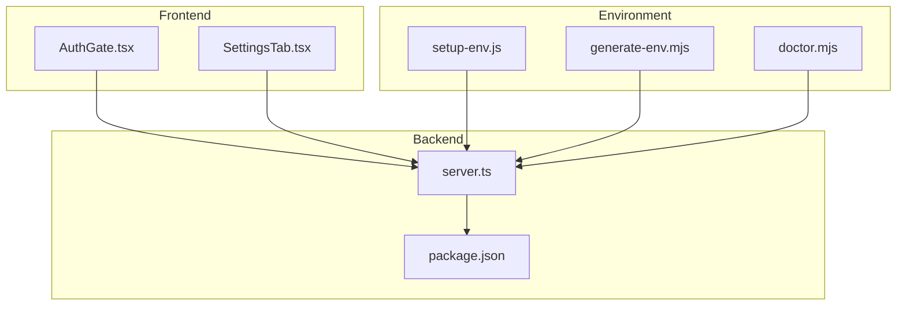
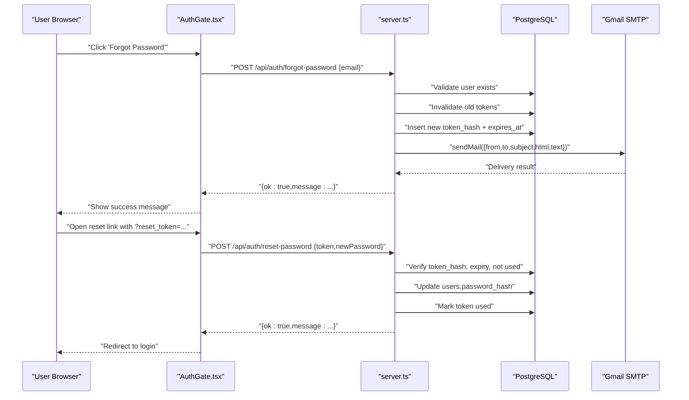
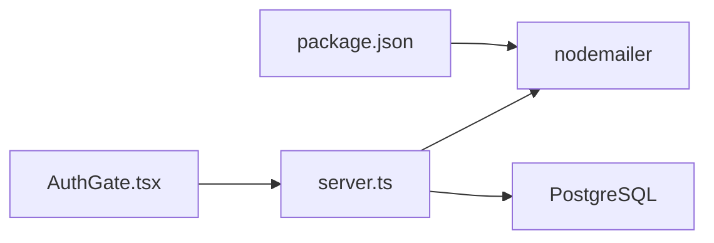

# Email Services (SMTP/Gmail)

<cite>
**Referenced Files in This Document**
- [server.ts](file://server.ts)
- [package.json](file://package.json)
- [AuthGate.tsx](file://src/components/AuthGate.tsx)
- [setup-env.js](file://scripts/setup-env.js)
- [doctor.mjs](file://scripts/doctor.mjs)
- [generate-env.mjs](file://scripts/generate-env.mjs)
- [SettingsTab.tsx](file://src/components/SettingsTab.tsx)
</cite>

## Table of Contents
1. [Introduction](#introduction)
2. [Project Structure](#project-structure)
3. [Core Components](#core-components)
4. [Architecture Overview](#architecture-overview)
5. [Detailed Component Analysis](#detailed-component-analysis)
6. [Dependency Analysis](#dependency-analysis)
7. [Performance Considerations](#performance-considerations)
8. [Troubleshooting Guide](#troubleshooting-guide)
9. [Conclusion](#conclusion)
10. [Appendices](#appendices)

## Introduction
This document explains how the application integrates email services using Gmail SMTP via nodemailer, focusing on:
- SMTP configuration for Gmail (authentication with App Passwords, TLS/STARTTLS, and port settings)
- Password reset email functionality (token generation, secure URL creation, and HTML email template rendering)
- Transport configuration, sending HTML emails, error handling, and retry logic patterns
- Security considerations for credentials storage, email validation, and spam prevention
- Troubleshooting common Gmail SMTP issues, Google rate limiting, and monitoring delivery status

The implementation is server-side only; the frontend triggers password reset flows by calling backend endpoints.

## Project Structure
Email-related code spans the Express server, environment setup scripts, and UI components that trigger the flow. Key files:
- server.ts: SMTP transport, password reset endpoints, token management, and HTML email template
- package.json: declares nodemailer dependency
- AuthGate.tsx: frontend forms for forgot/reset password flows
- setup-env.js and generate-env.mjs: environment variable scaffolding including SMTP_USER and SMTP_PASS
- doctor.mjs: diagnostic checks for SMTP configuration presence
- SettingsTab.tsx: UI references to SMTP variables and sender domains

**Diagram sources**
- [server.ts](file://server.ts)
- [package.json](file://package.json)
- [AuthGate.tsx](file://src/components/AuthGate.tsx)
- [setup-env.js](file://scripts/setup-env.js)
- [generate-env.mjs](file://scripts/generate-env.mjs)
- [doctor.mjs](file://scripts/doctor.mjs)
- [SettingsTab.tsx](file://src/components/SettingsTab.tsx)

**Section sources**
- [server.ts](file://server.ts)
- [package.json](file://package.json)
- [AuthGate.tsx](file://src/components/AuthGate.tsx)
- [setup-env.js](file://scripts/setup-env.js)
- [generate-env.mjs](file://scripts/generate-env.mjs)
- [doctor.mjs](file://scripts/doctor.mjs)
- [SettingsTab.tsx](file://src/components/SettingsTab.tsx)

## Core Components
- SMTP Transport Creation: A function builds a nodemailer transport configured for Gmail SMTP with STARTTLS on port 587 and authentication via SMTP_USER and SMTP_PASS.
- Password Reset Flow:
  - Forgot Password endpoint validates email, generates a secure token, stores a hashed token with expiration, and sends an HTML email containing a reset link.
  - Reset Password endpoint validates the token, updates the user’s password hash, marks the token as used, and invalidates active sessions.
- Frontend Integration: The AuthGate component provides forms for “Forgot Password” and “Reset Password,” posting to the corresponding API endpoints.

Key responsibilities:
- server.ts: SMTP transport, endpoints, token lifecycle, HTML template, DB interactions
- AuthGate.tsx: User input and submission for forgot/reset flows
- Environment scripts: Provide SMTP_USER and SMTP_PASS values and guidance

**Section sources**
- [server.ts](file://server.ts)
- [AuthGate.tsx](file://src/components/AuthGate.tsx)
- [setup-env.js](file://scripts/setup-env.js)
- [generate-env.mjs](file://scripts/generate-env.mjs)

## Architecture Overview
The email architecture uses a simple request-response pattern over HTTPS between the browser and the Express server, which then communicates with Gmail SMTP via nodemailer.

**Diagram sources**
- [server.ts](file://server.ts)
- [AuthGate.tsx](file://src/components/AuthGate.tsx)

## Detailed Component Analysis

### SMTP Configuration (Gmail)
- Host: smtp.gmail.com
- Port: 587
- Secure: false (uses STARTTLS)
- Authentication: user and pass from environment variables SMTP_USER and SMTP_PASS
- For Gmail, use an App Password when 2FA is enabled

Implementation highlights:
- createMailTransport() reads SMTP_USER and SMTP_PASS and returns a nodemailer transport or null if missing
- sendPasswordResetEmail() constructs a secure reset URL based on APP_URL and sends an HTML email

Security notes:
- Do not hardcode credentials; use environment variables
- Prefer App Passwords for Gmail accounts with 2FA
- Ensure APP_URL is correct so reset links point to your domain

**Section sources**
- [server.ts](file://server.ts)
- [setup-env.js](file://scripts/setup-env.js)

### Password Reset Endpoints
- POST /api/auth/forgot-password
  - Validates email format
  - Returns generic success even if email does not exist (prevents enumeration)
  - Generates a random token, hashes it with SHA-256, stores with expiration (1 hour), and sends email
- POST /api/auth/reset-password
  - Validates token length and new password strength
  - Verifies token exists, is unexpired, and unused
  - Updates password hash, marks token used, and destroys active sessions for the user

Error handling:
- Input validation errors return 400
- Token expired/used returns 400
- Database or email failures return 500 with descriptive messages

**Section sources**
- [server.ts](file://server.ts)

### HTML Email Template
- The reset email includes:
  - Responsive HTML structure with viewport meta tag
  - Dark theme styling consistent with the app
  - CTA button linking to the reset URL
  - Fallback plain text version
- The template is embedded directly in the server code for simplicity

Best practices:
- Keep templates modular and externalized for maintainability
- Use inline styles for maximum email client compatibility
- Include both HTML and text versions

**Section sources**
- [server.ts](file://server.ts)

### Frontend Integration (AuthGate.tsx)
- Detects reset_token in URL to switch to reset mode
- Submits forgot password form to /api/auth/forgot-password
- Submits reset password form to /api/auth/reset-password with token and new password
- Displays success/error states and redirects after successful reset

Validation:
- Ensures passwords match and meet minimum length
- Prevents multiple submissions while loading

**Section sources**
- [AuthGate.tsx](file://src/components/AuthGate.tsx)

### Environment Variables and Setup
- SMTP_USER and SMTP_PASS are required for Gmail SMTP
- APP_URL defines the base URL used to build reset links
- setup-env.js and generate-env.mjs scaffold .env files with keys and guidance
- doctor.mjs checks presence of SMTP credentials for diagnostics

Recommended values:
- SMTP_USER: Gmail address or service account username
- SMTP_PASS: Gmail App Password (not regular password)
- APP_URL: Public URL where the app is hosted

**Section sources**
- [setup-env.js](file://scripts/setup-env.js)
- [generate-env.mjs](file://scripts/generate-env.mjs)
- [doctor.mjs](file://scripts/doctor.mjs)

### UI References to Email Settings
- SettingsTab.tsx exposes fields for SMTP_USER and SMTP_PASS and mentions SendGrid integration
- Sender domains section helps improve deliverability by configuring authorized domains

Note: These are UI references; actual SMTP usage is handled server-side.

**Section sources**
- [SettingsTab.tsx](file://src/components/SettingsTab.tsx)

## Dependency Analysis
- nodemailer is declared in package.json and imported in server.ts to create the SMTP transport
- Express routes in server.ts depend on PostgreSQL for user and token storage
- Frontend components call backend endpoints without direct access to SMTP

**Diagram sources**
- [package.json](file://package.json)
- [server.ts](file://server.ts)

**Section sources**
- [package.json](file://package.json)
- [server.ts](file://server.ts)

## Performance Considerations
- SMTP calls are synchronous within request handlers; consider offloading to a background job queue for high volume
- Reuse nodemailer transport instances to avoid repeated connection overhead
- Cache APP_URL and SMTP config at startup to reduce environment lookups
- Implement exponential backoff and retries for transient network errors when sending emails

[No sources needed since this section provides general guidance]

## Troubleshooting Guide
Common Gmail SMTP issues:
- Authentication failed: Ensure SMTP_PASS is a Gmail App Password, not the account password
- Connection refused or timeout: Verify network allows outbound connections to smtp.gmail.com:587
- Rate limiting: Google enforces limits; implement retries with backoff and monitor quotas
- Deliverability problems: Configure SPF/DKIM/DMARC for your domain and verify sender identity

Monitoring delivery status:
- Log sendMail results and errors
- Track token issuance and usage in the database
- Add metrics for email send latency and failure rates

Diagnostic helpers:
- doctor.mjs checks presence of SMTP_USER and SMTP_PASS
- setup-env.js guides acquisition of SMTP credentials

**Section sources**
- [doctor.mjs](file://scripts/doctor.mjs)
- [setup-env.js](file://scripts/setup-env.js)
- [server.ts](file://server.ts)

## Conclusion
The application implements a robust password reset flow using Gmail SMTP via nodemailer. It securely manages tokens, renders responsive HTML emails, and integrates with the frontend through clear API endpoints. Following the security and performance recommendations will ensure reliable delivery and safe operation in production.

[No sources needed since this section summarizes without analyzing specific files]

## Appendices

### SMTP Configuration Reference
- Host: smtp.gmail.com
- Port: 587
- Secure: false (STARTTLS)
- Auth: user = SMTP_USER, pass = SMTP_PASS (Gmail App Password recommended)
- Base URL: APP_URL used to construct reset links

**Section sources**
- [server.ts](file://server.ts)
- [setup-env.js](file://scripts/setup-env.js)

### Security Checklist
- Store SMTP_USER and SMTP_PASS in environment variables only
- Use Gmail App Passwords for accounts with 2FA
- Validate all inputs (email format, password strength)
- Hash tokens before storing and enforce expiration
- Invalidate active sessions upon password reset
- Avoid exposing sensitive data in logs

**Section sources**
- [server.ts](file://server.ts)
- [setup-env.js](file://scripts/setup-env.js)

### Error Handling Patterns
- Return appropriate HTTP status codes (400 for bad input, 401/403 for auth issues, 500 for server errors)
- Provide user-friendly messages without leaking internal details
- Log detailed errors server-side for debugging

**Section sources**
- [server.ts](file://server.ts)