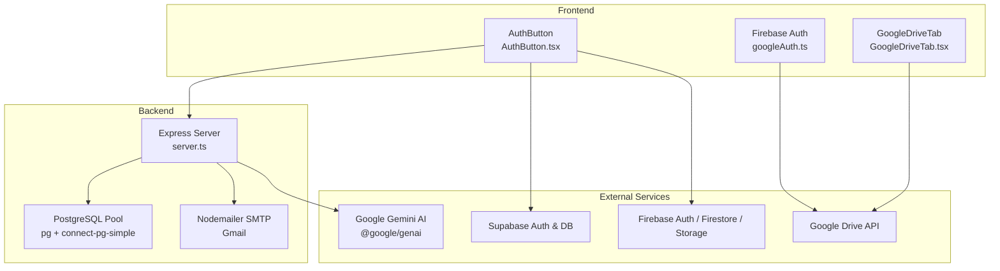
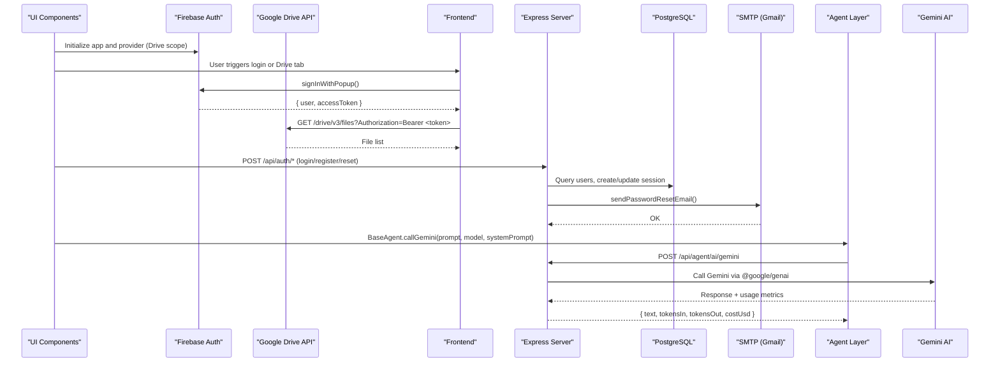
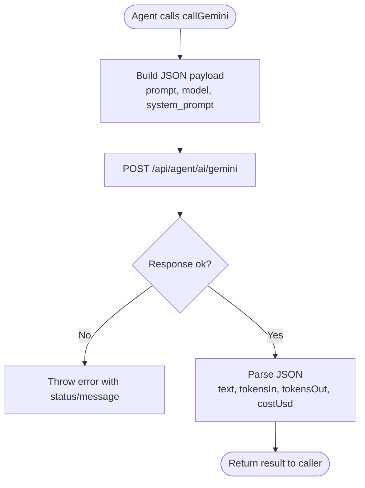
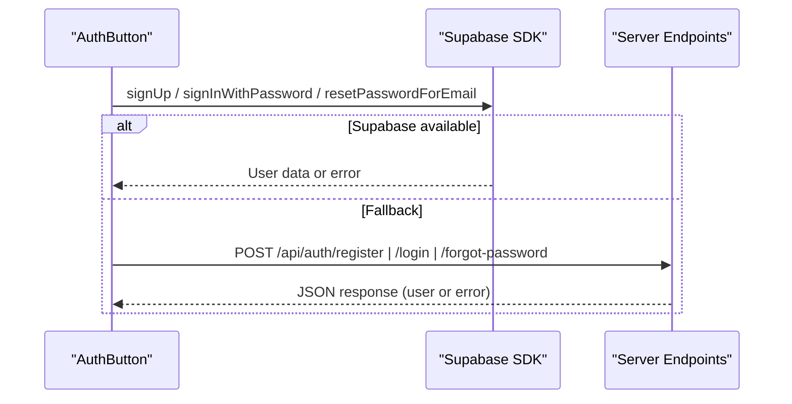
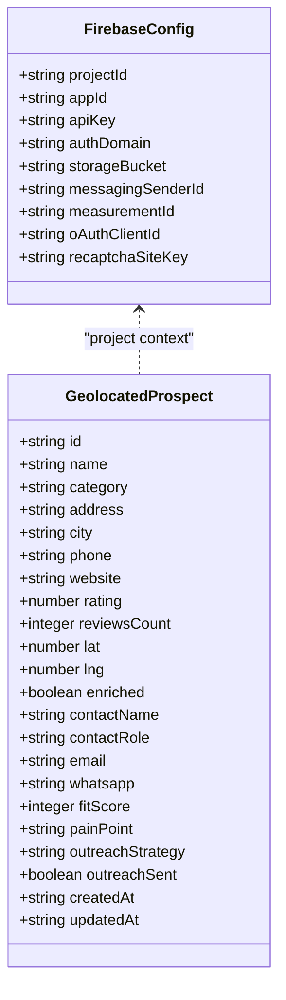
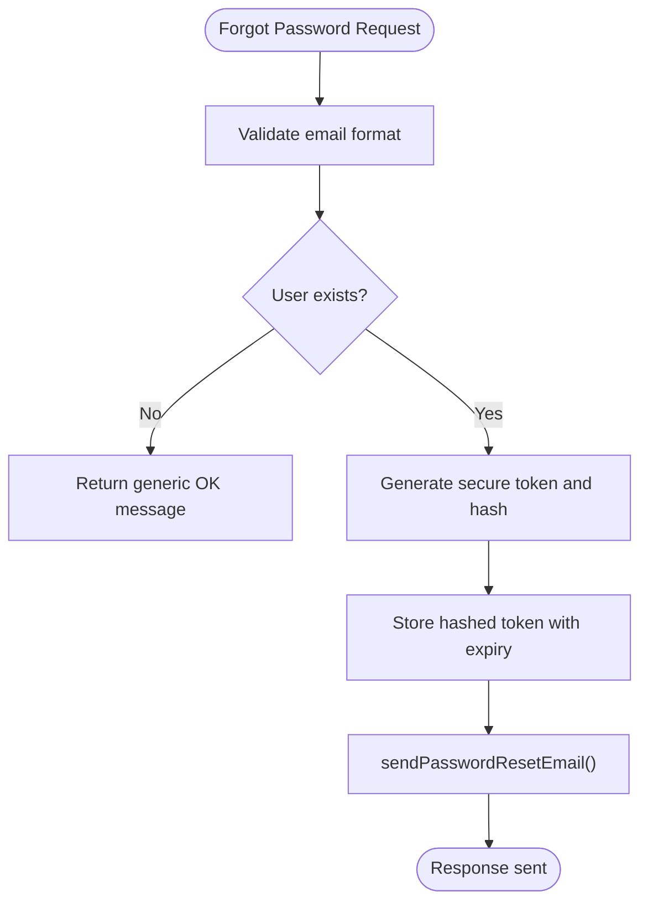
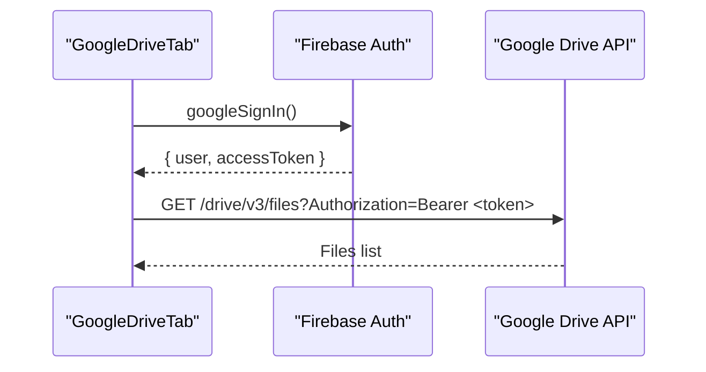
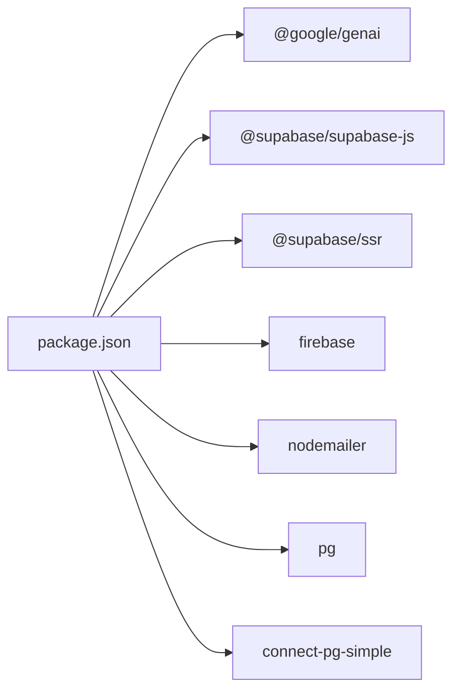

# External Integrations

<cite>
**Referenced Files in This Document**
- [package.json](file://package.json)
- [firebase-applet-config.json](file://firebase-applet-config.json)
- [firebase-blueprint.json](file://firebase-blueprint.json)
- [firestore.rules](file://firestore.rules)
- [server.ts](file://server.ts)
- [api/index.ts](file://api/index.ts)
- [src/lib/googleAuth.ts](file://src/lib/googleAuth.ts)
- [src/components/GoogleDriveTab.tsx](file://src/components/GoogleDriveTab.tsx)
- [src/components/AuthButton.tsx](file://src/components/AuthButton.tsx)
- [src/agents/base.ts](file://src/agents/base.ts)
- [scripts/setup-env.js](file://scripts/setup-env.js)
</cite>

## Table of Contents
1. Introduction
2. Project Structure
3. Core Components
4. Architecture Overview
5. Detailed Component Analysis
6. Dependency Analysis
7. Performance Considerations
8. Troubleshooting Guide
9. Conclusion

## Introduction
This document provides comprehensive documentation for all external service integrations used by the ClientumLatam platform. It covers:
- Google Gemini AI API integration (authentication, prompt engineering best practices, cost optimization)
- Supabase integration for authentication and database operations
- Firebase services configuration (Auth, Firestore, Storage)
- SMTP email delivery via Gmail
- Google Drive integration using a user-scoped access token

It includes configuration examples, error handling patterns, rate limiting considerations, and troubleshooting guidance for each integration.

## Project Structure
The project integrates multiple external services across frontend and backend layers:
- Frontend uses Firebase Auth to obtain a Google access token for Google Drive and supports Supabase auth for email/password flows.
- Backend is an Express server that handles sessions, PostgreSQL persistence, email sending via nodemailer, and proxies AI requests to internal agent endpoints.
- Configuration files define Firebase project settings and Firestore schema/rules. Environment setup scripts guide credential acquisition.

**Diagram sources**
- [src/lib/googleAuth.ts:1-60](file://src/lib/googleAuth.ts#L1-L60)
- [src/components/GoogleDriveTab.tsx:1-104](file://src/components/GoogleDriveTab.tsx#L1-L104)
- [src/components/AuthButton.tsx:1-384](file://src/components/AuthButton.tsx#L1-L384)
- [server.ts:1-200](file://server.ts#L1-L200)
- [package.json:15-46](file://package.json#L15-L46)

**Section sources**
- [package.json:15-46](file://package.json#L15-L46)
- [firebase-applet-config.json:1-12](file://firebase-applet-config.json#L1-L12)
- [firebase-blueprint.json:1-41](file://firebase-blueprint.json#L1-L41)
- [firestore.rules:1-9](file://firestore.rules#L1-L9)
- [server.ts:1-200](file://server.ts#L1-L200)

## Core Components
- Google Gemini AI Integration: Agents call a server endpoint that proxies to Gemini via @google/genai. The base agent tracks tokens and cost.
- Supabase Authentication: Frontend uses Supabase SDK for email/password sign-up/sign-in and password reset; fallback to server endpoints when not available.
- Firebase Services: Firebase App initialization and Google provider with Drive scope; Firestore blueprint and rules are present.
- SMTP Email Service: Nodemailer configured for Gmail SMTP with environment-driven credentials.
- Google Drive Integration: User-initiated OAuth flow via Firebase Auth returns an access token used to call Google Drive API directly from the browser.

**Section sources**
- [src/agents/base.ts:173-192](file://src/agents/base.ts#L173-L192)
- [src/components/AuthButton.tsx:103-162](file://src/components/AuthButton.tsx#L103-L162)
- [src/lib/googleAuth.ts:1-60](file://src/lib/googleAuth.ts#L1-L60)
- [src/components/GoogleDriveTab.tsx:1-104](file://src/components/GoogleDriveTab.tsx#L1-L104)
- [server.ts:131-207](file://server.ts#L131-L207)

## Architecture Overview
The system combines client-side authentication and direct API calls with server-side orchestration and secure storage/email operations.

**Diagram sources**
- [src/lib/googleAuth.ts:1-60](file://src/lib/googleAuth.ts#L1-L60)
- [src/components/GoogleDriveTab.tsx:43-56](file://src/components/GoogleDriveTab.tsx#L43-L56)
- [server.ts:131-207](file://server.ts#L131-L207)
- [src/agents/base.ts:173-192](file://src/agents/base.ts#L173-L192)

## Detailed Component Analysis

### Google Gemini AI API Integration
- Authentication: The backend imports @google/genai and exposes an internal endpoint for agents to call. Agents use BaseAgent.callGemini which posts to /api/agent/ai/gemini with prompt, model, and optional system_prompt.
- Prompt Engineering Best Practices:
  - Use concise, specific prompts and include system_prompt where applicable.
  - Prefer structured outputs and explicit instructions to reduce hallucinations.
  - Keep prompts within model limits to minimize cost and latency.
- Cost Optimization Strategies:
  - Choose efficient models (e.g., flash variants) for high-volume tasks.
  - Cache repeated responses at the application layer when appropriate.
  - Track tokens and cost via agent telemetry to monitor spend.
- Error Handling:
  - Agents throw errors on non-ok responses and surface error messages.
  - Implement retries with exponential backoff in higher-level orchestrators.
- Rate Limiting:
  - Respect provider quotas; implement client-side throttling and queueing if needed.
  - Monitor usage logs and adjust concurrency accordingly.

**Diagram sources**
- [src/agents/base.ts:173-192](file://src/agents/base.ts#L173-L192)

**Section sources**
- [src/agents/base.ts:173-192](file://src/agents/base.ts#L173-L192)
- [package.json:15-20](file://package.json#L15-L20)

### Supabase Integration (Authentication and Database Operations)
- Authentication Flow:
  - Frontend uses Supabase SDK for email/password sign-up, sign-in, and password reset when available.
  - Fallback to server endpoints (/api/auth/login, /api/auth/register, /api/auth/forgot-password) when Supabase is unavailable.
- Database Operations:
  - Supabase Postgres is referenced in skills and best practices; actual server-side DB usage is via pg pool.
  - RLS and security guidelines are documented in skill references.
- Error Handling:
  - Errors from Supabase are surfaced to the UI; server endpoints return standardized JSON errors.
- Rate Limiting:
  - Apply Supabase rate limits and consider caching frequent reads.
- Configuration:
  - Ensure Supabase publishable keys are used in frontend; never expose service_role keys.

**Diagram sources**
- [src/components/AuthButton.tsx:103-162](file://src/components/AuthButton.tsx#L103-L162)
- [server.ts:266-381](file://server.ts#L266-L381)

**Section sources**
- [src/components/AuthButton.tsx:103-162](file://src/components/AuthButton.tsx#L103-L162)
- [server.ts:266-381](file://server.ts#L266-L381)

### Firebase Services Configuration
- Initialization:
  - Firebase app is initialized with config from firebase-applet-config.json.
  - GoogleAuthProvider is configured with Drive scope for file access.
- Firestore Schema and Rules:
  - firestore-blueprint.json defines entity schemas and collection paths.
  - firestore.rules currently allow read/write for all documents (needs tightening).
- Security Recommendations:
  - Restrict Firestore rules to authenticated users and enforce ownership checks.
  - Avoid exposing sensitive keys in client code.

**Diagram sources**
- [firebase-applet-config.json:1-12](file://firebase-applet-config.json#L1-L12)
- [firebase-blueprint.json:1-41](file://firebase-blueprint.json#L1-L41)

**Section sources**
- [src/lib/googleAuth.ts:1-60](file://src/lib/googleAuth.ts#L1-L60)
- [firebase-applet-config.json:1-12](file://firebase-applet-config.json#L1-L12)
- [firebase-blueprint.json:1-41](file://firebase-blueprint.json#L1-L41)
- [firestore.rules:1-9](file://firestore.rules#L1-L9)

### SMTP Email Service Setup (Gmail)
- Configuration:
  - Nodemailer transport is created using SMTP_USER and SMTP_PASS environment variables.
  - Host is smtp.gmail.com with STARTTLS on port 587.
- Usage:
  - Password reset emails are sent via sendPasswordResetEmail with HTML and plain text templates.
- Error Handling:
  - If SMTP credentials are missing, functions throw descriptive errors.
  - Server endpoints catch and return standardized error responses.
- Rate Limiting:
  - Gmail SMTP has per-day sending limits; implement queuing and retry logic for bulk campaigns.

**Diagram sources**
- [server.ts:131-207](file://server.ts#L131-L207)
- [server.ts:750-791](file://server.ts#L750-L791)

**Section sources**
- [server.ts:131-207](file://server.ts#L131-L207)
- [server.ts:750-791](file://server.ts#L750-L791)

### Google Drive Integration
- Authentication:
  - Firebase Auth popup obtains a Google access token with Drive scope.
  - Token is cached and reused until logout.
- API Calls:
  - Direct fetch to Google Drive v3 API with Authorization header.
- Error Handling:
  - Network errors and permission issues are caught and logged.
- Rate Limiting:
  - Respect Drive API quotas; paginate results and cache listings.

**Diagram sources**
- [src/lib/googleAuth.ts:1-60](file://src/lib/googleAuth.ts#L1-L60)
- [src/components/GoogleDriveTab.tsx:43-56](file://src/components/GoogleDriveTab.tsx#L43-L56)

**Section sources**
- [src/lib/googleAuth.ts:1-60](file://src/lib/googleAuth.ts#L1-L60)
- [src/components/GoogleDriveTab.tsx:1-104](file://src/components/GoogleDriveTab.tsx#L1-L104)

## Dependency Analysis
External dependencies relevant to integrations:
- @google/genai: Used for Gemini AI interactions.
- @supabase/supabase-js and @supabase/ssr: Supabase client libraries.
- firebase: Firebase SDK for Auth and other services.
- nodemailer: SMTP email delivery.
- pg and connect-pg-simple: PostgreSQL connection and session store.

**Diagram sources**
- [package.json:15-46](file://package.json#L15-L46)

**Section sources**
- [package.json:15-46](file://package.json#L15-L46)

## Performance Considerations
- Gemini AI:
  - Use smaller models for high-throughput tasks; batch prompts where possible.
  - Cache frequent responses and avoid redundant calls.
- Supabase:
  - Leverage indexes and RLS policies to optimize queries.
  - Minimize client-side network calls by batching updates.
- Firebase:
  - Keep Firestore rules tight to reduce unnecessary reads/writes.
  - Use pagination and selective fields in Drive API calls.
- SMTP:
  - Queue emails and implement retries with exponential backoff.
  - Monitor bounce rates and throttle sends during high volume.

[No sources needed since this section provides general guidance]

## Troubleshooting Guide
- Gemini AI:
  - Check server logs for non-ok responses and error messages from the agent layer.
  - Verify model names and system prompts; ensure tokens are within limits.
- Supabase:
  - Confirm publishable keys are set; ensure RLS policies allow intended operations.
  - For password reset, verify redirect URLs and email templates.
- Firebase:
  - Validate firebase-applet-config.json values; ensure Drive scope is added.
  - Review firestore.rules for overly permissive access.
- SMTP:
  - Ensure SMTP_USER and SMTP_PASS are correct; test connectivity to smtp.gmail.com.
  - Check Gmail App Passwords and account security settings.
- Google Drive:
  - Confirm user granted Drive scope; re-authenticate if token is invalid.
  - Inspect network errors and quota exceeded responses.

**Section sources**
- [src/agents/base.ts:173-192](file://src/agents/base.ts#L173-L192)
- [src/components/AuthButton.tsx:103-162](file://src/components/AuthButton.tsx#L103-L162)
- [src/lib/googleAuth.ts:1-60](file://src/lib/googleAuth.ts#L1-L60)
- [src/components/GoogleDriveTab.tsx:43-56](file://src/components/GoogleDriveTab.tsx#L43-L56)
- [server.ts:131-207](file://server.ts#L131-L207)
- [firestore.rules:1-9](file://firestore.rules#L1-L9)

## Conclusion
ClientumLatam integrates multiple external services to deliver AI-powered features, robust authentication, email delivery, and cloud storage capabilities. By following the configurations, error handling patterns, and performance recommendations outlined here, teams can maintain reliable and cost-effective operations across Gemini AI, Supabase, Firebase, SMTP, and Google Drive.

[No sources needed since this section summarizes without analyzing specific files]