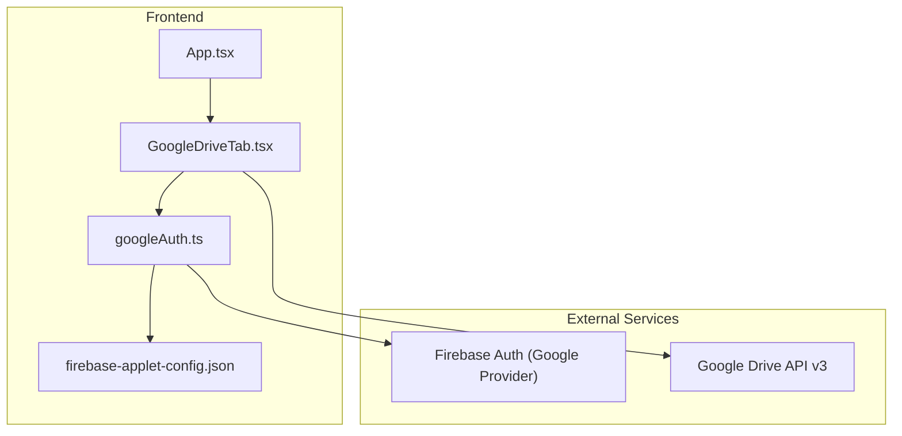
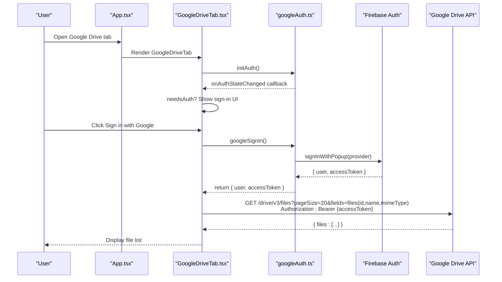
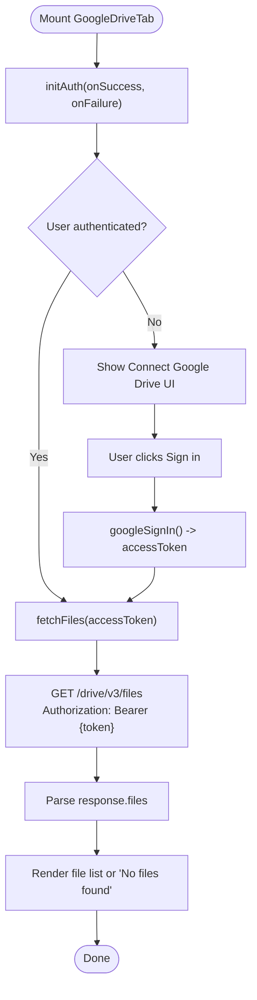
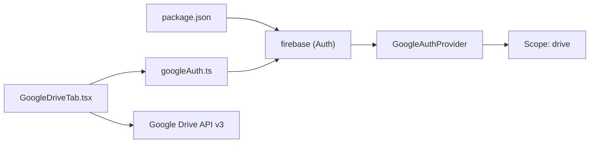

# Google Drive Integration

<cite>
**Referenced Files in This Document**
- [GoogleDriveTab.tsx](file://src/components/GoogleDriveTab.tsx)
- [googleAuth.ts](file://src/lib/googleAuth.ts)
- [firebase-applet-config.json](file://firebase-applet-config.json)
- [App.tsx](file://src/App.tsx)
- [types.ts](file://src/types.ts)
- [package.json](file://package.json)
</cite>

## Table of Contents
1. [Introduction](#introduction)
2. [Project Structure](#project-structure)
3. [Core Components](#core-components)
4. [Architecture Overview](#architecture-overview)
5. [Detailed Component Analysis](#detailed-component-analysis)
6. [Dependency Analysis](#dependency-analysis)
7. [Performance Considerations](#performance-considerations)
8. [Troubleshooting Guide](#troubleshooting-guide)
9. [Conclusion](#conclusion)
10. [Appendices](#appendices)

## Introduction
This document explains the Google Drive integration implemented in the ClientumLatam platform. It covers how users connect their Google accounts, browse Drive contents, and interact with files using Firebase Authentication and the Google Drive API. The current implementation focuses on OAuth2-based sign-in and listing files from the user’s Drive. Guidance is provided for extending the feature to support upload/download, folder navigation, metadata management, search, permissions, large file handling, error handling, and security best practices.

## Project Structure
The Google Drive feature is integrated as a tab within the application UI and uses Firebase Auth to obtain an access token that is then used to call the Google Drive API directly from the browser.



**Diagram sources**
- [App.tsx:163](file://src/App.tsx#L163)
- [GoogleDriveTab.tsx:1-104](file://src/components/GoogleDriveTab.tsx#L1-L104)
- [googleAuth.ts:1-60](file://src/lib/googleAuth.ts#L1-L60)
- [firebase-applet-config.json:1-12](file://firebase-applet-config.json#L1-L12)

**Section sources**
- [App.tsx:163](file://src/App.tsx#L163)
- [types.ts:1-35](file://src/types.ts#L1-L35)
- [GoogleDriveTab.tsx:1-104](file://src/components/GoogleDriveTab.tsx#L1-L104)
- [googleAuth.ts:1-60](file://src/lib/googleAuth.ts#L1-L60)
- [firebase-applet-config.json:1-12](file://firebase-applet-config.json#L1-L12)

## Core Components
- GoogleDriveTab component: Renders the “Connect Google Drive” flow, handles authentication state, and lists files via the Google Drive API.
- googleAuth module: Initializes Firebase, configures the Google provider with Drive scope, manages sign-in, token caching, and logout.
- Firebase configuration: Holds project credentials including the Google OAuth client ID used by Firebase Auth.

Key responsibilities:
- User consent and OAuth2 flow through Firebase Auth with Drive scope.
- Access token retrieval and caching for subsequent Drive API calls.
- Listing files from the authenticated user’s Drive.

**Section sources**
- [GoogleDriveTab.tsx:1-104](file://src/components/GoogleDriveTab.tsx#L1-L104)
- [googleAuth.ts:1-60](file://src/lib/googleAuth.ts#L1-L60)
- [firebase-applet-config.json:1-12](file://firebase-applet-config.json#L1-L12)

## Architecture Overview
The integration follows a client-side OAuth2 pattern:
- The app initializes Firebase with the provided configuration.
- The user signs in via Google, requesting the Drive scope.
- Firebase returns an access token which the app uses to call the Google Drive API directly.



**Diagram sources**
- [App.tsx:163](file://src/App.tsx#L163)
- [GoogleDriveTab.tsx:13-56](file://src/components/GoogleDriveTab.tsx#L13-L56)
- [googleAuth.ts:14-50](file://src/lib/googleAuth.ts#L14-L50)

## Detailed Component Analysis

### GoogleDriveTab Component
Responsibilities:
- Manages authentication state and UI prompts.
- Calls Google Drive API to list files with pagination parameters.
- Displays loading states and empty results.

Implementation highlights:
- Uses Firebase auth state listener to determine if the user is authenticated.
- On success, fetches files using the access token.
- Provides a disconnect action to clear the session.



**Diagram sources**
- [GoogleDriveTab.tsx:13-56](file://src/components/GoogleDriveTab.tsx#L13-L56)

**Section sources**
- [GoogleDriveTab.tsx:1-104](file://src/components/GoogleDriveTab.tsx#L1-L104)

### googleAuth Module
Responsibilities:
- Initialize Firebase app and Auth instance.
- Configure Google provider with Drive scope.
- Provide functions to sign in, get token, and log out.
- Maintain a cached access token for reuse during the session.

Implementation highlights:
- Adds the Drive scope to the provider.
- Caches the access token after successful sign-in.
- Exposes a logout function that clears the token and signs out from Firebase.

```mermaid
classDiagram
class GoogleAuth {
+initAuth(onAuthSuccess, onAuthFailure)
+googleSignIn() Promise~{user, accessToken}~
+getAccessToken() Promise~string|null~
+logout() Promise~void~
-isSigningIn boolean
-cachedAccessToken string|null
}
```

**Diagram sources**
- [googleAuth.ts:1-60](file://src/lib/googleAuth.ts#L1-L60)

**Section sources**
- [googleAuth.ts:1-60](file://src/lib/googleAuth.ts#L1-L60)

### Firebase Configuration
Contains the project-specific credentials required by Firebase Auth, including the Google OAuth client ID. This enables the sign-in popup and token issuance.

**Section sources**
- [firebase-applet-config.json:1-12](file://firebase-applet-config.json#L1-L12)

### App Integration
The Google Drive tab is wired into the main application routing so it can be selected from the sidebar and rendered when active.

**Section sources**
- [App.tsx:163](file://src/App.tsx#L163)
- [types.ts:1-35](file://src/types.ts#L1-L35)

## Dependency Analysis
The Google Drive feature depends on:
- Firebase Auth SDK for OAuth2 sign-in and token management.
- Google Drive API v3 for file operations.
- React components for UI state and rendering.



**Diagram sources**
- [package.json:33](file://package.json#L33)
- [googleAuth.ts:1-10](file://src/lib/googleAuth.ts#L1-L10)
- [GoogleDriveTab.tsx:46](file://src/components/GoogleDriveTab.tsx#L46)

**Section sources**
- [package.json:1-64](file://package.json#L1-L64)
- [googleAuth.ts:1-10](file://src/lib/googleAuth.ts#L1-L10)
- [GoogleDriveTab.tsx:46](file://src/components/GoogleDriveTab.tsx#L46)

## Performance Considerations
- Pagination: The current file listing uses a page size parameter; implement cursor-based pagination for large drives to avoid long load times and excessive memory usage.
- Field selection: Request only necessary fields to reduce payload size.
- Token caching: Reuse the cached access token within the session to minimize repeated sign-ins.
- Network retries: Implement exponential backoff for transient network errors and rate limits.
- UI responsiveness: Use loading indicators and cancel in-flight requests when navigating away.

[No sources needed since this section provides general guidance]

## Troubleshooting Guide
Common issues and resolutions:
- Authentication failures:
  - Ensure the Google OAuth client ID is correctly configured in Firebase settings.
  - Verify that the Drive scope is requested during sign-in.
  - Check browser console for popup blockers or CORS restrictions.
- Network errors:
  - Validate internet connectivity and firewall rules allowing access to Google APIs.
  - Inspect HTTP status codes and handle 401/403 by refreshing tokens or re-authenticating.
- Quota limitations:
  - Respect Google Drive API quotas; implement retry with backoff and queueing.
  - Monitor usage in the Google Cloud Console and adjust request patterns accordingly.
- Logout and disconnect:
  - Ensure logout clears the cached token and signs out from Firebase.

**Section sources**
- [googleAuth.ts:33-50](file://src/lib/googleAuth.ts#L33-L50)
- [GoogleDriveTab.tsx:43-56](file://src/components/GoogleDriveTab.tsx#L43-L56)

## Conclusion
The current Google Drive integration provides a secure, user-driven OAuth2 flow and basic file listing functionality. To fully support marketing workflows, extend the implementation to include upload/download, folder navigation, metadata editing, search, permissions, robust error handling, and performance optimizations. Follow the guidance in this document to implement these features securely and efficiently while respecting Google’s policies and rate limits.

[No sources needed since this section summarizes without analyzing specific files]

## Appendices

### Extending File Operations
- Upload files:
  - Use multipart uploads for small files and resumable uploads for large files.
  - Handle progress updates and cancellation.
- Download files:
  - Stream downloads for large files and manage temporary storage.
- Folder organization:
  - Create folders, move files between folders, and list contents recursively.
- Metadata management:
  - Update titles, descriptions, and custom properties where applicable.
- Search functionality:
  - Build queries using Drive API search parameters (name, mimeType, modifiedTime, etc.).
- Permissions:
  - Manage sharing settings and roles (viewer, commenter, editor).

[No sources needed since this section provides general guidance]

### Security Considerations
- Consent flow:
  - Always use Firebase Auth to obtain tokens; never hardcode secrets in the client.
- Scope minimization:
  - Request only the Drive scope needed for your use case.
- Token handling:
  - Store tokens in memory only; avoid persistent storage unless absolutely necessary.
- Rate limiting:
  - Implement backoff and retry logic; monitor quotas and adjust behavior.
- Data protection:
  - Avoid logging sensitive data; sanitize error messages.

[No sources needed since this section provides general guidance]