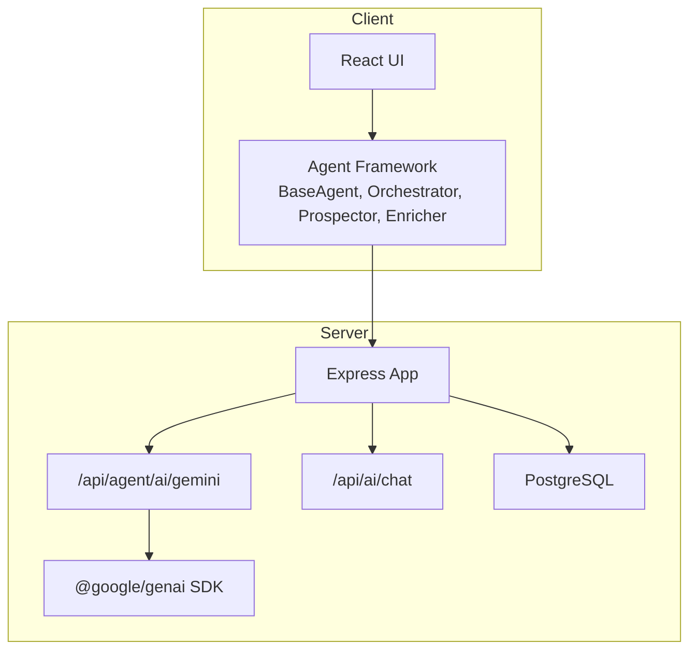
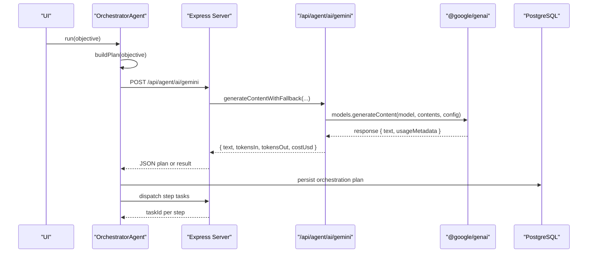
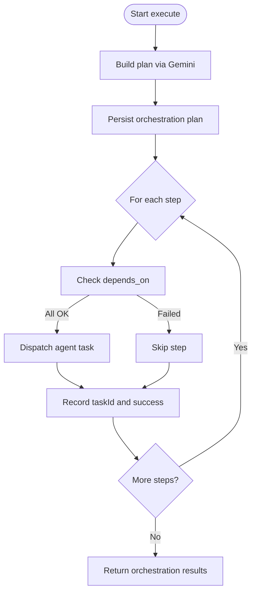
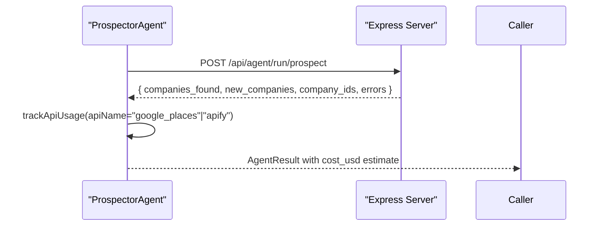
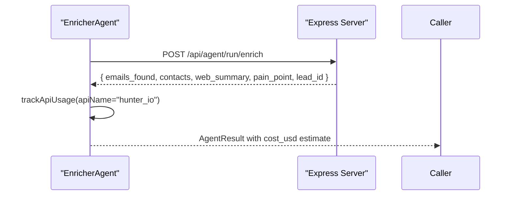
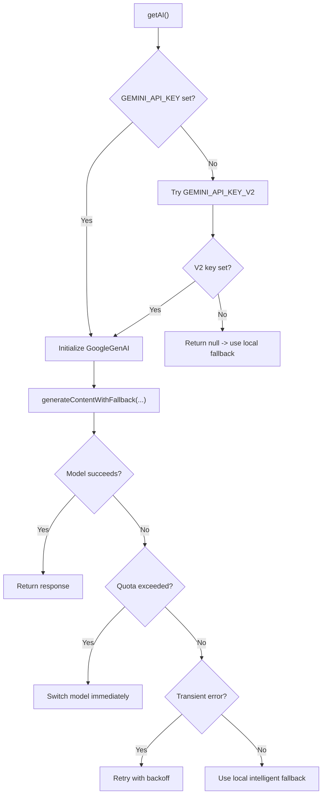
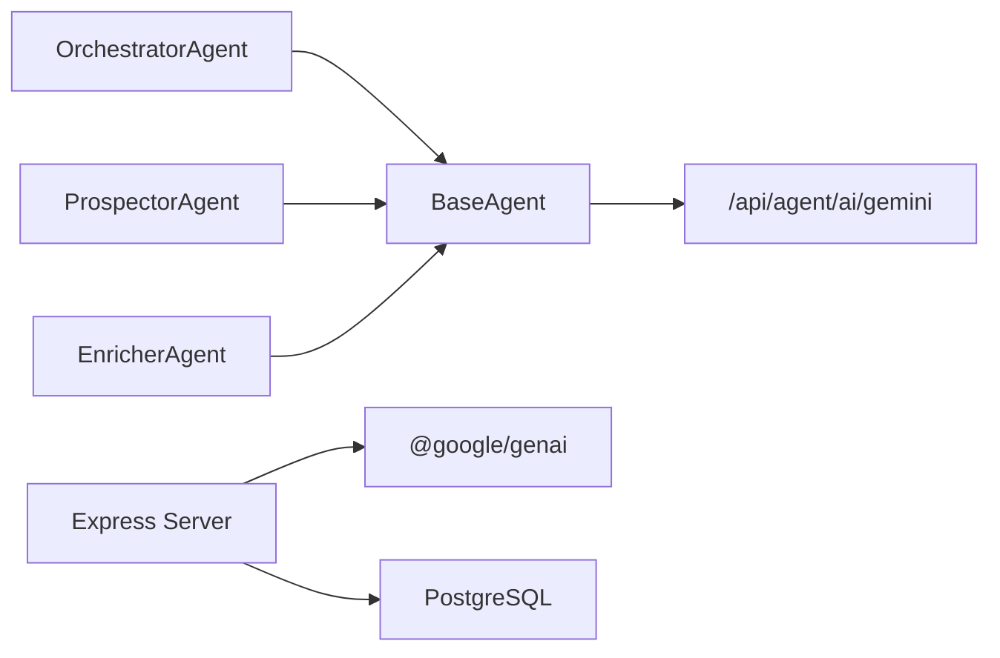

# Google Gemini AI Integration

<cite>
**Referenced Files in This Document**
- [server.ts](file://server.ts)
- [base.ts](file://src/agents/base.ts)
- [orchestrator.ts](file://src/agents/orchestrator.ts)
- [prospector.ts](file://src/agents/prospector.ts)
- [enricher.ts](file://src/agents/enricher.ts)
- [types.ts](file://src/agents/types.ts)
- [googleAuth.ts](file://src/lib/googleAuth.ts)
- [package.json](file://package.json)
</cite>

## Table of Contents
1. [Introduction](#introduction)
2. [Project Structure](#project-structure)
3. [Core Components](#core-components)
4. [Architecture Overview](#architecture-overview)
5. [Detailed Component Analysis](#detailed-component-analysis)
6. [Dependency Analysis](#dependency-analysis)
7. [Performance Considerations](#performance-considerations)
8. [Troubleshooting Guide](#troubleshooting-guide)
9. [Conclusion](#conclusion)
10. [Appendices](#appendices)

## Introduction
This document explains how the ClientumLatam platform integrates Google Gemini via the @google/genai SDK to power marketing automation agents. It covers setup and authentication, prompt engineering best practices for content generation, lead analysis, and strategy creation, and details the agent framework architecture that wraps Gemini API calls. You will find code-level references for initializing the GenAI client, making API calls with robust error handling, implementing rate limiting strategies, and optimizing costs through prompt optimization and caching.

## Project Structure
The integration spans a Node/Express server (server-side Gemini proxy and orchestration), a TypeScript-based agent framework (client-side orchestrator and specialized agents), and shared types. The key files are:
- Server entrypoint and Gemini proxy endpoints
- Base agent class with retry, logging, cost tracking, and Gemini helper
- Orchestrator agent that plans and dispatches tasks using Gemini
- Specialized agents (Prospector, Enricher) delegating to server runners
- Shared type definitions for tasks, logs, and results
- Optional Firebase-based Google Auth utility (not directly used by Gemini but present in the project)



**Diagram sources**
- [server.ts:4056-4166](file://server.ts#L4056-L4166)
- [server.ts:854-978](file://server.ts#L854-L978)
- [base.ts:173-192](file://src/agents/base.ts#L173-L192)
- [orchestrator.ts:78-144](file://src/agents/orchestrator.ts#L78-L144)

**Section sources**
- [server.ts:854-978](file://server.ts#L854-L978)
- [base.ts:173-192](file://src/agents/base.ts#L173-L192)
- [orchestrator.ts:78-144](file://src/agents/orchestrator.ts#L78-L144)
- [package.json:16](file://package.json#L16)

## Core Components
- BaseAgent: Provides task lifecycle management, retries with exponential backoff, logging, usage tracking, and a shared callGemini helper that proxies to the server’s Gemini endpoint.
- OrchestratorAgent: Parses natural-language objectives into structured execution plans via Gemini, persists plans, and dispatches steps to specialized agents.
- ProspectorAgent: Delegates company prospecting to a server runner; tracks external API usage and cost estimates.
- EnricherAgent: Delegates enrichment to a server runner; aggregates data from multiple sources and uses Gemini for pain-point analysis.
- Types: Strongly typed interfaces for tasks, logs, results, companies, leads, proposals, campaigns, and conversations.

Key responsibilities:
- Centralize Gemini access on the server for security and consistency
- Provide resilient execution with retries and fallbacks
- Track tokens, costs, and durations for observability
- Maintain clear separation between planning (Orchestrator) and execution (specialized agents)

**Section sources**
- [base.ts:18-192](file://src/agents/base.ts#L18-L192)
- [orchestrator.ts:10-178](file://src/agents/orchestrator.ts#L10-L178)
- [prospector.ts:26-71](file://src/agents/prospector.ts#L26-L71)
- [enricher.ts:32-75](file://src/agents/enricher.ts#L32-L75)
- [types.ts:1-181](file://src/agents/types.ts#L1-L181)

## Architecture Overview
The system follows an orchestrator pattern where the OrchestratorAgent builds a plan using Gemini and dispatches tasks to specialized agents. All Gemini calls go through a server-side proxy that manages credentials, retries, model selection, and fallbacks.



**Diagram sources**
- [orchestrator.ts:78-144](file://src/agents/orchestrator.ts#L78-L144)
- [server.ts:4056-4166](file://server.ts#L4056-L4166)
- [server.ts:854-978](file://server.ts#L854-L978)

## Detailed Component Analysis

### BaseAgent and Gemini Helper
BaseAgent encapsulates:
- Task creation, status updates, completion/failure reporting
- Retry loop with exponential backoff
- Logging and API usage tracking
- A protected callGemini method that posts to the server’s Gemini proxy

```mermaid
classDiagram
class BaseAgent {
+name : AgentName
+taskType : TaskType
-taskId : string|null
+run(input, options) Promise~AgentResult~
#execute(input, log) Promise~AgentResult~
-createTask(input, opts) Promise~{id}~
-updateTaskStatus(status) Promise~void~
-completeTask(result, durationMs) Promise~void~
-failTask(error, durationMs) Promise~void~
#log(action, detail, meta) Promise~void~
#trackApiUsage(opts) Promise~void~
#callGemini(prompt, opts) Promise~{text,tokensIn,tokensOut,costUsd}~
}
```

**Diagram sources**
- [base.ts:18-192](file://src/agents/base.ts#L18-L192)

**Section sources**
- [base.ts:18-192](file://src/agents/base.ts#L18-L192)

### OrchestratorAgent
Responsibilities:
- Parse objective into a structured plan using Gemini
- Persist orchestration plan
- Dispatch steps sequentially while respecting dependencies
- Return aggregated results with success/failure counts



**Diagram sources**
- [orchestrator.ts:14-76](file://src/agents/orchestrator.ts#L14-L76)
- [orchestrator.ts:78-144](file://src/agents/orchestrator.ts#L78-L144)

**Section sources**
- [orchestrator.ts:10-178](file://src/agents/orchestrator.ts#L10-L178)

### ProspectorAgent
Delegates to server runner for company discovery. Tracks usage and estimates cost based on number of companies found.



**Diagram sources**
- [prospector.ts:30-67](file://src/agents/prospector.ts#L30-L67)

**Section sources**
- [prospector.ts:26-71](file://src/agents/prospector.ts#L26-L71)

### EnricherAgent
Delegates to server runner for enrichment (emails, contacts, web summary, pain-point analysis). Tracks usage and cost.



**Diagram sources**
- [enricher.ts:36-71](file://src/agents/enricher.ts#L36-L71)

**Section sources**
- [enricher.ts:32-75](file://src/agents/enricher.ts#L32-L75)

### Server-Side Gemini Integration
The server initializes the @google/genai client lazily, enforces environment configuration, and provides a robust generation pipeline with model fallbacks and retries.

Key behaviors:
- Lazy initialization of GoogleGenAI with GEMINI_API_KEY
- Fallback to GEMINI_API_KEY_V2 if primary key is missing
- Model rotation across gemini-3.6-flash, gemini-3.1-flash-lite, and gemini-flash-latest
- Automatic retry on transient errors (503/UNAVAILABLE) and immediate switch on quota limits (429/RESOURCE_EXHAUSTED)
- Intelligent local fallback when no API key/quota is available
- Usage tracking and cost calculation based on token counts



**Diagram sources**
- [server.ts:854-978](file://server.ts#L854-L978)
- [server.ts:4056-4166](file://server.ts#L4056-L4166)

**Section sources**
- [server.ts:854-978](file://server.ts#L854-L978)
- [server.ts:4056-4166](file://server.ts#L4056-L4166)

## Dependency Analysis
- The agent framework depends on the server’s REST endpoints for task lifecycle and Gemini proxy.
- The server depends on @google/genai for Gemini interactions and PostgreSQL for persistence.
- Types define contracts between agents and server responses.



**Diagram sources**
- [base.ts:173-192](file://src/agents/base.ts#L173-L192)
- [server.ts:4056-4166](file://server.ts#L4056-L4166)
- [package.json:16](file://package.json#L16)

**Section sources**
- [base.ts:173-192](file://src/agents/base.ts#L173-L192)
- [server.ts:4056-4166](file://server.ts#L4056-L4166)
- [package.json:16](file://package.json#L16)

## Performance Considerations
- Model selection and fallback: The server rotates among multiple Gemini models and retries transient failures, improving resilience and latency under load.
- Quota-aware switching: On 429 RESOURCE_EXHAUSTED, the system immediately switches to another model rather than retrying the same one.
- Local fallback: When no API key or quota is available, the server returns structured, deterministic responses to keep pipelines functional.
- Token accounting: Usage metadata is captured and persisted to enable cost tracking and optimization.
- Prompt optimization: Use concise prompts, explicit output schemas (JSON), and system instructions to reduce token consumption and improve reliability.
- Caching: Cache repeated queries at the application layer (e.g., deduplicate identical prompts or enrichments) to avoid redundant API calls.
- Rate limiting: Implement server-side throttling around Gemini calls and external runners to respect quotas and prevent cascading failures.

[No sources needed since this section provides general guidance]

## Troubleshooting Guide
Common issues and resolutions:
- Missing or invalid GEMINI_API_KEY: The server warns and falls back to local responses. Ensure the environment variable is set and valid.
- Quota exceeded (429): The server switches models automatically; verify quota limits and consider upgrading or distributing load across models.
- Transient errors (503/UNAVAILABLE): The server retries with exponential backoff; monitor logs and adjust retry settings if necessary.
- Authentication: If using Firebase Google Auth, ensure scopes and tokens are correctly configured; note that Gemini integration uses server-side keys, not user tokens.
- Database connectivity: If PostgreSQL is unavailable, some features may degrade gracefully; check connection strings and session store configuration.

**Section sources**
- [server.ts:854-978](file://server.ts#L854-L978)
- [server.ts:4056-4166](file://server.ts#L4056-L4166)
- [googleAuth.ts:1-60](file://src/lib/googleAuth.ts#L1-L60)

## Conclusion
The ClientumLatam platform integrates Google Gemini through a robust, server-managed proxy that centralizes authentication, error handling, and cost tracking. The agent framework leverages an orchestrator pattern to translate business objectives into executable plans and delegates specialized tasks to focused agents. With built-in retries, model fallbacks, and local contingency responses, the system remains resilient under varying conditions. Following the prompt engineering and performance recommendations outlined here will help optimize costs and improve reliability across marketing automation workflows.

[No sources needed since this section summarizes without analyzing specific files]

## Appendices

### Setup and Configuration
- Install dependencies including @google/genai
- Configure environment variables:
  - GEMINI_API_KEY: Primary Gemini API key
  - GEMINI_API_KEY_V2: Fallback Gemini API key
  - DATABASE_URL: PostgreSQL connection string
  - SESSION_SECRET: Session secret
- Initialize the server and ensure database tables exist for sessions, tasks, logs, and usage metrics

**Section sources**
- [package.json:16](file://package.json#L16)
- [server.ts:854-978](file://server.ts#L854-L978)

### Code Examples References
- Initialize GenAI client and configure HTTP headers: see server initialization and getAI function
- Make API calls with error handling: see generateContentWithFallback and /api/agent/ai/gemini endpoint
- Implement rate limiting strategies: apply server-side throttling around Gemini calls and external runners
- Optimize costs through prompt optimization and caching: use concise prompts, JSON schemas, and cache repeated requests

**Section sources**
- [server.ts:854-978](file://server.ts#L854-L978)
- [server.ts:4056-4166](file://server.ts#L4056-L4166)