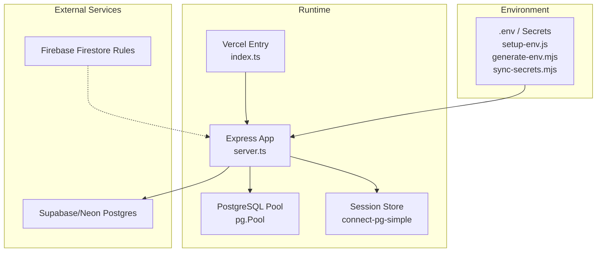
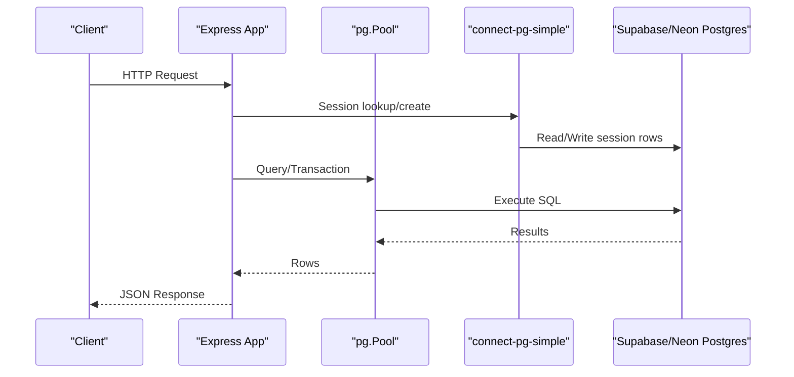
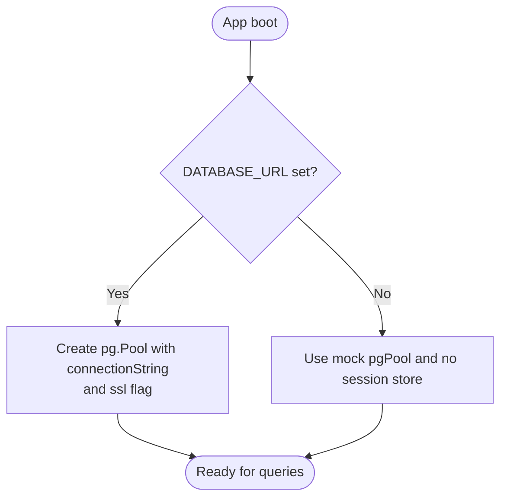
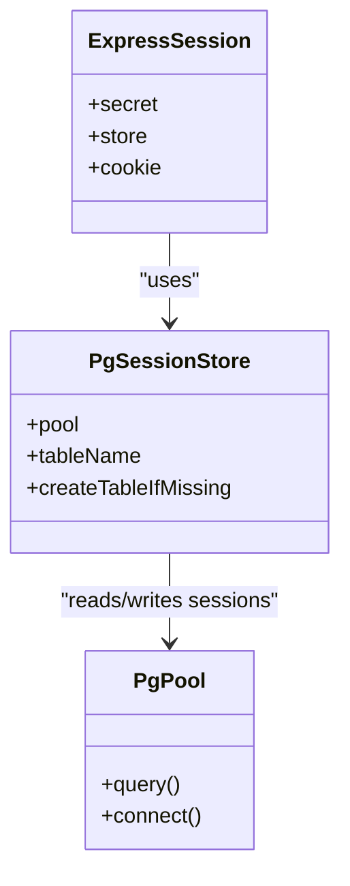
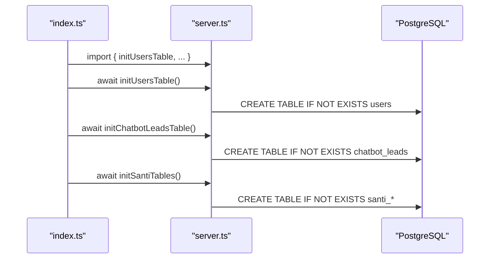
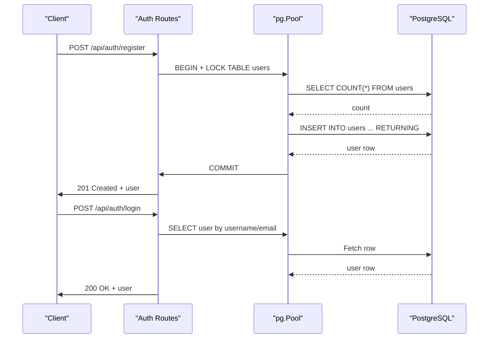
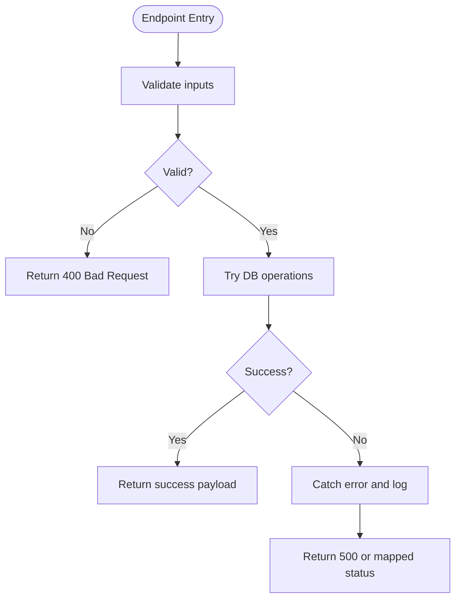
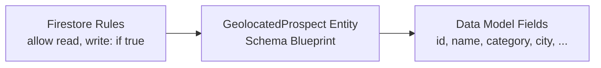
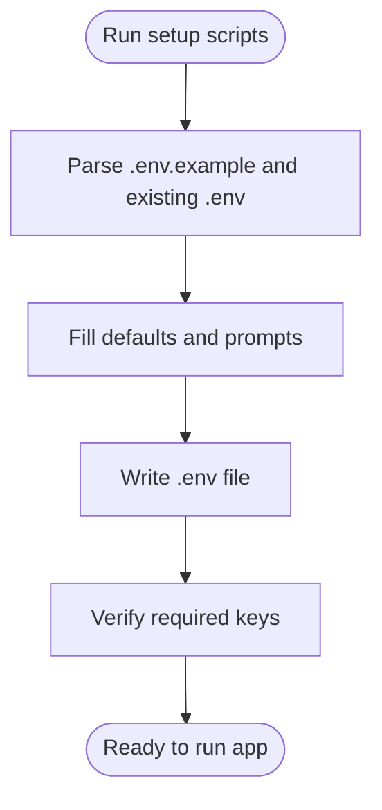
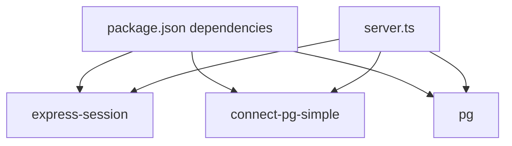

# Supabase Integration

<cite>
**Referenced Files in This Document**
- [server.ts](file://server.ts)
- [index.ts](file://index.ts)
- [package.json](file://package.json)
- [firestore.rules](file://firestore.rules)
- [firebase-blueprint.json](file://firebase-blueprint.json)
- [scripts/setup-env.js](file://scripts/setup-env.js)
- [scripts/generate-env.mjs](file://scripts/generate-env.mjs)
- [scripts/sync-secrets.mjs](file://scripts/sync-secrets.mjs)
- [src/components/AuthButton.tsx](file://src/components/AuthButton.tsx)
</cite>

## Table of Contents
1. [Introduction](#introduction)
2. [Project Structure](#project-structure)
3. [Core Components](#core-components)
4. [Architecture Overview](#architecture-overview)
5. [Detailed Component Analysis](#detailed-component-analysis)
6. [Dependency Analysis](#dependency-analysis)
7. [Performance Considerations](#performance-considerations)
8. [Troubleshooting Guide](#troubleshooting-guide)
9. [Conclusion](#conclusion)
10. [Appendices](#appendices)

## Introduction
This document explains how the ClientumLatam platform integrates with a PostgreSQL database via Supabase/Neon, including connection pooling with pg, session storage using connect-pg-simple, schema initialization, environment configuration, and fallback behavior when DATABASE_URL is not set. It also covers Firebase Firestore rules and their relationship to Supabase for data security.

## Project Structure
The server-side Express application initializes a PostgreSQL pool, configures persistent sessions, and exposes authentication endpoints. A Vercel entry point runs idempotent schema initialization on cold start. Environment setup scripts generate and validate .env variables.

**Diagram sources**
- [server.ts:1-800](file://server.ts#L1-L800)
- [index.ts:1-20](file://index.ts#L1-L20)
- [scripts/setup-env.js:1-260](file://scripts/setup-env.js#L1-L260)
- [scripts/generate-env.mjs:1-74](file://scripts/generate-env.mjs#L1-L74)
- [scripts/sync-secrets.mjs:1-51](file://scripts/sync-secrets.mjs#L1-L51)

**Section sources**
- [server.ts:1-800](file://server.ts#L1-L800)
- [index.ts:1-20](file://index.ts#L1-L20)

## Core Components
- PostgreSQL connection pool (pg.Pool) configured from DATABASE_URL with SSL toggled in production.
- Session persistence via connect-pg-simple backed by the same pg.Pool; table created automatically if missing.
- Schema initialization functions exported and invoked at startup (Vercel cold start).
- Authentication endpoints that read/write users and manage password reset tokens.
- Environment variable management for DATABASE_URL and related keys.

Key implementation references:
- Pool creation and SSL configuration
- connect-pg-simple session store wiring
- Schema init exports and invocation
- Auth endpoints and token handling

**Section sources**
- [server.ts:20-77](file://server.ts#L20-L77)
- [server.ts:112-125](file://server.ts#L112-L125)
- [server.ts:3430-3600](file://server.ts#L3430-L3600)
- [index.ts:12-19](file://index.ts#L12-L19)
- [package.json:15-45](file://package.json#L15-L45)

## Architecture Overview
The application boots an Express server, sets up middleware (JSON parsing, URL-encoded parsing, sessions), and registers API routes. Database connectivity depends on DATABASE_URL; if absent, a mock pool is used for development. Sessions are persisted in PostgreSQL when available.

**Diagram sources**
- [server.ts:1-125](file://server.ts#L1-L125)
- [server.ts:266-381](file://server.ts#L266-L381)

## Detailed Component Analysis

### PostgreSQL Connection and Pooling
- The pool is created only when DATABASE_URL is present.
- In production (NODE_ENV=production), SSL is enabled with rejectUnauthorized disabled for compatibility with managed providers.
- If DATABASE_URL is missing, a mock pool is provided to keep the app running during development.

**Diagram sources**
- [server.ts:20-77](file://server.ts#L20-L77)

**Section sources**
- [server.ts:20-77](file://server.ts#L20-L77)

### Session Storage with connect-pg-simple
- When a real pool exists, connect-pg-simple is instantiated with the shared pool and a configurable table name.
- createTableIfMissing ensures the session table is auto-created.
- Session cookie settings include httpOnly, secure (in production), sameSite, and maxAge.

**Diagram sources**
- [server.ts:112-125](file://server.ts#L112-L125)
- [server.ts:24-34](file://server.ts#L24-L34)

**Section sources**
- [server.ts:24-34](file://server.ts#L24-L34)
- [server.ts:112-125](file://server.ts#L112-L125)

### Schema Management and Initialization
- Schema initialization functions are defined and exported, then called sequentially at cold start in the Vercel entry point.
- Functions ensure tables exist before use, enabling idempotent deployments.

**Diagram sources**
- [index.ts:12-19](file://index.ts#L12-L19)
- [server.ts:3430-3600](file://server.ts#L3430-L3600)

**Section sources**
- [index.ts:12-19](file://index.ts#L12-L19)
- [server.ts:3430-3600](file://server.ts#L3430-L3600)

### Authentication Endpoints and Transactions
- Registration and login endpoints perform validation, hashing, and session creation.
- Registration uses a transaction with a table lock to ensure the first user becomes admin safely under concurrency.
- Password reset flow generates secure tokens, stores hashed tokens, and sends emails.

**Diagram sources**
- [server.ts:266-338](file://server.ts#L266-L338)
- [server.ts:340-381](file://server.ts#L340-L381)

**Section sources**
- [server.ts:266-338](file://server.ts#L266-L338)
- [server.ts:340-381](file://server.ts#L340-L381)

### Error Handling and Recovery Patterns
- All endpoints wrap logic in try/catch blocks and return consistent error responses.
- Session save failures still allow returning user data while logging errors.
- Admin role checks re-query the database per request to reflect immediate role changes.

**Diagram sources**
- [server.ts:266-338](file://server.ts#L266-L338)
- [server.ts:340-381](file://server.ts#L340-L381)

**Section sources**
- [server.ts:266-338](file://server.ts#L266-L338)
- [server.ts:340-381](file://server.ts#L340-L381)

### Firebase Firestore Rules and Integration
- Firestore rules currently allow all reads and writes globally.
- The project includes a Firestore blueprint defining entity structure for geolocated prospects.
- While Supabase handles relational data, Firestore can be used for flexible documents; enforce stricter rules in production.

**Diagram sources**
- [firestore.rules:1-9](file://firestore.rules#L1-L9)
- [firebase-blueprint.json:1-41](file://firebase-blueprint.json#L1-L41)

**Section sources**
- [firestore.rules:1-9](file://firestore.rules#L1-L9)
- [firebase-blueprint.json:1-41](file://firebase-blueprint.json#L1-L41)

### Environment Variables and Connection String Formatting
- DATABASE_URL is required for production; optional NEON_DATABASE_URL is used for deployment sync.
- SESSION_SECRET secures cookies; SMTP_USER/SMTP_PASS enable email sending.
- Scripts generate and verify .env entries, prompting for guidance where needed.

**Diagram sources**
- [scripts/setup-env.js:1-260](file://scripts/setup-env.js#L1-L260)
- [scripts/generate-env.mjs:1-74](file://scripts/generate-env.mjs#L1-L74)
- [scripts/sync-secrets.mjs:23-51](file://scripts/sync-secrets.mjs#L23-L51)

**Section sources**
- [scripts/setup-env.js:1-260](file://scripts/setup-env.js#L1-L260)
- [scripts/generate-env.mjs:1-74](file://scripts/generate-env.mjs#L1-L74)
- [scripts/sync-secrets.mjs:23-51](file://scripts/sync-secrets.mjs#L23-L51)

### Example Queries and Transaction Usage
- User registration performs a locked transaction to determine admin role and insert the first user atomically.
- Login queries select user credentials and compare hashes securely.
- Password reset inserts hashed tokens with expiration and invalidates previous tokens.

References:
- Registration transaction and locking
- Login query and hash comparison
- Reset token generation and insertion

**Section sources**
- [server.ts:296-316](file://server.ts#L296-L316)
- [server.ts:348-359](file://server.ts#L348-L359)
- [server.ts:753-791](file://server.ts#L753-L791)

### SSL Configuration for Production
- SSL is enabled when NODE_ENV equals production; the configuration disables certificate verification for compatibility with certain managed databases.
- Ensure your provider supports this setting or configure proper CA trust.

**Section sources**
- [server.ts:24-28](file://server.ts#L24-L28)

### Frontend Auth Flow and Supabase Integration
- The frontend component attempts to use Supabase auth when available; otherwise it falls back to server-side endpoints.
- Forgot-password flow prefers Supabase client but reverts to server endpoint if SDK is unavailable.

**Section sources**
- [src/components/AuthButton.tsx:79-101](file://src/components/AuthButton.tsx#L79-L101)

## Dependency Analysis
The runtime depends on express-session, connect-pg-simple, and pg. These are declared in package.json and wired in server.ts.

**Diagram sources**
- [package.json:15-45](file://package.json#L15-L45)
- [server.ts:1-20](file://server.ts#L1-L20)

**Section sources**
- [package.json:15-45](file://package.json#L15-L45)
- [server.ts:1-20](file://server.ts#L1-L20)

## Performance Considerations
- Use connection pooling (already implemented via pg.Pool) to handle concurrent requests efficiently.
- Keep transactions short to minimize lock contention.
- Prefer parameterized queries to avoid injection and leverage prepared statements appropriately.
- Monitor idle connections and timeouts; tune pool sizes based on CPU cores and workload.

[No sources needed since this section provides general guidance]

## Troubleshooting Guide
Common issues and resolutions:
- Missing DATABASE_URL: The app logs a warning and runs with a mock pool; set DATABASE_URL to enable real DB features.
- Session store not initialized: Without a pool, sessions are not persisted; ensure DATABASE_URL is set in production.
- SSL handshake failures: Confirm SSL settings match your provider’s requirements; adjust certificate trust or disable verification carefully.
- Email not sent: Verify SMTP_USER and SMTP_PASS are configured.
- Firestore rules too permissive: Tighten rules to restrict access by user identity and ownership.

**Section sources**
- [server.ts:36-77](file://server.ts#L36-L77)
- [server.ts:112-125](file://server.ts#L112-L125)
- [server.ts:24-28](file://server.ts#L24-L28)

## Conclusion
The ClientumLatam platform integrates Supabase/Neon PostgreSQL through a robust pg.Pool-based connection strategy, persistent sessions via connect-pg-simple, and idempotent schema initialization. Environment configuration is streamlined with helper scripts, and authentication flows support both local bcrypt and external Neon Auth. Firestore rules are currently open and should be hardened for production. Following the best practices outlined here will improve reliability, performance, and security.

[No sources needed since this section summarizes without analyzing specific files]

## Appendices

### Environment Variables Reference
- DATABASE_URL: PostgreSQL connection string (required for production)
- NEON_DATABASE_URL: Alternative connection string for deployment environments
- SESSION_SECRET: Secret used to sign session cookies
- SMTP_USER / SMTP_PASS: Credentials for email delivery
- APP_URL: Public base URL for links and callbacks

**Section sources**
- [scripts/setup-env.js:40-84](file://scripts/setup-env.js#L40-L84)
- [scripts/generate-env.mjs:10-25](file://scripts/generate-env.mjs#L10-L25)
- [scripts/sync-secrets.mjs:23-51](file://scripts/sync-secrets.mjs#L23-L51)