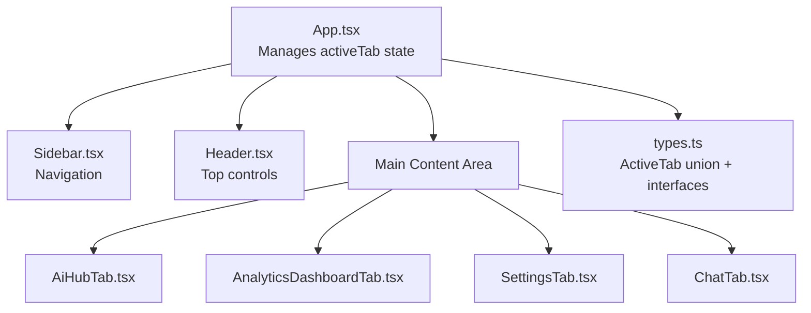
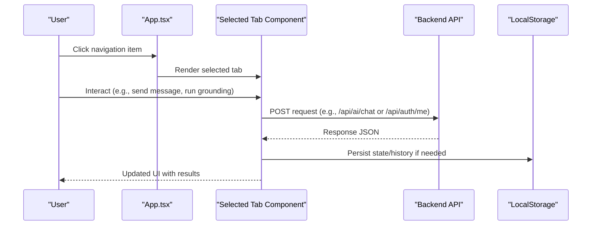
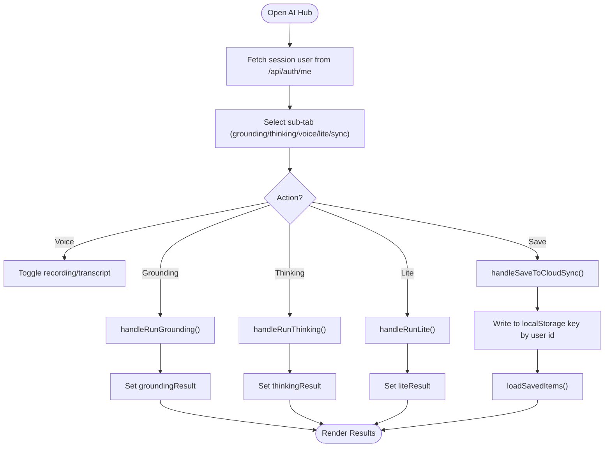
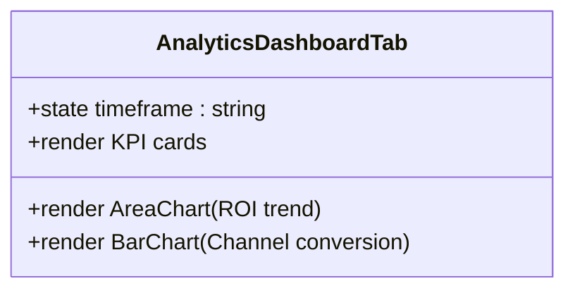
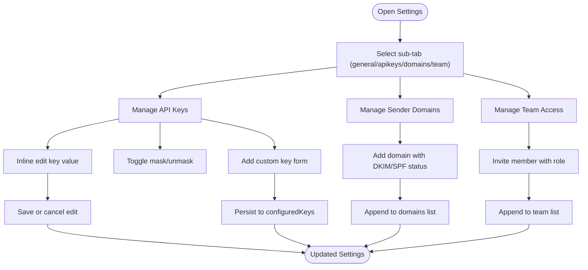
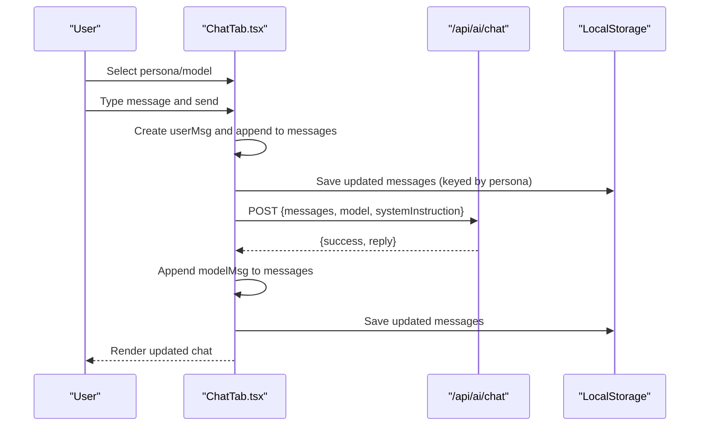
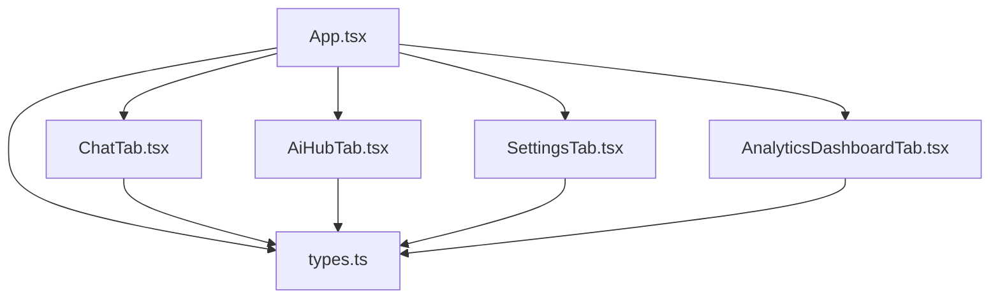

# Feature Components

<cite>
**Referenced Files in This Document**
- [App.tsx](file://src/App.tsx)
- [types.ts](file://src/types.ts)
- [AiHubTab.tsx](file://src/components/AiHubTab.tsx)
- [AnalyticsDashboardTab.tsx](file://src/components/AnalyticsDashboardTab.tsx)
- [SettingsTab.tsx](file://src/components/SettingsTab.tsx)
- [ChatTab.tsx](file://src/components/ChatTab.tsx)
</cite>

## Table of Contents
1. [Introduction](#introduction)
2. [Project Structure](#project-structure)
3. [Core Components](#core-components)
4. [Architecture Overview](#architecture-overview)
5. [Detailed Component Analysis](#detailed-component-analysis)
6. [Dependency Analysis](#dependency-analysis)
7. [Performance Considerations](#performance-considerations)
8. [Troubleshooting Guide](#troubleshooting-guide)
9. [Conclusion](#conclusion)

## Introduction
This document provides comprehensive documentation for the feature-specific tab components that implement the application’s core functionality. It focuses on:
- AI Hub component’s chat interface and AI interaction patterns
- Analytics Dashboard’s data visualization and real-time update behavior
- Settings component’s configuration management and persistence
- Chat component’s messaging interface and API integration
- Email Campaigns component’s campaign management features (noted as referenced but not present in current codebase)

The goal is to explain props, state management, API integrations, and user interaction patterns with concrete references to source files.

## Project Structure
The application is a React-based dashboard where tabs are rendered conditionally based on an active tab state managed at the app level. The following diagram shows how the main app wires tab components into the UI.

**Diagram sources**
- [App.tsx:109-164](file://src/App.tsx#L109-L164)
- [types.ts:1-35](file://src/types.ts#L1-L35)

**Section sources**
- [App.tsx:1-177](file://src/App.tsx#L1-L177)
- [types.ts:1-35](file://src/types.ts#L1-L35)

## Core Components
- AI Hub Tab: Provides multiple sub-tabs for grounding, high thinking mode, voice conversations, low-latency responses, and local cloud sync. Uses local state and simulated backend calls; supports saving logs per user via localStorage keyed by user id.
- Analytics Dashboard Tab: Displays KPI cards and charts using Recharts; includes time frame selection and static sample datasets.
- Settings Tab: Manages API keys and integrations grouped by categories, sender domains, and team access; supports inline editing, masking/unmasking keys, and adding custom entries.
- Chat Tab: Implements a multi-agent chat interface with persona selection, model selection, message history persisted per persona in localStorage, and POST requests to /api/ai/chat.

**Section sources**
- [AiHubTab.tsx:1-565](file://src/components/AiHubTab.tsx#L1-L565)
- [AnalyticsDashboardTab.tsx:1-149](file://src/components/AnalyticsDashboardTab.tsx#L1-L149)
- [SettingsTab.tsx:1-689](file://src/components/SettingsTab.tsx#L1-L689)
- [ChatTab.tsx:1-355](file://src/components/ChatTab.tsx#L1-L355)

## Architecture Overview
The application uses a top-down architecture:
- App manages routing via activeTab and renders corresponding tab components.
- Each tab component encapsulates its own state, UI interactions, and external calls (e.g., fetch to /api endpoints).
- Data persistence is primarily client-side (localStorage) for chat history and AI Hub logs; settings are managed locally within the component state.

**Diagram sources**
- [App.tsx:109-164](file://src/App.tsx#L109-L164)
- [ChatTab.tsx:114-166](file://src/components/ChatTab.tsx#L114-L166)
- [AiHubTab.tsx:8-36](file://src/components/AiHubTab.tsx#L8-L36)

## Detailed Component Analysis

### AI Hub Tab
Responsibilities:
- Sub-tab navigation for Grounding, High Thinking Mode, Voice & Live Conversations, Low-Latency Flash Lite, and Database Cloud Sync.
- Stateful inputs and results for each sub-feature.
- Local storage-based synchronization keyed by user id after fetching session user.

Key states and behaviors:
- activeSubTab controls which sub-feature is visible.
- currentUser fetched from /api/auth/me; used to key localStorage items.
- handleRunGrounding, handleRunThinking, handleRunLite simulate backend calls with timeouts and set results.
- handleSaveToCloudSync writes logs to localStorage under key `clientum_ai_hub_logs_${currentUser.id}`.
- loadSavedItems reads and displays saved logs.

Props:
- None; internal state-driven.

API integrations:
- GET /api/auth/me to retrieve session user.

User interaction patterns:
- Select sub-tab, input query/prompt, trigger action buttons, view results, save to local “cloud sync”.

**Diagram sources**
- [AiHubTab.tsx:62-170](file://src/components/AiHubTab.tsx#L62-L170)

**Section sources**
- [AiHubTab.tsx:1-565](file://src/components/AiHubTab.tsx#L1-L565)

### Analytics Dashboard Tab
Responsibilities:
- Display KPI cards (ROI, revenue, leads, cost per lead).
- Render area chart for ROI trends and bar chart for channel conversion comparison.
- Timeframe selector (1M, 3M, 6M, 1Y) updates timeframe state.

Key states and behaviors:
- timeframe state toggles between preset values; currently no dynamic data binding to charts beyond static datasets.
- Charts use Recharts ResponsiveContainer with AreaChart and BarChart.

Props:
- None; internal state-driven.

Data visualization:
- Static datasets roiTrendData and channelComparison define chart data.

User interaction patterns:
- Click timeframe buttons to switch context; observe chart rendering.

**Diagram sources**
- [AnalyticsDashboardTab.tsx:21-149](file://src/components/AnalyticsDashboardTab.tsx#L21-L149)

**Section sources**
- [AnalyticsDashboardTab.tsx:1-149](file://src/components/AnalyticsDashboardTab.tsx#L1-L149)

### Settings Tab
Responsibilities:
- Manage API keys and integrations grouped by categories (AI & LLMs, Prospecting & Data, Email & Communication, CRM & Agents, Database & Infrastructure).
- Sender domains management with DKIM/SPF indicators.
- Team access management with roles.

Key states and behaviors:
- activeSubTab switches between general, apikeys, domains, team sections.
- configuredKeys maps integration id to masked key strings; revealedKeys toggles visibility.
- collapsedCats controls category collapse state.
- Inline editing for keys; add/remove custom keys; add domains and team members.

Props:
- None; internal state-driven.

Persistence:
- All settings are maintained in component state; no explicit backend persistence shown.

User interaction patterns:
- Edit keys inline, toggle reveal, add custom integrations, manage domains and team members.

**Diagram sources**
- [SettingsTab.tsx:170-689](file://src/components/SettingsTab.tsx#L170-L689)

**Section sources**
- [SettingsTab.tsx:1-689](file://src/components/SettingsTab.tsx#L1-L689)

### Chat Tab
Responsibilities:
- Multi-agent chat interface with personas (CMO, SDR, Copywriter, Architect).
- Model selection (Gemini variants).
- Message history persistence per persona in localStorage.
- Send messages via POST to /api/ai/chat with system instruction and model.

Key states and behaviors:
- activePersona and selectedModel control agent and model context.
- messages array stores conversation history; saved to localStorage keyed by persona id.
- handleSend constructs user message, posts to API, handles success/error, and persists updated messages.
- Auto-scroll to bottom on new messages; clear chat resets history.

Props:
- None; internal state-driven.

API integrations:
- POST /api/ai/chat with payload including messages, model, and systemInstruction.

User interaction patterns:
- Select persona/model, type message, send, view response, clear history.

**Diagram sources**
- [ChatTab.tsx:76-166](file://src/components/ChatTab.tsx#L76-L166)

**Section sources**
- [ChatTab.tsx:1-355](file://src/components/ChatTab.tsx#L1-L355)

### Email Campaigns Component
Note:
- The EmailCampaignsTab is imported and conditionally rendered in App.tsx, but the actual component file is not present in the provided codebase snapshot. Therefore, detailed implementation analysis cannot be performed here.
- Types related to email campaigns exist in types.ts (EmailCampaignItem, EmailContact), indicating expected data structures for campaigns and contacts.

Implications:
- When implemented, the component should manage campaign lifecycle (draft, scheduled, sent), recipient lists, open/click rates, and template usage.
- Integration points likely include SMTP settings and possibly third-party email services configured in Settings.

**Section sources**
- [App.tsx:13-148](file://src/App.tsx#L13-L148)
- [types.ts:99-118](file://src/types.ts#L99-L118)

## Dependency Analysis
Component dependencies and relationships:
- App.tsx orchestrates tab rendering based on ActiveTab union type.
- ChatTab depends on types.ChatMessage for message structure and localStorage for persistence.
- AiHubTab depends on /api/auth/me for session user and localStorage for logs.
- SettingsTab maintains internal state for configurations without direct backend calls in this snapshot.
- AnalyticsDashboardTab relies on Recharts for visualization and static datasets.

**Diagram sources**
- [App.tsx:1-177](file://src/App.tsx#L1-L177)
- [types.ts:1-35](file://src/types.ts#L1-L35)

**Section sources**
- [App.tsx:1-177](file://src/App.tsx#L1-L177)
- [types.ts:1-35](file://src/types.ts#L1-L35)

## Performance Considerations
- ChatTab: Avoid excessive re-renders by memoizing persona/model selections if needed; ensure localStorage writes are batched or debounced for large histories.
- AiHubTab: Simulated API calls use setTimeout; replace with actual backend calls to reduce latency and improve reliability.
- AnalyticsDashboardTab: Static datasets limit real-time capabilities; consider integrating live data sources for dynamic updates.
- SettingsTab: Large configuration sets could benefit from pagination or lazy loading of categories.

[No sources needed since this section provides general guidance]

## Troubleshooting Guide
Common issues and resolutions:
- Chat API failures: Check network connectivity and /api/ai/chat endpoint availability; error messages are appended as model messages.
- Session user not found: Ensure /api/auth/me returns valid user data; otherwise, AiHubTab will show login prompts for sync features.
- LocalStorage quota exceeded: Clear old chat histories or logs; monitor browser storage limits.
- Settings changes not persisting: Since settings are in-memory, refreshes will reset state; implement backend persistence if required.

**Section sources**
- [ChatTab.tsx:155-166](file://src/components/ChatTab.tsx#L155-L166)
- [AiHubTab.tsx:8-36](file://src/components/AiHubTab.tsx#L8-L36)

## Conclusion
The feature-specific tab components provide a robust foundation for AI-powered marketing automation:
- AI Hub offers diverse AI interaction modes with local persistence.
- Analytics Dashboard visualizes key metrics with interactive controls.
- Settings centralizes configuration management for integrations and team access.
- Chat enables multi-agent conversations with persistent history and API integration.
- Email Campaigns remains to be implemented; types indicate expected structures.

Future enhancements should focus on backend integrations, real-time data updates, and persistent configuration storage.

[No sources needed since this section summarizes without analyzing specific files]