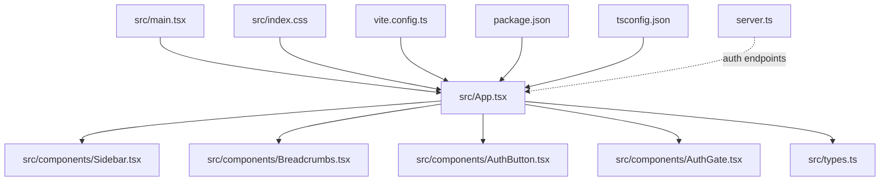
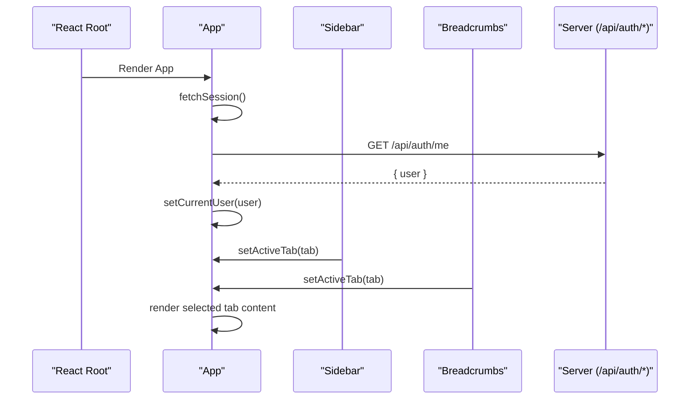
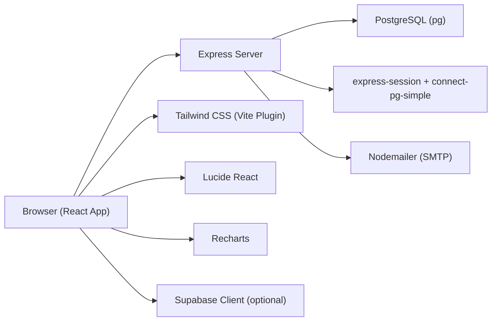

# Frontend Architecture

<cite>
**Referenced Files in This Document**
- [main.tsx](file://src/main.tsx)
- [App.tsx](file://src/App.tsx)
- [types.ts](file://src/types.ts)
- [Sidebar.tsx](file://src/components/Sidebar.tsx)
- [Breadcrumbs.tsx](file://src/components/Breadcrumbs.tsx)
- [AuthButton.tsx](file://src/components/AuthButton.tsx)
- [AuthGate.tsx](file://src/components/AuthGate.tsx)
- [index.css](file://src/index.css)
- [vite.config.ts](file://vite.config.ts)
- [package.json](file://package.json)
- [tsconfig.json](file://tsconfig.json)
- [server.ts](file://server.ts)
</cite>

## Table of Contents
1. [Introduction](#introduction)
2. [Project Structure](#project-structure)
3. [Core Components](#core-components)
4. [Architecture Overview](#architecture-overview)
5. [Detailed Component Analysis](#detailed-component-analysis)
6. [Dependency Analysis](#dependency-analysis)
7. [Performance Considerations](#performance-considerations)
8. [Troubleshooting Guide](#troubleshooting-guide)
9. [Conclusion](#conclusion)

## Introduction
This document describes the frontend architecture of a React-based marketing dashboard application. It explains the component hierarchy, state management approach, tab-based interface design, sidebar navigation, authentication components, styling with Tailwind CSS, responsive patterns, accessibility considerations, and event handling strategies. The application uses Vite for development/building, React 19, and Tailwind CSS v4 via the Vite plugin. Authentication is handled through both Supabase (when available) and server endpoints exposed by an Express backend.

## Project Structure
The frontend code lives under src with a clear separation between entry points, shared types, and feature-oriented components:
- Entry point renders the root App inside React StrictMode.
- App orchestrates global state (active tab, currency, region, command palette), session checks, and conditional rendering of public website vs. dashboard layout.
- Sidebar provides grouped navigation with collapsible sections and quick-access buttons.
- Breadcrumbs displays contextual navigation and sub-tabs per category.
- AuthButton and AuthGate provide login/register/forgot/reset flows using Supabase or server APIs.
- index.css imports Tailwind CSS v4; vite.config.ts configures plugins and aliases.
- package.json lists dependencies including React, Tailwind, Vite, and Supabase client.
- tsconfig.json sets module resolution and path aliases.
- server.ts exposes auth endpoints used by the frontend.

**Diagram sources**
- [main.tsx:1-11](file://src/main.tsx#L1-L11)
- [App.tsx:1-177](file://src/App.tsx#L1-L177)
- [Sidebar.tsx:1-317](file://src/components/Sidebar.tsx#L1-L317)
- [Breadcrumbs.tsx:1-167](file://src/components/Breadcrumbs.tsx#L1-L167)
- [AuthButton.tsx:1-384](file://src/components/AuthButton.tsx#L1-L384)
- [AuthGate.tsx:1-440](file://src/components/AuthGate.tsx#L1-L440)
- [index.css:1-2](file://src/index.css#L1-L2)
- [vite.config.ts:1-23](file://vite.config.ts#L1-L23)
- [package.json:1-64](file://package.json#L1-L64)
- [tsconfig.json:1-27](file://tsconfig.json#L1-L27)
- [server.ts:1-200](file://server.ts#L1-L200)

**Section sources**
- [main.tsx:1-11](file://src/main.tsx#L1-L11)
- [App.tsx:1-177](file://src/App.tsx#L1-L177)
- [index.css:1-2](file://src/index.css#L1-L2)
- [vite.config.ts:1-23](file://vite.config.ts#L1-L23)
- [package.json:1-64](file://package.json#L1-L64)
- [tsconfig.json:1-27](file://tsconfig.json#L1-L27)

## Core Components
- App: Central controller managing activeTab, currency, region, command palette visibility, and current user session. Renders either PublicWebsite or the main dashboard shell with Sidebar, Header, Breadcrumbs, and tab content.
- Sidebar: Grouped navigation with collapsible sections, icons, badges, and quick-access buttons to workflow and public website. Emits setActiveTab to switch tabs.
- Breadcrumbs: Displays category and label for the active tab, plus a contextual submenu of related tabs within the same group. Supports opening the command palette.
- AuthButton: Compact or standard mode authentication widget supporting login, register, forgot password, and sign out. Uses Supabase when available, otherwise falls back to server endpoints. Dispatches auth-changed events.
- AuthGate: Standalone full-screen authentication flow supporting login, register, forgot password, and reset password via URL token. Calls server endpoints directly.

Key responsibilities and interactions:
- Tab switching is driven by a single source of truth (activeTab) in App, passed down to Sidebar and Breadcrumbs.
- Session checks are performed on mount and on auth-changed events.
- Command palette toggling is controlled by local state in App and triggered from Header/Breadcrumbs.

**Section sources**
- [App.tsx:1-177](file://src/App.tsx#L1-L177)
- [Sidebar.tsx:1-317](file://src/components/Sidebar.tsx#L1-L317)
- [Breadcrumbs.tsx:1-167](file://src/components/Breadcrumbs.tsx#L1-L167)
- [AuthButton.tsx:1-384](file://src/components/AuthButton.tsx#L1-L384)
- [AuthGate.tsx:1-440](file://src/components/AuthGate.tsx#L1-L440)

## Architecture Overview
The application follows a unidirectional data flow pattern:
- Global state resides in App (activeTab, currency, region, command palette, currentUser).
- Child components receive props and emit callbacks to update parent state.
- Authentication state is synchronized across components via window events and periodic session checks.
- Styling is provided by Tailwind CSS v4 imported via index.css and configured in vite.config.ts.

**Diagram sources**
- [App.tsx:43-88](file://src/App.tsx#L43-L88)
- [Sidebar.tsx:253-283](file://src/components/Sidebar.tsx#L253-L283)
- [Breadcrumbs.tsx:146-161](file://src/components/Breadcrumbs.tsx#L146-L161)
- [server.ts:112-125](file://server.ts#L112-L125)

## Detailed Component Analysis

### App Component
Responsibilities:
- Manages activeTab and other UI states.
- Fetches session on mount and listens for auth-changed events.
- Conditionally renders PublicWebsite or the dashboard layout.
- Renders Breadcrumbs and tab-specific components based on activeTab.

State and props:
- activeTab: ActiveTab union type defining all supported tabs.
- currency, region: Contextual filters passed to tab components.
- isCommandPaletteOpen: Controls visibility of the command palette overlay.
- currentUser: Current authenticated user username or null.

Event handling:
- handleLogout calls POST /api/auth/logout and dispatches auth-changed.
- useEffect initializes session check and event listener.

Rendering strategy:
- Conditional return for public_website route.
- Dashboard layout includes Sidebar, Header, Breadcrumbs, and tab panels.

**Section sources**
- [App.tsx:1-177](file://src/App.tsx#L1-L177)
- [types.ts:1-35](file://src/types.ts#L1-L35)

### Sidebar Component
Responsibilities:
- Provides grouped navigation with collapsible sections.
- Highlights active item and supports quick-access buttons.
- Emits setActiveTab to change the current tab.

Data model:
- NavGroup defines section title, color scheme, badge, and items.
- Each item has id (ActiveTab), label, icon, and optional badge.

Behavior:
- toggleSection manages open/close state per group.
- Collapsed mode hides labels and shows only icons.

Accessibility:
- Buttons have titles in collapsed mode for tooltips.
- Focusable elements use semantic button tags.

**Section sources**
- [Sidebar.tsx:1-317](file://src/components/Sidebar.tsx#L1-L317)

### Breadcrumbs Component
Responsibilities:
- Shows breadcrumb trail with Home, category, and current label.
- Displays contextual submenu of related tabs within the same group.
- Provides a shortcut hint to open the command palette.

Data model:
- tabCategoryMap maps each ActiveTab to category, label, and groupKey.
- sectionTabsMap defines sub-tabs per group.

Interaction:
- Clicking a sub-tab triggers setActiveTab to navigate.
- Optional onOpenCommandPalette callback opens the command palette.

**Section sources**
- [Breadcrumbs.tsx:1-167](file://src/components/Breadcrumbs.tsx#L1-L167)

### AuthButton Component
Responsibilities:
- Presents login/register/forgot password/sign out flows.
- Uses Supabase client if available; otherwise falls back to server endpoints.
- Updates local user state and dispatches auth-changed events.

Modes:
- compact: Small pill-style widget for header integration.
- standard: Full-width widget with more context.

Validation and error handling:
- Password length and confirmation checks.
- Error messages displayed inline.

Authentication flow:
- Sign-in/sign-up via Supabase or server endpoints.
- Forgot password via Supabase or server endpoint.
- Sign-out clears user and emits auth-changed.

**Section sources**
- [AuthButton.tsx:1-384](file://src/components/AuthButton.tsx#L1-L384)

### AuthGate Component
Responsibilities:
- Full-screen authentication page supporting login, register, forgot password, and reset password.
- Reads reset_token from URL query parameters to enter reset mode.
- Calls server endpoints for all auth operations.

Flow:
- Login/Register: POST /api/auth/login or /api/auth/register.
- Forgot Password: POST /api/auth/forgot-password.
- Reset Password: POST /api/auth/reset-password with token and new password.

UI:
- Mode tabs for login/register.
- Back navigation for forgot/reset modes.
- Success/error feedback.

**Section sources**
- [AuthGate.tsx:1-440](file://src/components/AuthGate.tsx#L1-L440)

### Types and Data Models
ActiveTab union type enumerates all supported tabs, ensuring type-safe navigation throughout the app. Additional interfaces define data structures for campaigns, SEO audits, clients, chat messages, email contacts, CRM deals, brochures, templates, and AI chat messages. These types are consumed by tab components to ensure consistent prop contracts.

**Section sources**
- [types.ts:1-178](file://src/types.ts#L1-L178)

## Dependency Analysis
Frontend dependencies:
- React 19 and React DOM for UI rendering.
- Tailwind CSS v4 via @tailwindcss/vite plugin.
- Supabase client for optional email-based auth.
- Lucide React for icons.
- Recharts for charts (used by analytics dashboards).
- Vite for build tooling and dev server.

Configuration:
- vite.config.ts enables React and Tailwind plugins, sets alias @ to project root, and controls HMR behavior.
- tsconfig.json sets ES2022 target, JSX react-jsx, and path aliases.
- package.json lists all runtime and dev dependencies.

Backend integration:
- server.ts exposes Express endpoints for auth and sessions, backed by PostgreSQL (or mock pool in development).
- Frontend components call /api/auth/* endpoints for session checks, login, register, logout, and password reset.

**Diagram sources**
- [package.json:15-46](file://package.json#L15-L46)
- [vite.config.ts:1-23](file://vite.config.ts#L1-L23)
- [tsconfig.json:1-27](file://tsconfig.json#L1-L27)
- [server.ts:1-200](file://server.ts#L1-L200)

**Section sources**
- [package.json:1-64](file://package.json#L1-L64)
- [vite.config.ts:1-23](file://vite.config.ts#L1-L23)
- [tsconfig.json:1-27](file://tsconfig.json#L1-L27)
- [server.ts:1-200](file://server.ts#L1-L200)

## Performance Considerations
- Conditional rendering: App renders only the active tab component, minimizing unnecessary work.
- Event-driven updates: auth-changed events avoid polling and reduce redundant session checks.
- Tailwind CSS v4: Efficient utility-first styling reduces custom CSS overhead.
- HMR control: Development server can disable file watching to save CPU during agent edits.
- Icon library: Using a lightweight icon set (Lucide) avoids heavy SVG bundles.

[No sources needed since this section provides general guidance]

## Troubleshooting Guide
Common issues and resolutions:
- Session not detected: Ensure /api/auth/me returns a valid user object. Check network requests and CORS settings.
- Auth modal not closing after login: Verify that auth-changed event is dispatched and listeners are attached.
- Supabase fallback: If Supabase is unavailable, confirm server endpoints are reachable and returning expected payloads.
- Tailwind styles not applied: Confirm index.css imports Tailwind and vite.config.ts includes the Tailwind plugin.
- Command palette not opening: Ensure onOpenCommandPalette is passed from parent and invoked correctly.

**Section sources**
- [App.tsx:50-88](file://src/App.tsx#L50-L88)
- [AuthButton.tsx:28-60](file://src/components/AuthButton.tsx#L28-L60)
- [AuthGate.tsx:30-36](file://src/components/AuthGate.tsx#L30-L36)
- [index.css:1-2](file://src/index.css#L1-L2)
- [vite.config.ts:14-20](file://vite.config.ts#L14-L20)

## Conclusion
The frontend architecture centers around a single-source-of-truth state model in App, with child components communicating via props and callbacks. The tab-based interface is driven by a strongly-typed ActiveTab union, enabling safe navigation and consistent rendering. Sidebar and Breadcrumbs provide intuitive navigation and contextual awareness. Authentication is flexible, supporting both Supabase and server endpoints, with robust event synchronization. Tailwind CSS v4 ensures efficient styling, while Vite configuration optimizes development experience. This structure scales well for adding new features and maintaining clarity across a large dashboard application.

[No sources needed since this section summarizes without analyzing specific files]