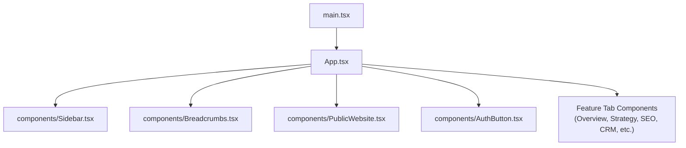
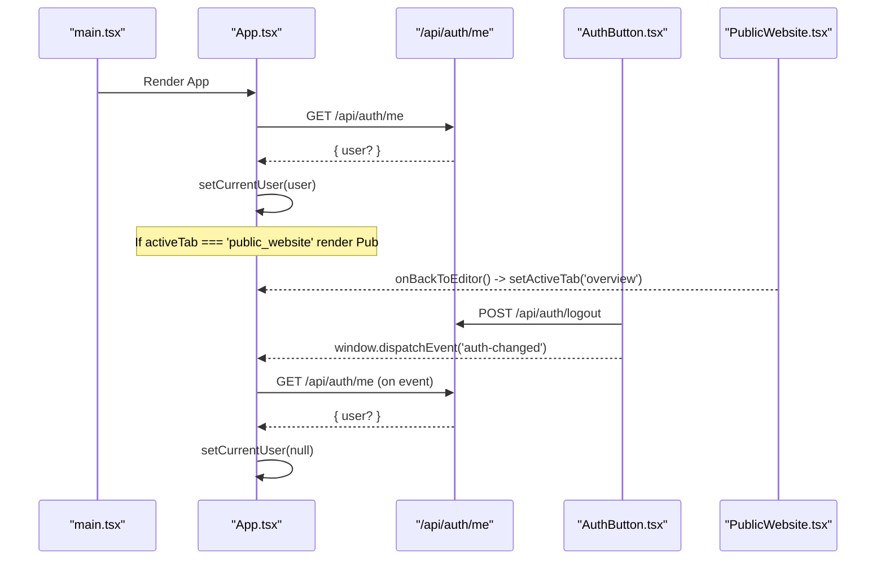
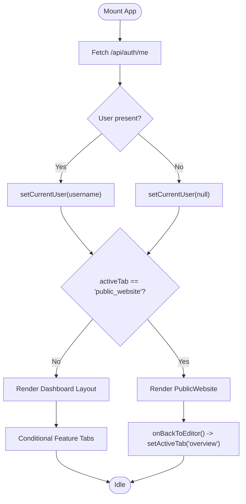
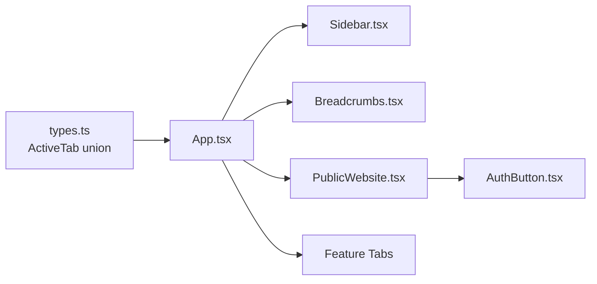

# App Root Component

<cite>
**Referenced Files in This Document**
- [App.tsx](file://src/App.tsx)
- [types.ts](file://src/types.ts)
- [Sidebar.tsx](file://src/components/Sidebar.tsx)
- [Breadcrumbs.tsx](file://src/components/Breadcrumbs.tsx)
- [PublicWebsite.tsx](file://src/components/PublicWebsite.tsx)
- [AuthButton.tsx](file://src/components/AuthButton.tsx)
- [main.tsx](file://src/main.tsx)
</cite>

## Table of Contents
1. Introduction
2. Project Structure
3. Core Components
4. Architecture Overview
5. Detailed Component Analysis
6. Dependency Analysis
7. Performance Considerations
8. Troubleshooting Guide
9. Conclusion
10. Appendices

## Introduction
This document explains the root application component architecture, focusing on state management with React hooks for active tab navigation, global settings (currency and region), command palette visibility, and user authentication. It details how feature tabs are conditionally rendered, the special public website mode, and the event-driven synchronization between components. It also provides practical guidance for adding new tabs, managing global state, and implementing component communication patterns.

## Project Structure
At runtime, the app is bootstrapped by a small entry that renders the root App component. The App component owns global UI state and orchestrates layout, navigation, and conditional rendering of feature modules. Two key sub-components participate in navigation: Sidebar and Breadcrumbs. Authentication is handled via an AuthButton component that communicates session changes through a global window event. A special PublicWebsite component is rendered when the active tab equals a dedicated value.

**Diagram sources**
- [main.tsx:1-11](file://src/main.tsx#L1-L11)
- [App.tsx:1-177](file://src/App.tsx#L1-L177)

**Section sources**
- [main.tsx:1-11](file://src/main.tsx#L1-L11)
- [App.tsx:1-177](file://src/App.tsx#L1-L177)

## Core Components
- App (root): Holds global state (activeTab, currency, region, command palette visibility, currentUser). Performs initial session check, listens to auth events, and renders either the public website or the main dashboard with sidebar, header, breadcrumbs, and feature tabs.
- Sidebar: Displays grouped navigation items and updates activeTab via props. Also exposes quick actions like switching to workflow and public website modes.
- Breadcrumbs: Shows contextual category and sub-tabs based on activeTab and allows quick navigation within a section.
- PublicWebsite: Specialized view for the public site/LMS, with its own internal tab state and guards for authenticated-only sections.
- AuthButton: Manages login/register/forgot password flows, checks sessions, and dispatches a global auth-changed event to synchronize state across the app.

Key responsibilities:
- State ownership and propagation to child components
- Conditional rendering of feature tabs based on activeTab
- Event-driven synchronization for authentication state
- Routing to public website mode as a special case

**Section sources**
- [App.tsx:43-177](file://src/App.tsx#L43-L177)
- [Sidebar.tsx:36-317](file://src/components/Sidebar.tsx#L36-L317)
- [Breadcrumbs.tsx:5-167](file://src/components/Breadcrumbs.tsx#L5-L167)
- [PublicWebsite.tsx:123-166](file://src/components/PublicWebsite.tsx#L123-L166)
- [AuthButton.tsx:15-162](file://src/components/AuthButton.tsx#L15-L162)

## Architecture Overview
The App component acts as the single source of truth for top-level UI state. Navigation is driven by a string-based ActiveTab union type. Feature components are conditionally rendered using equality checks against activeTab. Authentication is decoupled from UI logic by using a global window event, allowing multiple components to react to session changes without tight coupling.

**Diagram sources**
- [App.tsx:43-88](file://src/App.tsx#L43-L88)
- [App.tsx:90-107](file://src/App.tsx#L90-L107)
- [AuthButton.tsx:147-162](file://src/components/AuthButton.tsx#L147-L162)

## Detailed Component Analysis

### App Root Component
Responsibilities:
- Global state: activeTab, currency, region, isCommandPaletteOpen, currentUser
- Session lifecycle: fetch current session on mount; refresh on auth-changed
- Logout flow: call server logout endpoint, clear local user, emit auth-changed
- Public website mode: early return rendering PublicWebsite with callbacks
- Dashboard layout: Sidebar, Header (props passed down), Breadcrumbs, feature tabs, CommandPalette

Conditional rendering pattern:
- For each known ActiveTab, render the corresponding feature component
- Pass shared state (currency, region) where needed
- Provide setActiveTab to children for navigation

Event-driven synchronization:
- Listens to window 'auth-changed' to refresh session state
- Ensures consistent user presence across App and AuthButton

**Diagram sources**
- [App.tsx:43-88](file://src/App.tsx#L43-L88)
- [App.tsx:90-107](file://src/App.tsx#L90-L107)
- [App.tsx:109-175](file://src/App.tsx#L109-L175)

**Section sources**
- [App.tsx:43-177](file://src/App.tsx#L43-L177)

### Sidebar Component
Responsibilities:
- Grouped navigation with collapsible sections
- Updates activeTab via callback prop
- Quick-access buttons for Workflow and Public Website

Navigation behavior:
- Clicking any item calls setActiveTab(item.id)
- Collapsed state toggles visibility of labels and icons

**Section sources**
- [Sidebar.tsx:36-317](file://src/components/Sidebar.tsx#L36-L317)

### Breadcrumbs Component
Responsibilities:
- Displays current category and label derived from activeTab
- Renders contextual sub-tabs for quick navigation within a section
- Provides a button to open the command palette

Mapping:
- Uses a mapping table to associate each ActiveTab with a category and group key
- Sub-tabs are defined per group key

**Section sources**
- [Breadcrumbs.tsx:5-167](file://src/components/Breadcrumbs.tsx#L5-L167)

### PublicWebsite Component
Special case handling:
- When activeTab equals 'public_website', App renders this component instead of the dashboard
- Internal tab state manages content sections
- Guard ensures unauthenticated users cannot access protected catalog pages; redirects to services and triggers login modal

Props:
- onBackToEditor: returns to editor/dashboard
- authUser: current user name or null
- onOpenLogin: opens login modal
- onLogout: triggers logout flow

**Section sources**
- [PublicWebsite.tsx:123-166](file://src/components/PublicWebsite.tsx#L123-L166)

### AuthButton Component
Responsibilities:
- Checks session on mount and listens to auth-changed events
- Supports login, register, forgot password flows
- Dispatches auth-changed after successful sign-in/sign-out to synchronize other components

Integration points:
- Calls /api/auth/me to verify session
- Calls /api/auth/login, /api/auth/register, /api/auth/forgot-password as fallbacks
- Emits window 'auth-changed' to trigger App to refresh session

**Section sources**
- [AuthButton.tsx:15-162](file://src/components/AuthButton.tsx#L15-L162)

## Dependency Analysis
High-level dependencies:
- App depends on types (ActiveTab union) and several UI components
- Sidebar and Breadcrumbs depend on ActiveTab for navigation
- PublicWebsite depends on AuthButton for login interactions
- AuthButton depends on Supabase client or server endpoints for authentication

**Diagram sources**
- [types.ts:1-35](file://src/types.ts#L1-L35)
- [App.tsx:1-42](file://src/App.tsx#L1-L42)

**Section sources**
- [types.ts:1-35](file://src/types.ts#L1-L35)
- [App.tsx:1-42](file://src/App.tsx#L1-L42)

## Performance Considerations
- Conditional rendering: Using equality checks for each tab avoids unnecessary re-renders of inactive features. Keep the list of conditions aligned with the ActiveTab union to prevent dead branches.
- Event listeners: Ensure cleanup of window event listeners in useEffect to avoid memory leaks.
- Network requests: Debounce or cache session checks if frequent polling is introduced.
- Large components: Consider lazy loading heavy feature tabs (e.g., AnalyticsDashboardTab, BrochureGeneratorTab) to reduce initial bundle size.

[No sources needed since this section provides general guidance]

## Troubleshooting Guide
Common issues and resolutions:
- Session not updating after login/logout:
  - Verify that AuthButton dispatches 'auth-changed' after sign-in/sign-out
  - Confirm App subscribes to 'auth-changed' and calls fetchSession
- Public website shows blank for unauthenticated users:
  - Ensure PublicWebsite guard redirects to services and triggers onOpenLogin
- Navigation not working:
  - Check that setActiveTab is correctly passed to Sidebar and Breadcrumbs
  - Validate that the clicked id matches a valid ActiveTab value

**Section sources**
- [App.tsx:79-88](file://src/App.tsx#L79-L88)
- [AuthButton.tsx:147-162](file://src/components/AuthButton.tsx#L147-L162)
- [PublicWebsite.tsx:160-166](file://src/components/PublicWebsite.tsx#L160-L166)

## Conclusion
The App root component centralizes global state and orchestrates navigation, authentication, and conditional rendering of feature modules. By leveraging a typed ActiveTab union and event-driven synchronization, the system maintains clean separation of concerns while enabling flexible expansion of features. The special public website mode demonstrates how to handle alternate UI contexts seamlessly.

[No sources needed since this section summarizes without analyzing specific files]

## Appendices

### How to Add a New Tab
Steps:
1. Extend the ActiveTab union in types.ts with the new tab identifier.
2. Import the new feature component in App.tsx.
3. Add a conditional branch in App.tsx to render the new component when activeTab equals the new identifier.
4. Optionally add the tab to Sidebar and Breadcrumbs mappings for navigation and context.

Example references:
- Extending ActiveTab union: [types.ts:1-35](file://src/types.ts#L1-L35)
- Adding a conditional render branch: [App.tsx:131-164](file://src/App.tsx#L131-L164)
- Updating Sidebar groups: [Sidebar.tsx:75-161](file://src/components/Sidebar.tsx#L75-L161)
- Updating Breadcrumbs mapping: [Breadcrumbs.tsx:16-54](file://src/components/Breadcrumbs.tsx#L16-L54)

**Section sources**
- [types.ts:1-35](file://src/types.ts#L1-L35)
- [App.tsx:131-164](file://src/App.tsx#L131-L164)
- [Sidebar.tsx:75-161](file://src/components/Sidebar.tsx#L75-L161)
- [Breadcrumbs.tsx:16-54](file://src/components/Breadcrumbs.tsx#L16-L54)

### Managing Global State Best Practices
- Keep global state minimal and necessary for cross-component coordination (e.g., activeTab, currency, region, command palette visibility, currentUser).
- Prefer passing setters down to children for localized updates (e.g., setActiveTab).
- Use window events sparingly for cross-component synchronization; prefer React Context or state management libraries for complex scenarios.

[No sources needed since this section provides general guidance]

### Component Communication Patterns
- Parent-to-child: Props (e.g., activeTab, setActiveTab, currency, setCurrency, region, setRegion, onOpenCommandPalette)
- Child-to-parent: Callbacks (e.g., onBackToEditor in PublicWebsite)
- Cross-component: Global window events (e.g., 'auth-changed')

Examples:
- Passing setActiveTab to Sidebar and Breadcrumbs: [App.tsx:111-130](file://src/App.tsx#L111-L130)
- PublicWebsite back navigation callback: [App.tsx:90-107](file://src/App.tsx#L90-L107)
- Auth event synchronization: [App.tsx:79-88](file://src/App.tsx#L79-L88), [AuthButton.tsx:147-162](file://src/components/AuthButton.tsx#L147-L162)

**Section sources**
- [App.tsx:111-130](file://src/App.tsx#L111-L130)
- [App.tsx:90-107](file://src/App.tsx#L90-L107)
- [App.tsx:79-88](file://src/App.tsx#L79-L88)
- [AuthButton.tsx:147-162](file://src/components/AuthButton.tsx#L147-L162)