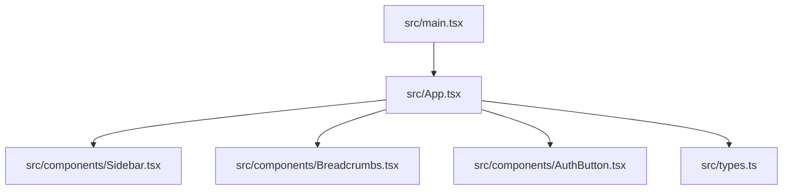
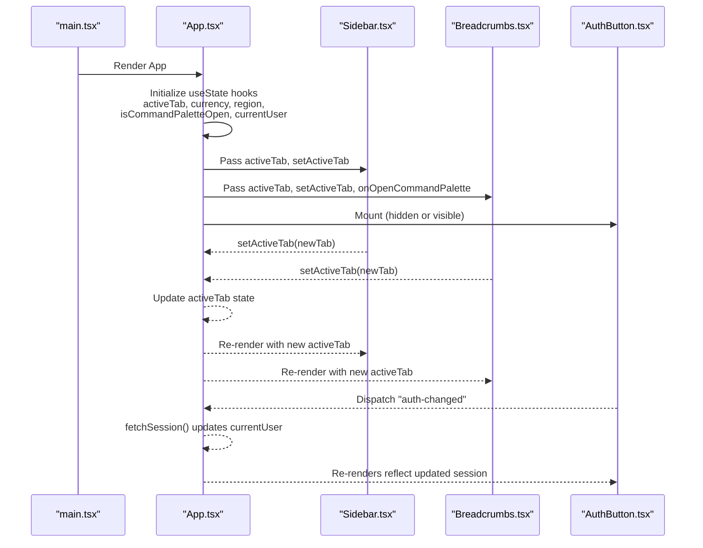
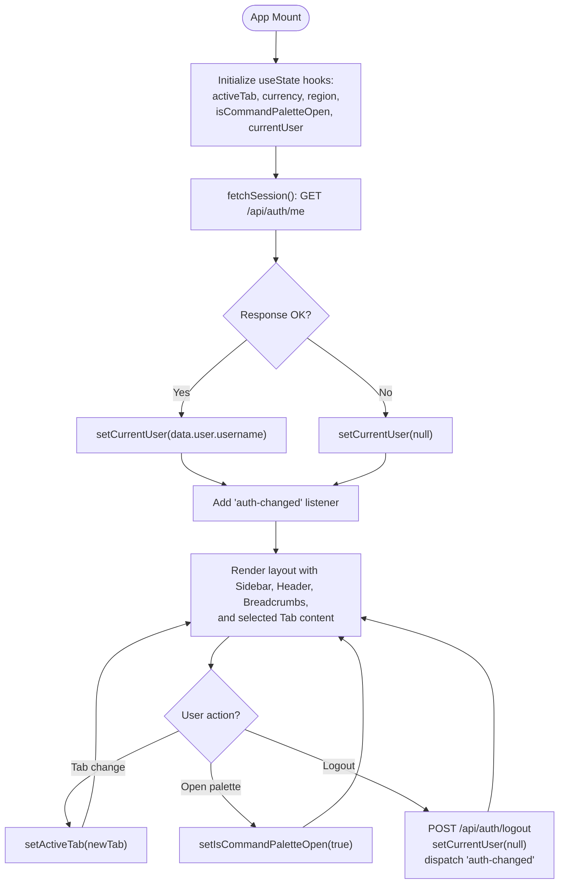
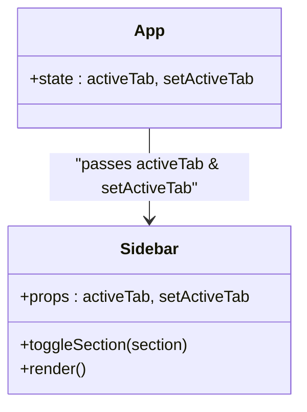
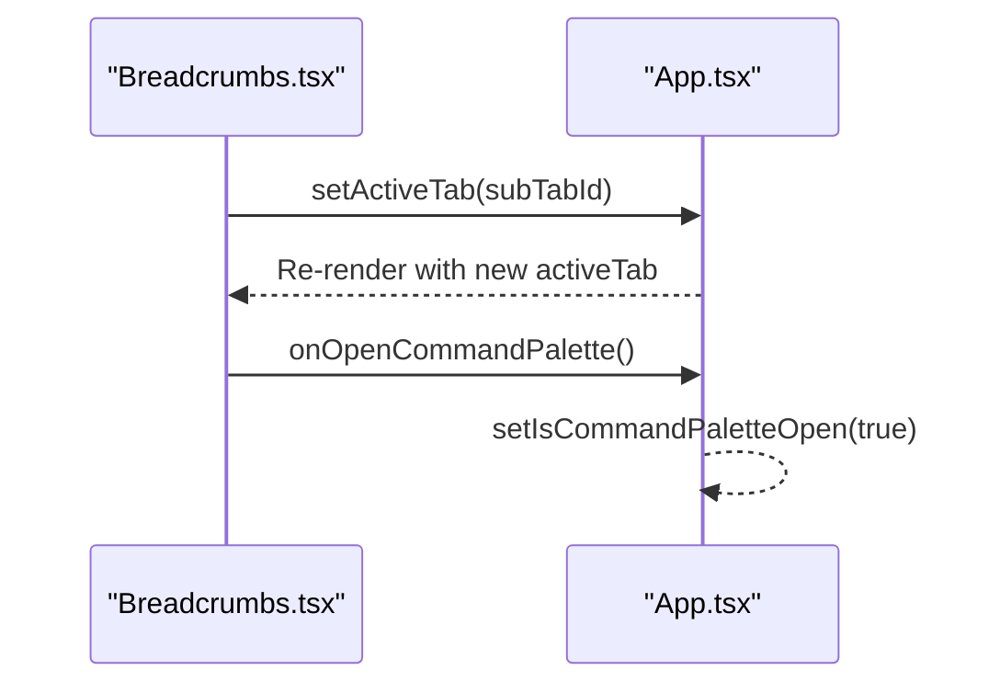
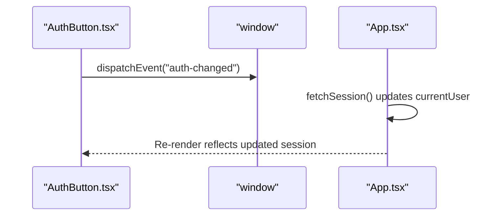
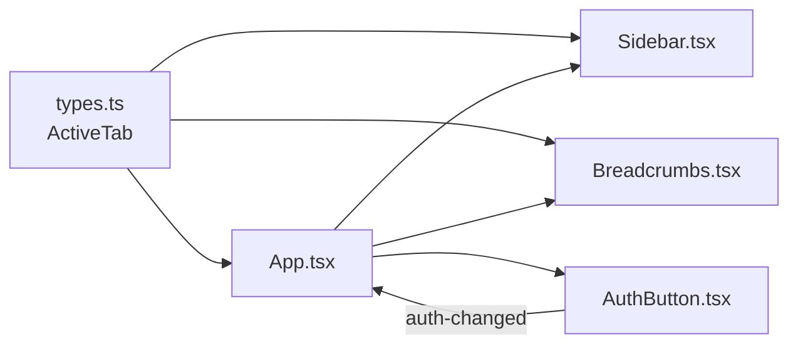

# State Management and Global State

<cite>
**Referenced Files in This Document**
- [App.tsx](file://src/App.tsx)
- [main.tsx](file://src/main.tsx)
- [types.ts](file://src/types.ts)
- [Sidebar.tsx](file://src/components/Sidebar.tsx)
- [Breadcrumbs.tsx](file://src/components/Breadcrumbs.tsx)
- [AuthButton.tsx](file://src/components/AuthButton.tsx)
</cite>

## Table of Contents
1. [Introduction](#introduction)
2. [Project Structure](#project-structure)
3. [Core Components](#core-components)
4. [Architecture Overview](#architecture-overview)
5. [Detailed Component Analysis](#detailed-component-analysis)
6. [Dependency Analysis](#dependency-analysis)
7. [Performance Considerations](#performance-considerations)
8. [Troubleshooting Guide](#troubleshooting-guide)
9. [Conclusion](#conclusion)
10. [Appendices](#appendices)

## Introduction
This document explains the App component’s state management system, focusing on how global state is defined at the root level and passed down to child components via props. It covers all useState hooks used by the App: activeTab, currency, region, isCommandPaletteOpen, and currentUser. It also details data flow patterns, synchronization mechanisms (including window events), and best practices for adding new global state and managing complex interactions.

## Project Structure
The application mounts a single React root that renders the App component. The App owns the core global state and composes UI components such as Sidebar, Breadcrumbs, and CommandPalette. Types are centralized to ensure consistent tab identifiers across the app.

**Diagram sources**
- [main.tsx:1-11](file://src/main.tsx#L1-L11)
- [App.tsx:1-42](file://src/App.tsx#L1-L42)
- [Sidebar.tsx:1-317](file://src/components/Sidebar.tsx#L1-L317)
- [Breadcrumbs.tsx:1-167](file://src/components/Breadcrumbs.tsx#L1-L167)
- [AuthButton.tsx:1-384](file://src/components/AuthButton.tsx#L1-L384)
- [types.ts:1-35](file://src/types.ts#L1-L35)

**Section sources**
- [main.tsx:1-11](file://src/main.tsx#L1-L11)
- [App.tsx:1-42](file://src/App.tsx#L1-L42)
- [types.ts:1-35](file://src/types.ts#L1-L35)

## Core Components
- App: Root component that declares global state with useState and passes state + setters to children. It also manages authentication session fetching and logout behavior.
- Sidebar: Receives activeTab and setActiveTab to navigate between tabs.
- Breadcrumbs: Displays current context and allows switching sub-tabs using activeTab and setActiveTab; can open the command palette via a callback.
- AuthButton: Manages its own local auth UI but synchronizes with the App’s currentUser through a window event pattern.

Key global state variables in App:
- activeTab: Controls which tab view is rendered.
- currency: Shared formatting preference.
- region: Shared regional filter.
- isCommandPaletteOpen: Controls visibility of the command palette overlay.
- currentUser: Holds authenticated user identity.

Data flow highlights:
- Parent-to-child prop drilling: App passes state and setters directly to Sidebar, Header, Breadcrumbs, and CommandPalette.
- Event-driven synchronization: Auth changes propagate via window events, allowing multiple components to stay in sync without tight coupling.

**Section sources**
- [App.tsx:43-175](file://src/App.tsx#L43-L175)
- [Sidebar.tsx:36-39](file://src/components/Sidebar.tsx#L36-L39)
- [Breadcrumbs.tsx:5-9](file://src/components/Breadcrumbs.tsx#L5-L9)
- [AuthButton.tsx:1-384](file://src/components/AuthButton.tsx#L1-L384)

## Architecture Overview
The App component acts as the single source of truth for global UI state. Child components receive state and setter functions as props. Authentication state is synchronized across components using a simple window event bus.

**Diagram sources**
- [main.tsx:1-11](file://src/main.tsx#L1-L11)
- [App.tsx:43-175](file://src/App.tsx#L43-L175)
- [Sidebar.tsx:54-73](file://src/components/Sidebar.tsx#L54-L73)
- [Breadcrumbs.tsx:101-166](file://src/components/Breadcrumbs.tsx#L101-L166)
- [AuthButton.tsx:28-60](file://src/components/AuthButton.tsx#L28-L60)

## Detailed Component Analysis

### App Component State Management
- State declarations:
  - activeTab: Enumerated tab identifier used to render specific views.
  - currency: String value for currency display/formatting.
  - region: String value for regional filtering.
  - isCommandPaletteOpen: Boolean controlling command palette visibility.
  - currentUser: Nullable string representing the authenticated username.
- Side effects:
  - Session check on mount via an API endpoint; updates currentUser accordingly.
  - Listens to window 'auth-changed' to refresh session state after login/logout actions elsewhere.
- Prop distribution:
  - Sidebar receives activeTab and setActiveTab.
  - Breadcrumbs receives activeTab, setActiveTab, and onOpenCommandPalette.
  - CommandPalette receives isOpen, onClose, and setActiveTab.
  - PublicWebsite route receives currentUser and navigation callbacks when activeTab is public_website.

**Diagram sources**
- [App.tsx:43-88](file://src/App.tsx#L43-L88)
- [App.tsx:89-175](file://src/App.tsx#L89-L175)

**Section sources**
- [App.tsx:43-175](file://src/App.tsx#L43-L175)

### Sidebar Component Interaction
- Props:
  - activeTab: Current tab identifier.
  - setActiveTab: Function to update the active tab.
- Behavior:
  - Clicking a navigation item calls setActiveTab with the corresponding tab id.
  - Collapsible sections and quick-access buttons also trigger setActiveTab.

**Diagram sources**
- [Sidebar.tsx:36-39](file://src/components/Sidebar.tsx#L36-L39)
- [Sidebar.tsx:54-73](file://src/components/Sidebar.tsx#L54-L73)
- [App.tsx:111-111](file://src/App.tsx#L111-L111)

**Section sources**
- [Sidebar.tsx:36-39](file://src/components/Sidebar.tsx#L36-L39)
- [Sidebar.tsx:54-73](file://src/components/Sidebar.tsx#L54-L73)
- [App.tsx:111-111](file://src/App.tsx#L111-L111)

### Breadcrumbs Component Interaction
- Props:
  - activeTab: Current tab identifier.
  - setActiveTab: Function to update the active tab.
  - onOpenCommandPalette: Optional callback to open the command palette.
- Behavior:
  - Renders breadcrumb trail and contextual sub-tabs.
  - Clicking a sub-tab calls setActiveTab.
  - Keyboard shortcut button triggers onOpenCommandPalette.

**Diagram sources**
- [Breadcrumbs.tsx:5-9](file://src/components/Breadcrumbs.tsx#L5-L9)
- [Breadcrumbs.tsx:101-166](file://src/components/Breadcrumbs.tsx#L101-L166)
- [App.tsx:126-130](file://src/App.tsx#L126-L130)

**Section sources**
- [Breadcrumbs.tsx:5-9](file://src/components/Breadcrumbs.tsx#L5-L9)
- [Breadcrumbs.tsx:101-166](file://src/components/Breadcrumbs.tsx#L101-L166)
- [App.tsx:126-130](file://src/App.tsx#L126-L130)

### AuthButton and Session Synchronization
- Local state:
  - Maintains modal visibility, form fields, loading states, and error messages.
- Session handling:
  - On mount, checks session via API and sets local user state.
  - Subscribes to window 'auth-changed' to refresh session state.
- Integration with App:
  - After successful login/register/logout, dispatches 'auth-changed'.
  - App listens to this event and updates currentUser accordingly.

**Diagram sources**
- [AuthButton.tsx:28-60](file://src/components/AuthButton.tsx#L28-L60)
- [AuthButton.tsx:139-145](file://src/components/AuthButton.tsx#L139-L145)
- [AuthButton.tsx:147-162](file://src/components/AuthButton.tsx#L147-L162)
- [App.tsx:79-88](file://src/App.tsx#L79-L88)

**Section sources**
- [AuthButton.tsx:28-60](file://src/components/AuthButton.tsx#L28-L60)
- [AuthButton.tsx:139-145](file://src/components/AuthButton.tsx#L139-L145)
- [AuthButton.tsx:147-162](file://src/components/AuthButton.tsx#L147-L162)
- [App.tsx:79-88](file://src/App.tsx#L79-L88)

## Dependency Analysis
- Centralized types: ActiveTab type ensures consistent tab identifiers across components.
- Prop drilling: App passes state and setters directly to Sidebar, Breadcrumbs, and CommandPalette.
- Event bus: window 'auth-changed' decouples authentication logic from UI state updates.

**Diagram sources**
- [types.ts:1-35](file://src/types.ts#L1-L35)
- [App.tsx:1-42](file://src/App.tsx#L1-L42)
- [Sidebar.tsx:1-39](file://src/components/Sidebar.tsx#L1-L39)
- [Breadcrumbs.tsx:1-9](file://src/components/Breadcrumbs.tsx#L1-L9)
- [AuthButton.tsx:1-60](file://src/components/AuthButton.tsx#L1-L60)

**Section sources**
- [types.ts:1-35](file://src/types.ts#L1-L35)
- [App.tsx:1-42](file://src/App.tsx#L1-L42)
- [Sidebar.tsx:1-39](file://src/components/Sidebar.tsx#L1-L39)
- [Breadcrumbs.tsx:1-9](file://src/components/Breadcrumbs.tsx#L1-L9)
- [AuthButton.tsx:1-60](file://src/components/AuthButton.tsx#L1-L60)

## Performance Considerations
- Keep global state minimal: Only store values required by many components (e.g., activeTab, currency, region, isCommandPaletteOpen, currentUser).
- Avoid unnecessary re-renders: Memoize expensive computations in child components where possible; pass stable references for callbacks if needed.
- Batch state updates: When multiple related state changes occur, consider grouping them to reduce re-renders.
- Use lightweight events: The window event bus is effective for cross-component synchronization; avoid heavy payloads in events.

[No sources needed since this section provides general guidance]

## Troubleshooting Guide
Common issues and resolutions:
- Tab not updating: Ensure setActiveTab is correctly passed and invoked from Sidebar or Breadcrumbs. Verify the new tab id matches the ActiveTab type.
- Command palette not opening: Confirm onOpenCommandPalette is wired to setIsCommandPaletteOpen(true) and that CommandPalette receives isOpen correctly.
- Auth state mismatch: Check that both App and AuthButton listen to 'auth-changed' and call fetchSession appropriately. Validate network responses from /api/auth/me and /api/auth/logout.

**Section sources**
- [App.tsx:79-88](file://src/App.tsx#L79-L88)
- [App.tsx:69-77](file://src/App.tsx#L69-L77)
- [AuthButton.tsx:28-60](file://src/components/AuthButton.tsx#L28-L60)
- [AuthButton.tsx:139-145](file://src/components/AuthButton.tsx#L139-L145)

## Conclusion
The App component centralizes global state using useState and distributes it via props to child components. Authentication state is synchronized across components through a simple window event mechanism. This approach keeps the codebase straightforward while enabling consistent UI state across the application. For scaling, consider introducing a dedicated state container if prop drilling becomes unwieldy.

[No sources needed since this section summarizes without analyzing specific files]

## Appendices

### Adding New Global State Variables
Steps:
- Declare a new useState hook in App with appropriate initial value and type.
- Pass the state and setter to any child components that need access.
- If the new state affects authentication or external services, coordinate via window events or shared APIs.

Best practices:
- Keep state co-located with its primary owner unless multiple components require it.
- Use descriptive names and clear initial values.
- Validate inputs before setting state to prevent invalid UI states.

[No sources needed since this section provides general guidance]

### Managing Complex State Interactions
Patterns:
- Derive computed values in child components rather than storing redundant state in App.
- Group related state into objects if they frequently change together.
- Use callbacks to encapsulate multi-step updates and maintain consistency.

[No sources needed since this section provides general guidance]