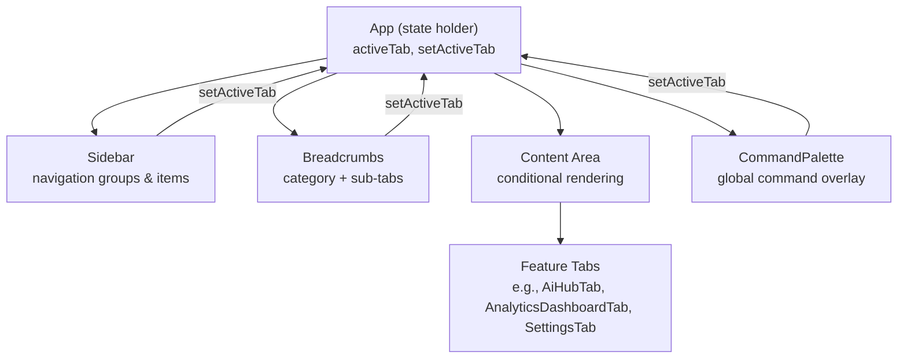
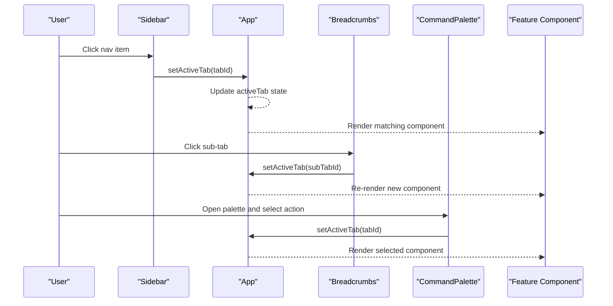
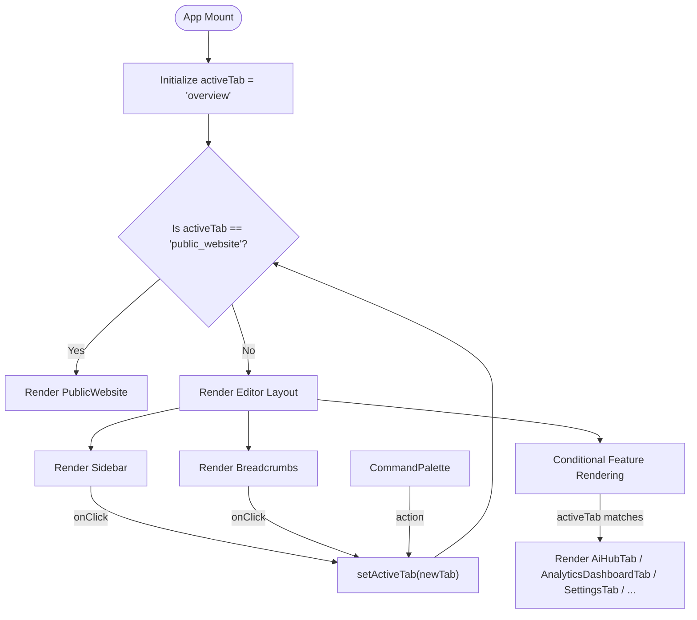
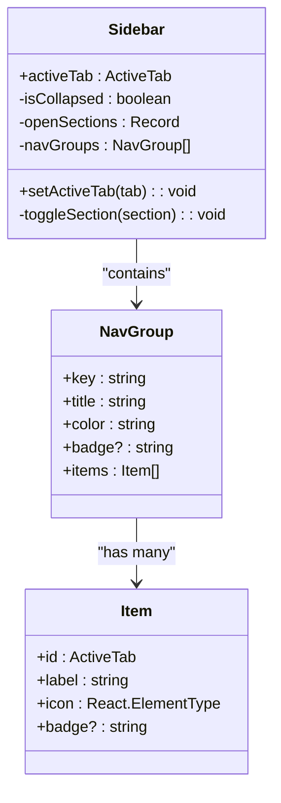
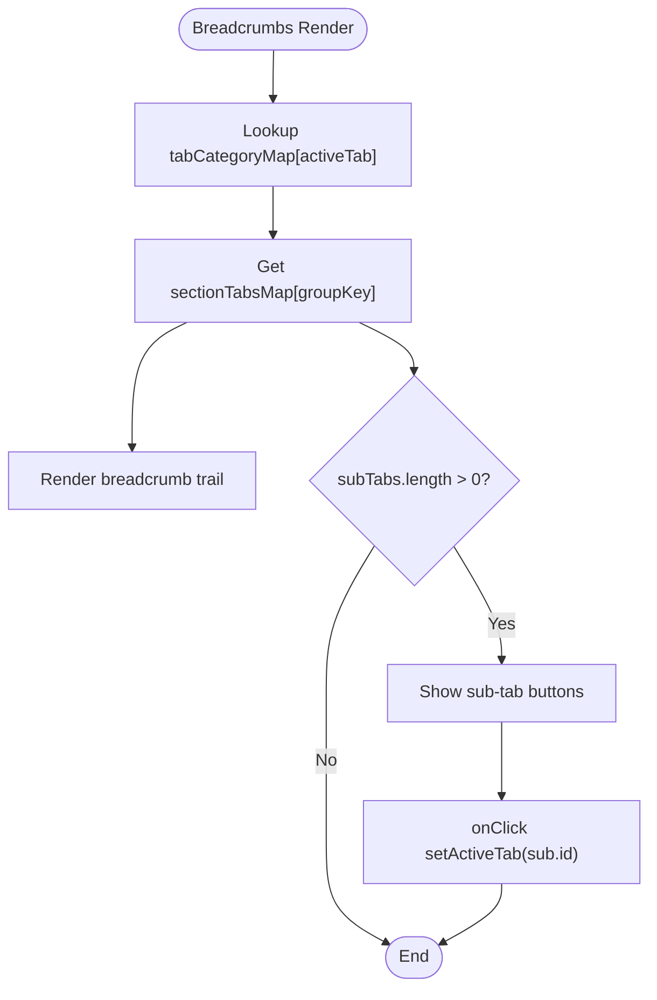
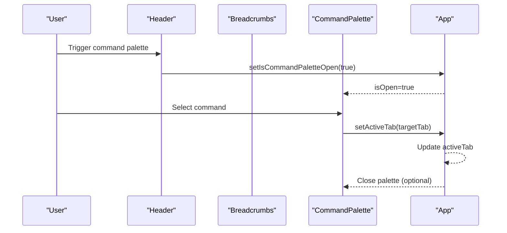
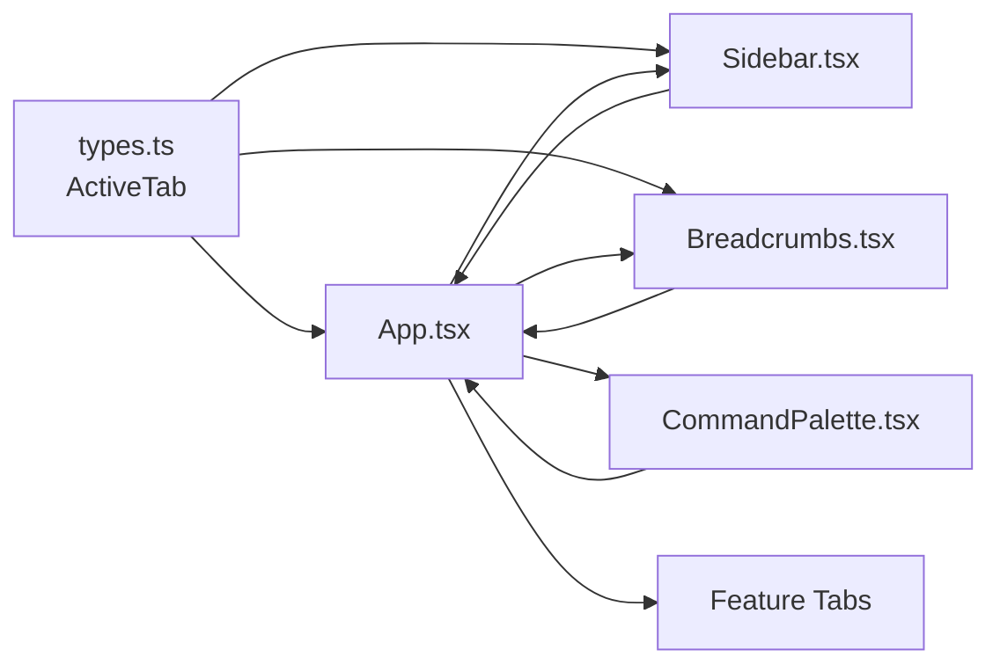

# Tab Navigation and Component Routing

<cite>
**Referenced Files in This Document**
- [App.tsx](file://src/App.tsx)
- [types.ts](file://src/types.ts)
- [Sidebar.tsx](file://src/components/Sidebar.tsx)
- [Breadcrumbs.tsx](file://src/components/Breadcrumbs.tsx)
- [CommandPalette.tsx](file://src/components/CommandPalette.tsx)
- [AiHubTab.tsx](file://src/components/AiHubTab.tsx)
- [AnalyticsDashboardTab.tsx](file://src/components/AnalyticsDashboardTab.tsx)
- [SettingsTab.tsx](file://src/components/SettingsTab.tsx)
- [WorkflowTab.tsx](file://src/components/WorkflowTab.tsx)
</cite>

## Table of Contents
1. [Introduction](#introduction)
2. [Project Structure](#project-structure)
3. [Core Components](#core-components)
4. [Architecture Overview](#architecture-overview)
5. [Detailed Component Analysis](#detailed-component-analysis)
6. [Dependency Analysis](#dependency-analysis)
7. [Performance Considerations](#performance-considerations)
8. [Troubleshooting Guide](#troubleshooting-guide)
9. [Conclusion](#conclusion)
10. [Appendices](#appendices)

## Introduction
This document explains the tab-based navigation system used by the application. It covers the ActiveTab type definition, how the main app conditionally renders feature components based on the active tab, and how the Sidebar and Breadcrumb components coordinate with the central state to manage navigation. It also documents the Command Palette integration, patterns for adding new tabs, managing tab-specific state, and implementing tab-specific routing behaviors.

## Project Structure
The tab navigation is centered around a single source of truth: the active tab string stored in the root App component. The Sidebar provides navigation UI that updates this state, while the main content area renders the corresponding feature component based on the active tab. Breadcrumbs provide contextual navigation and quick access to sibling tabs within the same section.

**Diagram sources**
- [App.tsx](file://src/App.tsx)
- [Sidebar.tsx](file://src/components/Sidebar.tsx)
- [Breadcrumbs.tsx](file://src/components/Breadcrumbs.tsx)
- [CommandPalette.tsx](file://src/components/CommandPalette.tsx)

**Section sources**
- [App.tsx](file://src/App.tsx)
- [Sidebar.tsx](file://src/components/Sidebar.tsx)
- [Breadcrumbs.tsx](file://src/components/Breadcrumbs.tsx)

## Core Components
- ActiveTab type: A union of all supported tab identifiers used across the app to ensure type safety when switching tabs.
- App: Holds the active tab state, renders the Sidebar, Header, Breadcrumbs, and conditional feature components. Also handles special-case rendering for public website mode.
- Sidebar: Displays grouped navigation items; clicking an item calls setActiveTab with the corresponding ActiveTab value.
- Breadcrumbs: Shows category and label for the current tab and exposes sub-tabs for quick navigation within the same group.
- CommandPalette: Global overlay triggered from Header or Breadcrumbs; can be extended to switch tabs via commands.

Key responsibilities:
- Centralized tab state management in App.
- Declarative mapping of tab IDs to components in App’s render logic.
- Consistent user interactions through Sidebar and Breadcrumbs updating the same state.

**Section sources**
- [types.ts](file://src/types.ts)
- [App.tsx](file://src/App.tsx)
- [Sidebar.tsx](file://src/components/Sidebar.tsx)
- [Breadcrumbs.tsx](file://src/components/Breadcrumbs.tsx)
- [CommandPalette.tsx](file://src/components/CommandPalette.tsx)

## Architecture Overview
The navigation architecture follows a unidirectional data flow pattern:
- State lives in App (activeTab).
- Sidebar and Breadcrumbs call setActiveTab to update state.
- App re-renders and conditionally mounts the appropriate feature component.
- CommandPalette can also trigger setActiveTab to navigate programmatically.

**Diagram sources**
- [App.tsx](file://src/App.tsx)
- [Sidebar.tsx](file://src/components/Sidebar.tsx)
- [Breadcrumbs.tsx](file://src/components/Breadcrumbs.tsx)
- [CommandPalette.tsx](file://src/components/CommandPalette.tsx)

## Detailed Component Analysis

### ActiveTab Type Definition
- Purpose: Enforces valid tab identifiers across the application.
- Usage: Used in App state typing, Sidebar props, and Breadcrumbs props to ensure consistent navigation values.
- Extensibility: Add a new tab by appending a new literal string to the union type.

**Section sources**
- [types.ts](file://src/types.ts)

### App: Central State and Conditional Rendering
- State: activeTab holds the current tab identifier; setActiveTab updates it.
- Special case: When activeTab equals the public website identifier, App renders a full-screen public site view instead of the editor layout.
- Conditional rendering: Each feature component is rendered only when its corresponding tab matches activeTab.
- Integration points:
  - Sidebar receives activeTab and setActiveTab to drive navigation.
  - Breadcrumbs receives activeTab and setActiveTab to update context and sub-tabs.
  - CommandPalette receives setActiveTab to enable programmatic navigation.

**Diagram sources**
- [App.tsx](file://src/App.tsx)

**Section sources**
- [App.tsx](file://src/App.tsx)

### Sidebar: Navigation Groups and Item Selection
- Data model: NavGroup defines sections with title, color, badge, and items array. Each item has id (ActiveTab), label, icon, and optional badge.
- Behavior:
  - Sections can be expanded/collapsed.
  - Clicking an item calls setActiveTab with the item.id.
  - Visual feedback highlights the active item using style maps.
- Quick actions: Dedicated buttons for Workflow and Public Website set specific tabs directly.

**Diagram sources**
- [Sidebar.tsx](file://src/components/Sidebar.tsx)

**Section sources**
- [Sidebar.tsx](file://src/components/Sidebar.tsx)

### Breadcrumbs: Category and Sub-Tabs
- Mapping: tabCategoryMap associates each ActiveTab with a category label and group key.
- Sub-tabs: sectionTabsMap lists sibling tabs per group key, enabling quick switching within the same section.
- Behavior:
  - Renders a breadcrumb trail with Home, category, and current label.
  - Provides a contextual submenu for sub-tabs.
  - Integrates with CommandPalette via onOpenCommandPalette prop.

**Diagram sources**
- [Breadcrumbs.tsx](file://src/components/Breadcrumbs.tsx)

**Section sources**
- [Breadcrumbs.tsx](file://src/components/Breadcrumbs.tsx)

### CommandPalette: Global Command Overlay
- Behavior: Renders an overlay when isOpen is true; closes on background click.
- Integration: Receives setActiveTab to allow navigating via commands; currently minimal placeholder input.

**Diagram sources**
- [CommandPalette.tsx](file://src/components/CommandPalette.tsx)
- [App.tsx](file://src/App.tsx)

**Section sources**
- [CommandPalette.tsx](file://src/components/CommandPalette.tsx)
- [App.tsx](file://src/App.tsx)

### Feature Tabs: Examples and Patterns
- AiHubTab: Demonstrates internal sub-tabs and local state management for different features (grounding, thinking, voice, etc.).
- AnalyticsDashboardTab: Shows time-frame selection and chart rendering with local state.
- SettingsTab: Contains multiple sub-tabs and configuration forms with local state.
- WorkflowTab: Placeholder demonstrating minimal tab implementation.

Patterns observed:
- Each tab component manages its own internal state (e.g., sub-tabs, form inputs, loading states).
- Tabs are rendered conditionally in App based on activeTab.
- Tabs can receive props from App (e.g., currency, region) if needed.

**Section sources**
- [AiHubTab.tsx](file://src/components/AiHubTab.tsx)
- [AnalyticsDashboardTab.tsx](file://src/components/AnalyticsDashboardTab.tsx)
- [SettingsTab.tsx](file://src/components/SettingsTab.tsx)
- [WorkflowTab.tsx](file://src/components/WorkflowTab.tsx)

## Dependency Analysis
- App depends on types.ts for ActiveTab and imports Sidebar, Breadcrumbs, CommandPalette, and feature components.
- Sidebar depends on types.ts for ActiveTab and uses icons from lucide-react.
- Breadcrumbs depends on types.ts for ActiveTab and uses icons from lucide-react.
- CommandPalette is a standalone overlay controlled by App state.
- Feature components are independent but integrated via App’s conditional rendering.

**Diagram sources**
- [types.ts](file://src/types.ts)
- [App.tsx](file://src/App.tsx)
- [Sidebar.tsx](file://src/components/Sidebar.tsx)
- [Breadcrumbs.tsx](file://src/components/Breadcrumbs.tsx)
- [CommandPalette.tsx](file://src/components/CommandPalette.tsx)

**Section sources**
- [types.ts](file://src/types.ts)
- [App.tsx](file://src/App.tsx)
- [Sidebar.tsx](file://src/components/Sidebar.tsx)
- [Breadcrumbs.tsx](file://src/components/Breadcrumbs.tsx)
- [CommandPalette.tsx](file://src/components/CommandPalette.tsx)

## Performance Considerations
- Conditional rendering: Only the active tab component is mounted, minimizing unnecessary work.
- State locality: Each tab manages its own state, avoiding global state bloat.
- Expandable navigation: Collapsible sidebar sections reduce visual clutter and potential re-renders.
- CommandPalette: Lightweight overlay; consider debouncing search/filter operations if extended.

## Troubleshooting Guide
- New tab not appearing:
  - Ensure the new tab ID is added to the ActiveTab union type.
  - Add a corresponding conditional render branch in App.
  - Add the tab item to Sidebar’s navGroups and optionally to Breadcrumbs’ mappings.
- Tab state not persisting:
  - Verify that state is managed locally within the tab component or lifted to App if shared.
  - Check for unintended resets in useEffect or event handlers.
- CommandPalette not navigating:
  - Confirm setActiveTab is passed correctly and invoked on command selection.
  - Ensure the target tab ID exists in ActiveTab and is handled in App’s render logic.

**Section sources**
- [types.ts](file://src/types.ts)
- [App.tsx](file://src/App.tsx)
- [Sidebar.tsx](file://src/components/Sidebar.tsx)
- [Breadcrumbs.tsx](file://src/components/Breadcrumbs.tsx)
- [CommandPalette.tsx](file://src/components/CommandPalette.tsx)

## Conclusion
The tab-based navigation system is built around a centralized active tab state in App, with Sidebar and Breadcrumbs providing consistent navigation interfaces. Feature components are conditionally rendered based on the active tab, allowing for isolated state management and clear separation of concerns. Adding new tabs involves extending the ActiveTab type, updating App’s conditional rendering, and registering the tab in Sidebar and Breadcrumbs where applicable. The CommandPalette offers a global entry point for navigation and future command-driven workflows.

## Appendices

### How to Add a New Feature Tab
Steps:
1. Extend ActiveTab in types.ts with the new tab identifier.
2. In App.tsx, add a conditional render branch for the new tab.
3. In Sidebar.tsx, add a new item under the appropriate NavGroup with the new tab id.
4. Optionally, add the new tab to Breadcrumbs.tsx mappings for category and sub-tabs.
5. Implement the feature component and manage its internal state as needed.

**Section sources**
- [types.ts](file://src/types.ts)
- [App.tsx](file://src/App.tsx)
- [Sidebar.tsx](file://src/components/Sidebar.tsx)
- [Breadcrumbs.tsx](file://src/components/Breadcrumbs.tsx)

### Tab-Specific Routing Example
- Use App’s activeTab to determine which component to render.
- For deep linking, integrate URL parameters or hash fragments and sync them with activeTab in App.
- Example pattern: On mount, read URL param and set activeTab accordingly; on setActiveTab, update URL.

[No sources needed since this section provides general guidance]

### Managing Tab-Specific State
- Keep state local to the tab component unless shared across tabs.
- Use useState for simple state; consider useReducer for complex state transitions.
- Persist critical state to localStorage or backend if required.

[No sources needed since this section provides general guidance]