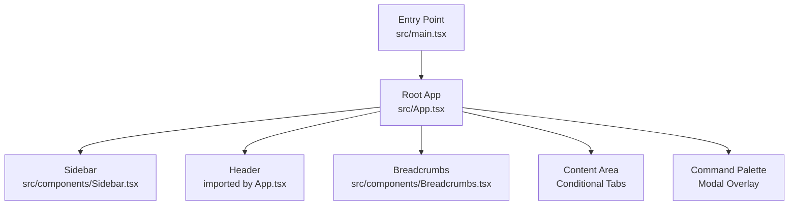
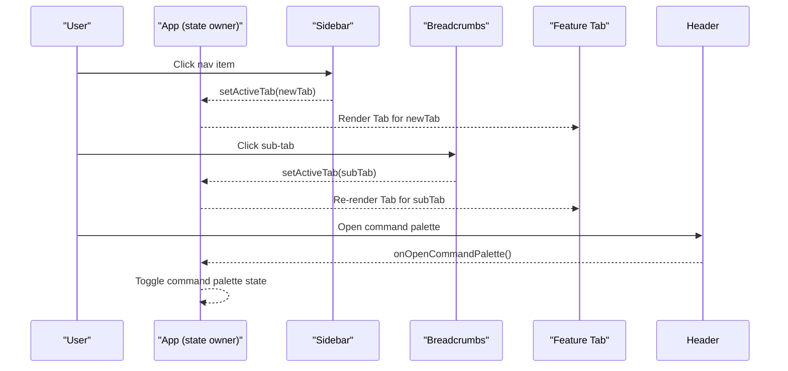
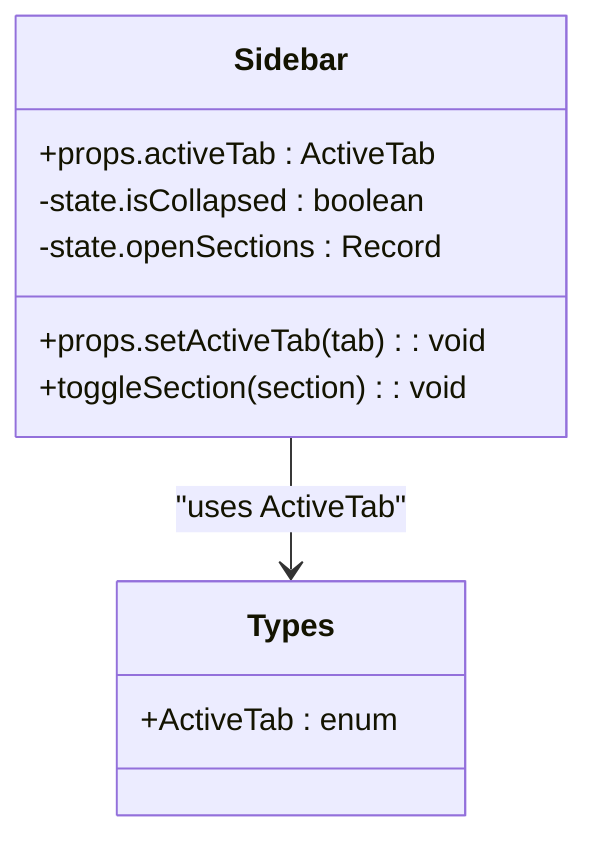
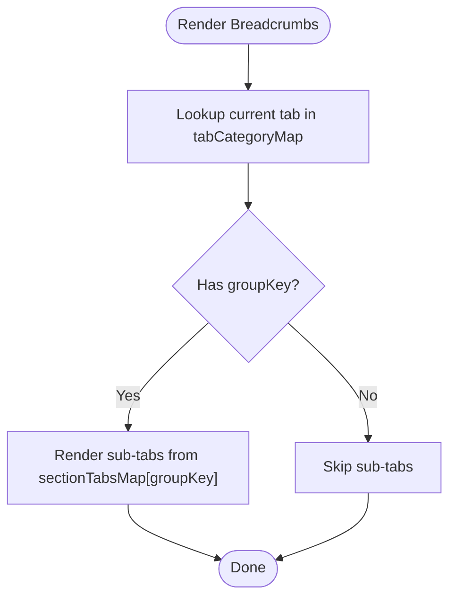
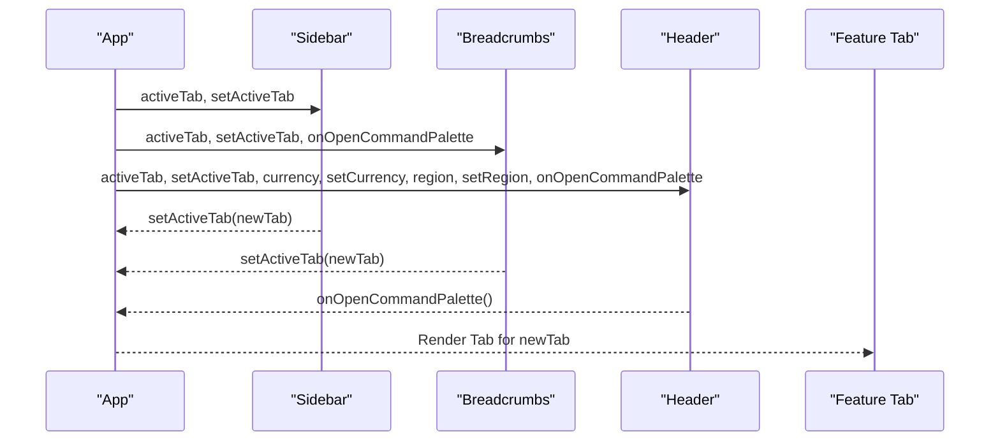
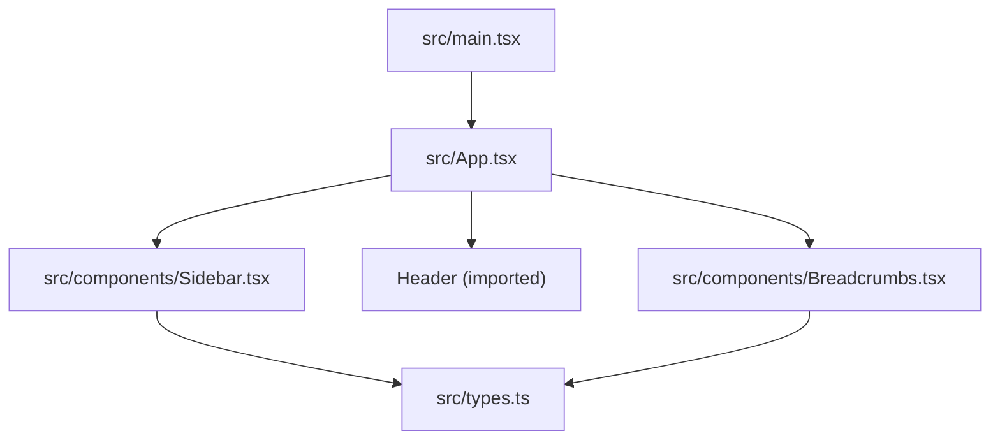

# Component Hierarchy and Layout

<cite>
**Referenced Files in This Document**
- [main.tsx](file://src/main.tsx)
- [App.tsx](file://src/App.tsx)
- [Sidebar.tsx](file://src/components/Sidebar.tsx)
- [Breadcrumbs.tsx](file://src/components/Breadcrumbs.tsx)
- [types.ts](file://src/types.ts)
</cite>

## Table of Contents
1. [Introduction](#introduction)
2. [Project Structure](#project-structure)
3. [Core Components](#core-components)
4. [Architecture Overview](#architecture-overview)
5. [Detailed Component Analysis](#detailed-component-analysis)
6. [Dependency Analysis](#dependency-analysis)
7. [Performance Considerations](#performance-considerations)
8. [Troubleshooting Guide](#troubleshooting-guide)
9. [Conclusion](#conclusion)
10. [Appendices](#appendices)

## Introduction
This document explains the React component hierarchy and layout structure that powers the responsive dashboard. It focuses on how the main layout components—Sidebar, Header (consumed by App), and Breadcrumbs—work together to present a cohesive navigation experience. It also documents the prop drilling pattern used to share active tab state and related UI controls between parent and child components, and provides guidance for extending the layout with new header controls or sidebar items while preserving existing relationships.

## Project Structure
At runtime, the application mounts via the entry point and renders the root App component, which orchestrates the layout:
- Sidebar: left-side navigation panel with collapsible sections and quick-access buttons.
- Header: top-level controls consumed by App; responsible for global filters and command palette trigger.
- Breadcrumbs: contextual navigation bar above the content area, showing category and current page plus sub-tabs.
- Content area: conditional rendering of feature tabs based on activeTab.

**Diagram sources**
- [main.tsx:6-10](file://src/main.tsx#L6-L10)
- [App.tsx:43-175](file://src/App.tsx#L43-L175)

**Section sources**
- [main.tsx:1-11](file://src/main.tsx#L1-L11)
- [App.tsx:1-177](file://src/App.tsx#L1-L177)

## Core Components
- Sidebar: Renders grouped navigation items, supports collapse/expand behavior, highlights the active tab, and exposes quick-access actions. It receives activeTab and setActiveTab from App and updates the selected tab accordingly.
- Breadcrumbs: Displays a breadcrumb trail and contextual sub-tabs for the current section. It uses a mapping table to derive category and label from activeTab and allows switching within the same group.
- Header: Consumed by App to expose global controls such as currency, region, and command palette toggle. While its implementation is not included here, it participates in the same prop-driven state flow.
- App: Holds shared state (activeTab, currency, region, command palette visibility) and passes it down to children. It conditionally renders the appropriate tab content based on activeTab.

Key responsibilities:
- State ownership: App owns activeTab and related UI flags.
- Navigation: Sidebar and Breadcrumbs update activeTab through callbacks.
- Contextual display: Breadcrumbs derives labels and sub-tabs from activeTab mappings.

**Section sources**
- [App.tsx:43-175](file://src/App.tsx#L43-L175)
- [Sidebar.tsx:36-74](file://src/components/Sidebar.tsx#L36-L74)
- [Breadcrumbs.tsx:5-14](file://src/components/Breadcrumbs.tsx#L5-L14)

## Architecture Overview
The layout follows a unidirectional data flow:
- App holds activeTab and setter functions.
- Sidebar and Breadcrumbs call setActiveTab to change the view.
- App re-renders the corresponding tab content.
- Header and Breadcrumbs can open the Command Palette via callbacks.

**Diagram sources**
- [App.tsx:110-175](file://src/App.tsx#L110-L175)
- [Sidebar.tsx:253-283](file://src/components/Sidebar.tsx#L253-L283)
- [Breadcrumbs.tsx:146-161](file://src/components/Breadcrumbs.tsx#L146-L161)

## Detailed Component Analysis

### Sidebar Component
Responsibilities:
- Grouped navigation with expand/collapse per section.
- Active tab highlighting and quick-access buttons.
- Collapsible panel for compact mode.

Data model:
- Nav groups define keys, titles, colors, badges, and items with id, label, icon, and optional badge.
- Color styles map maps color tokens to Tailwind classes.

State:
- isCollapsed toggles width and visibility of text.
- openSections tracks expanded sections.

Interactions:
- Clicking an item calls setActiveTab(item.id).
- Quick-access buttons set specific tabs like workflow and public_website.

Extending the Sidebar:
- Add a new item by appending to one of the navGroups arrays.
- Ensure the id matches a value in ActiveTab type.
- Optionally add a badge string for visual indicators.

**Diagram sources**
- [Sidebar.tsx:36-74](file://src/components/Sidebar.tsx#L36-L74)
- [types.ts:1-35](file://src/types.ts#L1-L35)

**Section sources**
- [Sidebar.tsx:1-317](file://src/components/Sidebar.tsx#L1-L317)
- [types.ts:1-35](file://src/types.ts#L1-L35)

### Breadcrumbs Component
Responsibilities:
- Display breadcrumb trail with Home, Category, and Current Page.
- Show contextual sub-tabs for the current section.
- Provide keyboard shortcut hint for command palette.

Data model:
- tabCategoryMap maps each ActiveTab to category, label, and groupKey.
- sectionTabsMap defines sub-tabs per groupKey.

Interactions:
- Clicking Home navigates to overview.
- Clicking sub-tabs calls setActiveTab(sub.id).
- Optional onOpenCommandPalette callback opens the command palette.

Extending the Breadcrumbs:
- Add a new mapping entry in tabCategoryMap for any new ActiveTab.
- If the tab belongs to a new group, add entries in sectionTabsMap under the new groupKey.

**Diagram sources**
- [Breadcrumbs.tsx:16-54](file://src/components/Breadcrumbs.tsx#L16-L54)
- [Breadcrumbs.tsx:56-99](file://src/components/Breadcrumbs.tsx#L56-L99)
- [Breadcrumbs.tsx:101-166](file://src/components/Breadcrumbs.tsx#L101-L166)

**Section sources**
- [Breadcrumbs.tsx:1-167](file://src/components/Breadcrumbs.tsx#L1-L167)

### App Layout and Prop Drilling
Responsibilities:
- Owns activeTab, currency, region, and command palette state.
- Passes these props to Sidebar, Header, and Breadcrumbs.
- Conditionally renders tab content based on activeTab.
- Handles special case for public_website route.

Prop drilling pattern:
- Parent (App) holds state and setter functions.
- Children (Sidebar, Breadcrumbs, Header) receive props and call setters to update shared state.
- No context API is used; state flows explicitly through props.

Extending the App layout:
- To add a new header control, introduce a new state variable in App and pass it to Header along with a setter function.
- To add a new sidebar item, ensure the id exists in ActiveTab and add the item to the relevant navGroup in Sidebar.
- For new tabs, add a conditional render branch in App’s content area.

**Diagram sources**
- [App.tsx:43-175](file://src/App.tsx#L43-L175)

**Section sources**
- [App.tsx:1-177](file://src/App.tsx#L1-L177)

## Dependency Analysis
High-level dependencies:
- App depends on Sidebar, Header, Breadcrumbs, and many feature tabs.
- Sidebar depends on types.ActiveTab for tab identifiers.
- Breadcrumbs depends on types.ActiveTab and internal mapping tables.
- Entry point mounts App into the DOM.

**Diagram sources**
- [main.tsx:6-10](file://src/main.tsx#L6-L10)
- [App.tsx:1-42](file://src/App.tsx#L1-L42)
- [Sidebar.tsx:1-35](file://src/components/Sidebar.tsx#L1-L35)
- [Breadcrumbs.tsx:1-10](file://src/components/Breadcrumbs.tsx#L1-L10)
- [types.ts:1-35](file://src/types.ts#L1-L35)

**Section sources**
- [App.tsx:1-42](file://src/App.tsx#L1-L42)
- [types.ts:1-35](file://src/types.ts#L1-L35)

## Performance Considerations
- Conditional rendering: App renders only the active tab, minimizing unnecessary work.
- Collapsed sidebar: Reduces DOM size and improves responsiveness on smaller screens.
- Mapping tables: Breadcrumbs uses lookup maps to avoid heavy computations during render.
- Avoid excessive re-renders: Keep state minimal in App and pass stable handlers where possible.

[No sources needed since this section provides general guidance]

## Troubleshooting Guide
Common issues and resolutions:
- New tab not visible: Ensure the new id exists in ActiveTab and add a conditional render branch in App.
- Sidebar item not clickable: Verify the id matches ActiveTab and that setActiveTab is passed correctly.
- Breadcrumbs missing sub-tabs: Confirm tabCategoryMap and sectionTabsMap include the new tab and groupKey.
- Command palette not opening: Check that onOpenCommandPalette is wired in both Header and Breadcrumbs and toggles App state.

**Section sources**
- [App.tsx:110-175](file://src/App.tsx#L110-L175)
- [Sidebar.tsx:253-283](file://src/components/Sidebar.tsx#L253-L283)
- [Breadcrumbs.tsx:146-161](file://src/components/Breadcrumbs.tsx#L146-L161)

## Conclusion
The layout relies on a clear, prop-driven architecture where App owns shared state and children interact via callbacks. Sidebar and Breadcrumbs provide complementary navigation experiences, while Header offers global controls. Extending the layout involves updating the ActiveTab type, adding items/mappings, and wiring up new state in App when necessary.

[No sources needed since this section summarizes without analyzing specific files]

## Appendices

### How to Extend the Layout

- Add a new sidebar item:
  - Define a new id in ActiveTab.
  - Add an item to the appropriate navGroup in Sidebar with id, label, icon, and optional badge.
  - Add a conditional render branch in App to show the new tab.

- Add a new header control:
  - Introduce a new state variable and setter in App.
  - Pass the state and setter to Header via props.
  - Implement the control in Header to update App state.

- Update breadcrumbs for a new tab:
  - Add an entry in tabCategoryMap with category, label, and groupKey.
  - If part of a group, add sub-tab entries in sectionTabsMap under the groupKey.

[No sources needed since this section provides general guidance]