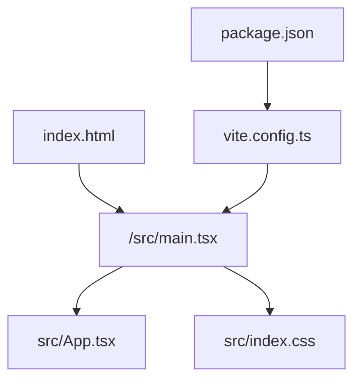
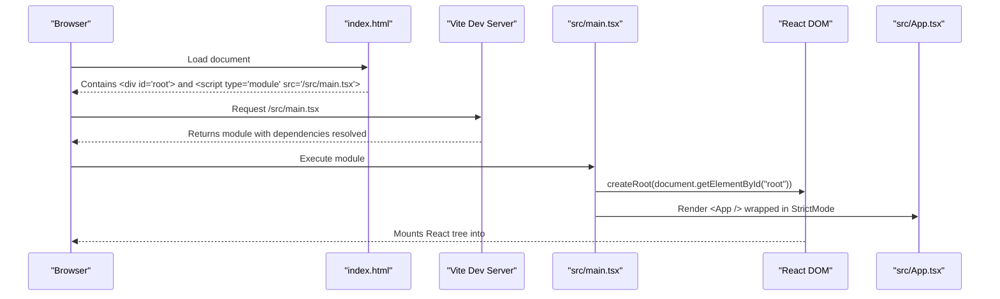
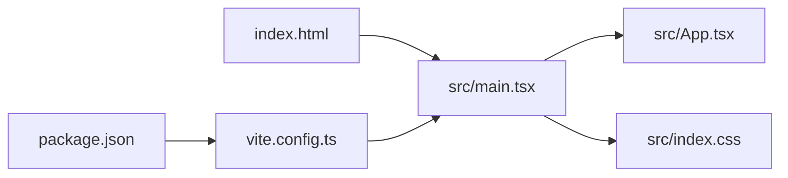

# Main Application Entry Point

<cite>
**Referenced Files in This Document**
- [main.tsx](file://src/main.tsx)
- [index.html](file://index.html)
- [vite.config.ts](file://vite.config.ts)
- [package.json](file://package.json)
- [index.css](file://src/index.css)
- [App.tsx](file://src/App.tsx)
- [tsconfig.json](file://tsconfig.json)
</cite>

## Table of Contents
1. [Introduction](#introduction)
2. [Project Structure](#project-structure)
3. [Core Components](#core-components)
4. [Architecture Overview](#architecture-overview)
5. [Detailed Component Analysis](#detailed-component-analysis)
6. [Dependency Analysis](#dependency-analysis)
7. [Performance Considerations](#performance-considerations)
8. [Troubleshooting Guide](#troubleshooting-guide)
9. [Conclusion](#conclusion)
10. [Appendices](#appendices)

## Introduction
This document explains how the React application is bootstrapped at the main entry point, how Vite integrates with the build and development server, and how the HTML template mounts the React app into the DOM. It also covers global CSS imports, font loading considerations, initial page setup, and provides guidance for extending the entry point with custom initialization logic or additional global configurations.

## Project Structure
At a high level:
- index.html defines the minimal HTML shell and loads the module script that starts the React app.
- src/main.tsx is the React entry point where the root component is created and mounted into the DOM.
- vite.config.ts configures Vite plugins (React and Tailwind), path aliases, and dev server behavior.
- package.json scripts drive development and production builds using Vite and a Node server.
- src/index.css imports Tailwind to provide global styles.
- src/App.tsx is the top-level application component rendered by the entry point.

**Diagram sources**
- [index.html:1-14](file://index.html#L1-L14)
- [main.tsx:1-11](file://src/main.tsx#L1-L11)
- [vite.config.ts:1-23](file://vite.config.ts#L1-L23)
- [package.json:1-64](file://package.json#L1-L64)

**Section sources**
- [index.html:1-14](file://index.html#L1-L14)
- [main.tsx:1-11](file://src/main.tsx#L1-L11)
- [vite.config.ts:1-23](file://vite.config.ts#L1-L23)
- [package.json:1-64](file://package.json#L1-L64)

## Core Components
- Entry point (src/main.tsx): Creates the React root and renders the App component inside StrictMode. It also imports global CSS.
- HTML shell (index.html): Provides the document structure, meta tags, title, favicon link, and the root div used by React to mount.
- Vite configuration (vite.config.ts): Enables React and Tailwind plugins, sets up path aliasing, and controls HMR and file watching behavior.
- Global styles (src/index.css): Imports Tailwind to apply base styles globally.
- Top-level app (src/App.tsx): The root React component that composes UI and manages application state.

Key responsibilities:
- DOM mounting: createRoot and render are used to attach the React tree to #root.
- Development experience: Vite’s HMR and watch settings are controlled via environment variables.
- Styling: Tailwind is enabled through both Vite plugin and CSS import.

**Section sources**
- [main.tsx:1-11](file://src/main.tsx#L1-L11)
- [index.html:1-14](file://index.html#L1-L14)
- [vite.config.ts:1-23](file://vite.config.ts#L1-L23)
- [index.css:1-2](file://src/index.css#L1-L2)
- [App.tsx:1-177](file://src/App.tsx#L1-L177)

## Architecture Overview
The bootstrap flow connects the HTML shell to the React runtime via Vite’s module system.

**Diagram sources**
- [index.html:1-14](file://index.html#L1-L14)
- [main.tsx:1-11](file://src/main.tsx#L1-L11)
- [vite.config.ts:1-23](file://vite.config.ts#L1-L23)

## Detailed Component Analysis

### HTML Template (index.html)
- Declares language, charset, viewport, and page title.
- Includes a favicon link.
- Provides the root container element (#root).
- Loads the React entry module as an ES module.

Practical notes:
- To add global fonts, include <link> or @import statements here or within your global CSS.
- For analytics or third-party scripts, add them before the closing </body> tag if they must run early.

**Section sources**
- [index.html:1-14](file://index.html#L1-L14)

### React Entry Point (src/main.tsx)
- Imports React StrictMode and ReactDOM’s createRoot.
- Imports the root component (App) and global CSS.
- Creates the root and renders the App component inside StrictMode.

Customization ideas:
- Add global initialization logic before rendering (e.g., feature flags, telemetry, error boundaries).
- Wrap App with providers (auth, theme, i18n) or error boundary components.
- Inject environment-specific configurations prior to render.

**Section sources**
- [main.tsx:1-11](file://src/main.tsx#L1-L11)

### Vite Configuration (vite.config.ts)
- Plugins: React and Tailwind are enabled.
- Path alias: @ maps to project root for cleaner imports.
- Dev server: HMR and file watching can be toggled via DISABLE_HMR environment variable.

Implications:
- Tailwind processing occurs during build and dev via the Vite plugin.
- Aliases simplify absolute imports across the codebase.
- Disabling HMR reduces CPU usage in environments where file watching is problematic.

**Section sources**
- [vite.config.ts:1-23](file://vite.config.ts#L1-L23)

### Global Styles (src/index.css)
- Imports Tailwind to enable utility classes globally.

Extensions:
- Add global resets, custom properties, or font-face declarations here.
- Import additional global modules (e.g., icons, polyfills) from this file to ensure they load once.

**Section sources**
- [index.css:1-2](file://src/index.css#L1-L2)

### Root Application Component (src/App.tsx)
- Defines the top-level layout and tab-based navigation.
- Manages local state for active tab, currency, region, command palette visibility, and current user session.
- Performs an initial session check and listens for auth changes.

Relevance to entry point:
- This component is what gets mounted by main.tsx; any global initialization should ideally occur before or around this render.

**Section sources**
- [App.tsx:1-177](file://src/App.tsx#L1-L177)

### TypeScript Configuration (tsconfig.json)
- Targets modern ECMAScript and enables JSX transform.
- Uses bundler module resolution and supports path aliases consistent with Vite.

Impact on entry point:
- Ensures main.tsx compiles correctly with JSX and module resolution rules expected by Vite.

**Section sources**
- [tsconfig.json:1-27](file://tsconfig.json#L1-L27)

### Build and Scripts (package.json)
- Development script runs a Node server via tsx.
- Build script uses Vite to bundle the frontend and then bundles the server with esbuild.
- Start script executes the compiled server.

How it relates to bootstrap:
- During development, Vite serves the module defined in index.html and hot-reloads changes.
- In production, Vite generates static assets served by the Node server.

**Section sources**
- [package.json:1-64](file://package.json#L1-L64)

## Dependency Analysis
The entry point depends on React, ReactDOM, and the root App component. Vite orchestrates dependency resolution and transformation.

**Diagram sources**
- [index.html:1-14](file://index.html#L1-L14)
- [main.tsx:1-11](file://src/main.tsx#L1-L11)
- [vite.config.ts:1-23](file://vite.config.ts#L1-L23)
- [package.json:1-64](file://package.json#L1-L64)

**Section sources**
- [main.tsx:1-11](file://src/main.tsx#L1-L11)
- [vite.config.ts:1-23](file://vite.config.ts#L1-L23)
- [package.json:1-64](file://package.json#L1-L64)

## Performance Considerations
- Keep global imports minimal in main.tsx to reduce startup time.
- Use lazy loading for heavy components beyond the root App when possible.
- Tailwind processing is handled by Vite; avoid unnecessary large CSS imports.
- HMR can be disabled in specific environments to reduce CPU usage during edits.

[No sources needed since this section provides general guidance]

## Troubleshooting Guide
Common issues and resolutions:
- App does not mount: Ensure index.html contains a div with id="root".
- Styles not applied: Confirm Tailwind is imported in src/index.css and enabled in vite.config.ts.
- HMR not working: Check DISABLE_HMR environment variable and browser console for module errors.
- Fonts not loading: Verify font links or @imports are present in index.html or global CSS and paths are correct.

**Section sources**
- [index.html:1-14](file://index.html#L1-L14)
- [index.css:1-2](file://src/index.css#L1-L2)
- [vite.config.ts:1-23](file://vite.config.ts#L1-L23)

## Conclusion
The React application is bootstrapped through a simple and clear pipeline: index.html loads the module entry, which creates the React root and renders the App component. Vite configures the build and dev server, enabling React and Tailwind while providing useful features like path aliases and configurable HMR. Extending the entry point is straightforward—add initialization logic, providers, or global configurations before rendering the App component.

[No sources needed since this section summarizes without analyzing specific files]

## Appendices

### How to Modify the Entry Point for Custom Initialization
- Add global initialization code before creating the React root (e.g., feature flags, analytics, error tracking).
- Wrap the App component with providers (authentication, theme, internationalization) or error boundaries.
- Import additional global modules (polyfills, icon libraries) from the entry point to ensure single-load behavior.

Example modification points:
- Before createRoot call: initialize services or set up global listeners.
- After createRoot but before render: configure providers or perform async readiness checks.

**Section sources**
- [main.tsx:1-11](file://src/main.tsx#L1-L11)

### Font Loading Best Practices
- Prefer adding web fonts in index.html via <link rel="preload"> for critical fonts.
- Alternatively, define @font-face in src/index.css and use font-display strategies for performance.
- Avoid blocking render with heavy font loading; consider asynchronous loading techniques.

**Section sources**
- [index.html:1-14](file://index.html#L1-L14)
- [index.css:1-2](file://src/index.css#L1-L2)