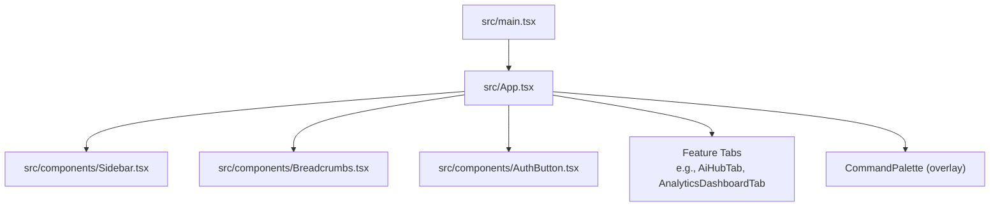
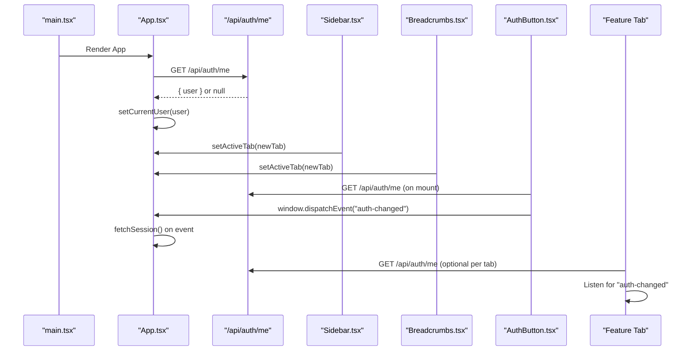
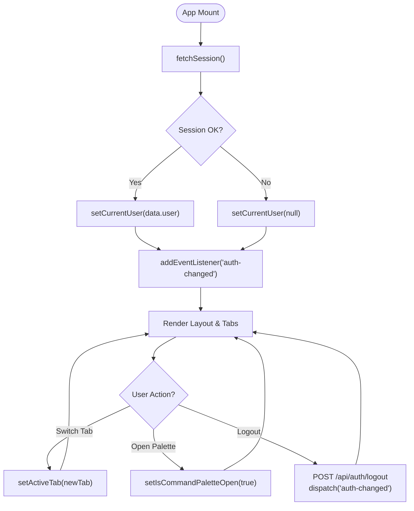
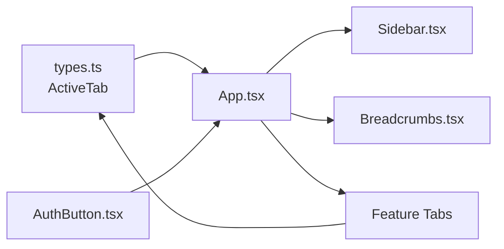

# React Application Structure

<cite>
**Referenced Files in This Document**
- [main.tsx](file://src/main.tsx)
- [App.tsx](file://src/App.tsx)
- [types.ts](file://src/types.ts)
- [Sidebar.tsx](file://src/components/Sidebar.tsx)
- [Breadcrumbs.tsx](file://src/components/Breadcrumbs.tsx)
- [AuthButton.tsx](file://src/components/AuthButton.tsx)
- [AiHubTab.tsx](file://src/components/AiHubTab.tsx)
- [AnalyticsDashboardTab.tsx](file://src/components/AnalyticsDashboardTab.tsx)
- [package.json](file://package.json)
</cite>

## Table of Contents
1. [Introduction](#introduction)
2. [Project Structure](#project-structure)
3. [Core Components](#core-components)
4. [Architecture Overview](#architecture-overview)
5. [Detailed Component Analysis](#detailed-component-analysis)
6. [Dependency Analysis](#dependency-analysis)
7. [Performance Considerations](#performance-considerations)
8. [Troubleshooting Guide](#troubleshooting-guide)
9. [Conclusion](#conclusion)
10. [Appendices](#appendices)

## Introduction
This document explains the React application structure with a focus on:
- The root App component architecture and how it orchestrates layout, tabs, and global state
- State management using useState hooks for active tab, currency, region, command palette visibility, and user session
- Tab-based navigation driven by a centralized ActiveTab type and rendered conditionally in App
- Authentication flow via session checks to /api/auth/me and cross-component synchronization through window events
- Command palette integration and global event handling patterns
- How to add new tabs and communicate between components via props and events

## Project Structure
The application is a Vite + React project. The entry point renders the root App component inside React StrictMode. The App component composes the Sidebar, Header (not included here), Breadcrumbs, multiple feature tabs, and a CommandPalette overlay. Global UI state such as the active tab and authentication status lives in App and is passed down via props.

**Diagram sources**
- [main.tsx:1-11](file://src/main.tsx#L1-L11)
- [App.tsx:1-177](file://src/App.tsx#L1-L177)

**Section sources**
- [main.tsx:1-11](file://src/main.tsx#L1-L11)
- [App.tsx:1-177](file://src/App.tsx#L1-L177)

## Core Components
- App (root): Holds global state (activeTab, currency, region, command palette open flag, currentUser). Renders layout, conditional public website view, and all feature tabs based on activeTab. Performs initial session check and listens for auth-changed events.
- Sidebar: Displays grouped navigation items. Calls setActiveTab from App to switch tabs. Supports collapsed mode and quick-access buttons.
- Breadcrumbs: Shows contextual breadcrumb trail and section sub-tabs. Can trigger opening the command palette via onOpenCommandPalette.
- AuthButton: Manages login/register/forgot flows, checks session via /api/auth/me, and dispatches auth-changed events to keep App and other consumers in sync.
- Feature Tabs: Independent components like AiHubTab and AnalyticsDashboardTab that manage their own local state and may also fetch session data and listen to auth-changed.

Key responsibilities:
- Centralized tab state in App ensures single source of truth for navigation
- Props pass setters and values down to children for controlled behavior
- Global events (auth-changed) decouple authentication state across components

**Section sources**
- [App.tsx:1-177](file://src/App.tsx#L1-L177)
- [Sidebar.tsx:1-317](file://src/components/Sidebar.tsx#L1-L317)
- [Breadcrumbs.tsx:1-167](file://src/components/Breadcrumbs.tsx#L1-L167)
- [AuthButton.tsx:1-384](file://src/components/AuthButton.tsx#L1-L384)
- [AiHubTab.tsx:1-565](file://src/components/AiHubTab.tsx#L1-L565)
- [AnalyticsDashboardTab.tsx:1-149](file://src/components/AnalyticsDashboardTab.tsx#L1-L149)

## Architecture Overview
The app follows a top-down prop-driven architecture with a central state owner (App). Navigation is tab-based and enforced by a strict ActiveTab union type. Authentication is handled both at the App level and within specific components, synchronized via window events.

**Diagram sources**
- [App.tsx:43-88](file://src/App.tsx#L43-L88)
- [Sidebar.tsx:54-73](file://src/components/Sidebar.tsx#L54-L73)
- [Breadcrumbs.tsx:101-138](file://src/components/Breadcrumbs.tsx#L101-L138)
- [AuthButton.tsx:28-60](file://src/components/AuthButton.tsx#L28-L60)
- [AiHubTab.tsx:8-36](file://src/components/AiHubTab.tsx#L8-L36)

## Detailed Component Analysis

### App Component
Responsibilities:
- Maintains activeTab, currency, region, command palette visibility, and currentUser
- Fetches session on mount and refreshes on auth-changed
- Renders either PublicWebsite or the main dashboard depending on activeTab
- Conditionally renders each feature tab based on activeTab value
- Passes setActiveTab and relevant settings down to Sidebar, Header, Breadcrumbs, and CommandPalette

State management:
- useState for activeTab, currency, region, isCommandPaletteOpen, currentUser
- useEffect to initialize session and attach/remove auth-changed listener

Navigation:
- activeTab is the single source of truth; child components call setActiveTab to switch views

Authentication:
- fetchSession calls /api/auth/me and updates currentUser
- handleLogout posts to /api/auth/logout and dispatches auth-changed

Command palette:
- Controlled via isCommandPaletteOpen and onClose callback

**Diagram sources**
- [App.tsx:43-88](file://src/App.tsx#L43-L88)
- [App.tsx:109-175](file://src/App.tsx#L109-L175)

**Section sources**
- [App.tsx:1-177](file://src/App.tsx#L1-L177)

### Sidebar Component
Responsibilities:
- Defines grouped navigation items with icons and labels
- Handles collapse/expand behavior
- Calls setActiveTab when a navigation item is clicked
- Provides quick-access buttons for Workflow and Public Website

Props:
- activeTab: current tab identifier
- setActiveTab: function to update the active tab in App

Behavior:
- Uses internal state for collapsed mode and open sections
- Highlights active item and supports badges

**Section sources**
- [Sidebar.tsx:1-317](file://src/components/Sidebar.tsx#L1-L317)

### Breadcrumbs Component
Responsibilities:
- Displays category and label for the current tab
- Shows contextual sub-tabs for the current group
- Provides a button to open the command palette

Props:
- activeTab, setActiveTab, onOpenCommandPalette

Behavior:
- Maps activeTab to category/group metadata
- Renders clickable sub-tabs to switch within a group

**Section sources**
- [Breadcrumbs.tsx:1-167](file://src/components/Breadcrumbs.tsx#L1-L167)

### AuthButton Component
Responsibilities:
- Presents login/register/forgot password modal
- Checks session via /api/auth/me on mount and on auth-changed
- Dispatches auth-changed after successful sign-in/sign-out
- Supports compact and standard modes

Props:
- compact: boolean to render a compact version

Behavior:
- Uses Supabase client if available, otherwise falls back to server endpoints
- Validates inputs and handles errors gracefully

**Section sources**
- [AuthButton.tsx:1-384](file://src/components/AuthButton.tsx#L1-L384)

### Feature Tabs Example: AiHubTab
Responsibilities:
- Implements sub-tabs for AI features (grounding, thinking, voice, flash lite, cloud sync)
- Fetches session and listens to auth-changed
- Simulates AI responses and saves logs locally per user

State:
- Sub-tab selection, prompts, results, recording state, saved items, sync status

Integration:
- Reads currentUser from /api/auth/me and uses it to scope localStorage keys

**Section sources**
- [AiHubTab.tsx:1-565](file://src/components/AiHubTab.tsx#L1-L565)

### Feature Tabs Example: AnalyticsDashboardTab
Responsibilities:
- Displays analytics metrics and charts
- Manages timeframe selection state

State:
- timeframe selection

Integration:
- Self-contained; no direct dependency on App state beyond props if needed

**Section sources**
- [AnalyticsDashboardTab.tsx:1-149](file://src/components/AnalyticsDashboardTab.tsx#L1-L149)

## Dependency Analysis
- App depends on types.ts for ActiveTab union
- Sidebar and Breadcrumbs depend on App’s setActiveTab to drive navigation
- AuthButton and some tabs independently verify session and listen to auth-changed
- package.json defines dependencies including React, Tailwind-related tooling, and charting libraries used by tabs

**Diagram sources**
- [types.ts:1-35](file://src/types.ts#L1-L35)
- [App.tsx:1-44](file://src/App.tsx#L1-L44)
- [Sidebar.tsx:1-40](file://src/components/Sidebar.tsx#L1-L40)
- [Breadcrumbs.tsx:1-10](file://src/components/Breadcrumbs.tsx#L1-L10)
- [package.json:15-45](file://package.json#L15-L45)

**Section sources**
- [types.ts:1-35](file://src/types.ts#L1-L35)
- [package.json:1-64](file://package.json#L1-L64)

## Performance Considerations
- Conditional rendering of many tabs keeps the DOM lean; only the active tab is mounted
- Avoid heavy computations in render paths; prefer memoization where necessary
- Debounce frequent setState calls (e.g., search inputs) to prevent re-renders
- Keep session checks minimal and reuse results via events rather than polling
- Use lightweight overlays (like CommandPalette) and lazy-load heavy components if needed

[No sources needed since this section provides general guidance]

## Troubleshooting Guide
Common issues and resolutions:
- Session not detected: Ensure /api/auth/me responds correctly and CORS is configured. Verify that fetchSession runs on mount and that auth-changed listeners are attached.
- Tab not switching: Confirm setActiveTab is called from Sidebar/Breadcrumbs and that activeTab is compared exactly against the string values defined in ActiveTab.
- Command palette not opening: Check that onOpenCommandPalette is wired in Breadcrumbs and Header, and that setIsCommandPaletteOpen toggles the correct state.
- Auth state desync: After logout or login, ensure auth-changed is dispatched so App and other components refresh session state.

**Section sources**
- [App.tsx:43-88](file://src/App.tsx#L43-L88)
- [AuthButton.tsx:28-60](file://src/components/AuthButton.tsx#L28-L60)
- [Breadcrumbs.tsx:129-138](file://src/components/Breadcrumbs.tsx#L129-L138)

## Conclusion
The application centers around a single App component that owns global state and coordinates navigation via a typed ActiveTab system. Child components receive setters and values through props, while authentication state is synchronized globally using window events. This design yields clear separation of concerns, predictable navigation, and scalable addition of new tabs and features.

[No sources needed since this section summarizes without analyzing specific files]

## Appendices

### How to Add a New Tab
Steps:
1. Define the new tab key in ActiveTab union in types.ts
2. Create a new component file under src/components (e.g., NewFeatureTab.tsx)
3. Import and conditionally render the component in App.tsx based on activeTab
4. Add a navigation item in Sidebar.tsx with id set to the new tab key
5. Optionally add breadcrumbs mapping in Breadcrumbs.tsx for contextual sub-tabs
6. If the tab needs authentication, follow the pattern used in AiHubTab to fetch session and listen to auth-changed

**Section sources**
- [types.ts:1-35](file://src/types.ts#L1-L35)
- [App.tsx:131-163](file://src/App.tsx#L131-L163)
- [Sidebar.tsx:75-161](file://src/components/Sidebar.tsx#L75-L161)
- [Breadcrumbs.tsx:16-54](file://src/components/Breadcrumbs.tsx#L16-L54)
- [AiHubTab.tsx:8-36](file://src/components/AiHubTab.tsx#L8-L36)

### Component Communication Patterns
- Props: Parent passes state and setters down to children (e.g., activeTab, setActiveTab, currency, region)
- Events: Global window events (auth-changed) synchronize authentication state across components
- Local state: Each tab manages its own internal state for UI interactions and data fetching

**Section sources**
- [App.tsx:109-175](file://src/App.tsx#L109-L175)
- [AuthButton.tsx:139-162](file://src/components/AuthButton.tsx#L139-L162)
- [AiHubTab.tsx:25-36](file://src/components/AiHubTab.tsx#L25-L36)