# State Management Patterns

<cite>
**Referenced Files in This Document**
- [App.tsx](file://src/App.tsx)
- [types.ts](file://src/types.ts)
- [main.tsx](file://src/main.tsx)
- [Sidebar.tsx](file://src/components/Sidebar.tsx)
- [AuthButton.tsx](file://src/components/AuthButton.tsx)
- [ChatTab.tsx](file://src/components/ChatTab.tsx)
- [AiHubTab.tsx](file://src/components/AiHubTab.tsx)
- [SettingsTab.tsx](file://src/components/SettingsTab.tsx)
- [AuthGate.tsx](file://src/components/AuthGate.tsx)
</cite>

## Table of Contents
1. [Introduction](#introduction)
2. [Project Structure](#project-structure)
3. [Core Components](#core-components)
4. [Architecture Overview](#architecture-overview)
5. [Detailed Component Analysis](#detailed-component-analysis)
6. [Dependency Analysis](#dependency-analysis)
7. [Performance Considerations](#performance-considerations)
8. [Troubleshooting Guide](#troubleshooting-guide)
9. [Conclusion](#conclusion)
10. [Appendices](#appendices)

## Introduction
This document explains the state management patterns used across the React application, focusing on:
- Local component state with useState
- Cross-component synchronization via window events
- Prop-based state lifting for parent-child communication
- The ActiveTab type system and its role in type safety
- Examples for adding new state variables, handling async operations, and managing lifecycle effects
- Common patterns for persistence (localStorage) and error handling

The goal is to provide both a conceptual overview and concrete, code-mapped guidance so that developers can extend and maintain stateful features consistently.

## Project Structure
At a high level:
- The root entry renders the App component under StrictMode.
- App manages global UI state (active tab, currency, region, command palette visibility, current user) and orchestrates child components through props.
- Sidebar drives navigation by updating the active tab prop passed down from App.
- Auth-related components use window events to synchronize authentication state across the app.
- Feature tabs encapsulate their own local state and often persist data locally.

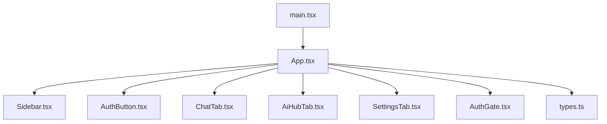

**Diagram sources**
- [main.tsx:1-11](file://src/main.tsx#L1-L11)
- [App.tsx:1-177](file://src/App.tsx#L1-L177)
- [Sidebar.tsx:1-317](file://src/components/Sidebar.tsx#L1-L317)
- [AuthButton.tsx:1-384](file://src/components/AuthButton.tsx#L1-L384)
- [ChatTab.tsx:1-355](file://src/components/ChatTab.tsx#L1-L355)
- [AiHubTab.tsx:1-565](file://src/components/AiHubTab.tsx#L1-L565)
- [SettingsTab.tsx:1-200](file://src/components/SettingsTab.tsx#L1-L200)
- [AuthGate.tsx:1-440](file://src/components/AuthGate.tsx#L1-L440)
- [types.ts:1-178](file://src/types.ts#L1-L178)

**Section sources**
- [main.tsx:1-11](file://src/main.tsx#L1-L11)
- [App.tsx:1-177](file://src/App.tsx#L1-L177)

## Core Components
- App.tsx: Central state container for top-level UI state and cross-cutting concerns (active tab, currency, region, command palette, current user). It uses useEffect to initialize session checks and listen to window events for auth changes.
- Sidebar.tsx: Manages collapsed state and open sections; updates the active tab via a callback prop from App.
- AuthButton.tsx: Owns login/register/forgot/reset flows, persists session checks, and broadcasts auth-changed events.
- ChatTab.tsx: Encapsulates chat conversation state, model/persona selection, and localStorage persistence per persona.
- AiHubTab.tsx: Demonstrates multiple local states for sub-tabs and features, plus localStorage-based sync logs keyed by user id.
- SettingsTab.tsx: Holds configuration keys, visibility toggles, and category collapse states.
- AuthGate.tsx: Handles authentication modes and form state, calling server endpoints and invoking callbacks on success.
- types.ts: Defines ActiveTab and shared interfaces ensuring type safety across components.

Key patterns:
- useState for local state
- useEffect for side effects (fetching sessions, event listeners, persistence)
- window.addEventListener('auth-changed') for cross-component synchronization
- Props for parent-child state lifting (e.g., activeTab and setActiveTab)

**Section sources**
- [App.tsx:1-177](file://src/App.tsx#L1-L177)
- [Sidebar.tsx:1-317](file://src/components/Sidebar.tsx#L1-L317)
- [AuthButton.tsx:1-384](file://src/components/AuthButton.tsx#L1-L384)
- [ChatTab.tsx:1-355](file://src/components/ChatTab.tsx#L1-L355)
- [AiHubTab.tsx:1-565](file://src/components/AiHubTab.tsx#L1-L565)
- [SettingsTab.tsx:1-200](file://src/components/SettingsTab.tsx#L1-L200)
- [AuthGate.tsx:1-440](file://src/components/AuthGate.tsx#L1-L440)
- [types.ts:1-178](file://src/types.ts#L1-L178)

## Architecture Overview
The application follows a unidirectional data flow with a central state holder at App and feature-specific local state in child components. Authentication state is synchronized globally using window events.

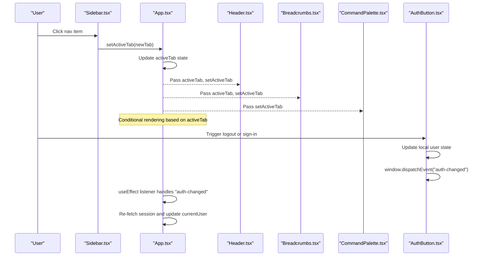

**Diagram sources**
- [Sidebar.tsx:1-317](file://src/components/Sidebar.tsx#L1-L317)
- [App.tsx:1-177](file://src/App.tsx#L1-L177)
- [AuthButton.tsx:1-384](file://src/components/AuthButton.tsx#L1-L384)

## Detailed Component Analysis

### App.tsx — Global UI and Auth State Orchestration
Responsibilities:
- Maintains activeTab, currency, region, command palette visibility, and currentUser
- Uses useEffect to fetch session and subscribe to 'auth-changed' events
- Renders different views based on activeTab and passes setters to children

Patterns:
- useState for simple scalar and boolean state
- useEffect for initialization and event subscription
- window events for cross-component auth synchronization
- Prop drilling for state and handlers to children

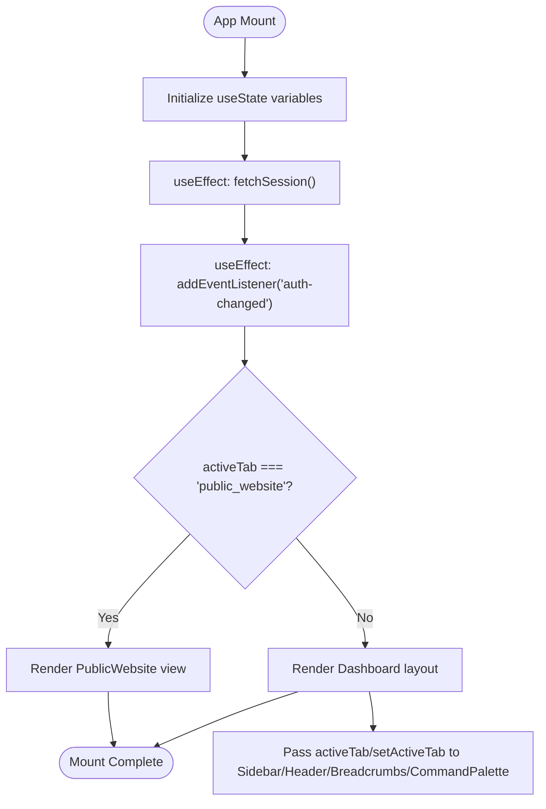

**Diagram sources**
- [App.tsx:1-177](file://src/App.tsx#L1-L177)

**Section sources**
- [App.tsx:1-177](file://src/App.tsx#L1-L177)

### Sidebar.tsx — Navigation State and Tab Switching
Responsibilities:
- Tracks collapsed state and section expansion
- Calls setActiveTab from props to switch tabs

Patterns:
- useState for local UI state
- Controlled behavior via props (activeTab, setActiveTab)

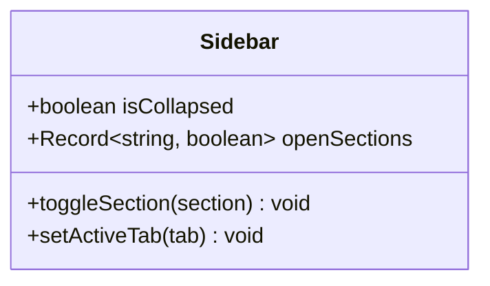

**Diagram sources**
- [Sidebar.tsx:1-317](file://src/components/Sidebar.tsx#L1-L317)

**Section sources**
- [Sidebar.tsx:1-317](file://src/components/Sidebar.tsx#L1-L317)

### AuthButton.tsx — Authentication Flow and Event Broadcasting
Responsibilities:
- Manages login/register/forgot/reset flows
- Checks session via API and listens to 'auth-changed'
- Broadcasts 'auth-changed' after successful sign-in/sign-out

Patterns:
- useState for form fields, modal visibility, loading/error states
- useEffect for session check and event listener
- window events for cross-component auth synchronization
- Async error handling with try/catch and user-facing messages

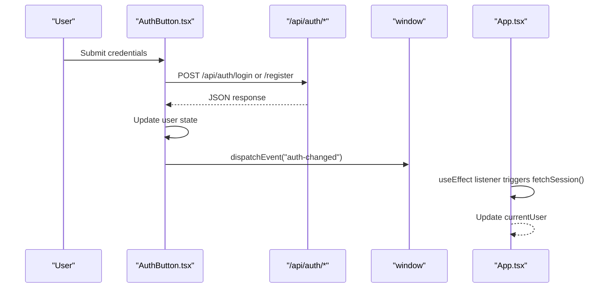

**Diagram sources**
- [AuthButton.tsx:1-384](file://src/components/AuthButton.tsx#L1-L384)
- [App.tsx:1-177](file://src/App.tsx#L1-L177)

**Section sources**
- [AuthButton.tsx:1-384](file://src/components/AuthButton.tsx#L1-L384)

### ChatTab.tsx — Local Chat State and Persistence
Responsibilities:
- Persists chat history per persona using localStorage
- Manages message list, input, loading, persona/model selection
- Sends messages to backend and updates persisted history

Patterns:
- useState for messages, input, loading, persona/model
- useEffect to load history on persona change and scroll to bottom
- localStorage for persistence
- Async error handling with user-visible error messages

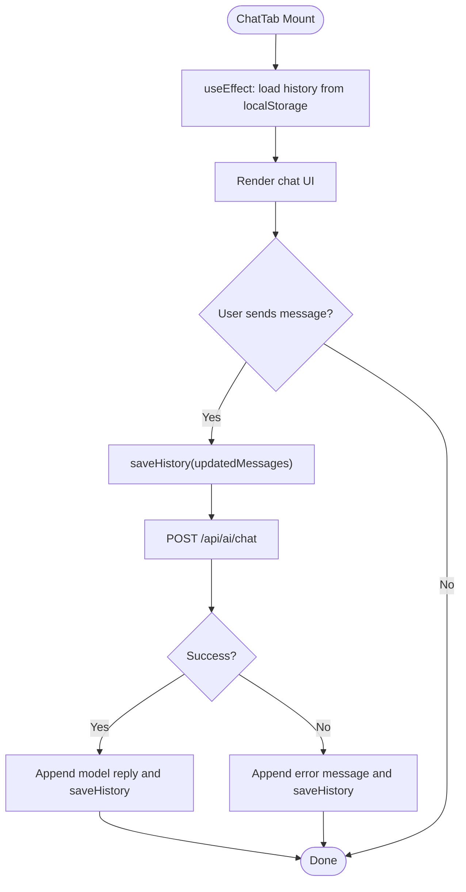

**Diagram sources**
- [ChatTab.tsx:1-355](file://src/components/ChatTab.tsx#L1-L355)

**Section sources**
- [ChatTab.tsx:1-355](file://src/components/ChatTab.tsx#L1-L355)

### AiHubTab.tsx — Multi-State Sub-Tabs and Local Sync Logs
Responsibilities:
- Manages sub-tab selection and multiple feature states (grounding, thinking, voice, flash lite)
- Persists logs to localStorage keyed by user id
- Listens to 'auth-changed' to refresh current user and load saved items

Patterns:
- useState for each feature’s inputs/results/loading flags
- useEffect for session fetching and event listening
- localStorage for user-scoped persistence
- Error handling with console logging and status messages

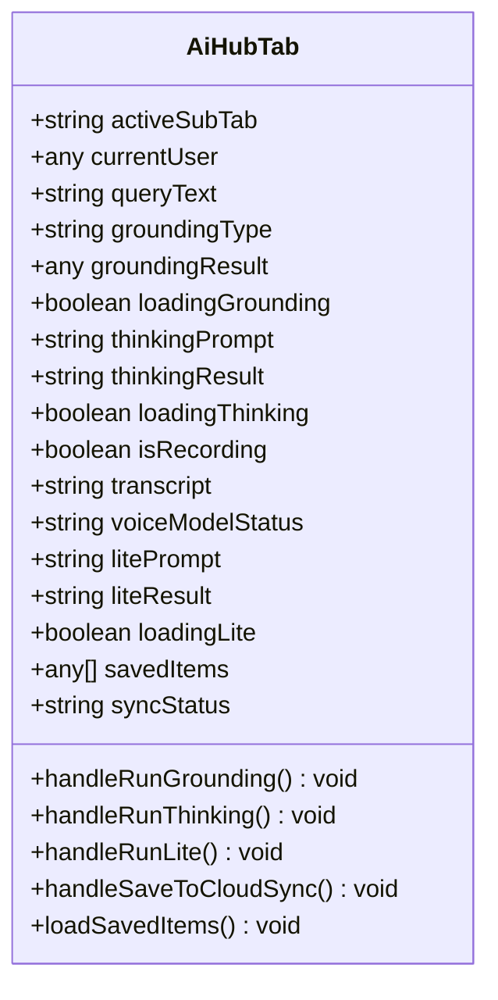

**Diagram sources**
- [AiHubTab.tsx:1-565](file://src/components/AiHubTab.tsx#L1-L565)

**Section sources**
- [AiHubTab.tsx:1-565](file://src/components/AiHubTab.tsx#L1-L565)

### SettingsTab.tsx — Configuration State Management
Responsibilities:
- Tracks active sub-tab, app name, configured keys, revealed keys, collapsed categories, editing state
- Provides UI for managing integration keys and domains

Patterns:
- useState for multiple configuration objects and booleans
- Controlled inputs for inline editing and toggles

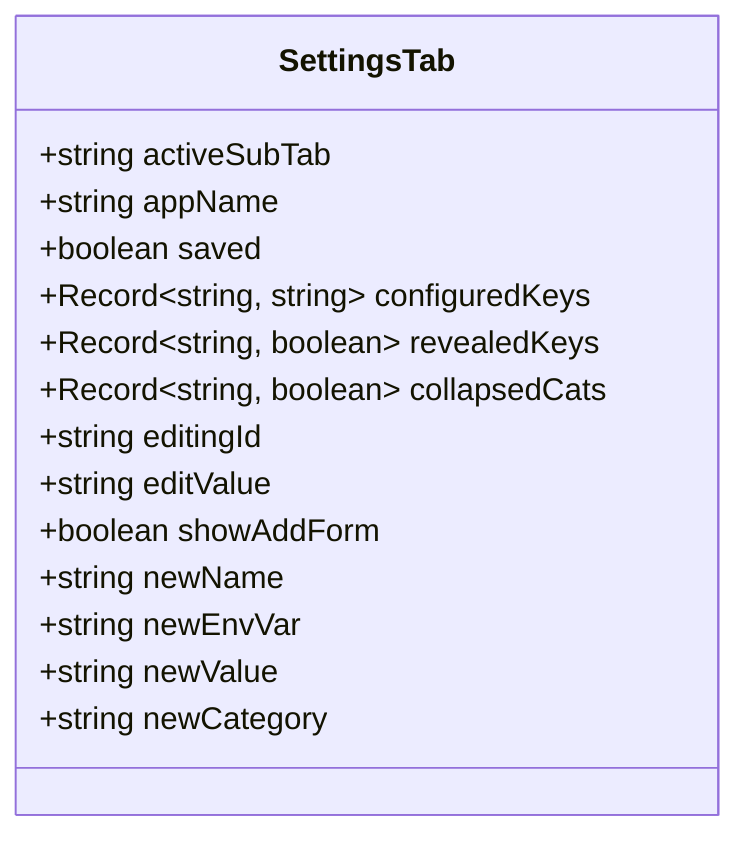

**Diagram sources**
- [SettingsTab.tsx:1-200](file://src/components/SettingsTab.tsx#L1-L200)

**Section sources**
- [SettingsTab.tsx:1-200](file://src/components/SettingsTab.tsx#L1-L200)

### AuthGate.tsx — Authentication Mode State
Responsibilities:
- Manages login/register/forgot/reset modes and form state
- Validates inputs and calls server endpoints
- Invokes onAuthenticated callback on success

Patterns:
- useState for mode, form fields, errors, success, loading
- useEffect to clean reset token from URL
- Async error handling and user feedback

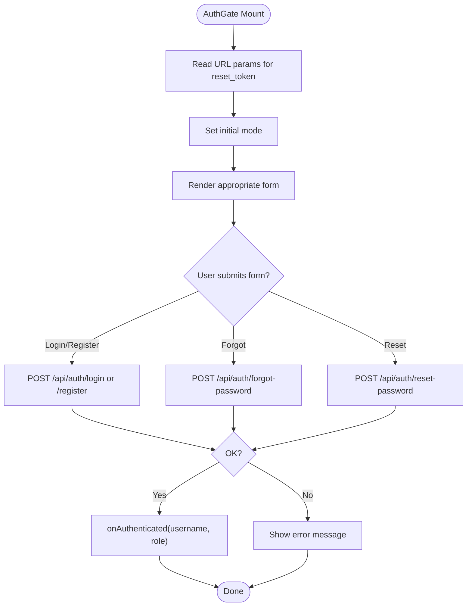

**Diagram sources**
- [AuthGate.tsx:1-440](file://src/components/AuthGate.tsx#L1-L440)

**Section sources**
- [AuthGate.tsx:1-440](file://src/components/AuthGate.tsx#L1-L440)

### types.ts — ActiveTab Type System
The ActiveTab union type ensures consistent tab identifiers across the app, preventing typos and enabling type-safe conditional rendering and navigation.

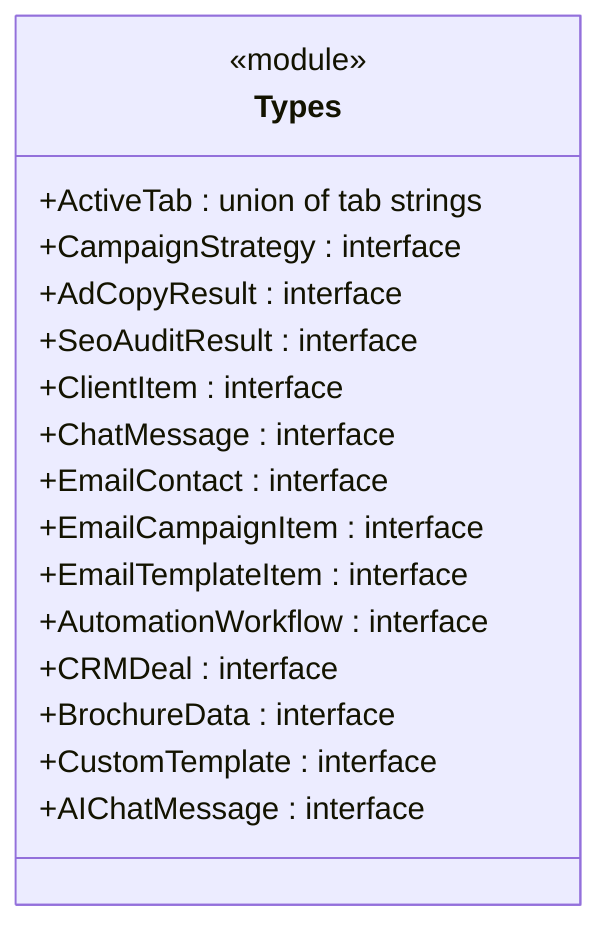

**Diagram sources**
- [types.ts:1-178](file://src/types.ts#L1-L178)

**Section sources**
- [types.ts:1-178](file://src/types.ts#L1-L178)

## Dependency Analysis
- App depends on types.ts for ActiveTab and on child components for rendering.
- Sidebar depends on props from App for activeTab and setActiveTab.
- AuthButton and App share synchronization via window events.
- ChatTab and AiHubTab rely on localStorage for persistence and may call backend APIs.
- SettingsTab holds configuration state without direct external dependencies in the UI layer.

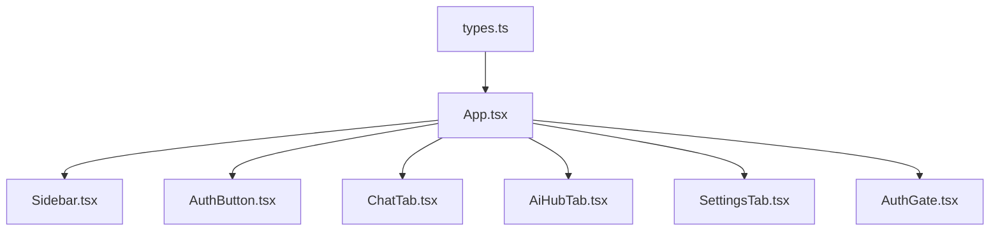

**Diagram sources**
- [types.ts:1-178](file://src/types.ts#L1-L178)
- [App.tsx:1-177](file://src/App.tsx#L1-L177)
- [Sidebar.tsx:1-317](file://src/components/Sidebar.tsx#L1-L317)
- [AuthButton.tsx:1-384](file://src/components/AuthButton.tsx#L1-L384)
- [ChatTab.tsx:1-355](file://src/components/ChatTab.tsx#L1-L355)
- [AiHubTab.tsx:1-565](file://src/components/AiHubTab.tsx#L1-L565)
- [SettingsTab.tsx:1-200](file://src/components/SettingsTab.tsx#L1-L200)
- [AuthGate.tsx:1-440](file://src/components/AuthGate.tsx#L1-L440)

**Section sources**
- [App.tsx:1-177](file://src/App.tsx#L1-L177)
- [types.ts:1-178](file://src/types.ts#L1-L178)

## Performance Considerations
- Prefer memoization (React.memo, useMemo, useCallback) for expensive computations or frequently re-rendered components.
- Debounce input-heavy operations (e.g., search queries) to reduce unnecessary API calls.
- Avoid excessive localStorage reads/writes; batch updates where possible.
- Use efficient event listener cleanup in useEffect to prevent memory leaks.
- Keep state minimal and colocated near usage to limit re-renders.

[No sources needed since this section provides general guidance]

## Troubleshooting Guide
Common issues and resolutions:
- Auth state not syncing: Ensure window 'auth-changed' is dispatched after sign-in/sign-out and that all components subscribe correctly.
- Session fetch failures: Check network requests to /api/auth/me and handle errors gracefully; set currentUser to null on failure.
- localStorage persistence errors: Validate JSON parsing and handle exceptions; ensure unique keys per persona/user.
- Form validation errors: Provide clear error messages and disable submit buttons during processing.

**Section sources**
- [AuthButton.tsx:1-384](file://src/components/AuthButton.tsx#L1-L384)
- [App.tsx:1-177](file://src/App.tsx#L1-L177)
- [ChatTab.tsx:1-355](file://src/components/ChatTab.tsx#L1-L355)
- [AiHubTab.tsx:1-565](file://src/components/AiHubTab.tsx#L1-L565)

## Conclusion
The application employs straightforward yet robust state management patterns:
- Local state with useState for component-specific concerns
- Parent-child communication via props for shared UI state like activeTab
- Cross-component synchronization using window events for authentication
- Type safety enforced by ActiveTab and shared interfaces
These patterns scale well for feature-rich dashboards while maintaining clarity and reliability.

[No sources needed since this section summarizes without analyzing specific files]

## Appendices

### How to Add a New State Variable
- Choose the appropriate scope: local component vs. shared parent state.
- Declare with useState and define a meaningful type.
- If shared, lift state to the parent and pass setter via props.
- Initialize defaults thoughtfully and handle edge cases.

**Section sources**
- [App.tsx:1-177](file://src/App.tsx#L1-L177)
- [Sidebar.tsx:1-317](file://src/components/Sidebar.tsx#L1-L317)

### Handling Asynchronous Operations
- Use async functions inside event handlers or useEffect.
- Wrap fetch calls in try/catch and update state accordingly.
- Manage loading states to improve UX.
- Persist intermediate results if needed (e.g., localStorage).

**Section sources**
- [AuthButton.tsx:1-384](file://src/components/AuthButton.tsx#L1-L384)
- [ChatTab.tsx:1-355](file://src/components/ChatTab.tsx#L1-L355)
- [AiHubTab.tsx:1-565](file://src/components/AiHubTab.tsx#L1-L565)

### Managing Component Lifecycle Effects
- Use useEffect for subscriptions, timers, and side effects.
- Always return cleanup functions to remove listeners and cancel tasks.
- Keep dependency arrays precise to avoid unnecessary re-runs.

**Section sources**
- [App.tsx:1-177](file://src/App.tsx#L1-L177)
- [AuthButton.tsx:1-384](file://src/components/AuthButton.tsx#L1-L384)
- [ChatTab.tsx:1-355](file://src/components/ChatTab.tsx#L1-L355)

### State Persistence Patterns
- Use localStorage for simple key-value storage.
- Create unique keys per context (e.g., persona id, user id).
- Parse safely and handle errors when reading/writing JSON.

**Section sources**
- [ChatTab.tsx:1-355](file://src/components/ChatTab.tsx#L1-L355)
- [AiHubTab.tsx:1-565](file://src/components/AiHubTab.tsx#L1-L565)

### Error Handling Best Practices
- Catch network and parsing errors explicitly.
- Display user-friendly messages and disable interactive elements during processing.
- Log diagnostic information for debugging.

**Section sources**
- [AuthButton.tsx:1-384](file://src/components/AuthButton.tsx#L1-L384)
- [ChatTab.tsx:1-355](file://src/components/ChatTab.tsx#L1-L355)
- [AiHubTab.tsx:1-565](file://src/components/AiHubTab.tsx#L1-L565)