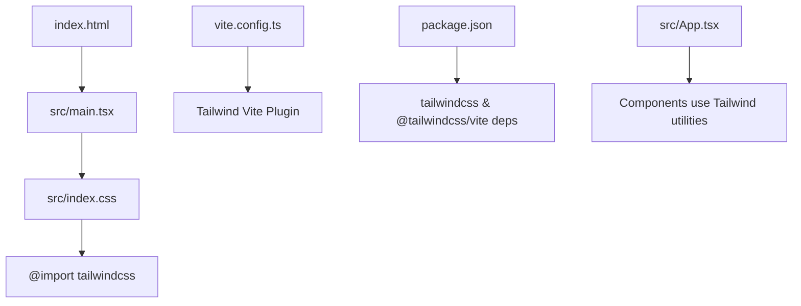
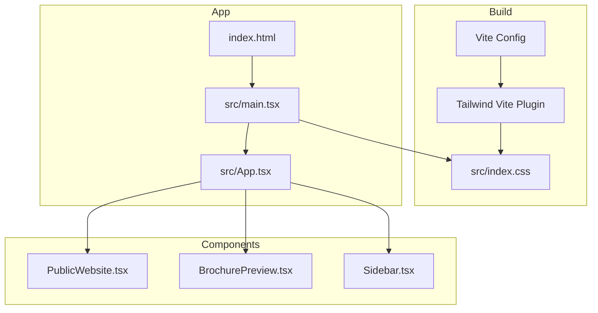
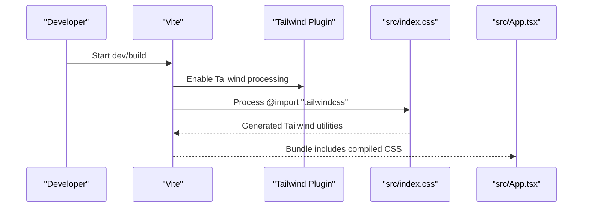
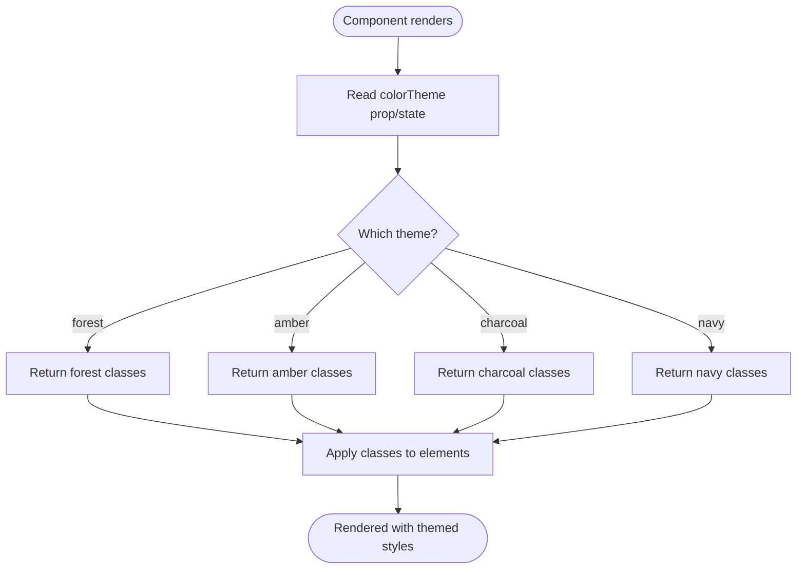
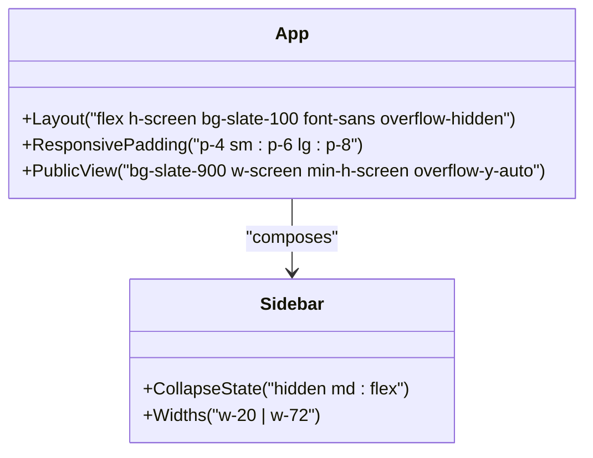
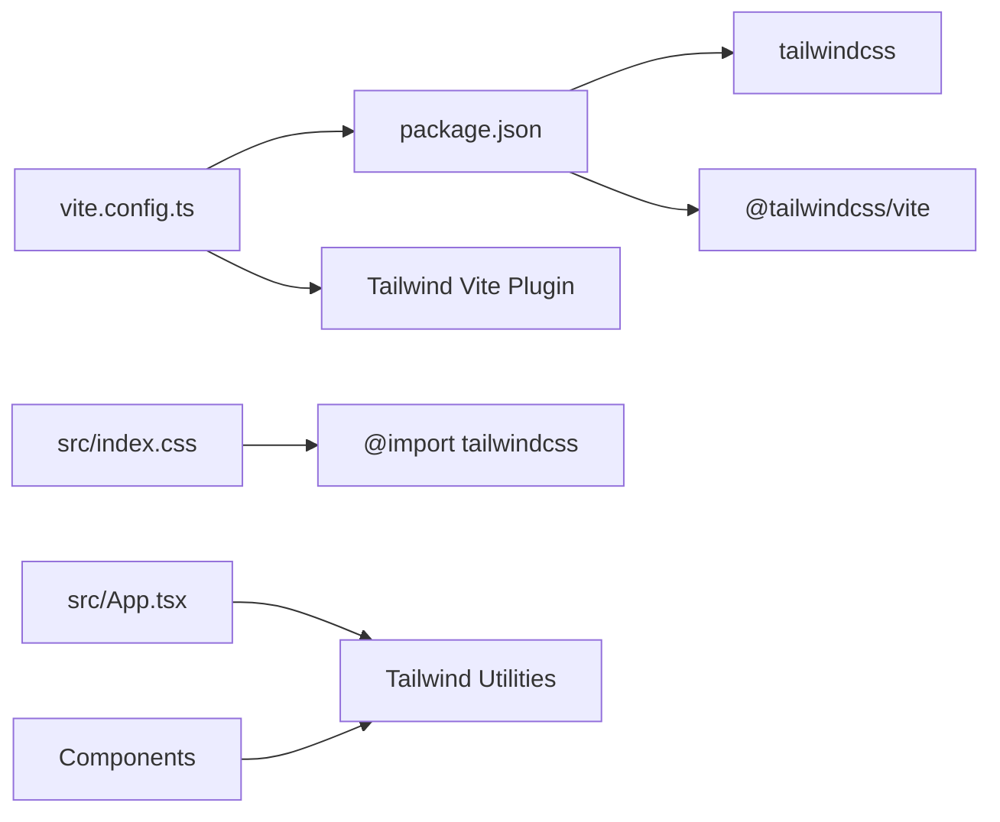

# Styling and Theming

<cite>
**Referenced Files in This Document**
- [vite.config.ts](file://vite.config.ts)
- [src/index.css](file://src/index.css)
- [package.json](file://package.json)
- [index.html](file://index.html)
- [src/App.tsx](file://src/App.tsx)
- [src/components/Sidebar.tsx](file://src/components/Sidebar.tsx)
- [src/components/PublicWebsite.tsx](file://src/components/PublicWebsite.tsx)
- [src/components/BrochurePreview.tsx](file://src/components/BrochurePreview.tsx)
</cite>

## Table of Contents
1. [Introduction](#introduction)
2. [Project Structure](#project-structure)
3. [Core Components](#core-components)
4. [Architecture Overview](#architecture-overview)
5. [Detailed Component Analysis](#detailed-component-analysis)
6. [Dependency Analysis](#dependency-analysis)
7. [Performance Considerations](#performance-considerations)
8. [Troubleshooting Guide](#troubleshooting-guide)
9. [Conclusion](#conclusion)
10. [Appendices](#appendices)

## Introduction
This document explains the styling architecture built on Tailwind CSS for consistent design across the application. It covers how Tailwind is integrated via Vite, how themes are applied at the component level using Tailwind utility classes, and how to extend the system with new colors, spacing utilities, and custom components. It also includes accessibility considerations, dark mode strategies, and cross-browser compatibility guidance.

## Project Structure
The project uses a minimal CSS entry point that imports Tailwind v4 through Vite. The build pipeline is configured in Vite with the Tailwind plugin enabled. The HTML entry loads the React app, which composes layout and theme styles using Tailwind utilities throughout components.

**Diagram sources**
- [index.html:1-14](file://index.html#L1-L14)
- [src/index.css:1-2](file://src/index.css#L1-L2)
- [vite.config.ts:1-23](file://vite.config.ts#L1-L23)
- [package.json:1-64](file://package.json#L1-L64)

**Section sources**
- [vite.config.ts:1-23](file://vite.config.ts#L1-L23)
- [src/index.css:1-2](file://src/index.css#L1-L2)
- [package.json:1-64](file://package.json#L1-L64)
- [index.html:1-14](file://index.html#L1-L14)

## Core Components
- Tailwind integration:
  - Entry CSS imports Tailwind v4 via a single import directive.
  - Vite config enables the Tailwind plugin and sets up an alias for cleaner imports.
- Theme strategy:
  - Themes are implemented as runtime class maps within components (e.g., PublicWebsite, BrochurePreview).
  - Sidebar uses color maps for section-level accents and borders.
- Layout and responsive behavior:
  - App uses Tailwind’s responsive prefixes and flex/grid layouts for structure.

Key implementation references:
- Tailwind import and Vite plugin configuration
- Component-level theme maps and color style maps
- Responsive layout patterns in App

**Section sources**
- [src/index.css:1-2](file://src/index.css#L1-L2)
- [vite.config.ts:1-23](file://vite.config.ts#L1-L23)
- [src/components/PublicWebsite.tsx:181-238](file://src/components/PublicWebsite.tsx#L181-L238)
- [src/components/BrochurePreview.tsx:70-119](file://src/components/BrochurePreview.tsx#L70-L119)
- [src/components/Sidebar.tsx:163-170](file://src/components/Sidebar.tsx#L163-L170)
- [src/App.tsx:90-175](file://src/App.tsx#L90-L175)

## Architecture Overview
The styling architecture follows a layered approach:
- Build layer: Vite + Tailwind plugin compiles Tailwind utilities into the final CSS.
- Application layer: index.css imports Tailwind; App composes global layout and typography.
- Component layer: Each component defines its own theme map or color map using Tailwind utilities, enabling per-feature theming without global overrides.

**Diagram sources**
- [vite.config.ts:1-23](file://vite.config.ts#L1-L23)
- [src/index.css:1-2](file://src/index.css#L1-L2)
- [index.html:1-14](file://index.html#L1-L14)
- [src/App.tsx:90-175](file://src/App.tsx#L90-L175)
- [src/components/PublicWebsite.tsx:181-238](file://src/components/PublicWebsite.tsx#L181-L238)
- [src/components/BrochurePreview.tsx:70-119](file://src/components/BrochurePreview.tsx#L70-L119)
- [src/components/Sidebar.tsx:163-170](file://src/components/Sidebar.tsx#L163-L170)

## Detailed Component Analysis

### Tailwind Integration and Build Flow
- Tailwind v4 is imported from the CSS entry file.
- Vite config registers the Tailwind plugin and sets an alias for root imports.
- package.json lists tailwindcss and @tailwindcss/vite dependencies.

**Diagram sources**
- [vite.config.ts:1-23](file://vite.config.ts#L1-L23)
- [src/index.css:1-2](file://src/index.css#L1-L2)
- [package.json:1-64](file://package.json#L1-L64)

**Section sources**
- [vite.config.ts:1-23](file://vite.config.ts#L1-L23)
- [src/index.css:1-2](file://src/index.css#L1-L2)
- [package.json:1-64](file://package.json#L1-L64)

### Theme Maps in Components
- PublicWebsite and BrochurePreview define theme maps keyed by colorTheme values (e.g., forest, amber, charcoal, navy), returning Tailwind class strings for backgrounds, accents, borders, badges, and buttons.
- Sidebar defines a colorStylesMap mapping color keys to background, text, border, and icon accent classes.

**Diagram sources**
- [src/components/PublicWebsite.tsx:181-238](file://src/components/PublicWebsite.tsx#L181-L238)
- [src/components/BrochurePreview.tsx:70-119](file://src/components/BrochurePreview.tsx#L70-L119)
- [src/components/Sidebar.tsx:163-170](file://src/components/Sidebar.tsx#L163-L170)

**Section sources**
- [src/components/PublicWebsite.tsx:181-238](file://src/components/PublicWebsite.tsx#L181-L238)
- [src/components/BrochurePreview.tsx:70-119](file://src/components/BrochurePreview.tsx#L70-L119)
- [src/components/Sidebar.tsx:163-170](file://src/components/Sidebar.tsx#L163-L170)

### Layout and Responsive Patterns
- App composes a full-screen layout using flexbox and responsive padding (sm, lg).
- Public website view uses a dark background and scrollable container.
- Sidebar collapses on small screens and expands on medium+ breakpoints.

**Diagram sources**
- [src/App.tsx:90-175](file://src/App.tsx#L90-L175)
- [src/components/Sidebar.tsx:163-170](file://src/components/Sidebar.tsx#L163-L170)

**Section sources**
- [src/App.tsx:90-175](file://src/App.tsx#L90-L175)
- [src/components/Sidebar.tsx:163-170](file://src/components/Sidebar.tsx#L163-L170)

## Dependency Analysis
Tailwind-related dependencies are declared in package.json. Vite config wires the Tailwind plugin. The CSS entry imports Tailwind, and components consume utilities directly.

**Diagram sources**
- [package.json:1-64](file://package.json#L1-L64)
- [vite.config.ts:1-23](file://vite.config.ts#L1-L23)
- [src/index.css:1-2](file://src/index.css#L1-L2)
- [src/App.tsx:90-175](file://src/App.tsx#L90-L175)

**Section sources**
- [package.json:1-64](file://package.json#L1-L64)
- [vite.config.ts:1-23](file://vite.config.ts#L1-L23)
- [src/index.css:1-2](file://src/index.css#L1-L2)
- [src/App.tsx:90-175](file://src/App.tsx#L90-L175)

## Performance Considerations
- Tailwind v4 with Vite generates only used utilities, minimizing CSS size.
- Avoid excessive inline class concatenation; prefer centralized theme maps to reduce recomputation.
- Keep theme maps memoized where appropriate to prevent unnecessary re-renders.
- Use responsive utilities instead of custom media queries to leverage Tailwind’s optimized output.

[No sources needed since this section provides general guidance]

## Troubleshooting Guide
- If Tailwind classes do not appear:
  - Ensure src/index.css contains the Tailwind import.
  - Confirm the Tailwind plugin is registered in vite.config.ts.
  - Verify package.json includes tailwindcss and @tailwindcss/vite.
- If HMR behaves unexpectedly:
  - Check Vite server settings for HMR toggles in vite.config.ts.
- If theme changes do not apply:
  - Validate the colorTheme value passed to components.
  - Confirm theme maps return valid Tailwind class strings.

**Section sources**
- [src/index.css:1-2](file://src/index.css#L1-L2)
- [vite.config.ts:1-23](file://vite.config.ts#L1-L23)
- [package.json:1-64](file://package.json#L1-L64)
- [src/components/PublicWebsite.tsx:181-238](file://src/components/PublicWebsite.tsx#L181-L238)
- [src/components/BrochurePreview.tsx:70-119](file://src/components/BrochurePreview.tsx#L70-L119)

## Conclusion
The application leverages Tailwind CSS v4 with Vite for a streamlined, utility-first styling system. Themes are managed at the component level through class maps, ensuring consistency while allowing flexibility. By following the guidelines below, teams can extend the design system safely and maintain visual coherence across features.

[No sources needed since this section summarizes without analyzing specific files]

## Appendices

### Guidelines for Adding New Colors
- Prefer existing Tailwind palette tokens when possible.
- For brand-specific colors, add them via component theme maps rather than global CSS overrides.
- Maintain naming conventions:
  - Theme keys: lowercase descriptive names (e.g., forest, amber, charcoal, navy).
  - Class composition: use semantic roles like primaryBg, accentText, accentBorder, btnGradient.

**Section sources**
- [src/components/PublicWebsite.tsx:181-238](file://src/components/PublicWebsite.tsx#L181-L238)
- [src/components/BrochurePreview.tsx:70-119](file://src/components/BrochurePreview.tsx#L70-L119)
- [src/components/Sidebar.tsx:163-170](file://src/components/Sidebar.tsx#L163-L170)

### Guidelines for Spacing Utilities
- Use Tailwind spacing scale consistently (e.g., p-4, gap-3, space-x-3).
- Reserve custom spacing for rare cases; document any exceptions in code comments.
- Align spacing with component hierarchy (layout vs. content spacing).

**Section sources**
- [src/App.tsx:90-175](file://src/App.tsx#L90-L175)

### Custom Components Best Practices
- Encapsulate theme logic inside component-level maps.
- Expose props for theme selection (e.g., colorTheme) and default to a sensible fallback.
- Compose complex styles from smaller, reusable utilities (e.g., gradients, borders, shadows).

**Section sources**
- [src/components/PublicWebsite.tsx:181-238](file://src/components/PublicWebsite.tsx#L181-L238)
- [src/components/BrochurePreview.tsx:70-119](file://src/components/BrochurePreview.tsx#L70-L119)

### Accessibility Considerations
- Ensure sufficient contrast between text and backgrounds, especially in dark themes.
- Provide meaningful alt text for images and icons where applicable.
- Use semantic HTML elements and avoid relying solely on color to convey meaning.
- Test keyboard navigation and focus states for interactive components.

[No sources needed since this section provides general guidance]

### Dark Mode Support
- Implement dark variants using Tailwind’s dark: prefix if needed.
- Maintain separate theme maps for light/dark modes or derive both from a single source of truth.
- Validate contrast ratios across both modes.

[No sources needed since this section provides general guidance]

### Cross-Browser Compatibility Strategies
- Rely on Tailwind’s vendor-normalized utilities.
- Avoid experimental CSS features unless polyfilled.
- Test critical UI flows on major browsers (Chrome, Firefox, Safari, Edge).

[No sources needed since this section provides general guidance]

### Common Styling Patterns Used in the Application
- Gradient backgrounds for hero sections and cards.
- Accent borders and subtle background tints for emphasis.
- Badge styles using solid accent backgrounds with contrasting text.
- Button gradients with hover state transitions.
- Responsive layouts using flexbox and grid with breakpoint-specific padding.

**Section sources**
- [src/components/PublicWebsite.tsx:181-238](file://src/components/PublicWebsite.tsx#L181-L238)
- [src/components/BrochurePreview.tsx:70-119](file://src/components/BrochurePreview.tsx#L70-L119)
- [src/components/Sidebar.tsx:163-170](file://src/components/Sidebar.tsx#L163-L170)
- [src/App.tsx:90-175](file://src/App.tsx#L90-L175)