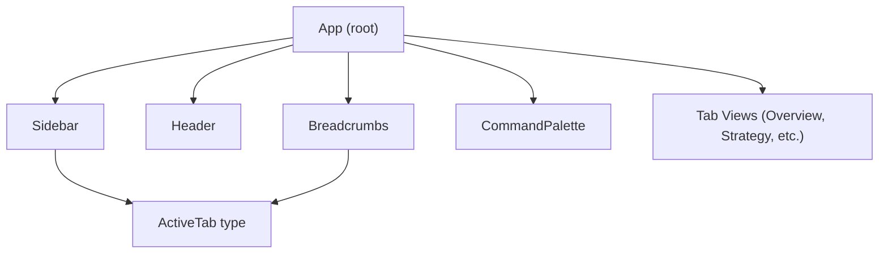
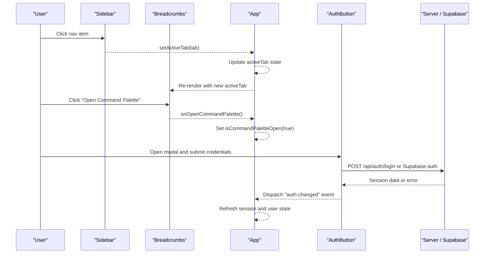
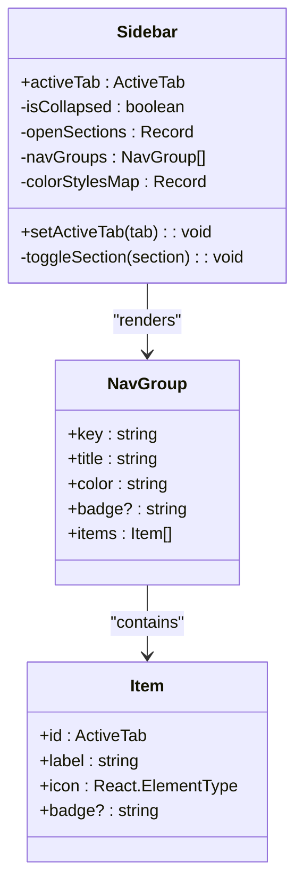
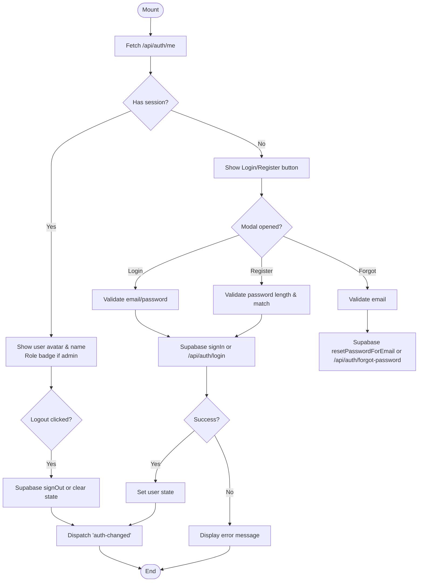
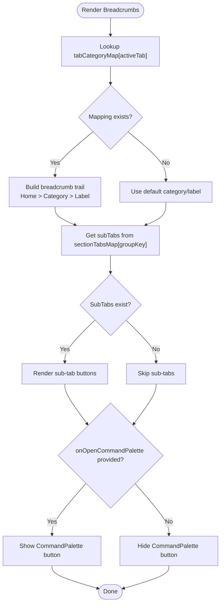
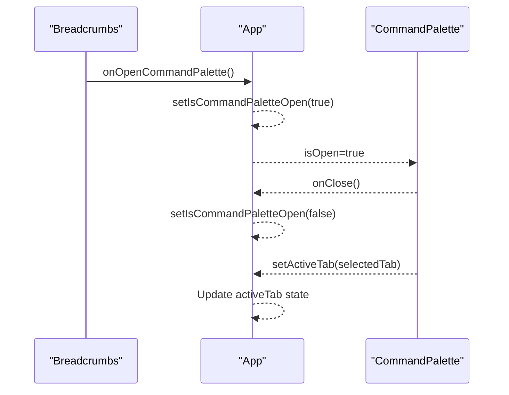
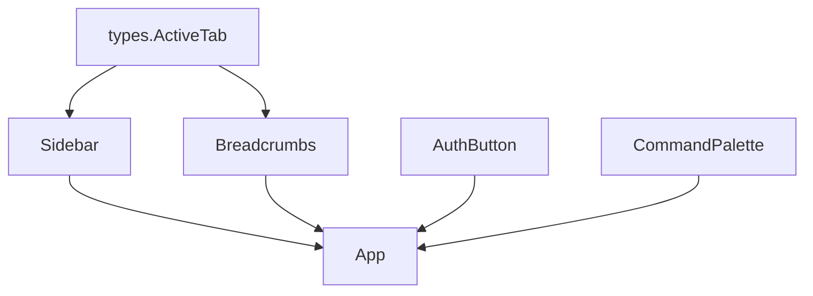

# UI Components

<cite>
**Referenced Files in This Document**
- [Sidebar.tsx](file://src/components/Sidebar.tsx)
- [AuthButton.tsx](file://src/components/AuthButton.tsx)
- [Breadcrumbs.tsx](file://src/components/Breadcrumbs.tsx)
- [App.tsx](file://src/App.tsx)
- [types.ts](file://src/types.ts)
</cite>

## Table of Contents
1. [Introduction](#introduction)
2. [Project Structure](#project-structure)
3. [Core Components](#core-components)
4. [Architecture Overview](#architecture-overview)
5. [Detailed Component Analysis](#detailed-component-analysis)
6. [Dependency Analysis](#dependency-analysis)
7. [Performance Considerations](#performance-considerations)
8. [Troubleshooting Guide](#troubleshooting-guide)
9. [Conclusion](#conclusion)
10. [Appendices](#appendices)

## Introduction
This document provides comprehensive documentation for the core UI components that form the application’s interface foundation: Sidebar, AuthButton, Breadcrumbs, and CommandPalette. It explains navigation functionality, active tab management, responsive design patterns, authentication integration, user state handling, breadcrumbs context, tab switching, keyboard shortcuts, search behavior, and modal interactions. Each component includes prop interfaces, event handlers, customization options, and practical usage examples.

## Project Structure
The UI is composed of a few key components orchestrated by the root App component. The Sidebar manages navigation groups and active tabs; Breadcrumbs shows contextual navigation and offers a command palette trigger; AuthButton handles login/register/forgot flows with Supabase or server endpoints; CommandPalette is rendered by App to provide global search and navigation via keyboard shortcuts.

**Diagram sources**
- [App.tsx:109-173](file://src/App.tsx#L109-L173)
- [Sidebar.tsx:36-54](file://src/components/Sidebar.tsx#L36-L54)
- [Breadcrumbs.tsx:5-9](file://src/components/Breadcrumbs.tsx#L5-L9)
- [types.ts:1-35](file://src/types.ts#L1-L35)

**Section sources**
- [App.tsx:109-173](file://src/App.tsx#L109-L173)
- [Sidebar.tsx:36-54](file://src/components/Sidebar.tsx#L36-L54)
- [Breadcrumbs.tsx:5-9](file://src/components/Breadcrumbs.tsx#L5-L9)
- [types.ts:1-35](file://src/types.ts#L1-L35)

## Core Components
- Sidebar: Provides grouped navigation, collapsible sections, quick-access buttons, and active tab highlighting. Supports collapsed mode for compact layouts.
- AuthButton: Manages session checks, login/register/forgot password flows, and displays user state in both standard and compact modes. Integrates with Supabase when available and falls back to server endpoints otherwise.
- Breadcrumbs: Displays current category and tab label, plus contextual sub-tabs for quick switching. Offers a button to open the CommandPalette.
- CommandPalette: Rendered by App as a modal overlay. Controlled by App state and triggered from Breadcrumbs and other places. Keyboard shortcut support is indicated in the UI.

**Section sources**
- [Sidebar.tsx:36-54](file://src/components/Sidebar.tsx#L36-L54)
- [AuthButton.tsx:11-13](file://src/components/AuthButton.tsx#L11-L13)
- [Breadcrumbs.tsx:5-9](file://src/components/Breadcrumbs.tsx#L5-L9)
- [App.tsx:168-172](file://src/App.tsx#L168-L172)

## Architecture Overview
The application uses a top-down state model where App holds the active tab and command palette visibility. Sidebar and Breadcrumbs update the active tab through callbacks. AuthButton communicates session changes via a global event and direct API calls. CommandPalette is controlled by App’s state and can be opened via UI triggers.

**Diagram sources**
- [Sidebar.tsx:258-261](file://src/components/Sidebar.tsx#L258-L261)
- [Breadcrumbs.tsx:129-137](file://src/components/Breadcrumbs.tsx#L129-L137)
- [App.tsx:121-130](file://src/App.tsx#L121-L130)
- [AuthButton.tsx:62-145](file://src/components/AuthButton.tsx#L62-L145)
- [App.tsx:79-88](file://src/App.tsx#L79-L88)

## Detailed Component Analysis

### Sidebar Component
Responsibilities:
- Grouped navigation with collapsible sections
- Quick access buttons for Workflow and Public Website
- Active tab highlighting per group color scheme
- Collapsible sidebar for compact layout

Props:
- activeTab: ActiveTab — current selected tab
- setActiveTab: (tab: ActiveTab) => void — updates active tab

Key behaviors:
- Section toggling expands/collapses items within each group
- When collapsed, only icons are shown; hover tooltips appear
- Color styles map applies visual emphasis based on group color
- Quick access buttons set specific tabs directly

Responsive design:
- Hidden on small screens (md breakpoint), visible on larger screens
- Collapsed width transitions smoothly

Usage example:
- Rendered by App with activeTab and setActiveTab passed down
- Example path: [App.tsx:111](file://src/App.tsx#L111)

**Diagram sources**
- [Sidebar.tsx:36-54](file://src/components/Sidebar.tsx#L36-L54)
- [Sidebar.tsx:75-161](file://src/components/Sidebar.tsx#L75-L161)
- [Sidebar.tsx:163-170](file://src/components/Sidebar.tsx#L163-L170)

**Section sources**
- [Sidebar.tsx:36-54](file://src/components/Sidebar.tsx#L36-L54)
- [Sidebar.tsx:75-161](file://src/components/Sidebar.tsx#L75-L161)
- [Sidebar.tsx:163-170](file://src/components/Sidebar.tsx#L163-L170)
- [Sidebar.tsx:172-313](file://src/components/Sidebar.tsx#L172-L313)
- [App.tsx:111](file://src/App.tsx#L111)

### AuthButton Component
Responsibilities:
- Check current session via /api/auth/me
- Provide login, register, and forgot password flows
- Integrate with Supabase when available; fallback to server endpoints
- Display user avatar, username, role badge, and logout action
- Support compact mode for embedded use

Props:
- compact?: boolean — renders a compact variant used inside fused pill/header

Key behaviors:
- On mount, fetches session and listens to 'auth-changed' events
- For email-based auth, uses Supabase sign-in/sign-up/resetPasswordForEmail
- For non-email flows, posts to /api/auth/login or /api/auth/register
- On success, sets local user state and dispatches 'auth-changed'
- Modal supports three modes: login, register, forgot password

Event handling:
- handleSignIn: Validates inputs, performs auth flow, updates state
- handleSignOut: Signs out via Supabase or clears local state, dispatches event

Usage example:
- Standard mode: [App.tsx:103](file://src/App.tsx#L103)
- Compact mode: Used internally for header or pill contexts

**Diagram sources**
- [AuthButton.tsx:28-60](file://src/components/AuthButton.tsx#L28-L60)
- [AuthButton.tsx:62-145](file://src/components/AuthButton.tsx#L62-L145)
- [AuthButton.tsx:147-162](file://src/components/AuthButton.tsx#L147-L162)
- [AuthButton.tsx:164-280](file://src/components/AuthButton.tsx#L164-L280)
- [AuthButton.tsx:283-328](file://src/components/AuthButton.tsx#L283-L328)
- [AuthButton.tsx:330-383](file://src/components/AuthButton.tsx#L330-L383)

**Section sources**
- [AuthButton.tsx:11-13](file://src/components/AuthButton.tsx#L11-L13)
- [AuthButton.tsx:28-60](file://src/components/AuthButton.tsx#L28-L60)
- [AuthButton.tsx:62-145](file://src/components/AuthButton.tsx#L62-L145)
- [AuthButton.tsx:147-162](file://src/components/AuthButton.tsx#L147-L162)
- [AuthButton.tsx:164-280](file://src/components/AuthButton.tsx#L164-L280)
- [AuthButton.tsx:283-328](file://src/components/AuthButton.tsx#L283-L328)
- [AuthButton.tsx:330-383](file://src/components/AuthButton.tsx#L330-L383)

### Breadcrumbs Component
Responsibilities:
- Display breadcrumb trail with Home, Category, and Current Tab
- Provide contextual sub-tabs for quick switching within a section
- Offer a button to open the CommandPalette (with keyboard hint)

Props:
- activeTab: ActiveTab — current selected tab
- setActiveTab: (tab: ActiveTab) => void — updates active tab
- onOpenCommandPalette?: () => void — optional callback to open command palette

Key behaviors:
- Maps activeTab to category and label using tabCategoryMap
- Renders subTabs based on groupKey mapping
- Shows CommandPalette trigger when onOpenCommandPalette is provided

Usage example:
- Rendered by App with onOpenCommandPalette bound to setIsCommandPaletteOpen
- Example path: [App.tsx:126-130](file://src/App.tsx#L126-L130)

**Diagram sources**
- [Breadcrumbs.tsx:16-54](file://src/components/Breadcrumbs.tsx#L16-L54)
- [Breadcrumbs.tsx:56-99](file://src/components/Breadcrumbs.tsx#L56-L99)
- [Breadcrumbs.tsx:101-138](file://src/components/Breadcrumbs.tsx#L101-L138)
- [Breadcrumbs.tsx:141-163](file://src/components/Breadcrumbs.tsx#L141-L163)

**Section sources**
- [Breadcrumbs.tsx:5-9](file://src/components/Breadcrumbs.tsx#L5-L9)
- [Breadcrumbs.tsx:16-54](file://src/components/Breadcrumbs.tsx#L16-L54)
- [Breadcrumbs.tsx:56-99](file://src/components/Breadcrumbs.tsx#L56-L99)
- [Breadcrumbs.tsx:101-138](file://src/components/Breadcrumbs.tsx#L101-L138)
- [Breadcrumbs.tsx:141-163](file://src/components/Breadcrumbs.tsx#L141-L163)
- [App.tsx:126-130](file://src/App.tsx#L126-L130)

### CommandPalette Component
Responsibilities:
- Global search and navigation modal
- Triggered by Breadcrumbs button and potentially other UI elements
- Controlled by App’s isCommandPaletteOpen state

Props (as used by App):
- isOpen: boolean — controls visibility
- onClose: () => void — closes the palette
- setActiveTab: (tab: ActiveTab) => void — navigates to a tab upon selection

Behavior notes:
- Keyboard shortcut hint is displayed in Breadcrumbs indicating ⌘K
- Modal behavior is managed by App state; component receives props to control it

Usage example:
- Rendered by App with isOpen, onClose, and setActiveTab
- Example path: [App.tsx:168-172](file://src/App.tsx#L168-L172)

**Diagram sources**
- [Breadcrumbs.tsx:129-137](file://src/components/Breadcrumbs.tsx#L129-L137)
- [App.tsx:121-130](file://src/App.tsx#L121-L130)
- [App.tsx:168-172](file://src/App.tsx#L168-L172)

**Section sources**
- [App.tsx:168-172](file://src/App.tsx#L168-L172)
- [Breadcrumbs.tsx:129-137](file://src/components/Breadcrumbs.tsx#L129-L137)

## Dependency Analysis
- Sidebar depends on types.ActiveTab for tab identifiers and uses icon components from lucide-react.
- Breadcrumbs depends on types.ActiveTab and maps tabs to categories and sub-tabs.
- AuthButton depends on Supabase client and server endpoints for authentication flows.
- App orchestrates all components, managing activeTab and command palette state.

**Diagram sources**
- [types.ts:1-35](file://src/types.ts#L1-L35)
- [Sidebar.tsx:36-54](file://src/components/Sidebar.tsx#L36-L54)
- [Breadcrumbs.tsx:5-9](file://src/components/Breadcrumbs.tsx#L5-L9)
- [App.tsx:109-173](file://src/App.tsx#L109-L173)

**Section sources**
- [types.ts:1-35](file://src/types.ts#L1-L35)
- [Sidebar.tsx:36-54](file://src/components/Sidebar.tsx#L36-L54)
- [Breadcrumbs.tsx:5-9](file://src/components/Breadcrumbs.tsx#L5-L9)
- [App.tsx:109-173](file://src/App.tsx#L109-L173)

## Performance Considerations
- Sidebar: Collapsing reduces DOM size and improves rendering performance on smaller screens.
- AuthButton: Session check runs once on mount; event listener avoids unnecessary re-renders.
- Breadcrumbs: Mapping lookups are O(1) per tab; sub-tabs render only when applicable.
- CommandPalette: Modal visibility controlled by App state; avoid heavy computations inside modal until opened.

[No sources needed since this section provides general guidance]

## Troubleshooting Guide
Common issues:
- Authentication failures: Ensure /api/auth/me returns correct user data; verify Supabase configuration or server endpoints.
- CommandPalette not opening: Confirm onOpenCommandPalette is passed to Breadcrumbs and App state is updated.
- Active tab not updating: Verify setActiveTab is correctly wired in Sidebar and Breadcrumbs.

Debugging tips:
- Check console warnings for session check failures in AuthButton and App.
- Use browser dev tools to inspect network requests to /api/auth/* endpoints.
- Verify window 'auth-changed' events are dispatched after successful login/logout.

**Section sources**
- [AuthButton.tsx:28-47](file://src/components/AuthButton.tsx#L28-L47)
- [App.tsx:50-67](file://src/App.tsx#L50-L67)
- [App.tsx:79-88](file://src/App.tsx#L79-L88)

## Conclusion
The Sidebar, AuthButton, Breadcrumbs, and CommandPalette form a cohesive UI foundation for navigation, authentication, contextual awareness, and global search. Their prop interfaces and event handlers enable flexible integration and customization. Following the usage examples and troubleshooting guidance ensures reliable operation across different screen sizes and authentication states.

[No sources needed since this section summarizes without analyzing specific files]

## Appendices
- ActiveTab union type defines all supported tab identifiers used across components.
- Icon library (lucide-react) provides consistent iconography throughout the UI.

**Section sources**
- [types.ts:1-35](file://src/types.ts#L1-L35)