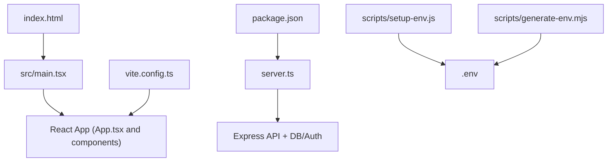
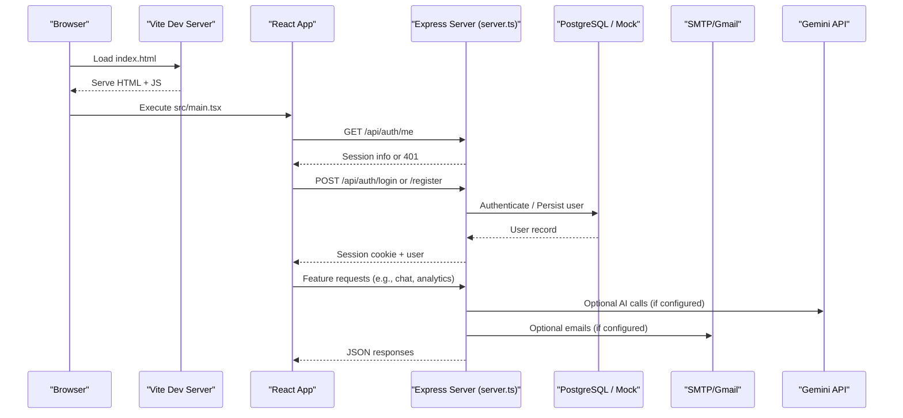
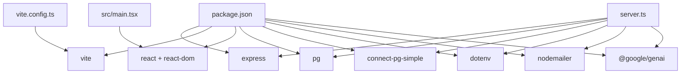

# Getting Started

<cite>
**Referenced Files in This Document**
- [package.json](file://package.json)
- [README.md](file://README.md)
- [server.ts](file://server.ts)
- [index.ts](file://index.ts)
- [vite.config.ts](file://vite.config.ts)
- [scripts/setup-env.js](file://scripts/setup-env.js)
- [scripts/generate-env.mjs](file://scripts/generate-env.mjs)
- [src/main.tsx](file://src/main.tsx)
- [index.html](file://index.html)
</cite>

## Table of Contents
1. [Introduction](#introduction)
2. [Project Structure](#project-structure)
3. [Core Components](#core-components)
4. [Architecture Overview](#architecture-overview)
5. [Detailed Component Analysis](#detailed-component-analysis)
6. [Dependency Analysis](#dependency-analysis)
7. [Performance Considerations](#performance-considerations)
8. [Troubleshooting Guide](#troubleshooting-guide)
9. [Conclusion](#conclusion)
10. [Appendices](#appendices)

## Introduction
This guide helps you set up and run the ClientumLatam AI Marketing Dashboard locally. You will install prerequisites, configure environment variables (including GEMINI_API_KEY), start the development server, and verify that everything works. It also covers common setup issues and basic usage to get you productive quickly.

## Project Structure
At a high level:
- The Node/Express server is defined in server.ts and can be started directly for development or bundled for production.
- Vite configures the frontend build and dev server behavior.
- Environment configuration is handled by scripts that generate or update .env files with sensible defaults and prompts.
- The React app entry point is src/main.tsx, loaded via index.html.

**Diagram sources**
- [index.html:1-14](file://index.html#L1-L14)
- [src/main.tsx:1-11](file://src/main.tsx#L1-L11)
- [server.ts:1-80](file://server.ts#L1-L80)
- [vite.config.ts:1-23](file://vite.config.ts#L1-L23)
- [package.json:1-64](file://package.json#L1-L64)
- [scripts/setup-env.js:1-260](file://scripts/setup-env.js#L1-L260)
- [scripts/generate-env.mjs:1-74](file://scripts/generate-env.mjs#L1-L74)

**Section sources**
- [package.json:1-64](file://package.json#L1-L64)
- [README.md:1-21](file://README.md#L1-L21)
- [vite.config.ts:1-23](file://vite.config.ts#L1-L23)
- [index.html:1-14](file://index.html#L1-L14)
- [src/main.tsx:1-11](file://src/main.tsx#L1-L11)

## Core Components
- Development server and scripts: package.json defines commands for environment setup, development, building, and running the server.
- Server runtime: server.ts initializes Express, sessions, database pool, authentication endpoints, and integrations.
- Frontend entry: src/main.tsx renders the React application into the DOM.
- Build/dev configuration: vite.config.ts sets plugins, aliases, and HMR/watch behavior.
- Environment setup: scripts/setup-env.js and scripts/generate-env.mjs create/update .env with required keys and defaults.

Key responsibilities:
- server.ts: HTTP routes, session management, database connection, email sending, and third-party integrations.
- vite.config.ts: Dev server options and plugin pipeline for React and Tailwind.
- package.json: Scripts orchestrate setup, dev, build, and linting.
- scripts/*: Automate .env creation and populate missing values.

**Section sources**
- [package.json:1-64](file://package.json#L1-L64)
- [server.ts:1-120](file://server.ts#L1-L120)
- [vite.config.ts:1-23](file://vite.config.ts#L1-L23)
- [scripts/setup-env.js:1-260](file://scripts/setup-env.js#L1-L260)
- [scripts/generate-env.mjs:1-74](file://scripts/generate-env.mjs#L1-L74)
- [src/main.tsx:1-11](file://src/main.tsx#L1-L11)

## Architecture Overview
The app runs a local Express server alongside a Vite dev server. The browser loads the React app from index.html and communicates with the backend via REST APIs exposed by server.ts. Environment variables control features like Gemini integration, database connectivity, sessions, and optional services.

**Diagram sources**
- [index.html:1-14](file://index.html#L1-L14)
- [src/main.tsx:1-11](file://src/main.tsx#L1-L11)
- [server.ts:1-120](file://server.ts#L1-L120)

## Detailed Component Analysis

### Prerequisites and Installation
- Install Node.js (LTS recommended).
- Clone or open the project directory.
- Install dependencies using your preferred package manager.

Commands:
- npm install
- Or yarn install / pnpm install if configured

Verification:
- After installation, ensure node_modules exists and no errors are reported during install.

**Section sources**
- [package.json:1-64](file://package.json#L1-L64)
- [README.md:1-21](file://README.md#L1-L21)

### Environment Setup
You must provide at least GEMINI_API_KEY to enable AI features. Other optional keys include DATABASE_URL, SMTP_USER/SMTP_PASS, and others used by integrations.

Recommended steps:
- Run the interactive environment setup script to create/update .env with guidance and defaults.
- Alternatively, use the generator script to auto-populate missing values.

Commands:
- npm run setup:env
- Or node scripts/generate-env.mjs

What these scripts do:
- scripts/setup-env.js: Reads .env.example (if present), merges with existing .env and system env, prompts for missing keys, and writes a well-commented .env file.
- scripts/generate-env.mjs: Generates or updates .env with default/dummy values for all known keys, including random secrets for SESSION_SECRET and internal tokens.

Important keys:
- GEMINI_API_KEY: Required for AI features. Set this before running the app.
- APP_URL: Base URL for the app (default http://localhost:3000).
- SESSION_SECRET: Secret used to sign cookies; generated automatically if missing.
- DATABASE_URL: PostgreSQL connection string (optional; mock mode available when not set).
- SMTP_USER/SMTP_PASS: For sending password reset and marketing emails (optional).

Where values are read:
- server.ts reads process.env for configuration such as PORT, DATABASE_URL, SESSION_SECRET, and service-specific keys.

**Section sources**
- [scripts/setup-env.js:1-260](file://scripts/setup-env.js#L1-L260)
- [scripts/generate-env.mjs:1-74](file://scripts/generate-env.mjs#L1-L74)
- [server.ts:1-120](file://server.ts#L1-L120)

### First Run Instructions
Start the development server:
- npm run dev

What happens:
- The predev hook runs setup:env to ensure .env is ready.
- The dev command starts the server using tsx on server.ts.
- Vite serves the frontend and proxies API calls to the Express server.

Verify installation:
- Open http://localhost:3000 in your browser.
- Check that the page loads without console errors.
- Try registering/logging in if you have a database configured; otherwise, the server logs indicate mock mode when DATABASE_URL is not set.

Build and production run (optional):
- npm run build
- npm run start

**Section sources**
- [package.json:1-64](file://package.json#L1-L64)
- [README.md:1-21](file://README.md#L1-L21)
- [vite.config.ts:1-23](file://vite.config.ts#L1-L23)
- [server.ts:1-80](file://server.ts#L1-L80)

### Development Workflow
- Edit code in src/ for UI changes; Vite provides hot module replacement unless DISABLE_HMR is true.
- Backend changes are reloaded via tsx when running npm run dev.
- Use npm run lint to type-check TypeScript without emitting files.

Tips:
- Keep GEMINI_API_KEY set in .env for AI features.
- If you need a database, set DATABASE_URL; otherwise, the server uses a mock pool and memory-based sessions.

**Section sources**
- [vite.config.ts:1-23](file://vite.config.ts#L1-L23)
- [package.json:1-64](file://package.json#L1-L64)
- [server.ts:1-80](file://server.ts#L1-L80)

### Basic Usage Examples
- Register/Login: Use the app’s auth flows; the server exposes endpoints under /api/auth.
- AI features: Once GEMINI_API_KEY is set, AI-powered tabs and tools become functional.
- Public website preview: The app includes a public website view accessible through the UI.

Note: These flows are driven by the React app and Express endpoints defined in server.ts.

**Section sources**
- [server.ts:260-400](file://server.ts#L260-L400)
- [src/main.tsx:1-11](file://src/main.tsx#L1-L11)

## Dependency Analysis
The project uses:
- Express for the backend API and session handling.
- Vite and React for the frontend.
- PostgreSQL client (pg) and connect-pg-simple for persistent sessions when DATABASE_URL is provided.
- dotenv for loading environment variables.
- Nodemailer for email sending.
- Google GenAI SDK for Gemini integration.

**Diagram sources**
- [package.json:1-64](file://package.json#L1-L64)
- [server.ts:1-120](file://server.ts#L1-L120)
- [vite.config.ts:1-23](file://vite.config.ts#L1-L23)
- [src/main.tsx:1-11](file://src/main.tsx#L1-L11)

**Section sources**
- [package.json:1-64](file://package.json#L1-L64)
- [server.ts:1-120](file://server.ts#L1-L120)

## Performance Considerations
- Database: When DATABASE_URL is set, sessions are persisted in Postgres via connect-pg-simple. Without it, the server falls back to an in-memory approach suitable for development only.
- HMR: Vite’s HMR is enabled by default but can be disabled via DISABLE_HMR to reduce CPU usage during automated edits.
- Build: Production builds bundle the server with esbuild and serve via node dist/server.cjs.

[No sources needed since this section provides general guidance]

## Troubleshooting Guide
Common issues and resolutions:
- Missing GEMINI_API_KEY: AI features will not work. Ensure .env contains a valid key.
- Database not configured: The server logs a warning and uses a mock pgPool and memory sessions. Set DATABASE_URL to enable real persistence.
- Session secret warnings: SESSION_SECRET has a development fallback; set a strong secret in production.
- Port conflicts: The server listens on PORT (default 3000). Change via environment variable if needed.
- Email not sending: Configure SMTP_USER and SMTP_PASS to enable password reset and marketing emails.

Verification checklist:
- npm run dev starts without errors.
- http://localhost:3000 loads the app.
- Auth endpoints respond (check browser network tab for /api/auth calls).
- AI features function after setting GEMINI_API_KEY.

**Section sources**
- [server.ts:1-120](file://server.ts#L1-L120)
- [scripts/setup-env.js:1-260](file://scripts/setup-env.js#L1-L260)
- [scripts/generate-env.mjs:1-74](file://scripts/generate-env.mjs#L1-L74)

## Conclusion
You now have the essentials to install, configure, and run the ClientumLatam AI Marketing Dashboard locally. Start with Node.js, install dependencies, set GEMINI_API_KEY (and other keys as needed), and launch the dev server. Use the troubleshooting tips to resolve common setup issues and explore the app’s AI-driven marketing tools.

[No sources needed since this section summarizes without analyzing specific files]

## Appendices

### Quick Commands Reference
- Install dependencies: npm install
- Setup environment: npm run setup:env
- Start development: npm run dev
- Build production: npm run build
- Run production: npm run start
- Type check: npm run lint

**Section sources**
- [package.json:1-64](file://package.json#L1-L64)
- [README.md:1-21](file://README.md#L1-L21)