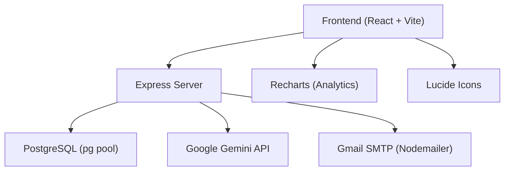
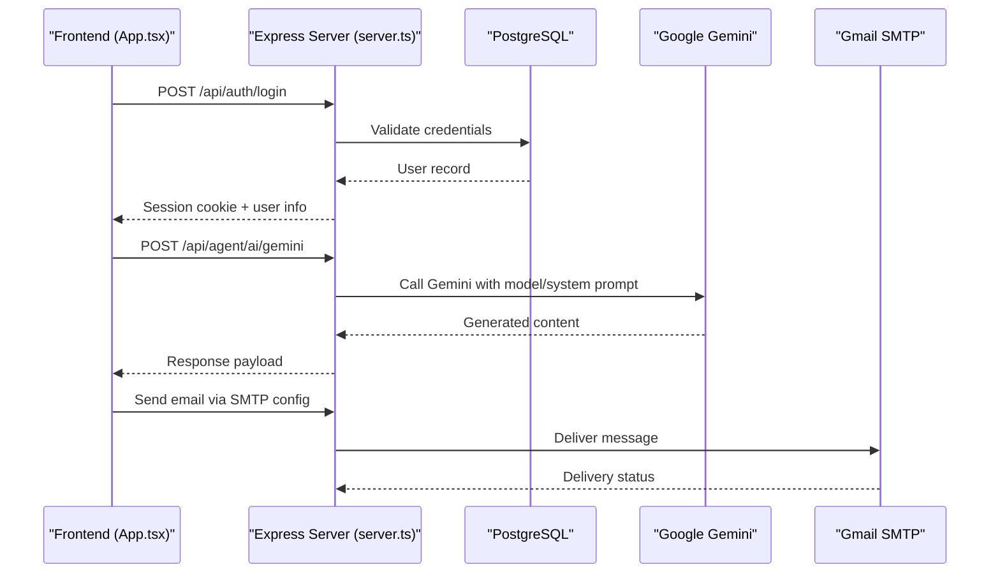
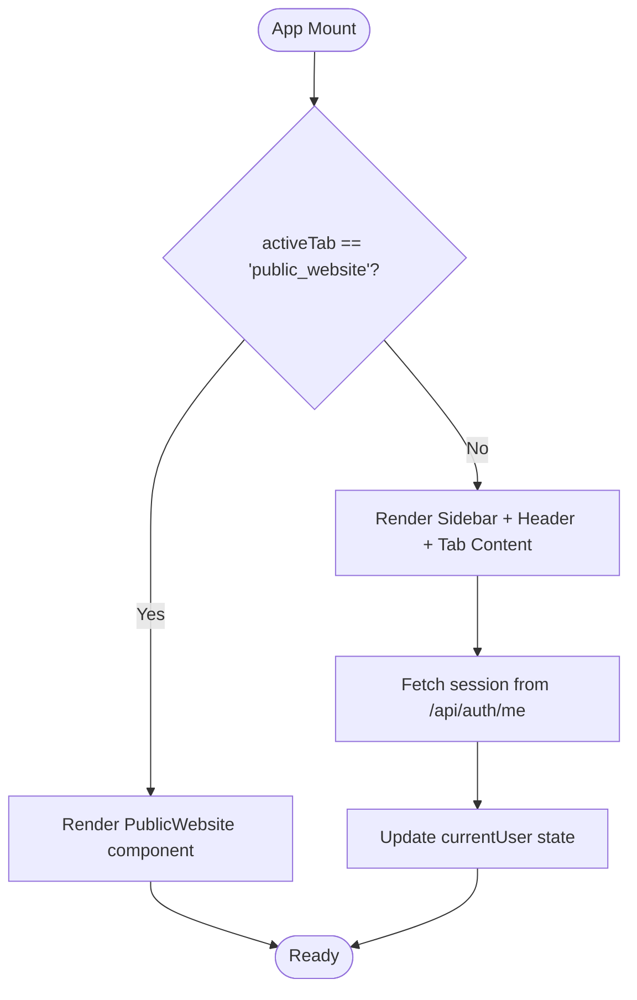
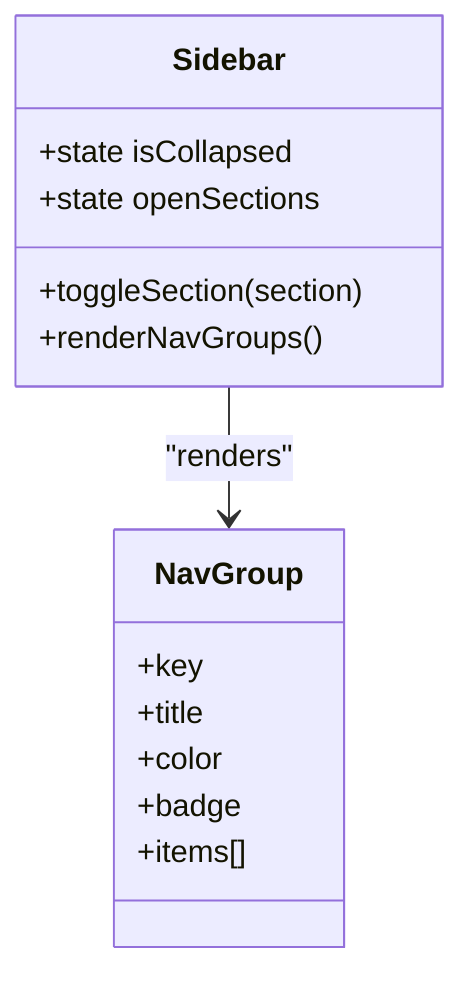
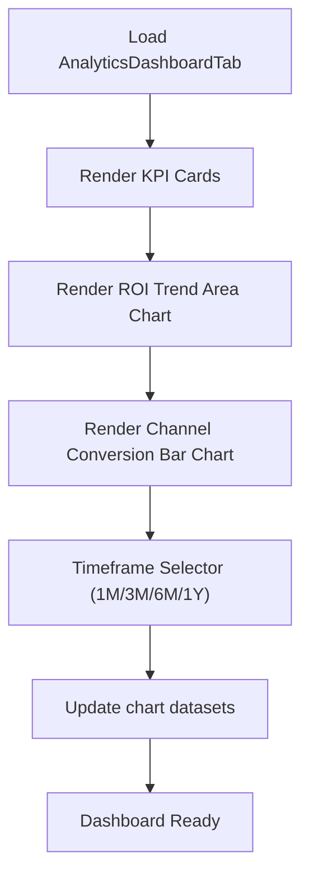
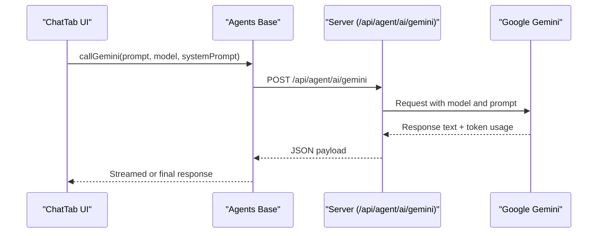
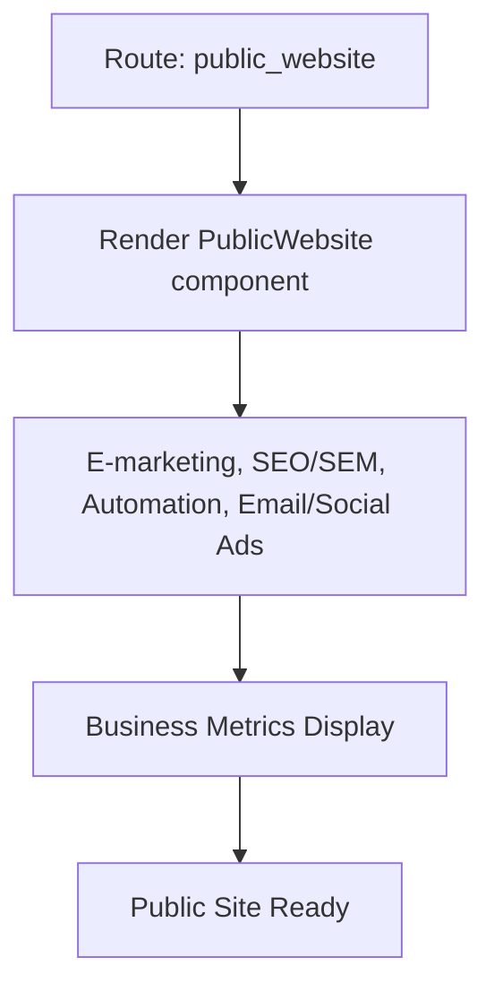
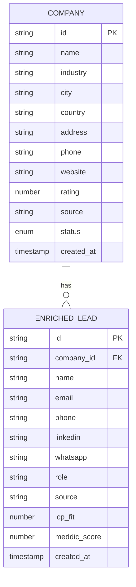
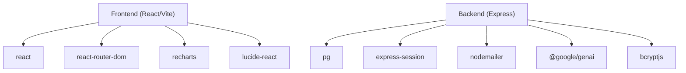

# Project Overview

<cite>
**Referenced Files in This Document**
- [README.md](file://README.md)
- [package.json](file://package.json)
- [server.ts](file://server.ts)
- [src/App.tsx](file://src/App.tsx)
- [src/main.tsx](file://src/main.tsx)
- [src/types.ts](file://src/types.ts)
- [src/components/Sidebar.tsx](file://src/components/Sidebar.tsx)
- [src/components/AnalyticsDashboardTab.tsx](file://src/components/AnalyticsDashboardTab.tsx)
- [src/components/AiHubTab.tsx](file://src/components/AiHubTab.tsx)
- [src/components/ChatTab.tsx](file://src/components/ChatTab.tsx)
- [src/components/PublicWebsite.tsx](file://src/components/PublicWebsite.tsx)
- [src/agents/base.ts](file://src/agents/base.ts)
</cite>

## Table of Contents
1. Introduction
2. Project Structure
3. Core Components
4. Architecture Overview
5. Detailed Component Analysis
6. Dependency Analysis
7. Performance Considerations
8. Troubleshooting Guide
9. Conclusion

## Introduction
ClientumLatam AI Marketing Dashboard is an AI-powered marketing and sales automation platform tailored for the Latin American market, with a strong focus on businesses in Patagonia, Argentina. It unifies CRM, multi-channel campaign management, real-time analytics, and AI-driven content generation into a single dashboard. The platform leverages Google Gemini models to power strategy generation, ad copy creation, brochure generation, voice interactions, and conversational assistance.

Target audience:
- B2B and B2C companies in LATAM seeking scalable lead generation and conversion
- Sales teams requiring MEDDIC-based lead scoring and pipeline visibility
- Marketing teams managing email, social, SEO, and outreach campaigns
- Agencies and consultants serving Patagonian enterprises

Primary use cases:
- Prospecting and enrichment using AI and geolocation tools
- CRM pipeline management with MEDDIC scoring
- Multi-channel campaign orchestration (email, WhatsApp, LinkedIn)
- Real-time analytics and ROI tracking across channels
- AI-assisted content creation and voice-enabled interactions

How it combines traditional marketing tools with advanced AI:
- Traditional modules: CRM Kanban, email templates, SMTP configuration, import/export, SEO research, content calendar, rank tracking
- AI layer: Gemini-powered strategy builder, ad copy studio, brochure generator, chat assistant, voice hub, and agent orchestrator

[No sources needed since this section provides a conceptual overview]

## Project Structure
The application follows a modern React + Vite frontend with an Express server backend. Key directories:
- src/: Frontend code, components, types, agents
- server.ts: Backend API, authentication, database integration, email, and Gemini proxy endpoints
- public/: Static assets
- scripts/: Utility scripts for environment setup and data operations

**Diagram sources**
- [server.ts:1-800](file://server.ts#L1-L800)
- [package.json:1-64](file://package.json#L1-L64)
- [src/components/AnalyticsDashboardTab.tsx:1-149](file://src/components/AnalyticsDashboardTab.tsx#L1-L149)

**Section sources**
- [README.md:1-21](file://README.md#L1-L21)
- [package.json:1-64](file://package.json#L1-L64)

## Core Components
- App shell and routing: Centralized tab-based navigation with sidebar and header; renders feature tabs like Analytics, AI Hub, CRM, Email Campaigns, SEO, and more
- Sidebar: Organizes features into logical groups (Configuration, Audience, Prospecting & Pipeline, AI & Content, Campaigns & Automation, SEO & Content, Analytics & ROI)
- Analytics Dashboard: Real-time KPIs and charts for ROI trends and channel performance
- AI Hub: Gemini model selection and interaction surface for chat, voice, and content generation
- Agents base: Shared helper to call Gemini via a server endpoint with model and system prompt options
- Types: Strongly-typed interfaces for CRM deals, contacts, campaigns, templates, and chat messages

Key highlights:
- Tab-driven UX with clear separation of concerns
- Centralized session/auth handling on the server
- Gemini integration through a dedicated endpoint
- Reusable analytics charts and data structures

**Section sources**
- [src/App.tsx:1-177](file://src/App.tsx#L1-L177)
- [src/components/Sidebar.tsx:1-317](file://src/components/Sidebar.tsx#L1-L317)
- [src/components/AnalyticsDashboardTab.tsx:1-149](file://src/components/AnalyticsDashboardTab.tsx#L1-L149)
- [src/components/AiHubTab.tsx:172-193](file://src/components/AiHubTab.tsx#L172-L193)
- [src/agents/base.ts:173-198](file://src/agents/base.ts#L173-L198)
- [src/types.ts:1-178](file://src/types.ts#L1-L178)

## Architecture Overview
The system comprises a React frontend, an Express backend, PostgreSQL for persistence, Gmail SMTP for email delivery, and Google Gemini for AI capabilities. Authentication uses sessions stored in PostgreSQL or memory fallback.

**Diagram sources**
- [src/App.tsx:1-177](file://src/App.tsx#L1-L177)
- [server.ts:1-800](file://server.ts#L1-L800)
- [src/agents/base.ts:173-198](file://src/agents/base.ts#L173-L198)

## Detailed Component Analysis

### App Shell and Navigation
- Central state manages active tab, currency, region, command palette, and current user session
- Renders Public Website mode when selected; otherwise shows main dashboard with Sidebar, Header, and dynamic tab content
- Handles logout and session checks via /api/auth endpoints

**Diagram sources**
- [src/App.tsx:1-177](file://src/App.tsx#L1-L177)

**Section sources**
- [src/App.tsx:1-177](file://src/App.tsx#L1-L177)

### Sidebar and Feature Groups
- Organizes features into seven categories with badges and icons
- Supports collapsed mode and quick access buttons for Workflow and Public Website/LMS
- Highlights active items and sections for intuitive navigation

**Diagram sources**
- [src/components/Sidebar.tsx:1-317](file://src/components/Sidebar.tsx#L1-L317)

**Section sources**
- [src/components/Sidebar.tsx:1-317](file://src/components/Sidebar.tsx#L1-L317)

### Analytics Dashboard
- Displays KPI cards (ROI, revenue, leads, cost per lead)
- Area chart for ROI trends by channel over time
- Bar chart comparing conversion rates across channels
- Timeframe selector for 1M, 3M, 6M, 1Y views

**Diagram sources**
- [src/components/AnalyticsDashboardTab.tsx:1-149](file://src/components/AnalyticsDashboardTab.tsx#L1-L149)

**Section sources**
- [src/components/AnalyticsDashboardTab.tsx:1-149](file://src/components/AnalyticsDashboardTab.tsx#L1-L149)

### AI Hub and Chat Assistant
- Provides model selection (Gemini 3.1 Pro, 3.5 Flash, 3.1 Flash Lite)
- Integrates with Gemini via server endpoint for text and voice capabilities
- Maintains conversation history and supports persona switching

**Diagram sources**
- [src/components/ChatTab.tsx:70-83](file://src/components/ChatTab.tsx#L70-L83)
- [src/agents/base.ts:173-198](file://src/agents/base.ts#L173-L198)

**Section sources**
- [src/components/AiHubTab.tsx:172-193](file://src/components/AiHubTab.tsx#L172-L193)
- [src/components/ChatTab.tsx:70-83](file://src/components/ChatTab.tsx#L70-L83)
- [src/agents/base.ts:173-198](file://src/agents/base.ts#L173-L198)

### Public Website and LMS
- Serves a public-facing site with sections for e-marketing, SEO/SEM, automation, and email/social ads
- Integrates with CRM and analytics to showcase business metrics and service offerings

**Diagram sources**
- [src/components/PublicWebsite.tsx:4578-4603](file://src/components/PublicWebsite.tsx#L4578-L4603)

**Section sources**
- [src/components/PublicWebsite.tsx:4578-4603](file://src/components/PublicWebsite.tsx#L4578-L4603)

### Data Models and CRM Deal Scoring
- CRMDeal interface includes fields for company, contact details, amount, stage, industry, pain points, notes, and optional MEDDIC attributes
- EnrichedLead and Company types support prospecting workflows with ICP fit and MEDDIC scores

**Diagram sources**
- [src/types.ts:139-162](file://src/types.ts#L139-L162)
- [src/agents/types.ts:108-180](file://src/agents/types.ts#L108-L180)

**Section sources**
- [src/types.ts:1-178](file://src/types.ts#L1-L178)
- [src/agents/types.ts:108-180](file://src/agents/types.ts#L108-L180)

## Dependency Analysis
Core dependencies include React, Vite, Express, PostgreSQL, Nodemailer, Google Gemini SDK, and UI libraries like Recharts and Lucide.

**Diagram sources**
- [package.json:1-64](file://package.json#L1-L64)

**Section sources**
- [package.json:1-64](file://package.json#L1-L64)

## Performance Considerations
- Use efficient queries and proper indexing in PostgreSQL for user, session, and CRM tables
- Cache frequently accessed analytics data at the server level to reduce DB load
- Prefer streaming responses for AI-generated content to improve perceived latency
- Minimize bundle size by lazy-loading heavy tabs (e.g., AI Hub, Analytics)
- Configure session store appropriately (PostgreSQL-backed in production) to avoid memory pressure

[No sources needed since this section provides general guidance]

## Troubleshooting Guide
Common issues and resolutions:
- Missing DATABASE_URL: Server falls back to mock pgPool and MemoryStore; ensure DATABASE_URL is set in production
- Missing SESSION_SECRET: Development fallback used; configure SESSION_SECRET securely
- SMTP not configured: Password reset emails will fail; set SMTP_USER and SMTP_PASS
- Neon Auth not configured: Registration/login fall back to local bcrypt auth; set NEON_AUTH_BASE_URL for external identity provider
- Gemini API key missing: Ensure GEMINI_API_KEY is present in .env.local for AI features

**Section sources**
- [server.ts:1-800](file://server.ts#L1-L800)
- [README.md:1-21](file://README.md#L1-L21)

## Conclusion
ClientumLatam AI Marketing Dashboard delivers a comprehensive, AI-enhanced platform for LATAM businesses, especially those in Patagonia. It integrates CRM, multi-channel campaigns, analytics, and Gemini-powered content generation into a cohesive experience. With robust authentication, flexible integrations, and a modular architecture, it scales from startups to agencies while maintaining simplicity for non-technical users and extensibility for developers.

[No sources needed since this section summarizes without analyzing specific files]